```mermaid
graph TD
    A[FHIR Profile Source] --> B[FHIR Publisher Tool]
    B --> C[Validation]
    C --> D[Package Generation]
    D --> E[Implementation Guide Website]
    D --> F[FHIR Package Registry]
    E --> G[Static Web Hosting]
    F --> H[FHIR Server Deployment]
    
    classDef component fill:#00426A,stroke:#333,stroke-width:1px;
    classDef external fill:#E70665,stroke:#333,stroke-width:1px;
    classDef database fill:#FF8F1D,stroke:#333,stroke-width:1px;
    classDef security fill:#1E91D6,stroke:#333,stroke-width:1px;
    
    class A,B,C,D component;
    class E,F external;
    class G,H database;
```

```mermaid
graph TD
    A[API Definition Source] --> B[OpenAPI Validator]
    B --> C[API Documentation Generator]
    C --> D[API Portal Update]
    B --> E[API Gateway Configuration]
    E --> F[API Gateway Deployment]
    
    classDef component fill:#00426A,stroke:#333,stroke-width:1px;
    classDef external fill:#E70665,stroke:#333,stroke-width:1px;
    classDef database fill:#FF8F1D,stroke:#333,stroke-width:1px;
    classDef security fill:#1E91D6,stroke:#333,stroke-width:1px;
    
    class A,B,C component;
    class D,E external;
    class F database;
```

```mermaid
graph TD
    A[Event Schema Source] --> B[Schema Validator]
    B --> C[Schema Registry Update]
    B --> D[Topic Configuration]
    D --> E[Event Broker Deployment]
    C --> F[Schema Registry Deployment]
    
    classDef component fill:#00426A,stroke:#333,stroke-width:1px;
    classDef external fill:#E70665,stroke:#333,stroke-width:1px;
    classDef database fill:#FF8F1D,stroke:#333,stroke-width:1px;
    classDef security fill:#1E91D6,stroke:#333,stroke-width:1px;
    
    class A,B component;
    class C,D external;
    class E,F database;
```

```mermaid
graph TD
    A[Component Source] --> B[Build and Test]
    B --> C[Storybook Generation]
    B --> D[Package Creation]
    C --> E[Design System Website]
    D --> F[NPM Registry]
    
    classDef component fill:#00426A,stroke:#333,stroke-width:1px;
    classDef external fill:#E70665,stroke:#333,stroke-width:1px;
    classDef database fill:#FF8F1D,stroke:#333,stroke-width:1px;
    classDef security fill:#1E91D6,stroke:#333,stroke-width:1px;
    
    class A,B,C component;
    class D,E external;
    class F database;
```

```mermaid
graph TD
    A[GraphQL Schema Source] --> B[Schema Validation]
    B --> C[Composition Check]
    C --> D[Subgraph Deployment]
    C --> E[Gateway Configuration]
    E --> F[Gateway Deployment]
    
    classDef component fill:#00426A,stroke:#333,stroke-width:1px;
    classDef external fill:#E70665,stroke:#333,stroke-width:1px;
    classDef database fill:#FF8F1D,stroke:#333,stroke-width:1px;
    classDef security fill:#1E91D6,stroke:#333,stroke-width:1px;
    
    class A,B,C component;
    class D,E external;
    class F database;
```

```mermaid
graph TD
    A[Workflow Definition Source] --> B[Workflow Validator]
    B --> C[Connector Testing]
    C --> D[Workflow Package]
    D --> E[Workflow Engine Deployment]
    
    classDef component fill:#00426A,stroke:#333,stroke-width:1px;
    classDef external fill:#E70665,stroke:#333,stroke-width:1px;
    classDef database fill:#FF8F1D,stroke:#333,stroke-width:1px;
    classDef security fill:#1E91D6,stroke:#333,stroke-width:1px;
    
    class A,B,C component;
    class D external;
    class E database;
```

# Core Component Deployment Guide

## Introduction

This document outlines the release lifecycle and CI/CD processes for each core component of the CMM Technology Platform, focusing on their specific deployable objects. Understanding the unique deployment characteristics of each component is essential for effective integration, testing, and operational management.

Each core component produces different types of deployable artifacts based on its function and architecture. This guide provides a standardized approach to managing these diverse deployables while maintaining consistency across the platform.

## Common Release Lifecycle

While each component has unique deployable objects, all follow a common release lifecycle pattern:

### Lifecycle Stages

1. **Planning**
   - Requirements gathering and prioritization
   - Roadmap development
   - Resource allocation

2. **Development**
   - Implementation of features
   - Unit and integration testing
   - Documentation updates

3. **Testing**
   - Functional testing
   - Performance testing
   - Security testing
   - Compliance validation

4. **Release**
   - Creation of component-specific deployable objects
   - Final validation
   - Deployment to target environments
   - Release communication

5. **Maintenance**
   - Bug fixes and patches
   - Security updates
   - Performance optimizations

6. **Deprecation**
   - Deprecation announcements
   - Migration guidance
   - End-of-life planning

### Versioning Strategy

All components follow semantic versioning (MAJOR.MINOR.PATCH):

- **Major Version (X.0.0)**: Incompatible changes requiring migration
- **Minor Version (0.X.0)**: New backward-compatible functionality
- **Patch Version (0.0.X)**: Backward-compatible bug fixes and minor improvements

## Component-Specific Deployable Objects

### FHIR Interoperability Platform

**Primary Deployable Objects**: FHIR Implementation Guides and Profiles

**Deployment Characteristics**:
- Implementation guides are published as static websites with conformance resources
- Profiles are published as FHIR StructureDefinition resources
- Terminology resources include ValueSets, CodeSystems, and ConceptMaps

**CI/CD Pipeline**:

**Release Artifacts**:
- NPM package with FHIR profiles and terminology resources
- Implementation guide website
- FHIR package for FHIR servers

**Deployment Process**:
1. FHIR profiles and resources are authored in FSH (FHIR Shorthand) or XML/JSON
2. CI/CD pipeline validates resources against FHIR specification
3. FHIR Publisher tool generates implementation guide website
4. NPM package is created and published to registry
5. Implementation guide is deployed to static web hosting
6. FHIR package is deployed to FHIR servers

### API Marketplace

**Primary Deployable Objects**: API Definitions and Portal

**Deployment Characteristics**:
- API definitions are published as OpenAPI specifications
- API portal is deployed as a web application
- API gateways are configured with API definitions

**CI/CD Pipeline**:

**Release Artifacts**:
- OpenAPI specification files
- API documentation
- API gateway configuration

**Deployment Process**:
1. API definitions are authored in OpenAPI format
2. CI/CD pipeline validates OpenAPI specifications
3. API documentation is generated and published to the portal
4. API gateway is configured with the new API definitions
5. API metrics and monitoring are configured

### Event Broker

**Primary Deployable Objects**: Event Schemas and Topics

**Deployment Characteristics**:
- Event schemas are published as Avro or JSON Schema files
- Topics are configured in Kafka or other event brokers
- Schema registry stores and validates event schemas

**CI/CD Pipeline**:

**Release Artifacts**:
- Event schema files (Avro or JSON Schema)
- Topic configuration
- Schema registry configuration

**Deployment Process**:
1. Event schemas are authored in Avro or JSON Schema format
2. CI/CD pipeline validates schemas for compatibility
3. Schemas are published to schema registry
4. Topics are configured in the event broker
5. Access controls and monitoring are configured

### Design System

**Primary Deployable Objects**: Web Components and Style Libraries

**Deployment Characteristics**:
- Web components are published as JavaScript modules
- Style libraries are published as CSS packages
- Documentation is published as a design system website

**CI/CD Pipeline**:

**Release Artifacts**:
- NPM packages with web components and styles
- Storybook documentation
- Design system website

**Deployment Process**:
1. Components are developed in TypeScript/JavaScript and CSS
2. CI/CD pipeline builds and tests components
3. Storybook generates interactive documentation
4. NPM packages are created and published
5. Design system website is updated with new components

### Federated Graph API

**Primary Deployable Objects**: GraphQL Schemas and Subgraphs

**Deployment Characteristics**:
- GraphQL schemas define the API contract
- Subgraphs are deployed as microservices
- Gateway federates queries across subgraphs

**CI/CD Pipeline**:

**Release Artifacts**:
- GraphQL schema files
- Subgraph services
- Gateway configuration

**Deployment Process**:
1. GraphQL schemas are authored for each subgraph
2. CI/CD pipeline validates schemas for compatibility
3. Composition check ensures federation works correctly
4. Subgraphs are deployed as microservices
5. Gateway is configured with the updated schema

### Workflow Orchestration Engine

**Primary Deployable Objects**: Workflow Definitions and Connectors

**Deployment Characteristics**:
- Workflow definitions are published as BPMN or custom format
- Connectors integrate with external systems
- Engine executes workflow definitions

**CI/CD Pipeline**:

**Release Artifacts**:
- Workflow definition files
- Connector configurations
- Workflow engine configuration

**Deployment Process**:
1. Workflow definitions are authored in BPMN or custom format
2. CI/CD pipeline validates workflow definitions
3. Connectors are tested with external systems
4. Workflow package is created with definitions and connectors
5. Workflow engine is updated with new definitions

## CI/CD Integration

### Common CI/CD Pipeline Components

1. **Source Control**
   - All component source code and configurations are stored in Git repositories
   - Branch protection rules enforce code review and quality gates

2. **Continuous Integration**
   - Automated builds triggered by code changes
   - Unit and integration tests run on every build
   - Static code analysis and security scanning

3. **Artifact Management**
   - Component-specific artifacts are stored in appropriate registries
   - Artifacts are versioned and immutable
   - Artifact promotion between environments

4. **Deployment Automation**
   - Infrastructure as Code (IaC) for environment provisioning
   - Automated deployment to development, testing, and production environments
   - Rollback capabilities for failed deployments

5. **Monitoring and Feedback**
   - Deployment success/failure notifications
   - Performance and usage metrics collection
   - Automated alerts for issues

### Environment Strategy

1. **Development Environment**
   - Used for active development and initial testing
   - Automatically updated with latest changes
   - May contain partial or mocked integrations

2. **Test Environment**
   - Used for comprehensive testing
   - Resembles production environment
   - Contains test data and integrations

3. **Staging Environment**
   - Production-like environment for final validation
   - Used for performance testing and user acceptance testing
   - Contains anonymized production-like data

4. **Production Environment**
   - Hosts live systems used by end users
   - Strict access controls and change management
   - High availability and disaster recovery capabilities

## Deployment Approval Process

### Development and Test Deployments

- Automated deployments based on successful builds
- Requires passing all automated tests
- No formal approval required

### Staging Deployments

- Requires successful deployment to test environment
- Requires passing all integration and performance tests
- Requires technical lead approval

### Production Deployments

- Requires successful deployment to staging environment
- Requires passing all user acceptance tests
- Requires change advisory board approval
- Scheduled during approved deployment windows

## Rollback Procedures

### Automated Rollback Triggers

- Failed deployment verification tests
- Critical errors in monitoring
- Performance degradation beyond thresholds

### Rollback Process

1. Halt ongoing deployment
2. Revert to previous known-good version
3. Verify system functionality
4. Notify stakeholders
5. Analyze root cause

## Related Resources

- [Documentation Standardization Plan](./documentation-standardization-plan.md)
- [Implementation Tracking](./implementation-tracking.md)
- [Core Components Overview](./core_components/README.md)
