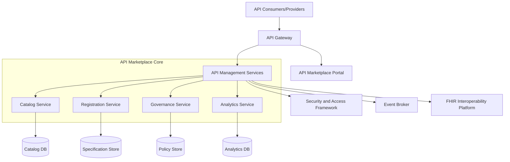
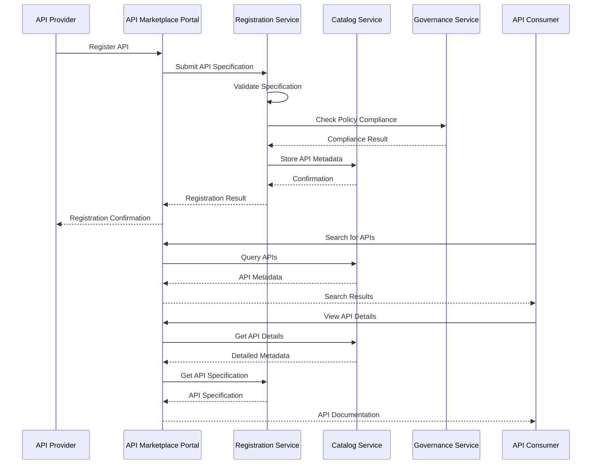
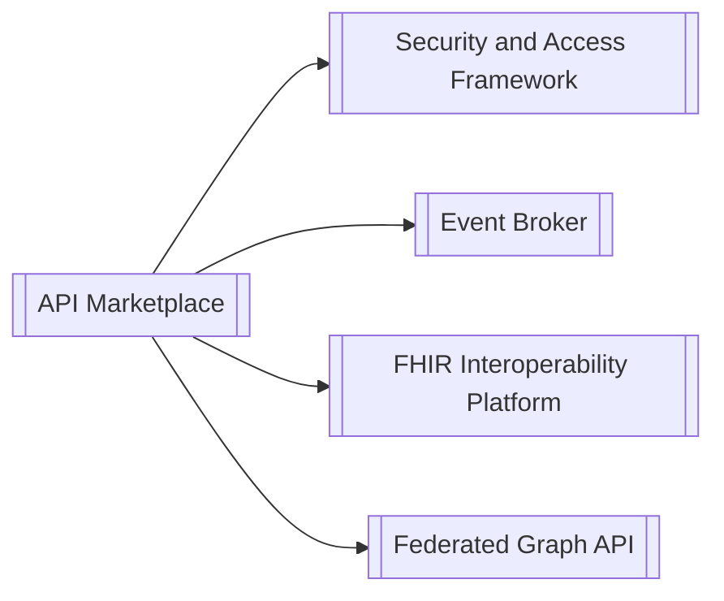

# API Marketplace Architecture

## Introduction

This document provides a detailed description of the API Marketplace architecture, design principles, and key architectural decisions. The API Marketplace serves as a centralized platform for discovering, registering, and managing APIs across the healthcare organization, enabling efficient API governance and promoting API reuse.

## Architectural Overview

The API Marketplace follows a modular, microservices-based architecture that enables scalability, resilience, and flexibility. The architecture is designed to support the complete API lifecycle, from registration to retirement, while enforcing governance policies and providing comprehensive analytics.

## Component Structure

The API Marketplace consists of several key components, each responsible for specific functionality:

### API Marketplace Portal

The API Marketplace Portal provides a web-based user interface for API consumers and providers. It enables:

- Browsing and searching the API catalog
- Viewing API documentation and specifications
- Registering and managing APIs
- Requesting and managing API access
- Viewing analytics and metrics

The portal is built using React with TypeScript, following a component-based architecture that enables customization and extension.

### Catalog Service

The Catalog Service manages the API catalog, which is the central repository of API metadata. It provides:

- API metadata storage and retrieval
- Search and filtering capabilities
- Categorization and tagging
- Version management

The Catalog Service exposes RESTful APIs for managing API metadata and uses a document database (MongoDB) for flexible schema evolution.

### Registration Service

The Registration Service handles the registration and validation of APIs. It provides:

- API specification parsing and validation
- Documentation generation
- Lifecycle management
- Approval workflows

The Registration Service supports multiple API specification formats, including OpenAPI, RAML, and GraphQL Schema. It uses a combination of file storage for specifications and a relational database for registration metadata.

### Governance Service

The Governance Service enforces governance policies and compliance requirements. It provides:

- Policy definition and enforcement
- Compliance checking
- Approval workflows
- Quality gate management

The Governance Service integrates with the Security and Access Framework for authentication and authorization, and uses a rules engine for policy evaluation.

### Analytics Service

The Analytics Service collects, processes, and visualizes API usage data. It provides:

- Usage metrics collection
- Performance monitoring
- Consumer insights
- Custom reporting

The Analytics Service uses a time-series database for efficient storage and retrieval of metrics data, and integrates with the Event Broker for real-time event processing.

## Data Flow

The following sequence diagram illustrates the data flow for key operations in the API Marketplace:

## Design Patterns

The API Marketplace implements several key design patterns to address architectural challenges:

### Microservices Pattern

The API Marketplace is built as a collection of loosely coupled, independently deployable services. This enables:

- Independent scaling of components
- Technology diversity
- Resilience through isolation
- Focused team ownership

### Event-Driven Architecture

The API Marketplace uses an event-driven architecture for asynchronous communication between components. This enables:

- Loose coupling
- Real-time updates
- Scalability
- Resilience

Events are published to the Event Broker and consumed by interested services.

### API Gateway Pattern

The API Marketplace uses an API Gateway to provide a unified entry point for all client interactions. This enables:

- Request routing
- Authentication and authorization
- Rate limiting
- Monitoring and analytics

### CQRS Pattern

The Command Query Responsibility Segregation (CQRS) pattern is used to separate read and write operations. This enables:

- Optimized data models for different use cases
- Scalability for read-heavy workloads
- Simplified complex domain models

## Technology Stack

The API Marketplace uses the following technology stack:

| Layer | Technologies |
|-------|---------------|
| Frontend | React, TypeScript, Material-UI |
| API | Node.js, Express, GraphQL, REST |
| Service | Node.js, TypeScript, NestJS |
| Data | MongoDB, PostgreSQL, Redis, Elasticsearch |
| Infrastructure | Docker, Kubernetes, Terraform |

## Integration Architecture

The API Marketplace integrates with other components of the CMM Reference Architecture:

### Integration with Security and Access Framework

The API Marketplace integrates with the Security and Access Framework for:

- Authentication and authorization
- Identity management
- Role-based access control
- API key management

The integration uses OAuth 2.0 and OpenID Connect protocols, with JWT tokens for secure communication.

### Integration with Event Broker

The API Marketplace integrates with the Event Broker for:

- Publishing API lifecycle events
- Real-time analytics
- Asynchronous processing
- Event-driven workflows

The integration uses a publish-subscribe pattern with JSON messages.

### Integration with FHIR Interoperability Platform

The API Marketplace integrates with the FHIR Interoperability Platform for:

- FHIR API registration
- FHIR resource validation
- FHIR API discovery
- Healthcare data categorization

The integration uses RESTful APIs and FHIR-specific metadata.

## Scalability and Performance

The API Marketplace is designed for scalability and high performance:

### Scalability Approach

- Horizontal scaling of stateless services
- Database sharding for large datasets
- Caching for frequently accessed data
- Asynchronous processing for long-running operations

### Performance Considerations

- API response time optimization
- Efficient search algorithms
- Database query optimization
- Content delivery network (CDN) for static assets

## Security Architecture

The API Marketplace implements a comprehensive security architecture:

### Authentication and Authorization

- OAuth 2.0 and OpenID Connect for authentication
- Role-based access control for authorization
- API key management for API access
- Fine-grained permission model

### Data Protection

- Encryption of sensitive data at rest
- TLS for data in transit
- PII/PHI identification and protection
- Data masking for sensitive fields

### Audit and Compliance

- Comprehensive audit logging
- Compliance checking for regulatory requirements
- Security policy enforcement
- Vulnerability scanning

## Resilience and Fault Tolerance

The API Marketplace is designed for resilience and fault tolerance:

### Error Handling

- Graceful degradation
- Comprehensive error logging
- User-friendly error messages
- Retry mechanisms for transient failures

### Circuit Breaking

- Circuit breakers for external dependencies
- Fallback mechanisms
- Timeout management
- Bulkhead pattern for isolation

### Retry and Backoff Strategies

- Exponential backoff for retries
- Jitter to prevent thundering herd
- Maximum retry limits
- Deadletter queues for failed operations

## Deployment Architecture

The API Marketplace is designed for flexible deployment:

- Containerized deployment with Docker
- Orchestration with Kubernetes
- Infrastructure as Code with Terraform
- CI/CD pipeline for automated deployment

For detailed deployment instructions, see the [Deployment Guide](../05-operations/deployment.md).

## Key Architectural Decisions

| Decision | Alternatives Considered | Rationale |
|----------|-------------------------|------------|
| Microservices Architecture | Monolithic, Serverless | Microservices provide the right balance of modularity, scalability, and team autonomy for a complex platform like the API Marketplace. |
| Document Database for Catalog | Relational, Graph | A document database provides the flexibility needed for evolving API metadata schemas and efficient querying of nested structures. |
| Event-Driven Communication | Synchronous API calls, Batch processing | Event-driven communication enables loose coupling, real-time updates, and resilience in a distributed system. |
| React for Frontend | Angular, Vue.js | React provides a component-based architecture, strong ecosystem, and performance benefits for a complex UI like the API Marketplace Portal. |
| GraphQL for Portal API | REST, gRPC | GraphQL enables flexible, efficient data fetching for the portal, reducing over-fetching and under-fetching of data. |

## Related Documentation

- [API Marketplace Overview](./overview.md)
- [Key Concepts](./key-concepts.md)
- [API Registration](../02-core-functionality/api-registration.md)
- [API Discovery](../02-core-functionality/api-discovery.md)
- [Deployment Guide](../05-operations/deployment.md)
