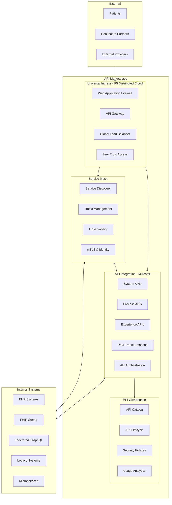

# API Marketplace

## Introduction

The API Marketplace is a comprehensive suite of integration technologies that enables seamless connectivity, security, and management of services across the CMM Reference Architecture. This marketplace approach combines best-of-breed solutions including F5 Distributed Cloud App Connect for universal ingress, a modern service mesh implementation, and Mulesoft for API integration and management. Together, these technologies provide a robust foundation for managing both internal and external APIs, securing service-to-service communication, and enabling consistent access to applications regardless of where they are deployed.

## Key Concepts

### Comprehensive Integration Strategy

The API Marketplace implements a multi-layered approach to integration:

- **Universal Ingress Layer**: Secure, consistent entry points for all external traffic
- **Service Mesh Layer**: Managed service-to-service communication within the platform
- **API Integration Layer**: Transformation, orchestration, and management of APIs
- **API Governance Layer**: Standardization, security, and lifecycle management

This layered approach ensures that each integration concern is addressed by the most appropriate technology while maintaining a cohesive overall architecture.

### Components of the API Marketplace

#### Universal Ingress with F5 Distributed Cloud App Connect

F5 Distributed Cloud App Connect provides a modern, cloud-native approach to application connectivity and security:

- **Multi-Cloud Ingress**: Consistent ingress control across any environment (cloud, on-premises, edge)
- **Zero Trust Security**: Identity-aware access with continuous authentication and authorization
- **DDoS Protection**: Advanced protection against distributed denial of service attacks
- **Web Application Firewall**: Protection against OWASP Top 10 and other application vulnerabilities
- **Global Load Balancing**: Intelligent traffic distribution across multiple environments
- **API Security**: Specialized protection for API endpoints

#### Service Mesh Architecture

The service mesh provides a dedicated infrastructure layer for facilitating service-to-service communications:

- **Traffic Management**: Advanced routing, load balancing, and traffic shaping
- **Observability**: Comprehensive metrics, logs, and traces for all service interactions
- **Security**: Mutual TLS encryption, identity-based authentication, and fine-grained authorization
- **Reliability**: Circuit breaking, retries, timeouts, and fault injection
- **Policy Enforcement**: Centralized policy management and enforcement

#### API Integration with Mulesoft

Mulesoft Anypoint Platform provides comprehensive capabilities for API-led integration:

- **API-Led Connectivity**: Layered approach to integration (System, Process, Experience APIs)
- **Integration Patterns**: Pre-built templates for common healthcare integration scenarios
- **Data Transformation**: Powerful tools for mapping between different data formats
- **Connector Ecosystem**: Pre-built connectors for healthcare systems and standards
- **Healthcare Accelerators**: Industry-specific assets and best practices

## Architecture Overview

## Key Features

### Universal Ingress Capabilities

#### Multi-Environment Connectivity

F5 Distributed Cloud App Connect provides seamless connectivity across diverse environments:

- **Cloud-Agnostic Deployment**: Consistent deployment across AWS, Azure, GCP, and private clouds
- **Edge Computing Support**: Extend connectivity to edge locations for latency-sensitive applications
- **Hybrid Architecture**: Bridge on-premises and cloud environments with consistent policies
- **Multi-Region Deployment**: Global presence with regional compliance capabilities
- **Centralized Management**: Single control plane for all connectivity services

#### Advanced Security Controls

Comprehensive security at the ingress layer:

- **Zero Trust Network Access**: Identity-based access with least privilege principles
- **Bot Defense**: Protection against automated threats and credential stuffing
- **API Security**: Schema validation, rate limiting, and threat protection
- **Healthcare-Specific Rules**: Pre-configured protection for healthcare applications
- **Compliance Controls**: Built-in controls for HIPAA, HITRUST, and other regulations

#### Intelligent Traffic Management

Sophisticated traffic routing and management:

- **Global Load Balancing**: Distribute traffic across regions based on availability and performance
- **Health Monitoring**: Continuous monitoring of backend service health
- **Progressive Delivery**: Support for canary deployments and blue/green strategies
- **Traffic Shaping**: Rate limiting and prioritization for critical healthcare workloads
- **Disaster Recovery**: Automated failover during outages

### Service Mesh Capabilities

#### Service-to-Service Communication

Secure and reliable communication between services:

- **Service Discovery**: Automatic discovery of services across the platform
- **Load Balancing**: Client-side load balancing with health awareness
- **Circuit Breaking**: Prevent cascading failures with circuit breaker patterns
- **Retries and Timeouts**: Configurable retry policies and timeout settings
- **Fault Injection**: Test resilience through simulated faults

#### Security and Identity

Comprehensive security for internal service communication:

- **Mutual TLS**: Automatic encryption for all service-to-service communication
- **Identity-Based Security**: Fine-grained access control based on service identity
- **Certificate Management**: Automated certificate rotation and management
- **Authorization Policies**: Granular control over which services can communicate
- **Secure Configuration**: Centralized security policy management

#### Observability

Comprehensive visibility into service interactions:

- **Distributed Tracing**: End-to-end tracing of requests across services
- **Metrics Collection**: Detailed performance and health metrics
- **Logging**: Centralized logging of service interactions
- **Visualization**: Dashboards for service topology and health
- **Anomaly Detection**: Identification of unusual patterns and potential issues

### API Integration Capabilities

#### API-Led Connectivity

Mulesoft's layered approach to API integration:

- **System APIs**: Abstract underlying systems and provide access to core data
- **Process APIs**: Orchestrate and combine multiple System APIs for business processes
- **Experience APIs**: Tailored for specific user experiences and channels
- **Reusable Assets**: Build once, use many times approach
- **Decoupled Architecture**: Reduced dependencies between systems

#### Healthcare Integration

Specialized capabilities for healthcare data integration:

- **FHIR Integration**: Native support for FHIR R4 resources and operations
- **HL7 v2 Processing**: Parsing, validation, and transformation of HL7 messages
- **C-CDA Document Handling**: Processing of clinical document architecture files
- **X12 EDI Support**: Processing of healthcare claims and administrative transactions
- **DICOM Integration**: Connectivity with imaging systems

#### API Lifecycle Management

Comprehensive management of the entire API lifecycle:

- **API Design**: OpenAPI and RAML-based API design tools
- **API Implementation**: Development tools for building and testing APIs
- **API Deployment**: Automated deployment across environments
- **API Promotion**: Controlled promotion between environments
- **API Retirement**: Managed deprecation and retirement processes

## Integration Patterns

### North-South Integration (External Traffic)

Patterns for managing external traffic entering the platform:

- **API Gateway Pattern**: Centralized entry point for all API traffic
- **BFF (Backend for Frontend) Pattern**: Purpose-built APIs for specific frontends
- **OAuth 2.0 Flow**: Standardized authentication and authorization
- **Rate Limiting Pattern**: Protection against traffic spikes and abuse
- **API Composition**: Aggregating multiple backend services into unified APIs

### East-West Integration (Service-to-Service)

Patterns for communication between internal services:

- **Service Discovery Pattern**: Dynamic location of services
- **Circuit Breaker Pattern**: Preventing cascading failures
- **Bulkhead Pattern**: Isolating failures to protect the system
- **Sidecar Pattern**: Consistent service mesh implementation
- **Saga Pattern**: Managing distributed transactions

### Healthcare-Specific Patterns

Integration patterns specific to healthcare scenarios:

- **Patient Data Integration**: Aggregating patient data from multiple sources
- **Clinical Workflow Integration**: Supporting complex clinical processes
- **Claims Processing**: End-to-end claims submission and processing
- **Referral Management**: Coordinating care across providers
- **Population Health**: Aggregating and analyzing population-level data

## Implementation Considerations

### Deployment Strategy

Considerations for deploying the API Marketplace:

- **Phased Approach**: Incremental implementation starting with highest-value components
- **Environment Strategy**: Development, testing, and production environments
- **Hybrid Deployment**: Balancing cloud and on-premises components
- **Regional Considerations**: Data residency and latency requirements
- **Disaster Recovery**: Multi-region resilience planning

### Governance Model

Establishing effective governance for the API Marketplace:

- **API Governance**: Standards for API design, security, and documentation
- **Service Mesh Governance**: Policies for service communication and security
- **Integration Standards**: Guidelines for building and deploying integrations
- **Security Policies**: Standardized security controls across integration points
- **Monitoring and Alerting**: Consistent observability practices

### Organizational Readiness

Preparing the organization for successful implementation:

- **Skills Assessment**: Evaluate current integration capabilities
- **Training Needs**: Identify training requirements for different roles
- **Center of Excellence**: Consider establishing an integration CoE
- **Operating Model**: Define roles and responsibilities for ongoing operations
- **Change Management**: Plan for organizational change

## Healthcare Use Cases

### Patient Data Access

Providing secure access to patient data across systems:

- **Patient Portal Integration**: Connect patient-facing applications with clinical systems
- **Mobile Health Applications**: Enable secure mobile access to health data
- **Third-Party Application Access**: Support for SMART on FHIR applications
- **Research Data Access**: Secure access to de-identified data for research
- **Emergency Access**: Special protocols for emergency care scenarios

### Clinical System Integration

Connecting diverse clinical systems for comprehensive care:

- **EHR Integration**: Bidirectional data exchange with EHR systems
- **Lab System Connectivity**: Order and result interfaces with laboratory systems
- **Radiology Integration**: Connect with PACS and RIS systems
- **Pharmacy Systems**: Medication order and dispensing integration
- **Medical Device Integration**: Connect with bedside and monitoring devices

### Healthcare Partner Collaboration

Enabling secure collaboration with external healthcare partners:

- **Health Information Exchange**: Participation in regional and national HIEs
- **Payer Integration**: Streamlined communication with insurance providers
- **Referral Networks**: Coordination with referring providers
- **Supply Chain Integration**: Connection with healthcare suppliers
- **Research Collaboration**: Secure data sharing for clinical research

## Getting Started

To begin working with the API Marketplace:

1. Review the [Setup Guide](setup-guide.md) for environment configuration
2. Understand [F5 Distributed Cloud Configuration](../02-core-functionality/f5-distributed-cloud-configuration.md) for universal ingress
3. Learn about [Service Mesh Implementation](../02-core-functionality/service-mesh-implementation.md) for service-to-service communication
4. Explore [Mulesoft Integration Patterns](../02-core-functionality/mulesoft-integration-patterns.md) for API integration
5. Review [API Governance Framework](../03-advanced-patterns/api-governance-framework.md) for standardization and security

## Related Components

- [Security and Access Framework](../../security-and-access-framework/01-getting-started/overview.md): Integrates with the marketplace for authentication and authorization
- [Federated GraphQL API](../../federated-graph-api/01-getting-started/overview.md): Exposed through the API Marketplace
- [FHIR Server](../../fhir-server/01-getting-started/overview.md): Connected through Mulesoft and service mesh

## Next Steps

- [Setup Guide](setup-guide.md): Configure the API Marketplace for your environment
- [F5 Distributed Cloud Configuration](../02-core-functionality/f5-distributed-cloud-configuration.md): Implement universal ingress
- [Service Mesh Implementation](../02-core-functionality/service-mesh-implementation.md): Deploy and configure the service mesh
- [Mulesoft Integration Patterns](../02-core-functionality/mulesoft-integration-patterns.md): Implement API integration patterns
