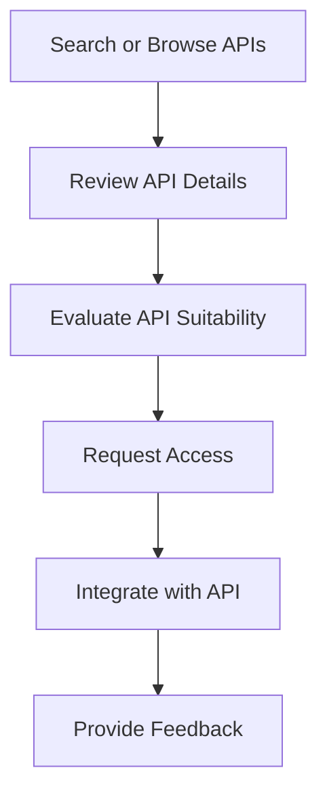

# API Discovery

## Introduction

This document describes the API discovery functionality of the API Marketplace component in the CMM Technology Platform. API discovery enables consumers to find, evaluate, and understand APIs available within the organization, promoting API reuse and reducing duplication of effort.

## API Discovery Process

The API discovery process involves several steps that help consumers find the right APIs for their needs:



### Step 1: Search or Browse APIs

Consumers can discover APIs through multiple methods:

- **Search**: Using keywords, tags, or specific criteria
- **Browse**: Navigating through categories, domains, or other classifications
- **Recommendations**: Based on user profile, usage patterns, or organizational role
- **Featured APIs**: Highlighted by the API governance team

### Step 2: Review API Details

Consumers can view detailed information about an API:

- API description and purpose
- Technical documentation and specifications
- Version information and lifecycle status
- Usage metrics and performance indicators
- Consumer reviews and ratings

### Step 3: Evaluate API Suitability

Consumers evaluate whether the API meets their requirements:

- Functional capabilities
- Performance characteristics
- Security and compliance features
- Service level agreements
- Support and maintenance commitments

### Step 4: Request Access

If the API requires explicit access approval, consumers can request access:

- Submit access request with justification
- Accept terms of service and usage agreements
- Receive API credentials or access tokens
- Set up subscription and usage limits

### Step 5: Integrate with API

Consumers integrate the API into their applications:

- Download client SDKs or code samples
- Configure authentication and authorization
- Test connectivity and functionality
- Implement error handling and resilience patterns

### Step 6: Provide Feedback

Consumers provide feedback on their experience with the API:

- Rate the API quality and usability
- Submit improvement suggestions
- Report issues or bugs
- Share use cases and success stories

## API Discovery Features

### Search Capabilities

The API Marketplace provides powerful search capabilities to help consumers find relevant APIs:

#### Full-Text Search

Full-text search across all API metadata, including:

- API name and description
- Documentation content
- Tags and categories
- Operation names and descriptions
- Parameter and response descriptions

```typescript
// Example: Full-text search
import { ApiMarketplaceClient } from '@cmm/api-marketplace-client';

async function searchApis(query: string) {
  const client = new ApiMarketplaceClient({
    baseUrl: 'https://api-marketplace.example.com',
    apiKey: 'your-api-key'
  });
  
  const results = await client.apis.search({
    query: query,
    limit: 10,
    offset: 0
  });
  
  console.log(`Found ${results.total} APIs matching "${query}":`);
  results.items.forEach(api => {
    console.log(`- ${api.name} (v${api.version}): ${api.description}`);
  });
}

searchApis('patient demographics').catch(console.error);
```

#### Advanced Filtering

Advanced filtering options to narrow search results:

- API status (active, deprecated, etc.)
- API version
- API owner or team
- Technical characteristics (REST, GraphQL, etc.)
- Security requirements
- Performance characteristics
- Compliance certifications

```typescript
// Example: Advanced filtering
import { ApiMarketplaceClient } from '@cmm/api-marketplace-client';

async function findApis() {
  const client = new ApiMarketplaceClient({
    baseUrl: 'https://api-marketplace.example.com',
    apiKey: 'your-api-key'
  });
  
  const results = await client.apis.search({
    filters: {
      categories: ['Clinical'],
      tags: ['patient', 'demographics'],
      status: ['active'],
      owner: 'Clinical Data Team',
      apiType: 'REST',
      containsPhi: true,
      regulatoryScope: ['HIPAA']
    },
    limit: 10,
    offset: 0
  });
  
  console.log(`Found ${results.total} APIs matching filters:`);
  results.items.forEach(api => {
    console.log(`- ${api.name} (v${api.version}): ${api.description}`);
  });
}

findApis().catch(console.error);
```

#### Semantic Search

Semantic search capabilities to find APIs based on meaning rather than exact keyword matches:

- Natural language query understanding
- Synonym recognition
- Domain-specific terminology mapping
- Intent-based matching

```typescript
// Example: Semantic search
import { ApiMarketplaceClient } from '@cmm/api-marketplace-client';

async function semanticSearch(query: string) {
  const client = new ApiMarketplaceClient({
    baseUrl: 'https://api-marketplace.example.com',
    apiKey: 'your-api-key'
  });
  
  const results = await client.apis.semanticSearch({
    query: query,
    limit: 10,
    offset: 0
  });
  
  console.log(`Found ${results.total} APIs semantically matching "${query}":`);
  results.items.forEach(api => {
    console.log(`- ${api.name} (v${api.version}): ${api.description}`);
    console.log(`  Relevance score: ${api.relevanceScore}`);
  });
}

semanticSearch('APIs for getting patient information').catch(console.error);
```

### Browsing and Navigation

The API Marketplace provides intuitive browsing and navigation features:

#### Categorization

Multi-dimensional categorization of APIs:

- Business domains (Clinical, Administrative, Financial, etc.)
- Technical categories (REST, GraphQL, Event-driven, etc.)
- Functional areas (Patient, Provider, Claims, etc.)
- Data domains (Clinical, Administrative, Reference, etc.)

#### Tag-Based Navigation

Tag-based navigation to explore related APIs:

- Standard tags for consistent categorization
- Custom tags for specific use cases or projects
- Tag clouds to visualize popular topics
- Related tags to expand discovery

#### Hierarchical Navigation

Hierarchical navigation structures:

- Organization by business unit or department
- Grouping by system or platform
- Classification by data domain
- Categorization by user role or persona

### API Details and Documentation

The API Marketplace provides comprehensive API details and documentation:

#### API Overview

High-level overview of each API:

- Purpose and business value
- Key features and capabilities
- Target audience and use cases
- Version information and lifecycle status
- Owner and support contacts

#### Technical Documentation

Detailed technical documentation:

- Interactive API reference (Swagger UI, GraphQL Playground, etc.)
- Authentication and authorization requirements
- Request and response examples
- Error codes and handling
- Rate limits and quotas

#### Usage Metrics

Usage metrics to evaluate API popularity and performance:

- Call volume trends
- Error rates
- Response times
- Consumer adoption
- SLA compliance

#### Consumer Reviews

Consumer feedback and ratings:

- Overall satisfaction rating
- Ease of use rating
- Documentation quality rating
- Support responsiveness rating
- Written reviews and testimonials

## API Discovery API

The API Marketplace provides a RESTful API for programmatic discovery of APIs:

### Search APIs

```http
GET /api/v1/apis/search?query=patient&limit=10&offset=0
Authorization: Bearer {token}
```

### Get API Details

```http
GET /api/v1/apis/{apiId}
Authorization: Bearer {token}
```

### Get API Specification

```http
GET /api/v1/apis/{apiId}/specification
Accept: application/json
Authorization: Bearer {token}
```

### Get API Documentation

```http
GET /api/v1/apis/{apiId}/documentation
Authorization: Bearer {token}
```

### Get API Metrics

```http
GET /api/v1/apis/{apiId}/metrics
Authorization: Bearer {token}
```

## Implementation Example

The following example demonstrates how to discover APIs programmatically using the TypeScript SDK:

```typescript
import { ApiMarketplaceClient } from '@cmm/api-marketplace-client';

async function discoverApis() {
  // Initialize the client
  const client = new ApiMarketplaceClient({
    baseUrl: 'https://api-marketplace.example.com',
    apiKey: 'your-api-key'
  });
  
  // Search for APIs
  console.log('Searching for patient-related APIs...');
  const searchResults = await client.apis.search({
    query: 'patient',
    filters: {
      status: ['active'],
      categories: ['Clinical']
    },
    limit: 5
  });
  
  console.log(`Found ${searchResults.total} APIs. Showing top 5:`);
  
  // Get details for each API
  for (const apiSummary of searchResults.items) {
    console.log(`\n=== ${apiSummary.name} (v${apiSummary.version}) ===`);
    console.log(`Description: ${apiSummary.description}`);
    
    // Get full API details
    const apiDetails = await client.apis.getDetails(apiSummary.id);
    
    console.log('Owner:', apiDetails.owner);
    console.log('Status:', apiDetails.status);
    console.log('Tags:', apiDetails.tags.join(', '));
    console.log('Documentation URL:', apiDetails.documentationUrl);
    
    // Get API metrics
    const metrics = await client.apis.getMetrics(apiSummary.id);
    console.log('Average Response Time:', `${metrics.averageResponseTimeMs}ms`);
    console.log('Call Volume (30 days):', metrics.callVolume30Days);
    console.log('Error Rate (30 days):', `${metrics.errorRate30Days}%`);
    
    // Get API specification summary
    const spec = await client.apis.getSpecificationSummary(apiSummary.id);
    console.log('API Type:', spec.type);
    console.log('Endpoints:', spec.endpointCount);
    console.log('Operations:', spec.operationCount);
    
    // Check if access request is required
    if (apiDetails.accessRequestRequired) {
      console.log('\nAccess request required for this API');
      console.log('Request access at:', `https://api-marketplace.example.com/apis/${apiSummary.id}/request-access`);
    } else {
      console.log('\nNo access request required for this API');
    }
  }
}

discoverApis().catch(console.error);
```

## Healthcare-Specific Considerations

### FHIR API Discovery

The API Marketplace provides specialized discovery features for FHIR APIs:

- FHIR resource type filtering
- FHIR operation filtering
- FHIR version filtering
- FHIR implementation guide compliance filtering
- FHIR capability statement exploration

Example FHIR-specific search:

```typescript
// Example: FHIR-specific search
import { ApiMarketplaceClient } from '@cmm/api-marketplace-client';

async function findFhirApis() {
  const client = new ApiMarketplaceClient({
    baseUrl: 'https://api-marketplace.example.com',
    apiKey: 'your-api-key'
  });
  
  const results = await client.apis.search({
    filters: {
      apiType: 'FHIR',
      fhirVersion: ['4.0.1'],
      fhirResources: ['Patient', 'Observation'],
      fhirOperations: ['search', 'read'],
      implementationGuides: ['hl7.fhir.us.core']
    },
    limit: 10,
    offset: 0
  });
  
  console.log(`Found ${results.total} FHIR APIs matching criteria:`);
  results.items.forEach(api => {
    console.log(`- ${api.name} (v${api.version}): ${api.description}`);
  });
}

findFhirApis().catch(console.error);
```

### Healthcare Compliance Discovery

The API Marketplace supports discovery based on healthcare compliance requirements:

- Regulatory framework filtering (HIPAA, GDPR, etc.)
- Data classification filtering (PHI, PII, etc.)
- Security certification filtering (HITRUST, SOC 2, etc.)
- Privacy impact assessment status

Example compliance-focused search:

```typescript
// Example: Compliance-focused search
import { ApiMarketplaceClient } from '@cmm/api-marketplace-client';

async function findCompliantApis() {
  const client = new ApiMarketplaceClient({
    baseUrl: 'https://api-marketplace.example.com',
    apiKey: 'your-api-key'
  });
  
  const results = await client.apis.search({
    filters: {
      regulatoryScope: ['HIPAA', 'GDPR'],
      securityCertifications: ['HITRUST'],
      dataClassification: {
        containsPhi: false,
        sensitivityLevel: ['public', 'internal']
      },
      privacyImpactAssessment: 'completed'
    },
    limit: 10,
    offset: 0
  });
  
  console.log(`Found ${results.total} compliant APIs:`);
  results.items.forEach(api => {
    console.log(`- ${api.name} (v${api.version}): ${api.description}`);
  });
}

findCompliantApis().catch(console.error);
```

## API Discovery Personalization

The API Marketplace provides personalized discovery experiences based on user context:

### Role-Based Recommendations

Recommendations based on user role:

- Developer-focused recommendations
- Architect-focused recommendations
- Business analyst-focused recommendations
- Department or team-specific recommendations

### Usage-Based Recommendations

Recommendations based on usage patterns:

- "APIs you might be interested in"
- "Popular APIs in your department"
- "APIs used in similar projects"
- "APIs frequently used with your current APIs"

### Saved Searches and Favorites

Personalized organization of discovered APIs:

- Saved search queries
- Favorite APIs
- Custom collections
- Recently viewed APIs

## Best Practices

### Effective API Discovery

- Start with clear requirements for what you need
- Use specific search terms related to functionality
- Evaluate multiple APIs before making a decision
- Consider API maturity and adoption metrics
- Check for healthcare-specific compliance features

### API Evaluation Criteria

- Functional completeness for your use case
- Performance characteristics and SLAs
- Security and compliance features
- Documentation quality and completeness
- Support availability and responsiveness
- Community adoption and feedback

### Integration Planning

- Test API functionality in a sandbox environment
- Implement proper error handling and resilience
- Plan for version changes and deprecations
- Monitor API usage and performance
- Establish communication channels with API providers

## Related Documentation

- [API Registration](./api-registration.md)
- [API Lifecycle Management](../04-governance-compliance/lifecycle-management.md)
- [API Versioning Policy](../04-governance-compliance/versioning-policy.md)
- [Data Quality](../04-governance-compliance/data-quality.md)
