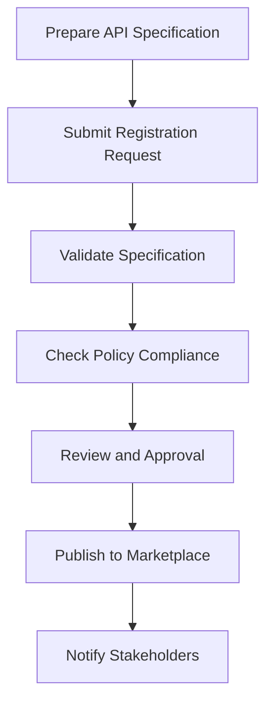

# API Registration

## Introduction

This document describes the API registration functionality of the API Marketplace component in the CMM Reference Architecture. API registration is the process by which API providers publish their APIs to the marketplace, making them discoverable and usable by consumers across the healthcare organization.

## API Registration Process

The API registration process consists of several steps that ensure APIs are properly documented, validated, and governed before they are published to the marketplace.



### Step 1: Prepare API Specification

API providers must prepare a formal API specification using one of the supported formats:

- OpenAPI (Swagger) 3.0 or later
- GraphQL Schema
- AsyncAPI 2.0 or later
- RAML 1.0

The specification must include:

- Complete endpoint definitions
- Request and response schemas
- Authentication requirements
- Error responses
- Examples

### Step 2: Submit Registration Request

API providers submit a registration request through the API Marketplace Portal or API. The request includes:

- API specification file or URL
- API metadata (name, description, version, etc.)
- Contact information
- Documentation links
- Tags and categories

### Step 3: Validate Specification

The system automatically validates the API specification for:

- Syntax correctness
- Semantic validity
- Completeness
- Adherence to organizational standards

### Step 4: Check Policy Compliance

The system checks the API against organizational policies for:

- Security requirements
- Naming conventions
- Documentation standards
- Performance expectations
- Compliance requirements

### Step 5: Review and Approval

Depending on the organization's governance model, the API may require manual review and approval by:

- API governance team
- Security team
- Compliance officers
- Domain experts

### Step 6: Publish to Marketplace

Once approved, the API is published to the marketplace, making it:

- Discoverable in the API catalog
- Available for subscription requests
- Included in the API documentation portal

### Step 7: Notify Stakeholders

The system notifies relevant stakeholders about the new API, including:

- API governance team
- Potential consumers based on tags and categories
- Monitoring and operations teams

## API Metadata Requirements

The following metadata is required for all APIs registered in the marketplace:

| Metadata Field | Description | Required | Example |
|----------------|-------------|----------|--------|
| Name | Unique name of the API | Yes | Patient Demographics API |
| Description | Brief description of the API's purpose | Yes | Provides access to patient demographic information |
| Version | API version following semantic versioning | Yes | 1.2.3 |
| Owner | Team or individual responsible for the API | Yes | Clinical Data Team |
| Contact Email | Email address for API support | Yes | api-support@example.com |
| Tags | Keywords for categorization and search | Yes | patient, demographics, clinical |
| Categories | Predefined categories for organization | Yes | Clinical, Patient |
| Status | Current lifecycle status | Yes | Active |
| Documentation URL | Link to additional documentation | No | https://docs.example.com/patient-api |
| Terms of Service | Link to terms of service | No | https://terms.example.com/api-terms |
| License | License information | No | Apache 2.0 |

## API Specification Validation

The API Marketplace validates API specifications against a set of rules to ensure quality and consistency:

### Syntax Validation

- Correct format according to specification standard
- No syntax errors or invalid references
- Valid JSON or YAML structure

### Semantic Validation

- Consistent data types and formats
- Valid references between components
- Proper use of specification features

### Organizational Standards

- Naming conventions for paths, parameters, and schemas
- Required security schemes
- Standard error response formats
- Required documentation elements

## API Registration API

The API Marketplace provides a RESTful API for programmatic registration of APIs:

### Register API

```http
POST /api/v1/apis
Content-Type: application/json
Authorization: Bearer {token}

{
  "name": "Patient Demographics API",
  "description": "Provides access to patient demographic information",
  "version": "1.2.3",
  "owner": "Clinical Data Team",
  "contactEmail": "api-support@example.com",
  "tags": ["patient", "demographics", "clinical"],
  "categories": ["Clinical", "Patient"],
  "status": "Active",
  "specification": {
    "format": "openapi",
    "content": "...OpenAPI specification content..."
  }
}
```

### Update API

```http
PUT /api/v1/apis/{apiId}
Content-Type: application/json
Authorization: Bearer {token}

{
  "name": "Patient Demographics API",
  "description": "Updated description",
  "version": "1.2.4",
  "owner": "Clinical Data Team",
  "contactEmail": "api-support@example.com",
  "tags": ["patient", "demographics", "clinical", "new-tag"],
  "categories": ["Clinical", "Patient"],
  "status": "Active",
  "specification": {
    "format": "openapi",
    "content": "...Updated OpenAPI specification content..."
  }
}
```

### Get API Details

```http
GET /api/v1/apis/{apiId}
Authorization: Bearer {token}
```

### Delete API

```http
DELETE /api/v1/apis/{apiId}
Authorization: Bearer {token}
```

## Implementation Example

The following example demonstrates how to register an API programmatically using the TypeScript SDK:

```typescript
import { ApiMarketplaceClient } from '@cmm/api-marketplace-client';
import * as fs from 'fs';

async function registerApi() {
  // Initialize the client
  const client = new ApiMarketplaceClient({
    baseUrl: 'https://api-marketplace.example.com',
    apiKey: 'your-api-key'
  });
  
  // Read the OpenAPI specification file
  const specificationContent = fs.readFileSync('patient-api.yaml', 'utf8');
  
  // Register the API
  try {
    const result = await client.apis.register({
      name: 'Patient Demographics API',
      description: 'Provides access to patient demographic information',
      version: '1.2.3',
      owner: 'Clinical Data Team',
      contactEmail: 'api-support@example.com',
      tags: ['patient', 'demographics', 'clinical'],
      categories: ['Clinical', 'Patient'],
      status: 'Active',
      specification: {
        format: 'openapi',
        content: specificationContent
      }
    });
    
    console.log('API registered successfully:', result.apiId);
    console.log('Registration status:', result.status);
    
    if (result.validationIssues && result.validationIssues.length > 0) {
      console.warn('Validation issues:');
      result.validationIssues.forEach(issue => {
        console.warn(`- ${issue.severity}: ${issue.message} (${issue.location})`);
      });
    }
  } catch (error) {
    console.error('API registration failed:', error.message);
    if (error.validationErrors) {
      console.error('Validation errors:');
      error.validationErrors.forEach(err => {
        console.error(`- ${err.field}: ${err.message}`);
      });
    }
  }
}

registerApi().catch(console.error);
```

## Healthcare-Specific Considerations

### FHIR API Registration

For FHIR APIs, the API Marketplace provides specialized registration features:

- Automatic detection of FHIR resources and operations
- FHIR capability statement validation
- FHIR implementation guide compliance checking
- FHIR-specific metadata fields

Example FHIR-specific metadata:

```json
{
  "fhirVersion": "4.0.1",
  "implementationGuides": ["hl7.fhir.us.core|3.1.1"],
  "supportedResources": ["Patient", "Observation", "Condition"],
  "supportedOperations": ["search", "read", "create", "update"],
  "patientCompartmentSupported": true
}
```

### Healthcare Data Classification

The API Marketplace supports healthcare-specific data classification for registered APIs:

- PHI/PII Data Classification: Indicates if the API handles protected health information
- Regulatory Scope: Indicates which regulations apply (HIPAA, GDPR, etc.)
- Data Sensitivity: Classification of data sensitivity (public, internal, confidential, restricted)

Example data classification metadata:

```json
{
  "dataClassification": {
    "containsPhi": true,
    "containsPii": true,
    "regulatoryScope": ["HIPAA", "GDPR"],
    "sensitivityLevel": "restricted",
    "dataCategories": ["clinical", "demographic"]
  }
}
```

## API Registration Workflows

The API Marketplace supports customizable registration workflows to accommodate different governance models:

### Self-Service Workflow

API providers can register and publish APIs with minimal oversight:

1. Provider registers API
2. System validates specification
3. API is automatically published if validation passes
4. Post-publication review may occur

### Governance-Controlled Workflow

API registration requires explicit approval:

1. Provider registers API
2. System validates specification
3. Governance team reviews and approves/rejects
4. API is published after approval

### Hybrid Workflow

Approval requirements depend on API characteristics:

1. Provider registers API
2. System validates specification
3. System determines if approval is required based on rules
4. API is published automatically or after approval

## Best Practices

### API Specification Development

- Use design-first approach when possible
- Follow organizational API design guidelines
- Include comprehensive examples
- Document error scenarios and responses
- Use consistent naming conventions

### API Metadata Management

- Provide detailed, accurate descriptions
- Use consistent tagging strategy
- Keep contact information up-to-date
- Document version compatibility
- Include usage guidelines and examples

### API Lifecycle Management

- Plan for versioning from the beginning
- Document breaking vs. non-breaking changes
- Communicate deprecation plans early
- Provide migration guidance for consumers
- Maintain backward compatibility when possible

## Related Documentation

- [API Discovery](./api-discovery.md)
- [API Lifecycle Management](../04-governance-compliance/lifecycle-management.md)
- [API Versioning Policy](../04-governance-compliance/versioning-policy.md)
- [Data Governance](../04-governance-compliance/data-governance.md)
