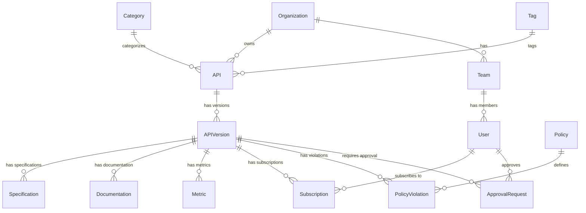
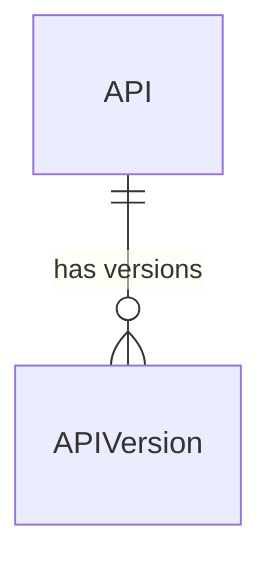
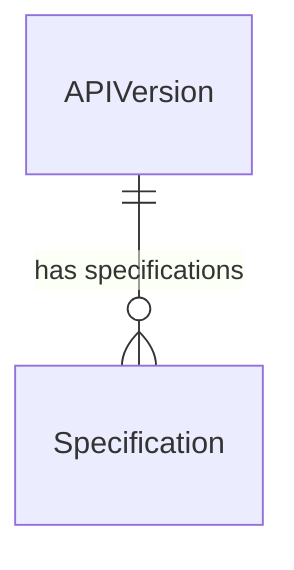
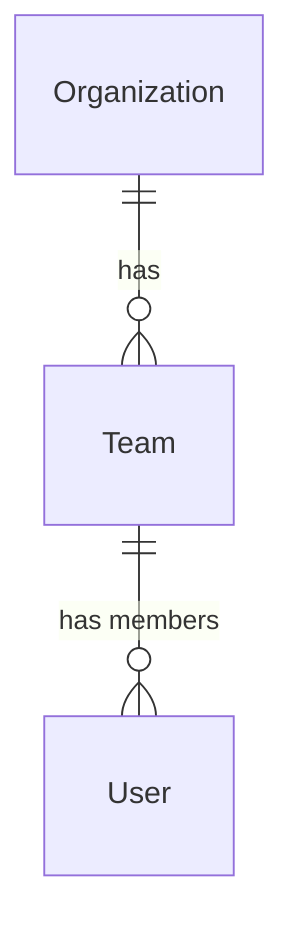
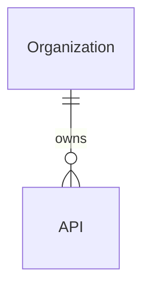
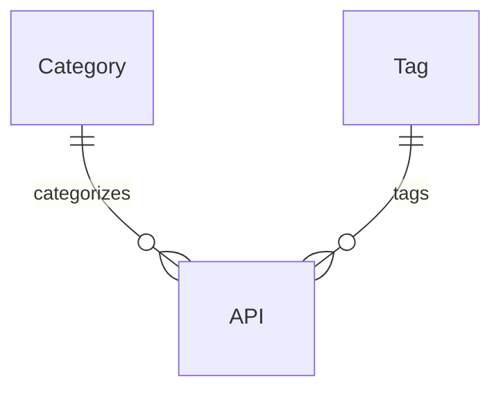
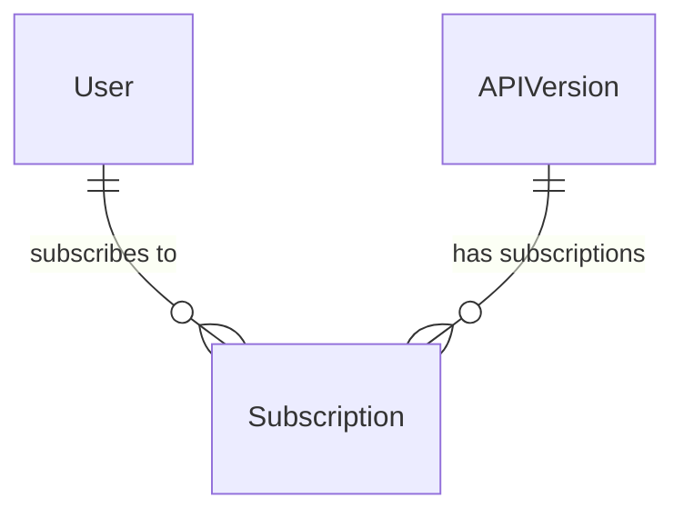
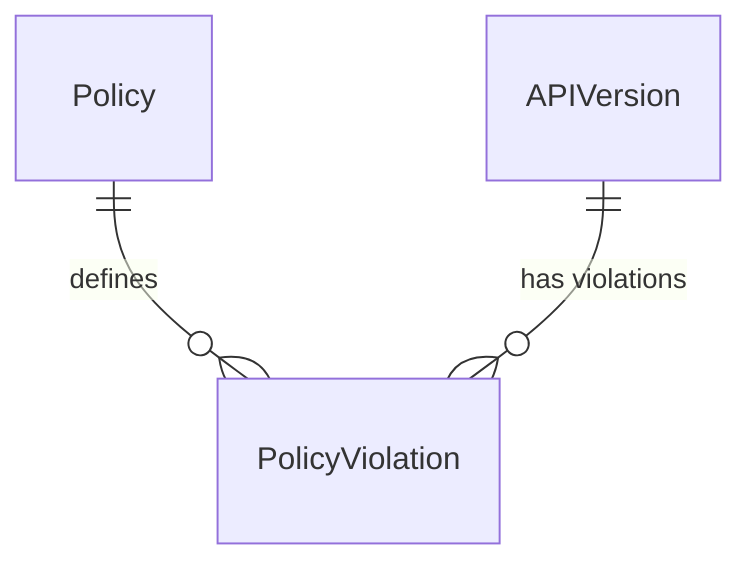

# API Marketplace Data Model

## Introduction

This document describes the data model for the API Marketplace component of the CMM Reference Architecture. The data model defines the structure, relationships, and constraints of the data stored and managed by the API Marketplace. Understanding this data model is essential for developers integrating with the API Marketplace, as well as for administrators and operators maintaining the system.

## Core Entities

The API Marketplace data model consists of several core entities that represent the fundamental concepts in the system.



### API

The API entity represents a logical API product in the marketplace.

| Field | Type | Description | Example |
|-------|------|-------------|--------|
| id | string | Unique identifier | "api-123" |
| name | string | Name of the API | "Patient Demographics API" |
| description | string | Description of the API | "Provides access to patient demographic information" |
| owner | reference | Reference to the owning organization or team | "team-456" |
| visibility | enum | Visibility level (public, private, restricted) | "public" |
| status | enum | Overall status of the API | "active" |
| tags | array of string | Tags associated with the API | ["patient", "demographics", "clinical"] |
| categories | array of reference | Categories the API belongs to | ["category-789", "category-101"] |
| createdAt | datetime | Creation timestamp | "2023-01-15T12:30:45Z" |
| updatedAt | datetime | Last update timestamp | "2023-03-20T09:15:30Z" |

### APIVersion

The APIVersion entity represents a specific version of an API.

| Field | Type | Description | Example |
|-------|------|-------------|--------|
| id | string | Unique identifier | "api-version-234" |
| apiId | reference | Reference to the parent API | "api-123" |
| version | string | Version string following semantic versioning | "1.2.3" |
| status | enum | Status of this version (draft, review, active, deprecated, retired) | "active" |
| releaseNotes | string | Release notes for this version | "Added support for searching by MRN" |
| contactEmail | string | Contact email for this version | "api-support@example.com" |
| documentationUrl | string | URL to external documentation | "https://docs.example.com/patient-api" |
| termsOfServiceUrl | string | URL to terms of service | "https://terms.example.com/api-terms" |
| license | string | License information | "Apache 2.0" |
| deprecationDate | datetime | Date when this version will be deprecated | "2024-06-30T00:00:00Z" |
| retirementDate | datetime | Date when this version will be retired | "2024-12-31T00:00:00Z" |
| createdAt | datetime | Creation timestamp | "2023-01-15T12:30:45Z" |
| updatedAt | datetime | Last update timestamp | "2023-03-20T09:15:30Z" |

### Specification

The Specification entity represents the formal API specification (OpenAPI, GraphQL Schema, etc.).

| Field | Type | Description | Example |
|-------|------|-------------|--------|
| id | string | Unique identifier | "spec-345" |
| apiVersionId | reference | Reference to the API version | "api-version-234" |
| format | enum | Format of the specification | "openapi" |
| version | string | Version of the specification format | "3.0.0" |
| content | object | The actual specification content | { "openapi": "3.0.0", ... } |
| validationStatus | enum | Result of specification validation | "valid" |
| validationDetails | array | Details of validation issues | [{ "severity": "warning", ... }] |
| createdAt | datetime | Creation timestamp | "2023-01-15T12:30:45Z" |
| updatedAt | datetime | Last update timestamp | "2023-03-20T09:15:30Z" |

### Organization

The Organization entity represents a company or organizational unit that owns APIs.

| Field | Type | Description | Example |
|-------|------|-------------|--------|
| id | string | Unique identifier | "org-456" |
| name | string | Organization name | "Healthcare Systems Inc." |
| description | string | Organization description | "Leading provider of healthcare solutions" |
| domain | string | Primary domain for the organization | "healthcaresystems.com" |
| logoUrl | string | URL to the organization logo | "https://example.com/logos/hsi.png" |
| createdAt | datetime | Creation timestamp | "2022-10-01T00:00:00Z" |
| updatedAt | datetime | Last update timestamp | "2023-01-10T14:25:30Z" |

### Team

The Team entity represents a group of users within an organization.

| Field | Type | Description | Example |
|-------|------|-------------|--------|
| id | string | Unique identifier | "team-567" |
| name | string | Team name | "Clinical Data Team" |
| description | string | Team description | "Responsible for clinical data APIs" |
| organizationId | reference | Reference to the parent organization | "org-456" |
| createdAt | datetime | Creation timestamp | "2022-10-15T00:00:00Z" |
| updatedAt | datetime | Last update timestamp | "2023-02-20T10:15:00Z" |

### User

The User entity represents an individual user of the API Marketplace.

| Field | Type | Description | Example |
|-------|------|-------------|--------|
| id | string | Unique identifier | "user-678" |
| email | string | User email address | "john.doe@example.com" |
| firstName | string | First name | "John" |
| lastName | string | Last name | "Doe" |
| roles | array of enum | User roles | ["api-consumer", "api-provider"] |
| teams | array of reference | Teams the user belongs to | ["team-567"] |
| status | enum | User status | "active" |
| createdAt | datetime | Creation timestamp | "2022-11-01T09:00:00Z" |
| updatedAt | datetime | Last update timestamp | "2023-03-15T11:30:00Z" |

### Category

The Category entity represents a classification for APIs.

| Field | Type | Description | Example |
|-------|------|-------------|--------|
| id | string | Unique identifier | "category-789" |
| name | string | Category name | "Clinical" |
| description | string | Category description | "APIs related to clinical data" |
| parentId | reference | Reference to parent category (if any) | null |
| path | string | Full path of the category hierarchy | "Clinical" |
| createdAt | datetime | Creation timestamp | "2022-09-01T00:00:00Z" |
| updatedAt | datetime | Last update timestamp | "2022-09-01T00:00:00Z" |

### Subscription

The Subscription entity represents a consumer's subscription to an API.

| Field | Type | Description | Example |
|-------|------|-------------|--------|
| id | string | Unique identifier | "sub-890" |
| apiVersionId | reference | Reference to the API version | "api-version-234" |
| consumerId | reference | Reference to the subscribing user or application | "user-678" |
| status | enum | Subscription status | "active" |
| tier | string | Service tier of the subscription | "basic" |
| usageLimit | number | Maximum number of calls allowed | 1000 |
| apiKey | string | API key for the subscription (hashed) | "hashed-api-key" |
| createdAt | datetime | Creation timestamp | "2023-02-01T10:00:00Z" |
| updatedAt | datetime | Last update timestamp | "2023-02-01T10:00:00Z" |
| expiresAt | datetime | Expiration timestamp | "2024-02-01T10:00:00Z" |

### Metric

The Metric entity represents usage metrics for an API version.

| Field | Type | Description | Example |
|-------|------|-------------|--------|
| id | string | Unique identifier | "metric-901" |
| apiVersionId | reference | Reference to the API version | "api-version-234" |
| period | enum | Time period for the metrics | "daily" |
| date | date | Date for the metrics | "2023-05-01" |
| callVolume | number | Number of API calls | 1500 |
| uniqueConsumers | number | Number of unique consumers | 8 |
| averageResponseTimeMs | number | Average response time in milliseconds | 125 |
| p95ResponseTimeMs | number | 95th percentile response time | 250 |
| errorRate | number | Error rate as a percentage | 0.5 |
| statusCodes | object | Count of responses by status code | { "200": 1450, "400": 5, ... } |

### Policy

The Policy entity represents a governance policy for APIs.

| Field | Type | Description | Example |
|-------|------|-------------|--------|
| id | string | Unique identifier | "policy-123" |
| name | string | Policy name | "API Naming Convention" |
| description | string | Policy description | "Enforces standard naming conventions for APIs" |
| type | enum | Policy type | "naming" |
| rules | array | Rules that define the policy | [{ "field": "name", "pattern": "^[A-Z].*API$" }] |
| severity | enum | Severity of policy violations | "warning" |
| status | enum | Policy status | "active" |
| createdAt | datetime | Creation timestamp | "2023-01-10T09:00:00Z" |
| updatedAt | datetime | Last update timestamp | "2023-01-10T09:00:00Z" |

### ApprovalRequest

The ApprovalRequest entity represents a request for approval of an API version.

| Field | Type | Description | Example |
|-------|------|-------------|--------|
| id | string | Unique identifier | "approval-234" |
| apiVersionId | reference | Reference to the API version | "api-version-234" |
| requesterId | reference | Reference to the requesting user | "user-678" |
| status | enum | Approval status | "pending" |
| type | enum | Type of approval request | "publication" |
| comments | string | Comments from the requester | "Ready for production use" |
| createdAt | datetime | Creation timestamp | "2023-03-01T14:30:00Z" |
| updatedAt | datetime | Last update timestamp | "2023-03-01T14:30:00Z" |
| approvals | array | List of approvals required and received | [{ "role": "governance-officer", "status": "pending" }] |

## Healthcare-Specific Extensions

The API Marketplace data model includes healthcare-specific extensions to support healthcare APIs.

### FHIR API Extension

The FHIR API Extension adds FHIR-specific fields to the APIVersion entity.

| Field | Type | Description | Example |
|-------|------|-------------|--------|
| fhirVersion | string | FHIR version | "4.0.1" |
| supportedResources | array of string | Supported FHIR resources | ["Patient", "Observation", "Condition"] |
| implementationGuides | array of string | Implemented FHIR implementation guides | ["hl7.fhir.us.core|3.1.1"] |
| patientCompartmentSupported | boolean | Whether patient compartment is supported | true |
| capabilityStatement | object | FHIR capability statement | { "resourceType": "CapabilityStatement", ... } |

### Healthcare Data Classification

The Healthcare Data Classification adds healthcare-specific data classification fields to the APIVersion entity.

| Field | Type | Description | Example |
|-------|------|-------------|--------|
| containsPhi | boolean | Whether the API contains PHI | true |
| containsPii | boolean | Whether the API contains PII | true |
| regulatoryScope | array of string | Applicable regulations | ["HIPAA", "GDPR"] |
| sensitivityLevel | enum | Data sensitivity level | "restricted" |
| dataCategories | array of string | Categories of healthcare data | ["clinical", "demographic"] |

## Data Relationships

The API Marketplace data model includes several important relationships between entities:

### API and APIVersion

An API has multiple versions, each represented by an APIVersion. This allows for versioning of APIs over time while maintaining a consistent identity.



### APIVersion and Specification

An APIVersion has one or more Specifications, which define the formal interface of the API. This allows for multiple specification formats (e.g., OpenAPI and AsyncAPI) for the same API version.



### Organization, Team, and User

Organizations have Teams, which have Users as members. This hierarchical structure reflects the organizational structure of API providers and consumers.



### API Ownership

APIs are owned by Organizations, which establishes responsibility and governance for the API.



### API Categorization

APIs are categorized using Categories and Tags, which enable discovery and organization of APIs in the marketplace.



### API Subscription

Users subscribe to APIVersions through Subscriptions, which establish the terms of API usage.



### API Governance

Policies define rules that APIVersions must follow, with PolicyViolations recording any non-compliance.



## Data Storage

The API Marketplace uses different storage mechanisms for different types of data:

### Document Database (MongoDB)

Used for storing flexible, schema-evolving data such as:

- API metadata
- API specifications
- API documentation
- Metrics data

### Relational Database (PostgreSQL)

Used for storing structured, relationship-heavy data such as:

- Organizations, Teams, and Users
- Subscriptions
- Approval workflows
- Governance policies

### Object Storage

Used for storing large binary objects such as:

- API documentation attachments
- API specification files
- Organization logos and images

## Data Validation

The API Marketplace implements comprehensive data validation to ensure data integrity:

### Schema Validation

All data is validated against defined schemas before storage:

```typescript
// Example: API schema validation
const apiSchema = Joi.object({
  name: Joi.string().required().min(3).max(100),
  description: Joi.string().required().max(1000),
  owner: Joi.string().required(),
  visibility: Joi.string().valid('public', 'private', 'restricted').required(),
  tags: Joi.array().items(Joi.string()),
  categories: Joi.array().items(Joi.string())
});

function validateApi(api) {
  return apiSchema.validate(api);
}
```

### Business Rule Validation

Business rules are enforced through application logic:

```typescript
// Example: API version validation
async function validateApiVersion(apiVersion) {
  const validationResults = { valid: true, errors: [] };
  
  // Check if version follows semantic versioning
  if (!semver.valid(apiVersion.version)) {
    validationResults.valid = false;
    validationResults.errors.push({
      field: 'version',
      message: 'Version must follow semantic versioning (e.g., 1.2.3)'
    });
  }
  
  // Check if version is unique for this API
  const existingVersion = await ApiVersionModel.findOne({
    apiId: apiVersion.apiId,
    version: apiVersion.version,
    _id: { $ne: apiVersion._id } // Exclude current version when updating
  });
  
  if (existingVersion) {
    validationResults.valid = false;
    validationResults.errors.push({
      field: 'version',
      message: 'Version already exists for this API'
    });
  }
  
  return validationResults;
}
```

### Specification Validation

API specifications are validated against their respective standards:

```typescript
// Example: OpenAPI specification validation
async function validateOpenApiSpec(spec) {
  try {
    const result = await SwaggerParser.validate(spec);
    return { valid: true, spec: result };
  } catch (error) {
    return {
      valid: false,
      errors: [{
        message: error.message,
        path: error.path || [],
        severity: 'error'
      }]
    };
  }
}
```

## Data Migration

The API Marketplace includes a data migration framework to handle schema evolution:

```typescript
// Example: Data migration for adding a new field
const migrations = [
  {
    version: 1,
    description: 'Add visibility field to APIs',
    async up(db) {
      await db.collection('apis').updateMany(
        { visibility: { $exists: false } },
        { $set: { visibility: 'private' } }
      );
    },
    async down(db) {
      await db.collection('apis').updateMany(
        {},
        { $unset: { visibility: '' } }
      );
    }
  }
];
```

## Healthcare-Specific Data Considerations

### PHI/PII Handling

The API Marketplace implements special handling for Protected Health Information (PHI) and Personally Identifiable Information (PII):

- PHI/PII fields are marked in the data model
- PHI/PII is encrypted at rest using field-level encryption
- Access to PHI/PII is restricted and audited
- PHI/PII is masked in non-production environments

### Regulatory Compliance

The data model supports regulatory compliance requirements:

- HIPAA audit logging for all data access
- GDPR data subject rights management
- 21 CFR Part 11 compliant electronic signatures
- Data retention policies based on regulatory requirements

## Related Documentation

- [Core APIs](./core-apis.md)
- [API Registration](./api-registration.md)
- [API Discovery](./api-discovery.md)
- [Integration Points](./integration-points.md)
- [Data Governance](../04-governance-compliance/data-governance.md)
