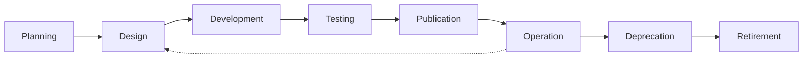

# Lifecycle Management

## Introduction

This document outlines the lifecycle management framework for the API Marketplace component of the CMM Reference Architecture. Effective lifecycle management ensures that APIs are properly governed from creation through retirement, maintaining quality, security, and value throughout their lifespan.

## API Lifecycle Overview

### Lifecycle Stages

The API Marketplace defines the following lifecycle stages for APIs:

1. **Planning**: Initial conception and requirements gathering
2. **Design**: API design and specification development
3. **Development**: Implementation of the API
4. **Testing**: Validation of the API functionality and quality
5. **Publication**: Making the API available in the marketplace
6. **Operation**: Active use and monitoring of the API
7. **Deprecation**: Planned phase-out of the API
8. **Retirement**: Removal of the API from active use

### Lifecycle Transitions

Transitions between lifecycle stages follow defined workflows with appropriate approvals:



## Lifecycle Stage Management

### Planning Stage

During the Planning stage, the following activities occur:

1. **Requirements Gathering**:
   - Identifying business needs
   - Defining API purpose and scope
   - Identifying target consumers

2. **Feasibility Assessment**:
   - Technical feasibility
   - Resource requirements
   - Cost-benefit analysis

3. **Approval Process**:
   - Business case review
   - Initial security assessment
   - Resource allocation

### Design Stage

During the Design stage, the following activities occur:

1. **API Specification Development**:
   - Creating OpenAPI/GraphQL/AsyncAPI specifications
   - Defining resources, operations, and data models
   - Documenting security requirements

2. **Design Reviews**:
   - Architecture review
   - Security review
   - Standards compliance review

3. **Prototype Development**:
   - Creating mock APIs
   - Early consumer feedback
   - Design iteration

```typescript
// Example: API design review process
interface DesignReview {
  reviewId: string;
  apiId: string;
  apiVersion: string;
  reviewType: 'architecture' | 'security' | 'standards' | 'usability';
  reviewer: {
    userId: string;
    name: string;
    role: string;
  };
  status: 'pending' | 'in_progress' | 'approved' | 'rejected' | 'changes_requested';
  findings: Array<{
    findingId: string;
    category: string;
    severity: 'critical' | 'high' | 'medium' | 'low' | 'info';
    description: string;
    recommendation: string;
    status: 'open' | 'addressed' | 'waived' | 'closed';
  }>;
  comments: Array<{
    commentId: string;
    userId: string;
    timestamp: string;
    content: string;
  }>;
  createdAt: string;
  updatedAt: string;
  completedAt?: string;
}

class DesignReviewService {
  async createDesignReview(
    apiId: string,
    apiVersion: string,
    reviewType: DesignReview['reviewType'],
    reviewerId: string
  ): Promise<string> {
    // Get reviewer information
    const reviewer = await this.getUserInfo(reviewerId);
    
    // Create a new design review
    const review: DesignReview = {
      reviewId: uuidv4(),
      apiId,
      apiVersion,
      reviewType,
      reviewer: {
        userId: reviewerId,
        name: reviewer.name,
        role: reviewer.role,
      },
      status: 'pending',
      findings: [],
      comments: [],
      createdAt: new Date().toISOString(),
      updatedAt: new Date().toISOString(),
    };
    
    // Store the review
    await this.storeReview(review);
    
    // Notify the reviewer
    await this.notifyReviewer(reviewerId, review);
    
    // Log the review creation for audit purposes
    await this.logAuditEvent({
      eventType: 'DESIGN_REVIEW_CREATED',
      status: 'success',
      actor: {
        userId: 'current-user-id', // from auth context
        ipAddress: 'user-ip-address', // from request
      },
      resource: {
        resourceType: 'DESIGN_REVIEW',
        resourceId: review.reviewId,
        resourceName: `${reviewType} Review for API ${apiId} v${apiVersion}`,
      },
      action: {
        actionType: 'create',
        requestDetails: {
          apiId,
          apiVersion,
          reviewType,
          reviewerId,
        },
      },
    });
    
    return review.reviewId;
  }
  
  async addFinding(
    reviewId: string,
    finding: Omit<DesignReview['findings'][0], 'findingId' | 'status'>
  ): Promise<string> {
    // Get the current review
    const review = await this.getReview(reviewId);
    if (!review) {
      throw new Error(`Review not found: ${reviewId}`);
    }
    
    // Create a new finding
    const newFinding = {
      ...finding,
      findingId: uuidv4(),
      status: 'open' as const,
    };
    
    // Update the review with the new finding
    const updatedReview: DesignReview = {
      ...review,
      findings: [...review.findings, newFinding],
      updatedAt: new Date().toISOString(),
    };
    
    // Store the updated review
    await this.storeReview(updatedReview);
    
    // For critical and high severity findings, trigger alerts
    if (newFinding.severity === 'critical' || newFinding.severity === 'high') {
      await this.triggerAlert(updatedReview, newFinding);
    }
    
    // Log the finding addition for audit purposes
    await this.logAuditEvent({
      eventType: 'DESIGN_REVIEW_FINDING_ADDED',
      status: 'success',
      actor: {
        userId: 'current-user-id', // from auth context
        ipAddress: 'user-ip-address', // from request
      },
      resource: {
        resourceType: 'DESIGN_REVIEW',
        resourceId: reviewId,
        resourceName: `${review.reviewType} Review for API ${review.apiId} v${review.apiVersion}`,
      },
      action: {
        actionType: 'update',
        requestDetails: {
          findingCategory: finding.category,
          findingSeverity: finding.severity,
        },
      },
    });
    
    return newFinding.findingId;
  }
  
  // Implementation details for other methods
  // ...
}
```

### Development Stage

During the Development stage, the following activities occur:

1. **API Implementation**:
   - Coding the API
   - Unit testing
   - Integration with backend systems

2. **Documentation Development**:
   - API reference documentation
   - Usage examples
   - SDK generation

3. **CI/CD Integration**:
   - Automated build and test
   - Deployment pipeline setup
   - Quality gates configuration

### Testing Stage

During the Testing stage, the following activities occur:

1. **Functional Testing**:
   - Verification of API functionality
   - Edge case testing
   - Error handling testing

2. **Non-functional Testing**:
   - Performance testing
   - Security testing
   - Reliability testing

3. **Consumer Acceptance Testing**:
   - Early adopter testing
   - Feedback collection
   - Final adjustments

### Publication Stage

During the Publication stage, the following activities occur:

1. **Marketplace Registration**:
   - API metadata submission
   - Documentation publishing
   - Subscription plan configuration

2. **Approval Process**:
   - Final security review
   - Compliance verification
   - Publication approval

3. **Announcement and Promotion**:
   - Release notes
   - Internal communication
   - Developer outreach

```typescript
// Example: API publication process
interface PublicationRequest {
  requestId: string;
  apiId: string;
  apiVersion: string;
  requestedBy: string;
  status: 'pending' | 'in_review' | 'approved' | 'rejected';
  reviewers: Array<{
    userId: string;
    reviewType: 'security' | 'architecture' | 'business' | 'compliance';
    status: 'pending' | 'approved' | 'rejected';
    comments?: string;
  }>;
  approvals: Array<{
    userId: string;
    timestamp: string;
    comments?: string;
  }>;
  rejections: Array<{
    userId: string;
    timestamp: string;
    reason: string;
    remediation?: string;
  }>;
  createdAt: string;
  updatedAt: string;
  completedAt?: string;
}

class PublicationService {
  async createPublicationRequest(apiId: string, apiVersion: string): Promise<string> {
    // Validate that the API is ready for publication
    await this.validateApiReadiness(apiId, apiVersion);
    
    // Determine required reviewers based on API metadata
    const requiredReviewers = await this.determineRequiredReviewers(apiId, apiVersion);
    
    // Create a new publication request
    const request: PublicationRequest = {
      requestId: uuidv4(),
      apiId,
      apiVersion,
      requestedBy: 'current-user-id', // from auth context
      status: 'pending',
      reviewers: requiredReviewers,
      approvals: [],
      rejections: [],
      createdAt: new Date().toISOString(),
      updatedAt: new Date().toISOString(),
    };
    
    // Store the request
    await this.storePublicationRequest(request);
    
    // Notify reviewers
    await this.notifyReviewers(request);
    
    // Log the request creation for audit purposes
    await this.logAuditEvent({
      eventType: 'PUBLICATION_REQUEST_CREATED',
      status: 'success',
      actor: {
        userId: 'current-user-id', // from auth context
        ipAddress: 'user-ip-address', // from request
      },
      resource: {
        resourceType: 'PUBLICATION_REQUEST',
        resourceId: request.requestId,
        resourceName: `Publication Request for API ${apiId} v${apiVersion}`,
      },
      action: {
        actionType: 'create',
        requestDetails: {
          apiId,
          apiVersion,
        },
      },
    });
    
    return request.requestId;
  }
  
  async approvePublication(
    requestId: string,
    reviewerId: string,
    comments?: string
  ): Promise<void> {
    // Get the current request
    const request = await this.getPublicationRequest(requestId);
    if (!request) {
      throw new Error(`Publication request not found: ${requestId}`);
    }
    
    // Validate that the reviewer is assigned to this request
    const reviewerIndex = request.reviewers.findIndex(r => r.userId === reviewerId);
    if (reviewerIndex === -1) {
      throw new Error(`User ${reviewerId} is not a reviewer for this publication request`);
    }
    
    // Update the reviewer's status
    const updatedReviewers = [...request.reviewers];
    updatedReviewers[reviewerIndex] = {
      ...updatedReviewers[reviewerIndex],
      status: 'approved',
    };
    
    // Add to approvals
    const updatedApprovals = [
      ...request.approvals,
      {
        userId: reviewerId,
        timestamp: new Date().toISOString(),
        comments,
      },
    ];
    
    // Check if all reviewers have approved
    const allApproved = updatedReviewers.every(r => r.status === 'approved');
    
    // Update the request
    const updatedRequest: PublicationRequest = {
      ...request,
      reviewers: updatedReviewers,
      approvals: updatedApprovals,
      status: allApproved ? 'approved' : request.status,
      updatedAt: new Date().toISOString(),
      completedAt: allApproved ? new Date().toISOString() : request.completedAt,
    };
    
    // Store the updated request
    await this.storePublicationRequest(updatedRequest);
    
    // If all approved, publish the API
    if (allApproved) {
      await this.publishApi(request.apiId, request.apiVersion);
    }
    
    // Log the approval for audit purposes
    await this.logAuditEvent({
      eventType: 'PUBLICATION_REQUEST_APPROVED',
      status: 'success',
      actor: {
        userId: reviewerId,
        ipAddress: 'user-ip-address', // from request
      },
      resource: {
        resourceType: 'PUBLICATION_REQUEST',
        resourceId: requestId,
        resourceName: `Publication Request for API ${request.apiId} v${request.apiVersion}`,
      },
      action: {
        actionType: 'update',
        requestDetails: {
          comments,
        },
        changes: {
          before: { status: request.status },
          after: { status: updatedRequest.status },
        },
      },
    });
  }
  
  // Implementation details for other methods
  // ...
}
```

### Operation Stage

During the Operation stage, the following activities occur:

1. **Monitoring and Analytics**:
   - Performance monitoring
   - Usage analytics
   - Error tracking

2. **Maintenance**:
   - Bug fixes
   - Minor enhancements
   - Security patches

3. **Consumer Support**:
   - Documentation updates
   - Issue resolution
   - Feature requests tracking

### Deprecation Stage

During the Deprecation stage, the following activities occur:

1. **Deprecation Planning**:
   - Impact assessment
   - Migration path definition
   - Timeline establishment

2. **Communication**:
   - Deprecation notice
   - Migration guidance
   - Support options

3. **Transition Support**:
   - Migration assistance
   - Extended support options
   - Consumer feedback collection

### Retirement Stage

During the Retirement stage, the following activities occur:

1. **Decommissioning**:
   - Service shutdown
   - Resource reclamation
   - Documentation archiving

2. **Final Notification**:
   - Retirement confirmation
   - Alternative solutions
   - Support contact information

3. **Knowledge Preservation**:
   - Lessons learned documentation
   - Historical data archiving
   - Design pattern preservation

## Version Management

### Versioning Strategy

The API Marketplace implements a structured versioning strategy:

1. **Semantic Versioning**:
   - Major version (X.y.z): Breaking changes
   - Minor version (x.Y.z): Non-breaking additions
   - Patch version (x.y.Z): Bug fixes and minor updates

2. **Version Compatibility**:
   - Backward compatibility requirements
   - Forward compatibility considerations
   - Breaking change management

3. **Version Lifecycle**:
   - Active: Fully supported
   - Maintained: Security updates only
   - Deprecated: Planned for retirement
   - Retired: No longer available

### Version Transition Management

The API Marketplace provides tools for managing version transitions:

```typescript
// Example: API version management
interface ApiVersion {
  apiId: string;
  version: string;
  status: 'draft' | 'published' | 'deprecated' | 'retired';
  releaseNotes: string;
  publishedAt?: string;
  deprecatedAt?: string;
  retirementDate?: string;
  supportEndDate?: string;
  successor?: {
    version: string;
    migrationGuide?: string;
  };
}

class VersionManager {
  async deprecateVersion(apiId: string, version: string, options: {
    retirementDate: string;
    supportEndDate: string;
    successor?: {
      version: string;
      migrationGuide?: string;
    };
  }): Promise<void> {
    // Validate inputs
    this.validateDates(options.retirementDate, options.supportEndDate);
    
    // Get the current version
    const apiVersion = await this.getApiVersion(apiId, version);
    if (!apiVersion) {
      throw new Error(`API version not found: ${apiId} v${version}`);
    }
    
    // Ensure the version is published
    if (apiVersion.status !== 'published') {
      throw new Error(`Cannot deprecate API version with status: ${apiVersion.status}`);
    }
    
    // If a successor is specified, ensure it exists and is published
    if (options.successor) {
      const successor = await this.getApiVersion(apiId, options.successor.version);
      if (!successor) {
        throw new Error(`Successor version not found: ${apiId} v${options.successor.version}`);
      }
      if (successor.status !== 'published') {
        throw new Error(`Successor version must be published: ${apiId} v${options.successor.version}`);
      }
    }
    
    // Update the version status
    const updatedVersion: ApiVersion = {
      ...apiVersion,
      status: 'deprecated',
      deprecatedAt: new Date().toISOString(),
      retirementDate: options.retirementDate,
      supportEndDate: options.supportEndDate,
      successor: options.successor,
    };
    
    // Store the updated version
    await this.storeApiVersion(updatedVersion);
    
    // Notify consumers of the deprecation
    await this.notifyConsumers(apiId, version, updatedVersion);
    
    // Log the deprecation for audit purposes
    await this.logAuditEvent({
      eventType: 'API_VERSION_DEPRECATED',
      status: 'success',
      actor: {
        userId: 'current-user-id', // from auth context
        ipAddress: 'user-ip-address', // from request
      },
      resource: {
        resourceType: 'API_VERSION',
        resourceId: `${apiId}:${version}`,
        resourceName: `API ${apiId} v${version}`,
      },
      action: {
        actionType: 'update',
        requestDetails: {
          retirementDate: options.retirementDate,
          supportEndDate: options.supportEndDate,
          successor: options.successor,
        },
        changes: {
          before: { status: apiVersion.status },
          after: { status: 'deprecated' },
        },
      },
    });
  }
  
  private validateDates(retirementDate: string, supportEndDate: string): void {
    const now = new Date();
    const retirement = new Date(retirementDate);
    const supportEnd = new Date(supportEndDate);
    
    // Ensure dates are in the future
    if (retirement <= now) {
      throw new Error('Retirement date must be in the future');
    }
    if (supportEnd <= now) {
      throw new Error('Support end date must be in the future');
    }
    
    // Ensure support end date is before or equal to retirement date
    if (supportEnd > retirement) {
      throw new Error('Support end date must be before or equal to retirement date');
    }
    
    // Ensure there's a reasonable deprecation period (e.g., at least 90 days)
    const minDeprecationPeriod = 90 * 24 * 60 * 60 * 1000; // 90 days in milliseconds
    if (retirement.getTime() - now.getTime() < minDeprecationPeriod) {
      throw new Error('Retirement date must be at least 90 days in the future');
    }
  }
  
  // Implementation details for other methods
  // ...
}
```

## Lifecycle Policies

### Support Policies

The API Marketplace defines support policies for APIs at different lifecycle stages:

1. **Active Support**:
   - Full support for published APIs
   - SLA commitments
   - Bug fixes and enhancements

2. **Maintenance Support**:
   - Limited support for deprecated APIs
   - Security fixes only
   - No enhancements

3. **End of Support**:
   - No support for retired APIs
   - Documentation available for reference
   - Migration assistance only

### Deprecation Policies

The API Marketplace implements structured deprecation policies:

1. **Deprecation Notice Period**:
   - Minimum 90 days notice before retirement
   - Clear communication of timelines
   - Regular reminders

2. **Breaking Change Management**:
   - Avoiding breaking changes when possible
   - Version management for necessary breaking changes
   - Migration tools and guidance

3. **Sunset Strategy**:
   - Phased reduction in service levels
   - Gradual resource reclamation
   - Knowledge transfer

## Lifecycle Automation

### Automated Workflows

The API Marketplace automates key lifecycle processes:

1. **Publication Workflow**:
   - Automated validation
   - Approval routing
   - Notification management

2. **Deprecation Workflow**:
   - Impact analysis
   - Consumer notification
   - Usage monitoring

3. **Retirement Workflow**:
   - Final notifications
   - Service decommissioning
   - Resource cleanup

### Lifecycle Monitoring

The API Marketplace implements monitoring across the API lifecycle:

1. **Health Monitoring**:
   - Service health checks
   - Performance metrics
   - Error rates

2. **Usage Monitoring**:
   - API call volumes
   - Consumer adoption
   - Deprecation compliance

3. **Lifecycle Analytics**:
   - Time in each lifecycle stage
   - Transition effectiveness
   - Consumer migration metrics

## Conclusion

Effective lifecycle management is essential for ensuring that APIs in the API Marketplace are properly governed from creation through retirement. By implementing a comprehensive lifecycle framework, the organization can ensure that APIs maintain quality, security, and value throughout their lifespan while providing a consistent experience for API consumers.

The lifecycle management practices outlined in this document should be regularly reviewed and updated to address evolving business needs, technological changes, and market requirements.
