# API Marketplace CI/CD Pipeline

## Introduction

This document describes the Continuous Integration and Continuous Deployment (CI/CD) pipeline for the API Marketplace component of the CMM Technology Platform. The CI/CD pipeline automates the building, testing, and deployment processes, ensuring consistent, reliable, and efficient delivery of the API Marketplace component across different environments.

## Pipeline Overview

The API Marketplace CI/CD pipeline follows a modern DevOps approach with automated stages from code commit to production deployment. The pipeline is designed to ensure code quality, security, and reliability throughout the software delivery lifecycle.

```mermaid
graph LR
    A[Code Commit] --> B[Build]
    B --> C[Test]
    C --> D[Static Analysis]
    D --> E[Security Scan]
    E --> F[Build Artifacts]
    F --> G[Deploy to Dev]
    G --> H[Integration Tests]
    H --> I[Deploy to Test]
    I --> J[Acceptance Tests]
    J --> K[Deploy to Staging]
    K --> L[Performance Tests]
    L --> M[Deploy to Production]
    M --> N[Post-Deployment Verification]
```



## Pipeline Stages

### Code Commit

The pipeline begins when code is committed to the repository:

- **Source Control**: GitHub repository for API Marketplace code
- **Branch Strategy**: GitFlow with feature branches, develop, release, and main branches
- **Pull Request Process**: Required code reviews, automated checks, and approval workflows
- **Commit Hooks**: Pre-commit hooks for code formatting and linting

### Build

The build stage compiles the code and prepares it for testing:

- **Build Tool**: Node.js with npm/yarn for backend, webpack for frontend
- **Build Environment**: Containerized build environment with Node.js 18
- **Dependency Management**: Automated dependency resolution and lockfile validation
- **Build Artifacts**: Compiled JavaScript, bundled assets, and Docker images

### Test

Comprehensive testing ensures code quality and functionality:

- **Unit Tests**: Jest for component and function-level testing
- **API Tests**: Supertest for API endpoint testing
- **Component Tests**: React Testing Library for frontend component testing
- **Coverage Requirements**: Minimum 80% code coverage required to proceed

### Static Analysis

Static analysis tools identify code quality issues and potential bugs:

- **Linting**: ESLint with custom ruleset for code style and quality
- **Type Checking**: TypeScript compilation with strict mode
- **Code Quality**: SonarQube analysis for code quality metrics
- **Dependency Scanning**: OWASP Dependency Check for vulnerable dependencies

### Security Scan

Security scanning identifies potential vulnerabilities:

- **SAST**: Static Application Security Testing with tools like Checkmarx
- **Container Scanning**: Trivy for Docker image vulnerability scanning
- **Secret Detection**: GitLeaks for detecting secrets in code
- **Compliance Checking**: Custom rules for HIPAA and GDPR compliance

### Build Artifacts

The pipeline creates deployable artifacts:

- **Docker Images**: Container images for each component
- **Helm Charts**: Kubernetes deployment configurations
- **Configuration Packages**: Environment-specific configurations
- **Documentation**: Auto-generated API documentation

### Deploy to Development

Deployment to the development environment:

- **Environment**: Kubernetes-based development cluster
- **Deployment Tool**: Helm for Kubernetes deployments
- **Configuration**: Development-specific configuration values
- **Database**: Automated schema migrations

### Integration Tests

Integration tests verify component interactions:

- **API Integration**: Tests for API interactions between components
- **External Services**: Tests for integration with other CMM components
- **Data Flow**: End-to-end data flow testing
- **Error Handling**: Tests for error scenarios and recovery

### Deploy to Test

Deployment to the test environment:

- **Environment**: Isolated test environment with test data
- **Deployment Approval**: Automated approval based on integration test results
- **Configuration**: Test-specific configuration values
- **Test Data**: Automated test data setup

### Acceptance Tests

Acceptance tests verify business requirements:

- **User Scenarios**: Tests for key user workflows
- **Business Rules**: Validation of business logic
- **UI Testing**: Automated UI tests with Cypress
- **Accessibility**: Automated accessibility testing

### Deploy to Staging

Deployment to the staging environment:

- **Environment**: Production-like staging environment
- **Deployment Approval**: Manual approval by QA team
- **Configuration**: Production-like configuration
- **Data**: Anonymized production-like data

### Performance Tests

Performance tests verify system scalability and responsiveness:

- **Load Testing**: JMeter tests for API performance under load
- **Stress Testing**: Tests for system behavior under extreme conditions
- **Endurance Testing**: Long-running tests for stability
- **Resource Monitoring**: CPU, memory, and network utilization monitoring

### Deploy to Production

Deployment to the production environment:

- **Environment**: Production Kubernetes cluster
- **Deployment Strategy**: Blue-green deployment for zero downtime
- **Approval Process**: Manual approval by release manager
- **Rollback Plan**: Automated rollback capability

### Post-Deployment Verification

Verification after production deployment:

- **Smoke Tests**: Basic functionality verification
- **Health Checks**: System health monitoring
- **Synthetic Monitoring**: Automated user journey tests
- **Metrics Validation**: Verification of key performance indicators

## Automation Tools

The CI/CD pipeline uses the following automation tools:

### CI/CD Platform

- **GitHub Actions**: Primary CI/CD orchestration platform
- **Jenkins**: Alternative CI/CD platform for on-premises deployments
- **ArgoCD**: GitOps-based continuous delivery for Kubernetes

### Build and Test Tools

- **Node.js**: JavaScript runtime for building and testing
- **Docker**: Container platform for build and deployment
- **Jest**: JavaScript testing framework
- **Cypress**: End-to-end testing framework

### Deployment Tools

- **Kubernetes**: Container orchestration platform
- **Helm**: Kubernetes package manager
- **Terraform**: Infrastructure as Code tool
- **Ansible**: Configuration management tool

### Monitoring and Observability

- **Prometheus**: Metrics collection and alerting
- **Grafana**: Metrics visualization
- **ELK Stack**: Log aggregation and analysis
- **Jaeger**: Distributed tracing

## Build Process

The build process for the API Marketplace consists of several steps:

### Backend Build

```yaml
# Backend build steps in GitHub Actions
backend-build:
  runs-on: ubuntu-latest
  steps:
    - name: Checkout code
      uses: actions/checkout@v3

    - name: Set up Node.js
      uses: actions/setup-node@v3
      with:
        node-version: '18'
        cache: 'npm'
        cache-dependency-path: backend/package-lock.json

    - name: Install dependencies
      run: cd backend && npm ci

    - name: Build
      run: cd backend && npm run build

    - name: Run tests
      run: cd backend && npm test

    - name: Build Docker image
      run: |
        docker build -t api-marketplace-backend:${{ github.sha }} backend/
        docker tag api-marketplace-backend:${{ github.sha }} api-marketplace-backend:latest

    - name: Push Docker image
      run: |
        echo ${{ secrets.DOCKER_PASSWORD }} | docker login -u ${{ secrets.DOCKER_USERNAME }} --password-stdin
        docker push api-marketplace-backend:${{ github.sha }}
        docker push api-marketplace-backend:latest
```

### Frontend Build

```yaml
# Frontend build steps in GitHub Actions
frontend-build:
  runs-on: ubuntu-latest
  steps:
    - name: Checkout code
      uses: actions/checkout@v3

    - name: Set up Node.js
      uses: actions/setup-node@v3
      with:
        node-version: '18'
        cache: 'npm'
        cache-dependency-path: frontend/package-lock.json

    - name: Install dependencies
      run: cd frontend && npm ci

    - name: Build
      run: cd frontend && npm run build

    - name: Run tests
      run: cd frontend && npm test

    - name: Build Docker image
      run: |
        docker build -t api-marketplace-frontend:${{ github.sha }} frontend/
        docker tag api-marketplace-frontend:${{ github.sha }} api-marketplace-frontend:latest

    - name: Push Docker image
      run: |
        echo ${{ secrets.DOCKER_PASSWORD }} | docker login -u ${{ secrets.DOCKER_USERNAME }} --password-stdin
        docker push api-marketplace-frontend:${{ github.sha }}
        docker push api-marketplace-frontend:latest
```

### Dependency Management

Dependencies are managed with strict version control:

- **Package Lock**: package-lock.json or yarn.lock enforced in version control
- **Dependency Updates**: Automated with Dependabot
- **Vulnerability Scanning**: Automated with npm audit and Snyk
- **License Compliance**: Checked with license-checker

## Deployment Process

The deployment process uses a GitOps approach with Helm and ArgoCD:

### Helm Chart Structure

```
api-marketplace/
├── Chart.yaml
├── values.yaml
├── values-dev.yaml
├── values-test.yaml
├── values-staging.yaml
├── values-prod.yaml
└── templates/
    ├── deployment.yaml
    ├── service.yaml
    ├── ingress.yaml
    ├── configmap.yaml
    ├── secret.yaml
    └── hpa.yaml
```

### ArgoCD Application Definition

```yaml
apiVersion: argoproj.io/v1alpha1
kind: Application
metadata:
  name: api-marketplace
  namespace: argocd
spec:
  project: default
  source:
    repoURL: https://github.com/cmm-reference-architecture/api-marketplace.git
    targetRevision: HEAD
    path: helm/api-marketplace
    helm:
      valueFiles:
        - values-prod.yaml
  destination:
    server: https://kubernetes.default.svc
    namespace: api-marketplace
  syncPolicy:
    automated:
      prune: true
      selfHeal: true
    syncOptions:
      - CreateNamespace=true
```

### Blue-Green Deployment

Production deployments use a blue-green strategy for zero downtime:

```yaml
# Blue-Green deployment configuration
blue-green:
  enabled: true
  activeService: blue
  services:
    blue:
      name: api-marketplace-blue
      label: app.kubernetes.io/name=api-marketplace,app.kubernetes.io/instance=blue
    green:
      name: api-marketplace-green
      label: app.kubernetes.io/name=api-marketplace,app.kubernetes.io/instance=green
  autoPromotionEnabled: false
  autoPromotionSeconds: 600
  scaleDownDelaySeconds: 300
  previewService: preview-api-marketplace
```

## Environment Management

The CI/CD pipeline manages multiple environments with different configurations:

### Environment Configuration

Environment-specific configuration is managed through Helm values files:

```yaml
# Example values-dev.yaml
replicaCount: 1

image:
  repository: api-marketplace-backend
  tag: latest
  pullPolicy: Always

resources:
  limits:
    cpu: 500m
    memory: 512Mi
  requests:
    cpu: 100m
    memory: 128Mi

database:
  host: mongodb-dev
  port: 27017
  name: apimarketplace
  authEnabled: true

logging:
  level: debug

featureFlags:
  enableAnalytics: true
  enableVersioning: true
```

### Environment Promotion

Code changes flow through environments in a controlled manner:

1. **Development**: Automatic deployment from the develop branch
2. **Test**: Automatic deployment after successful integration tests
3. **Staging**: Manual approval required before deployment
4. **Production**: Manual approval required with additional security checks

### Configuration Management

Sensitive configuration is managed securely:

- **Secrets Management**: HashiCorp Vault for secrets storage
- **Secret Injection**: Kubernetes External Secrets for secret injection
- **Configuration Validation**: Automated validation of configuration values
- **Audit Trail**: All configuration changes are tracked and audited

## Pipeline Security

The CI/CD pipeline implements several security controls:

### Secrets Management

- **No Hardcoded Secrets**: All secrets stored in secure vaults
- **Least Privilege**: Pipeline uses minimal required permissions
- **Secret Rotation**: Regular rotation of pipeline credentials
- **Access Auditing**: All secret access is logged and audited

### Build Environment Security

- **Isolated Build Environments**: Each build runs in an isolated container
- **Ephemeral Credentials**: Temporary credentials for build processes
- **Dependency Scanning**: All dependencies scanned for vulnerabilities
- **Image Scanning**: All container images scanned before deployment

### Deployment Security

- **Immutable Infrastructure**: Deployments create new resources rather than modifying existing ones
- **Deployment Verification**: Automated verification after deployment
- **Rollback Capability**: Automated rollback for failed deployments
- **Audit Trail**: All deployments are logged and audited

## Healthcare-Specific Considerations

### Compliance Validation

The pipeline includes healthcare-specific compliance checks:

- **HIPAA Compliance**: Automated checks for HIPAA Technical Safeguards
- **GDPR Compliance**: Validation of data protection measures
- **21 CFR Part 11**: Checks for electronic records and signatures compliance
- **HITRUST**: Alignment with HITRUST CSF requirements

### PHI Protection

The pipeline includes special protections for Protected Health Information (PHI):

- **PHI Detection**: Automated scanning for PHI in test data
- **Data Masking**: Masking of PHI in non-production environments
- **Access Controls**: Strict controls on PHI access during deployment
- **Audit Logging**: Comprehensive logging of all PHI access

## Monitoring and Feedback

The pipeline includes monitoring and feedback mechanisms:

### Pipeline Metrics

- **Build Time**: Time taken for each build
- **Test Coverage**: Code coverage percentage
- **Success Rate**: Percentage of successful pipeline runs
- **Deployment Frequency**: Frequency of deployments to each environment

### Notification System

- **Slack Integration**: Real-time notifications in Slack channels
- **Email Alerts**: Email notifications for critical events
- **Dashboard**: Real-time pipeline status dashboard
- **Mobile Alerts**: Critical alerts sent to mobile devices

## Best Practices

### Pipeline Optimization

- **Parallel Execution**: Run independent steps in parallel
- **Caching**: Cache dependencies and build artifacts
- **Incremental Builds**: Build only what has changed
- **Test Prioritization**: Run critical tests first

### Quality Gates

- **Automated Quality Gates**: Automated checks that must pass before proceeding
- **Manual Approvals**: Strategic manual approval points for critical stages
- **Compliance Checks**: Automated compliance validation
- **Performance Thresholds**: Minimum performance requirements

## Related Documentation

- [Deployment Guide](./deployment.md)
- [Testing Strategy](./testing-strategy.md)
- [Monitoring Guide](./monitoring.md)
- [Architecture Overview](../01-getting-started/architecture.md)
