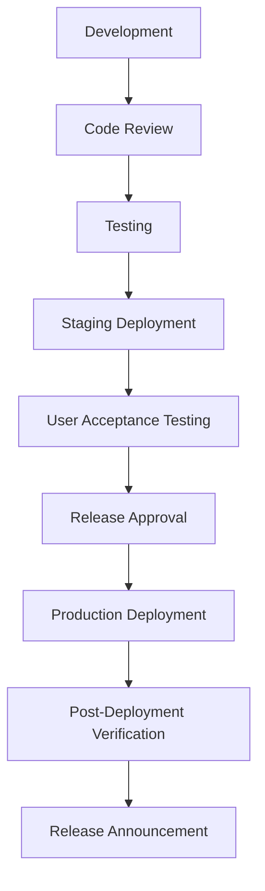

# Maintenance and Support

## Introduction

This document outlines the maintenance and support framework for the API Marketplace component of the CMM Reference Architecture. Effective maintenance and support are essential for ensuring the reliability, security, and continued evolution of the API Marketplace.

## Maintenance Strategy

### Maintenance Types

The API Marketplace implements different types of maintenance activities:

1. **Preventive Maintenance**:
   - Scheduled system updates
   - Security patches
   - Performance optimization
   - Capacity planning

2. **Corrective Maintenance**:
   - Bug fixes
   - Error resolution
   - System recovery
   - Incident response

3. **Adaptive Maintenance**:
   - Feature enhancements
   - Integration updates
   - Regulatory compliance updates
   - Technology upgrades

4. **Perfective Maintenance**:
   - User experience improvements
   - Performance optimization
   - Code refactoring
   - Technical debt reduction

### Maintenance Schedule

The API Marketplace follows a structured maintenance schedule:

| Maintenance Type | Frequency | Timing | Notification Period |
|------------------|-----------|--------|---------------------|
| Security Patches | As needed | Immediate for critical, otherwise during maintenance window | 24 hours (non-critical) |
| Minor Updates | Monthly | Scheduled maintenance window | 1 week |
| Major Updates | Quarterly | Scheduled maintenance window | 1 month |
| Emergency Fixes | As needed | Immediate | As soon as possible |
| Database Maintenance | Weekly | Off-peak hours | 48 hours |

### Maintenance Windows

Scheduled maintenance windows are defined to minimize impact on users:

- **Primary Maintenance Window**: Sundays, 01:00-05:00 UTC
- **Secondary Maintenance Window**: Wednesdays, 01:00-03:00 UTC
- **Emergency Maintenance**: Any time as required, with appropriate notifications

## Release Management

### Release Types

The API Marketplace defines different types of releases:

1. **Major Releases**:
   - Significant new features
   - Breaking changes
   - Architecture changes
   - Version number: X.0.0

2. **Minor Releases**:
   - New features (non-breaking)
   - Enhancements to existing features
   - Version number: 0.X.0

3. **Patch Releases**:
   - Bug fixes
   - Security patches
   - Minor improvements
   - Version number: 0.0.X

4. **Hotfixes**:
   - Critical bug fixes
   - Security vulnerabilities
   - Production issues
   - Version number: 0.0.X-hotfix.Y

### Release Process

The API Marketplace follows a structured release process:



#### Implementation Example

```typescript
// Example: Release management service
import { v4 as uuidv4 } from 'uuid';

interface Release {
  id: string;
  version: string;
  releaseType: 'major' | 'minor' | 'patch' | 'hotfix';
  description: string;
  releaseNotes: string;
  changes: Array<{
    id: string;
    type: 'feature' | 'enhancement' | 'bugfix' | 'security' | 'performance' | 'other';
    description: string;
    ticketId?: string;
  }>;
  deploymentPlan: {
    scheduledDate: string;
    maintenanceWindow: string;
    rollbackPlan: string;
    verificationSteps: string[];
  };
  approvals: Array<{
    role: string;
    approver: string;
    approved: boolean;
    date?: string;
    comments?: string;
  }>;
  status: 'planned' | 'approved' | 'deployed' | 'rolled-back' | 'completed';
  createdAt: string;
  updatedAt: string;
  deployedAt?: string;
  completedAt?: string;
}

class ReleaseManager {
  async createRelease(releaseData: Omit<Release, 'id' | 'status' | 'createdAt' | 'updatedAt'>): Promise<string> {
    // Validate release data
    this.validateReleaseData(releaseData);
    
    // Create a new release
    const release: Release = {
      ...releaseData,
      id: uuidv4(),
      status: 'planned',
      createdAt: new Date().toISOString(),
      updatedAt: new Date().toISOString(),
    };
    
    // Store the release
    await this.storeRelease(release);
    
    // Notify stakeholders
    await this.notifyReleaseCreated(release);
    
    // Log the release creation for audit purposes
    await this.logAuditEvent({
      eventType: 'RELEASE_CREATED',
      status: 'success',
      actor: {
        userId: 'current-user-id', // from auth context
        ipAddress: 'user-ip-address', // from request
      },
      resource: {
        resourceType: 'RELEASE',
        resourceId: release.id,
        resourceName: `Release ${release.version}`,
      },
      action: {
        actionType: 'create',
        requestDetails: {
          version: release.version,
          releaseType: release.releaseType,
        },
      },
    });
    
    return release.id;
  }
  
  async approveRelease(releaseId: string, approvalData: {
    role: string;
    approver: string;
    approved: boolean;
    comments?: string;
  }): Promise<void> {
    // Get the current release
    const release = await this.getRelease(releaseId);
    if (!release) {
      throw new Error(`Release not found: ${releaseId}`);
    }
    
    // Validate release status
    if (release.status !== 'planned') {
      throw new Error(`Cannot approve release with status: ${release.status}`);
    }
    
    // Update approval
    const approvalIndex = release.approvals.findIndex(a => a.role === approvalData.role);
    
    if (approvalIndex >= 0) {
      // Update existing approval
      release.approvals[approvalIndex] = {
        ...release.approvals[approvalIndex],
        approver: approvalData.approver,
        approved: approvalData.approved,
        date: new Date().toISOString(),
        comments: approvalData.comments,
      };
    } else {
      // Add new approval
      release.approvals.push({
        role: approvalData.role,
        approver: approvalData.approver,
        approved: approvalData.approved,
        date: new Date().toISOString(),
        comments: approvalData.comments,
      });
    }
    
    // Check if all required approvals are complete
    const requiredRoles = ['product', 'engineering', 'security', 'operations'];
    const allApproved = requiredRoles.every(role => {
      const approval = release.approvals.find(a => a.role === role);
      return approval && approval.approved;
    });
    
    // Update release status if all approved
    if (allApproved) {
      release.status = 'approved';
    }
    
    // Update the release
    release.updatedAt = new Date().toISOString();
    await this.storeRelease(release);
    
    // Notify stakeholders
    if (release.status === 'approved') {
      await this.notifyReleaseApproved(release);
    } else {
      await this.notifyReleaseApprovalUpdated(release, approvalData);
    }
    
    // Log the approval for audit purposes
    await this.logAuditEvent({
      eventType: 'RELEASE_APPROVAL_UPDATED',
      status: 'success',
      actor: {
        userId: approvalData.approver,
        ipAddress: 'user-ip-address', // from request
      },
      resource: {
        resourceType: 'RELEASE',
        resourceId: releaseId,
        resourceName: `Release ${release.version}`,
      },
      action: {
        actionType: 'update',
        requestDetails: {
          role: approvalData.role,
          approved: approvalData.approved,
          comments: approvalData.comments,
        },
      },
    });
  }
  
  // Implementation details for other methods
  // ...
}
```

### Change Management

The API Marketplace implements a structured change management process:

1. **Change Request**:
   - Description of the change
   - Justification
   - Impact assessment
   - Risk assessment

2. **Change Evaluation**:
   - Technical feasibility
   - Resource requirements
   - Schedule impact
   - Risk mitigation

3. **Change Approval**:
   - Change Advisory Board review
   - Stakeholder approvals
   - Implementation planning

4. **Change Implementation**:
   - Development and testing
   - Deployment planning
   - Communication
   - Implementation

5. **Change Verification**:
   - Post-implementation testing
   - Performance monitoring
   - User feedback
   - Lessons learned

## Support Framework

### Support Levels

The API Marketplace provides multiple levels of support:

1. **Level 1 Support**:
   - First point of contact
   - Basic troubleshooting
   - Known issue resolution
   - Ticket routing

2. **Level 2 Support**:
   - Advanced troubleshooting
   - Configuration issues
   - Performance problems
   - Integration issues

3. **Level 3 Support**:
   - Complex problem resolution
   - Code-level debugging
   - System architecture issues
   - Third-party integration issues

### Support Channels

The API Marketplace offers multiple support channels:

1. **Self-Service Support**:
   - Knowledge base
   - FAQ
   - Troubleshooting guides
   - Community forums

2. **Assisted Support**:
   - Email support
   - Support portal
   - Chat support
   - Phone support

3. **Premium Support**:
   - Dedicated support engineer
   - Priority ticket handling
   - Regular check-ins
   - Proactive monitoring

### Service Level Agreements

The API Marketplace defines service level agreements (SLAs) for different support tiers:

| Severity | Description | Response Time | Resolution Time | Updates |
|----------|-------------|---------------|-----------------|----------|
| Critical | Service unavailable or severe impact | 30 minutes | 4 hours | Hourly |
| High | Significant impact, no workaround | 2 hours | 8 hours | Every 4 hours |
| Medium | Limited impact, workaround available | 4 hours | 24 hours | Daily |
| Low | Minimal impact, cosmetic issues | 8 hours | 5 business days | As needed |

### Incident Management

The API Marketplace follows a structured incident management process:

1. **Incident Detection**:
   - Monitoring alerts
   - User reports
   - Proactive checks

2. **Incident Classification**:
   - Severity assessment
   - Impact analysis
   - Priority determination

3. **Incident Response**:
   - Initial diagnosis
   - Containment
   - Resolution
   - Recovery

4. **Incident Communication**:
   - Status updates
   - User notifications
   - Stakeholder communication

5. **Post-Incident Analysis**:
   - Root cause analysis
   - Corrective actions
   - Process improvements

#### Implementation Example

```typescript
// Example: Incident management service
import { v4 as uuidv4 } from 'uuid';

interface Incident {
  id: string;
  title: string;
  description: string;
  severity: 'critical' | 'high' | 'medium' | 'low';
  status: 'detected' | 'investigating' | 'identified' | 'resolving' | 'resolved' | 'closed';
  affectedComponents: string[];
  affectedUsers: 'all' | 'some' | 'few' | 'none';
  detectedAt: string;
  assignedTo?: string;
  resolvedAt?: string;
  closedAt?: string;
  rootCause?: string;
  resolution?: string;
  timeline: Array<{
    timestamp: string;
    status: Incident['status'];
    message: string;
    updatedBy: string;
  }>;
  communications: Array<{
    timestamp: string;
    channel: 'email' | 'sms' | 'status-page' | 'in-app';
    message: string;
    audience: 'all-users' | 'affected-users' | 'internal';
    sentBy: string;
  }>;
}

class IncidentManager {
  async createIncident(incidentData: {
    title: string;
    description: string;
    severity: Incident['severity'];
    affectedComponents: string[];
    affectedUsers: Incident['affectedUsers'];
  }): Promise<string> {
    // Create a new incident
    const incident: Incident = {
      id: uuidv4(),
      title: incidentData.title,
      description: incidentData.description,
      severity: incidentData.severity,
      status: 'detected',
      affectedComponents: incidentData.affectedComponents,
      affectedUsers: incidentData.affectedUsers,
      detectedAt: new Date().toISOString(),
      timeline: [
        {
          timestamp: new Date().toISOString(),
          status: 'detected',
          message: 'Incident detected and created',
          updatedBy: 'current-user-id', // from auth context
        },
      ],
      communications: [],
    };
    
    // Store the incident
    await this.storeIncident(incident);
    
    // Notify incident response team
    await this.notifyIncidentTeam(incident);
    
    // For critical and high severity incidents, initiate emergency response
    if (incident.severity === 'critical' || incident.severity === 'high') {
      await this.initiateEmergencyResponse(incident);
    }
    
    // Log the incident creation for audit purposes
    await this.logAuditEvent({
      eventType: 'INCIDENT_CREATED',
      status: 'success',
      actor: {
        userId: 'current-user-id', // from auth context
        ipAddress: 'user-ip-address', // from request
      },
      resource: {
        resourceType: 'INCIDENT',
        resourceId: incident.id,
        resourceName: incident.title,
      },
      action: {
        actionType: 'create',
        requestDetails: {
          severity: incident.severity,
          affectedComponents: incident.affectedComponents,
        },
      },
    });
    
    return incident.id;
  }
  
  async updateIncidentStatus(
    incidentId: string,
    status: Incident['status'],
    message: string
  ): Promise<void> {
    // Get the current incident
    const incident = await this.getIncident(incidentId);
    if (!incident) {
      throw new Error(`Incident not found: ${incidentId}`);
    }
    
    // Update incident status
    const updatedIncident: Incident = {
      ...incident,
      status,
      timeline: [
        ...incident.timeline,
        {
          timestamp: new Date().toISOString(),
          status,
          message,
          updatedBy: 'current-user-id', // from auth context
        },
      ],
    };
    
    // Add timestamps for specific status changes
    if (status === 'resolved' && !updatedIncident.resolvedAt) {
      updatedIncident.resolvedAt = new Date().toISOString();
    } else if (status === 'closed' && !updatedIncident.closedAt) {
      updatedIncident.closedAt = new Date().toISOString();
    }
    
    // Store the updated incident
    await this.storeIncident(updatedIncident);
    
    // Notify stakeholders of status change
    await this.notifyStatusChange(updatedIncident, message);
    
    // Log the status update for audit purposes
    await this.logAuditEvent({
      eventType: 'INCIDENT_STATUS_UPDATED',
      status: 'success',
      actor: {
        userId: 'current-user-id', // from auth context
        ipAddress: 'user-ip-address', // from request
      },
      resource: {
        resourceType: 'INCIDENT',
        resourceId: incidentId,
        resourceName: incident.title,
      },
      action: {
        actionType: 'update',
        requestDetails: {
          previousStatus: incident.status,
          newStatus: status,
          message,
        },
      },
    });
  }
  
  // Implementation details for other methods
  // ...
}
```

## Backup and Recovery

### Backup Strategy

The API Marketplace implements a comprehensive backup strategy:

1. **Backup Types**:
   - Full backups: Complete system state
   - Incremental backups: Changes since last backup
   - Differential backups: Changes since last full backup

2. **Backup Frequency**:
   - Database: Daily full backup, hourly incremental
   - Configuration: After each change
   - File storage: Daily full backup, hourly incremental

3. **Backup Retention**:
   - Daily backups: 30 days
   - Weekly backups: 3 months
   - Monthly backups: 1 year
   - Yearly backups: 7 years

### Recovery Strategy

The API Marketplace defines recovery procedures for different scenarios:

1. **Data Corruption**:
   - Identify corrupted data
   - Restore from last valid backup
   - Validate restored data
   - Resume normal operation

2. **System Failure**:
   - Activate standby systems
   - Restore configuration
   - Restore data
   - Validate system functionality

3. **Disaster Recovery**:
   - Activate disaster recovery site
   - Restore from offsite backups
   - Redirect traffic
   - Validate system functionality

### Recovery Time Objectives

The API Marketplace defines recovery time objectives (RTOs) for different components:

| Component | Recovery Time Objective | Recovery Point Objective |
|-----------|--------------------------|---------------------------|
| API Gateway | 15 minutes | 5 minutes |
| API Portal | 30 minutes | 1 hour |
| API Catalog | 1 hour | 1 hour |
| User Database | 30 minutes | 5 minutes |
| Analytics | 2 hours | 1 hour |

## Patch Management

### Patch Classification

The API Marketplace classifies patches based on urgency and impact:

1. **Critical Patches**:
   - Security vulnerabilities
   - Data integrity issues
   - System stability issues

2. **High Priority Patches**:
   - Performance issues
   - Functional defects
   - Integration issues

3. **Normal Patches**:
   - Minor bugs
   - UI improvements
   - Documentation updates

### Patch Testing

All patches undergo a structured testing process:

1. **Development Testing**:
   - Unit testing
   - Integration testing
   - Functional testing

2. **QA Testing**:
   - Regression testing
   - Performance testing
   - Security testing

3. **UAT Testing**:
   - User acceptance testing
   - Stakeholder validation
   - Business process verification

### Patch Deployment

Patches are deployed following a structured process:

1. **Pre-Deployment**:
   - Deployment planning
   - Backup creation
   - Notification to stakeholders

2. **Deployment**:
   - Staged rollout
   - Monitoring
   - Verification

3. **Post-Deployment**:
   - Validation
   - Performance monitoring
   - User feedback collection

## Configuration Management

### Configuration Items

The API Marketplace tracks the following configuration items:

1. **Infrastructure Configuration**:
   - Server configurations
   - Network settings
   - Storage configurations

2. **Application Configuration**:
   - API Gateway settings
   - Portal configurations
   - Integration settings

3. **Security Configuration**:
   - Authentication settings
   - Authorization rules
   - Encryption configurations

### Configuration Control

The API Marketplace implements configuration control processes:

1. **Version Control**:
   - Configuration versioning
   - Change history
   - Rollback capability

2. **Environment Management**:
   - Development configuration
   - Testing configuration
   - Production configuration

3. **Configuration Validation**:
   - Syntax validation
   - Semantic validation
   - Integration testing

#### Implementation Example

```typescript
// Example: Configuration management service
import { v4 as uuidv4 } from 'uuid';

interface ConfigurationItem {
  id: string;
  key: string;
  value: any;
  description: string;
  environment: 'development' | 'testing' | 'staging' | 'production';
  sensitive: boolean;
  version: number;
  history: Array<{
    value: any;
    version: number;
    changedBy: string;
    changedAt: string;
    reason: string;
  }>;
  createdAt: string;
  updatedAt: string;
}

class ConfigurationManager {
  async getConfiguration(
    key: string,
    environment: ConfigurationItem['environment']
  ): Promise<any> {
    // Get configuration item
    const configItem = await this.getConfigurationItem(key, environment);
    if (!configItem) {
      throw new Error(`Configuration not found: ${key} in ${environment}`);
    }
    
    // Return the value
    return configItem.value;
  }
  
  async updateConfiguration(
    key: string,
    environment: ConfigurationItem['environment'],
    value: any,
    reason: string
  ): Promise<void> {
    // Get current configuration item
    let configItem = await this.getConfigurationItem(key, environment);
    
    if (configItem) {
      // Update existing configuration
      const updatedConfigItem: ConfigurationItem = {
        ...configItem,
        value,
        version: configItem.version + 1,
        history: [
          ...configItem.history,
          {
            value: configItem.value, // Store previous value
            version: configItem.version,
            changedBy: 'current-user-id', // from auth context
            changedAt: new Date().toISOString(),
            reason,
          },
        ],
        updatedAt: new Date().toISOString(),
      };
      
      // Store updated configuration
      await this.storeConfigurationItem(updatedConfigItem);
    } else {
      // Create new configuration item
      const newConfigItem: ConfigurationItem = {
        id: uuidv4(),
        key,
        value,
        description: '', // Should be updated later
        environment,
        sensitive: false, // Should be updated if sensitive
        version: 1,
        history: [],
        createdAt: new Date().toISOString(),
        updatedAt: new Date().toISOString(),
      };
      
      // Store new configuration
      await this.storeConfigurationItem(newConfigItem);
    }
    
    // Log configuration change for audit purposes
    await this.logAuditEvent({
      eventType: 'CONFIGURATION_UPDATED',
      status: 'success',
      actor: {
        userId: 'current-user-id', // from auth context
        ipAddress: 'user-ip-address', // from request
      },
      resource: {
        resourceType: 'CONFIGURATION',
        resourceId: key,
        resourceName: `${key} (${environment})`,
      },
      action: {
        actionType: configItem ? 'update' : 'create',
        requestDetails: {
          environment,
          reason,
          // Don't log the actual value if sensitive
          valueChanged: configItem ? true : false,
        },
      },
    });
    
    // Apply configuration change
    await this.applyConfigurationChange(key, environment, value);
  }
  
  // Implementation details for other methods
  // ...
}
```

## Documentation

### Operational Documentation

The API Marketplace maintains comprehensive operational documentation:

1. **Installation Guide**:
   - System requirements
   - Installation steps
   - Configuration instructions

2. **Administration Guide**:
   - User management
   - System configuration
   - Monitoring and alerting

3. **Troubleshooting Guide**:
   - Common issues
   - Diagnostic procedures
   - Resolution steps

### Runbooks

Detailed runbooks are maintained for common operational tasks:

1. **Deployment Runbook**:
   - Pre-deployment checklist
   - Deployment steps
   - Verification procedures
   - Rollback procedures

2. **Backup and Recovery Runbook**:
   - Backup procedures
   - Verification procedures
   - Recovery procedures
   - Testing procedures

3. **Incident Response Runbook**:
   - Incident classification
   - Response procedures
   - Communication templates
   - Escalation procedures

## Conclusion

Effective maintenance and support are essential for ensuring the reliability, security, and continued evolution of the API Marketplace. By implementing a comprehensive maintenance and support framework, the organization can ensure that the API Marketplace meets the needs of both API providers and consumers while maintaining high levels of availability and performance.

The maintenance and support practices outlined in this document should be regularly reviewed and updated to address evolving technology, business requirements, and operational challenges.
