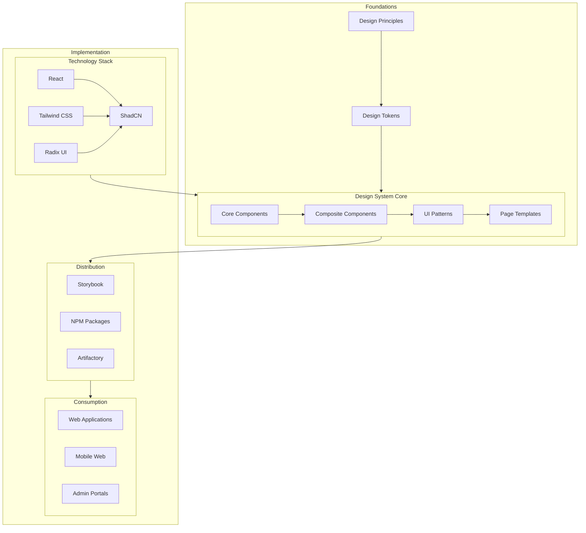
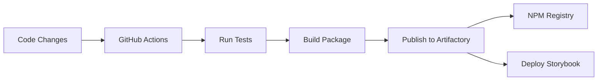

# Design System Architecture

## Introduction

This document provides a comprehensive overview of the Design System architecture for the CMM Technology Platform. It details the structural organization, key components, and technical implementation of our design system. Understanding this architecture is essential for developers and designers who need to extend, maintain, or deeply integrate with the design system.

## Architectural Overview

### High-Level Architecture

The Design System follows a layered architecture that separates concerns while providing a cohesive experience:



### Architectural Layers

#### 1. Foundation Layer

The foundation layer establishes the core principles and values of the design system:

- **Design Principles**: Fundamental guidelines that inform all design decisions
- **Design Tokens**: Standardized values for colors, typography, spacing, and other visual attributes
- **Accessibility Standards**: Requirements and guidelines for creating accessible interfaces

#### 2. Component Layer

The component layer contains the building blocks of the user interface:

- **Core Components**: Primitive UI elements like buttons, inputs, and typography
- **Composite Components**: More complex components composed of multiple core components
- **Healthcare-Specific Components**: Specialized components for healthcare applications

#### 3. Pattern Layer

The pattern layer defines common interaction patterns and layouts:

- **UI Patterns**: Standardized interaction patterns for common tasks
- **Page Templates**: Pre-defined page layouts for common scenarios
- **Workflow Patterns**: Sequences of interactions for completing tasks

#### 4. Implementation Layer

The implementation layer handles the technical aspects of the design system:

- **Technology Stack**: React, Tailwind CSS, ShadCN, and other technologies
- **Distribution**: Storybook, NPM packages, and Artifactory
- **Consumption**: Web applications, mobile web, and admin portals

## Technical Architecture

### Component Architecture

Our components follow a consistent architecture based on React and ShadCN:

```typescript
// Example component architecture
import * as React from 'react'
import { cva, type VariantProps } from 'class-variance-authority'
import { cn } from '@/lib/utils'

// Define variants using class-variance-authority
const componentVariants = cva(
  'base-styles',
  {
    variants: {
      variant: {
        default: 'default-styles',
        primary: 'primary-styles',
        secondary: 'secondary-styles',
        // Healthcare-specific variants
        clinical: 'clinical-styles',
        patient: 'patient-styles',
      },
      size: {
        default: 'default-size',
        sm: 'small-size',
        lg: 'large-size',
      },
    },
    defaultVariants: {
      variant: 'default',
      size: 'default',
    },
  }
)

// Define component props
export interface ComponentProps
  extends React.HTMLAttributes<HTMLElement>,
    VariantProps<typeof componentVariants> {
  // Component-specific props
}

// Define component
const Component = React.forwardRef<HTMLElement, ComponentProps>(
  ({ className, variant, size, ...props }, ref) => {
    return (
      <div
        className={cn(componentVariants({ variant, size, className }))}
        ref={ref}
        {...props}
      />
    )
  }
)

// Set display name
Component.displayName = 'Component'

// Export component and variants
export { Component, componentVariants }
```

### Design Token System

Design tokens are implemented using CSS variables and Tailwind CSS:

```css
:root {
  /* Base colors */
  --color-primary: 210 100% 50%;
  --color-secondary: 270 100% 50%;
  
  /* Healthcare-specific colors */
  --color-clinical: 200 100% 45%;
  --color-patient: 150 100% 45%;
  --color-alert: 0 100% 50%;
  
  /* Typography */
  --font-sans: 'Inter', system-ui, sans-serif;
  --font-mono: 'JetBrains Mono', monospace;
  
  /* Spacing */
  --spacing-unit: 0.25rem;
  
  /* Other tokens */
  --radius-sm: 0.125rem;
  --radius-md: 0.25rem;
  --radius-lg: 0.5rem;
}
```

### Distribution Architecture

Components are distributed through multiple channels:

1. **NPM Packages**: Components are packaged and published to a private NPM registry
2. **Storybook**: Interactive documentation and development environment
3. **Artifactory**: Repository for storing and distributing packages

### Integration Architecture

Applications integrate with the design system through:

1. **Direct Import**: Importing components from NPM packages
2. **Composition**: Composing complex interfaces from simple components
3. **Theming**: Customizing the design system for specific applications

## Healthcare-Specific Architecture

### Clinical Component Architecture

Clinical components follow a specialized architecture that addresses healthcare requirements:

- **Data Validation**: Built-in validation for clinical data
- **Error Handling**: Specialized error handling for clinical workflows
- **Context Awareness**: Components that adapt based on clinical context

### Patient-Facing Component Architecture

Patient-facing components prioritize accessibility and simplicity:

- **Enhanced Accessibility**: Additional accessibility features for diverse patient populations
- **Simplified Interactions**: Streamlined interfaces for non-technical users
- **Mobile Optimization**: Responsive design for mobile devices

## Deployment Architecture

### CI/CD Pipeline

The design system uses a CI/CD pipeline for automated testing, building, and publishing:



### Versioning Strategy

The design system follows semantic versioning:

- **Major Version**: Breaking changes
- **Minor Version**: New features (backward compatible)
- **Patch Version**: Bug fixes and minor updates

## Integration Points

### Security and Access Framework

The Design System integrates with the Security and Access Framework for:

- Authentication UI components
- Authorization patterns
- User profile components

### Federated GraphQL API

The Design System integrates with the Federated GraphQL API for:

- Data fetching patterns
- Loading states
- Error handling

### API Marketplace

The Design System integrates with the API Marketplace for:

- API documentation components
- API testing interfaces
- API management dashboards

## Performance Considerations

### Bundle Size Optimization

The design system employs several strategies to minimize bundle size:

- **Tree Shaking**: Only include used components
- **Code Splitting**: Load components on demand
- **Minification**: Reduce code size

### Rendering Optimization

Components are optimized for efficient rendering:

- **Memoization**: Prevent unnecessary re-renders
- **Virtualization**: Efficiently render large lists
- **Lazy Loading**: Load components when needed

## Accessibility Architecture

Accessibility is built into the architecture:

- **ARIA Attributes**: Proper ARIA roles and attributes
- **Keyboard Navigation**: Complete keyboard support
- **Focus Management**: Logical focus order
- **Screen Reader Support**: Optimized for screen readers

## Conclusion

The Design System architecture provides a robust foundation for creating consistent, accessible, and user-friendly healthcare applications. By following a layered approach with clear separation of concerns, the architecture enables flexibility, maintainability, and scalability. The integration with other components in the CMM Technology Platform ensures a cohesive experience across all applications.

## Related Documentation

- [Design Principles](../02-core-functionality/design-principles.md)
- [Design Tokens](../02-core-functionality/design-tokens.md)
- [Component Patterns](../02-core-functionality/component-patterns.md)
- [Healthcare Guidelines](../02-core-functionality/healthcare-guidelines.md)
