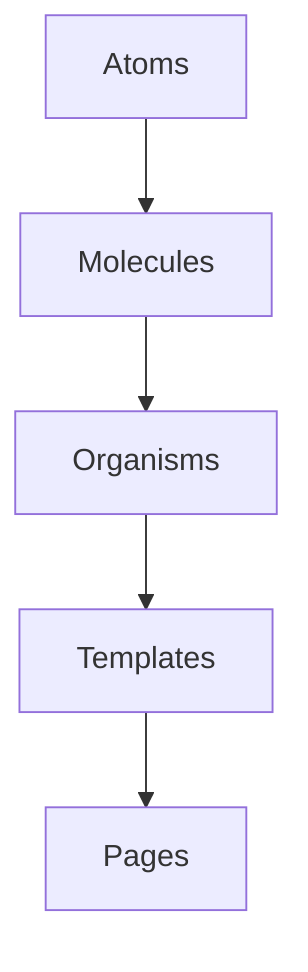

# Design System Key Concepts

## Introduction

This document outlines the fundamental concepts and principles that form the foundation of our Design System. Understanding these key concepts is essential for effectively using, extending, and contributing to the Design System. These concepts provide a shared vocabulary and mental model for designers, developers, and other stakeholders working with the Design System.

## Core Concepts

### Design System Definition

A Design System is a collection of reusable components, guided by clear standards, that can be assembled to build any number of applications. Our Design System specifically includes:

- **Design Principles**: Fundamental guidelines that inform all design decisions
- **Design Tokens**: Visual design atoms (colors, typography, spacing, etc.)
- **Components**: Reusable UI building blocks
- **Patterns**: Standard solutions to common design problems
- **Documentation**: Guidelines for using the system effectively

### Atomic Design Methodology

Our Design System follows the Atomic Design methodology, which organizes components in a hierarchical structure:



1. **Atoms**: Basic building blocks (buttons, inputs, icons)
2. **Molecules**: Simple groups of UI elements functioning together (form fields, search bars)
3. **Organisms**: Complex UI components composed of molecules and atoms (navigation bars, forms)
4. **Templates**: Page-level objects that place components into a layout
5. **Pages**: Specific instances of templates with real content

### Design Tokens

Design tokens are the visual design atoms of the design system—specifically, they are named entities that store visual design attributes. They are used in place of hard-coded values to ensure flexibility and consistency.

```scss
// Example of design tokens
$color-primary: #0066CC;
$color-secondary: #4D5858;
$spacing-small: 0.5rem;
$spacing-medium: 1rem;
$font-family-base: 'Inter', sans-serif;
```

Categories of design tokens include:

- **Colors**: Brand colors, UI colors, text colors
- **Typography**: Font families, sizes, weights, line heights
- **Spacing**: Margins, paddings, gaps
- **Borders**: Width, radius, color
- **Shadows**: Box shadows, drop shadows
- **Z-indices**: Layering and stacking order
- **Animations**: Durations, easing functions

### Component-Based Architecture

Our Design System uses a component-based architecture, which offers several advantages:

- **Reusability**: Components can be used across multiple applications
- **Consistency**: Standardized components ensure a consistent user experience
- **Maintainability**: Changes to a component are reflected everywhere it's used
- **Scalability**: New components can be added without affecting existing ones

Components are categorized as:

- **Base Components**: Fundamental UI elements (buttons, inputs, typography)
- **Composite Components**: Combinations of base components (cards, dialogs, forms)
- **Healthcare-Specific Components**: Components designed for healthcare use cases (patient banners, vital sign displays)

### Design Principles

Our Design System is guided by the following principles:

1. **Clarity**: Information is presented clearly and efficiently
2. **Consistency**: Similar elements behave in similar ways
3. **Accessibility**: Interfaces are usable by people with diverse abilities
4. **Efficiency**: Tasks can be completed with minimal effort
5. **Healthcare Focus**: Designs address the unique needs of healthcare environments

### Design-Development Workflow

The Design System bridges the gap between design and development through:

- **Shared Language**: Common terminology between designers and developers
- **Design Handoff**: Clear process for translating designs to code
- **Component Documentation**: Comprehensive guidelines for implementation
- **Visual Testing**: Tools for comparing implementations to designs

## Technical Concepts

### ShadCN and Tailwind CSS

Our Design System is built on ShadCN and Tailwind CSS:

- **ShadCN**: A collection of reusable components built with Radix UI and Tailwind CSS
- **Tailwind CSS**: A utility-first CSS framework for rapid UI development

This combination provides:

- **Utility-First Styling**: Rapid styling without writing custom CSS
- **Accessibility**: Built-in accessibility features from Radix UI
- **Customization**: Easy theming and extension
- **Performance**: Optimized bundle sizes through PurgeCSS

### Component Variants

Components in our Design System support variants, which are different visual or behavioral versions of the same component:

```jsx
// Example of component variants
<Button variant="primary">Primary Button</Button>
<Button variant="secondary">Secondary Button</Button>
<Button variant="clinical">Clinical Button</Button>
```

Variants are implemented using class-variance-authority (CVA):

```typescript
const buttonVariants = cva(
  'base-button-styles',
  {
    variants: {
      variant: {
        primary: 'primary-styles',
        secondary: 'secondary-styles',
        clinical: 'clinical-styles',
      },
      size: {
        default: 'default-size',
        sm: 'small-size',
        lg: 'large-size',
      },
    },
    defaultVariants: {
      variant: 'primary',
      size: 'default',
    },
  }
);
```

### Theming System

Our Design System supports theming through CSS variables and Tailwind CSS:

```css
:root {
  /* Light theme (default) */
  --background: 0 0% 100%;
  --foreground: 222.2 47.4% 11.2%;
  --primary: 221.2 83.2% 53.3%;
  --primary-foreground: 210 40% 98%;
}

.dark {
  /* Dark theme */
  --background: 224 71% 4%;
  --foreground: 213 31% 91%;
  --primary: 217.2 91.2% 59.8%;
  --primary-foreground: 210 40% 98%;
}

.clinical {
  /* Clinical theme */
  --background: 210 40% 98%;
  --foreground: 222.2 47.4% 11.2%;
  --primary: 200 100% 45%;
  --primary-foreground: 210 40% 98%;
}
```

### Responsive Design

Our Design System uses a mobile-first approach to responsive design:

```jsx
// Example of responsive design with Tailwind CSS
<div className="grid grid-cols-1 md:grid-cols-2 lg:grid-cols-3 gap-4">
  <Card />
  <Card />
  <Card />
</div>
```

Breakpoints follow standard device sizes:

- **sm**: 640px and above
- **md**: 768px and above
- **lg**: 1024px and above
- **xl**: 1280px and above
- **2xl**: 1536px and above

## Healthcare-Specific Concepts

### Clinical Design Patterns

Our Design System includes patterns specifically designed for clinical workflows:

- **Information Density**: Balancing comprehensive data with cognitive load
- **Critical Information Hierarchy**: Ensuring important clinical data stands out
- **Error Prevention**: Design patterns that minimize clinical errors
- **Interruption Recovery**: Supporting clinical workflows with frequent interruptions

### Patient-Facing Design Patterns

Patterns designed for patient-facing applications focus on:

- **Health Literacy**: Accommodating various levels of health literacy
- **Accessibility**: Enhanced accessibility for diverse patient populations
- **Simplicity**: Clear, straightforward interfaces for non-technical users
- **Trust**: Design elements that establish credibility and trust

### Healthcare Data Visualization

Specialized patterns for displaying healthcare data:

- **Vital Signs**: Standard display formats for vital signs
- **Lab Results**: Visualization of laboratory results with reference ranges
- **Trends Over Time**: Patterns for showing changes in health metrics
- **Abnormal Value Highlighting**: Consistent methods for highlighting abnormal values

## Governance Concepts

### Component Lifecycle

Components in our Design System follow a defined lifecycle:

1. **Proposal**: Initial component proposal and requirements
2. **Design**: Creation of component design and variants
3. **Development**: Implementation of the component in code
4. **Review**: Quality assurance and accessibility testing
5. **Documentation**: Creation of usage guidelines and examples
6. **Release**: Publication of the component to the library
7. **Maintenance**: Ongoing updates and improvements
8. **Deprecation**: Process for retiring outdated components

### Versioning Strategy

Our Design System follows semantic versioning (MAJOR.MINOR.PATCH):

- **MAJOR**: Breaking changes that require updates to consuming applications
- **MINOR**: New features or components (backward compatible)
- **PATCH**: Bug fixes and minor updates (backward compatible)

### Contribution Model

The Design System follows a federated contribution model:

- **Core Team**: Maintains the Design System foundations and core components
- **Contributors**: Subject matter experts who contribute specialized components
- **Consumers**: Teams that use the Design System in their applications

## Conclusion

Understanding these key concepts provides a foundation for working effectively with our Design System. These concepts establish a shared vocabulary and mental model that bridges the gap between design and development, ensuring consistency and quality across all healthcare applications.

## Related Documentation

- [Design Principles](../02-core-functionality/design-principles.md)
- [Design Tokens](../02-core-functionality/design-tokens.md)
- [Component Patterns](../02-core-functionality/component-patterns.md)
- [Healthcare Guidelines](../02-core-functionality/healthcare-guidelines.md)
