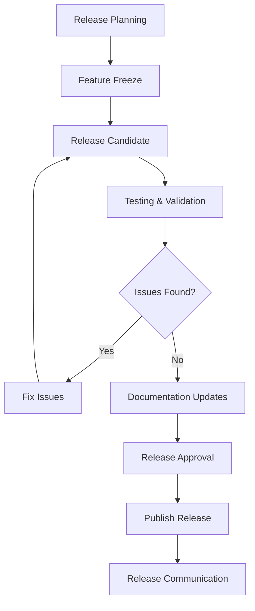

# Governance and Contribution Guidelines

## Governance Structure

The CMM Reference Architecture Design System is governed by a structured approach that balances centralized oversight with distributed contribution. This structure ensures the design system remains consistent, maintainable, and aligned with organizational goals.

### Design System Team

The core team responsible for the day-to-day management of the design system:

- **Design System Lead**: Overall responsibility for the design system strategy and direction
- **Lead Designer**: Responsible for visual design, user experience, and design tokens
- **Lead Developer**: Responsible for component implementation, documentation, and technical standards
- **Accessibility Specialist**: Ensures all components meet accessibility requirements
- **Clinical UX Specialist**: Provides healthcare-specific expertise and clinical workflow knowledge
- **Compliance Officer**: Ensures alignment with healthcare regulations and standards

### Design System Council

A cross-functional group that provides strategic guidance and approves major changes:

- **Product Leadership**: Representatives from key product areas
- **Design Leadership**: Design directors or managers
- **Engineering Leadership**: Engineering directors or managers
- **Clinical Representatives**: Physicians, nurses, and other clinical stakeholders
- **Compliance Representatives**: Privacy, security, and regulatory experts
- **Accessibility Experts**: Internal or external accessibility specialists

### Working Groups

Specialized teams focused on specific aspects of the design system:

- **Component Working Group**: Develops and maintains core components
- **Pattern Working Group**: Develops and maintains clinical patterns and workflows
- **Accessibility Working Group**: Ensures accessibility compliance
- **Healthcare Compliance Working Group**: Addresses healthcare-specific compliance requirements
- **Documentation Working Group**: Creates and maintains documentation

## Decision-Making Process

### Change Management

The design system uses a structured process for managing changes:

#### 1. Request

Changes begin with a formal request, which can come from:
- Design system team members
- Product teams
- Clinical stakeholders
- Compliance requirements
- User research findings

#### 2. Triage

Requests are triaged by the design system team based on:
- Strategic alignment
- User impact
- Technical feasibility
- Compliance requirements
- Resource availability

#### 3. Evaluation

Approved requests undergo detailed evaluation:
- Design exploration
- Technical assessment
- Accessibility review
- Compliance review
- User testing (when appropriate)

#### 4. Approval

Changes require approval at different levels based on impact:
- **Minor Changes**: Design system team approval
- **Significant Changes**: Working group approval
- **Major Changes**: Design system council approval

#### 5. Implementation

Approved changes are implemented following established standards:
- Design specifications
- Component development
- Documentation updates
- Testing and validation

#### 6. Release

Changes are released according to the versioning strategy:
- Version number updates
- Release notes
- Migration guides (if needed)
- Notification to stakeholders

## Contribution Guidelines

### Component Development

#### Component Proposal Process

1. **Initial Proposal**
   - Submit a component proposal using the standard template
   - Include use cases, requirements, and examples
   - Identify related components and potential overlaps

2. **Design Exploration**
   - Create initial design concepts
   - Review with stakeholders and gather feedback
   - Refine based on feedback

3. **Technical Assessment**
   - Evaluate technical feasibility
   - Identify dependencies and potential issues
   - Determine implementation approach

4. **Accessibility Review**
   - Ensure WCAG 2.1 AA compliance
   - Address healthcare-specific accessibility needs
   - Document accessibility considerations

5. **Compliance Review**
   - Evaluate against relevant regulations (HIPAA, GDPR, etc.)
   - Address any compliance concerns
   - Document compliance considerations

6. **Final Approval**
   - Present final proposal to appropriate approval level
   - Address any feedback or concerns
   - Obtain formal approval for implementation

#### Development Standards

```jsx
// Example: Button component following development standards
import * as React from "react";
import { cva } from "class-variance-authority";
import { cn } from "@/lib/utils";

// Define button variants using class-variance-authority
const buttonVariants = cva(
  "inline-flex items-center justify-center whitespace-nowrap rounded-md text-sm font-medium ring-offset-background transition-colors focus-visible:outline-none focus-visible:ring-2 focus-visible:ring-ring focus-visible:ring-offset-2 disabled:pointer-events-none disabled:opacity-50",
  {
    variants: {
      variant: {
        default: "bg-primary text-primary-foreground hover:bg-primary/90",
        destructive: "bg-destructive text-destructive-foreground hover:bg-destructive/90",
        outline: "border border-input bg-background hover:bg-accent hover:text-accent-foreground",
        secondary: "bg-secondary text-secondary-foreground hover:bg-secondary/80",
        ghost: "hover:bg-accent hover:text-accent-foreground",
        link: "text-primary underline-offset-4 hover:underline",
        // Healthcare-specific variants
        clinical: "bg-clinical text-clinical-foreground hover:bg-clinical/90",
        patient: "bg-patient text-patient-foreground hover:bg-patient/90",
        admin: "bg-admin text-admin-foreground hover:bg-admin/90",
      },
      size: {
        default: "h-10 px-4 py-2",
        sm: "h-9 rounded-md px-3",
        lg: "h-11 rounded-md px-8",
        icon: "h-10 w-10",
      },
    },
    defaultVariants: {
      variant: "default",
      size: "default",
    },
  }
);

// Button component with comprehensive props and documentation
export interface ButtonProps
  extends React.ButtonHTMLAttributes<HTMLButtonElement> {
  /**
   * The visual style of the button
   * @default "default"
   */
  variant?: "default" | "destructive" | "outline" | "secondary" | "ghost" | "link" | "clinical" | "patient" | "admin";
  
  /**
   * The size of the button
   * @default "default"
   */
  size?: "default" | "sm" | "lg" | "icon";
  
  /**
   * The element to render as (polymorphic component)
   */
  asChild?: boolean;
  
  /**
   * Additional class names to apply
   */
  className?: string;
}

/**
 * Button component for user interactions
 * 
 * @example
 * ```tsx
 * <Button variant="clinical" onClick={handleSave}>Save Patient</Button>
 * ```
 * 
 * @accessibility
 * - Ensures keyboard focus styles with focus-visible utility
 * - Disabled state properly handled with aria-disabled
 * - Touch target size meets WCAG requirements
 * 
 * @compliance
 * - Meets WCAG 2.1 AA requirements
 * - Clinical variant follows healthcare UI guidelines
 */
const Button = React.forwardRef<HTMLButtonElement, ButtonProps>(
  ({ className, variant, size, asChild = false, ...props }, ref) => {
    const Comp = asChild ? Slot : "button";
    return (
      <Comp
        className={cn(buttonVariants({ variant, size, className }))}
        ref={ref}
        {...props}
      />
    );
  }
);
Button.displayName = "Button";

export { Button, buttonVariants };
```

#### Documentation Requirements

All components require the following documentation:

1. **Component Overview**
   - Purpose and use cases
   - Visual examples
   - Variants and configurations

2. **API Documentation**
   - Props and their types
   - Default values
   - Required vs. optional props

3. **Accessibility Considerations**
   - WCAG compliance notes
   - Keyboard interaction
   - Screen reader behavior

4. **Healthcare Considerations**
   - Clinical usage guidance
   - Compliance considerations
   - Patient safety implications

5. **Code Examples**
   - Basic usage
   - Common configurations
   - Integration examples

### Design Contribution

#### Design Token Updates

1. **Token Change Proposal**
   - Submit a proposal for token changes
   - Include rationale and examples
   - Identify affected components

2. **Impact Assessment**
   - Evaluate impact on existing components
   - Assess visual consistency
   - Consider accessibility implications

3. **Implementation Plan**
   - Determine implementation approach
   - Create migration strategy
   - Plan for backward compatibility

#### Component Design Updates

1. **Design Review Process**
   - Submit design updates for review
   - Provide before/after comparisons
   - Include rationale for changes

2. **User Testing Requirements**
   - Conduct appropriate user testing
   - Document testing methodology
   - Summarize findings and recommendations

3. **Implementation Coordination**
   - Collaborate with development team
   - Provide detailed specifications
   - Review implementation for accuracy

## Component Lifecycle Management

Components in the design system follow a defined lifecycle:

### 1. Experimental

- Initial exploration of new components
- Limited documentation
- Not recommended for production use
- Clearly labeled as experimental

### 2. Beta

- More stable implementation
- Basic documentation available
- Limited production use with caution
- Feedback actively collected

### 3. Stable

- Fully implemented and tested
- Comprehensive documentation
- Recommended for production use
- Regular maintenance and updates

### 4. Deprecated

- No longer recommended for new development
- Maintained for backward compatibility
- Migration path documented
- Timeline for removal established

### 5. Removed

- No longer available in current versions
- Removed from documentation
- Migration guides archived

## Version Control and Release Management

### Versioning Strategy

The design system follows semantic versioning (SemVer):

- **Major Version (X.0.0)**: Breaking changes that require updates to consuming applications
- **Minor Version (0.X.0)**: New features or components added in a backward-compatible manner
- **Patch Version (0.0.X)**: Bug fixes and minor updates that don't affect functionality

### Release Cadence

- **Patch Releases**: As needed for critical fixes
- **Minor Releases**: Monthly or quarterly, depending on feature development
- **Major Releases**: Scheduled 2-4 times per year, with advance notice

### Release Process



1. **Release Planning**: Identifying changes for inclusion
2. **Feature Freeze**: Cut-off for new feature additions
3. **Release Candidate**: Creation of release candidate
4. **Testing & Validation**: Comprehensive testing
5. **Documentation Updates**: Ensuring all changes are documented
6. **Release Approval**: Final review by appropriate stakeholders
7. **Publish Release**: Publishing to repositories
8. **Release Communication**: Notifying stakeholders

## Quality Assurance

### Testing Standards

All components undergo rigorous testing:

- **Unit Testing**: Component functionality
- **Integration Testing**: Component interactions
- **Accessibility Testing**: WCAG compliance
- **Cross-Browser Testing**: Support for required browsers
- **Responsive Testing**: Behavior across device sizes
- **Performance Testing**: Load time and runtime performance

```jsx
// Example: Button component test
import { render, screen, fireEvent } from '@testing-library/react';
import { axe, toHaveNoViolations } from 'jest-axe';
import { Button } from './Button';

// Extend Jest with accessibility matchers
expect.extend(toHaveNoViolations);

describe('Button', () => {
  it('renders correctly with default props', () => {
    render(<Button>Click me</Button>);
    const button = screen.getByRole('button', { name: /click me/i });
    expect(button).toBeInTheDocument();
    expect(button).toHaveClass('bg-primary');
  });
  
  it('renders with different variants', () => {
    const { rerender } = render(<Button variant="clinical">Clinical</Button>);
    expect(screen.getByRole('button')).toHaveClass('bg-clinical');
    
    rerender(<Button variant="destructive">Destructive</Button>);
    expect(screen.getByRole('button')).toHaveClass('bg-destructive');
  });
  
  it('handles click events', () => {
    const handleClick = jest.fn();
    render(<Button onClick={handleClick}>Click me</Button>);
    
    fireEvent.click(screen.getByRole('button'));
    expect(handleClick).toHaveBeenCalledTimes(1);
  });
  
  it('is disabled when disabled prop is true', () => {
    render(<Button disabled>Disabled</Button>);
    const button = screen.getByRole('button');
    
    expect(button).toBeDisabled();
    expect(button).toHaveClass('disabled:opacity-50');
  });
  
  it('has no accessibility violations', async () => {
    const { container } = render(<Button>Accessible Button</Button>);
    const results = await axe(container);
    
    expect(results).toHaveNoViolations();
  });
});
```

### Compliance Validation

Specialized testing for healthcare compliance:

- **Privacy Reviews**: Ensuring components handle PHI appropriately
- **Security Assessments**: Identifying potential security issues
- **Regulatory Compliance**: Validation against relevant regulations
- **Clinical Safety Checks**: Ensuring components don't introduce clinical risks

## Communication and Documentation

### Communication Channels

- **Design System Website**: Primary source of documentation
- **Team Slack Channel**: Day-to-day communication
- **Monthly Newsletter**: Updates on changes and roadmap
- **Quarterly Meetings**: Broader updates for all stakeholders
- **Training Sessions**: Education on new features and best practices

### Documentation Standards

All components require the following documentation:

- **Usage Guidelines**: When and how to use the component
- **Code Examples**: Implementation examples
- **Props/API Documentation**: Technical specifications
- **Accessibility Considerations**: Specific accessibility requirements
- **Healthcare Considerations**: Clinical usage guidance
- **Design Specifications**: Visual design details

## Measuring Success

### Key Performance Indicators

The design system's success is measured through the following metrics:

- **Adoption Rate**: Percentage of products using the design system
- **Component Usage**: Frequency of component usage across applications
- **Consistency Score**: Measurement of visual and interaction consistency
- **Development Velocity**: Impact on development speed
- **Defect Rate**: Number of reported issues
- **Accessibility Compliance**: Percentage of components meeting standards
- **User Satisfaction**: Feedback from developers and designers
- **Clinical Effectiveness**: Impact on clinical workflows

## Conclusion

These governance and contribution guidelines provide a framework for managing and evolving the CMM Reference Architecture Design System. By following these guidelines, contributors can ensure that the design system remains consistent, high-quality, and aligned with organizational goals.

The governance model balances centralized oversight with distributed contribution, enabling the design system to evolve while maintaining consistency and quality. Regular reviews and updates to these guidelines will ensure they remain effective as the design system and organization evolve.
