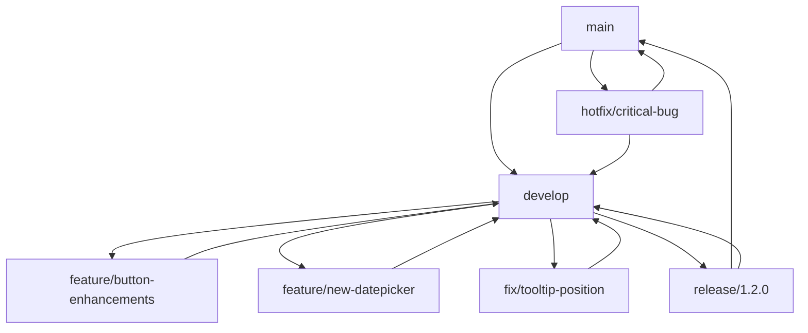

# Version Control and Release Management

## Introduction

Effective version control and release management are essential for maintaining a stable, reliable design system that can evolve while supporting existing applications. This document outlines the processes, standards, and best practices for version control and release management of the CMM Reference Architecture Design System.

## Versioning Strategy

### Semantic Versioning

The design system follows semantic versioning (SemVer) to provide clear communication about the nature of changes:

- **Major Version (X.0.0)**: Breaking changes that require updates to consuming applications
  - Examples: Component API changes, removal of components, theme structure changes
  
- **Minor Version (0.X.0)**: New features or components added in a backward-compatible manner
  - Examples: New components, new variants, additional features to existing components
  
- **Patch Version (0.0.X)**: Bug fixes and minor updates that don't affect functionality
  - Examples: Visual fixes, performance improvements, documentation updates

### Version Compatibility

The design system maintains compatibility matrices to help teams understand which versions work together:

| Design System Version | React Version | Tailwind Version | Node.js Version |
|-----------------------|---------------|------------------|------------------|
| 1.0.x                 | ≥ 18.0.0      | 3.3.x            | ≥ 18.0.0         |
| 1.1.x                 | ≥ 18.0.0      | 3.3.x            | ≥ 18.0.0         |
| 2.0.x                 | ≥ 18.0.0      | 3.4.x            | ≥ 18.0.0         |

## Repository Structure

### Monorepo Approach

The design system uses a monorepo structure to manage related packages:

```
/design-system
  /packages
    /core                 # Core components and utilities
    /clinical             # Healthcare-specific components
    /tokens               # Design tokens
    /hooks                # React hooks
    /utils                # Utility functions
    /icons                # Icon library
    /cli                  # CLI tools for the design system
  /apps
    /docs                 # Documentation site
    /storybook            # Storybook instance
    /playground           # Component playground
  /scripts                # Build and release scripts
  /config                 # Shared configuration
```

### Branch Strategy

The repository follows a structured branching strategy:

- **main**: The primary branch containing the latest stable release
- **develop**: Integration branch for features and fixes
- **feature/[name]**: Feature branches for new components or enhancements
- **fix/[name]**: Branches for bug fixes
- **release/[version]**: Release preparation branches
- **hotfix/[name]**: Urgent fixes for production issues



## Release Process

### Release Planning

1. **Feature Collection**
   - Identify features and fixes for inclusion in the release
   - Prioritize based on user needs and strategic goals
   - Create a release plan with target dates

2. **Feature Freeze**
   - Establish a cut-off date for new feature additions
   - Focus on stabilization and quality assurance
   - Address any blocking issues

### Release Preparation

1. **Create Release Branch**
   ```bash
   git checkout develop
   git pull
   git checkout -b release/1.2.0
   ```

2. **Version Bump**
   - Update version numbers in package.json files
   - Update CHANGELOG.md with detailed release notes
   - Update any version-specific documentation

   ```bash
   # Example version bump script
   node scripts/bump-version.js --version=1.2.0
   ```

3. **Release Candidate**
   - Build and publish release candidate packages
   - Tag the release candidate in git
   
   ```bash
   # Build packages
   pnpm build
   
   # Create release candidate tag
   git tag -a v1.2.0-rc.1 -m "Release candidate 1 for version 1.2.0"
   git push origin v1.2.0-rc.1
   
   # Publish release candidate to npm
   pnpm publish --tag next
   ```

### Testing and Validation

1. **Automated Testing**
   - Run comprehensive test suite
   - Verify all components meet quality standards
   - Check for regressions

   ```bash
   # Run all tests
   pnpm test
   
   # Run visual regression tests
   pnpm test:visual
   
   # Run accessibility tests
   pnpm test:a11y
   ```

2. **Manual Validation**
   - Test in reference applications
   - Verify documentation accuracy
   - Perform cross-browser testing

3. **Stakeholder Review**
   - Share release candidate with key stakeholders
   - Collect feedback and address issues
   - Obtain final approval for release

### Release Execution

1. **Final Version Preparation**
   - Address any issues found during testing
   - Prepare final release notes
   - Update documentation site

2. **Merge Release Branch**
   ```bash
   # Merge to main
   git checkout main
   git merge --no-ff release/1.2.0
   git tag -a v1.2.0 -m "Version 1.2.0"
   git push origin main --tags
   
   # Merge back to develop
   git checkout develop
   git merge --no-ff release/1.2.0
   git push origin develop
   ```

3. **Publish Packages**
   ```bash
   # Build final packages
   pnpm build
   
   # Publish to npm
   pnpm publish
   ```

4. **Release Announcement**
   - Publish release notes
   - Send announcement to stakeholders
   - Update documentation site

## Hotfix Process

For critical issues that need immediate attention:

1. **Create Hotfix Branch**
   ```bash
   git checkout main
   git checkout -b hotfix/critical-bug
   ```

2. **Implement and Test Fix**
   - Make minimal changes to address the issue
   - Add tests to prevent regression
   - Verify the fix works as expected

3. **Version Bump**
   - Increment the patch version
   - Update CHANGELOG.md with hotfix details

4. **Release Hotfix**
   ```bash
   # Merge to main
   git checkout main
   git merge --no-ff hotfix/critical-bug
   git tag -a v1.2.1 -m "Hotfix: Critical bug fix"
   git push origin main --tags
   
   # Merge to develop
   git checkout develop
   git merge --no-ff hotfix/critical-bug
   git push origin develop
   ```

5. **Publish Hotfix**
   ```bash
   pnpm build
   pnpm publish
   ```

## Continuous Integration

### CI Pipeline

The design system uses GitHub Actions for continuous integration:

```yaml
# .github/workflows/ci.yml
name: CI

on:
  push:
    branches: [main, develop, 'release/*']
  pull_request:
    branches: [main, develop]

jobs:
  test:
    runs-on: ubuntu-latest
    steps:
      - uses: actions/checkout@v3
      - uses: pnpm/action-setup@v2
        with:
          version: 8
      - uses: actions/setup-node@v3
        with:
          node-version: '18'
          cache: 'pnpm'
      - run: pnpm install --frozen-lockfile
      - run: pnpm lint
      - run: pnpm test
      - run: pnpm build

  visual-tests:
    runs-on: ubuntu-latest
    needs: test
    steps:
      - uses: actions/checkout@v3
      - uses: pnpm/action-setup@v2
        with:
          version: 8
      - uses: actions/setup-node@v3
        with:
          node-version: '18'
          cache: 'pnpm'
      - run: pnpm install --frozen-lockfile
      - run: pnpm test:visual

  accessibility-tests:
    runs-on: ubuntu-latest
    needs: test
    steps:
      - uses: actions/checkout@v3
      - uses: pnpm/action-setup@v2
        with:
          version: 8
      - uses: actions/setup-node@v3
        with:
          node-version: '18'
          cache: 'pnpm'
      - run: pnpm install --frozen-lockfile
      - run: pnpm test:a11y
```

### Automated Checks

Automated checks run on all pull requests:

- **Linting**: Code style and quality checks
- **Unit Tests**: Component functionality tests
- **Integration Tests**: Component interaction tests
- **Visual Regression Tests**: UI appearance tests
- **Accessibility Tests**: WCAG compliance tests
- **Performance Tests**: Load time and runtime checks
- **Bundle Size Analysis**: Package size monitoring

## Dependency Management

### External Dependencies

The design system carefully manages external dependencies:

- **Peer Dependencies**: Core libraries like React and Tailwind CSS
- **Dependencies**: Essential packages required at runtime
- **Dev Dependencies**: Packages needed only for development

### Dependency Updates

Regular dependency updates follow a structured process:

1. **Weekly Automated Updates**
   - Dependabot creates PRs for minor and patch updates
   - Automated tests verify compatibility

2. **Monthly Major Version Review**
   - Manual review of major version updates
   - Testing in isolated environments
   - Impact assessment for consuming applications

3. **Dependency Audit**
   - Regular security audits
   - Performance impact analysis
   - Bundle size monitoring

## Documentation and Communication

### Release Notes

Detailed release notes are provided for each version:

```markdown
# Changelog

## [2.0.0] - 2025-05-01

### Breaking Changes

- **Button**: Changed API for variant prop, now uses string literals instead of enum
- **Theme**: Restructured theme object for better dark mode support
- **Icons**: Migrated from custom icons to Lucide React

### Added

- **DatePicker**: New component for date selection
- **TimePicker**: New component for time selection
- **Toast**: Added new positions (top-left, top-right, bottom-left, bottom-right)

### Changed

- **Card**: Improved responsive behavior
- **Dialog**: Enhanced keyboard navigation
- **Table**: Added support for virtualization

### Fixed

- **Tooltip**: Fixed positioning issue in scrollable containers
- **Select**: Addressed screen reader accessibility issues
- **Tabs**: Fixed keyboard navigation in RTL mode

## [1.2.1] - 2025-04-15

### Fixed

- **Button**: Fixed focus style in Safari
- **Modal**: Addressed scroll lock issue on iOS
```

### Migration Guides

For major versions, detailed migration guides are provided:

```markdown
# Migrating from v1.x to v2.0

## Button Component Changes

### Before (v1.x)

```tsx
import { Button, ButtonVariant } from '@cmm/design-system';

<Button variant={ButtonVariant.PRIMARY}>Click me</Button>
```

### After (v2.0)

```tsx
import { Button } from '@cmm/design-system';

<Button variant="primary">Click me</Button>
```

## Theme Structure Changes

### Before (v1.x)

```tsx
const theme = {
  colors: {
    primary: '#0284c7',
    // ...
  }
};
```

### After (v2.0)

```tsx
const theme = {
  colors: {
    primary: {
      default: '#0284c7',
      dark: '#0369a1'
    },
    // ...
  }
};
```
```

### Communication Plan

A structured communication plan ensures all stakeholders are informed:

1. **Pre-Release Communication**
   - Announcements of upcoming releases
   - Highlights of major features and changes
   - Timeline for release

2. **Release Announcements**
   - Detailed release notes
   - Links to documentation and examples
   - Migration guides for breaking changes

3. **Post-Release Support**
   - Office hours for questions
   - Dedicated support channels
   - Feedback collection

## Deprecation Policy

### Component Deprecation

When components need to be deprecated:

1. **Deprecation Notice**
   - Mark component as deprecated in documentation
   - Add console warnings in development mode
   - Provide migration path to alternatives

2. **Deprecation Period**
   - Maintain deprecated components for at least one major version
   - Continue to fix critical bugs in deprecated components
   - Provide examples of how to migrate

3. **Removal**
   - Remove deprecated components only in major versions
   - Provide clear documentation about removed components
   - Ensure migration guides remain available

### API Deprecation

For API changes:

1. **Soft Deprecation**
   - Support both old and new APIs
   - Add deprecation warnings for old API
   - Document migration path

2. **Hard Deprecation**
   - Remove deprecated APIs in major versions
   - Update all examples and documentation
   - Provide codemods for automated migration when possible

## Conclusion

Effective version control and release management are essential for maintaining a stable, reliable design system. By following these processes and standards, the CMM Reference Architecture Design System can evolve while supporting existing applications and ensuring a smooth transition for teams adopting new versions.

Regular reviews and updates to these processes will ensure they remain effective as the design system and organization evolve.
