# Continuous Integration and Deployment

## Introduction

A robust Continuous Integration and Deployment (CI/CD) pipeline is essential for maintaining the quality, reliability, and consistency of the CMM Technology Platform Design System. This document outlines the CI/CD strategy, tools, and processes used to automate testing, building, and deployment of the design system.

## CI/CD Strategy

### Core Principles

The CI/CD pipeline for the design system is built on the following principles:

1. **Automation First**: Automate all repetitive tasks to ensure consistency and reduce human error
2. **Quality Gates**: Implement quality checks at each stage of the pipeline
3. **Fast Feedback**: Provide quick feedback to developers about issues
4. **Visibility**: Make pipeline status and results easily accessible
5. **Reproducibility**: Ensure builds are reproducible and deterministic

### Pipeline Overview

The CI/CD pipeline consists of several stages:

```mermaid
flowchart LR
    A[Code Commit] --> B[Static Analysis]
    B --> C[Unit Tests]
    C --> D[Integration Tests]
    D --> E[Build]
    E --> F[Visual Regression Tests]
    F --> G[Accessibility Tests]
    G --> H[Performance Tests]
    H --> I[Documentation Build]
    I --> J[Package Publishing]
    J --> K[Documentation Deployment]
```



## CI/CD Implementation

### GitHub Actions Workflow

The design system uses GitHub Actions for CI/CD automation. Below is the primary workflow configuration:

```yaml
# .github/workflows/ci-cd.yml
name: CI/CD Pipeline

on:
  push:
    branches: [main, develop]
  pull_request:
    branches: [main, develop]

jobs:
  lint-and-test:
    runs-on: ubuntu-latest
    steps:
      - uses: actions/checkout@v3
      - uses: pnpm/action-setup@v2
        with:
          version: 8
      - uses: actions/setup-node@v3
        with:
          node-version: '18'
          cache: 'pnpm'
      - name: Install dependencies
        run: pnpm install --frozen-lockfile
      - name: Lint
        run: pnpm lint
      - name: Type check
        run: pnpm type-check
      - name: Unit tests
        run: pnpm test

  build-and-integration-tests:
    needs: lint-and-test
    runs-on: ubuntu-latest
    steps:
      - uses: actions/checkout@v3
      - uses: pnpm/action-setup@v2
        with:
          version: 8
      - uses: actions/setup-node@v3
        with:
          node-version: '18'
          cache: 'pnpm'
      - name: Install dependencies
        run: pnpm install --frozen-lockfile
      - name: Build packages
        run: pnpm build
      - name: Integration tests
        run: pnpm test:integration
      - name: Upload build artifacts
        uses: actions/upload-artifact@v3
        with:
          name: build-artifacts
          path: packages/*/dist

  visual-regression-tests:
    needs: build-and-integration-tests
    runs-on: ubuntu-latest
    steps:
      - uses: actions/checkout@v3
      - uses: pnpm/action-setup@v2
        with:
          version: 8
      - uses: actions/setup-node@v3
        with:
          node-version: '18'
          cache: 'pnpm'
      - name: Install dependencies
        run: pnpm install --frozen-lockfile
      - name: Download build artifacts
        uses: actions/download-artifact@v3
        with:
          name: build-artifacts
          path: packages
      - name: Visual regression tests
        run: pnpm test:visual

  accessibility-tests:
    needs: build-and-integration-tests
    runs-on: ubuntu-latest
    steps:
      - uses: actions/checkout@v3
      - uses: pnpm/action-setup@v2
        with:
          version: 8
      - uses: actions/setup-node@v3
        with:
          node-version: '18'
          cache: 'pnpm'
      - name: Install dependencies
        run: pnpm install --frozen-lockfile
      - name: Download build artifacts
        uses: actions/download-artifact@v3
        with:
          name: build-artifacts
          path: packages
      - name: Accessibility tests
        run: pnpm test:a11y

  performance-tests:
    needs: build-and-integration-tests
    runs-on: ubuntu-latest
    steps:
      - uses: actions/checkout@v3
      - uses: pnpm/action-setup@v2
        with:
          version: 8
      - uses: actions/setup-node@v3
        with:
          node-version: '18'
          cache: 'pnpm'
      - name: Install dependencies
        run: pnpm install --frozen-lockfile
      - name: Download build artifacts
        uses: actions/download-artifact@v3
        with:
          name: build-artifacts
          path: packages
      - name: Performance tests
        run: pnpm test:performance
      - name: Bundle size analysis
        run: pnpm analyze-bundle

  documentation-build:
    needs: build-and-integration-tests
    runs-on: ubuntu-latest
    steps:
      - uses: actions/checkout@v3
      - uses: pnpm/action-setup@v2
        with:
          version: 8
      - uses: actions/setup-node@v3
        with:
          node-version: '18'
          cache: 'pnpm'
      - name: Install dependencies
        run: pnpm install --frozen-lockfile
      - name: Build documentation
        run: pnpm docs:build
      - name: Upload documentation
        uses: actions/upload-artifact@v3
        with:
          name: documentation
          path: apps/docs/dist

  publish:
    if: github.event_name == 'push' && github.ref == 'refs/heads/main'
    needs: [visual-regression-tests, accessibility-tests, performance-tests, documentation-build]
    runs-on: ubuntu-latest
    steps:
      - uses: actions/checkout@v3
      - uses: pnpm/action-setup@v2
        with:
          version: 8
      - uses: actions/setup-node@v3
        with:
          node-version: '18'
          cache: 'pnpm'
          registry-url: 'https://registry.npmjs.org'
      - name: Install dependencies
        run: pnpm install --frozen-lockfile
      - name: Download build artifacts
        uses: actions/download-artifact@v3
        with:
          name: build-artifacts
          path: packages
      - name: Publish packages
        run: pnpm publish-packages
        env:
          NODE_AUTH_TOKEN: ${{ secrets.NPM_TOKEN }}

  deploy-documentation:
    if: github.event_name == 'push' && github.ref == 'refs/heads/main'
    needs: publish
    runs-on: ubuntu-latest
    steps:
      - uses: actions/checkout@v3
      - name: Download documentation
        uses: actions/download-artifact@v3
        with:
          name: documentation
          path: docs-dist
      - name: Deploy to GitHub Pages
        uses: JamesIves/github-pages-deploy-action@v4
        with:
          folder: docs-dist
```

## Testing Strategy

### Static Analysis

Static analysis tools help catch issues early:

- **ESLint**: Code quality and style checking
- **TypeScript**: Static type checking
- **Prettier**: Code formatting
- **Stylelint**: CSS/SCSS linting

### Unit Testing

Unit tests verify individual component functionality:

```jsx
// Example: Button component unit test
import { render, screen, fireEvent } from '@testing-library/react';
import { Button } from './Button';

describe('Button', () => {
  it('renders correctly with default props', () => {
    render(<Button>Click me</Button>);
    const button = screen.getByRole('button', { name: /click me/i });
    expect(button).toBeInTheDocument();
    expect(button).toHaveClass('bg-primary');
  });
  
  it('handles click events', () => {
    const handleClick = jest.fn();
    render(<Button onClick={handleClick}>Click me</Button>);
    
    fireEvent.click(screen.getByRole('button'));
    expect(handleClick).toHaveBeenCalledTimes(1);
  });
});
```

### Integration Testing

Integration tests verify component interactions:

```jsx
// Example: Form component integration test
import { render, screen, fireEvent } from '@testing-library/react';
import { Form, TextField, Button } from '../components';

describe('Form Integration', () => {
  it('submits form data correctly', async () => {
    const handleSubmit = jest.fn();
    
    render(
      <Form onSubmit={handleSubmit}>
        <TextField name="username" label="Username" />
        <TextField name="password" label="Password" type="password" />
        <Button type="submit">Submit</Button>
      </Form>
    );
    
    // Fill out form fields
    fireEvent.change(screen.getByLabelText(/username/i), {
      target: { value: 'testuser' },
    });
    
    fireEvent.change(screen.getByLabelText(/password/i), {
      target: { value: 'password123' },
    });
    
    // Submit the form
    fireEvent.click(screen.getByRole('button', { name: /submit/i }));
    
    // Check that form handler was called with correct data
    expect(handleSubmit).toHaveBeenCalledWith({
      username: 'testuser',
      password: 'password123',
    });
  });
});
```

### Visual Regression Testing

Visual regression tests catch unintended visual changes:

```js
// Example: Visual regression test configuration
// storybook-visual.test.js
import initStoryshots from '@storybook/addon-storyshots';
import { imageSnapshot } from '@storybook/addon-storyshots-puppeteer';

initStoryshots({
  suite: 'Visual regression tests',
  test: imageSnapshot({
    storybookUrl: 'http://localhost:6006',
    customizePage: page => page.setViewport({ width: 1200, height: 800 }),
  }),
});
```

### Accessibility Testing

Automated accessibility tests ensure WCAG compliance:

```jsx
// Example: Accessibility test
import { render } from '@testing-library/react';
import { axe, toHaveNoViolations } from 'jest-axe';
import { Button } from './Button';

// Extend Jest with accessibility matchers
expect.extend(toHaveNoViolations);

describe('Button Accessibility', () => {
  it('has no accessibility violations', async () => {
    const { container } = render(<Button>Accessible Button</Button>);
    const results = await axe(container);
    
    expect(results).toHaveNoViolations();
  });
  
  it('has no accessibility violations when disabled', async () => {
    const { container } = render(<Button disabled>Disabled Button</Button>);
    const results = await axe(container);
    
    expect(results).toHaveNoViolations();
  });
});
```

### Performance Testing

Performance tests ensure components meet performance budgets:

```jsx
// Example: Performance test
import { render } from '@testing-library/react';
import { Button } from './Button';

describe('Button Performance', () => {
  it('renders efficiently', async () => {
    // Measure initial render time
    const start = performance.now();
    
    const { rerender } = render(<Button>Click me</Button>);
    
    const initialRenderTime = performance.now() - start;
    
    // Measure re-render time
    const reStart = performance.now();
    
    rerender(<Button>Click me again</Button>);
    
    const reRenderTime = performance.now() - reStart;
    
    // Assert on performance expectations
    expect(initialRenderTime).toBeLessThan(5); // Initial render under 5ms
    expect(reRenderTime).toBeLessThan(2); // Re-render under 2ms
  });
});
```

## Build Process

### Package Building

The design system uses a standardized build process for all packages:

```js
// Example: Build configuration with Rollup
// rollup.config.js
import resolve from '@rollup/plugin-node-resolve';
import commonjs from '@rollup/plugin-commonjs';
import typescript from '@rollup/plugin-typescript';
import { terser } from 'rollup-plugin-terser';
import peerDepsExternal from 'rollup-plugin-peer-deps-external';

export default {
  input: 'src/index.ts',
  output: [
    {
      file: 'dist/index.js',
      format: 'cjs',
      sourcemap: true,
    },
    {
      file: 'dist/index.esm.js',
      format: 'esm',
      sourcemap: true,
    },
  ],
  plugins: [
    peerDepsExternal(),
    resolve(),
    commonjs(),
    typescript({ tsconfig: './tsconfig.json' }),
    terser(),
  ],
  external: ['react', 'react-dom'],
};
```

### Documentation Building

The documentation site is built using Next.js:

```js
// Example: Next.js configuration for documentation
// next.config.js
const withNextra = require('nextra')({
  theme: 'nextra-theme-docs',
  themeConfig: './theme.config.js',
});

module.exports = withNextra({
  reactStrictMode: true,
  images: {
    domains: ['assets.vercel.com'],
  },
});
```

## Deployment Strategy

### Package Publishing

Packages are published to npm with appropriate tags:

```js
// Example: Package publishing script
// scripts/publish-packages.js
const { execSync } = require('child_process');
const { readFileSync } = require('fs');
const path = require('path');

// Get package directories
const packagesDir = path.join(__dirname, '../packages');
const packages = execSync(`ls ${packagesDir}`)
  .toString()
  .trim()
  .split('\n');

// Publish each package
packages.forEach(packageName => {
  const packagePath = path.join(packagesDir, packageName);
  const packageJson = JSON.parse(
    readFileSync(path.join(packagePath, 'package.json'), 'utf8')
  );
  
  // Skip private packages
  if (packageJson.private) return;
  
  console.log(`Publishing ${packageName}@${packageJson.version}`);
  
  try {
    execSync('pnpm publish --access public', {
      cwd: packagePath,
      stdio: 'inherit',
    });
    console.log(`Successfully published ${packageName}@${packageJson.version}`);
  } catch (error) {
    console.error(`Failed to publish ${packageName}:`, error);
    process.exit(1);
  }
});
```

### Documentation Deployment

The documentation site is deployed to GitHub Pages:

```yaml
# Example: Documentation deployment workflow
name: Deploy Documentation

on:
  workflow_dispatch:
  push:
    branches:
      - main
    paths:
      - 'apps/docs/**'

jobs:
  deploy:
    runs-on: ubuntu-latest
    steps:
      - uses: actions/checkout@v3
      - uses: pnpm/action-setup@v2
        with:
          version: 8
      - uses: actions/setup-node@v3
        with:
          node-version: '18'
          cache: 'pnpm'
      - name: Install dependencies
        run: pnpm install --frozen-lockfile
      - name: Build documentation
        run: pnpm docs:build
      - name: Deploy to GitHub Pages
        uses: JamesIves/github-pages-deploy-action@v4
        with:
          folder: apps/docs/dist
```

## Quality Gates

### Pull Request Checks

Automated checks run on all pull requests:

1. **Code Quality Checks**
   - Linting
   - Type checking
   - Code formatting

2. **Test Coverage**
   - Minimum coverage thresholds
   - No regression in coverage

3. **Performance Checks**
   - Bundle size limits
   - Render performance thresholds

4. **Accessibility Compliance**
   - WCAG 2.1 AA compliance
   - No accessibility regressions

### Manual Review Process

In addition to automated checks, pull requests undergo manual review:

1. **Code Review**
   - At least one approval required
   - Review by design system team member

2. **Design Review**
   - Visual consistency check
   - Adherence to design guidelines

3. **Documentation Review**
   - Completeness of documentation
   - Example quality

## Healthcare-Specific Considerations

### Compliance Validation

Additional checks for healthcare compliance:

1. **HIPAA Compliance**
   - PHI handling validation
   - Security control verification

2. **Accessibility Compliance**
   - WCAG 2.1 AA verification
   - Healthcare-specific accessibility checks

3. **Clinical Safety**
   - Clinical risk assessment
   - Safety feature verification

### Deployment Approval Process

Healthcare environments often require additional approval steps:

1. **Change Advisory Board Review**
   - Impact assessment
   - Risk evaluation
   - Rollback plan

2. **Compliance Officer Approval**
   - Regulatory compliance verification
   - Documentation review

3. **Clinical Approval**
   - Clinical safety verification
   - Workflow impact assessment

## Monitoring and Feedback

### Deployment Monitoring

Monitoring deployments for issues:

1. **Error Tracking**
   - [Sentry](https://sentry.io/) for error monitoring
   - Error rate thresholds
   - Automated alerts

2. **Usage Analytics**
   - Component usage tracking
   - Performance metrics
   - User feedback

3. **Dependency Monitoring**
   - Security vulnerability scanning
   - Dependency health checks
   - Update notifications

### Feedback Loops

Establishing feedback loops for continuous improvement:

1. **Developer Feedback**
   - Regular surveys
   - Issue tracking
   - Feature requests

2. **User Experience Feedback**
   - End-user experience monitoring
   - Usability testing
   - Accessibility feedback

3. **Performance Metrics**
   - Real-user monitoring
   - Performance regression tracking
   - Optimization opportunities

## Conclusion

A robust CI/CD pipeline is essential for maintaining the quality, reliability, and consistency of the CMM Technology Platform Design System. By automating testing, building, and deployment processes, the design system can evolve rapidly while maintaining high standards of quality and compliance.

Regular reviews and improvements to the CI/CD pipeline will ensure it remains effective as the design system and organization evolve.
