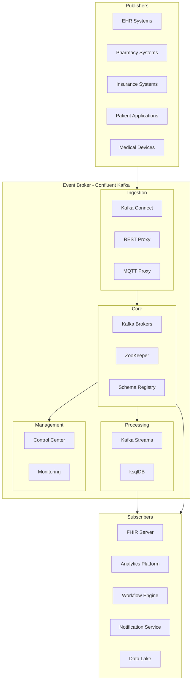
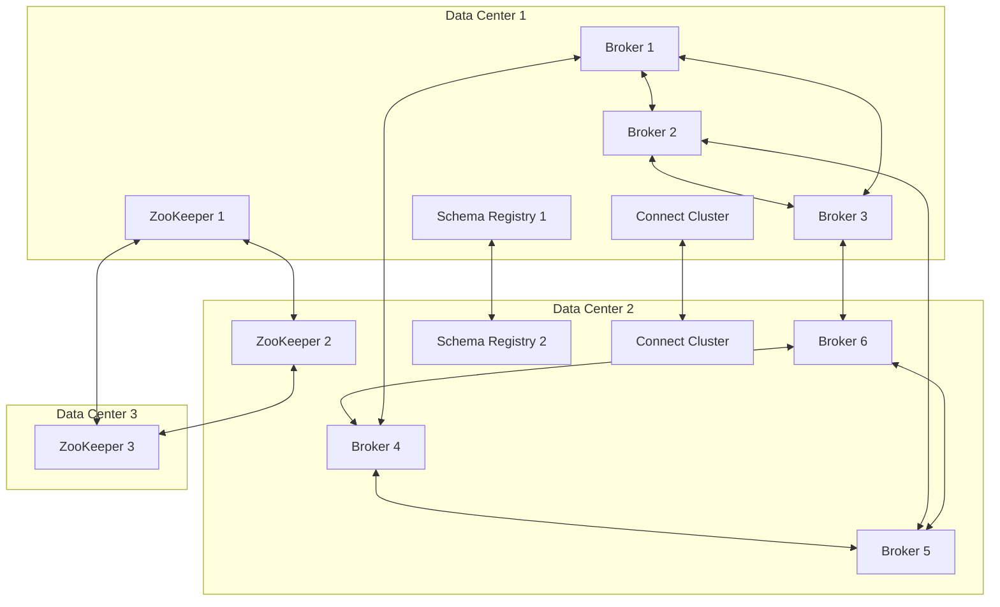
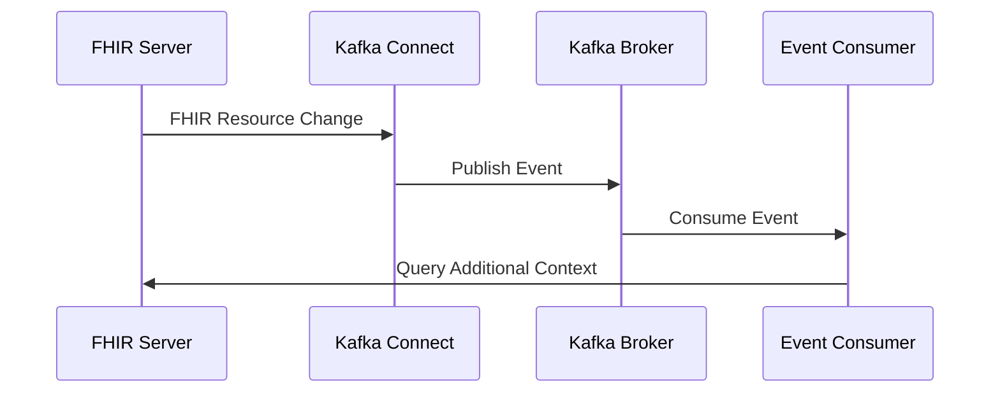
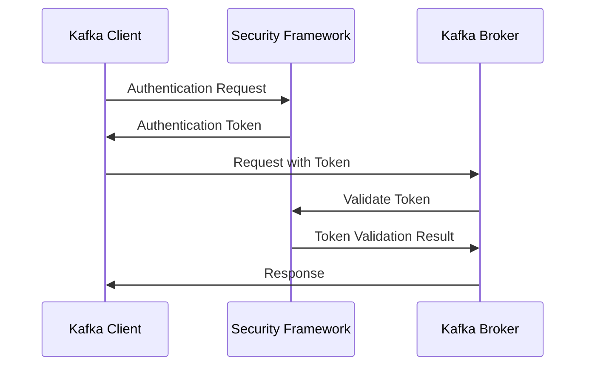
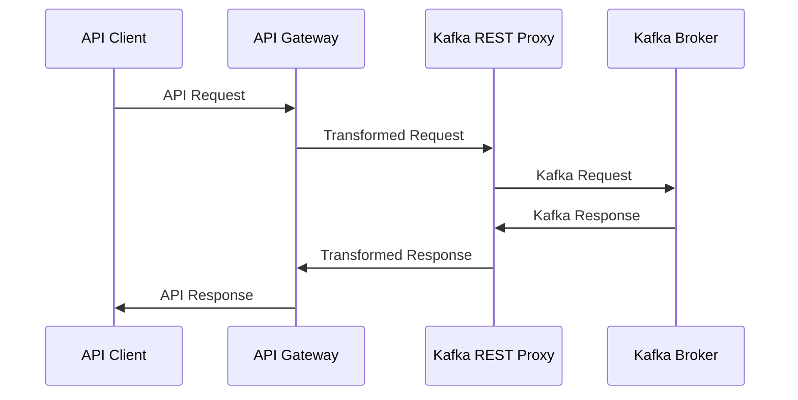
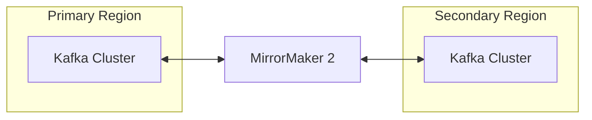

# Event Broker Architecture

## Introduction

This document provides a comprehensive overview of the Event Broker architecture within the CMM Technology Platform. The Event Broker, implemented using Confluent Kafka, serves as the central nervous system for real-time data exchange and event-driven communication across the healthcare ecosystem. This architecture enables high-throughput, fault-tolerant, real-time event processing that meets the demanding requirements of healthcare environments.

## Architectural Principles

The Event Broker architecture is guided by the following principles:

1. **Decoupling**: Minimize direct dependencies between systems
2. **Resilience**: Ensure fault tolerance and high availability
3. **Scalability**: Support horizontal scaling for growing workloads
4. **Security**: Protect sensitive healthcare data throughout its lifecycle
5. **Observability**: Provide comprehensive monitoring and visibility
6. **Compliance**: Adhere to healthcare regulatory requirements

## High-Level Architecture

## Core Components

### Kafka Brokers

Kafka brokers form the heart of the Event Broker architecture:

- **Function**: Store and serve events, manage partitions, handle client requests
- **Deployment**: Clustered for high availability and scalability
- **Configuration**: Optimized for healthcare workloads with appropriate durability and performance settings
- **Scaling**: Horizontally scalable by adding broker nodes

### ZooKeeper

ZooKeeper provides coordination services for the Kafka cluster:

- **Function**: Manage broker metadata, track node status, coordinate leader election
- **Deployment**: Deployed as a cluster (typically 3 or 5 nodes) for high availability
- **Note**: Future versions will migrate to KRaft (Kafka Raft) to eliminate ZooKeeper dependency

### Schema Registry

The Schema Registry manages and enforces event schema definitions:

- **Function**: Store and validate schemas, enforce compatibility rules, provide schema evolution
- **Deployment**: Deployed in high-availability configuration
- **Schema Types**: Supports AVRO, JSON Schema, and Protocol Buffers
- **Healthcare Relevance**: Ensures consistent data structure for clinical information exchange

## Ingestion Layer

### Kafka Connect

Kafka Connect provides standardized integration with external systems:

- **Function**: Import data from source systems and export data to destination systems
- **Deployment**: Scalable worker clusters with distributed coordination
- **Connectors**: Pre-built and custom connectors for healthcare systems (HL7, FHIR, EHR-specific)
- **Transformations**: Data transformation capabilities during ingestion

### REST Proxy

The REST Proxy provides HTTP access to Kafka:

- **Function**: Allow non-Kafka clients to interact with Kafka via REST API
- **Use Cases**: Web applications, legacy systems, cross-language integration
- **Security**: Integrated with platform authentication and authorization

### MQTT Proxy

The MQTT Proxy enables IoT device integration:

- **Function**: Bridge between MQTT protocol and Kafka
- **Use Cases**: Medical devices, remote monitoring, home healthcare
- **Features**: QoS support, device authentication, message transformation

## Processing Layer

### Kafka Streams

Kafka Streams enables real-time stream processing:

- **Function**: Process, transform, enrich, and analyze event streams
- **Architecture**: Embedded library within applications
- **Features**: Stateful processing, windowing, joining streams
- **Healthcare Use Cases**: Real-time alerting, data normalization, clinical decision support

### ksqlDB

ksqlDB provides SQL-like interface for stream processing:

- **Function**: Create and manage streaming applications using SQL syntax
- **Architecture**: Deployed as a cluster with REST API
- **Features**: Continuous queries, materialized views, UDFs
- **Healthcare Use Cases**: Real-time analytics, monitoring, data preparation

## Management Layer

### Control Center

Control Center provides a management interface for the Kafka ecosystem:

- **Function**: Monitor, manage, and configure Kafka components
- **Features**: Topic management, schema management, connector configuration
- **Observability**: Performance metrics, alerts, and dashboards

### Monitoring

Comprehensive monitoring ensures system health and performance:

- **Metrics**: JMX metrics from Kafka components
- **Integration**: Prometheus, Grafana, and alerting systems
- **Dashboards**: Pre-built dashboards for key performance indicators
- **Alerting**: Proactive notification of issues

## Deployment Architecture

### Production Deployment

The production deployment architecture ensures high availability and performance:

### Resource Requirements

Typical resource requirements for production deployment:

| Component | Instances | CPU | Memory | Storage | Network |
|-----------|-----------|-----|--------|---------|--------|
| Kafka Broker | 6+ | 8-16 cores | 32-64 GB | 1-2 TB SSD | 10 Gbps |
| ZooKeeper | 3-5 | 4 cores | 8 GB | 100 GB SSD | 1 Gbps |
| Schema Registry | 2+ | 4 cores | 8 GB | 100 GB SSD | 1 Gbps |
| Connect Worker | 4+ | 8 cores | 16 GB | 100 GB SSD | 1 Gbps |
| ksqlDB Server | 3+ | 8 cores | 32 GB | 500 GB SSD | 1 Gbps |
| Control Center | 1+ | 4 cores | 8 GB | 100 GB SSD | 1 Gbps |

## Scalability Architecture

### Horizontal Scaling

The Event Broker architecture supports horizontal scaling through:

- **Broker Addition**: New brokers can be added to the cluster without downtime
- **Partition Distribution**: Topic partitions are distributed across brokers
- **Connect Worker Scaling**: Connect clusters can scale by adding workers
- **Processing Parallelism**: Stream processing scales with partition count

### Vertical Scaling

Vertical scaling options include:

- **Resource Allocation**: Increasing CPU, memory, and storage for existing nodes
- **Storage Optimization**: Using faster storage (NVMe) for improved throughput
- **Network Enhancements**: Higher bandwidth and lower latency networking

## Security Architecture

### Authentication

Multi-layered authentication ensures secure access:

- **TLS**: Client certificate authentication
- **SASL**: Support for PLAIN, SCRAM, GSSAPI (Kerberos)
- **OAuth**: Integration with OAuth 2.0 providers
- **LDAP**: Integration with enterprise directory services

### Authorization

Fine-grained authorization controls access to resources:

- **ACLs**: Access control lists for topics, consumer groups, and other resources
- **Role-Based Access**: Integration with role-based access control systems
- **Resource Patterns**: Wildcard support for resource grouping

### Encryption

Comprehensive encryption protects sensitive healthcare data:

- **TLS**: Encryption for data in transit
- **Disk Encryption**: Encryption for data at rest
- **Field-Level Encryption**: Selective encryption of sensitive fields

## Integration Architecture

### FHIR Server Integration

Integration with the FHIR Server component:

### Security Framework Integration

Integration with the Security and Access Framework:

### API Gateway Integration

Integration with the API Gateway component:

## Disaster Recovery Architecture

### Multi-Region Replication

Kafka's MirrorMaker 2 provides multi-region replication:

### Recovery Procedures

Disaster recovery procedures include:

- **Failover**: Automated or manual failover to secondary region
- **Failback**: Procedures for returning to primary region
- **Data Reconciliation**: Ensuring data consistency after recovery
- **Testing**: Regular disaster recovery testing

## Performance Considerations

### Throughput Optimization

Key factors affecting throughput:

- **Partition Count**: Appropriate partitioning for parallelism
- **Batch Size**: Optimized producer and consumer batch sizes
- **Compression**: Appropriate compression algorithms (lz4, zstd)
- **Retention Policies**: Balanced retention for performance and compliance

### Latency Optimization

Strategies for minimizing latency:

- **Hardware Selection**: Fast storage and network infrastructure
- **Tuning Parameters**: Optimized configuration for low latency
- **Monitoring**: Continuous latency monitoring and alerting
- **Resource Isolation**: Preventing noisy neighbor issues

## Conclusion

The Event Broker architecture provides a robust foundation for event-driven healthcare applications. By leveraging Confluent Kafka's distributed architecture, the platform delivers the scalability, reliability, and performance required for mission-critical healthcare data exchange. This architecture enables real-time data flow between systems, supporting improved patient care, operational efficiency, and data-driven decision making.

## Related Documentation

- [Event Broker Overview](overview.md)
- [Quick Start Guide](quick-start.md)
- [Key Concepts](key-concepts.md)
- [Core APIs](../02-core-functionality/core-apis.md)
