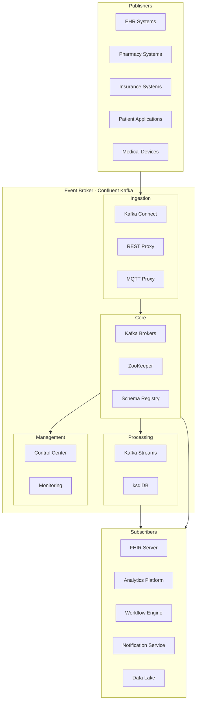

# Event Broker

## Introduction

The Event Broker is a foundational component of the CMM Technology Platform, serving as the central nervous system for real-time data exchange and event-driven communication. Our implementation uses Confluent Kafka, a distributed streaming platform that enables high-throughput, fault-tolerant, real-time event processing across the healthcare ecosystem. This document provides an overview of the Event Broker's architecture, key concepts, and implementation considerations for healthcare environments.

## Key Concepts

### Event-Driven Architecture

Event-driven architecture (EDA) is a software design pattern where the production, detection, consumption, and reaction to events drive the system's behavior. In the context of healthcare:

- **Events**: Discrete changes in state or notifications (e.g., patient admission, medication order, insurance verification)
- **Publishers**: Systems that generate events (e.g., EHR systems, patient portals, pharmacy systems)
- **Subscribers**: Systems that consume and react to events (e.g., analytics platforms, workflow engines, notification services)
- **Event Broker**: The intermediary that manages event delivery between publishers and subscribers

This decoupled approach enables systems to evolve independently while maintaining real-time data flow and process integration.

### Why Confluent Kafka?

Confluent Kafka was selected as our Event Broker for several key reasons:

- **Scalability**: Handles millions of events per second with horizontal scaling
- **Reliability**: Provides fault tolerance and high availability for mission-critical healthcare data
- **Data Retention**: Supports configurable retention policies for compliance requirements
- **Ecosystem**: Offers a rich set of connectors, stream processing capabilities, and management tools
- **Schema Registry**: Enforces data structure consistency and evolution
- **Security**: Provides comprehensive authentication, authorization, and encryption

## Architecture Overview

## Key Features

### Event Streaming

#### High-Throughput Message Delivery

The Event Broker provides reliable, high-throughput message delivery for healthcare events:

- **Partitioned Topics**: Horizontal scaling for parallel processing
- **Ordered Delivery**: Guaranteed order within partitions for sequence-dependent events
- **Persistent Storage**: Durable storage of events with configurable retention
- **Low Latency**: Millisecond-level delivery for real-time healthcare processes
- **Backpressure Handling**: Graceful handling of traffic spikes

#### Fault Tolerance and Reliability

Robust mechanisms ensure no data loss even during system failures:

- **Replication**: Configurable replication factor for data redundancy
- **Leader Election**: Automatic failover for broker failures
- **Exactly-Once Semantics**: Prevention of duplicate event processing
- **Offset Management**: Tracking of consumer progress for recovery
- **Cluster Balancing**: Automatic workload distribution

### Data Governance

#### Schema Management

The Schema Registry ensures data quality and compatibility:

- **Schema Enforcement**: Validation of event structure against defined schemas
- **Schema Evolution**: Controlled changes to event structures over time
- **Compatibility Modes**: Forward, backward, and full compatibility options
- **AVRO Support**: Efficient binary serialization with rich data types
- **JSON Schema Support**: Flexible schema definition for complex healthcare data

#### Security Controls

Comprehensive security for protected health information:

- **Authentication**: Multi-factor and LDAP/Active Directory integration
- **Authorization**: Fine-grained access control with ACLs
- **Encryption**: TLS for in-transit and encryption-at-rest
- **Audit Logging**: Detailed tracking of system access and operations
- **Data Masking**: Obfuscation of sensitive fields for non-privileged users

### Integration Capabilities

#### Connector Ecosystem

Pre-built connectors for healthcare systems integration:

- **Source Connectors**: Import data from databases, files, and APIs
- **Sink Connectors**: Export data to analytics, storage, and other systems
- **FHIR Connector**: Integration with FHIR servers for clinical data
- **HL7 Connector**: Processing of traditional HL7 v2 messages
- **Database Connectors**: Integration with major database systems

#### Stream Processing

Real-time data transformation and enrichment:

- **Kafka Streams**: Lightweight client library for stream processing
- **ksqlDB**: SQL-like interface for stream processing
- **Stateful Processing**: Aggregations, joins, and windowing operations
- **Event-Time Processing**: Handling of out-of-order events
- **Complex Event Processing**: Pattern detection in event streams

## Integration Points

The Event Broker integrates with several key components in our architecture:

### FHIR Server Integration

- **Resource Change Events**: Publishing events for FHIR resource changes
- **Subscription Support**: Implementing FHIR subscription capabilities
- **Bulk Data Operations**: Streaming large datasets for analytics
- **Audit Events**: Capturing and distributing FHIR audit events

### Security and Access Framework Integration

- **Authentication**: Integration with the Security and Access Framework for identity
- **Authorization**: Enforcement of access policies for topics and consumer groups
- **Audit Trail**: Comprehensive logging of event access and operations
- **PHI Protection**: Secure handling of protected health information

### API Marketplace Integration

- **Event-Driven APIs**: Exposing event streams as APIs
- **Webhook Support**: Triggering external systems based on events
- **API Gateway Integration**: Routing events through the API gateway
- **Service Mesh Integration**: Coordinating with service-to-service communication

### Business Process Management Integration

- **Process Triggers**: Initiating workflows based on events
- **State Management**: Tracking process state through events
- **Process Monitoring**: Visibility into workflow execution
- **Decision Support**: Providing context for business rules

## Healthcare Use Cases

### Clinical Event Processing

Real-time processing of clinical events enables timely interventions and care coordination:

- **Admission, Discharge, Transfer (ADT)**: Real-time patient movement tracking
- **Clinical Results**: Immediate notification of critical lab results
- **Medication Events**: Tracking of medication orders, dispensing, and administration
- **Care Team Notifications**: Alerting care team members of important changes
- **Clinical Decision Support**: Triggering rules engines for clinical guidance

### Patient Journey Tracking

Comprehensive visibility into the patient's healthcare journey:

- **Registration Events**: Tracking patient registration and demographic updates
- **Appointment Events**: Managing scheduling and check-in processes
- **Encounter Events**: Following patient encounters across care settings
- **Referral Events**: Coordinating care transitions between providers
- **Follow-up Events**: Ensuring appropriate post-care activities

### Healthcare Analytics

Streaming analytics for operational and clinical insights:

- **Operational Metrics**: Real-time monitoring of system performance
- **Clinical Analytics**: Streaming analysis of patient data
- **Population Health**: Aggregate analysis of patient populations
- **Predictive Models**: Feeding machine learning models with real-time data
- **Reporting Streams**: Continuous updates to dashboards and reports

## Getting Started

To begin working with our Event Broker implementation:

1. Review the [Setup Guide](setup-guide.md) for environment configuration
2. Understand [Topic Design](../02-core-functionality/topic-design.md) for healthcare event modeling
3. Learn about [Event Schemas](../02-core-functionality/event-schemas.md) for healthcare data
4. Explore [Stream Processing](../03-advanced-patterns/stream-processing.md) for real-time data transformation

## Related Components

- [FHIR Server](../../fhir-server/01-getting-started/overview.md): Publishes and consumes healthcare events
- [Security and Access Framework](../../security-and-access-framework/01-getting-started/overview.md): Secures event access
- [API Marketplace](../../api-marketplace/01-getting-started/overview.md): Exposes events as APIs
- [Business Process Management](../../business-process-management/01-getting-started/overview.md): Orchestrates workflows triggered by events

## Next Steps

- [Setup Guide](setup-guide.md): Configure the Event Broker for your environment
- [Topic Design](../02-core-functionality/topic-design.md): Design effective topic structures
- [Event Schemas](../02-core-functionality/event-schemas.md): Define healthcare event schemas
- [Connectors](../02-core-functionality/connectors.md): Integrate with healthcare systems
