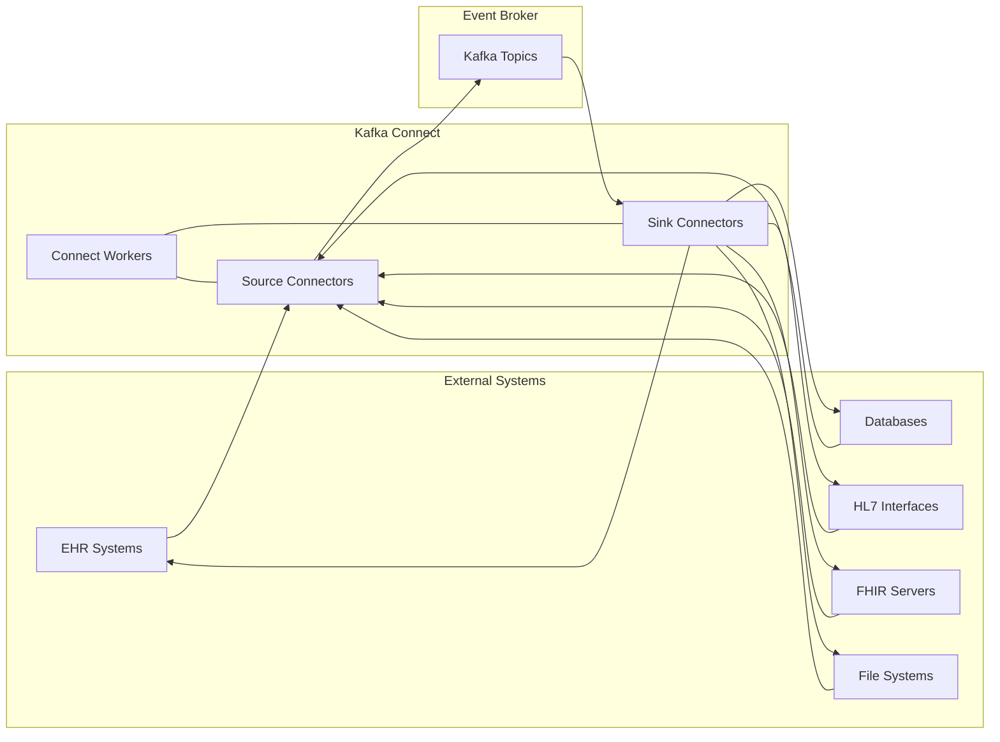
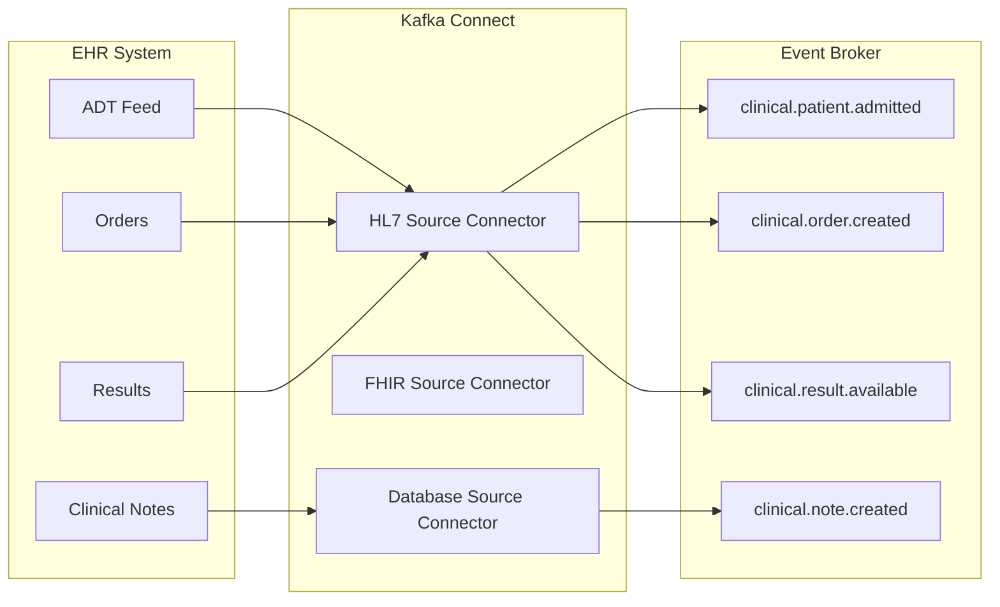
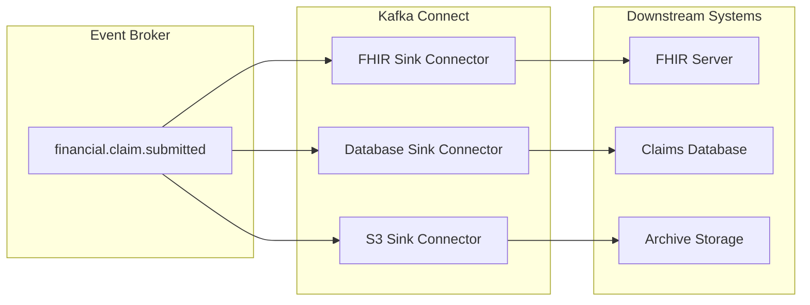

# Connectors

## Overview

Kafka Connectors provide standardized integration between the Event Broker and external systems, enabling seamless data flow without custom code. This document covers the implementation of Kafka Connect within our healthcare architecture, focusing on source connectors that import data into Kafka and sink connectors that export data to downstream systems.

## Kafka Connect Architecture

Kafka Connect is a framework for connecting Kafka with external systems. It runs as a separate cluster of workers that execute connectors, which are responsible for moving data between Kafka and other systems.



### Key Components

- **Connect Workers**: Distributed processes that execute connectors and tasks
- **Connectors**: Plugins that define how to interact with external systems
- **Tasks**: Units of work distributed across Connect workers
- **Converters**: Components that transform data between Kafka and connector formats
- **Transforms**: Single-message modifications applied to data in transit

## Connector Types

### Source Connectors

Source connectors import data from external systems into Kafka topics:

| Connector Type | Use Case | Example |
|----------------|----------|----------|
| Database | Capture changes from clinical databases | MySQL CDC for patient demographics |
| HL7 | Import HL7 messages from legacy systems | ADT feeds from hospital systems |
| FHIR | Subscribe to FHIR resources | Patient resource changes |
| File | Process healthcare data files | Claims data in CSV format |
| API | Poll healthcare APIs | Medication reference data |

### Sink Connectors

Sink connectors export data from Kafka topics to external systems:

| Connector Type | Use Case | Example |
|----------------|----------|----------|
| Database | Persist events to analytical databases | Clinical events to data warehouse |
| FHIR | Update FHIR resources | Patient updates to FHIR server |
| Elasticsearch | Index healthcare data for search | Provider directory search |
| S3/Cloud Storage | Archive healthcare events | Long-term storage of clinical events |
| Notification | Send alerts and notifications | Critical result notifications |

## Healthcare Connector Implementation

### Database Change Data Capture

Capturing changes from healthcare databases is a common use case. The Debezium connector enables change data capture (CDC) from various database systems:

```json
{
  "name": "patient-database-source",
  "config": {
    "connector.class": "io.debezium.connector.mysql.MySqlConnector",
    "database.hostname": "clinical-db.healthcare.internal",
    "database.port": "3306",
    "database.user": "cdc_user",
    "database.password": "${file:/etc/kafka-connect/mysql-cdc-credentials:password}",
    "database.server.id": "1",
    "database.server.name": "clinical",
    "database.include.list": "patients,encounters,observations",
    "table.include.list": "patients.patient,encounters.encounter,observations.observation",
    "database.history.kafka.bootstrap.servers": "kafka-broker-1:9092,kafka-broker-2:9092",
    "database.history.kafka.topic": "schema-changes.clinical",
    "include.schema.changes": "true",
    "transforms": "unwrap",
    "transforms.unwrap.type": "io.debezium.transforms.ExtractNewRecordState",
    "transforms.unwrap.drop.tombstones": "false",
    "key.converter": "org.apache.kafka.connect.json.JsonConverter",
    "key.converter.schemas.enable": "false",
    "value.converter": "org.apache.kafka.connect.json.JsonConverter",
    "value.converter.schemas.enable": "false"
  }
}
```

### HL7 Integration

The NextGen Connect (formerly Mirth Connect) connector enables integration with HL7 v2 messages:

```json
{
  "name": "hl7-adm-source",
  "config": {
    "connector.class": "io.confluent.connect.mirth.MirthSourceConnector",
    "mirth.url": "https://mirth.healthcare.internal:8443",
    "mirth.username": "connect_user",
    "mirth.password": "${file:/etc/kafka-connect/mirth-credentials:password}",
    "mirth.channels": "ADT_Processor",
    "kafka.topic": "clinical.patient.hl7",
    "output.format": "json",
    "hl7.message.structure": "true",
    "tasks.max": "1",
    "key.converter": "org.apache.kafka.connect.json.JsonConverter",
    "key.converter.schemas.enable": "false",
    "value.converter": "org.apache.kafka.connect.json.JsonConverter",
    "value.converter.schemas.enable": "false",
    "transforms": "extractPatient",
    "transforms.extractPatient.type": "org.apache.kafka.connect.transforms.ExtractField$Key",
    "transforms.extractPatient.field": "PID.3.1"
  }
}
```

### FHIR Integration

The FHIR connector enables integration with FHIR servers:

```json
{
  "name": "fhir-patient-source",
  "config": {
    "connector.class": "io.confluent.connect.fhir.FhirSourceConnector",
    "fhir.url": "https://fhir.healthcare.internal/fhir",
    "fhir.auth.type": "bearer",
    "fhir.auth.token": "${file:/etc/kafka-connect/fhir-credentials:token}",
    "fhir.resource.types": "Patient",
    "fhir.subscription.criteria": "Patient?_lastUpdated=gt${timestamp}",
    "fhir.poll.interval.ms": "60000",
    "kafka.topic": "clinical.patient.fhir",
    "tasks.max": "1",
    "key.converter": "org.apache.kafka.connect.json.JsonConverter",
    "key.converter.schemas.enable": "false",
    "value.converter": "org.apache.kafka.connect.json.JsonConverter",
    "value.converter.schemas.enable": "false",
    "transforms": "extractId",
    "transforms.extractId.type": "org.apache.kafka.connect.transforms.ExtractField$Key",
    "transforms.extractId.field": "id"
  }
}
```

### Elasticsearch Integration

The Elasticsearch connector enables indexing of healthcare data for search:

```json
{
  "name": "provider-directory-sink",
  "config": {
    "connector.class": "io.confluent.connect.elasticsearch.ElasticsearchSinkConnector",
    "connection.url": "https://elasticsearch.healthcare.internal:9200",
    "connection.username": "connect_user",
    "connection.password": "${file:/etc/kafka-connect/elasticsearch-credentials:password}",
    "topics": "reference.provider.details",
    "key.ignore": "false",
    "schema.ignore": "true",
    "type.name": "_doc",
    "behavior.on.null.values": "delete",
    "behavior.on.malformed.documents": "warn",
    "tasks.max": "3",
    "transforms": "extractId",
    "transforms.extractId.type": "org.apache.kafka.connect.transforms.ExtractField$Key",
    "transforms.extractId.field": "providerId"
  }
}
```

## Single Message Transforms (SMTs)

Single Message Transforms modify individual messages as they flow through Connect:

### Common Healthcare Transforms

| Transform | Use Case | Example |
|-----------|----------|----------|
| ExtractField | Use a field as message key | Patient ID as key |
| ValueToKey | Copy value field to key | Copy encounter ID to key |
| InsertField | Add metadata | Add source system information |
| ReplaceField | Rename or remove fields | Standardize field names |
| MaskField | Protect sensitive data | Mask SSN or other PHI |
| TimestampConverter | Standardize timestamps | Convert to ISO-8601 format |

### Custom Healthcare Transforms

For healthcare-specific transformations, custom SMTs can be developed:

```java
package org.healthcare.kafka.connect.transforms;

import org.apache.kafka.common.config.ConfigDef;
import org.apache.kafka.connect.connector.ConnectRecord;
import org.apache.kafka.connect.transforms.Transformation;
import org.apache.kafka.connect.data.Schema;
import org.apache.kafka.connect.data.SchemaBuilder;
import org.apache.kafka.connect.data.Struct;

import java.util.Map;

public class HL7ToFHIR<R extends ConnectRecord<R>> implements Transformation<R> {

    @Override
    public R apply(R record) {
        // Extract HL7 message from record
        Map<String, Object> hl7Message = (Map<String, Object>) record.value();
        
        // Convert HL7 to FHIR
        Map<String, Object> fhirResource = convertHL7ToFHIR(hl7Message);
        
        // Return transformed record
        return record.newRecord(
            record.topic(),
            record.kafkaPartition(),
            record.keySchema(),
            record.key(),
            Schema.STRING_SCHEMA,
            fhirResource,
            record.timestamp()
        );
    }

    private Map<String, Object> convertHL7ToFHIR(Map<String, Object> hl7Message) {
        // Implementation of HL7 to FHIR conversion logic
        // This would use a library like HAPI FHIR for conversion
        // Simplified example:
        Map<String, Object> fhirResource = new HashMap<>();
        
        // Extract patient information from PID segment
        Map<String, Object> pid = (Map<String, Object>) hl7Message.get("PID");
        
        // Create FHIR Patient resource
        fhirResource.put("resourceType", "Patient");
        fhirResource.put("id", pid.get("3.1"));
        
        Map<String, Object> name = new HashMap<>();
        name.put("family", pid.get("5.1"));
        name.put("given", Arrays.asList(pid.get("5.2")));
        
        fhirResource.put("name", Arrays.asList(name));
        
        return fhirResource;
    }

    @Override
    public ConfigDef config() {
        return new ConfigDef();
    }

    @Override
    public void close() {
        // No resources to close
    }

    @Override
    public void configure(Map<String, ?> configs) {
        // No configuration needed
    }
}
```

## Connector Deployment

### Distributed Mode

Kafka Connect is deployed in distributed mode for production environments:

```properties
# connect-distributed.properties
bootstrap.servers=kafka-broker-1:9092,kafka-broker-2:9092,kafka-broker-3:9092
group.id=connect-cluster
key.converter=org.apache.kafka.connect.json.JsonConverter
value.converter=org.apache.kafka.connect.json.JsonConverter
key.converter.schemas.enable=false
value.converter.schemas.enable=false
offset.storage.topic=connect-offsets
offset.storage.replication.factor=3
config.storage.topic=connect-configs
config.storage.replication.factor=3
status.storage.topic=connect-status
status.storage.replication.factor=3
plugin.path=/usr/share/kafka-connect/plugins
rest.advertised.host.name=connect.healthcare.internal
rest.advertised.port=8083
rest.port=8083
security.protocol=SSL
ssl.keystore.location=/etc/kafka-connect/ssl/connect.keystore.jks
ssl.keystore.password=${file:/etc/kafka-connect/ssl/connect-credentials:keystore_password}
ssl.key.password=${file:/etc/kafka-connect/ssl/connect-credentials:key_password}
ssl.truststore.location=/etc/kafka-connect/ssl/connect.truststore.jks
ssl.truststore.password=${file:/etc/kafka-connect/ssl/connect-credentials:truststore_password}
```

### Kubernetes Deployment

For cloud-native environments, Kafka Connect is deployed on Kubernetes:

```yaml
apiVersion: apps/v1
kind: Deployment
metadata:
  name: kafka-connect
  namespace: event-broker
spec:
  replicas: 3
  selector:
    matchLabels:
      app: kafka-connect
  template:
    metadata:
      labels:
        app: kafka-connect
    spec:
      containers:
      - name: kafka-connect
        image: confluentinc/cp-kafka-connect:7.3.0
        resources:
          requests:
            memory: "2Gi"
            cpu: "1"
          limits:
            memory: "4Gi"
            cpu: "2"
        ports:
        - containerPort: 8083
        env:
        - name: CONNECT_BOOTSTRAP_SERVERS
          value: "kafka-broker-1:9092,kafka-broker-2:9092,kafka-broker-3:9092"
        - name: CONNECT_GROUP_ID
          value: "connect-cluster"
        - name: CONNECT_CONFIG_STORAGE_TOPIC
          value: "connect-configs"
        - name: CONNECT_OFFSET_STORAGE_TOPIC
          value: "connect-offsets"
        - name: CONNECT_STATUS_STORAGE_TOPIC
          value: "connect-status"
        - name: CONNECT_CONFIG_STORAGE_REPLICATION_FACTOR
          value: "3"
        - name: CONNECT_OFFSET_STORAGE_REPLICATION_FACTOR
          value: "3"
        - name: CONNECT_STATUS_STORAGE_REPLICATION_FACTOR
          value: "3"
        - name: CONNECT_KEY_CONVERTER
          value: "org.apache.kafka.connect.json.JsonConverter"
        - name: CONNECT_VALUE_CONVERTER
          value: "org.apache.kafka.connect.json.JsonConverter"
        - name: CONNECT_KEY_CONVERTER_SCHEMAS_ENABLE
          value: "false"
        - name: CONNECT_VALUE_CONVERTER_SCHEMAS_ENABLE
          value: "false"
        - name: CONNECT_PLUGIN_PATH
          value: "/usr/share/java,/usr/share/confluent-hub-components"
        - name: CONNECT_REST_ADVERTISED_HOST_NAME
          valueFrom:
            fieldRef:
              fieldPath: status.podIP
        volumeMounts:
        - name: connect-plugins
          mountPath: /usr/share/confluent-hub-components
        - name: connect-secrets
          mountPath: /etc/kafka-connect
          readOnly: true
      volumes:
      - name: connect-plugins
        persistentVolumeClaim:
          claimName: connect-plugins-pvc
      - name: connect-secrets
        secret:
          secretName: connect-credentials
```

## Connector Management

### REST API

Kafka Connect provides a REST API for connector management:

```bash
# List all connectors
curl -X GET https://connect.healthcare.internal:8083/connectors \
  --cert /path/to/client.pem --key /path/to/client.key \
  --cacert /path/to/ca.pem

# Create a new connector
curl -X POST https://connect.healthcare.internal:8083/connectors \
  -H "Content-Type: application/json" \
  --cert /path/to/client.pem --key /path/to/client.key \
  --cacert /path/to/ca.pem \
  -d @connector-config.json

# Get connector status
curl -X GET https://connect.healthcare.internal:8083/connectors/patient-database-source/status \
  --cert /path/to/client.pem --key /path/to/client.key \
  --cacert /path/to/ca.pem

# Restart a connector
curl -X POST https://connect.healthcare.internal:8083/connectors/patient-database-source/restart \
  --cert /path/to/client.pem --key /path/to/client.key \
  --cacert /path/to/ca.pem
```

### Monitoring Connectors

Connector health should be monitored for reliable operation:

```bash
# Check connector status
curl -s https://connect.healthcare.internal:8083/connectors/patient-database-source/status \
  --cert /path/to/client.pem --key /path/to/client.key \
  --cacert /path/to/ca.pem | jq

# Check connector tasks
curl -s https://connect.healthcare.internal:8083/connectors/patient-database-source/tasks \
  --cert /path/to/client.pem --key /path/to/client.key \
  --cacert /path/to/ca.pem | jq
```

### Error Handling

Connector errors should be handled appropriately:

| Error Type | Handling Strategy | Example |
|------------|-------------------|----------|
| Connection Failures | Retry with backoff | Database connection issues |
| Schema Evolution | Schema registry validation | Changes to clinical data models |
| Data Format Errors | Dead letter queue | Malformed HL7 messages |
| Resource Constraints | Scaling Connect cluster | High-volume clinical data |

## Healthcare Connector Patterns

### EHR Integration Pattern



### Claims Processing Pattern



## Related Documentation

- [Event Schemas](event-schemas.md): Defining the structure of events
- [Topic Design](topic-design.md): Designing effective Kafka topics
- [Stream Processing](../03-advanced-patterns/stream-processing.md): Processing events in real-time
- [HL7 Integration](../04-healthcare-integration/hl7-integration.md): Detailed HL7 integration patterns
- [FHIR Events](../04-healthcare-integration/fhir-events.md): FHIR-specific event patterns
