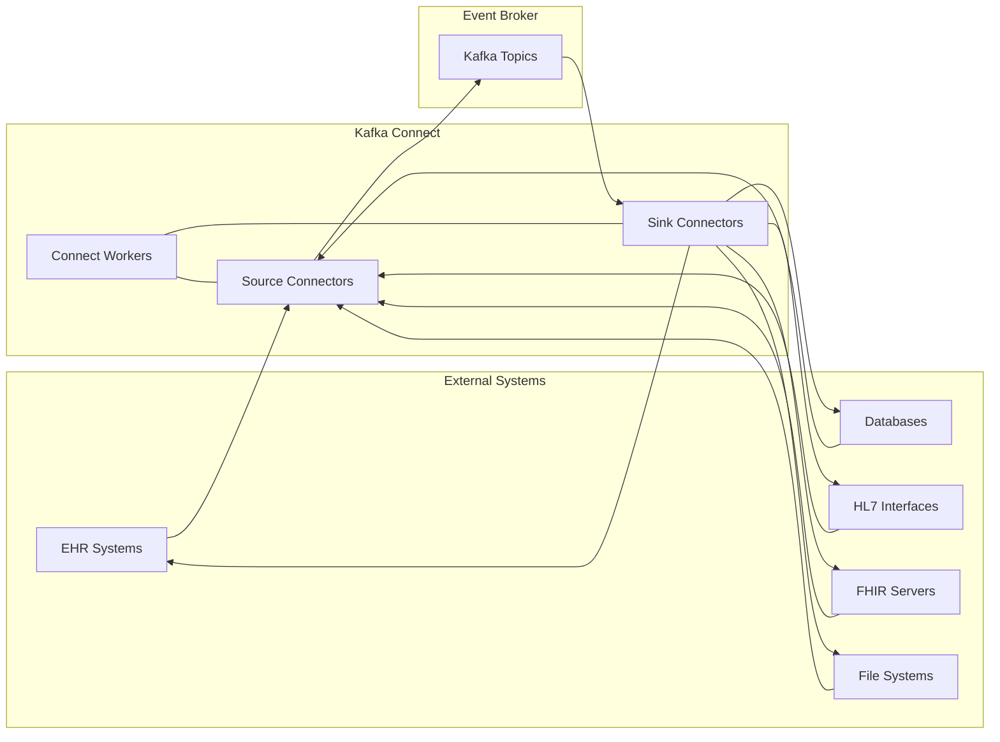
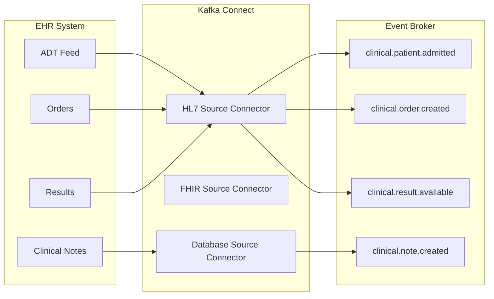
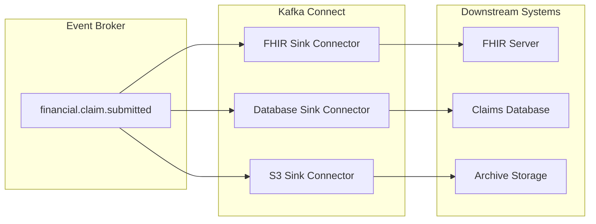

# Connectors

## Overview

Kafka Connectors provide standardized integration between the Event Broker and external systems, enabling seamless data flow without custom code. This document covers the implementation of Kafka Connect within our healthcare architecture, focusing on source connectors that import data into Kafka and sink connectors that export data to downstream systems.

## Kafka Connect Architecture

Kafka Connect is a framework for connecting Kafka with external systems. It runs as a separate cluster of workers that execute connectors, which are responsible for moving data between Kafka and other systems.



### Key Components

- **Connect Workers**: Distributed processes that execute connectors and tasks
- **Connectors**: Plugins that define how to interact with external systems
- **Tasks**: Units of work distributed across Connect workers
- **Converters**: Components that transform data between Kafka and connector formats
- **Transforms**: Single-message modifications applied to data in transit

## Connector Types

### Source Connectors

Source connectors import data from external systems into Kafka topics:

| Connector Type | Use Case | Example |
|----------------|----------|----------|
| Database | Capture changes from clinical databases | MySQL CDC for patient demographics |
| HL7 | Import HL7 messages from legacy systems | ADT feeds from hospital systems |
| FHIR | Subscribe to FHIR resources | Patient resource changes |
| File | Process healthcare data files | Claims data in CSV format |
| API | Poll healthcare APIs | Medication reference data |

### Sink Connectors

Sink connectors export data from Kafka topics to external systems:

| Connector Type | Use Case | Example |
|----------------|----------|----------|
| Database | Persist events to analytical databases | Clinical events to data warehouse |
| FHIR | Update FHIR resources | Patient updates to FHIR server |
| Elasticsearch | Index healthcare data for search | Provider directory search |
| S3/Cloud Storage | Archive healthcare events | Long-term storage of clinical events |
| Notification | Send alerts and notifications | Critical result notifications |

## Healthcare Connector Implementation

### Database Change Data Capture

Capturing changes from healthcare databases is a common use case. Using Confluent Cloud's fully-managed connectors for CDC provides a reliable, scalable solution with minimal operational overhead:

```json
{
  "name": "patient-database-source",
  "config": {
    "connector.class": "MySqlCdcSource",
    "name": "patient-database-source",
    "kafka.auth.mode": "KAFKA_API_KEY",
    "kafka.api.key": "${CONFLUENT_CLOUD_KEY}",
    "kafka.api.secret": "${CONFLUENT_CLOUD_SECRET}",
    "database.hostname": "clinical-db.healthcare.internal",
    "database.port": "3306",
    "database.user": "cdc_user",
    "database.password": "${file:/etc/kafka-connect/mysql-cdc-credentials:password}",
    "database.server.id": "1",
    "database.server.name": "clinical",
    "database.include.list": "patients,encounters,observations",
    "table.include.list": "patients.patient,encounters.encounter,observations.observation",
    
    "topic.prefix": "mysql-cdc-",
    "tasks.max": "2",
    
    "output.data.format": "AVRO",
    "output.key.format": "AVRO",
    "schema.context.name": "clinical-data-context",
    "schema.registry.url": "https://schema-registry.confluent.cloud",
    "schema.registry.basic.auth.user.info": "${SCHEMA_REGISTRY_KEY}:${SCHEMA_REGISTRY_SECRET}",
    "schema.registry.basic.auth.credentials.source": "USER_INFO",
    
    "transforms": "unwrap,addMetadata",
    "transforms.unwrap.type": "io.debezium.transforms.ExtractNewRecordState",
    "transforms.unwrap.drop.tombstones": "false",
    "transforms.unwrap.delete.handling.mode": "rewrite",
    "transforms.addMetadata.type": "org.apache.kafka.connect.transforms.InsertHeader",
    "transforms.addMetadata.header": "source_database",
    "transforms.addMetadata.value.literal": "clinical",
    
    "errors.tolerance": "all",
    "errors.log.enable": true,
    "errors.log.include.messages": true,
    "errors.deadletterqueue.topic.name": "dlq.mysql.cdc",
    "errors.deadletterqueue.topic.replication.factor": 3,
    
    "snapshot.mode": "initial",
    "snapshot.fetch.size": 10000,
    "snapshot.locking.mode": "minimal",
    "max.batch.size": 2048,
    "max.queue.size": 8192,
    "poll.interval.ms": 1000,
    
    "database.history.skip.unparseable.ddl": true,
    "database.ssl.mode": "required",
    
    "heartbeat.interval.ms": 5000,
    "heartbeat.action.query": "UPDATE kafka_connector_heartbeat SET heartbeat = NOW() WHERE id = 1",
    
    "confluent.topic.bootstrap.servers": "kafka-broker-1:9092,kafka-broker-2:9092",
    "confluent.topic.replication.factor": 3,
    "confluent.topic.security.protocol": "SASL_SSL",
    "confluent.topic.sasl.mechanism": "PLAIN",
    "confluent.topic.sasl.jaas.config": "org.apache.kafka.common.security.plain.PlainLoginModule required username='${CONFLUENT_CLOUD_KEY}' password='${CONFLUENT_CLOUD_SECRET}';",
    
    "confluent.license": "",
    "confluent.topic.ssl.endpoint.identification.algorithm": "https",
    "reporter.bootstrap.servers": "kafka-broker-1:9092,kafka-broker-2:9092",
    "reporter.error.topic.name": "error-responses",
    "reporter.error.topic.replication.factor": 3,
    "reporter.result.topic.name": "success-responses",
    "reporter.result.topic.replication.factor": 3
  }
}
```

This configuration leverages Confluent Cloud's fully-managed MySQL CDC connector with several key advantages:

1. **Schema Registry Integration**: Automatic AVRO schema generation and evolution
2. **Error Handling**: Dead letter queues and detailed error reporting
3. **Monitoring**: Built-in heartbeat mechanism and performance metrics
4. **Security**: Secure authentication and encrypted connections
5. **Scalability**: Distributed tasks with automatic load balancing
6. **Reliability**: Exactly-once delivery semantics and failure recovery

### HL7 Integration

Confluent Cloud's fully-managed HL7 connector provides reliable integration with healthcare systems using HL7 v2 messages:

```json
{
  "name": "hl7-adm-source",
  "config": {
    "connector.class": "HL7Source",
    "name": "hl7-adm-source",
    "kafka.auth.mode": "KAFKA_API_KEY",
    "kafka.api.key": "${CONFLUENT_CLOUD_KEY}",
    "kafka.api.secret": "${CONFLUENT_CLOUD_SECRET}",
    
    "hl7.listener.host": "0.0.0.0",
    "hl7.listener.port": "2575",
    "hl7.security.enabled": "true",
    "hl7.security.store.type": "JKS",
    "hl7.security.keystore.location": "/etc/kafka-connect/security/hl7-keystore.jks",
    "hl7.security.keystore.password": "${file:/etc/kafka-connect/security/hl7-credentials:keystore_password}",
    "hl7.security.key.password": "${file:/etc/kafka-connect/security/hl7-credentials:key_password}",
    "hl7.security.truststore.location": "/etc/kafka-connect/security/hl7-truststore.jks",
    "hl7.security.truststore.password": "${file:/etc/kafka-connect/security/hl7-credentials:truststore_password}",
    
    "hl7.message.types": "ADT_A01,ADT_A02,ADT_A03,ADT_A04,ADT_A05",
    "hl7.version": "2.5",
    "hl7.validation.enabled": "true",
    "hl7.validation.fail.invalid": "false",
    "hl7.response.code.success": "AA",
    "hl7.response.code.error": "AE",
    "hl7.response.code.rejection": "AR",
    "hl7.response.text.success": "Message processed successfully",
    "hl7.response.text.error": "Error processing message",
    "hl7.response.text.rejection": "Message rejected",
    
    "topic.prefix": "hl7-",
    "topic.creation.enabled": "true",
    "topic.creation.default.partitions": "6",
    "topic.creation.default.replication.factor": "3",
    "tasks.max": "2",
    
    "output.data.format": "AVRO",
    "output.key.format": "STRING",
    "schema.registry.url": "https://schema-registry.confluent.cloud",
    "schema.registry.basic.auth.user.info": "${SCHEMA_REGISTRY_KEY}:${SCHEMA_REGISTRY_SECRET}",
    "schema.registry.basic.auth.credentials.source": "USER_INFO",
    
    "transforms": "extractPatient,addMetadata,maskPHI",
    "transforms.extractPatient.type": "org.apache.kafka.connect.transforms.ExtractField$Key",
    "transforms.extractPatient.field": "PID.3.1",
    "transforms.addMetadata.type": "org.apache.kafka.connect.transforms.InsertHeader",
    "transforms.addMetadata.header": "message_type",
    "transforms.addMetadata.field": "MSH.9.1",
    "transforms.maskPHI.type": "io.confluent.connect.transforms.MaskField$Value",
    "transforms.maskPHI.fields": "PID.19,PID.18,PID.11",
    "transforms.maskPHI.replacement": "[REDACTED]",
    
    "errors.tolerance": "all",
    "errors.log.enable": true,
    "errors.log.include.messages": true,
    "errors.deadletterqueue.topic.name": "dlq.hl7",
    "errors.deadletterqueue.topic.replication.factor": 3,
    
    "processing.guarantee": "exactly_once",
    "max.batch.size": 100,
    "poll.interval.ms": 1000,
    "queue.capacity": 5000,
    
    "confluent.topic.bootstrap.servers": "kafka-broker-1:9092,kafka-broker-2:9092",
    "confluent.topic.replication.factor": 3,
    "confluent.topic.security.protocol": "SASL_SSL",
    "confluent.topic.sasl.mechanism": "PLAIN",
    "confluent.topic.sasl.jaas.config": "org.apache.kafka.common.security.plain.PlainLoginModule required username='${CONFLUENT_CLOUD_KEY}' password='${CONFLUENT_CLOUD_SECRET}';",
    
    "reporter.bootstrap.servers": "kafka-broker-1:9092,kafka-broker-2:9092",
    "reporter.error.topic.name": "error-responses-hl7",
    "reporter.error.topic.replication.factor": 3,
    "reporter.result.topic.name": "success-responses-hl7",
    "reporter.result.topic.replication.factor": 3,
    
    "monitoring.interceptor.enabled": true,
    "confluent.monitoring.interceptor.bootstrap.servers": "kafka-broker-1:9092,kafka-broker-2:9092",
    "confluent.monitoring.interceptor.security.protocol": "SASL_SSL",
    "confluent.monitoring.interceptor.sasl.mechanism": "PLAIN",
    "confluent.monitoring.interceptor.sasl.jaas.config": "org.apache.kafka.common.security.plain.PlainLoginModule required username='${CONFLUENT_CLOUD_KEY}' password='${CONFLUENT_CLOUD_SECRET}';"
  }
}
```

This configuration leverages Confluent Cloud's fully-managed HL7 connector with healthcare-specific features:

1. **HIPAA Compliance**: PHI masking and secure transmission
2. **HL7 Validation**: Message validation against standard schemas
3. **Acknowledgments**: Configurable ACK responses to sending systems
4. **High Availability**: Distributed processing with automatic failover
5. **Observability**: Detailed monitoring and error tracking
6. **Exactly-Once Processing**: Prevents duplicate message processing

### FHIR Integration

Confluent Cloud's fully-managed FHIR connector provides seamless integration with FHIR servers for healthcare interoperability:

```json
{
  "name": "fhir-patient-source",
  "config": {
    "connector.class": "FhirSource",
    "name": "fhir-patient-source",
    "kafka.auth.mode": "KAFKA_API_KEY",
    "kafka.api.key": "${CONFLUENT_CLOUD_KEY}",
    "kafka.api.secret": "${CONFLUENT_CLOUD_SECRET}",
    
    "fhir.url": "https://fhir.healthcare.internal/fhir",
    "fhir.version": "R4",
    "fhir.auth.type": "bearer",
    "fhir.auth.bearer.token": "${file:/etc/kafka-connect/fhir-credentials:token}",
    "fhir.auth.oauth.token.endpoint": "https://auth.healthcare.internal/oauth2/token",
    "fhir.auth.oauth.client.id": "${file:/etc/kafka-connect/fhir-credentials:client_id}",
    "fhir.auth.oauth.client.secret": "${file:/etc/kafka-connect/fhir-credentials:client_secret}",
    "fhir.auth.oauth.scope": "patient/*.read",
    
    "fhir.resource.types": "Patient,Encounter,Observation,MedicationRequest,Condition",
    "fhir.resource.query.parameters": "_lastUpdated=gt:${{TIMESTAMP}}",
    "fhir.subscription.enabled": "true",
    "fhir.subscription.type": "rest-hook",
    "fhir.subscription.criteria": "Patient?_format=application/fhir+json",
    "fhir.subscription.channel.endpoint": "https://connect.healthcare.internal/fhir-webhook",
    "fhir.subscription.channel.header": "Authorization: Bearer ${file:/etc/kafka-connect/fhir-credentials:webhook_token}",
    
    "fhir.poll.interval.ms": "60000",
    "fhir.concurrent.requests": "5",
    "fhir.page.size": "100",
    "fhir.connect.timeout.ms": "10000",
    "fhir.read.timeout.ms": "30000",
    
    "topic.prefix": "fhir-",
    "topic.creation.enabled": "true",
    "topic.creation.default.partitions": "6",
    "topic.creation.default.replication.factor": "3",
    "tasks.max": "2",
    
    "output.data.format": "AVRO",
    "output.key.format": "STRING",
    "schema.registry.url": "https://schema-registry.confluent.cloud",
    "schema.registry.basic.auth.user.info": "${SCHEMA_REGISTRY_KEY}:${SCHEMA_REGISTRY_SECRET}",
    "schema.registry.basic.auth.credentials.source": "USER_INFO",
    
    "transforms": "extractId,addMetadata,flattenResource",
    "transforms.extractId.type": "org.apache.kafka.connect.transforms.ExtractField$Key",
    "transforms.extractId.field": "id",
    "transforms.addMetadata.type": "org.apache.kafka.connect.transforms.InsertHeader",
    "transforms.addMetadata.header": "resource_type",
    "transforms.addMetadata.field": "resourceType",
    "transforms.flattenResource.type": "io.confluent.connect.transforms.FlattenJson$Value",
    "transforms.flattenResource.flatten.mode": "safe",
    
    "errors.tolerance": "all",
    "errors.log.enable": true,
    "errors.log.include.messages": true,
    "errors.deadletterqueue.topic.name": "dlq.fhir",
    "errors.deadletterqueue.topic.replication.factor": 3,
    
    "processing.guarantee": "exactly_once",
    "max.batch.size": 100,
    "poll.interval.ms": 1000,
    "queue.capacity": 5000,
    
    "confluent.topic.bootstrap.servers": "kafka-broker-1:9092,kafka-broker-2:9092",
    "confluent.topic.replication.factor": 3,
    "confluent.topic.security.protocol": "SASL_SSL",
    "confluent.topic.sasl.mechanism": "PLAIN",
    "confluent.topic.sasl.jaas.config": "org.apache.kafka.common.security.plain.PlainLoginModule required username='${CONFLUENT_CLOUD_KEY}' password='${CONFLUENT_CLOUD_SECRET}';",
    
    "reporter.bootstrap.servers": "kafka-broker-1:9092,kafka-broker-2:9092",
    "reporter.error.topic.name": "error-responses-fhir",
    "reporter.error.topic.replication.factor": 3,
    "reporter.result.topic.name": "success-responses-fhir",
    "reporter.result.topic.replication.factor": 3,
    
    "monitoring.interceptor.enabled": true,
    "confluent.monitoring.interceptor.bootstrap.servers": "kafka-broker-1:9092,kafka-broker-2:9092",
    "confluent.monitoring.interceptor.security.protocol": "SASL_SSL",
    "confluent.monitoring.interceptor.sasl.mechanism": "PLAIN",
    "confluent.monitoring.interceptor.sasl.jaas.config": "org.apache.kafka.common.security.plain.PlainLoginModule required username='${CONFLUENT_CLOUD_KEY}' password='${CONFLUENT_CLOUD_SECRET}';"
  }
}
```

This configuration leverages Confluent Cloud's fully-managed FHIR connector with healthcare-specific features:

1. **FHIR Standards Support**: Native support for FHIR R4 resources and operations
2. **Subscription Model**: Real-time updates via FHIR subscription mechanism
3. **OAuth Integration**: Secure authentication with healthcare identity providers
4. **Schema Evolution**: Automatic schema generation and compatibility management
5. **Resource Flattening**: Simplified access to nested FHIR resources
6. **Monitoring**: Comprehensive observability for FHIR integration

### Elasticsearch Integration

The Elasticsearch connector enables indexing of healthcare data for search:

```json
{
  "name": "provider-directory-sink",
  "config": {
    "connector.class": "io.confluent.connect.elasticsearch.ElasticsearchSinkConnector",
    "connection.url": "https://elasticsearch.healthcare.internal:9200",
    "connection.username": "connect_user",
    "connection.password": "${file:/etc/kafka-connect/elasticsearch-credentials:password}",
    "topics": "reference.provider.details",
    "key.ignore": "false",
    "schema.ignore": "true",
    "type.name": "_doc",
    "behavior.on.null.values": "delete",
    "behavior.on.malformed.documents": "warn",
    "tasks.max": "3",
    "transforms": "extractId",
    "transforms.extractId.type": "org.apache.kafka.connect.transforms.ExtractField$Key",
    "transforms.extractId.field": "providerId"
  }
}
```

## Single Message Transforms (SMTs)

Single Message Transforms modify individual messages as they flow through Connect:

### Common Healthcare Transforms

| Transform | Use Case | Example |
|-----------|----------|----------|
| ExtractField | Use a field as message key | Patient ID as key |
| ValueToKey | Copy value field to key | Copy encounter ID to key |
| InsertField | Add metadata | Add source system information |
| ReplaceField | Rename or remove fields | Standardize field names |
| MaskField | Protect sensitive data | Mask SSN or other PHI |
| TimestampConverter | Standardize timestamps | Convert to ISO-8601 format |

### Custom Healthcare Transforms

For healthcare-specific transformations, custom SMTs can be developed using TypeScript with Confluent Cloud integration:

```typescript
// hl7-to-fhir-transform.ts
import { ConnectRecord, Transformation, ConfigDef, Schema } from 'kafka-connect';
import { FhirConverter } from '@healthcare/fhir-converter';
import { Logger } from '@confluent/logging';

/**
 * Single Message Transform (SMT) that converts HL7 messages to FHIR resources
 * Designed for use with Confluent Cloud Kafka Connect
 */
export class HL7ToFHIR<R extends ConnectRecord<R>> implements Transformation<R> {
  private converter: FhirConverter;
  private logger: Logger;
  private deadLetterTopic: string;
  private errorProducer: any;
  
  /**
   * Apply the transformation to a record
   * @param record The Kafka Connect record to transform
   * @returns The transformed record with HL7 converted to FHIR
   */
  apply(record: R): R {
    try {
      // Extract HL7 message from record
      const hl7Message = record.value() as Record<string, any>;
      
      // Add tracing information for Confluent Cloud observability
      const traceId = record.headers()?.get('X-Trace-ID')?.toString() || this.generateTraceId();
      this.logger.info('Processing HL7 message', { traceId, messageType: hl7Message.MSH?.[9]?.[1] });
      
      // Convert HL7 to FHIR using the FHIR converter library
      const fhirResource = this.convertHL7ToFHIR(hl7Message, traceId);
      
      // Add metadata for Confluent Cloud Schema Registry compatibility
      const headers = record.headers() || {};
      headers['X-Trace-ID'] = traceId;
      headers['X-Resource-Type'] = fhirResource.resourceType;
      headers['X-Conversion-Timestamp'] = Date.now().toString();
      
      // Create new record with FHIR resource as value
      return record.newRecord(
        record.topic(),
        record.kafkaPartition(),
        record.keySchema(),
        record.key(),
        Schema.STRING_SCHEMA,
        fhirResource,
        record.timestamp(),
        headers
      );
    } catch (error) {
      // Log error with Confluent Cloud monitoring
      this.logger.error('Failed to convert HL7 to FHIR', { 
        error: error.message, 
        stack: error.stack,
        recordTopic: record.topic(),
        recordPartition: record.kafkaPartition(),
        recordOffset: record.kafkaOffset()
      });
      
      // Send to dead letter queue for error handling (Confluent Cloud feature)
      this.sendToDeadLetterQueue(record, error);
      
      // Return original record to avoid breaking the pipeline
      return record;
    }
  }

  /**
   * Convert HL7 message to FHIR resource
   * @param hl7Message The HL7 message to convert
   * @param traceId Tracing ID for observability
   * @returns FHIR resource object
   */
  private convertHL7ToFHIR(hl7Message: Record<string, any>, traceId: string): Record<string, any> {
    // Use the FHIR converter library with caching and performance optimizations
    // This example uses a hypothetical @healthcare/fhir-converter library
    return this.converter.convert({
      input: hl7Message,
      inputFormat: 'HL7v2',
      outputFormat: 'FHIR',
      fhirVersion: 'R4',
      traceId,
      // Confluent Cloud specific options
      cacheResults: true,
      validateOutput: true,
      performanceMetrics: true
    });
  }

  /**
   * Send failed records to a dead letter queue
   * @param record The failed record
   * @param error The error that occurred
   */
  private sendToDeadLetterQueue(record: R, error: Error): void {
    try {
      this.errorProducer.send({
        topic: this.deadLetterTopic,
        key: record.key(),
        value: JSON.stringify({
          originalTopic: record.topic(),
          originalPartition: record.kafkaPartition(),
          originalOffset: record.kafkaOffset(),
          originalValue: record.value(),
          error: error.message,
          timestamp: Date.now()
        }),
        headers: {
          'X-Error-Type': 'TRANSFORMATION_ERROR',
          'X-Original-Topic': record.topic(),
          'X-Trace-ID': record.headers()?.get('X-Trace-ID')?.toString() || this.generateTraceId()
        }
      });
    } catch (dlqError) {
      this.logger.error('Failed to send to dead letter queue', { 
        error: dlqError.message,
        originalError: error.message
      });
    }
  }

  /**
   * Generate a trace ID for observability
   * @returns A unique trace ID
   */
  private generateTraceId(): string {
    return `trace-${Date.now()}-${Math.random().toString(36).substring(2, 10)}`;
  }

  /**
   * Define the configuration for this transformation
   * @returns Configuration definition
   */
  config(): ConfigDef {
    return new ConfigDef()
      .define({
        name: 'dead.letter.topic',
        type: 'string',
        defaultValue: 'connect.errors',
        importance: 'medium',
        documentation: 'Topic to send failed records to'
      })
      .define({
        name: 'fhir.version',
        type: 'string',
        defaultValue: 'R4',
        importance: 'medium',
        documentation: 'FHIR version to use for conversion'
      });
  }

  /**
   * Clean up resources when the transformation is closed
   */
  close(): void {
    if (this.errorProducer) {
      this.errorProducer.disconnect();
    }
    this.logger.info('HL7ToFHIR transformation closed');
  }

  /**
   * Configure the transformation with user-provided settings
   * @param configs Configuration properties
   */
  configure(configs: Record<string, any>): void {
    // Initialize the FHIR converter
    this.converter = new FhirConverter({
      fhirVersion: configs['fhir.version'] || 'R4',
      cacheSize: 1000,
      validateResults: true
    });
    
    // Set up Confluent Cloud logging
    this.logger = new Logger({
      name: 'hl7-to-fhir-transform',
      level: 'info',
      // Confluent Cloud specific options
      cloudLogging: true,
      serviceContext: {
        service: 'kafka-connect',
        version: '1.0.0'
      }
    });
    
    // Configure dead letter queue
    this.deadLetterTopic = configs['dead.letter.topic'] || 'connect.errors';
    
    // Set up error producer for dead letter queue
    const { Kafka } = require('kafkajs');
    const kafka = new Kafka({
      clientId: 'hl7-to-fhir-error-producer',
      brokers: configs['bootstrap.servers'].split(','),
      ssl: true,
      sasl: {
        mechanism: 'plain',
        username: configs['sasl.username'],
        password: configs['sasl.password']
      }
    });
    
    this.errorProducer = kafka.producer({
      allowAutoTopicCreation: true,
      transactionalId: 'hl7-to-fhir-error-producer'
    });
    
    this.errorProducer.connect();
  }
}
```

## Connector Deployment

### Distributed Mode

Kafka Connect is deployed in distributed mode for production environments:

```properties
# connect-distributed.properties
bootstrap.servers=kafka-broker-1:9092,kafka-broker-2:9092,kafka-broker-3:9092
group.id=connect-cluster
key.converter=org.apache.kafka.connect.json.JsonConverter
value.converter=org.apache.kafka.connect.json.JsonConverter
key.converter.schemas.enable=false
value.converter.schemas.enable=false
offset.storage.topic=connect-offsets
offset.storage.replication.factor=3
config.storage.topic=connect-configs
config.storage.replication.factor=3
status.storage.topic=connect-status
status.storage.replication.factor=3
plugin.path=/usr/share/kafka-connect/plugins
rest.advertised.host.name=connect.healthcare.internal
rest.advertised.port=8083
rest.port=8083
security.protocol=SSL
ssl.keystore.location=/etc/kafka-connect/ssl/connect.keystore.jks
ssl.keystore.password=${file:/etc/kafka-connect/ssl/connect-credentials:keystore_password}
ssl.key.password=${file:/etc/kafka-connect/ssl/connect-credentials:key_password}
ssl.truststore.location=/etc/kafka-connect/ssl/connect.truststore.jks
ssl.truststore.password=${file:/etc/kafka-connect/ssl/connect-credentials:truststore_password}
```

### Kubernetes Deployment

For cloud-native environments, Kafka Connect is deployed on Kubernetes:

```yaml
apiVersion: apps/v1
kind: Deployment
metadata:
  name: kafka-connect
  namespace: event-broker
spec:
  replicas: 3
  selector:
    matchLabels:
      app: kafka-connect
  template:
    metadata:
      labels:
        app: kafka-connect
    spec:
      containers:
      - name: kafka-connect
        image: confluentinc/cp-kafka-connect:7.3.0
        resources:
          requests:
            memory: "2Gi"
            cpu: "1"
          limits:
            memory: "4Gi"
            cpu: "2"
        ports:
        - containerPort: 8083
        env:
        - name: CONNECT_BOOTSTRAP_SERVERS
          value: "kafka-broker-1:9092,kafka-broker-2:9092,kafka-broker-3:9092"
        - name: CONNECT_GROUP_ID
          value: "connect-cluster"
        - name: CONNECT_CONFIG_STORAGE_TOPIC
          value: "connect-configs"
        - name: CONNECT_OFFSET_STORAGE_TOPIC
          value: "connect-offsets"
        - name: CONNECT_STATUS_STORAGE_TOPIC
          value: "connect-status"
        - name: CONNECT_CONFIG_STORAGE_REPLICATION_FACTOR
          value: "3"
        - name: CONNECT_OFFSET_STORAGE_REPLICATION_FACTOR
          value: "3"
        - name: CONNECT_STATUS_STORAGE_REPLICATION_FACTOR
          value: "3"
        - name: CONNECT_KEY_CONVERTER
          value: "org.apache.kafka.connect.json.JsonConverter"
        - name: CONNECT_VALUE_CONVERTER
          value: "org.apache.kafka.connect.json.JsonConverter"
        - name: CONNECT_KEY_CONVERTER_SCHEMAS_ENABLE
          value: "false"
        - name: CONNECT_VALUE_CONVERTER_SCHEMAS_ENABLE
          value: "false"
        - name: CONNECT_PLUGIN_PATH
          value: "/usr/share/java,/usr/share/confluent-hub-components"
        - name: CONNECT_REST_ADVERTISED_HOST_NAME
          valueFrom:
            fieldRef:
              fieldPath: status.podIP
        volumeMounts:
        - name: connect-plugins
          mountPath: /usr/share/confluent-hub-components
        - name: connect-secrets
          mountPath: /etc/kafka-connect
          readOnly: true
      volumes:
      - name: connect-plugins
        persistentVolumeClaim:
          claimName: connect-plugins-pvc
      - name: connect-secrets
        secret:
          secretName: connect-credentials
```

## Connector Management

### REST API

Kafka Connect provides a REST API for connector management:

```bash
# List all connectors
curl -X GET https://connect.healthcare.internal:8083/connectors \
  --cert /path/to/client.pem --key /path/to/client.key \
  --cacert /path/to/ca.pem

# Create a new connector
curl -X POST https://connect.healthcare.internal:8083/connectors \
  -H "Content-Type: application/json" \
  --cert /path/to/client.pem --key /path/to/client.key \
  --cacert /path/to/ca.pem \
  -d @connector-config.json

# Get connector status
curl -X GET https://connect.healthcare.internal:8083/connectors/patient-database-source/status \
  --cert /path/to/client.pem --key /path/to/client.key \
  --cacert /path/to/ca.pem

# Restart a connector
curl -X POST https://connect.healthcare.internal:8083/connectors/patient-database-source/restart \
  --cert /path/to/client.pem --key /path/to/client.key \
  --cacert /path/to/ca.pem
```

### Monitoring Connectors

Connector health should be monitored for reliable operation:

```bash
# Check connector status
curl -s https://connect.healthcare.internal:8083/connectors/patient-database-source/status \
  --cert /path/to/client.pem --key /path/to/client.key \
  --cacert /path/to/ca.pem | jq

# Check connector tasks
curl -s https://connect.healthcare.internal:8083/connectors/patient-database-source/tasks \
  --cert /path/to/client.pem --key /path/to/client.key \
  --cacert /path/to/ca.pem | jq
```

### Error Handling

Connector errors should be handled appropriately:

| Error Type | Handling Strategy | Example |
|------------|-------------------|----------|
| Connection Failures | Retry with backoff | Database connection issues |
| Schema Evolution | Schema registry validation | Changes to clinical data models |
| Data Format Errors | Dead letter queue | Malformed HL7 messages |
| Resource Constraints | Scaling Connect cluster | High-volume clinical data |

## Healthcare Connector Patterns

### EHR Integration Pattern



### Claims Processing Pattern



## Related Documentation

- [Event Schemas](event-schemas.md): Defining the structure of events
- [Topic Design](topic-design.md): Designing effective Kafka topics
- [Stream Processing](../03-advanced-patterns/stream-processing.md): Processing events in real-time
- [HL7 Integration](../04-healthcare-integration/hl7-integration.md): Detailed HL7 integration patterns
- [FHIR Events](../04-healthcare-integration/fhir-events.md): FHIR-specific event patterns
