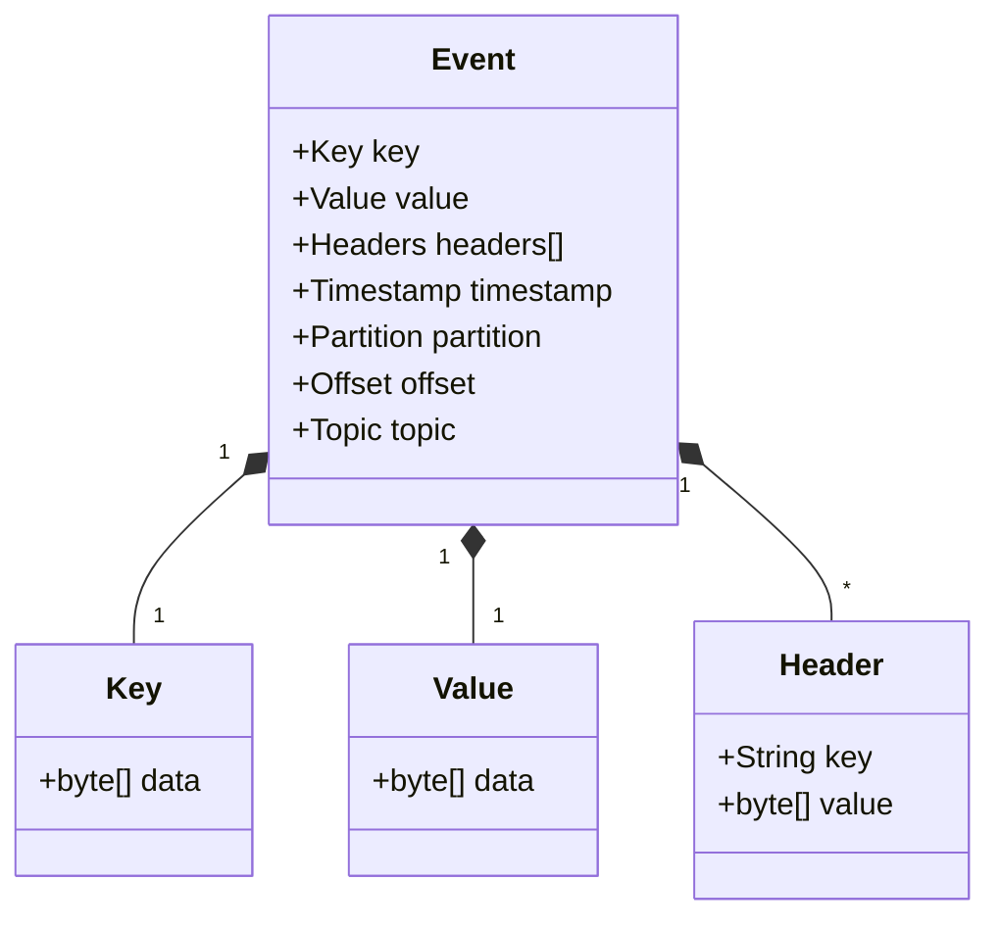
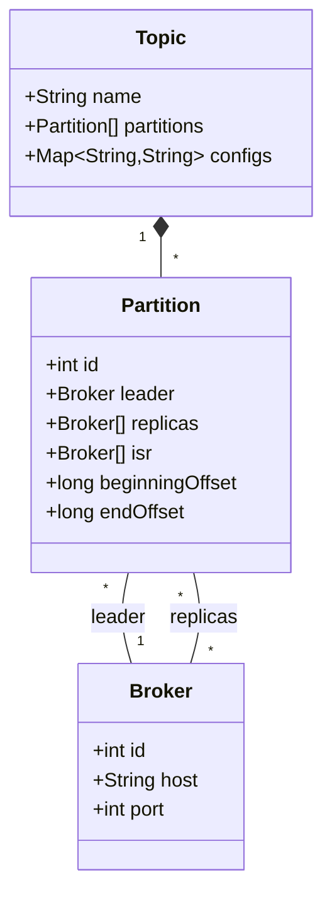
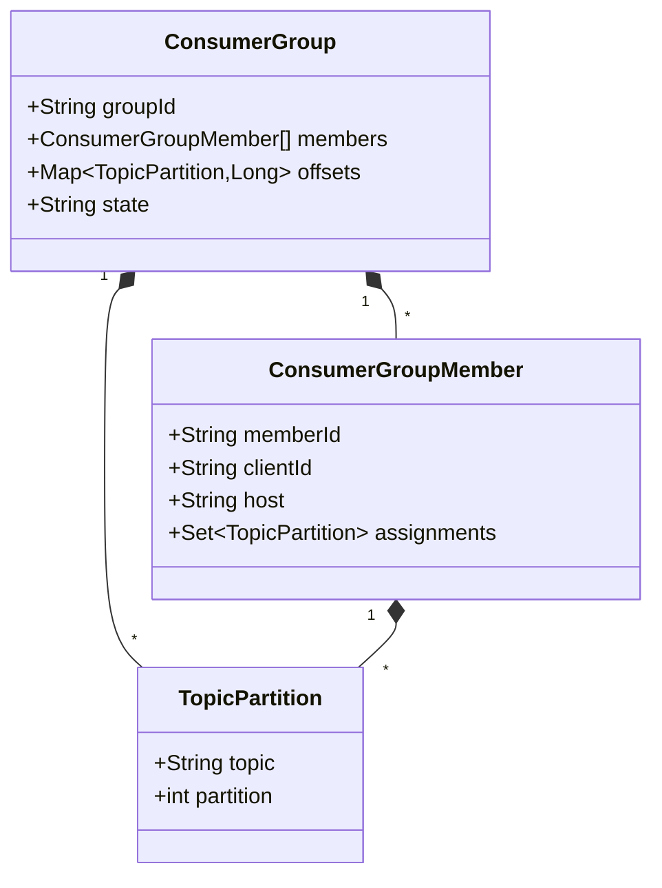
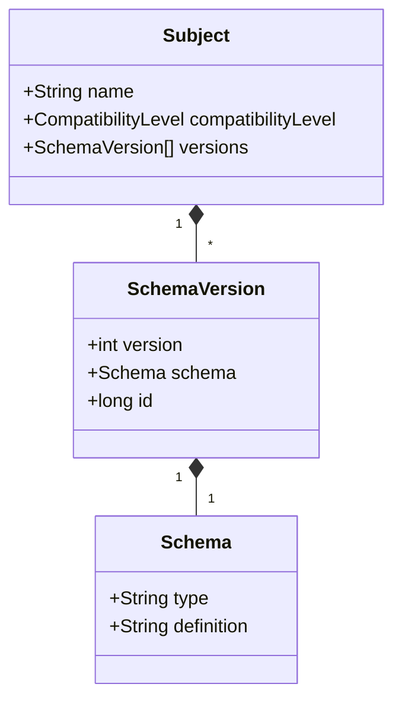
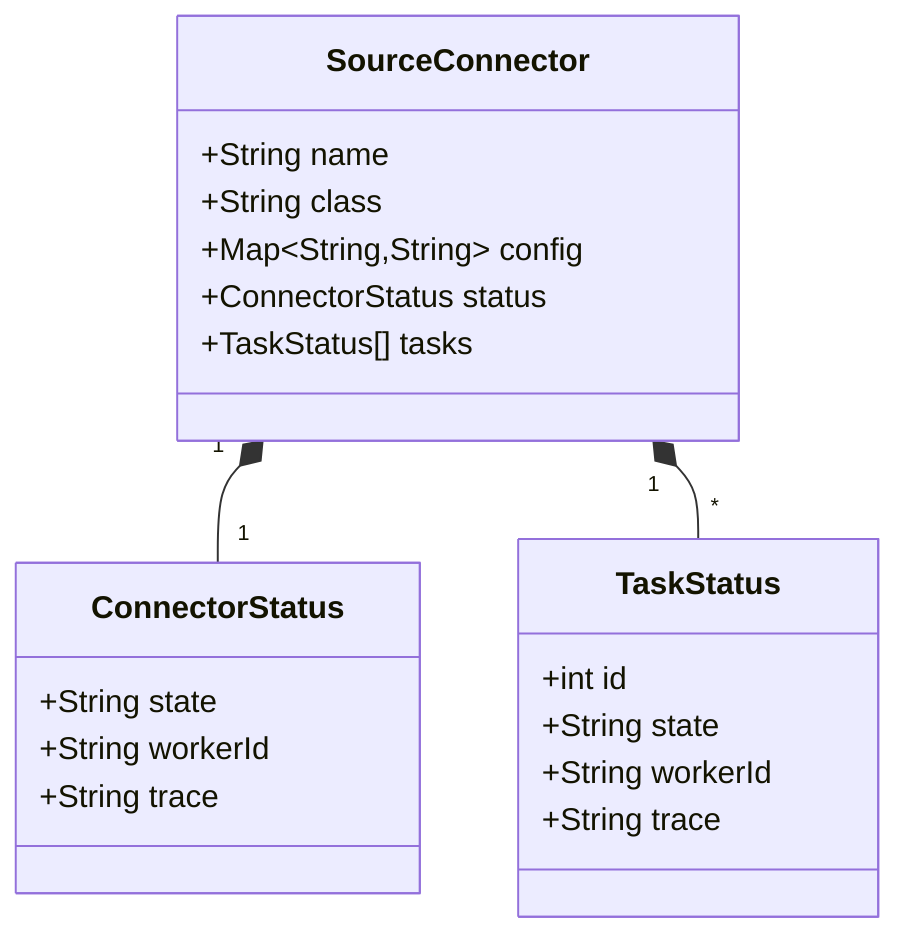
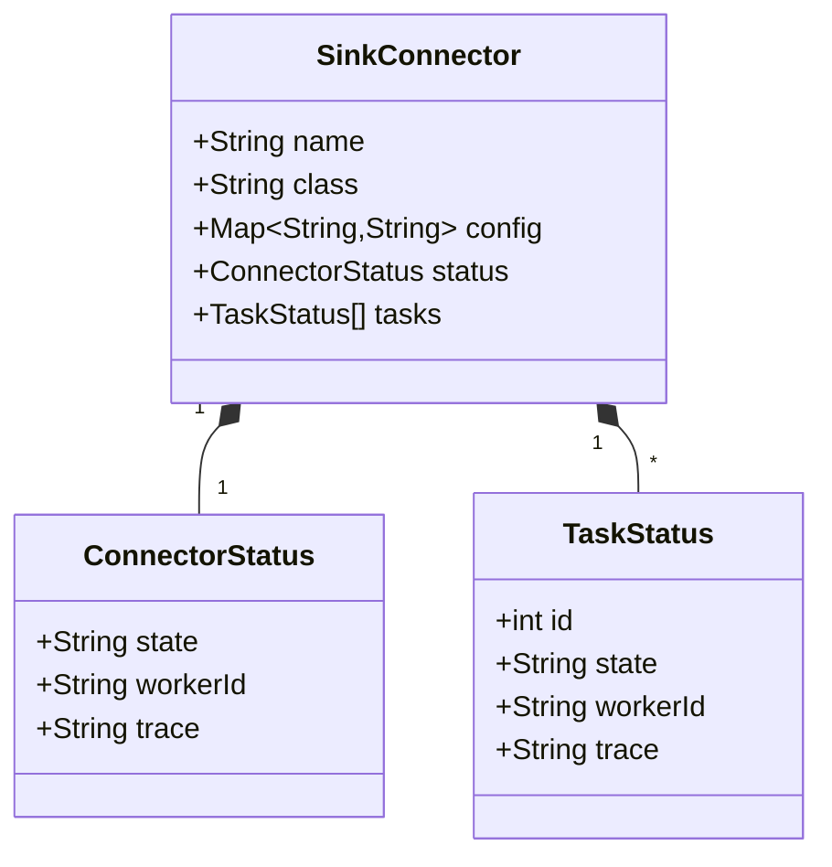
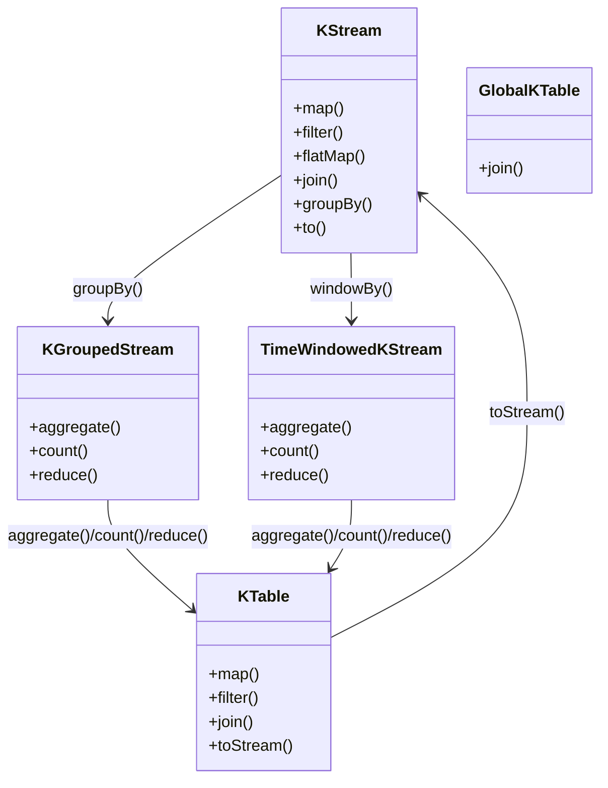
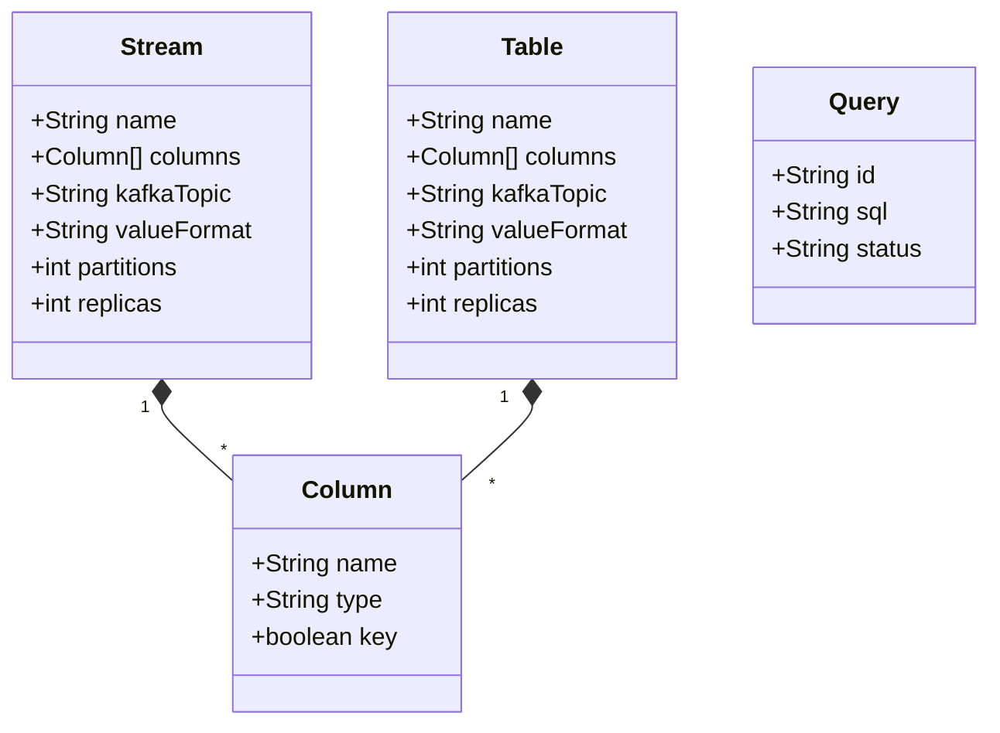

# Event Broker Data Model

## Introduction

This document describes the data model for the Event Broker component of the CMM Technology Platform. The Event Broker, built on Confluent Kafka, manages the exchange of events between healthcare systems. Understanding this data model is essential for designing effective event schemas, topic structures, and processing logic for healthcare event streams.

## Core Data Model

### Event Model

The fundamental unit of data in the Event Broker is the event:



#### Event Structure

- **Key**: Identifies the event and determines partition assignment
- **Value**: Contains the event payload
- **Headers**: Optional metadata about the event
- **Timestamp**: When the event was created or processed
- **Partition**: The topic partition containing the event
- **Offset**: The position of the event within the partition
- **Topic**: The topic to which the event belongs

#### Event Serialization

Events are serialized for storage and transmission:

- **Key Serialization**: Converts the key object to bytes
- **Value Serialization**: Converts the value object to bytes
- **Header Serialization**: Converts header values to bytes

### Topic Model

Topics organize events into logical streams:



#### Topic Structure

- **Name**: Unique identifier for the topic
- **Partitions**: Ordered, immutable sequences of events
- **Configurations**: Settings that control topic behavior

#### Partition Structure

- **ID**: Unique identifier within the topic
- **Leader**: Broker that handles reads and writes
- **Replicas**: Brokers that replicate the partition
- **ISR (In-Sync Replicas)**: Replicas that are current with the leader
- **Beginning Offset**: First available offset in the partition
- **End Offset**: Next offset to be written in the partition

### Consumer Group Model

Consumer groups coordinate event consumption:



#### Consumer Group Structure

- **Group ID**: Unique identifier for the consumer group
- **Members**: Consumers that belong to the group
- **Offsets**: Current consumption position for each partition
- **State**: Current state of the consumer group (e.g., Stable, Rebalancing)

#### Consumer Group Member Structure

- **Member ID**: Unique identifier for the member within the group
- **Client ID**: Identifier for the client application
- **Host**: Host where the consumer is running
- **Assignments**: Topic partitions assigned to this member

## Healthcare Event Models

### Healthcare Event Base Model

All healthcare events share a common base structure, defined using TypeScript interfaces for type safety and documentation:

```typescript
// Base event interface with Confluent Cloud metadata extensions
interface HealthcareEvent<T> {
  metadata: {
    eventId: string;           // Unique identifier for the event
    eventType: string;         // Type of event (e.g., patient.admitted)
    eventSource: string;       // System that generated the event
    eventTime: number;         // Timestamp when the event occurred
    correlationId: string;     // Identifier for tracking related events
    version: string;           // Schema version for the event
    // Confluent Cloud extensions for observability
    traceId?: string;          // Distributed tracing identifier
    partitionKey?: string;     // Key used for partitioning
    schemaId?: number;         // Schema Registry ID
    dataClassification?: string; // PHI, PII, or non-sensitive
    retentionPolicy?: string;  // Data retention policy identifier
  };
  data: T;                    // Event-specific data payload
}

// Example instantiation
const event: HealthcareEvent<PatientAdmission> = {
  metadata: {
    eventId: '1234-5678-9012-3456',
    eventType: 'patient.admitted',
    eventSource: 'ehr-system',
    eventTime: 1625097600000,
    correlationId: 'abcd-efgh-ijkl-mnop',
    version: '1.0',
    // Confluent Cloud specific metadata
    traceId: 'trace-1625097600000-abcdef',
    partitionKey: 'P123456',
    schemaId: 42,
    dataClassification: 'PHI',
    retentionPolicy: 'healthcare-7yr'
  },
  data: {
    // Event-specific data (typed as PatientAdmission)
    patientId: 'P123456',
    encounterId: 'E789012',
    // Additional fields defined by PatientAdmission interface
  }
};
```

#### Metadata Fields

- **Event ID**: Unique identifier for the event
- **Event Type**: Type of event (e.g., patient.admitted)
- **Event Source**: System that generated the event
- **Event Time**: Timestamp when the event occurred
- **Correlation ID**: Identifier for tracking related events
- **Version**: Schema version for the event

#### Confluent Cloud Extensions

- **Trace ID**: Enables distributed tracing across systems
- **Partition Key**: Ensures related events go to the same partition
- **Schema ID**: References the schema in Confluent Schema Registry
- **Data Classification**: Identifies sensitive data for special handling
- **Retention Policy**: Specifies data lifecycle management rules

### Patient Events

Events related to patients and their demographics, defined with TypeScript interfaces for type safety and integration with Confluent Cloud:

#### Patient Admitted Event

```typescript
// Define the provider interface
interface Provider {
  providerId: string;
  name: string;
  specialty?: string;
  npi?: string;  // National Provider Identifier
}

// Define the facility interface
interface Facility {
  facilityId: string;
  name: string;
  address?: {
    line1: string;
    line2?: string;
    city: string;
    state: string;
    postalCode: string;
  };
}

// Define the department interface
interface Department {
  departmentId: string;
  name: string;
}

// Define the bed assignment interface
interface BedAssignment {
  unit: string;
  room: string;
  bed: string;
}

// Define admission types as an enum for type safety
enum AdmissionType {
  EMERGENCY = 'EMERGENCY',
  ELECTIVE = 'ELECTIVE',
  URGENT = 'URGENT',
  DIRECT = 'DIRECT',
  TRANSFER = 'TRANSFER'
}

// Define the patient admission data interface
interface PatientAdmission {
  patientId: string;
  encounterId: string;
  admittingProvider: Provider;
  admissionTime: number;  // Timestamp in milliseconds
  facility: Facility;
  department: Department;
  admissionType: AdmissionType;
  admissionReason: string;
  bedAssignment: BedAssignment;
  // Confluent Cloud specific fields
  sourceSystem?: string;
  dataQuality?: {
    completeness: number;  // Percentage of required fields present
    validationStatus: 'PASSED' | 'WARNING' | 'FAILED';
    validationMessages?: string[];
  };
}

// Create a patient admitted event
const patientAdmittedEvent: HealthcareEvent<PatientAdmission> = {
  metadata: {
    eventId: '1234-5678-9012-3456',
    eventType: 'patient.admitted',
    eventSource: 'ehr-system',
    eventTime: 1625097600000,
    correlationId: 'abcd-efgh-ijkl-mnop',
    version: '1.0',
    // Confluent Cloud specific metadata
    traceId: 'trace-1625097600000-abcdef',
    partitionKey: 'P123456',  // Using patientId as partition key for co-location
    schemaId: 42,
    dataClassification: 'PHI',
    retentionPolicy: 'healthcare-7yr'
  },
  data: {
    patientId: 'P123456',
    encounterId: 'E789012',
    admittingProvider: {
      providerId: 'D456',
      name: 'Dr. Jane Smith',
      specialty: 'Emergency Medicine',
      npi: '1234567890'
    },
    admissionTime: 1625097600000,
    facility: {
      facilityId: 'F789',
      name: 'Memorial Hospital',
      address: {
        line1: '123 Medical Center Blvd',
        city: 'Springfield',
        state: 'IL',
        postalCode: '62701'
      }
    },
    department: {
      departmentId: 'D123',
      name: 'Emergency Department'
    },
    admissionType: AdmissionType.EMERGENCY,
    admissionReason: 'Chest pain',
    bedAssignment: {
      unit: '2E',
      room: '203',
      bed: 'A'
    },
    // Confluent Cloud specific fields
    sourceSystem: 'Epic',
    dataQuality: {
      completeness: 98.5,
      validationStatus: 'PASSED',
      validationMessages: []
    }
  }
};
```

#### Patient Discharged Event

```typescript
// Define the diagnosis interface
interface Diagnosis {
  code: string;
  system: 'ICD-10' | 'SNOMED-CT' | 'LOINC' | string;
  display: string;
  severity?: 'MILD' | 'MODERATE' | 'SEVERE';
  type?: 'PRIMARY' | 'SECONDARY' | 'ADMITTING' | 'DISCHARGE';
}

// Define discharge disposition as an enum for type safety
enum DischargeDisposition {
  HOME = 'HOME',
  SKILLED_NURSING = 'SKILLED_NURSING',
  REHAB = 'REHAB',
  EXPIRED = 'EXPIRED',
  AMA = 'AMA', // Against Medical Advice
  TRANSFERRED = 'TRANSFERRED',
  OTHER = 'OTHER'
}

// Define the patient discharge data interface
interface PatientDischarge {
  patientId: string;
  encounterId: string;
  dischargeTime: number;  // Timestamp in milliseconds
  dischargingProvider: Provider;
  dischargeDisposition: DischargeDisposition;
  dischargeDiagnoses: Diagnosis[];
  followUpInstructions: string;
  // Additional fields for comprehensive discharge data
  lengthOfStay?: number;  // In days
  medications?: {
    medication: string;
    dosage: string;
    frequency: string;
    duration?: string;
  }[];
  followUpAppointments?: {
    specialty: string;
    timeframe: string;
    provider?: string;
    scheduled?: boolean;
  }[];
  // Confluent Cloud specific fields
  sourceSystem?: string;
  dataQuality?: {
    completeness: number;
    validationStatus: 'PASSED' | 'WARNING' | 'FAILED';
    validationMessages?: string[];
  };
  // Compliance tracking for discharge requirements
  complianceStatus?: {
    medicationReconciliation: boolean;
    dischargeInstructions: boolean;
    followUpScheduled: boolean;
  };
}

// Create a patient discharged event
const patientDischargedEvent: HealthcareEvent<PatientDischarge> = {
  metadata: {
    eventId: '2345-6789-0123-4567',
    eventType: 'patient.discharged',
    eventSource: 'ehr-system',
    eventTime: 1625184000000,
    correlationId: 'abcd-efgh-ijkl-mnop',
    version: '1.0',
    // Confluent Cloud specific metadata
    traceId: 'trace-1625184000000-bcdefg',
    partitionKey: 'P123456',  // Using patientId as partition key for co-location
    schemaId: 43,
    dataClassification: 'PHI',
    retentionPolicy: 'healthcare-7yr'
  },
  data: {
    patientId: 'P123456',
    encounterId: 'E789012',
    dischargeTime: 1625184000000,
    dischargingProvider: {
      providerId: 'D456',
      name: 'Dr. Jane Smith',
      specialty: 'Cardiology',
      npi: '1234567890'
    },
    dischargeDisposition: DischargeDisposition.HOME,
    dischargeDiagnoses: [
      {
        code: 'I21.3',
        system: 'ICD-10',
        display: 'ST elevation (STEMI) myocardial infarction of unspecified site',
        severity: 'MODERATE',
        type: 'PRIMARY'
      },
      {
        code: 'I10',
        system: 'ICD-10',
        display: 'Essential (primary) hypertension',
        severity: 'MILD',
        type: 'SECONDARY'
      }
    ],
    followUpInstructions: 'Follow up with cardiology in 2 weeks',
    lengthOfStay: 3.5,
    medications: [
      {
        medication: 'Aspirin',
        dosage: '81mg',
        frequency: 'daily',
        duration: 'indefinite'
      },
      {
        medication: 'Atorvastatin',
        dosage: '40mg',
        frequency: 'daily at bedtime',
        duration: 'indefinite'
      }
    ],
    followUpAppointments: [
      {
        specialty: 'Cardiology',
        timeframe: '2 weeks',
        provider: 'Dr. Robert Johnson',
        scheduled: true
      }
    ],
    // Confluent Cloud specific fields
    sourceSystem: 'Epic',
    dataQuality: {
      completeness: 97.2,
      validationStatus: 'PASSED',
      validationMessages: []
    },
    complianceStatus: {
      medicationReconciliation: true,
      dischargeInstructions: true,
      followUpScheduled: true
    }
  }
};
```

#### Patient Updated Event

```json
{
  "metadata": {
    "eventId": "3456-7890-1234-5678",
    "eventType": "patient.updated",
    "eventSource": "ehr-system",
    "eventTime": 1625097900000,
    "correlationId": "bcde-fghi-jklm-nopq",
    "version": "1.0"
  },
  "data": {
    "patientId": "P123456",
    "demographics": {
      "name": {
        "first": "John",
        "middle": "Q",
        "last": "Public"
      },
      "dateOfBirth": "1980-01-15",
      "gender": "male",
      "addresses": [
        {
          "type": "home",
          "line1": "123 Main St",
          "city": "Anytown",
          "state": "CA",
          "postalCode": "12345"
        }
      ],
      "phoneNumbers": [
        {
          "type": "home",
          "number": "555-123-4567"
        }
      ],
      "email": "john.public@example.com",
      "language": "en",
      "maritalStatus": "married"
    },
    "updatedFields": ["addresses", "phoneNumbers"]
  }
}
```

### Clinical Events

Events related to clinical care and observations, defined with TypeScript interfaces for type safety and integration with Confluent Cloud:

#### Vital Signs Event

```typescript
// Define the range interface for normal values
interface NormalRange {
  low: number;
  high: number;
}

// Define blood pressure normal range interface
interface BloodPressureRange {
  systolic: NormalRange;
  diastolic: NormalRange;
}

// Define vital sign types as an enum for type safety
enum VitalSignType {
  HEART_RATE = 'heart_rate',
  BLOOD_PRESSURE = 'blood_pressure',
  TEMPERATURE = 'temperature',
  RESPIRATORY_RATE = 'respiratory_rate',
  OXYGEN_SATURATION = 'oxygen_saturation',
  PAIN = 'pain',
  HEIGHT = 'height',
  WEIGHT = 'weight',
  BMI = 'bmi'
}

// Define the base vital sign interface
interface BaseVitalSign {
  type: VitalSignType;
  unit: string;
  deviceId?: string;  // Medical device identifier
  method?: string;    // Measurement method
  position?: string;  // Patient position during measurement
  site?: string;      // Body site of measurement
}

// Define specific vital sign interfaces
interface HeartRateVitalSign extends BaseVitalSign {
  type: VitalSignType.HEART_RATE;
  value: number;
  unit: 'bpm';
  normalRange: NormalRange;
  rhythm?: 'REGULAR' | 'IRREGULAR';
}

interface BloodPressureVitalSign extends BaseVitalSign {
  type: VitalSignType.BLOOD_PRESSURE;
  systolic: number;
  diastolic: number;
  unit: 'mmHg';
  normalRange: BloodPressureRange;
  position: 'SITTING' | 'STANDING' | 'SUPINE' | 'LYING';
  site?: 'LEFT_ARM' | 'RIGHT_ARM' | 'LEFT_LEG' | 'RIGHT_LEG';
}

interface TemperatureVitalSign extends BaseVitalSign {
  type: VitalSignType.TEMPERATURE;
  value: number;
  unit: 'C' | 'F';
  normalRange: NormalRange;
  site?: 'ORAL' | 'RECTAL' | 'AXILLARY' | 'TYMPANIC' | 'TEMPORAL';
}

interface RespiratoryRateVitalSign extends BaseVitalSign {
  type: VitalSignType.RESPIRATORY_RATE;
  value: number;
  unit: 'breaths/min';
  normalRange: NormalRange;
  quality?: 'REGULAR' | 'IRREGULAR' | 'LABORED';
}

interface OxygenSaturationVitalSign extends BaseVitalSign {
  type: VitalSignType.OXYGEN_SATURATION;
  value: number;
  unit: '%';
  normalRange: NormalRange;
  oxygenFlow?: number;  // Supplemental oxygen flow rate
  oxygenType?: string;  // Type of oxygen delivery
}

// Define the vital sign as a union type
type VitalSign = HeartRateVitalSign | BloodPressureVitalSign | TemperatureVitalSign | 
  RespiratoryRateVitalSign | OxygenSaturationVitalSign;

// Define the vital signs data interface
interface VitalSigns {
  patientId: string;
  encounterId: string;
  recordedTime: number;  // Timestamp in milliseconds
  recordedBy: {
    providerId: string;
    name: string;
    role?: string;
  };
  vitalSigns: VitalSign[];
  // Confluent Cloud specific fields
  sourceSystem?: string;
  dataQuality?: {
    completeness: number;
    validationStatus: 'PASSED' | 'WARNING' | 'FAILED';
    validationMessages?: string[];
  };
  // Clinical decision support integration
  alertsGenerated?: {
    alertId: string;
    alertType: string;
    severity: 'CRITICAL' | 'WARNING' | 'INFO';
    message: string;
  }[];
}

// Create a vital signs event
const vitalSignsEvent: HealthcareEvent<VitalSigns> = {
  metadata: {
    eventId: '4567-8901-2345-6789',
    eventType: 'observation.vitals',
    eventSource: 'ehr-system',
    eventTime: 1625098200000,
    correlationId: 'cdef-ghij-klmn-opqr',
    version: '1.0',
    // Confluent Cloud specific metadata
    traceId: 'trace-1625098200000-cdefgh',
    partitionKey: 'P123456',  // Using patientId as partition key for co-location
    schemaId: 44,
    dataClassification: 'PHI',
    retentionPolicy: 'healthcare-7yr'
  },
  data: {
    patientId: 'P123456',
    encounterId: 'E789012',
    recordedTime: 1625098200000,
    recordedBy: {
      providerId: 'N123',
      name: 'Nurse Alice Johnson',
      role: 'RN'
    },
    vitalSigns: [
      {
        type: VitalSignType.HEART_RATE,
        value: 72,
        unit: 'bpm',
        normalRange: {
          low: 60,
          high: 100
        },
        rhythm: 'REGULAR',
        method: 'ELECTRONIC',
        deviceId: 'HR-MONITOR-001'
      } as HeartRateVitalSign,
      {
        type: VitalSignType.BLOOD_PRESSURE,
        systolic: 120,
        diastolic: 80,
        unit: 'mmHg',
        normalRange: {
          systolic: {
            low: 90,
            high: 140
          },
          diastolic: {
            low: 60,
            high: 90
          }
        },
        position: 'SITTING',
        site: 'LEFT_ARM',
        method: 'ELECTRONIC',
        deviceId: 'BP-MONITOR-002'
      } as BloodPressureVitalSign,
      {
        type: VitalSignType.TEMPERATURE,
        value: 37.0,
        unit: 'C',
        normalRange: {
          low: 36.5,
          high: 37.5
        },
        site: 'ORAL',
        method: 'ELECTRONIC',
        deviceId: 'THERMOMETER-003'
      } as TemperatureVitalSign,
      {
        type: VitalSignType.RESPIRATORY_RATE,
        value: 16,
        unit: 'breaths/min',
        normalRange: {
          low: 12,
          high: 20
        },
        quality: 'REGULAR',
        method: 'MANUAL'
      } as RespiratoryRateVitalSign,
      {
        type: VitalSignType.OXYGEN_SATURATION,
        value: 98,
        unit: '%',
        normalRange: {
          low: 95,
          high: 100
        },
        method: 'ELECTRONIC',
        deviceId: 'PULSE-OX-004'
      } as OxygenSaturationVitalSign
    ],
    // Confluent Cloud specific fields
    sourceSystem: 'Epic',
    dataQuality: {
      completeness: 100,
      validationStatus: 'PASSED',
      validationMessages: []
    },
    // Clinical decision support integration
    alertsGenerated: []  // No alerts for this normal set of vitals
  }
};
```

#### Medication Order Event

```json
{
  "metadata": {
    "eventId": "5678-9012-3456-7890",
    "eventType": "medication.ordered",
    "eventSource": "ehr-system",
    "eventTime": 1625098500000,
    "correlationId": "defg-hijk-lmno-pqrs",
    "version": "1.0"
  },
  "data": {
    "patientId": "P123456",
    "encounterId": "E789012",
    "orderId": "M456789",
    "orderTime": 1625098500000,
    "orderingProvider": {
      "providerId": "DR456",
      "name": "Dr. John Doe"
    },
    "medication": {
      "code": "318137",
      "system": "RxNorm",
      "display": "Aspirin 81 MG Oral Tablet"
    },
    "dosage": {
      "amount": 1,
      "unit": "tablet",
      "frequency": "daily",
      "route": "oral",
      "duration": {
        "value": 30,
        "unit": "days"
      }
    },
    "reason": "Prophylaxis - cardiac",
    "pharmacy": {
      "pharmacyId": "PHARM001",
      "name": "Hospital Pharmacy"
    },
    "status": "active"
  }
}
```

### Order Events

Events related to clinical orders and results:

#### Lab Order Event

```json
{
  "metadata": {
    "eventId": "6789-0123-4567-8901",
    "eventType": "lab.ordered",
    "eventSource": "ehr-system",
    "eventTime": 1625098800000,
    "correlationId": "efgh-ijkl-mnop-qrst",
    "version": "1.0"
  },
  "data": {
    "patientId": "P123456",
    "encounterId": "E789012",
    "orderId": "L123456",
    "orderTime": 1625098800000,
    "orderingProvider": {
      "providerId": "DR456",
      "name": "Dr. John Doe"
    },
    "tests": [
      {
        "code": "1920-8",
        "system": "LOINC",
        "display": "Glucose [Mass/volume] in Serum or Plasma"
      },
      {
        "code": "2093-3",
        "system": "LOINC",
        "display": "Cholesterol [Mass/volume] in Serum or Plasma"
      }
    ],
    "priority": "routine",
    "specimenCollection": {
      "type": "blood",
      "collectionTime": null,
      "collector": null
    },
    "status": "ordered"
  }
}
```

#### Lab Result Event

```json
{
  "metadata": {
    "eventId": "7890-1234-5678-9012",
    "eventType": "lab.resulted",
    "eventSource": "lab-system",
    "eventTime": 1625102400000,
    "correlationId": "efgh-ijkl-mnop-qrst",
    "version": "1.0"
  },
  "data": {
    "patientId": "P123456",
    "encounterId": "E789012",
    "orderId": "L123456",
    "resultId": "R789012",
    "orderTime": 1625098800000,
    "resultTime": 1625102400000,
    "specimenCollection": {
      "type": "blood",
      "collectionTime": 1625099400000,
      "collector": {
        "providerId": "N123",
        "name": "Nurse Alice Johnson"
      }
    },
    "results": [
      {
        "test": {
          "code": "1920-8",
          "system": "LOINC",
          "display": "Glucose [Mass/volume] in Serum or Plasma"
        },
        "value": 95,
        "unit": "mg/dL",
        "referenceRange": {
          "low": 70,
          "high": 100
        },
        "interpretation": "normal",
        "performer": "Main Laboratory"
      },
      {
        "test": {
          "code": "2093-3",
          "system": "LOINC",
          "display": "Cholesterol [Mass/volume] in Serum or Plasma"
        },
        "value": 210,
        "unit": "mg/dL",
        "referenceRange": {
          "low": 0,
          "high": 200
        },
        "interpretation": "high",
        "performer": "Main Laboratory"
      }
    ],
    "status": "final"
  }
}
```

## Schema Registry Model

The Schema Registry manages event schemas:



### Schema Registry Structure

- **Subject**: Named schema collection, typically `<topic>-key` or `<topic>-value`
- **Compatibility Level**: Rules for schema evolution (e.g., BACKWARD, FORWARD, FULL)
- **Schema Version**: Version of a schema for a subject
- **Schema**: The actual schema definition (AVRO, JSON Schema, Protobuf)

### Schema Evolution

Schemas evolve over time with compatibility guarantees:

- **BACKWARD**: New schema can read data written with old schema
- **FORWARD**: Old schema can read data written with new schema
- **FULL**: Both backward and forward compatible
- **NONE**: No compatibility guarantees

## Topic Naming Model

Standardized topic naming conventions for healthcare events:

```
<domain>.<entity>.<event-type>
```

### Domain Categories

- **clinical**: Clinical care events
- **administrative**: Administrative events
- **financial**: Financial and billing events
- **operational**: Operational and system events
- **analytics**: Derived and aggregated events

### Entity Types

- **patient**: Patient-related events
- **encounter**: Encounter/visit events
- **provider**: Provider/clinician events
- **medication**: Medication-related events
- **lab**: Laboratory-related events
- **imaging**: Imaging-related events
- **procedure**: Procedure-related events
- **location**: Location/facility events

### Event Types

- **created**: Resource creation events
- **updated**: Resource update events
- **deleted**: Resource deletion events
- **admitted**: Patient admission events
- **discharged**: Patient discharge events
- **transferred**: Patient transfer events
- **ordered**: Order creation events
- **resulted**: Result creation events
- **administered**: Medication administration events

### Example Topic Names

- **clinical.patient.admitted**: Patient admission events
- **clinical.patient.discharged**: Patient discharge events
- **clinical.medication.ordered**: Medication order events
- **clinical.medication.administered**: Medication administration events
- **clinical.lab.ordered**: Laboratory order events
- **clinical.lab.resulted**: Laboratory result events
- **clinical.vitals.recorded**: Vital signs recording events
- **administrative.appointment.scheduled**: Appointment scheduling events
- **administrative.appointment.canceled**: Appointment cancellation events
- **financial.claim.submitted**: Claim submission events
- **financial.payment.received**: Payment receipt events

## Connector Data Models

### Source Connector Model

Source connectors import data from external systems:



### Sink Connector Model

Sink connectors export data to external systems:



## Stream Processing Data Models

### Kafka Streams Model

Kafka Streams processes event streams:



### ksqlDB Model

ksqlDB provides a SQL interface for stream processing:



## Conclusion

The Event Broker data model provides a comprehensive framework for organizing and managing healthcare events. By understanding this data model, developers can design effective event schemas, topic structures, and processing logic that meet the unique requirements of healthcare applications. This model enables real-time data exchange, process automation, and analytics across the healthcare ecosystem.

## Related Documentation

- [Event Broker Overview](../01-getting-started/overview.md)
- [Event Broker Architecture](../01-getting-started/architecture.md)
- [Core APIs](./core-apis.md)
- [Event Schemas](./event-schemas.md)
- [Topic Design](./topic-design.md)
