# Event Broker Integration Points

## Introduction

This document outlines the integration points between the Event Broker and other components of the CMM Technology Platform. The Event Broker serves as the central nervous system for real-time data exchange, enabling event-driven communication between various healthcare systems and components. Understanding these integration points is essential for building cohesive, interoperable healthcare applications.

## Core Component Integrations

### FHIR Interoperability Platform Integration

The Event Broker integrates with the FHIR Interoperability Platform to enable event-driven FHIR workflows:

#### FHIR Resource Change Events

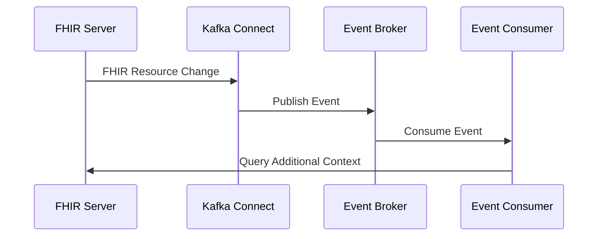

- **Event Types**: Resource created, updated, deleted
- **Topic Pattern**: `fhir.<resource-type>.<operation>`
- **Example Topics**:
  - `fhir.patient.created`
  - `fhir.observation.updated`
  - `fhir.medicationrequest.deleted`

#### FHIR Subscription Implementation

The Event Broker powers the FHIR Subscription capability:

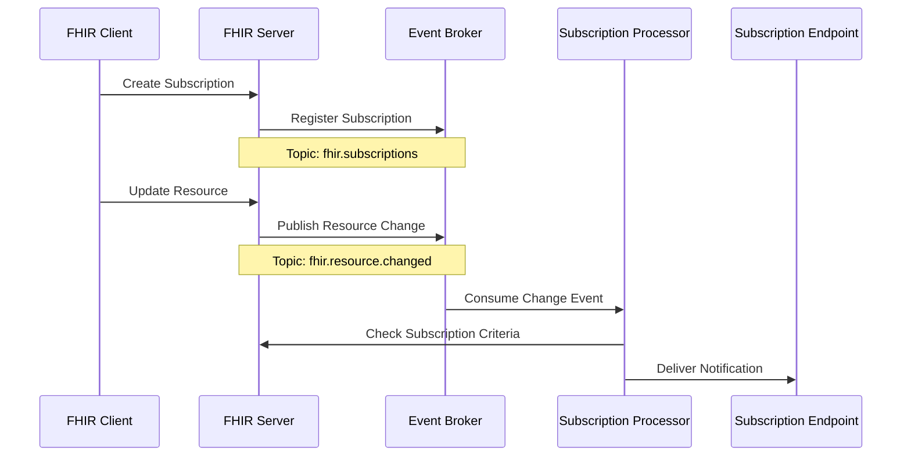

- **Subscription Types**: REST Hook, Websocket, Email, SMS
- **Topic Pattern**: `fhir.subscription.<channel-type>`
- **Example Topics**:
  - `fhir.subscription.rest-hook`
  - `fhir.subscription.websocket`

#### FHIR Bulk Data Operations

The Event Broker facilitates FHIR bulk data operations:

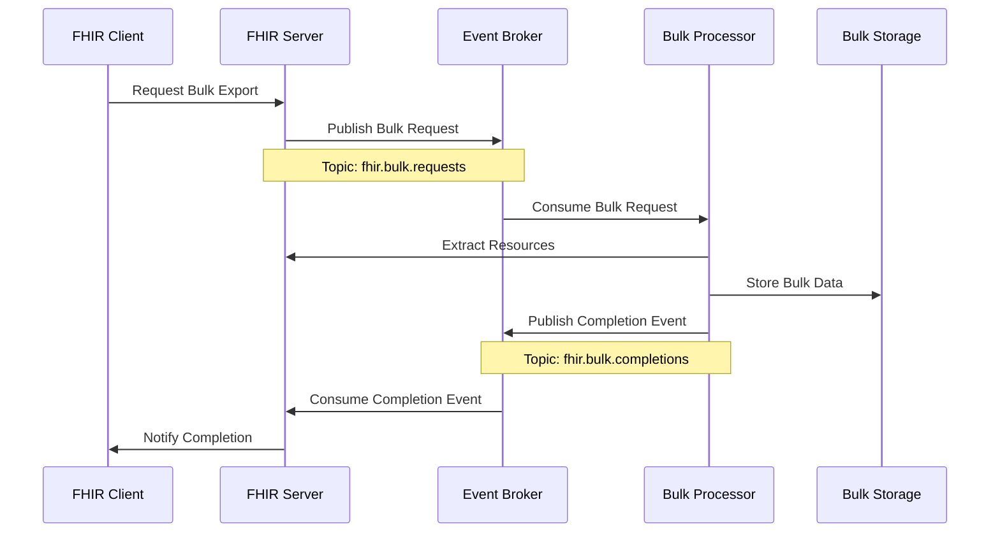

- **Bulk Operation Types**: Export, Import
- **Topic Pattern**: `fhir.bulk.<operation>`
- **Example Topics**:
  - `fhir.bulk.export-requests`
  - `fhir.bulk.export-completions`
  - `fhir.bulk.import-requests`

### Security and Access Framework Integration

The Event Broker integrates with the Security and Access Framework for authentication, authorization, and audit:

#### Authentication Integration

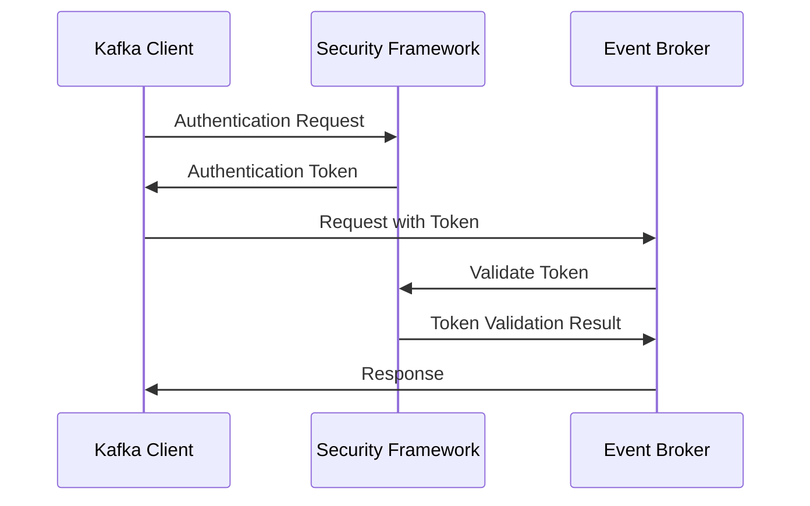

- **Authentication Methods**: SASL/PLAIN, SASL/SCRAM, SASL/OAUTHBEARER, mTLS
- **Integration Point**: Kafka client authentication
- **Configuration**: JAAS configuration for Kafka brokers and clients

#### Authorization Integration

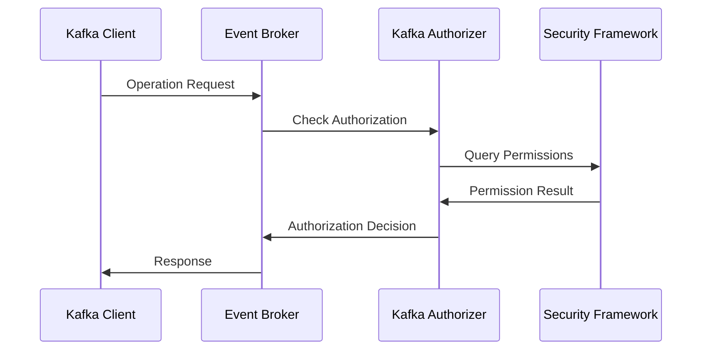

- **Authorization Model**: Role-Based Access Control (RBAC)
- **Resource Types**: Topics, Consumer Groups, Transactional IDs
- **Operations**: Read, Write, Create, Delete, Describe, Alter
- **Integration Point**: Custom authorizer plugin

#### Audit Integration

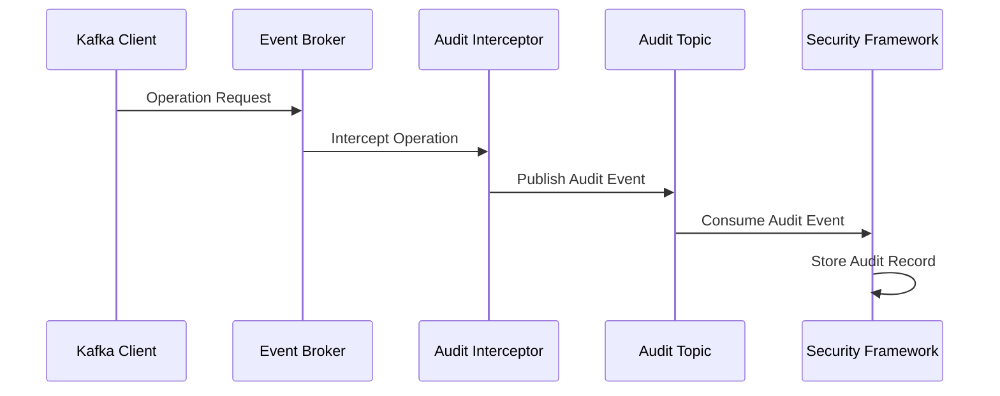

- **Audit Event Types**: Authentication, Authorization, Data Access
- **Topic Pattern**: `security.audit.<event-type>`
- **Example Topics**:
  - `security.audit.authentication`
  - `security.audit.authorization`
  - `security.audit.data-access`

### API Marketplace Integration

The Event Broker integrates with the API Marketplace to expose event streams as APIs:

#### Event API Gateway

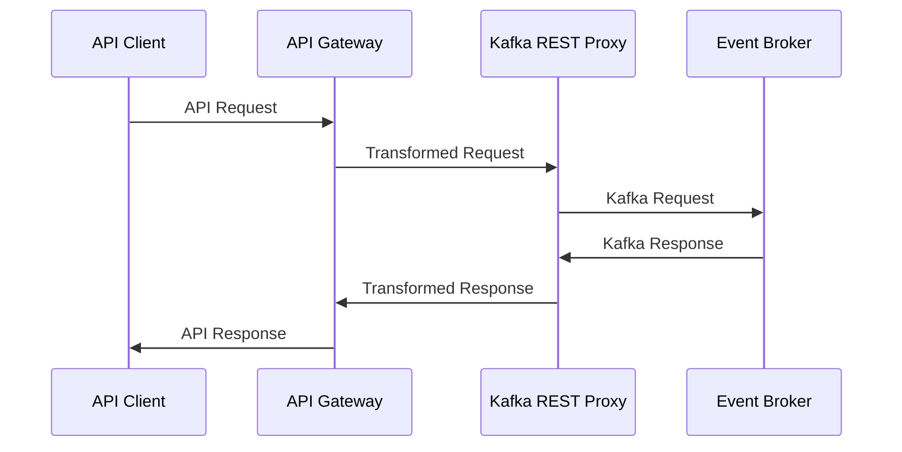

- **API Types**: REST, GraphQL, WebSocket
- **Integration Point**: Kafka REST Proxy behind API Gateway
- **Authentication**: API Gateway handles authentication

#### Event-Driven API Documentation

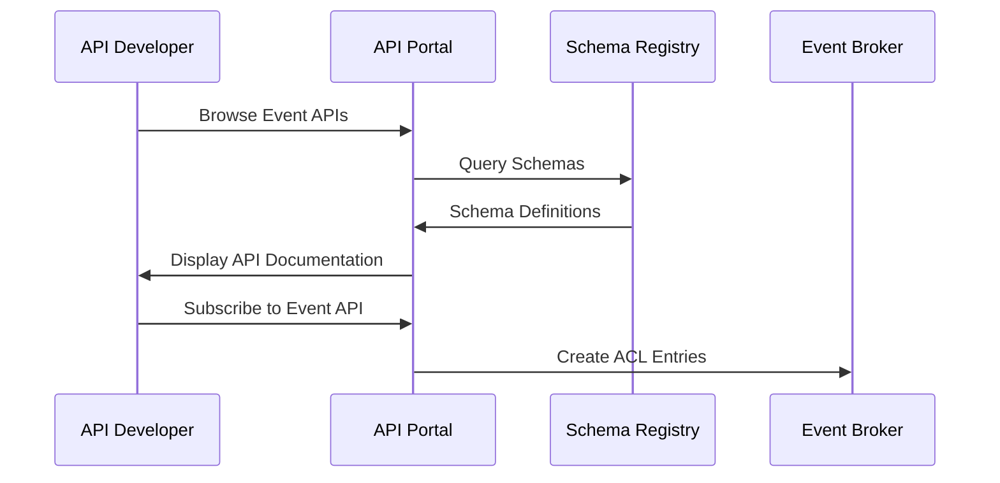

- **Documentation Sources**: Schema Registry, Topic Metadata
- **Integration Point**: Schema Registry API
- **Documentation Format**: AsyncAPI, OpenAPI

#### Event API Analytics

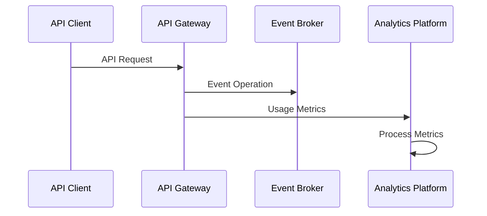

- **Metric Types**: Throughput, Latency, Error Rate
- **Integration Point**: API Gateway metrics collection
- **Reporting**: API Marketplace analytics dashboard

### Workflow Orchestration Engine Integration

The Event Broker integrates with the Workflow Orchestration Engine to enable event-driven workflows:

#### Workflow Triggers


- **Trigger Types**: Start Workflow, Resume Workflow, Cancel Workflow
- **Topic Pattern**: `workflow.triggers.<workflow-type>`
- **Example Topics**:
  - `workflow.triggers.admission`
  - `workflow.triggers.discharge`
  - `workflow.triggers.referral`

#### Workflow State Events

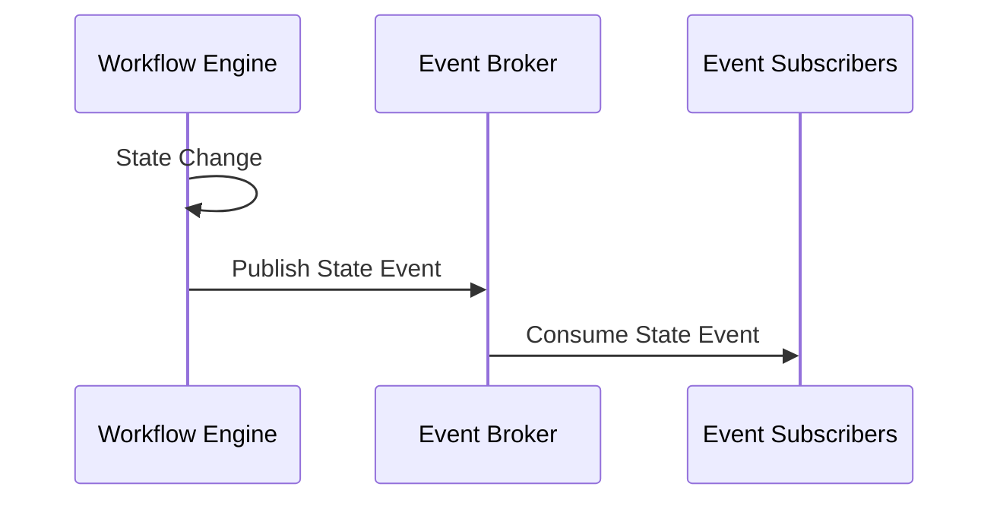

- **State Event Types**: Started, Completed, Failed, Suspended
- **Topic Pattern**: `workflow.states.<workflow-type>`
- **Example Topics**:
  - `workflow.states.admission`
  - `workflow.states.discharge`
  - `workflow.states.referral`

#### Workflow Task Events

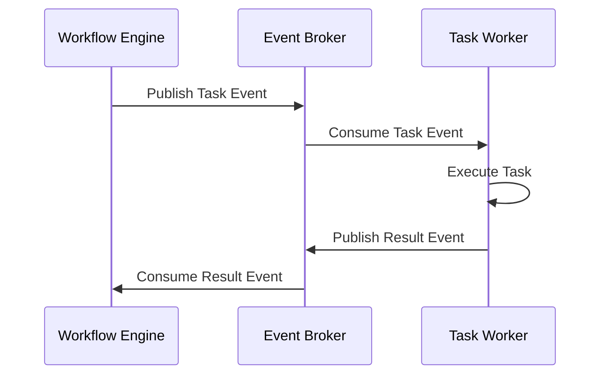

- **Task Event Types**: Created, Assigned, Completed, Failed
- **Topic Pattern**: `workflow.tasks.<task-type>`
- **Example Topics**:
  - `workflow.tasks.approval`
  - `workflow.tasks.notification`
  - `workflow.tasks.data-entry`

## External System Integrations

### Electronic Health Record (EHR) Integration

The Event Broker integrates with EHR systems to exchange clinical data:

#### HL7 v2 Integration

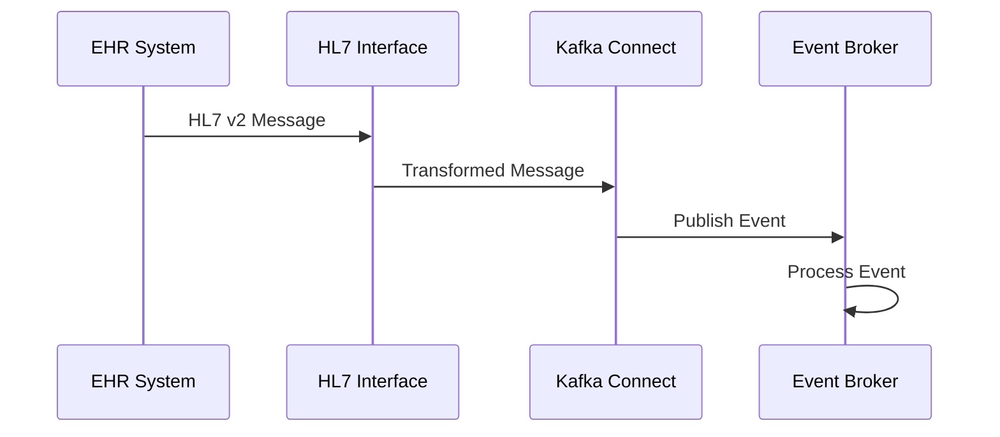

- **Message Types**: ADT, ORM, ORU, SIU, MDM
- **Topic Pattern**: `hl7.<message-type>.<trigger-event>`
- **Example Topics**:
  - `hl7.adt.a01` (Admission)
  - `hl7.adt.a03` (Discharge)
  - `hl7.oru.r01` (Observation Result)

#### EHR API Integration


- **API Types**: REST, SOAP, Proprietary
- **Topic Pattern**: `ehr.<vendor>.<resource-type>.<operation>`
- **Example Topics**:
  - `ehr.epic.patient.updated`
  - `ehr.cerner.order.created`
  - `ehr.allscripts.result.available`

### Medical Device Integration

The Event Broker integrates with medical devices to capture real-time data:

#### Device Data Integration

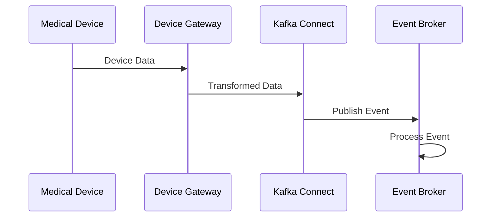

- **Device Types**: Patient Monitors, Infusion Pumps, Ventilators
- **Topic Pattern**: `device.<device-type>.<data-type>`
- **Example Topics**:
  - `device.patient-monitor.vitals`
  - `device.infusion-pump.status`
  - `device.ventilator.settings`

#### Device Alert Integration

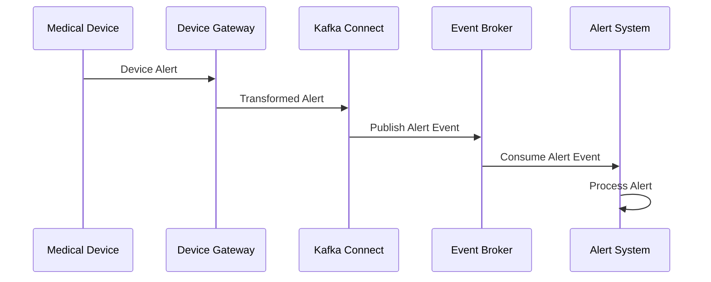

- **Alert Types**: Technical, Physiological, Operational
- **Topic Pattern**: `device.alerts.<alert-type>`
- **Example Topics**:
  - `device.alerts.technical`
  - `device.alerts.physiological`
  - `device.alerts.operational`

### Laboratory Information System (LIS) Integration

The Event Broker integrates with laboratory systems to exchange lab orders and results:

#### Lab Order Integration

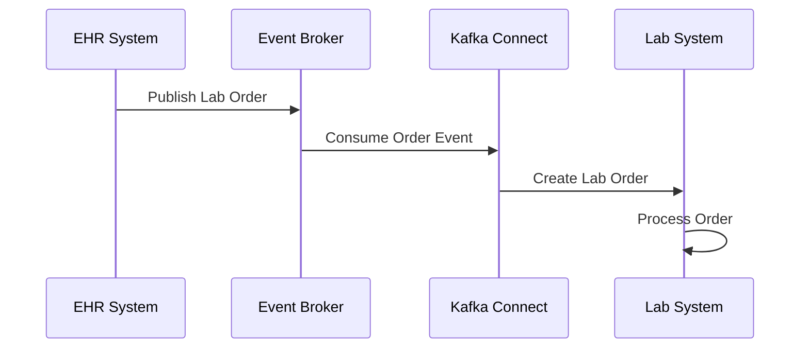

- **Order Types**: Laboratory, Pathology, Microbiology
- **Topic Pattern**: `lab.orders.<order-type>`
- **Example Topics**:
  - `lab.orders.chemistry`
  - `lab.orders.hematology`
  - `lab.orders.microbiology`

#### Lab Result Integration

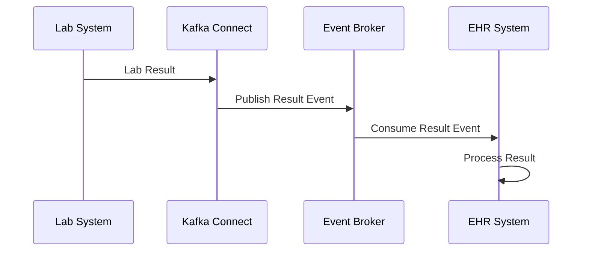

- **Result Types**: Normal, Abnormal, Critical
- **Topic Pattern**: `lab.results.<result-type>`
- **Example Topics**:
  - `lab.results.normal`
  - `lab.results.abnormal`
  - `lab.results.critical`

### Pharmacy System Integration

The Event Broker integrates with pharmacy systems to exchange medication orders and dispensing information:

#### Medication Order Integration

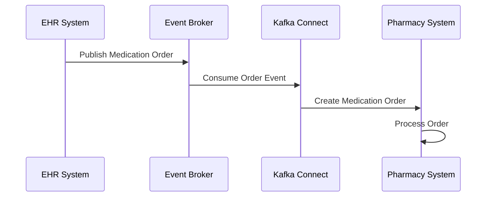

- **Order Types**: Inpatient, Outpatient, Discharge
- **Topic Pattern**: `pharmacy.orders.<order-type>`
- **Example Topics**:
  - `pharmacy.orders.inpatient`
  - `pharmacy.orders.outpatient`
  - `pharmacy.orders.discharge`

#### Medication Dispensing Integration

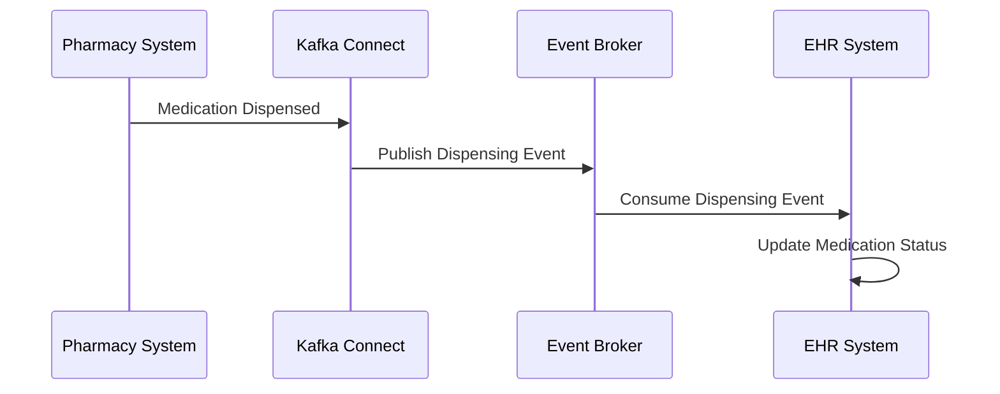

- **Dispensing Types**: New, Refill, Return
- **Topic Pattern**: `pharmacy.dispensing.<dispensing-type>`
- **Example Topics**:
  - `pharmacy.dispensing.new`
  - `pharmacy.dispensing.refill`
  - `pharmacy.dispensing.return`

## Analytics and Reporting Integrations

### Real-Time Analytics Integration

The Event Broker integrates with analytics platforms for real-time data processing:

#### Streaming Analytics

```mermaid
sequenceDiagram
    participant Source as Event Source
    participant Broker as Event Broker
    participant Streams as Kafka Streams
    participant Dashboard as Real-Time Dashboard
    
    Source->>Broker: Publish Event
    Broker->>Streams: Process Event Stream
    Streams->>Broker: Publish Derived Event
    Broker->>Dashboard: Update Dashboard
```

- **Analytics Types**: KPIs, Metrics, Alerts
- **Topic Pattern**: `analytics.realtime.<metric-type>`
- **Example Topics**:
  - `analytics.realtime.patient-flow`
  - `analytics.realtime.bed-occupancy`
  - `analytics.realtime.wait-times`

#### Clinical Decision Support

```mermaid
sequenceDiagram
    participant Source as Clinical Source
    participant Broker as Event Broker
    participant CDS as CDS Engine
    participant EHR as EHR System
    
    Source->>Broker: Publish Clinical Event
    Broker->>CDS: Consume Clinical Event
    CDS->>CDS: Apply Clinical Rules
    CDS->>Broker: Publish Alert Event
    Broker->>EHR: Consume Alert Event
```

- **CDS Types**: Alerts, Reminders, Order Sets
- **Topic Pattern**: `cds.<alert-type>.<priority>`
- **Example Topics**:
  - `cds.drug-interaction.high`
  - `cds.abnormal-result.critical`
  - `cds.care-gap.medium`

### Data Lake Integration

The Event Broker integrates with data lakes for long-term storage and analysis:

#### Data Lake Ingestion

```mermaid
sequenceDiagram
    participant Source as Event Source
    participant Broker as Event Broker
    participant Connect as Kafka Connect
    participant Lake as Data Lake
    
    Source->>Broker: Publish Event
    Broker->>Connect: Consume Event
    Connect->>Lake: Store Event
    Lake->>Lake: Process Data
```

- **Storage Formats**: Parquet, Avro, JSON
- **Integration Point**: Kafka Connect sink connectors
- **Destination Systems**: HDFS, S3, Azure Data Lake

#### Data Warehouse Integration

```mermaid
sequenceDiagram
    participant Source as Event Source
    participant Broker as Event Broker
    participant Connect as Kafka Connect
    participant DW as Data Warehouse
    
    Source->>Broker: Publish Event
    Broker->>Connect: Consume Event
    Connect->>DW: Load Data
    DW->>DW: Transform Data
```

- **Warehouse Types**: Snowflake, BigQuery, Redshift
- **Integration Point**: Kafka Connect sink connectors
- **Data Models**: Star Schema, Data Vault, Dimensional

## Mobile and Patient Engagement Integrations

### Mobile Application Integration

The Event Broker integrates with mobile applications for real-time updates:

#### Push Notification Integration

```mermaid
sequenceDiagram
    participant Source as Event Source
    participant Broker as Event Broker
    participant Service as Notification Service
    participant Mobile as Mobile App
    
    Source->>Broker: Publish Event
    Broker->>Service: Consume Event
    Service->>Mobile: Send Push Notification
    Mobile->>Mobile: Display Notification
```

- **Notification Types**: Appointment, Result, Medication
- **Topic Pattern**: `notifications.push.<notification-type>`
- **Example Topics**:
  - `notifications.push.appointment`
  - `notifications.push.result`
  - `notifications.push.medication`

#### Real-Time Updates

```mermaid
sequenceDiagram
    participant Source as Event Source
    participant Broker as Event Broker
    participant Gateway as API Gateway
    participant Mobile as Mobile App
    
    Source->>Broker: Publish Event
    Broker->>Gateway: Consume Event
    Gateway->>Mobile: WebSocket Update
    Mobile->>Mobile: Update UI
```

- **Update Types**: Status, Progress, Alert
- **Integration Point**: WebSocket API Gateway
- **Protocol**: WebSocket, Server-Sent Events

### Patient Portal Integration

The Event Broker integrates with patient portals for real-time information:

#### Patient Portal Updates

```mermaid
sequenceDiagram
    participant Source as Event Source
    participant Broker as Event Broker
    participant Portal as Patient Portal
    participant Patient as Patient User
    
    Source->>Broker: Publish Event
    Broker->>Portal: Consume Event
    Portal->>Portal: Update Data
    Patient->>Portal: View Information
```

- **Update Types**: Results, Medications, Appointments
- **Topic Pattern**: `patient.portal.<update-type>`
- **Example Topics**:
  - `patient.portal.results`
  - `patient.portal.medications`
  - `patient.portal.appointments`

## Conclusion

The Event Broker provides extensive integration points with both internal components of the CMM Technology Platform and external healthcare systems. These integration points enable real-time data exchange, event-driven workflows, and seamless interoperability across the healthcare ecosystem. By leveraging these integration capabilities, healthcare organizations can build connected, responsive applications that improve patient care, operational efficiency, and data-driven decision making.

## Related Documentation

- [Event Broker Overview](../01-getting-started/overview.md)
- [Event Broker Architecture](../01-getting-started/architecture.md)
- [Core APIs](./core-apis.md)
- [Event Schemas](./event-schemas.md)
- [Connectors](./connectors.md)
