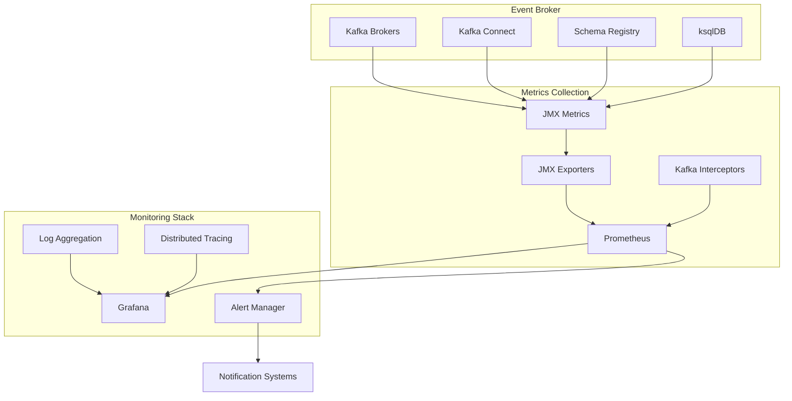

# Monitoring

## Overview

Effective monitoring of the Event Broker is essential for maintaining reliable healthcare data exchange. This document covers the implementation of monitoring and observability for our Kafka-based Event Broker, focusing on metrics collection, alerting, and operational dashboards that ensure high availability and performance for critical healthcare workflows.

## Monitoring Architecture

The monitoring architecture combines several components to provide comprehensive visibility into the Event Broker:



## Key Metrics

### Broker Metrics

Kafka brokers expose critical metrics through JMX:

| Metric | Description | Threshold | Impact |
|--------|-------------|-----------|--------|
| `kafka.server:type=BrokerTopicMetrics,name=MessagesInPerSec` | Message ingestion rate | Varies by topic | High values indicate high load |
| `kafka.server:type=BrokerTopicMetrics,name=BytesInPerSec` | Bytes ingestion rate | >80% of network capacity | Network saturation |
| `kafka.server:type=BrokerTopicMetrics,name=BytesOutPerSec` | Bytes output rate | >80% of network capacity | Network saturation |
| `kafka.server:type=ReplicaManager,name=UnderReplicatedPartitions` | Partitions with insufficient replicas | >0 | Data durability risk |
| `kafka.controller:type=KafkaController,name=OfflinePartitionsCount` | Partitions without active leader | >0 | Data availability impact |
| `kafka.server:type=ReplicaManager,name=IsrShrinksPerSec` | Rate of replicas leaving ISR | >0 | Replication issues |
| `kafka.server:type=ReplicaManager,name=IsrExpandsPerSec` | Rate of replicas joining ISR | Monitor for recovery | Replication healing |

### Consumer Group Metrics

Consumer lag is a critical metric for healthcare event processing:

| Metric | Description | Threshold | Impact |
|--------|-------------|-----------|--------|
| `kafka.consumer.group:type=ConsumerLagMetrics,name=MaxLag` | Maximum lag in messages | Varies by topic | Processing delay |
| `kafka.consumer.group:type=ConsumerLagMetrics,name=MaxLagInSeconds` | Maximum lag in seconds | >30s for critical workflows | SLA violations |
| `kafka.consumer.group:type=ConsumerLagMetrics,name=TotalLag` | Total lag across all partitions | Trend analysis | Capacity planning |

### Topic Metrics

Topic-specific metrics help monitor healthcare data flows:

| Metric | Description | Threshold | Impact |
|--------|-------------|-----------|--------|
| `kafka.server:type=BrokerTopicMetrics,name=MessagesInPerSec,topic=clinical.patient.admitted` | Message rate for specific topic | Baseline deviation | Anomaly detection |
| `kafka.server:type=BrokerTopicMetrics,name=BytesInPerSec,topic=clinical.patient.admitted` | Byte rate for specific topic | Baseline deviation | Data volume anomalies |
| `kafka.server:type=BrokerTopicMetrics,name=TotalProduceRequestsPerSec,topic=clinical.patient.admitted` | Producer request rate | Baseline deviation | Producer activity |

### JVM Metrics

JVM health is important for all Kafka components:

| Metric | Description | Threshold | Impact |
|--------|-------------|-----------|--------|
| `java.lang:type=Memory,name=HeapMemoryUsage` | JVM heap usage | >80% | GC pressure, performance |
| `java.lang:type=GarbageCollector,name=G1OldGeneration` | GC time and count | >5% CPU time | Application pauses |
| `java.lang:type=Threading,name=ThreadCount` | Active threads | >200 per broker | Thread exhaustion risk |

## Prometheus Configuration

Prometheus is used to scrape and store metrics from Kafka components:

```yaml
global:
  scrape_interval: 15s
  evaluation_interval: 15s

scrape_configs:
  - job_name: 'kafka_brokers'
    static_configs:
      - targets: ['kafka-broker-1:9090', 'kafka-broker-2:9090', 'kafka-broker-3:9090']
    relabel_configs:
      - source_labels: [__address__]
        target_label: instance
        regex: '(.*):\d+'
        replacement: '$1'

  - job_name: 'kafka_connect'
    static_configs:
      - targets: ['connect-1:9090', 'connect-2:9090', 'connect-3:9090']

  - job_name: 'schema_registry'
    static_configs:
      - targets: ['schema-registry-1:9090', 'schema-registry-2:9090']

  - job_name: 'ksqldb'
    static_configs:
      - targets: ['ksqldb-1:9090', 'ksqldb-2:9090']
```

### JMX Exporter Configuration

The JMX Exporter extracts JMX metrics from Kafka components:

```yaml
rules:
  # Kafka Broker Metrics
  - pattern: kafka.server<type=BrokerTopicMetrics, name=(.+)><>OneMinuteRate
    name: kafka_server_broker_topic_metrics_$1_one_minute_rate
    type: GAUGE
    labels:
      broker_id: "$2"
  
  # Kafka Under-replicated Partitions
  - pattern: kafka.server<type=ReplicaManager, name=UnderReplicatedPartitions><>Value
    name: kafka_server_replica_manager_under_replicated_partitions
    type: GAUGE
  
  # Kafka Controller Metrics
  - pattern: kafka.controller<type=KafkaController, name=(.+)><>Value
    name: kafka_controller_$1
    type: GAUGE
  
  # JVM Metrics
  - pattern: java.lang<type=Memory><HeapMemoryUsage>(.+)
    name: jvm_memory_heap_$1
    type: GAUGE
  
  - pattern: java.lang<type=GarbageCollector, name=(.+)><>CollectionCount
    name: jvm_gc_collection_count
    type: COUNTER
    labels:
      gc: "$1"
  
  - pattern: java.lang<type=GarbageCollector, name=(.+)><>CollectionTime
    name: jvm_gc_collection_time_seconds
    type: COUNTER
    labels:
      gc: "$1"
```

## Grafana Dashboards

### Kafka Cluster Overview

The Kafka Cluster Overview dashboard provides a high-level view of the entire Event Broker:

```json
{
  "dashboard": {
    "id": null,
    "title": "Kafka Cluster Overview",
    "tags": ["kafka", "event-broker"],
    "timezone": "browser",
    "panels": [
      {
        "title": "Broker CPU Usage",
        "type": "graph",
        "datasource": "Prometheus",
        "targets": [
          {
            "expr": "rate(process_cpu_seconds_total{job=\"kafka_brokers\"}[1m])",
            "legendFormat": "{{instance}}"
          }
        ]
      },
      {
        "title": "Broker Memory Usage",
        "type": "graph",
        "datasource": "Prometheus",
        "targets": [
          {
            "expr": "jvm_memory_heap_used{job=\"kafka_brokers\"} / jvm_memory_heap_max{job=\"kafka_brokers\"} * 100",
            "legendFormat": "{{instance}}"
          }
        ]
      },
      {
        "title": "Messages In Per Second",
        "type": "graph",
        "datasource": "Prometheus",
        "targets": [
          {
            "expr": "sum(rate(kafka_server_broker_topic_metrics_messages_in_one_minute_rate[1m])) by (instance)",
            "legendFormat": "{{instance}}"
          }
        ]
      },
      {
        "title": "Under-Replicated Partitions",
        "type": "stat",
        "datasource": "Prometheus",
        "targets": [
          {
            "expr": "sum(kafka_server_replica_manager_under_replicated_partitions)",
            "legendFormat": ""
          }
        ],
        "options": {
          "colorMode": "value",
          "graphMode": "area",
          "justifyMode": "auto",
          "orientation": "auto",
          "reduceOptions": {
            "calcs": ["lastNotNull"],
            "fields": "",
            "values": false
          },
          "textMode": "auto"
        },
        "fieldConfig": {
          "defaults": {
            "mappings": [],
            "thresholds": {
              "mode": "absolute",
              "steps": [
                { "color": "green", "value": null },
                { "color": "red", "value": 1 }
              ]
            }
          }
        }
      }
    ]
  }
}
```

### Healthcare Topic Monitoring

The Healthcare Topic Monitoring dashboard focuses on healthcare-specific topics:

```json
{
  "dashboard": {
    "id": null,
    "title": "Healthcare Topic Monitoring",
    "tags": ["kafka", "healthcare"],
    "timezone": "browser",
    "panels": [
      {
        "title": "Clinical Events Rate",
        "type": "graph",
        "datasource": "Prometheus",
        "targets": [
          {
            "expr": "sum(rate(kafka_server_broker_topic_metrics_messages_in_one_minute_rate{topic=~\"clinical.*\"}[1m])) by (topic)",
            "legendFormat": "{{topic}}"
          }
        ]
      },
      {
        "title": "Administrative Events Rate",
        "type": "graph",
        "datasource": "Prometheus",
        "targets": [
          {
            "expr": "sum(rate(kafka_server_broker_topic_metrics_messages_in_one_minute_rate{topic=~\"administrative.*\"}[1m])) by (topic)",
            "legendFormat": "{{topic}}"
          }
        ]
      },
      {
        "title": "Financial Events Rate",
        "type": "graph",
        "datasource": "Prometheus",
        "targets": [
          {
            "expr": "sum(rate(kafka_server_broker_topic_metrics_messages_in_one_minute_rate{topic=~\"financial.*\"}[1m])) by (topic)",
            "legendFormat": "{{topic}}"
          }
        ]
      },
      {
        "title": "Critical Topic Lag",
        "type": "graph",
        "datasource": "Prometheus",
        "targets": [
          {
            "expr": "kafka_consumer_group_max_lag{group=~\"critical-.*\"}",
            "legendFormat": "{{group}} - {{topic}}"
          }
        ]
      }
    ]
  }
}
```

### Consumer Lag Monitoring

The Consumer Lag dashboard focuses on monitoring processing delays:

```json
{
  "dashboard": {
    "id": null,
    "title": "Consumer Lag Monitoring",
    "tags": ["kafka", "consumer"],
    "timezone": "browser",
    "panels": [
      {
        "title": "Max Lag by Consumer Group",
        "type": "graph",
        "datasource": "Prometheus",
        "targets": [
          {
            "expr": "kafka_consumer_group_max_lag",
            "legendFormat": "{{group}}"
          }
        ]
      },
      {
        "title": "Lag in Seconds by Consumer Group",
        "type": "graph",
        "datasource": "Prometheus",
        "targets": [
          {
            "expr": "kafka_consumer_group_max_lag_seconds",
            "legendFormat": "{{group}}"
          }
        ]
      },
      {
        "title": "Lag by Partition",
        "type": "graph",
        "datasource": "Prometheus",
        "targets": [
          {
            "expr": "kafka_consumer_group_partition_lag{group=~\"$group\", topic=~\"$topic\"}",
            "legendFormat": "{{topic}}-{{partition}}"
          }
        ]
      },
      {
        "title": "Consumer Throughput",
        "type": "graph",
        "datasource": "Prometheus",
        "targets": [
          {
            "expr": "rate(kafka_consumer_group_consumed_messages_total{group=~\"$group\"}[1m])",
            "legendFormat": "{{group}}"
          }
        ]
      }
    ],
    "templating": {
      "list": [
        {
          "name": "group",
          "type": "query",
          "datasource": "Prometheus",
          "query": "label_values(kafka_consumer_group_max_lag, group)"
        },
        {
          "name": "topic",
          "type": "query",
          "datasource": "Prometheus",
          "query": "label_values(kafka_consumer_group_partition_lag{group=\"$group\"}, topic)"
        }
      ]
    }
  }
}
```

## Alerting

### Prometheus Alert Rules

Prometheus AlertManager is configured with healthcare-specific alert rules:

```yaml
groups:
- name: kafka_alerts
  rules:
  - alert: KafkaBrokerDown
    expr: up{job="kafka_brokers"} == 0
    for: 1m
    labels:
      severity: critical
      domain: infrastructure
    annotations:
      summary: "Kafka broker down ({{ $labels.instance }})"
      description: "Kafka broker {{ $labels.instance }} is down for more than 1 minute."

  - alert: KafkaUnderReplicatedPartitions
    expr: kafka_server_replica_manager_under_replicated_partitions > 0
    for: 5m
    labels:
      severity: warning
      domain: infrastructure
    annotations:
      summary: "Kafka under-replicated partitions ({{ $labels.instance }})"
      description: "Broker {{ $labels.instance }} has {{ $value }} under-replicated partitions for more than 5 minutes."

  - alert: KafkaOfflinePartitions
    expr: kafka_controller_offline_partitions_count > 0
    for: 1m
    labels:
      severity: critical
      domain: infrastructure
    annotations:
      summary: "Kafka offline partitions"
      description: "Kafka has {{ $value }} offline partitions for more than 1 minute."

  - alert: KafkaHighConsumerLag
    expr: kafka_consumer_group_max_lag > 10000
    for: 5m
    labels:
      severity: warning
      domain: application
    annotations:
      summary: "Kafka consumer lag ({{ $labels.group }})"
      description: "Consumer group {{ $labels.group }} has a lag of {{ $value }} messages for more than 5 minutes."

  - alert: KafkaCriticalConsumerLagTime
    expr: kafka_consumer_group_max_lag_seconds{group=~"critical-.*"} > 60
    for: 1m
    labels:
      severity: critical
      domain: application
    annotations:
      summary: "Critical consumer lag time ({{ $labels.group }})"
      description: "Critical consumer group {{ $labels.group }} has a lag of {{ $value }} seconds for more than 1 minute."

  - alert: KafkaHighCpuUsage
    expr: rate(process_cpu_seconds_total{job="kafka_brokers"}[1m]) * 100 > 80
    for: 5m
    labels:
      severity: warning
      domain: infrastructure
    annotations:
      summary: "Kafka high CPU usage ({{ $labels.instance }})"
      description: "Kafka broker {{ $labels.instance }} has CPU usage of {{ $value }}% for more than 5 minutes."

  - alert: KafkaHighMemoryUsage
    expr: jvm_memory_heap_used{job="kafka_brokers"} / jvm_memory_heap_max{job="kafka_brokers"} * 100 > 85
    for: 5m
    labels:
      severity: warning
      domain: infrastructure
    annotations:
      summary: "Kafka high memory usage ({{ $labels.instance }})"
      description: "Kafka broker {{ $labels.instance }} has memory usage of {{ $value }}% for more than 5 minutes."

  - alert: KafkaClinicalTopicInactivity
    expr: rate(kafka_server_broker_topic_metrics_messages_in_one_minute_rate{topic=~"clinical.*"}[5m]) == 0
    for: 15m
    labels:
      severity: warning
      domain: healthcare
    annotations:
      summary: "Clinical topic inactivity ({{ $labels.topic }})"
      description: "Clinical topic {{ $labels.topic }} has no messages for more than 15 minutes during business hours."
```

### Alert Notification Channels

Alerts are routed to appropriate channels based on severity and domain:

```yaml
route:
  group_by: ['alertname', 'domain']
  group_wait: 30s
  group_interval: 5m
  repeat_interval: 4h
  receiver: 'default'
  routes:
  - match:
      severity: critical
    receiver: 'pagerduty'
  - match:
      domain: healthcare
      severity: critical
    receiver: 'healthcare-oncall'
  - match:
      domain: infrastructure
    receiver: 'infrastructure-team'

receivers:
- name: 'default'
  email_configs:
  - to: 'kafka-alerts@healthcare.internal'

- name: 'pagerduty'
  pagerduty_configs:
  - service_key: '<pagerduty-service-key>'

- name: 'healthcare-oncall'
  pagerduty_configs:
  - service_key: '<healthcare-pagerduty-key>'
  slack_configs:
  - channel: '#healthcare-alerts'
    send_resolved: true

- name: 'infrastructure-team'
  slack_configs:
  - channel: '#kafka-alerts'
    send_resolved: true
```

## Log Monitoring

### Log Collection

Kafka logs are collected and centralized for analysis:

```yaml
# Filebeat configuration for Kafka logs
filebeat.inputs:
- type: log
  enabled: true
  paths:
    - /var/log/kafka/server.log
    - /var/log/kafka/controller.log
    - /var/log/kafka/state-change.log
  fields:
    component: kafka-broker
    environment: production
  multiline:
    pattern: '^\['  # Log lines start with a timestamp in brackets
    negate: true
    match: after

- type: log
  enabled: true
  paths:
    - /var/log/kafka-connect/connect.log
  fields:
    component: kafka-connect
    environment: production

- type: log
  enabled: true
  paths:
    - /var/log/schema-registry/schema-registry.log
  fields:
    component: schema-registry
    environment: production

output.elasticsearch:
  hosts: ["elasticsearch.healthcare.internal:9200"]
  index: "kafka-logs-%{+yyyy.MM.dd}"
  username: "${ELASTICSEARCH_USERNAME}"
  password: "${ELASTICSEARCH_PASSWORD}"
```

### Log Analysis

Key log patterns to monitor for healthcare event processing:

| Component | Log Pattern | Severity | Action |
|-----------|------------|----------|--------|
| Broker | `ERROR Error processing request` | High | Investigate client issues |
| Broker | `WARN Disk usage exceeded` | Medium | Plan capacity increase |
| Broker | `ERROR Error while processing LeaderAndIsr` | High | Check ZooKeeper connectivity |
| Connect | `ERROR WorkerSourceTask{id=X} Task threw an uncaught exception` | High | Check source system connectivity |
| Connect | `ERROR WorkerSinkTask{id=X} Task threw an uncaught exception` | High | Check destination system |
| Schema Registry | `ERROR Error registering schema` | High | Validate schema compatibility |

## Operational Procedures

### Health Checks

Regular health checks ensure the Event Broker is functioning properly:

```bash
#!/bin/bash
# Kafka Broker Health Check

# Check if broker is up
BROKER_HOST="kafka-broker-1:9092"
if ! timeout 5 bash -c "</dev/tcp/${BROKER_HOST//:*/}/${BROKER_HOST//*:/}"; then
  echo "ERROR: Broker ${BROKER_HOST} is not reachable"
  exit 1
fi

# Check if broker can be described
if ! kafka-broker-api-versions --bootstrap-server $BROKER_HOST --command-config /etc/kafka/client.properties > /dev/null 2>&1; then
  echo "ERROR: Cannot describe broker ${BROKER_HOST}"
  exit 1
fi

# Check for under-replicated partitions
UNDER_REPLICATED=$(kafka-topics --bootstrap-server $BROKER_HOST --describe --under-replicated --command-config /etc/kafka/client.properties | wc -l)
if [ $UNDER_REPLICATED -gt 0 ]; then
  echo "WARNING: ${UNDER_REPLICATED} under-replicated partitions"
fi

# Check for offline partitions
OFFLINE=$(kafka-topics --bootstrap-server $BROKER_HOST --describe --unavailable --command-config /etc/kafka/client.properties | wc -l)
if [ $OFFLINE -gt 0 ]; then
  echo "ERROR: ${OFFLINE} offline partitions"
  exit 1
fi

echo "Broker ${BROKER_HOST} is healthy"
exit 0
```

### Capacity Planning

Key metrics for capacity planning:

| Metric | Threshold | Action |
|--------|-----------|--------|
| CPU Usage | >70% sustained | Add brokers or upgrade |
| Memory Usage | >80% sustained | Add memory or brokers |
| Disk Usage | >70% capacity | Add storage |
| Network In/Out | >70% capacity | Upgrade network |
| Message Rate | >80% of benchmark | Scale horizontally |

### Performance Tuning

Common performance tuning parameters for healthcare workloads:

```properties
# Broker performance tuning
num.network.threads=8
num.io.threads=16
socket.send.buffer.bytes=1048576
socket.receive.buffer.bytes=1048576
socket.request.max.bytes=104857600
log.flush.interval.messages=10000
log.flush.interval.ms=1000
log.retention.hours=168
log.segment.bytes=1073741824
log.cleaner.enable=true

# Topic-specific tuning for high-volume healthcare data
clinical.observation.recorded.retention.ms=604800000  # 7 days
clinical.observation.recorded.cleanup.policy=delete
clinical.observation.recorded.min.insync.replicas=2

# Reference data topics with compaction
reference.provider.details.cleanup.policy=compact
reference.provider.details.min.cleanable.dirty.ratio=0.5
reference.provider.details.delete.retention.ms=86400000  # 1 day
```

## Related Documentation

- [Event Schemas](event-schemas.md): Defining the structure of events
- [Topic Design](topic-design.md): Designing effective Kafka topics
- [Connectors](connectors.md): Integrating with healthcare systems
- [Stream Processing](../03-advanced-patterns/stream-processing.md): Processing events in real-time
