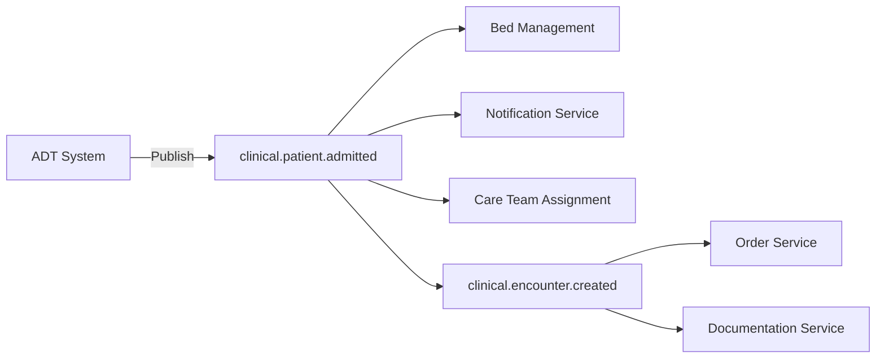
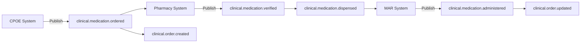

# Topic Design

## Overview

Kafka topics are the fundamental organizational units in the Event Broker, serving as named channels for publishing and subscribing to events. Well-designed topics are crucial for scalability, performance, and data governance in healthcare event-driven architectures. This document covers topic design principles, naming conventions, partitioning strategies, and healthcare-specific considerations for the Event Broker.

## Topic Design Fundamentals

Topics in Kafka provide logical separation of event streams and enable parallel processing through partitioning. Key considerations in topic design include:

- **Event Categorization**: How to group related healthcare events
- **Partitioning Strategy**: How to distribute events across partitions
- **Retention Policy**: How long to retain healthcare events
- **Access Control**: Who can publish to and subscribe from topics
- **Scalability**: How topics will grow over time

## Topic Naming Conventions

Consistent topic naming is essential for discoverability, governance, and automation. Our naming convention follows this pattern:

```
<domain>.<entity>.<event-type>
```

Where:
- **domain**: The business domain (e.g., clinical, administrative, financial)
- **entity**: The primary entity involved (e.g., patient, encounter, claim)
- **event-type**: The type of event that occurred (e.g., created, updated, admitted)

### Healthcare Domain Examples

| Domain | Description | Example Topics |
|--------|-------------|----------------|
| clinical | Clinical care events | clinical.patient.admitted<br>clinical.order.created<br>clinical.result.available |
| administrative | Administrative events | administrative.appointment.scheduled<br>administrative.referral.created |
| financial | Financial events | financial.claim.submitted<br>financial.payment.received |
| pharmacy | Pharmacy events | pharmacy.prescription.filled<br>pharmacy.inventory.updated |
| device | Medical device events | device.reading.recorded<br>device.alert.triggered |

### Naming Best Practices

1. **Use Lowercase**: All topic names should be lowercase
2. **Use Dots as Separators**: Separate hierarchy levels with dots
3. **Use Hyphens for Multi-Word Components**: For multi-word components, use hyphens (e.g., `patient-portal.user.logged-in`)
4. **Be Specific**: Avoid generic event types like "changed" or "processed"
5. **Be Consistent**: Apply naming conventions consistently across all topics

## Topic Partitioning

Partitioning enables parallel processing and horizontal scalability. The number of partitions determines the maximum parallelism for consuming events from a topic.

### Partitioning Strategies

#### Key-Based Partitioning

Most healthcare events should use key-based partitioning to ensure related events are processed in order:

```java
// Example: Using patientId as the partition key
String patientId = "12345";
ProducerRecord<String, PatientEvent> record = 
    new ProducerRecord<>("clinical.patient.updated", patientId, patientEvent);
```

**Common Healthcare Partition Keys:**

| Event Type | Recommended Partition Key | Rationale |
|------------|---------------------------|------------|
| Patient Events | patientId | Ensures all events for a patient are ordered |
| Encounter Events | encounterId | Maintains order of events within an encounter |
| Order Events | orderId | Preserves order status progression |
| Claim Events | claimId | Maintains claim processing sequence |
| Device Events | deviceId | Groups events from the same device |

#### Partition Sizing

Determining the optimal number of partitions depends on several factors:

1. **Throughput Requirements**: Higher throughput needs more partitions
2. **Consumer Parallelism**: Maximum number of consumers in a group
3. **Retention Size**: Larger retention requires more partitions
4. **Message Size**: Larger messages may need more partitions

**Healthcare-Specific Guidelines:**

| Topic Category | Partition Range | Considerations |
|----------------|-----------------|----------------|
| High-Volume Clinical | 24-48 | ADT feeds, vitals, observations |
| Standard Clinical | 12-24 | Orders, results, notes |
| Administrative | 6-12 | Appointments, registrations |
| Audit/Logging | 24-48 | High volume but less critical ordering |

```bash
# Create a high-volume clinical topic with 32 partitions
kafka-topics --bootstrap-server kafka-broker-1:9092 \
  --create --topic clinical.observation.recorded \
  --partitions 32 --replication-factor 3 \
  --config retention.ms=2592000000 \
  --config cleanup.policy=delete
```

## Topic Configuration

Kafka topics can be configured with various settings to optimize for healthcare use cases.

### Retention Configuration

Retention policies determine how long events are stored in Kafka:

```bash
# Set retention for a topic (7 days)
kafka-configs --bootstrap-server kafka-broker-1:9092 \
  --alter --entity-type topics --entity-name clinical.patient.admitted \
  --add-config retention.ms=604800000
```

**Healthcare Retention Guidelines:**

| Data Category | Recommended Retention | Considerations |
|---------------|----------------------|----------------|
| PHI/Clinical | 30-90 days | Balance availability with compliance |
| Operational | 7-30 days | System status, non-PHI events |
| Audit | 1 year+ | Compliance and investigation needs |
| Derived/Analytics | 1-7 days | Often recomputed from source events |

### Compaction Policy

For certain healthcare reference data, compaction is preferable to time-based deletion:

```bash
# Configure a topic for compaction
kafka-configs --bootstrap-server kafka-broker-1:9092 \
  --alter --entity-type topics --entity-name reference.provider.details \
  --add-config cleanup.policy=compact \
  --add-config min.cleanable.dirty.ratio=0.5 \
  --add-config delete.retention.ms=86400000
```

**Compaction Use Cases in Healthcare:**

- Provider directories
- Facility information
- Insurance plan details
- Formulary data
- Patient preferences

### Replication Factor

Replication ensures fault tolerance and data durability:

```bash
# Set replication factor for a topic
kafka-topics --bootstrap-server kafka-broker-1:9092 \
  --alter --topic clinical.patient.admitted \
  --partitions 24 --replication-factor 3
```

**Healthcare Replication Guidelines:**

| Environment | Recommended Replication Factor | Rationale |
|-------------|--------------------------------|------------|
| Production | 3 | High availability for critical healthcare data |
| Staging | 2-3 | Balance between reliability and resource usage |
| Development | 1-2 | Reduced resource requirements |

## Topic Patterns

Certain topic design patterns are particularly useful in healthcare scenarios.

### Event Sourcing Pattern

Event sourcing captures all changes to application state as a sequence of events:

```
clinical.patient.events
```

This topic would contain all events related to patients, with the event type specified in the message payload.

**Benefits for Healthcare:**
- Complete audit trail of all patient changes
- Ability to reconstruct patient state at any point in time
- Support for temporal queries (e.g., patient state during an encounter)

### Command-Query Responsibility Segregation (CQRS)

CQRS separates command (write) and query (read) operations:

```
clinical.order.commands
clinical.order.events
clinical.order.state
```

**Benefits for Healthcare:**
- Optimized performance for read-heavy clinical applications
- Simplified complex clinical workflows
- Ability to scale command and query sides independently

### Dead Letter Queue Pattern

Dead letter queues handle messages that cannot be processed:

```
clinical.patient.admitted.dlq
```

**Benefits for Healthcare:**
- Prevents data loss for critical healthcare events
- Enables offline analysis of processing failures
- Supports reprocessing after fixes are implemented

## Healthcare Topic Hierarchies

### Clinical Domain

```
clinical.patient.registered
clinical.patient.updated
clinical.patient.merged

clinical.encounter.created
clinical.encounter.updated
clinical.encounter.closed

clinical.observation.recorded
clinical.observation.updated
clinical.observation.deleted

clinical.order.created
clinical.order.updated
clinical.order.resulted
clinical.order.canceled

clinical.medication.ordered
clinical.medication.dispensed
clinical.medication.administered

clinical.allergy.recorded
clinical.allergy.updated

clinical.diagnosis.recorded
clinical.diagnosis.updated
```

### Administrative Domain

```
administrative.appointment.scheduled
administrative.appointment.rescheduled
administrative.appointment.canceled
administrative.appointment.completed

administrative.referral.created
administrative.referral.accepted
administrative.referral.rejected
administrative.referral.completed

administrative.consent.recorded
administrative.consent.revoked

administrative.document.created
administrative.document.signed
```

### Financial Domain

```
financial.coverage.verified
financial.coverage.updated

financial.authorization.requested
financial.authorization.approved
financial.authorization.denied

financial.claim.submitted
financial.claim.adjudicated
financial.claim.denied
financial.claim.appealed

financial.payment.received
financial.payment.applied
financial.payment.refunded
```

### Pharmacy Domain

```
pharmacy.prescription.received
pharmacy.prescription.verified
pharmacy.prescription.filled
pharmacy.prescription.dispensed

pharmacy.inventory.updated
pharmacy.inventory.depleted
pharmacy.inventory.restocked
```

### Device Domain

```
device.reading.recorded
device.status.updated
device.alert.triggered
device.maintenance.scheduled
device.maintenance.completed
```

## Topic Access Control

Securing topics is critical for healthcare data protection. Kafka ACLs (Access Control Lists) provide fine-grained security:

```bash
# Grant read access to a consumer group for a clinical topic
kafka-acls --bootstrap-server kafka-broker-1:9092 \
  --add --allow-principal User:clinical-service \
  --consumer --group clinical-processors \
  --topic clinical.patient.admitted

# Grant write access to a producer for a clinical topic
kafka-acls --bootstrap-server kafka-broker-1:9092 \
  --add --allow-principal User:admission-service \
  --producer --topic clinical.patient.admitted
```

### Role-Based Access Control

| Role | Access Pattern | Example |
|------|---------------|----------|
| Clinical Service | Read/Write clinical domain | clinical.* |
| Billing Service | Read clinical, Read/Write financial | clinical.\*, financial.* |
| Audit Service | Read all domains | *.* |
| Patient Portal | Read/Write patient-specific topics | patient-portal.* |

## Topic Monitoring

Monitoring topic health is essential for healthcare systems where data timeliness is critical:

```bash
# Check consumer lag for a clinical topic
kafka-consumer-groups --bootstrap-server kafka-broker-1:9092 \
  --describe --group clinical-processors
```

### Key Metrics to Monitor

| Metric | Description | Alert Threshold |
|--------|-------------|----------------|
| Consumer Lag | Messages waiting to be processed | >1000 messages or >30 seconds |
| Producer Throughput | Messages/second being published | Sustained >80% of capacity |
| Topic Size | Disk space used by topic | >80% of allocated space |
| Partition Count | Number of partitions | N/A (monitoring for changes) |
| Replication Lag | Delay in replica synchronization | >10 seconds |

## Topic Lifecycle Management

### Topic Creation

Topics should be created through an automated, governed process:

```bash
# Create a new clinical topic
kafka-topics --bootstrap-server kafka-broker-1:9092 \
  --create --topic clinical.procedure.completed \
  --partitions 24 --replication-factor 3 \
  --config retention.ms=2592000000
```

### Topic Evolution

As healthcare workflows evolve, topic configurations may need updates:

```bash
# Increase partitions for a growing topic
kafka-topics --bootstrap-server kafka-broker-1:9092 \
  --alter --topic clinical.observation.recorded \
  --partitions 48
```

### Topic Deprecation

When topics are no longer needed, follow a structured deprecation process:

1. **Mark as Deprecated**: Document in the topic registry
2. **Redirect Producers**: Move producers to the new topic
3. **Drain Consumers**: Ensure all consumers have processed messages
4. **Archive Data**: If required for compliance
5. **Delete Topic**: Remove when safe

```bash
# Delete a deprecated topic
kafka-topics --bootstrap-server kafka-broker-1:9092 \
  --delete --topic legacy.patient.events
```

## Healthcare Topic Examples

### Patient Admission Flow



### Medication Order Flow



## Related Documentation

- [Event Schemas](event-schemas.md): Defining the structure of events
- [Connectors](connectors.md): Integrating with healthcare systems
- [Stream Processing](../03-advanced-patterns/stream-processing.md): Processing events in real-time
- [Event Sourcing](../03-advanced-patterns/event-sourcing.md): Using events as the system of record
