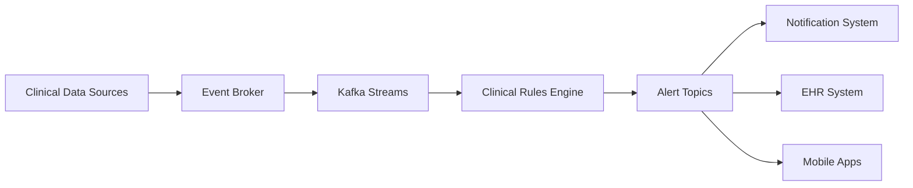
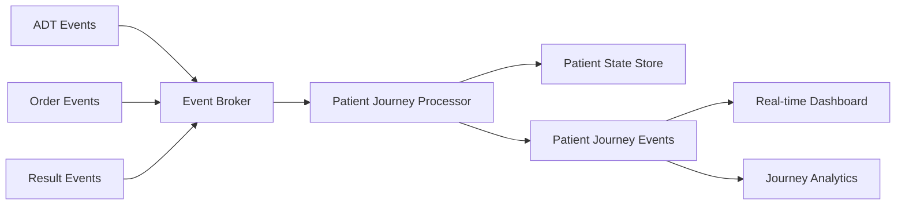
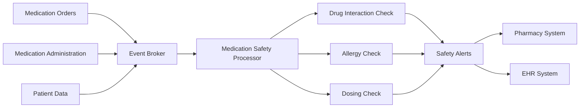
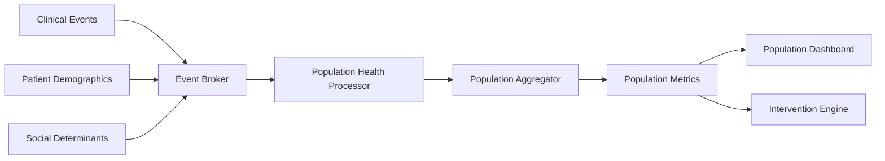

# Event Broker Advanced Use Cases

## Introduction

This document explores advanced use cases for the Event Broker component within the CMM Technology Platform. These use cases demonstrate how event-driven architecture can address complex healthcare scenarios, enabling real-time data flow, process automation, and advanced analytics. Each use case includes implementation patterns, code examples, and healthcare-specific considerations.

## Clinical Alerting System

### Overview

A real-time clinical alerting system that monitors patient data streams and generates alerts based on clinical rules.

### Implementation Pattern



### Code Example

```typescript
// Import required libraries
import { KafkaStreams, KStream, StreamsConfig } from '@confluentinc/kafka-streams-js';
import { SchemaRegistry } from '@confluentinc/schema-registry';
import { v4 as uuidv4 } from 'uuid';

// Define interfaces for our domain models
interface VitalSign {
  patientId: string;
  type: string;
  value: number;
  unit: string;
  timestamp: number;
}

enum AlertSeverity {
  CRITICAL = 'CRITICAL',
  WARNING = 'WARNING',
  INFO = 'INFO'
}

interface ClinicalAlert {
  id: string;
  patientId: string;
  severity: AlertSeverity;
  message: string;
  vitalType: string;
  vitalValue: number;
  vitalUnit: string;
  timestamp: number;
}

// Configure Confluent Cloud Kafka Streams
const streamsConfig = {
  'application.id': 'clinical-alerting-system',
  'bootstrap.servers': 'kafka-broker:9092',
  
  // Confluent Cloud authentication
  'sasl.mechanism': 'PLAIN',
  'security.protocol': 'SASL_SSL',
  'sasl.username': '${CONFLUENT_CLOUD_KEY}',
  'sasl.password': '${CONFLUENT_CLOUD_SECRET}',
  
  // Schema Registry configuration
  'schema.registry.url': 'https://schema-registry.confluent.cloud',
  'basic.auth.credentials.source': 'USER_INFO',
  'basic.auth.user.info': '${SCHEMA_REGISTRY_KEY}:${SCHEMA_REGISTRY_SECRET}',
  
  // Confluent Cloud optimizations
  'processing.guarantee': 'exactly_once_v2', // Exactly-once processing (Confluent feature)
  'num.stream.threads': 4,
  'cache.max.bytes.buffering': 10485760, // 10MB cache
  
  // Confluent Monitoring and Metrics
  'confluent.monitoring.interceptor.bootstrap.servers': 'kafka-broker:9092',
  'confluent.monitoring.interceptor.security.protocol': 'SASL_SSL',
  'confluent.monitoring.interceptor.sasl.mechanism': 'PLAIN',
  'confluent.monitoring.interceptor.sasl.jaas.config': 
    'org.apache.kafka.common.security.plain.PlainLoginModule required ' +
    `username="${CONFLUENT_CLOUD_KEY}" password="${CONFLUENT_CLOUD_SECRET}";`
};

// Create Schema Registry client for Confluent Cloud
const schemaRegistry = new SchemaRegistry({
  baseUrl: 'https://schema-registry.confluent.cloud',
  auth: {
    username: '${SCHEMA_REGISTRY_KEY}',
    password: '${SCHEMA_REGISTRY_SECRET}'
  }
});

// Create and configure the Kafka Streams instance
const streams = new KafkaStreams(streamsConfig);

// Define the topology builder function
const buildTopology = () => {
  // Create the topology builder
  const builder = streams.getNewBuilder();
  
  // Consume vital signs from the topic with Schema Registry integration
  const vitalSigns: KStream<string, VitalSign> = builder.stream('clinical.vitals.recorded', {
    keySerde: streams.getSerdes().String,
    valueSerde: streams.getSerdes().Avro // Automatically uses Schema Registry
  });
  
  // Filter for abnormal vital signs
  const abnormalVitals = vitalSigns.filter((vital) => {
    // Check if vital sign is outside normal range
    switch (vital.type) {
      case 'heart_rate':
        return vital.value < 60 || vital.value > 100;
      case 'blood_pressure_systolic':
        return vital.value < 90 || vital.value > 140;
      case 'blood_pressure_diastolic':
        return vital.value < 60 || vital.value > 90;
      case 'temperature':
        return vital.value < 36.5 || vital.value > 38.0;
      case 'respiratory_rate':
        return vital.value < 12 || vital.value > 20;
      case 'oxygen_saturation':
        return vital.value < 95;
      default:
        return false;
    }
  });
  
  // Transform to clinical alerts
  const alerts = abnormalVitals.map<string, ClinicalAlert>((vital) => {
    // Determine alert severity
    let severity: AlertSeverity;
    let message: string;
    
    switch (vital.type) {
      case 'heart_rate':
        if (vital.value < 50 || vital.value > 120) {
          severity = AlertSeverity.CRITICAL;
          message = `Critical heart rate: ${vital.value.toFixed(1)} ${vital.unit}`;
        } else {
          severity = AlertSeverity.WARNING;
          message = `Abnormal heart rate: ${vital.value.toFixed(1)} ${vital.unit}`;
        }
        break;
      // Similar logic for other vital types
      default:
        severity = AlertSeverity.INFO;
        message = `Abnormal ${vital.type}: ${vital.value.toFixed(1)} ${vital.unit}`;
    }
    
    // Create the alert with additional metadata for tracing
    return {
      id: uuidv4(),
      patientId: vital.patientId,
      severity,
      message,
      vitalType: vital.type,
      vitalValue: vital.value,
      vitalUnit: vital.unit,
      timestamp: Date.now()
    };
  });
  
  // Branch alerts by severity using Confluent Cloud features
  const [criticalAlerts, warningAlerts, infoAlerts] = alerts.branch(
    (alert) => alert.severity === AlertSeverity.CRITICAL,
    (alert) => alert.severity === AlertSeverity.WARNING,
    (alert) => alert.severity === AlertSeverity.INFO
  );
  
  // Send alerts to appropriate topics with Schema Registry integration
  criticalAlerts.to('clinical.alerts.critical', {
    keySerde: streams.getSerdes().String,
    valueSerde: streams.getSerdes().Avro
  });
  
  warningAlerts.to('clinical.alerts.warning', {
    keySerde: streams.getSerdes().String,
    valueSerde: streams.getSerdes().Avro
  });
  
  infoAlerts.to('clinical.alerts.info', {
    keySerde: streams.getSerdes().String,
    valueSerde: streams.getSerdes().Avro
  });
  
  // Add Confluent Cloud Stream Monitoring
  // This sends operational metrics to Confluent Cloud for monitoring
  alerts.foreach((alert) => {
    // Log alert for monitoring
    console.log(`Alert generated: ${alert.severity} - ${alert.message} for patient ${alert.patientId}`);
  });
  
  return builder.build();
};

// Build the topology
const topology = buildTopology();

// Start the streams application with error handling
async function startStreams() {
  try {
    // Set the topology
    streams.setTopology(topology);
    
    // Start the streams with Confluent Cloud integration
    await streams.start();
    console.log('Clinical alerting system started successfully');
    
    // Add graceful shutdown
    process.on('SIGTERM', async () => {
      console.log('Shutting down clinical alerting system...');
      await streams.stop();
    });
  } catch (error) {
    console.error('Failed to start clinical alerting system:', error);
    
    // Implement dead letter queue for error handling (Confluent Cloud feature)
    await sendToDeadLetterQueue('clinical-alerting-system', 'startup-failure', error);
  }
}

// Helper function for error handling with Confluent Cloud
async function sendToDeadLetterQueue(source: string, operation: string, error: any) {
  try {
    // Create a producer for the dead letter queue
    const { Kafka } = require('kafkajs');
    const kafka = new Kafka({
      clientId: 'error-handler',
      brokers: ['kafka-broker:9092'],
      ssl: true,
      sasl: {
        mechanism: 'plain',
        username: '${CONFLUENT_CLOUD_KEY}',
        password: '${CONFLUENT_CLOUD_SECRET}'
      }
    });
    
    const producer = kafka.producer();
    await producer.connect();
    
    // Send error to dead letter queue
    await producer.send({
      topic: 'error.dead-letter-queue',
      messages: [
        {
          key: source,
          value: JSON.stringify({
            source,
            operation,
            error: error.message,
            stack: error.stack,
            timestamp: Date.now()
          })
        }
      ]
    });
    
    await producer.disconnect();
  } catch (dlqError) {
    console.error('Failed to send to dead letter queue:', dlqError);
  }
}

// Execute streams application
startStreams();
```

### Healthcare Considerations

- **Clinical Validation**: Alert rules must be validated by clinical experts
- **Alert Fatigue**: Implement strategies to prevent alert fatigue
- **Regulatory Compliance**: Ensure the system meets regulatory requirements for clinical decision support
- **Documentation**: Maintain documentation of alerting rules for audit purposes

## Patient Journey Tracking

### Overview

A system that tracks patient journeys across care settings, providing real-time visibility into patient flow and care coordination.

### Implementation Pattern



### Code Example

```typescript
// Import required libraries
import { KafkaStreams, KStream, StreamsConfig, KTable } from '@confluentinc/kafka-streams-js';
import { SchemaRegistry } from '@confluentinc/schema-registry';
import { v4 as uuidv4 } from 'uuid';

// Define interfaces for our domain models
interface Event {
  eventId: string;
  patientId: string;
  timestamp: number;
  eventType: string;
}

interface AdtEvent extends Event {
  encounterId: string;
  adtType: 'ADMISSION' | 'DISCHARGE' | 'TRANSFER';
  department?: string;
  bed?: string;
}

interface OrderEvent extends Event {
  encounterId: string;
  orderId: string;
  orderType: string;
  orderStatus: string;
  orderDetails: any;
}

interface ResultEvent extends Event {
  encounterId: string;
  resultId: string;
  orderId: string;
  resultType: string;
  resultStatus: string;
  resultDetails: any;
}

interface PatientState {
  patientId: string;
  currentEncounterId?: string;
  admissionTime?: number;
  currentDepartment?: string;
  currentBed?: string;
  activeOrders: Map<string, OrderEvent>;
  completedOrders: Map<string, OrderEvent>;
  results: Map<string, ResultEvent>;
  journeyEvents: Event[];
  lastUpdated: number;
}

interface PatientJourneyEvent extends Event {
  encounterId: string;
  journeyEventType: string;
  previousState?: string;
  newState?: string;
  details?: any;
}

// Configure Confluent Cloud Kafka Streams
const streamsConfig = {
  'application.id': 'patient-journey-tracker',
  'bootstrap.servers': 'kafka-broker:9092',
  
  // Confluent Cloud authentication
  'sasl.mechanism': 'PLAIN',
  'security.protocol': 'SASL_SSL',
  'sasl.username': '${CONFLUENT_CLOUD_KEY}',
  'sasl.password': '${CONFLUENT_CLOUD_SECRET}',
  
  // Schema Registry configuration
  'schema.registry.url': 'https://schema-registry.confluent.cloud',
  'basic.auth.credentials.source': 'USER_INFO',
  'basic.auth.user.info': '${SCHEMA_REGISTRY_KEY}:${SCHEMA_REGISTRY_SECRET}',
  
  // Confluent Cloud optimizations
  'processing.guarantee': 'exactly_once_v2', // Exactly-once processing (Confluent feature)
  'num.stream.threads': 6, // Increased for better parallelism
  'cache.max.bytes.buffering': 20971520, // 20MB cache for state stores
  
  // Confluent Monitoring and Metrics
  'confluent.monitoring.interceptor.bootstrap.servers': 'kafka-broker:9092',
  'confluent.monitoring.interceptor.security.protocol': 'SASL_SSL',
  'confluent.monitoring.interceptor.sasl.mechanism': 'PLAIN',
  'confluent.monitoring.interceptor.sasl.jaas.config': 
    'org.apache.kafka.common.security.plain.PlainLoginModule required ' +
    `username="${CONFLUENT_CLOUD_KEY}" password="${CONFLUENT_CLOUD_SECRET}";`
};

// Create Schema Registry client for Confluent Cloud
const schemaRegistry = new SchemaRegistry({
  baseUrl: 'https://schema-registry.confluent.cloud',
  auth: {
    username: '${SCHEMA_REGISTRY_KEY}',
    password: '${SCHEMA_REGISTRY_SECRET}'
  }
});

// Create and configure the Kafka Streams instance
const streams = new KafkaStreams(streamsConfig);

// Define the topology builder function
const buildTopology = () => {
  // Create the topology builder
  const builder = streams.getNewBuilder();
  
  // Create a patient state store with Confluent Cloud optimizations
  // This uses RocksDB for better performance and tiered storage
  builder.addStateStore({
    name: 'patient-state-store',
    persistent: true, // Use persistent storage (RocksDB)
    type: 'keyValueStore',
    keySerde: streams.getSerdes().String,
    valueSerde: streams.getSerdes().Json, // Custom JSON serde with Schema Registry
    logConfig: { // Confluent Cloud optimizations
      'retention.ms': 2592000000, // 30 days retention
      'segment.bytes': 104857600, // 100MB segments
      'cleanup.policy': 'compact,delete',
      'min.cleanable.dirty.ratio': 0.5
    }
  });
  
  // Process ADT events with Schema Registry integration
  const adtEvents: KStream<string, AdtEvent> = builder.stream('clinical.patient.adt', {
    keySerde: streams.getSerdes().String,
    valueSerde: streams.getSerdes().Avro // Automatically uses Schema Registry
  });
  
  // Update patient state based on ADT events
  const adtJourneyEvents = adtEvents.transform(
    () => new PatientStateUpdater('patient-state-store'),
    ['patient-state-store']
  );
  
  // Process order events with Schema Registry integration
  const orderEvents: KStream<string, OrderEvent> = builder.stream('clinical.orders.created', {
    keySerde: streams.getSerdes().String,
    valueSerde: streams.getSerdes().Avro
  });
  
  // Update patient state based on order events
  const orderJourneyEvents = orderEvents.transform(
    () => new PatientStateUpdater('patient-state-store'),
    ['patient-state-store']
  );
  
  // Process result events with Schema Registry integration
  const resultEvents: KStream<string, ResultEvent> = builder.stream('clinical.results.created', {
    keySerde: streams.getSerdes().String,
    valueSerde: streams.getSerdes().Avro
  });
  
  // Update patient state based on result events
  const resultJourneyEvents = resultEvents.transform(
    () => new PatientStateUpdater('patient-state-store'),
    ['patient-state-store']
  );
  
  // Merge all journey events
  const allJourneyEvents = adtJourneyEvents
    .merge(orderJourneyEvents)
    .merge(resultJourneyEvents);
  
  // Add Confluent Cloud Stream Monitoring
  allJourneyEvents.foreach((journeyEvent) => {
    // Log journey event for monitoring
    console.log(`Journey event: ${journeyEvent.journeyEventType} for patient ${journeyEvent.patientId}`);
  });
  
  // Publish journey events with Schema Registry integration
  allJourneyEvents.to('clinical.patient.journey', {
    keySerde: streams.getSerdes().String,
    valueSerde: streams.getSerdes().Avro
  });
  
  // Create a materialized view of patient journeys for analytics (Confluent feature)
  // This creates a KTable that can be queried via Confluent's REST API
  const patientJourneyView: KTable<string, PatientState> = builder.table(
    'clinical.patient.journey',
    {
      keySerde: streams.getSerdes().String,
      valueSerde: streams.getSerdes().Avro,
      materialized: {
        name: 'patient-journey-view',
        persistent: true,
        logConfig: {
          'retention.ms': 7776000000, // 90 days retention
          'cleanup.policy': 'compact'
        }
      }
    }
  );
  
  return builder.build();
};

// PatientStateUpdater implementation
class PatientStateUpdater {
  private stateStore: any;
  private storeName: string;
  
  constructor(storeName: string) {
    this.storeName = storeName;
  }
  
  // Initialize with processor context
  init(context: any) {
    this.stateStore = context.getStateStore(this.storeName);
  }
  
  // Transform events to journey events
  transform(patientId: string, event: Event) {
    // Get current patient state
    let state: PatientState = this.stateStore.get(patientId);
    if (!state) {
      state = {
        patientId,
        activeOrders: new Map(),
        completedOrders: new Map(),
        results: new Map(),
        journeyEvents: [],
        lastUpdated: Date.now()
      };
    }
    
    // Update state based on event type
    let journeyEvent: PatientJourneyEvent | null = null;
    
    if (event.eventType.startsWith('ADT_')) {
      journeyEvent = this.updateStateFromAdt(state, event as AdtEvent);
    } else if (event.eventType.startsWith('ORDER_')) {
      journeyEvent = this.updateStateFromOrder(state, event as OrderEvent);
    } else if (event.eventType.startsWith('RESULT_')) {
      journeyEvent = this.updateStateFromResult(state, event as ResultEvent);
    }
    
    // Add event to journey history
    state.journeyEvents.push(event);
    state.lastUpdated = Date.now();
    
    // Store updated state
    this.stateStore.put(patientId, state);
    
    return journeyEvent ? { key: patientId, value: journeyEvent } : null;
  }
  
  // Helper methods for state updates
  private updateStateFromAdt(state: PatientState, event: AdtEvent): PatientJourneyEvent | null {
    const previousState = JSON.stringify({
      department: state.currentDepartment,
      bed: state.currentBed
    });
    
    // Update state based on ADT type
    switch (event.adtType) {
      case 'ADMISSION':
        state.currentEncounterId = event.encounterId;
        state.admissionTime = event.timestamp;
        state.currentDepartment = event.department;
        state.currentBed = event.bed;
        break;
      case 'TRANSFER':
        state.currentDepartment = event.department;
        state.currentBed = event.bed;
        break;
      case 'DISCHARGE':
        state.currentEncounterId = undefined;
        state.currentDepartment = undefined;
        state.currentBed = undefined;
        break;
    }
    
    const newState = JSON.stringify({
      department: state.currentDepartment,
      bed: state.currentBed
    });
    
    // Create journey event
    return {
      eventId: uuidv4(),
      patientId: event.patientId,
      encounterId: event.encounterId,
      timestamp: event.timestamp,
      eventType: 'JOURNEY',
      journeyEventType: `PATIENT_${event.adtType}`,
      previousState,
      newState,
      details: {
        adtType: event.adtType,
        department: event.department,
        bed: event.bed
      }
    };
  }
  
  private updateStateFromOrder(state: PatientState, event: OrderEvent): PatientJourneyEvent | null {
    // Implementation details for order events
    // Store the order in active orders
    state.activeOrders.set(event.orderId, event);
    
    return {
      eventId: uuidv4(),
      patientId: event.patientId,
      encounterId: event.encounterId,
      timestamp: event.timestamp,
      eventType: 'JOURNEY',
      journeyEventType: 'ORDER_CREATED',
      details: {
        orderId: event.orderId,
        orderType: event.orderType,
        orderStatus: event.orderStatus
      }
    };
  }
  
  private updateStateFromResult(state: PatientState, event: ResultEvent): PatientJourneyEvent | null {
    // Implementation details for result events
    // Store the result and update the related order
    state.results.set(event.resultId, event);
    
    // If there's a related order, move it to completed orders
    if (state.activeOrders.has(event.orderId)) {
      const order = state.activeOrders.get(event.orderId);
      state.completedOrders.set(event.orderId, order!);
      state.activeOrders.delete(event.orderId);
    }
    
    return {
      eventId: uuidv4(),
      patientId: event.patientId,
      encounterId: event.encounterId,
      timestamp: event.timestamp,
      eventType: 'JOURNEY',
      journeyEventType: 'RESULT_RECEIVED',
      details: {
        resultId: event.resultId,
        orderId: event.orderId,
        resultType: event.resultType,
        resultStatus: event.resultStatus
      }
    };
  }
  
  // Cleanup resources
  close() {
    // No resources to clean up
  }
}

// Start the streams application with error handling
async function startStreams() {
  try {
    // Build the topology
    const topology = buildTopology();
    
    // Set the topology
    streams.setTopology(topology);
    
    // Start the streams with Confluent Cloud integration
    await streams.start();
    console.log('Patient journey tracking system started successfully');
    
    // Add graceful shutdown
    process.on('SIGTERM', async () => {
      console.log('Shutting down patient journey tracking system...');
      await streams.stop();
    });
  } catch (error) {
    console.error('Failed to start patient journey tracking system:', error);
    
    // Implement dead letter queue for error handling (Confluent Cloud feature)
    await sendToDeadLetterQueue('patient-journey-tracker', 'startup-failure', error);
  }
}

// Helper function for error handling with Confluent Cloud
async function sendToDeadLetterQueue(source: string, operation: string, error: any) {
  try {
    // Create a producer for the dead letter queue
    const { Kafka } = require('kafkajs');
    const kafka = new Kafka({
      clientId: 'error-handler',
      brokers: ['kafka-broker:9092'],
      ssl: true,
      sasl: {
        mechanism: 'plain',
        username: '${CONFLUENT_CLOUD_KEY}',
        password: '${CONFLUENT_CLOUD_SECRET}'
      }
    });
    
    const producer = kafka.producer();
    await producer.connect();
    
    // Send error to dead letter queue
    await producer.send({
      topic: 'error.dead-letter-queue',
      messages: [
        {
          key: source,
          value: JSON.stringify({
            source,
            operation,
            error: error.message,
            stack: error.stack,
            timestamp: Date.now()
          })
        }
      ]
    });
    
    await producer.disconnect();
  } catch (dlqError) {
    console.error('Failed to send to dead letter queue:', dlqError);
  }
}

// Execute streams application
startStreams();
```

### Healthcare Considerations

- **Patient Privacy**: Ensure appropriate access controls for patient journey data
- **Care Coordination**: Enable real-time notifications for care team members
- **Length of Stay**: Track and analyze patient length of stay for operational efficiency
- **Discharge Planning**: Identify bottlenecks in the discharge process

## Medication Safety System

### Overview

A system that monitors medication events to detect potential safety issues, such as drug interactions, dosing errors, and allergic reactions.

### Implementation Pattern



### Code Example

```java
// Define the streams topology for medication safety
StreamsBuilder builder = new StreamsBuilder();

// Create a patient medication store
StoreBuilder<KeyValueStore<String, PatientMedications>> medicationStoreBuilder =
    Stores.keyValueStoreBuilder(
        Stores.persistentKeyValueStore("patient-medications-store"),
        Serdes.String(),
        patientMedicationsSerde
    );
builder.addStateStore(medicationStoreBuilder);

// Create a patient allergy store
StoreBuilder<KeyValueStore<String, PatientAllergies>> allergyStoreBuilder =
    Stores.keyValueStoreBuilder(
        Stores.persistentKeyValueStore("patient-allergies-store"),
        Serdes.String(),
        patientAllergiesSerde
    );
builder.addStateStore(allergyStoreBuilder);

// Process medication order events
KStream<String, MedicationOrderEvent> orderEvents = builder
    .stream("clinical.medication.ordered", 
        Consumed.with(Serdes.String(), medicationOrderEventSerde));

// Check for medication safety issues
KStream<String, MedicationSafetyAlert> orderAlerts = orderEvents
    .transformValues(
        () -> new MedicationSafetyChecker(
            "patient-medications-store",
            "patient-allergies-store"
        ),
        "patient-medications-store",
        "patient-allergies-store"
    )
    .filter((patientId, alert) -> alert != null);

// Process medication administration events
KStream<String, MedicationAdminEvent> adminEvents = builder
    .stream("clinical.medication.administered", 
        Consumed.with(Serdes.String(), medicationAdminEventSerde));

// Update medication state and check for safety issues
KStream<String, MedicationSafetyAlert> adminAlerts = adminEvents
    .transformValues(
        () -> new MedicationAdminSafetyChecker(
            "patient-medications-store",
            "patient-allergies-store"
        ),
        "patient-medications-store",
        "patient-allergies-store"
    )
    .filter((patientId, alert) -> alert != null);

// Process patient allergy update events
KStream<String, PatientAllergyEvent> allergyEvents = builder
    .stream("clinical.patient.allergies", 
        Consumed.with(Serdes.String(), patientAllergyEventSerde));

// Update allergy state and check for new safety issues
KStream<String, MedicationSafetyAlert> allergyAlerts = allergyEvents
    .transformValues(
        () -> new AllergyUpdateSafetyChecker(
            "patient-medications-store",
            "patient-allergies-store"
        ),
        "patient-medications-store",
        "patient-allergies-store"
    )
    .filter((patientId, alert) -> alert != null);

// Merge all safety alerts
KStream<String, MedicationSafetyAlert> allAlerts = orderAlerts
    .merge(adminAlerts)
    .merge(allergyAlerts);

// Branch alerts by severity
Map<String, KStream<String, MedicationSafetyAlert>> alertsByLevel = allAlerts
    .split(Named.as("med-alert-"))
    .branch((patientId, alert) -> alert.getSeverity() == AlertSeverity.CRITICAL, 
        Branched.as("critical"))
    .branch((patientId, alert) -> alert.getSeverity() == AlertSeverity.WARNING, 
        Branched.as("warning"))
    .defaultBranch(Branched.as("info"));

// Send alerts to appropriate topics
alertsByLevel.get("med-alert-critical")
    .to("clinical.medication.alerts.critical");
alertsByLevel.get("med-alert-warning")
    .to("clinical.medication.alerts.warning");
alertsByLevel.get("med-alert-info")
    .to("clinical.medication.alerts.info");
```

### Healthcare Considerations

- **Drug Knowledge Base**: Integrate with a comprehensive drug knowledge base
- **Clinical Validation**: Ensure alerts are clinically validated
- **Alert Prioritization**: Implement alert prioritization based on clinical significance
- **Documentation**: Maintain audit trail of medication safety checks

## Population Health Analytics

### Overview

A real-time population health analytics system that processes clinical events to identify trends, gaps in care, and intervention opportunities.

### Implementation Pattern



### Code Example

```java
// Define the streams topology for population health analytics
StreamsBuilder builder = new StreamsBuilder();

// Process clinical events
KStream<String, ClinicalEvent> clinicalEvents = builder
    .stream("clinical.events.*", 
        Consumed.with(Serdes.String(), clinicalEventSerde));

// Extract relevant clinical data
KStream<String, PopulationHealthEvent> healthEvents = clinicalEvents
    .mapValues(event -> {
        // Transform clinical event to population health event
        return new PopulationHealthEvent(
            event.getPatientId(),
            event.getEncounterId(),
            extractHealthMetrics(event),
            event.getTimestamp()
        );
    });

// Group by population segment
KStream<PopulationSegment, PopulationHealthEvent> segmentedEvents = healthEvents
    .selectKey((patientId, event) -> determinePopulationSegment(event));

// Aggregate metrics by time window and segment
TimeWindowedKStream<PopulationSegment, PopulationHealthEvent> windowedEvents = 
    segmentedEvents.groupByKey(Grouped.with(
        populationSegmentSerde, 
        populationHealthEventSerde))
    .windowedBy(TimeWindows.of(Duration.ofMinutes(15)));

// Calculate population metrics
KTable<Windowed<PopulationSegment>, PopulationMetrics> metrics = 
    windowedEvents.aggregate(
        PopulationMetrics::new,
        (segment, event, metrics) -> updateMetrics(metrics, event),
        Materialized.<PopulationSegment, PopulationMetrics, WindowStore<Bytes, byte[]>>
            as("population-metrics-store")
            .withKeySerde(populationSegmentSerde)
            .withValueSerde(populationMetricsSerde)
    );

// Convert to stream and publish metrics
metrics.toStream()
    .map((windowed, value) -> KeyValue.pair(
        windowed.key().toString() + "-" + 
        windowed.window().start() + "-" + 
        windowed.window().end(), 
        value))
    .to("analytics.population.metrics");

// Identify care gaps
KStream<String, CareGap> careGaps = healthEvents
    .flatMapValues(event -> identifyCareGaps(event));

// Publish care gaps
careGaps.to("analytics.population.care-gaps");

// Helper methods
private HealthMetrics extractHealthMetrics(ClinicalEvent event) {
    // Implementation details
}

private PopulationSegment determinePopulationSegment(PopulationHealthEvent event) {
    // Implementation details
}

private PopulationMetrics updateMetrics(PopulationMetrics metrics, 
                                        PopulationHealthEvent event) {
    // Implementation details
}

private List<CareGap> identifyCareGaps(PopulationHealthEvent event) {
    // Implementation details
}
```

### Healthcare Considerations

- **Population Segmentation**: Define meaningful population segments
- **Care Gaps**: Identify evidence-based care gaps
- **Risk Stratification**: Implement risk stratification algorithms
- **Intervention Tracking**: Track interventions and outcomes

## Conclusion

These advanced use cases demonstrate the power of event-driven architecture in addressing complex healthcare scenarios. By leveraging the Event Broker's capabilities for real-time data processing, stateful stream processing, and event correlation, healthcare organizations can build sophisticated solutions that improve patient care, operational efficiency, and clinical decision-making.

## Related Documentation

- [Event Broker Architecture](../01-getting-started/architecture.md)
- [Stream Processing](./stream-processing.md)
- [Event Sourcing](./event-sourcing.md)
- [CQRS](./cqrs.md)
