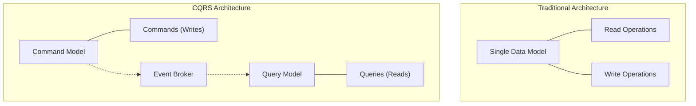
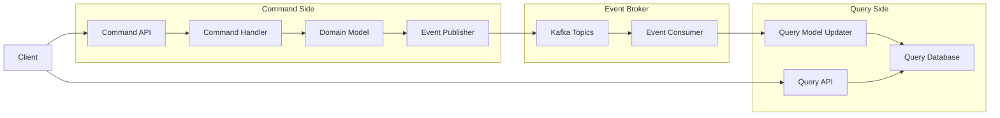

# Command Query Responsibility Segregation (CQRS)

## Overview

Command Query Responsibility Segregation (CQRS) is an architectural pattern that separates read and write operations for a data store. In healthcare systems, this pattern enables optimized data models for different use cases, improves performance, and supports complex domain logic. This document covers the implementation of CQRS using the Event Broker, focusing on healthcare-specific patterns and considerations.

## CQRS Fundamentals

In traditional architectures, the same data model is used for both reading and writing data. CQRS separates these concerns:

- **Commands**: Write operations that change the system state
- **Queries**: Read operations that return data without side effects
- **Command Model**: Optimized for data consistency and business rules
- **Query Model**: Optimized for specific read patterns and performance



## CQRS Implementation with Event Broker

### Architecture Components

A CQRS implementation with the Event Broker typically includes:

1. **Command Service**: Processes commands and publishes events
2. **Event Store**: Captures all state changes as events
3. **Event Handlers**: Update query models based on events
4. **Query Service**: Provides optimized read access to data



### Command Side Implementation

The command side focuses on processing commands and maintaining consistency:

```java
// Command object
public class CreatePatientCommand {
    private String patientId;
    private String firstName;
    private String lastName;
    private LocalDate dateOfBirth;
    private String gender;
    private Address address;
    private String phoneNumber;
    private String email;
    // Getters and setters
}

// Command handler
@Service
public class PatientCommandHandler {

    private final PatientRepository patientRepository;
    private final KafkaTemplate<String, PatientEvent> kafkaTemplate;
    
    @Transactional
    public void handle(CreatePatientCommand command) {
        // Validate command
        validateCommand(command);
        
        // Create patient entity
        Patient patient = new Patient();
        patient.setPatientId(command.getPatientId());
        patient.setFirstName(command.getFirstName());
        patient.setLastName(command.getLastName());
        patient.setDateOfBirth(command.getDateOfBirth());
        patient.setGender(command.getGender());
        patient.setAddress(command.getAddress());
        patient.setPhoneNumber(command.getPhoneNumber());
        patient.setEmail(command.getEmail());
        
        // Save to command database
        patientRepository.save(patient);
        
        // Create and publish event
        PatientCreatedEvent event = new PatientCreatedEvent();
        event.setEventId(UUID.randomUUID().toString());
        event.setEventTime(Instant.now());
        event.setPatientId(patient.getPatientId());
        event.setFirstName(patient.getFirstName());
        event.setLastName(patient.getLastName());
        event.setDateOfBirth(patient.getDateOfBirth());
        event.setGender(patient.getGender());
        event.setAddress(patient.getAddress());
        event.setPhoneNumber(patient.getPhoneNumber());
        event.setEmail(patient.getEmail());
        
        // Publish event
        kafkaTemplate.send("patient.events", patient.getPatientId(), event);
    }
    
    private void validateCommand(CreatePatientCommand command) {
        // Validate required fields
        if (command.getFirstName() == null || command.getFirstName().isEmpty()) {
            throw new ValidationException("First name is required");
        }
        if (command.getLastName() == null || command.getLastName().isEmpty()) {
            throw new ValidationException("Last name is required");
        }
        if (command.getDateOfBirth() == null) {
            throw new ValidationException("Date of birth is required");
        }
        if (command.getDateOfBirth().isAfter(LocalDate.now())) {
            throw new ValidationException("Date of birth cannot be in the future");
        }
        // Additional validation rules
    }
}

// Command API
@RestController
@RequestMapping("/api/patients/commands")
public class PatientCommandController {

    private final PatientCommandHandler commandHandler;
    
    @PostMapping("/create")
    public ResponseEntity<String> createPatient(@RequestBody CreatePatientCommand command) {
        try {
            commandHandler.handle(command);
            return ResponseEntity.ok("Patient created successfully");
        } catch (ValidationException e) {
            return ResponseEntity.badRequest().body(e.getMessage());
        } catch (Exception e) {
            return ResponseEntity.status(HttpStatus.INTERNAL_SERVER_ERROR)
                .body("Error creating patient: " + e.getMessage());
        }
    }
}
```

### Query Side Implementation

The query side focuses on providing optimized read access to data:

```java
// Query model (optimized for reading)
@Document(collection = "patient_view")
public class PatientView {
    @Id
    private String patientId;
    private String firstName;
    private String lastName;
    private String fullName; // Denormalized for searching
    private LocalDate dateOfBirth;
    private int age; // Calculated field
    private String gender;
    private Address address;
    private String phoneNumber;
    private String email;
    private List<String> activeConditions; // Denormalized from conditions
    private List<String> activeMedications; // Denormalized from medications
    private List<String> allergies; // Denormalized from allergies
    private Instant lastUpdated;
    // Getters and setters
}

// Event handler to update query model
@Service
public class PatientEventHandler {

    private final MongoTemplate mongoTemplate;
    
    @KafkaListener(topics = "patient.events", groupId = "patient-view-updater")
    public void handlePatientEvent(PatientEvent event) {
        if (event instanceof PatientCreatedEvent) {
            handlePatientCreated((PatientCreatedEvent) event);
        } else if (event instanceof PatientUpdatedEvent) {
            handlePatientUpdated((PatientUpdatedEvent) event);
        } else if (event instanceof PatientMedicationAddedEvent) {
            handleMedicationAdded((PatientMedicationAddedEvent) event);
        }
        // Handle other event types
    }
    
    private void handlePatientCreated(PatientCreatedEvent event) {
        PatientView patientView = new PatientView();
        patientView.setPatientId(event.getPatientId());
        patientView.setFirstName(event.getFirstName());
        patientView.setLastName(event.getLastName());
        patientView.setFullName(event.getFirstName() + " " + event.getLastName());
        patientView.setDateOfBirth(event.getDateOfBirth());
        patientView.setAge(calculateAge(event.getDateOfBirth()));
        patientView.setGender(event.getGender());
        patientView.setAddress(event.getAddress());
        patientView.setPhoneNumber(event.getPhoneNumber());
        patientView.setEmail(event.getEmail());
        patientView.setActiveConditions(new ArrayList<>());
        patientView.setActiveMedications(new ArrayList<>());
        patientView.setAllergies(new ArrayList<>());
        patientView.setLastUpdated(event.getEventTime());
        
        mongoTemplate.save(patientView);
    }
    
    private void handlePatientUpdated(PatientUpdatedEvent event) {
        // Find existing patient view
        PatientView patientView = mongoTemplate.findById(event.getPatientId(), PatientView.class);
        if (patientView == null) {
            // Handle missing view - could create a new one or log error
            return;
        }
        
        // Update fields that changed
        if (event.getFirstName() != null) {
            patientView.setFirstName(event.getFirstName());
            patientView.setFullName(event.getFirstName() + " " + patientView.getLastName());
        }
        if (event.getLastName() != null) {
            patientView.setLastName(event.getLastName());
            patientView.setFullName(patientView.getFirstName() + " " + event.getLastName());
        }
        // Update other fields similarly
        
        patientView.setLastUpdated(event.getEventTime());
        mongoTemplate.save(patientView);
    }
    
    private void handleMedicationAdded(PatientMedicationAddedEvent event) {
        // Update patient view with new medication
        Query query = new Query(Criteria.where("_id").is(event.getPatientId()));
        Update update = new Update().push("activeMedications", event.getMedicationName())
                                  .set("lastUpdated", event.getEventTime());
        
        mongoTemplate.updateFirst(query, update, PatientView.class);
    }
    
    private int calculateAge(LocalDate birthDate) {
        return Period.between(birthDate, LocalDate.now()).getYears();
    }
}

// Query API
@RestController
@RequestMapping("/api/patients/queries")
public class PatientQueryController {

    private final MongoTemplate mongoTemplate;
    
    @GetMapping("/{patientId}")
    public ResponseEntity<PatientView> getPatient(@PathVariable String patientId) {
        PatientView patientView = mongoTemplate.findById(patientId, PatientView.class);
        if (patientView != null) {
            return ResponseEntity.ok(patientView);
        } else {
            return ResponseEntity.notFound().build();
        }
    }
    
    @GetMapping("/search")
    public ResponseEntity<List<PatientView>> searchPatients(
            @RequestParam(required = false) String name,
            @RequestParam(required = false) String zipCode,
            @RequestParam(required = false) Integer minAge,
            @RequestParam(required = false) Integer maxAge) {
        
        Criteria criteria = new Criteria();
        
        if (name != null && !name.isEmpty()) {
            criteria.and("fullName").regex(name, "i");
        }
        
        if (zipCode != null && !zipCode.isEmpty()) {
            criteria.and("address.zipCode").is(zipCode);
        }
        
        if (minAge != null) {
            criteria.and("age").gte(minAge);
        }
        
        if (maxAge != null) {
            criteria.and("age").lte(maxAge);
        }
        
        Query query = new Query(criteria).limit(100);
        List<PatientView> patients = mongoTemplate.find(query, PatientView.class);
        
        return ResponseEntity.ok(patients);
    }
}
```

## Healthcare CQRS Patterns

### Patient Summary View

A denormalized view of patient data for clinical dashboards:

```java
// Patient summary view model
@Document(collection = "patient_summary")
public class PatientSummaryView {
    @Id
    private String patientId;
    private String fullName;
    private LocalDate dateOfBirth;
    private int age;
    private String gender;
    private String primaryCareProvider;
    private List<String> activeConditions;
    private List<String> activeMedications;
    private List<String> allergies;
    private Map<String, Object> recentVitals;
    private List<Map<String, Object>> recentEncounters;
    private List<Map<String, Object>> upcomingAppointments;
    private Instant lastUpdated;
    // Getters and setters
}

// Event handler for patient summary view
@Service
public class PatientSummaryEventHandler {

    private final MongoTemplate mongoTemplate;
    
    @KafkaListener(topics = {"patient.events", "encounter.events", "medication.events", 
                          "condition.events", "appointment.events", "vitalsign.events"}, 
                 groupId = "patient-summary-updater")
    public void handleEvent(ConsumerRecord<String, Object> record) {
        String topic = record.topic();
        Object value = record.value();
        
        switch (topic) {
            case "patient.events":
                handlePatientEvent((PatientEvent) value);
                break;
            case "encounter.events":
                handleEncounterEvent((EncounterEvent) value);
                break;
            case "medication.events":
                handleMedicationEvent((MedicationEvent) value);
                break;
            case "condition.events":
                handleConditionEvent((ConditionEvent) value);
                break;
            case "appointment.events":
                handleAppointmentEvent((AppointmentEvent) value);
                break;
            case "vitalsign.events":
                handleVitalSignEvent((VitalSignEvent) value);
                break;
        }
    }
    
    // Event handlers for each event type
}
```

### Clinical Decision Support

A specialized query model for clinical decision support:

```java
// Clinical decision support view model
@Document(collection = "clinical_decision_support")
public class ClinicalDecisionSupportView {
    @Id
    private String patientId;
    private List<String> activeDiagnoses;
    private List<String> activeMedications;
    private List<String> allergies;
    private Map<String, Object> labResults;
    private Map<String, Object> vitals;
    private List<String> riskFactors;
    private List<String> preventiveCareGaps;
    private List<String> careGuidelines;
    private Instant lastUpdated;
    // Getters and setters
}

// Query API for clinical decision support
@RestController
@RequestMapping("/api/clinical-decision-support")
public class ClinicalDecisionSupportController {

    private final MongoTemplate mongoTemplate;
    private final RuleEngine ruleEngine;
    
    @GetMapping("/patient/{patientId}/alerts")
    public ResponseEntity<List<ClinicalAlert>> getPatientAlerts(@PathVariable String patientId) {
        // Get patient clinical data
        ClinicalDecisionSupportView patientData = 
            mongoTemplate.findById(patientId, ClinicalDecisionSupportView.class);
        
        if (patientData == null) {
            return ResponseEntity.notFound().build();
        }
        
        // Run rules engine to generate alerts
        List<ClinicalAlert> alerts = ruleEngine.evaluateRules(patientData);
        
        return ResponseEntity.ok(alerts);
    }
}
```

### Reporting and Analytics

Specialized query models for analytics and reporting:

```java
// Population health query model
@Document(collection = "population_health")
public class PopulationHealthMetrics {
    @Id
    private String metricId;
    private String metricName;
    private String metricType; // count, percentage, average, etc.
    private Object value;
    private Map<String, Object> dimensions; // age group, gender, zip code, etc.
    private Instant calculatedAt;
    // Getters and setters
}

// Event handler for population health metrics
@Service
public class PopulationHealthEventHandler {

    private final MongoTemplate mongoTemplate;
    
    @Scheduled(fixedRate = 3600000) // Every hour
    public void calculatePopulationMetrics() {
        // Calculate diabetes control rate
        calculateDiabetesControlRate();
        
        // Calculate hypertension control rate
        calculateHypertensionControlRate();
        
        // Calculate other metrics
    }
    
    private void calculateDiabetesControlRate() {
        // Find all patients with diabetes
        Query diabetesQuery = new Query(Criteria.where("activeDiagnoses").regex("diabetes", "i"));
        long diabeticPatients = mongoTemplate.count(diabetesQuery, ClinicalDecisionSupportView.class);
        
        // Find diabetic patients with controlled A1C
        Query controlledQuery = new Query(
            Criteria.where("activeDiagnoses").regex("diabetes", "i")
                .and("labResults.A1C").lt(7.0)
        );
        long controlledPatients = mongoTemplate.count(controlledQuery, ClinicalDecisionSupportView.class);
        
        // Calculate control rate
        double controlRate = diabeticPatients > 0 ? 
            (double) controlledPatients / diabeticPatients * 100 : 0;
        
        // Save metric
        PopulationHealthMetrics metric = new PopulationHealthMetrics();
        metric.setMetricId("diabetes-control-rate");
        metric.setMetricName("Diabetes Control Rate");
        metric.setMetricType("percentage");
        metric.setValue(controlRate);
        metric.setCalculatedAt(Instant.now());
        
        mongoTemplate.save(metric);
    }
}
```

## Handling Eventual Consistency

CQRS introduces eventual consistency between command and query models:

```java
// Tracking query model synchronization
@Document(collection = "sync_status")
public class SynchronizationStatus {
    @Id
    private String modelName;
    private long lastProcessedEventId;
    private Instant lastSyncTime;
    private String status; // "in_sync", "syncing", "out_of_sync"
    // Getters and setters
}

// API endpoint that includes sync status
@RestController
@RequestMapping("/api/patients/queries")
public class PatientQueryController {

    private final MongoTemplate mongoTemplate;
    
    @GetMapping("/{patientId}")
    public ResponseEntity<Map<String, Object>> getPatient(@PathVariable String patientId) {
        PatientView patientView = mongoTemplate.findById(patientId, PatientView.class);
        if (patientView == null) {
            return ResponseEntity.notFound().build();
        }
        
        // Get sync status
        SynchronizationStatus syncStatus = mongoTemplate.findById(
            "patient_view", SynchronizationStatus.class);
        
        // Create response with data and metadata
        Map<String, Object> response = new HashMap<>();
        response.put("data", patientView);
        response.put("metadata", Map.of(
            "lastUpdated", patientView.getLastUpdated(),
            "syncStatus", syncStatus != null ? syncStatus.getStatus() : "unknown"
        ));
        
        return ResponseEntity.ok(response);
    }
}
```

### Handling Conflicts

Resolving conflicts between command and query models:

```java
@Service
public class ModelReconciliationService {

    private final PatientRepository commandRepository;
    private final MongoTemplate queryRepository;
    private final KafkaTemplate<String, ReconciliationEvent> kafkaTemplate;
    
    @Scheduled(fixedRate = 86400000) // Daily
    public void reconcilePatientModels() {
        // Get all patients from command model
        List<Patient> commandPatients = commandRepository.findAll();
        
        for (Patient commandPatient : commandPatients) {
            String patientId = commandPatient.getPatientId();
            
            // Get corresponding query model
            PatientView queryPatient = queryRepository.findById(patientId, PatientView.class);
            
            if (queryPatient == null) {
                // Query model is missing - create reconciliation event
                ReconciliationEvent event = new ReconciliationEvent();
                event.setEventId(UUID.randomUUID().toString());
                event.setEventTime(Instant.now());
                event.setEntityType("Patient");
                event.setEntityId(patientId);
                event.setIssueType("MissingQueryModel");
                event.setCommandModelData(commandPatient);
                
                kafkaTemplate.send("reconciliation.events", patientId, event);
            } else if (!isConsistent(commandPatient, queryPatient)) {
                // Models are inconsistent - create reconciliation event
                ReconciliationEvent event = new ReconciliationEvent();
                event.setEventId(UUID.randomUUID().toString());
                event.setEventTime(Instant.now());
                event.setEntityType("Patient");
                event.setEntityId(patientId);
                event.setIssueType("InconsistentModels");
                event.setCommandModelData(commandPatient);
                event.setQueryModelData(queryPatient);
                event.setDiscrepancies(findDiscrepancies(commandPatient, queryPatient));
                
                kafkaTemplate.send("reconciliation.events", patientId, event);
            }
        }
    }
    
    private boolean isConsistent(Patient commandPatient, PatientView queryPatient) {
        // Compare essential fields
        if (!Objects.equals(commandPatient.getFirstName(), queryPatient.getFirstName())) {
            return false;
        }
        if (!Objects.equals(commandPatient.getLastName(), queryPatient.getLastName())) {
            return false;
        }
        // Compare other essential fields
        
        return true;
    }
    
    private Map<String, Object> findDiscrepancies(Patient commandPatient, PatientView queryPatient) {
        Map<String, Object> discrepancies = new HashMap<>();
        
        if (!Objects.equals(commandPatient.getFirstName(), queryPatient.getFirstName())) {
            discrepancies.put("firstName", Map.of(
                "command", commandPatient.getFirstName(),
                "query", queryPatient.getFirstName()
            ));
        }
        // Check other fields
        
        return discrepancies;
    }
}
```

## Performance Considerations

### Query Model Optimization

Optimizing query models for specific access patterns:

```java
// Indexing for query models
@Document(collection = "patient_view")
@CompoundIndexes({
    @CompoundIndex(name = "name_zipcode_idx", def = "{\"fullName\": 1, \"address.zipCode\": 1}"),
    @CompoundIndex(name = "age_gender_idx", def = "{\"age\": 1, \"gender\": 1}")
})
public class PatientView {
    // Fields as before
}

// Caching query results
@Configuration
@EnableCaching
public class CacheConfig {

    @Bean
    public CacheManager cacheManager() {
        SimpleCacheManager cacheManager = new SimpleCacheManager();
        cacheManager.setCaches(Arrays.asList(
            new ConcurrentMapCache("patientViews"),
            new ConcurrentMapCache("patientSummaries"),
            new ConcurrentMapCache("populationMetrics")
        ));
        return cacheManager;
    }
}

@Service
public class PatientQueryService {

    private final MongoTemplate mongoTemplate;
    
    @Cacheable(value = "patientViews", key = "#patientId")
    public PatientView getPatientView(String patientId) {
        return mongoTemplate.findById(patientId, PatientView.class);
    }
    
    @CacheEvict(value = "patientViews", key = "#patientId")
    public void invalidatePatientCache(String patientId) {
        // Cache entry will be evicted
    }
}
```

### Scaling Strategies

Scaling CQRS components independently:

```yaml
# Kubernetes deployment for command service
apiVersion: apps/v1
kind: Deployment
metadata:
  name: patient-command-service
spec:
  replicas: 3
  selector:
    matchLabels:
      app: patient-command-service
  template:
    metadata:
      labels:
        app: patient-command-service
    spec:
      containers:
      - name: patient-command-service
        image: healthcare/patient-command-service:1.0.0
        resources:
          requests:
            memory: "512Mi"
            cpu: "500m"
          limits:
            memory: "1Gi"
            cpu: "1"
        env:
        - name: SPRING_DATASOURCE_URL
          value: "jdbc:postgresql://command-db:5432/patients"
        - name: KAFKA_BOOTSTRAP_SERVERS
          value: "kafka-broker-1:9092,kafka-broker-2:9092,kafka-broker-3:9092"

# Kubernetes deployment for query service
apiVersion: apps/v1
kind: Deployment
metadata:
  name: patient-query-service
spec:
  replicas: 5  # More replicas for read-heavy workloads
  selector:
    matchLabels:
      app: patient-query-service
  template:
    metadata:
      labels:
        app: patient-query-service
    spec:
      containers:
      - name: patient-query-service
        image: healthcare/patient-query-service:1.0.0
        resources:
          requests:
            memory: "1Gi"
            cpu: "500m"
          limits:
            memory: "2Gi"
            cpu: "1"
        env:
        - name: SPRING_DATA_MONGODB_URI
          value: "mongodb://query-db:27017/patient_views"
        - name: KAFKA_BOOTSTRAP_SERVERS
          value: "kafka-broker-1:9092,kafka-broker-2:9092,kafka-broker-3:9092"
```

## Related Documentation

- [Event Schemas](../02-core-functionality/event-schemas.md): Defining the structure of events
- [Topic Design](../02-core-functionality/topic-design.md): Designing effective Kafka topics
- [Stream Processing](stream-processing.md): Processing events in real-time
- [Event Sourcing](event-sourcing.md): Using events as the system of record
