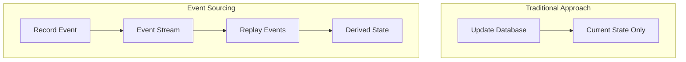
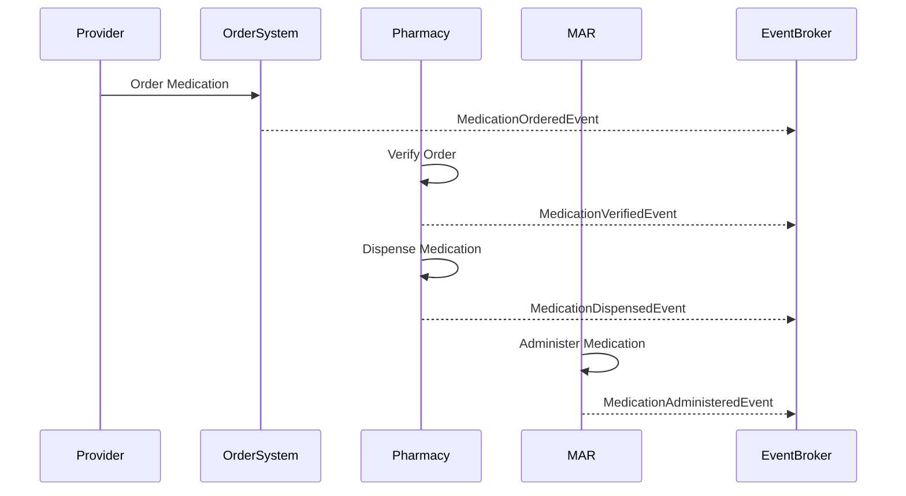

# Event Sourcing

## Overview

Event Sourcing is an architectural pattern where changes to application state are captured as a sequence of immutable events rather than just storing the current state. In healthcare systems, this approach provides a complete audit trail, enables temporal queries, and supports advanced analytics. This document covers the implementation of Event Sourcing using the Event Broker, focusing on healthcare-specific patterns and considerations.

## Event Sourcing Fundamentals

In traditional data models, applications store the current state of entities in a database. With Event Sourcing:

- All changes are recorded as immutable events
- The current state is derived by replaying events
- Events become the system of record
- History is preserved for audit and analysis



## Healthcare Event Sourcing Model

### Event Types

Healthcare event sourcing typically involves several categories of events:

| Event Category | Description | Examples |
|----------------|-------------|----------|
| Clinical Events | Changes to clinical data | Vital signs recorded, medication administered |
| Administrative Events | Changes to administrative data | Patient registered, appointment scheduled |
| Workflow Events | Changes to process state | Order placed, referral created |
| System Events | Technical state changes | User logged in, integration completed |

### Event Structure

Healthcare events should include standard metadata:

```json
{
  "eventId": "f47ac10b-58cc-4372-a567-0e02b2c3d479",
  "eventType": "PatientRegistered",
  "eventTime": "2023-06-15T14:35:22.456Z",
  "version": "1.0",
  "source": "registration-system",
  "dataContentType": "application/json",
  "subject": "Patient/123",
  "data": {
    "patientId": "123",
    "firstName": "John",
    "lastName": "Smith",
    "dateOfBirth": "1970-01-01",
    "gender": "male",
    "address": {
      "line": ["123 Main St"],
      "city": "Anytown",
      "state": "CA",
      "postalCode": "12345"
    },
    "phoneNumber": "555-123-4567",
    "email": "john.smith@example.com"
  },
  "metadata": {
    "userId": "user-456",
    "facilityId": "facility-789",
    "correlationId": "corr-abc123",
    "tags": ["registration", "new-patient"]
  }
}
```

## Event Sourcing Implementation

### Event Store

The Event Broker serves as the event store, with topics organized by entity type:

```
entity.patient.events
entity.encounter.events
entity.order.events
entity.result.events
```

Events are partitioned by entity ID to ensure ordering and enable efficient replay:

```java
// Publishing an event with the entity ID as the key
ProducerRecord<String, PatientEvent> record = new ProducerRecord<>(
    "entity.patient.events",
    patientId,  // Key ensures all events for a patient go to the same partition
    patientEvent
);
```

### Event Publishing

Events should be published atomically with any state changes:

```java
import org.springframework.transaction.annotation.Transactional;
import org.springframework.kafka.core.KafkaTemplate;

public class PatientService {

    private final PatientRepository patientRepository;
    private final KafkaTemplate<String, PatientEvent> kafkaTemplate;
    
    public PatientService(PatientRepository patientRepository, 
                         KafkaTemplate<String, PatientEvent> kafkaTemplate) {
        this.patientRepository = patientRepository;
        this.kafkaTemplate = kafkaTemplate;
    }
    
    @Transactional
    public Patient registerPatient(PatientRegistrationRequest request) {
        // Create patient entity
        Patient patient = new Patient();
        patient.setPatientId(generatePatientId());
        patient.setFirstName(request.getFirstName());
        patient.setLastName(request.getLastName());
        patient.setDateOfBirth(request.getDateOfBirth());
        patient.setGender(request.getGender());
        patient.setAddress(request.getAddress());
        patient.setPhoneNumber(request.getPhoneNumber());
        patient.setEmail(request.getEmail());
        
        // Save to database
        Patient savedPatient = patientRepository.save(patient);
        
        // Create and publish event
        PatientRegisteredEvent event = new PatientRegisteredEvent();
        event.setEventId(UUID.randomUUID().toString());
        event.setEventTime(Instant.now());
        event.setPatientId(savedPatient.getPatientId());
        event.setFirstName(savedPatient.getFirstName());
        event.setLastName(savedPatient.getLastName());
        event.setDateOfBirth(savedPatient.getDateOfBirth());
        event.setGender(savedPatient.getGender());
        event.setAddress(savedPatient.getAddress());
        event.setPhoneNumber(savedPatient.getPhoneNumber());
        event.setEmail(savedPatient.getEmail());
        
        // Publish event (within the same transaction)
        kafkaTemplate.send("entity.patient.events", savedPatient.getPatientId(), event);
        
        return savedPatient;
    }
}
```

### Event Consumption and State Reconstruction

Events can be consumed to build or update materialized views:

```java
import org.springframework.kafka.annotation.KafkaListener;
import org.springframework.stereotype.Service;

@Service
public class PatientViewService {

    private final PatientViewRepository patientViewRepository;
    
    public PatientViewService(PatientViewRepository patientViewRepository) {
        this.patientViewRepository = patientViewRepository;
    }
    
    @KafkaListener(topics = "entity.patient.events", groupId = "patient-view-builder")
    public void handlePatientEvent(PatientEvent event) {
        String patientId = event.getPatientId();
        
        // Get or create patient view
        PatientView patientView = patientViewRepository.findById(patientId)
            .orElse(new PatientView(patientId));
        
        // Apply event to view based on event type
        if (event instanceof PatientRegisteredEvent) {
            applyRegistrationEvent(patientView, (PatientRegisteredEvent) event);
        } else if (event instanceof PatientUpdatedEvent) {
            applyUpdateEvent(patientView, (PatientUpdatedEvent) event);
        } else if (event instanceof PatientMergedEvent) {
            applyMergeEvent(patientView, (PatientMergedEvent) event);
        }
        
        // Save updated view
        patientViewRepository.save(patientView);
    }
    
    private void applyRegistrationEvent(PatientView view, PatientRegisteredEvent event) {
        view.setFirstName(event.getFirstName());
        view.setLastName(event.getLastName());
        view.setDateOfBirth(event.getDateOfBirth());
        view.setGender(event.getGender());
        view.setAddress(event.getAddress());
        view.setPhoneNumber(event.getPhoneNumber());
        view.setEmail(event.getEmail());
        view.setRegistrationDate(event.getEventTime());
        view.setLastUpdated(event.getEventTime());
    }
    
    private void applyUpdateEvent(PatientView view, PatientUpdatedEvent event) {
        // Apply only the fields that were updated
        if (event.getFirstName() != null) {
            view.setFirstName(event.getFirstName());
        }
        if (event.getLastName() != null) {
            view.setLastName(event.getLastName());
        }
        // Apply other fields similarly
        
        view.setLastUpdated(event.getEventTime());
    }
    
    private void applyMergeEvent(PatientView view, PatientMergedEvent event) {
        view.setMergedInto(event.getTargetPatientId());
        view.setActive(false);
        view.setLastUpdated(event.getEventTime());
    }
}
```

### Temporal Queries

Event sourcing enables querying the state of an entity at any point in time:

```java
import org.springframework.kafka.core.KafkaTemplate;
import org.springframework.stereotype.Service;

@Service
public class PatientHistoryService {

    private final KafkaConsumer<String, PatientEvent> kafkaConsumer;
    
    public PatientHistoryService(KafkaConsumer<String, PatientEvent> kafkaConsumer) {
        this.kafkaConsumer = kafkaConsumer;
    }
    
    public Patient getPatientStateAt(String patientId, Instant pointInTime) {
        // Create a new patient object
        Patient patient = new Patient(patientId);
        
        // Assign partition and seek to beginning
        TopicPartition partition = new TopicPartition("entity.patient.events", 0); // Simplified
        kafkaConsumer.assign(Collections.singletonList(partition));
        kafkaConsumer.seekToBeginning(Collections.singletonList(partition));
        
        // Replay events up to the specified point in time
        boolean continueConsuming = true;
        while (continueConsuming) {
            ConsumerRecords<String, PatientEvent> records = kafkaConsumer.poll(Duration.ofMillis(100));
            
            for (ConsumerRecord<String, PatientEvent> record : records) {
                if (record.key().equals(patientId)) {
                    PatientEvent event = record.value();
                    
                    // Only apply events that occurred before or at the specified time
                    if (event.getEventTime().isBefore(pointInTime) || 
                        event.getEventTime().equals(pointInTime)) {
                        applyEvent(patient, event);
                    } else {
                        continueConsuming = false;
                        break;
                    }
                }
            }
            
            if (records.isEmpty()) {
                continueConsuming = false;
            }
        }
        
        return patient;
    }
    
    private void applyEvent(Patient patient, PatientEvent event) {
        if (event instanceof PatientRegisteredEvent) {
            applyRegistrationEvent(patient, (PatientRegisteredEvent) event);
        } else if (event instanceof PatientUpdatedEvent) {
            applyUpdateEvent(patient, (PatientUpdatedEvent) event);
        } else if (event instanceof PatientMergedEvent) {
            applyMergeEvent(patient, (PatientMergedEvent) event);
        }
    }
    
    // Apply methods similar to the view service
}
```

## Healthcare Event Sourcing Patterns

### Patient History

Capturing the complete history of patient data changes:

```java
// Patient events
public abstract class PatientEvent {
    private String eventId;
    private Instant eventTime;
    private String patientId;
    // Common fields and methods
}

public class PatientRegisteredEvent extends PatientEvent {
    private String firstName;
    private String lastName;
    private LocalDate dateOfBirth;
    private String gender;
    private Address address;
    private String phoneNumber;
    private String email;
    // Getters and setters
}

public class PatientUpdatedEvent extends PatientEvent {
    private String firstName;
    private String lastName;
    private Address address;
    private String phoneNumber;
    private String email;
    private String updatedBy;
    private String updateReason;
    // Getters and setters
}

public class PatientMergedEvent extends PatientEvent {
    private String sourcePatientId;
    private String targetPatientId;
    private String mergeReason;
    private String mergedBy;
    // Getters and setters
}
```

### Clinical Observations

Tracking vital signs and other clinical measurements:

```java
public class VitalSignRecordedEvent {
    private String eventId;
    private Instant eventTime;
    private String patientId;
    private String encounterId;
    private String vitalSignType; // e.g., "blood-pressure", "heart-rate"
    private String code; // LOINC or SNOMED code
    private Double value;
    private String unit;
    private String recordedBy;
    private Instant observationTime;
    private String deviceId; // Optional
    // Getters and setters
}
```

### Medication Workflow

Tracking the complete medication lifecycle:



```java
// Medication events
public abstract class MedicationEvent {
    private String eventId;
    private Instant eventTime;
    private String patientId;
    private String encounterId;
    private String orderId;
    private String medicationId;
    private String medicationName;
    // Common fields and methods
}

public class MedicationOrderedEvent extends MedicationEvent {
    private String orderingProvider;
    private String dosage;
    private String frequency;
    private String route;
    private LocalDate startDate;
    private LocalDate endDate;
    private String indication;
    // Getters and setters
}

public class MedicationVerifiedEvent extends MedicationEvent {
    private String verifyingPharmacist;
    private Instant verificationTime;
    private boolean approved;
    private String notes;
    // Getters and setters
}

public class MedicationDispensedEvent extends MedicationEvent {
    private String dispensingPharmacist;
    private Instant dispensingTime;
    private String quantity;
    private String pharmacyLocation;
    // Getters and setters
}

public class MedicationAdministeredEvent extends MedicationEvent {
    private String administeringProvider;
    private Instant administrationTime;
    private String actualDosage;
    private String site;
    private String patientResponse;
    // Getters and setters
}
```

## Handling Healthcare-Specific Challenges

### Patient Identity Management

Managing patient identity over time, including merges and splits:

```java
@Service
public class PatientIdentityService {

    private final KafkaTemplate<String, PatientEvent> kafkaTemplate;
    private final PatientRepository patientRepository;
    
    @Transactional
    public void mergePatients(String sourcePatientId, String targetPatientId, String reason) {
        // Verify both patients exist
        Patient sourcePatient = patientRepository.findById(sourcePatientId)
            .orElseThrow(() -> new EntityNotFoundException("Source patient not found"));
        Patient targetPatient = patientRepository.findById(targetPatientId)
            .orElseThrow(() -> new EntityNotFoundException("Target patient not found"));
        
        // Update source patient to indicate it's merged
        sourcePatient.setActive(false);
        sourcePatient.setMergedInto(targetPatientId);
        patientRepository.save(sourcePatient);
        
        // Create and publish merge event
        PatientMergedEvent event = new PatientMergedEvent();
        event.setEventId(UUID.randomUUID().toString());
        event.setEventTime(Instant.now());
        event.setPatientId(sourcePatientId);
        event.setSourcePatientId(sourcePatientId);
        event.setTargetPatientId(targetPatientId);
        event.setMergeReason(reason);
        event.setMergedBy(SecurityContextHolder.getContext().getAuthentication().getName());
        
        kafkaTemplate.send("entity.patient.events", sourcePatientId, event);
    }
}
```

### Data Corrections

Handling corrections to erroneous data while maintaining audit trail:

```java
public class DataCorrectionEvent extends PatientEvent {
    private String originalEventId;
    private String correctionReason;
    private String correctedBy;
    private Map<String, Object> correctedFields;
    // Getters and setters
}

@Service
public class DataCorrectionService {

    private final KafkaTemplate<String, DataCorrectionEvent> kafkaTemplate;
    
    @Transactional
    public void correctPatientData(String patientId, String originalEventId, 
                                 Map<String, Object> correctedFields, String reason) {
        // Create correction event
        DataCorrectionEvent event = new DataCorrectionEvent();
        event.setEventId(UUID.randomUUID().toString());
        event.setEventTime(Instant.now());
        event.setPatientId(patientId);
        event.setOriginalEventId(originalEventId);
        event.setCorrectionReason(reason);
        event.setCorrectedBy(SecurityContextHolder.getContext().getAuthentication().getName());
        event.setCorrectedFields(correctedFields);
        
        // Publish correction event
        kafkaTemplate.send("entity.patient.events", patientId, event);
    }
}
```

### Versioning and Schema Evolution

Managing changes to event schemas over time:

```java
// Version 1 of an event
public class PatientRegisteredEventV1 {
    private String eventId;
    private Instant eventTime;
    private String patientId;
    private String firstName;
    private String lastName;
    private LocalDate dateOfBirth;
    private String gender; // Limited to "M" or "F"
    // Getters and setters
}

// Version 2 of the same event with expanded gender options
public class PatientRegisteredEventV2 {
    private String eventId;
    private Instant eventTime;
    private String patientId;
    private String firstName;
    private String lastName;
    private LocalDate dateOfBirth;
    private String gender; // Expanded options
    private String genderIdentity; // Added field
    private String pronouns; // Added field
    // Getters and setters
}

// Event deserializer that handles multiple versions
public class PatientEventDeserializer implements Deserializer<PatientEvent> {
    
    private final ObjectMapper objectMapper = new ObjectMapper();
    
    @Override
    public PatientEvent deserialize(String topic, byte[] data) {
        try {
            // Read the event as a generic JSON object first
            JsonNode rootNode = objectMapper.readTree(data);
            
            // Extract event type and version
            String eventType = rootNode.get("eventType").asText();
            String version = rootNode.has("version") ? 
                rootNode.get("version").asText() : "1.0";
            
            // Deserialize based on type and version
            if ("PatientRegistered".equals(eventType)) {
                if (version.startsWith("1.")) {
                    return objectMapper.treeToValue(rootNode, PatientRegisteredEventV1.class);
                } else {
                    return objectMapper.treeToValue(rootNode, PatientRegisteredEventV2.class);
                }
            }
            
            // Handle other event types similarly
            
        } catch (Exception e) {
            throw new SerializationException("Error deserializing event", e);
        }
        
        return null;
    }
}
```

## Performance and Scaling

### Event Partitioning

Effective partitioning is crucial for healthcare event sourcing:

```java
// Custom partitioner for patient events
public class PatientEventPartitioner implements Partitioner {
    
    @Override
    public int partition(String topic, Object key, byte[] keyBytes, 
                        Object value, byte[] valueBytes, Cluster cluster) {
        // Get total number of partitions for the topic
        int numPartitions = cluster.partitionCountForTopic(topic);
        
        if (key == null) {
            // If no key is provided, use a random partition
            return new Random().nextInt(numPartitions);
        }
        
        // For patient events, use consistent hashing on patient ID
        int partition = Math.abs(key.hashCode()) % numPartitions;
        return partition;
    }
    
    @Override
    public void close() {
        // No resources to close
    }
    
    @Override
    public void configure(Map<String, ?> configs) {
        // No configuration needed
    }
}
```

### Snapshotting

For large event streams, snapshots improve reconstruction performance:

```java
public class PatientSnapshot {
    private String patientId;
    private long lastEventSequence;
    private Instant snapshotTime;
    private Patient patientState;
    // Getters and setters
}

@Service
public class PatientSnapshotService {

    private final PatientSnapshotRepository snapshotRepository;
    private final KafkaConsumer<String, PatientEvent> kafkaConsumer;
    
    public Patient getPatientStateAt(String patientId, Instant pointInTime) {
        // Try to find a snapshot before the requested time
        Optional<PatientSnapshot> snapshot = snapshotRepository
            .findLatestSnapshotBefore(patientId, pointInTime);
        
        if (snapshot.isPresent()) {
            // Start from the snapshot state
            Patient patient = snapshot.get().getPatientState();
            long lastSequence = snapshot.get().getLastEventSequence();
            
            // Replay only events after the snapshot up to the requested time
            replayEventsAfterSequence(patient, patientId, lastSequence, pointInTime);
            return patient;
        } else {
            // No snapshot, replay all events from beginning
            Patient patient = new Patient(patientId);
            replayEvents(patient, patientId, pointInTime);
            return patient;
        }
    }
    
    @Scheduled(fixedRate = 3600000) // Every hour
    public void createSnapshots() {
        // Find patients that need snapshots
        List<String> patientsToSnapshot = findPatientsNeedingSnapshots();
        
        for (String patientId : patientsToSnapshot) {
            // Get current state by replaying all events
            Patient patient = new Patient(patientId);
            long lastSequence = replayAllEvents(patient, patientId);
            
            // Create and save snapshot
            PatientSnapshot snapshot = new PatientSnapshot();
            snapshot.setPatientId(patientId);
            snapshot.setLastEventSequence(lastSequence);
            snapshot.setSnapshotTime(Instant.now());
            snapshot.setPatientState(patient);
            
            snapshotRepository.save(snapshot);
        }
    }
    
    // Helper methods for event replay
}
```

## Compliance and Governance

### Audit Trails

Event sourcing naturally provides comprehensive audit trails:

```java
@RestController
@RequestMapping("/api/audit")
public class AuditController {

    private final PatientHistoryService patientHistoryService;
    
    @GetMapping("/patients/{patientId}/history")
    public List<AuditEntry> getPatientAuditTrail(
            @PathVariable String patientId,
            @RequestParam(required = false) Instant startTime,
            @RequestParam(required = false) Instant endTime) {
        
        // Default to last 30 days if no time range specified
        if (startTime == null) {
            startTime = Instant.now().minus(30, ChronoUnit.DAYS);
        }
        if (endTime == null) {
            endTime = Instant.now();
        }
        
        // Get all events for the patient in the time range
        List<PatientEvent> events = patientHistoryService
            .getPatientEvents(patientId, startTime, endTime);
        
        // Convert events to audit entries
        return events.stream()
            .map(this::convertToAuditEntry)
            .collect(Collectors.toList());
    }
    
    private AuditEntry convertToAuditEntry(PatientEvent event) {
        AuditEntry entry = new AuditEntry();
        entry.setTimestamp(event.getEventTime());
        entry.setPatientId(event.getPatientId());
        entry.setEventId(event.getEventId());
        
        if (event instanceof PatientRegisteredEvent) {
            entry.setAction("Patient Registered");
            entry.setUser(((PatientRegisteredEvent) event).getRegisteredBy());
        } else if (event instanceof PatientUpdatedEvent) {
            PatientUpdatedEvent updateEvent = (PatientUpdatedEvent) event;
            entry.setAction("Patient Updated");
            entry.setUser(updateEvent.getUpdatedBy());
            entry.setDetails("Reason: " + updateEvent.getUpdateReason());
            
            // Add details about what fields were changed
            Map<String, Object> changes = new HashMap<>();
            if (updateEvent.getFirstName() != null) changes.put("firstName", updateEvent.getFirstName());
            if (updateEvent.getLastName() != null) changes.put("lastName", updateEvent.getLastName());
            // Add other fields
            
            entry.setChanges(changes);
        }
        // Handle other event types
        
        return entry;
    }
}
```

### Data Retention

Managing healthcare data retention requirements:

```java
@Service
public class DataRetentionService {

    private final KafkaAdmin kafkaAdmin;
    private final EventRetentionPolicyRepository policyRepository;
    
    @Scheduled(cron = "0 0 1 * * ?") // Run at 1 AM every day
    public void applyRetentionPolicies() {
        // Get all retention policies
        List<EventRetentionPolicy> policies = policyRepository.findAll();
        
        for (EventRetentionPolicy policy : policies) {
            String topic = policy.getTopicName();
            int retentionDays = policy.getRetentionDays();
            
            // Calculate retention time in milliseconds
            long retentionMs = retentionDays * 24 * 60 * 60 * 1000L;
            
            // Update topic configuration
            Map<String, ConfigEntry> configs = new HashMap<>();
            configs.put("retention.ms", new ConfigEntry("retention.ms", String.valueOf(retentionMs)));
            
            // Apply configuration
            kafkaAdmin.alterConfig(ConfigResource.Type.TOPIC, topic, configs);
            
            log.info("Applied retention policy of {} days to topic {}", retentionDays, topic);
        }
    }
}
```

## Related Documentation

- [Event Schemas](../02-core-functionality/event-schemas.md): Defining the structure of events
- [Topic Design](../02-core-functionality/topic-design.md): Designing effective Kafka topics
- [Stream Processing](stream-processing.md): Processing events in real-time
- [CQRS](cqrs.md): Command Query Responsibility Segregation pattern
