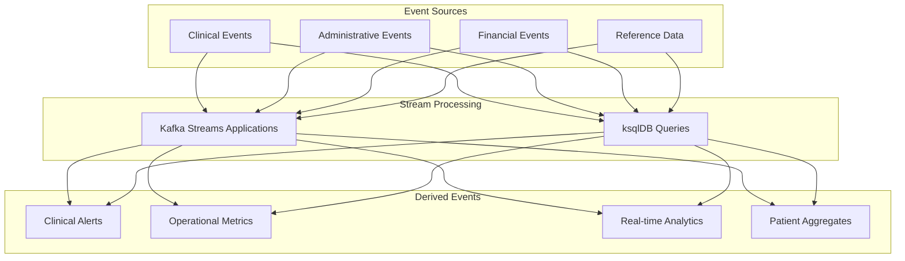

# Stream Processing

## Overview

Stream processing enables real-time analysis and transformation of healthcare events flowing through the Event Broker. This document covers the implementation of stream processing using Kafka Streams and ksqlDB, focusing on healthcare-specific patterns, stateful operations, and event enrichment that support clinical decision making and operational workflows.

## Stream Processing Architecture

The stream processing architecture leverages two complementary technologies:

- **Kafka Streams**: A Java library for building stream processing applications
- **ksqlDB**: A SQL-like interface for stream processing with minimal coding



## Kafka Streams Applications

### Stream Processing Concepts

Kafka Streams provides a powerful API for stream processing:

- **KStream**: Represents an unbounded sequence of key-value pairs
- **KTable**: Represents a changelog stream as a materialized view
- **GlobalKTable**: Represents a fully replicated table for joins
- **Processor API**: Low-level API for custom processing logic
- **State Stores**: Local storage for stateful operations

### Healthcare Stream Processing Examples

#### Vital Signs Anomaly Detection

This example detects abnormal vital signs in real-time:

```java
import org.apache.kafka.streams.StreamsBuilder;
import org.apache.kafka.streams.kstream.KStream;
import org.apache.kafka.streams.kstream.TimeWindows;
import org.apache.kafka.common.serialization.Serdes;
import org.apache.kafka.streams.kstream.Consumed;
import org.apache.kafka.streams.kstream.Produced;
import org.apache.kafka.streams.KeyValue;
import java.time.Duration;

public class VitalSignsAnomalyDetector {

    public static void buildTopology(StreamsBuilder builder) {
        // Consume vital signs events
        KStream<String, VitalSign> vitalSigns = builder.stream(
            "clinical.vitalsign.recorded",
            Consumed.with(Serdes.String(), VitalSignSerde.instance())
        );
        
        // Group by patient ID and vital sign type
        KStream<String, VitalSignAlert> alerts = vitalSigns
            .groupBy((patientId, vitalSign) -> 
                patientId + "-" + vitalSign.getCode())
            // Window over the last 30 minutes
            .windowedBy(TimeWindows.of(Duration.ofMinutes(30)))
            // Calculate statistics
            .aggregate(
                VitalSignStats::new,
                (key, value, aggregate) -> {
                    aggregate.update(value);
                    return aggregate;
                },
                // Materialized with in-memory state store
                Materialized.with(Serdes.String(), VitalSignStatsSerde.instance())
            )
            // Convert back to stream
            .toStream()
            // Detect anomalies
            .filter((key, stats) -> stats.isAnomaly())
            // Create alerts
            .map((key, stats) -> {
                String patientId = key.key().split("-")[0];
                String vitalType = key.key().split("-")[1];
                
                VitalSignAlert alert = new VitalSignAlert();
                alert.setPatientId(patientId);
                alert.setVitalSignCode(vitalType);
                alert.setCurrentValue(stats.getLatestValue());
                alert.setAverageValue(stats.getAverage());
                alert.setThreshold(stats.getThreshold());
                alert.setTimestamp(System.currentTimeMillis());
                
                return KeyValue.pair(patientId, alert);
            });
        
        // Publish alerts to a new topic
        alerts.to(
            "clinical.vitalsign.alert",
            Produced.with(Serdes.String(), VitalSignAlertSerde.instance())
        );
    }
}
```

#### Patient Journey Tracking

This example tracks patient movement through a healthcare facility:

```java
import org.apache.kafka.streams.StreamsBuilder;
import org.apache.kafka.streams.kstream.KStream;
import org.apache.kafka.streams.kstream.KTable;
import org.apache.kafka.common.serialization.Serdes;
import org.apache.kafka.streams.kstream.Consumed;
import org.apache.kafka.streams.kstream.Produced;

public class PatientJourneyTracker {

    public static void buildTopology(StreamsBuilder builder) {
        // Consume admission events
        KStream<String, AdmissionEvent> admissions = builder.stream(
            "clinical.patient.admitted",
            Consumed.with(Serdes.String(), AdmissionEventSerde.instance())
        );
        
        // Consume transfer events
        KStream<String, TransferEvent> transfers = builder.stream(
            "clinical.patient.transferred",
            Consumed.with(Serdes.String(), TransferEventSerde.instance())
        );
        
        // Consume discharge events
        KStream<String, DischargeEvent> discharges = builder.stream(
            "clinical.patient.discharged",
            Consumed.with(Serdes.String(), DischargeEventSerde.instance())
        );
        
        // Create patient location events from all movement events
        KStream<String, PatientLocationEvent> locationEvents = admissions
            .mapValues(admission -> {
                PatientLocationEvent location = new PatientLocationEvent();
                location.setPatientId(admission.getPatientId());
                location.setEncounterId(admission.getEncounterId());
                location.setLocationId(admission.getLocationId());
                location.setTimestamp(admission.getTimestamp());
                location.setEventType("ADMISSION");
                return location;
            })
            .merge(transfers.mapValues(transfer -> {
                PatientLocationEvent location = new PatientLocationEvent();
                location.setPatientId(transfer.getPatientId());
                location.setEncounterId(transfer.getEncounterId());
                location.setLocationId(transfer.getToLocationId());
                location.setTimestamp(transfer.getTimestamp());
                location.setEventType("TRANSFER");
                return location;
            }))
            .merge(discharges.mapValues(discharge -> {
                PatientLocationEvent location = new PatientLocationEvent();
                location.setPatientId(discharge.getPatientId());
                location.setEncounterId(discharge.getEncounterId());
                location.setLocationId(null); // No location after discharge
                location.setTimestamp(discharge.getTimestamp());
                location.setEventType("DISCHARGE");
                return location;
            }));
        
        // Maintain a table of current patient locations
        KTable<String, PatientLocationEvent> currentLocations = locationEvents
            .groupByKey()
            .reduce((oldLocation, newLocation) -> {
                // Keep the most recent location
                if (newLocation.getTimestamp() > oldLocation.getTimestamp()) {
                    return newLocation;
                } else {
                    return oldLocation;
                }
            });
        
        // Publish current locations to a compacted topic
        currentLocations.toStream().to(
            "clinical.patient.currentlocation",
            Produced.with(Serdes.String(), PatientLocationEventSerde.instance())
        );
    }
}
```

## ksqlDB Queries

ksqlDB provides a SQL-like interface for stream processing, making it accessible to a wider audience.

### Creating Streams and Tables

```sql
-- Create a stream from vital signs topic
CREATE STREAM vital_signs (
  patientId VARCHAR KEY,
  encounterId VARCHAR,
  code VARCHAR,
  value DOUBLE,
  unit VARCHAR,
  timestamp BIGINT
) WITH (
  KAFKA_TOPIC = 'clinical.vitalsign.recorded',
  VALUE_FORMAT = 'JSON'
);

-- Create a table of patient demographics
CREATE TABLE patient_demographics (
  patientId VARCHAR PRIMARY KEY,
  firstName VARCHAR,
  lastName VARCHAR,
  dateOfBirth VARCHAR,
  gender VARCHAR,
  mrn VARCHAR
) WITH (
  KAFKA_TOPIC = 'reference.patient.demographics',
  VALUE_FORMAT = 'JSON'
);
```

### Healthcare Query Examples

#### Blood Pressure Monitoring

```sql
-- Create a stream of systolic blood pressure readings
CREATE STREAM systolic_bp AS
  SELECT
    patientId,
    encounterId,
    value AS systolic,
    timestamp
  FROM vital_signs
  WHERE code = '8480-6' -- LOINC code for systolic BP
  EMIT CHANGES;

-- Create a stream of diastolic blood pressure readings
CREATE STREAM diastolic_bp AS
  SELECT
    patientId,
    encounterId,
    value AS diastolic,
    timestamp
  FROM vital_signs
  WHERE code = '8462-4' -- LOINC code for diastolic BP
  EMIT CHANGES;

-- Join systolic and diastolic readings within a 1-minute window
CREATE STREAM blood_pressure AS
  SELECT
    s.patientId,
    s.encounterId,
    s.systolic,
    d.diastolic,
    s.timestamp
  FROM systolic_bp s
  INNER JOIN diastolic_bp d
    WITHIN 1 MINUTES
    ON s.patientId = d.patientId AND s.encounterId = d.encounterId
  EMIT CHANGES;

-- Create a stream of high blood pressure alerts
CREATE STREAM high_bp_alerts AS
  SELECT
    bp.patientId,
    bp.encounterId,
    bp.systolic,
    bp.diastolic,
    pd.firstName + ' ' + pd.lastName AS patientName,
    pd.dateOfBirth,
    pd.gender,
    bp.timestamp
  FROM blood_pressure bp
  LEFT JOIN patient_demographics pd ON bp.patientId = pd.patientId
  WHERE bp.systolic > 140 OR bp.diastolic > 90
  EMIT CHANGES;
```

#### Patient Admission Notifications

```sql
-- Create a stream of patient admissions
CREATE STREAM patient_admissions (
  patientId VARCHAR KEY,
  encounterId VARCHAR,
  facilityId VARCHAR,
  admittingDiagnosis ARRAY<VARCHAR>,
  admittingProvider VARCHAR,
  admissionTimestamp BIGINT
) WITH (
  KAFKA_TOPIC = 'clinical.patient.admitted',
  VALUE_FORMAT = 'JSON'
);

-- Create a stream of admission notifications with patient details
CREATE STREAM admission_notifications AS
  SELECT
    pa.patientId,
    pa.encounterId,
    pa.facilityId,
    pa.admittingDiagnosis,
    pa.admittingProvider,
    pd.firstName + ' ' + pd.lastName AS patientName,
    pd.dateOfBirth,
    pd.gender,
    pd.mrn,
    pa.admissionTimestamp
  FROM patient_admissions pa
  LEFT JOIN patient_demographics pd ON pa.patientId = pd.patientId
  EMIT CHANGES;

-- Create a stream of high-risk patient admissions
CREATE STREAM high_risk_admissions AS
  SELECT *
  FROM admission_notifications
  WHERE ARRAY_CONTAINS(admittingDiagnosis, 'I21.3') -- Acute myocardial infarction
     OR ARRAY_CONTAINS(admittingDiagnosis, 'J81.0') -- Acute pulmonary edema
     OR ARRAY_CONTAINS(admittingDiagnosis, 'I50.1') -- Left ventricular failure
  EMIT CHANGES;
```

## Stateful Operations

Stateful operations maintain and use state during stream processing, enabling more complex analytics.

### Windowing Operations

Windowing groups events into time-based buckets for analysis:

```sql
-- Calculate average vital signs over a 30-minute window
CREATE TABLE patient_vitals_stats AS
  SELECT
    patientId,
    code,
    AVG(value) AS avg_value,
    MIN(value) AS min_value,
    MAX(value) AS max_value,
    COUNT(*) AS reading_count
  FROM vital_signs
  WINDOW TUMBLING (SIZE 30 MINUTES)
  GROUP BY patientId, code
  EMIT CHANGES;

-- Calculate admission rates by hour
CREATE TABLE hourly_admission_rates AS
  SELECT
    facilityId,
    COUNT(*) AS admission_count,
    COUNT(*) / 60.0 AS admissions_per_minute
  FROM patient_admissions
  WINDOW HOPPING (SIZE 1 HOUR, ADVANCE BY 5 MINUTES)
  GROUP BY facilityId
  EMIT CHANGES;
```

### Joining Streams and Tables

Joins combine data from multiple sources for enriched events:

```java
import org.apache.kafka.streams.StreamsBuilder;
import org.apache.kafka.streams.kstream.KStream;
import org.apache.kafka.streams.kstream.GlobalKTable;
import org.apache.kafka.common.serialization.Serdes;
import org.apache.kafka.streams.kstream.Consumed;
import org.apache.kafka.streams.kstream.Produced;

public class MedicationOrderEnricher {

    public static void buildTopology(StreamsBuilder builder) {
        // Medication orders stream
        KStream<String, MedicationOrder> orders = builder.stream(
            "clinical.medication.ordered",
            Consumed.with(Serdes.String(), MedicationOrderSerde.instance())
        );
        
        // Medication reference data
        GlobalKTable<String, MedicationReference> medicationReference = builder.globalTable(
            "reference.medication.details",
            Consumed.with(Serdes.String(), MedicationReferenceSerde.instance())
        );
        
        // Patient reference data
        GlobalKTable<String, PatientReference> patientReference = builder.globalTable(
            "reference.patient.demographics",
            Consumed.with(Serdes.String(), PatientReferenceSerde.instance())
        );
        
        // Enrich medication orders with reference data
        KStream<String, EnrichedMedicationOrder> enrichedOrders = orders
            // Join with medication reference
            .join(
                medicationReference,
                (orderId, order) -> order.getMedicationId(),
                (order, medicationDetails) -> {
                    EnrichedMedicationOrder enriched = new EnrichedMedicationOrder(order);
                    enriched.setMedicationDetails(medicationDetails);
                    return enriched;
                }
            )
            // Join with patient reference
            .join(
                patientReference,
                (orderId, enrichedOrder) -> enrichedOrder.getPatientId(),
                (enrichedOrder, patientDetails) -> {
                    enrichedOrder.setPatientDetails(patientDetails);
                    return enrichedOrder;
                }
            );
        
        // Publish enriched orders
        enrichedOrders.to(
            "clinical.medication.ordered.enriched",
            Produced.with(Serdes.String(), EnrichedMedicationOrderSerde.instance())
        );
    }
}
```

## Event Enrichment Patterns

Event enrichment adds context and value to raw events.

### Reference Data Enrichment

```sql
-- Create a stream of lab results
CREATE STREAM lab_results (
  resultId VARCHAR KEY,
  patientId VARCHAR,
  encounterId VARCHAR,
  testCode VARCHAR,
  value VARCHAR,
  unit VARCHAR,
  resultTime BIGINT,
  status VARCHAR
) WITH (
  KAFKA_TOPIC = 'clinical.labresult.available',
  VALUE_FORMAT = 'JSON'
);

-- Create a table of lab test reference data
CREATE TABLE lab_tests (
  testCode VARCHAR PRIMARY KEY,
  testName VARCHAR,
  loinc VARCHAR,
  category VARCHAR,
  referenceRangeLow DOUBLE,
  referenceRangeHigh DOUBLE
) WITH (
  KAFKA_TOPIC = 'reference.labtest.details',
  VALUE_FORMAT = 'JSON'
);

-- Enrich lab results with test details and abnormal flags
CREATE STREAM enriched_lab_results AS
  SELECT
    lr.resultId,
    lr.patientId,
    lr.encounterId,
    lr.testCode,
    lt.testName,
    lt.loinc,
    lt.category,
    lr.value,
    lr.unit,
    CASE
      WHEN CAST(lr.value AS DOUBLE) < lt.referenceRangeLow THEN 'LOW'
      WHEN CAST(lr.value AS DOUBLE) > lt.referenceRangeHigh THEN 'HIGH'
      ELSE 'NORMAL'
    END AS abnormalFlag,
    lr.resultTime,
    lr.status
  FROM lab_results lr
  LEFT JOIN lab_tests lt ON lr.testCode = lt.testCode
  WHERE lr.status = 'FINAL'
  EMIT CHANGES;
```

### Event Correlation

```java
import org.apache.kafka.streams.StreamsBuilder;
import org.apache.kafka.streams.kstream.KStream;
import org.apache.kafka.streams.kstream.JoinWindows;
import org.apache.kafka.streams.kstream.StreamJoined;
import org.apache.kafka.common.serialization.Serdes;
import org.apache.kafka.streams.kstream.Consumed;
import org.apache.kafka.streams.kstream.Produced;
import java.time.Duration;

public class AdverseEventDetector {

    public static void buildTopology(StreamsBuilder builder) {
        // Medication administration events
        KStream<String, MedicationAdministration> administrations = builder.stream(
            "clinical.medication.administered",
            Consumed.with(Serdes.String(), MedicationAdministrationSerde.instance())
        );
        
        // Vital sign events
        KStream<String, VitalSign> vitalSigns = builder.stream(
            "clinical.vitalsign.recorded",
            Consumed.with(Serdes.String(), VitalSignSerde.instance())
        );
        
        // Detect adverse events by correlating medication administrations with abnormal vital signs
        KStream<String, AdverseEvent> adverseEvents = administrations
            .selectKey((key, administration) -> administration.getPatientId())
            .join(
                vitalSigns.selectKey((key, vitalSign) -> vitalSign.getPatientId()),
                (administration, vitalSign) -> {
                    // Only create adverse event if vital sign is abnormal and within 30 minutes of administration
                    if (isAbnormalVitalSign(vitalSign) && 
                        isWithinTimeWindow(administration.getTimestamp(), vitalSign.getTimestamp(), 30)) {
                        AdverseEvent event = new AdverseEvent();
                        event.setPatientId(administration.getPatientId());
                        event.setEncounterId(administration.getEncounterId());
                        event.setMedicationId(administration.getMedicationId());
                        event.setMedicationName(administration.getMedicationName());
                        event.setAdministrationTime(administration.getTimestamp());
                        event.setVitalSignCode(vitalSign.getCode());
                        event.setVitalSignValue(vitalSign.getValue());
                        event.setVitalSignTime(vitalSign.getTimestamp());
                        event.setDetectionTime(System.currentTimeMillis());
                        return event;
                    }
                    return null;
                },
                // Join within a 30-minute window
                JoinWindows.of(Duration.ofMinutes(30)),
                // Serdes for the join
                StreamJoined.with(
                    Serdes.String(),
                    MedicationAdministrationSerde.instance(),
                    VitalSignSerde.instance()
                )
            )
            .filter((key, event) -> event != null);
        
        // Publish adverse events
        adverseEvents.to(
            "clinical.adverse.event",
            Produced.with(Serdes.String(), AdverseEventSerde.instance())
        );
    }
    
    private static boolean isAbnormalVitalSign(VitalSign vitalSign) {
        // Logic to determine if vital sign is abnormal
        if ("8480-6".equals(vitalSign.getCode())) { // Systolic BP
            return vitalSign.getValue() > 180 || vitalSign.getValue() < 90;
        } else if ("8462-4".equals(vitalSign.getCode())) { // Diastolic BP
            return vitalSign.getValue() > 120 || vitalSign.getValue() < 60;
        } else if ("8867-4".equals(vitalSign.getCode())) { // Heart rate
            return vitalSign.getValue() > 120 || vitalSign.getValue() < 50;
        }
        return false;
    }
    
    private static boolean isWithinTimeWindow(long time1, long time2, int minutes) {
        return Math.abs(time1 - time2) <= minutes * 60 * 1000;
    }
}
```

## Deployment Models

### Kafka Streams Applications

Kafka Streams applications can be deployed in various ways:

```yaml
# Kubernetes deployment for a Kafka Streams application
apiVersion: apps/v1
kind: Deployment
metadata:
  name: vital-signs-processor
  namespace: healthcare-streaming
spec:
  replicas: 3
  selector:
    matchLabels:
      app: vital-signs-processor
  template:
    metadata:
      labels:
        app: vital-signs-processor
    spec:
      containers:
      - name: vital-signs-processor
        image: healthcare/vital-signs-processor:1.0.0
        resources:
          requests:
            memory: "512Mi"
            cpu: "500m"
          limits:
            memory: "1Gi"
            cpu: "1"
        env:
        - name: BOOTSTRAP_SERVERS
          value: "kafka-broker-1:9092,kafka-broker-2:9092,kafka-broker-3:9092"
        - name: APPLICATION_ID
          value: "vital-signs-processor"
        - name: NUM_STREAM_THREADS
          value: "3"
        - name: COMMIT_INTERVAL_MS
          value: "30000"
        - name: STATE_DIR
          value: "/var/lib/kafka-streams"
        volumeMounts:
        - name: kafka-streams-state
          mountPath: /var/lib/kafka-streams
      volumes:
      - name: kafka-streams-state
        persistentVolumeClaim:
          claimName: kafka-streams-state-pvc
```

### ksqlDB Deployment

ksqlDB can be deployed as a stateful cluster:

```yaml
# Kubernetes StatefulSet for ksqlDB
apiVersion: apps/v1
kind: StatefulSet
metadata:
  name: ksqldb
  namespace: healthcare-streaming
spec:
  serviceName: "ksqldb"
  replicas: 3
  selector:
    matchLabels:
      app: ksqldb
  template:
    metadata:
      labels:
        app: ksqldb
    spec:
      containers:
      - name: ksqldb
        image: confluentinc/cp-ksqldb-server:7.3.0
        ports:
        - containerPort: 8088
        env:
        - name: KSQL_BOOTSTRAP_SERVERS
          value: "kafka-broker-1:9092,kafka-broker-2:9092,kafka-broker-3:9092"
        - name: KSQL_LISTENERS
          value: "http://0.0.0.0:8088"
        - name: KSQL_KSQL_SERVICE_ID
          value: "healthcare_ksql_"
        - name: KSQL_KSQL_SCHEMA_REGISTRY_URL
          value: "http://schema-registry:8081"
        - name: KSQL_KSQL_STREAMS_NUM_STREAM_THREADS
          value: "4"
        - name: KSQL_KSQL_STREAMS_CACHE_MAX_BYTES_BUFFERING
          value: "10000000"
        - name: KSQL_KSQL_STREAMS_AUTO_OFFSET_RESET
          value: "earliest"
        volumeMounts:
        - name: ksqldb-data
          mountPath: /var/lib/kafka-streams
  volumeClaimTemplates:
  - metadata:
      name: ksqldb-data
    spec:
      accessModes: [ "ReadWriteOnce" ]
      resources:
        requests:
          storage: 10Gi
```

## Performance Considerations

### Scaling Strategies

| Aspect | Strategy | Healthcare Consideration |
|--------|----------|-------------------------|
| Parallelism | Increase stream threads | Balance with consistency needs |
| State Management | Optimize state store size | Consider patient data volume |
| Caching | Configure cache size | Balance memory with throughput |
| Commit Interval | Tune commit frequency | Balance latency with durability |
| Partitioning | Ensure balanced partitions | Use patient ID as partition key |

### Configuration Tuning

```properties
# Kafka Streams configuration for healthcare workloads
application.id=healthcare-stream-processor
bootstrap.servers=kafka-broker-1:9092,kafka-broker-2:9092,kafka-broker-3:9092
num.stream.threads=4
cache.max.bytes.buffering=10485760
commit.interval.ms=30000
processing.guarantee=exactly_once_v2
replication.factor=3
state.dir=/var/lib/kafka-streams

# Topic-specific configurations
topology.optimization=all
```

## Related Documentation

- [Event Schemas](../02-core-functionality/event-schemas.md): Defining the structure of events
- [Topic Design](../02-core-functionality/topic-design.md): Designing effective Kafka topics
- [Event Sourcing](event-sourcing.md): Using events as the system of record
- [CQRS](cqrs.md): Command Query Responsibility Segregation pattern
