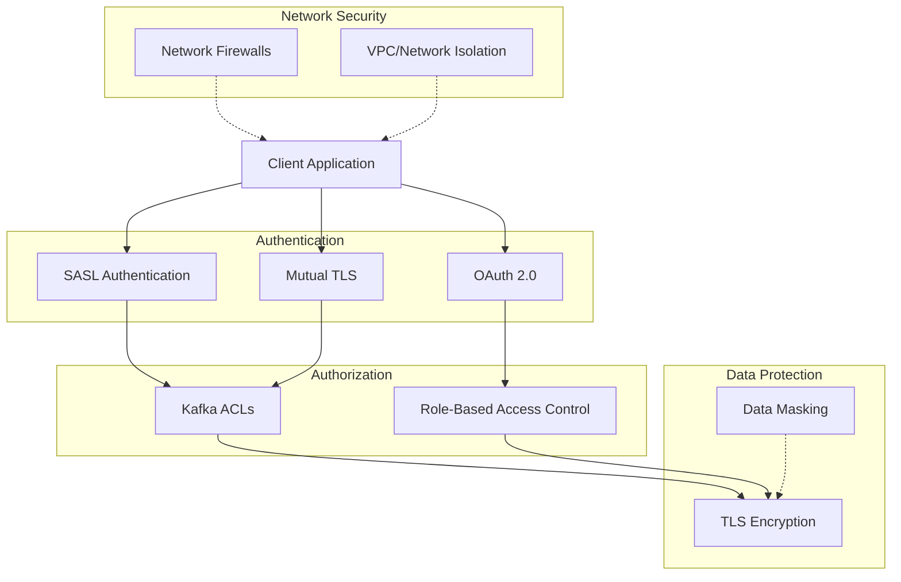

# Access Control Policies

## Overview

Access control policies define how authentication, authorization, and permissions are managed within the Event Broker ecosystem. This document outlines the framework for securing access to Kafka clusters, topics, and related components in healthcare environments, ensuring data protection while enabling appropriate access for legitimate use cases.

## Access Control Architecture

The Event Broker implements a defense-in-depth approach to access control with multiple security layers:



## Authentication Policies

### Authentication Methods

The Event Broker supports multiple authentication methods:

| Method | Use Case | Configuration |
|--------|----------|---------------|
| SASL/SCRAM | Default for service-to-service | Strong password policies, credential rotation |
| Mutual TLS | High-security environments | Certificate management, automated rotation |
| OAuth 2.0 | Integration with enterprise IdP | Token validation, scope restrictions |

### SASL/SCRAM Configuration

```properties
# Broker configuration (server.properties)
listeners=SASL_SSL://kafka:9092
security.inter.broker.protocol=SASL_SSL
sasl.mechanism.inter.broker.protocol=SCRAM-SHA-512
sasl.enabled.mechanisms=SCRAM-SHA-512

# JAAS configuration
listener.name.sasl_ssl.scram-sha-512.sasl.jaas.config=org.apache.kafka.common.security.scram.ScramLoginModule required;

# Client configuration
security.protocol=SASL_SSL
sasl.mechanism=SCRAM-SHA-512
sasl.jaas.config=org.apache.kafka.common.security.scram.ScramLoginModule required \
    username="service-account" \
    password="strong-password-here";
```

### Mutual TLS Configuration

```properties
# Broker configuration (server.properties)
listeners=SSL://kafka:9093
ssl.client.auth=required
ssl.keystore.location=/etc/kafka/ssl/kafka.server.keystore.jks
ssl.keystore.password=${KEYSTORE_PASSWORD}
ssl.key.password=${KEY_PASSWORD}
ssl.truststore.location=/etc/kafka/ssl/kafka.server.truststore.jks
ssl.truststore.password=${TRUSTSTORE_PASSWORD}
ssl.enabled.protocols=TLSv1.2,TLSv1.3
ssl.cipher.suites=TLS_AES_256_GCM_SHA384,TLS_CHACHA20_POLY1305_SHA256,TLS_AES_128_GCM_SHA256

# Client configuration
security.protocol=SSL
ssl.keystore.location=/etc/kafka/ssl/client.keystore.jks
ssl.keystore.password=${CLIENT_KEYSTORE_PASSWORD}
ssl.key.password=${CLIENT_KEY_PASSWORD}
ssl.truststore.location=/etc/kafka/ssl/client.truststore.jks
ssl.truststore.password=${CLIENT_TRUSTSTORE_PASSWORD}
```

### OAuth 2.0 Configuration

```properties
# Broker configuration (server.properties)
listeners=SASL_SSL://kafka:9094
sasl.enabled.mechanisms=OAUTHBEARER
sasl.mechanism.inter.broker.protocol=OAUTHBEARER
listener.name.sasl_ssl.oauthbearer.sasl.server.callback.handler.class=io.confluent.kafka.server.plugins.auth.token.TokenBearerValidatorCallbackHandler
listener.name.sasl_ssl.oauthbearer.sasl.jaas.config=org.apache.kafka.common.security.oauthbearer.OAuthBearerLoginModule required \
    publicKeyPath="/etc/kafka/secrets/oauth/public.pem";

# Client configuration
security.protocol=SASL_SSL
sasl.mechanism=OAUTHBEARER
sasl.login.callback.handler.class=io.confluent.kafka.clients.plugins.auth.token.TokenUserLoginCallbackHandler
sasl.jaas.config=org.apache.kafka.common.security.oauthbearer.OAuthBearerLoginModule required \
    clientId="kafka-client" \
    clientSecret="${CLIENT_SECRET}" \
    scope="kafka" \
    tokenEndpointUrl="https://auth.healthcare.example/oauth2/token";
```

### User Management

User management follows these principles:

1. **Service Accounts**: Each application has a dedicated service account
2. **No Shared Credentials**: No sharing of credentials between applications
3. **Automated Provisioning**: User accounts provisioned through automated processes
4. **Regular Rotation**: Credentials rotated on a defined schedule
5. **Least Privilege**: Accounts granted minimum necessary permissions

```bash
# Create a new user with SCRAM authentication
kafka-configs --bootstrap-server kafka:9092 \
  --alter --add-config 'SCRAM-SHA-512=[iterations=8192,password=strong-password]' \
  --entity-type users --entity-name service-account-1

# List all users
kafka-configs --bootstrap-server kafka:9092 \
  --describe --entity-type users --all

# Delete a user
kafka-configs --bootstrap-server kafka:9092 \
  --alter --delete-config 'SCRAM-SHA-512' \
  --entity-type users --entity-name service-account-1
```

## Authorization Policies

### Role-Based Access Control

The Event Broker implements role-based access control with the following standard roles:

| Role | Description | Permissions |
|------|-------------|-------------|
| Cluster Admin | Full administrative access | All cluster operations |
| Topic Admin | Topic management | Create, configure, delete topics |
| Producer | Write access to specific topics | Write to designated topics |
| Consumer | Read access to specific topics | Read from designated topics and use consumer groups |
| Monitor | Monitoring access | Describe cluster and topics, read metrics |

### Access Control Implementation

Access control is implemented through Kafka ACLs:

```bash
# Grant cluster admin permissions
kafka-acls --bootstrap-server kafka:9092 \
  --add --allow-principal User:admin \
  --operation All \
  --cluster

# Grant topic admin permissions for a specific domain
kafka-acls --bootstrap-server kafka:9092 \
  --add --allow-principal User:clinical-admin \
  --operation Create --operation Delete --operation Describe --operation Alter \
  --topic "clinical." \
  --resource-pattern-type prefixed

# Grant producer permissions
kafka-acls --bootstrap-server kafka:9092 \
  --add --allow-principal User:admission-service \
  --operation Write --operation Describe \
  --topic "clinical.patient.admitted"

# Grant consumer permissions
kafka-acls --bootstrap-server kafka:9092 \
  --add --allow-principal User:bed-management-service \
  --operation Read --operation Describe \
  --topic "clinical.patient.admitted" \
  --group "bed-management"

# Grant monitoring permissions
kafka-acls --bootstrap-server kafka:9092 \
  --add --allow-principal User:monitoring-service \
  --operation Describe \
  --topic "*" \
  --resource-pattern-type literal
```

### Healthcare-Specific Access Controls

For healthcare data, additional access controls are implemented:

1. **Data Classification**: Topics are classified by sensitivity level
   - PHI (Protected Health Information)
   - Sensitive (Non-PHI but restricted)
   - Public (Non-sensitive information)

2. **Access Control by Classification**:
   ```bash
   # Grant access to PHI topics
   kafka-acls --bootstrap-server kafka:9092 \
     --add --allow-principal User:authorized-phi-service \
     --operation Read \
     --topic "phi." \
     --resource-pattern-type prefixed
   ```

3. **Purpose-Based Access Control**: Access limited to specific business purposes
   ```bash
   # Grant access for treatment purposes
   kafka-acls --bootstrap-server kafka:9092 \
     --add --allow-principal User:clinical-service \
     --operation Read \
     --topic "clinical.patient.admitted" \
     --command-config purpose=TREATMENT
   ```

## Network Security Policies

### Network Segmentation

The Event Broker environment is segmented into security zones:

1. **Broker Zone**: Contains Kafka brokers and ZooKeeper nodes
2. **Connect Zone**: Contains Kafka Connect workers
3. **Client Zone**: Contains client applications
4. **Management Zone**: Contains administrative tools

```bash
# Example network security group rules
# Broker Zone
allow from Connect Zone to Broker Zone port 9092
allow from Client Zone to Broker Zone port 9092
allow from Management Zone to Broker Zone port 9092

# Connect Zone
allow from Broker Zone to Connect Zone port 8083
allow from Management Zone to Connect Zone port 8083

# Deny all other traffic between zones
```

### TLS Configuration

All network communication must use TLS with:

1. **Minimum TLS Version**: TLS 1.2 or higher
2. **Strong Cipher Suites**: Only AEAD cipher suites
3. **Certificate Validation**: Full validation of certificate chain
4. **Certificate Revocation**: OCSP stapling or CRL checking

```properties
# Broker TLS configuration
ssl.enabled.protocols=TLSv1.2,TLSv1.3
ssl.cipher.suites=TLS_AES_256_GCM_SHA384,TLS_CHACHA20_POLY1305_SHA256,TLS_AES_128_GCM_SHA256
ssl.endpoint.identification.algorithm=HTTPS
ssl.client.auth=required
```

## Data Protection Policies

### Data Classification

All topics must be classified according to sensitivity:

| Classification | Description | Example Topics | Access Requirements |
|----------------|-------------|----------------|---------------------|
| PHI | Contains Protected Health Information | clinical.patient.admitted | Strong authentication, encryption, audit logging |
| Sensitive | Contains sensitive but non-PHI data | administrative.appointment.scheduled | Authentication, encryption |
| Public | Contains non-sensitive data | reference.provider.details | Authentication |

### Data Masking

Sensitive fields must be masked for certain access patterns:

```java
// Example: Data masking transformer
public class PHIMaskingTransformer implements Transformer<String, GenericRecord, KeyValue<String, GenericRecord>> {
    
    @Override
    public KeyValue<String, GenericRecord> transform(String key, GenericRecord value) {
        if (value == null) return new KeyValue<>(key, null);
        
        // Create a copy of the record for modification
        GenericRecord maskedRecord = new GenericData.Record(value.getSchema());
        
        // Copy all fields
        for (Schema.Field field : value.getSchema().getFields()) {
            String fieldName = field.name();
            Object fieldValue = value.get(fieldName);
            
            // Apply masking to sensitive fields
            if (isSensitiveField(fieldName)) {
                fieldValue = maskField(fieldName, fieldValue);
            }
            
            maskedRecord.put(fieldName, fieldValue);
        }
        
        return new KeyValue<>(key, maskedRecord);
    }
    
    private boolean isSensitiveField(String fieldName) {
        return Arrays.asList(
            "ssn", "patientId", "mrn", "address", "phoneNumber", "email"
        ).contains(fieldName);
    }
    
    private Object maskField(String fieldName, Object value) {
        if (value == null) return null;
        
        switch (fieldName) {
            case "ssn":
                return "XXX-XX-" + value.toString().substring(Math.max(0, value.toString().length() - 4));
            case "patientId":
            case "mrn":
                return "XXXXX" + value.toString().substring(Math.max(0, value.toString().length() - 4));
            case "address":
                return "[REDACTED ADDRESS]";
            case "phoneNumber":
                return "XXX-XXX-" + value.toString().substring(Math.max(0, value.toString().length() - 4));
            case "email":
                String email = value.toString();
                int atIndex = email.indexOf('@');
                if (atIndex > 1) {
                    return email.charAt(0) + "..." + email.substring(atIndex);
                }
                return "x...@example.com";
            default:
                return "[REDACTED]";
        }
    }
    
    @Override
    public void close() {
        // No resources to close
    }
    
    @Override
    public void configure(Map<String, ?> configs) {
        // No configuration needed
    }
}
```

## Access Control Monitoring and Audit

### Access Logging

All access to the Event Broker must be logged:

```properties
# Broker audit logging configuration
authorizer.logger.name=kafka.authorizer.logger
log4j.logger.kafka.authorizer.logger=INFO, authorizerAppender
log4j.appender.authorizerAppender=org.apache.log4j.DailyRollingFileAppender
log4j.appender.authorizerAppender.DatePattern='.'yyyy-MM-dd
log4j.appender.authorizerAppender.File=${kafka.logs.dir}/kafka-authorizer.log
log4j.appender.authorizerAppender.layout=org.apache.log4j.PatternLayout
log4j.appender.authorizerAppender.layout.ConversionPattern=[%d] %p %m (%c)%n
```

### Audit Log Format

```json
{
  "timestamp": "2024-03-15T14:22:33Z",
  "principal": "User:admission-service",
  "operation": "WRITE",
  "resourceType": "TOPIC",
  "resourceName": "clinical.patient.admitted",
  "host": "10.0.1.42",
  "allowed": true,
  "requestContext": {
    "correlationId": "12345",
    "clientId": "admission-service-producer-1"
  }
}
```

### Access Review

Regular access reviews must be conducted:

1. **Quarterly Reviews**: Review all access permissions quarterly
2. **User Access Reviews**: Review user access when roles change
3. **Privileged Access Reviews**: Monthly review of administrative access
4. **Unused Account Detection**: Identify and remove unused accounts

```bash
# Generate access review report
kafka-acls --bootstrap-server kafka:9092 \
  --list \
  > kafka-acls-$(date +%Y-%m-%d).txt

# Compare with previous report
diff kafka-acls-$(date +%Y-%m-%d -d "3 months ago").txt kafka-acls-$(date +%Y-%m-%d).txt
```

## Compliance Requirements

### HIPAA Compliance

For HIPAA compliance, the following controls are implemented:

| HIPAA Requirement | Implementation |
|-------------------|----------------|
| Access Controls | Authentication + ACLs + Network Security |
| Audit Controls | Comprehensive logging of all access |
| Integrity Controls | Message validation + TLS |
| Transmission Security | TLS encryption for all communication |
| Unique User Identification | Dedicated service accounts |

### Access Control Documentation

All access control configurations must be documented:

```yaml
# Example access control documentation
topic: clinical.patient.admitted
classification: PHI
owners:
  - team: Clinical Systems
    contact: clinical-systems@healthcare.example
access:
  producers:
    - principal: User:admission-service
      justification: Publishes patient admission events
      approved_by: security-team@healthcare.example
      approved_date: 2024-01-15
  consumers:
    - principal: User:bed-management-service
      justification: Manages bed assignments for admitted patients
      approved_by: security-team@healthcare.example
      approved_date: 2024-01-15
    - principal: User:notification-service
      justification: Sends notifications to care team
      approved_by: security-team@healthcare.example
      approved_date: 2024-01-20
```

## Related Documentation

- [Topic Governance](topic-governance.md): Governance of Kafka topics
- [Schema Registry Management](schema-registry-management.md): Governance of event schemas
- [Security](../04-operations/security.md): Comprehensive security implementation
- [Data Retention & Archiving](data-retention-archiving.md): Data lifecycle management
