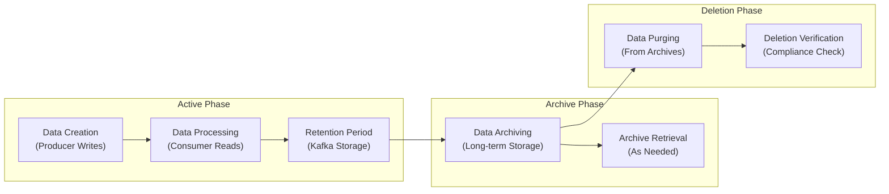

# Data Retention & Archiving

## Overview

Data retention and archiving policies define how healthcare event data is managed throughout its lifecycle in the Event Broker. This document outlines the framework for determining retention periods, implementing retention policies, archiving historical data, and ensuring compliance with healthcare regulations while optimizing storage costs and system performance.

## Data Lifecycle Management

The Event Broker implements a comprehensive data lifecycle management approach that balances operational needs, compliance requirements, and resource optimization:



## Retention Policy Framework

### Retention Categories

Events are categorized based on their retention requirements:

| Category | Description | Example Topics | Default Retention |
|----------|-------------|----------------|-------------------|
| Transient | Short-lived operational data | system.heartbeat.events | 24 hours |
| Operational | Standard operational data | clinical.observation.recorded | 30 days |
| Business Critical | Important business events | financial.claim.submitted | 90 days |
| Compliance | Regulated healthcare data | clinical.consent.recorded | 7 years |
| Permanent | Data that must never be deleted | clinical.patient.registered | Indefinite |

### Regulatory Requirements

Healthcare data retention must comply with various regulations:

| Regulation | Requirement | Affected Data Types |
|------------|-------------|---------------------|
| HIPAA | 6 years minimum | PHI, clinical records |
| State Medical Records | Varies by state (typically 7-10 years) | Clinical documentation |
| Medicare/Medicaid | 10 years for claims data | Billing and claims |
| FDA | 2 years post-marketing for device data | Medical device events |
| DEA | 2 years for controlled substance records | Medication orders |

### Retention Policy Implementation

Retention policies are implemented at the topic level:

```bash
# Set retention for operational data (30 days)
kafka-configs --bootstrap-server kafka:9092 \
  --alter --entity-type topics --entity-name clinical.observation.recorded \
  --add-config retention.ms=2592000000

# Set retention for business critical data (90 days)
kafka-configs --bootstrap-server kafka:9092 \
  --alter --entity-type topics --entity-name financial.claim.submitted \
  --add-config retention.ms=7776000000

# Set retention for compliance data (7 years)
kafka-configs --bootstrap-server kafka:9092 \
  --alter --entity-type topics --entity-name clinical.consent.recorded \
  --add-config retention.ms=220752000000
```

### Retention Documentation

All retention decisions must be documented:

```yaml
# Example retention policy documentation
topic: clinical.consent.recorded
classification: PHI
retention:
  period: 7 years
  justification: HIPAA compliance requirement
  regulatory_references:
    - regulation: HIPAA
      citation: 45 CFR 164.530(j)
  exceptions:
    - condition: State law requires longer retention
      extended_period: Based on state requirements
  approved_by: compliance-team@healthcare.example
  approved_date: 2024-01-15
  review_date: 2025-01-15
```

## Archiving Strategies

### Archiving Criteria

Data is archived based on the following criteria:

1. **Age-Based**: Data older than the retention period
2. **Access Patterns**: Infrequently accessed data
3. **Storage Optimization**: Data consuming significant storage
4. **Compliance Requirements**: Data that must be retained beyond Kafka retention

### Archiving Technologies

The Event Broker supports multiple archiving technologies:

| Technology | Use Case | Configuration |
|------------|----------|---------------|
| S3/Cloud Storage | Default for all archives | Lifecycle policies, encryption |
| HDFS | On-premises big data environments | Replication, encryption |
| Database | Queryable archives | Partitioning, indexing |

### Archiving Implementation

#### Kafka Connect S3 Sink

```json
{
  "name": "s3-archive-sink",
  "config": {
    "connector.class": "io.confluent.connect.s3.S3SinkConnector",
    "tasks.max": "4",
    "topics": "clinical.patient.admitted,clinical.consent.recorded",
    "s3.region": "us-east-1",
    "s3.bucket.name": "healthcare-events-archive",
    "s3.part.size": "5242880",
    "flush.size": "1000",
    "storage.class": "io.confluent.connect.s3.storage.S3Storage",
    "format.class": "io.confluent.connect.s3.format.parquet.ParquetFormat",
    "partitioner.class": "io.confluent.connect.storage.partitioner.TimeBasedPartitioner",
    "path.format": "'year'=YYYY/'month'=MM/'day'=dd/'hour'=HH",
    "locale": "en-US",
    "timezone": "UTC",
    "partition.duration.ms": "3600000",
    "rotate.schedule.interval.ms": "3600000",
    "timestamp.extractor": "RecordField",
    "timestamp.field": "eventTimestamp",
    "s3.compression.type": "gzip",
    "key.converter": "org.apache.kafka.connect.storage.StringConverter",
    "value.converter": "io.confluent.connect.avro.AvroConverter",
    "value.converter.schema.registry.url": "http://schema-registry:8081",
    "s3.encryption.algorithm": "AES256",
    "s3.sse.kms.key.id": "arn:aws:kms:us-east-1:123456789012:key/abcd1234-ab12-cd34-ef56-abcdef123456"
  }
}
```

### Archive Metadata

All archives must include metadata for future retrieval:

```json
{
  "archiveId": "clinical-patient-admitted-2024-01-01-2024-03-31",
  "topic": "clinical.patient.admitted",
  "startOffset": 1000000,
  "endOffset": 2500000,
  "startTimestamp": "2024-01-01T00:00:00Z",
  "endTimestamp": "2024-03-31T23:59:59Z",
  "recordCount": 1500000,
  "compressionFormat": "gzip",
  "dataFormat": "parquet",
  "schemaId": 42,
  "schemaVersion": "1.2.0",
  "storageLocation": "s3://healthcare-events-archive/clinical/patient/admitted/2024-Q1/",
  "archiveDate": "2024-04-01T02:15:30Z",
  "retentionExpiration": "2031-04-01T00:00:00Z",
  "classification": "PHI",
  "encryptionMethod": "AES-256",
  "checksumAlgorithm": "SHA-256",
  "checksum": "e3b0c44298fc1c149afbf4c8996fb92427ae41e4649b934ca495991b7852b855"
}
```

## Data Retrieval

### Archive Indexing

Archives are indexed for efficient retrieval:

1. **Time-Based Indexing**: Archives organized by time periods
2. **Key-Based Indexing**: Indexes created for common lookup keys
3. **Metadata Indexing**: Searchable metadata for all archives

### Retrieval Methods

#### Archive Search API

```bash
# Search archives by date range
curl -X GET "https://archive-api.healthcare.example/search?topic=clinical.patient.admitted&start=2024-01-01&end=2024-03-31" \
  -H "Authorization: Bearer ${TOKEN}"

# Search archives by patient ID
curl -X GET "https://archive-api.healthcare.example/search?topic=clinical.patient.admitted&key=patient-12345" \
  -H "Authorization: Bearer ${TOKEN}"
```

#### Data Restoration

```bash
# Restore data to a recovery topic
curl -X POST "https://archive-api.healthcare.example/restore" \
  -H "Content-Type: application/json" \
  -H "Authorization: Bearer ${TOKEN}" \
  -d '{
    "archiveId": "clinical-patient-admitted-2024-01-01-2024-03-31",
    "destinationTopic": "recovery.clinical.patient.admitted",
    "filterCriteria": {
      "patientId": "patient-12345"
    }
  }'
```

## Compliance and Audit

### Retention Compliance

Regular audits ensure compliance with retention policies:

```bash
#!/bin/bash
# Retention compliance audit script

echo "Running retention compliance audit: $(date)"

# Get all topics
TOPICS=$(kafka-topics --bootstrap-server kafka:9092 --list)

# Check each topic's retention policy
for TOPIC in $TOPICS; do
  echo "Checking topic: $TOPIC"
  
  # Get topic configuration
  CONFIG=$(kafka-configs --bootstrap-server kafka:9092 --entity-type topics --entity-name $TOPIC --describe)
  
  # Extract retention.ms value
  RETENTION=$(echo "$CONFIG" | grep "retention.ms" | awk -F'=' '{print $2}')
  
  if [ -z "$RETENTION" ]; then
    echo "  WARNING: No retention policy set for $TOPIC"
    continue
  fi
  
  # Convert retention to days
  RETENTION_DAYS=$(echo "scale=2; $RETENTION / 86400000" | bc)
  
  # Get topic classification from metadata service
  CLASSIFICATION=$(curl -s "https://topic-registry.healthcare.example/api/topics/$TOPIC" | jq -r '.dataClassification')
  
  # Check compliance based on classification
  case $CLASSIFICATION in
    "PHI")
      if (( $(echo "$RETENTION_DAYS < 2190" | bc -l) )); then
        echo "  VIOLATION: PHI topic $TOPIC has retention of $RETENTION_DAYS days, minimum required is 2190 days (6 years)"
      else
        echo "  COMPLIANT: PHI topic $TOPIC has retention of $RETENTION_DAYS days"
      fi
      ;;
    "Sensitive")
      if (( $(echo "$RETENTION_DAYS < 365" | bc -l) )); then
        echo "  VIOLATION: Sensitive topic $TOPIC has retention of $RETENTION_DAYS days, minimum required is 365 days"
      else
        echo "  COMPLIANT: Sensitive topic $TOPIC has retention of $RETENTION_DAYS days"
      fi
      ;;
    *)
      echo "  INFO: Topic $TOPIC has retention of $RETENTION_DAYS days"
      ;;
  esac
done

echo "Retention compliance audit completed: $(date)"
```

## Storage Optimization

### Compaction Strategies

For reference data, topic compaction is used instead of time-based retention:

```bash
# Configure topic compaction
kafka-configs --bootstrap-server kafka:9092 \
  --alter --entity-type topics --entity-name reference.provider.details \
  --add-config cleanup.policy=compact \
  --add-config min.cleanable.dirty.ratio=0.5 \
  --add-config delete.retention.ms=86400000
```

### Tiered Storage

For cost-effective long-term storage, tiered storage is implemented:

1. **Hot Tier**: Recent data in Kafka (SSD storage)
2. **Warm Tier**: Older data in object storage (S3/Azure Blob)
3. **Cold Tier**: Archived data in cold storage (Glacier/Archive)

## Related Documentation

- [Topic Governance](topic-governance.md): Governance of Kafka topics
- [Schema Registry Management](schema-registry-management.md): Governance of event schemas
- [Access Control Policies](access-control-policies.md): Detailed access control implementation
