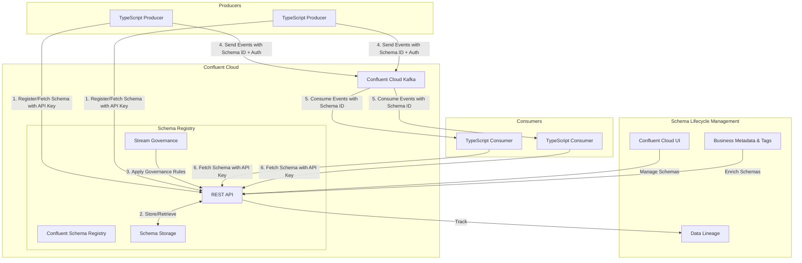

# Schema Registry Management

## Overview

Schema Registry Management provides governance for event schemas within the Event Broker ecosystem, ensuring data quality, compatibility, and evolution. This document outlines the policies, procedures, and best practices for managing schemas in healthcare environments, focusing on maintaining data integrity while enabling controlled schema evolution.

## Confluent Cloud Schema Registry Architecture

Confluent Cloud Schema Registry serves as the central repository for all event schemas, providing validation, compatibility checking, and governance for producers and consumers in a fully-managed cloud environment:



Key differences with Confluent Cloud Schema Registry:

1. **Fully Managed Service**: No infrastructure to maintain or scale
2. **Global Availability**: Multi-region deployment with high availability
3. **Stream Governance**: Advanced schema management with business metadata
4. **API Key Authentication**: Secure access control with API keys
5. **Schema Evolution Rules**: Automated compatibility enforcement
6. **Schema Sharing**: Cross-environment schema reuse
7. **Schema Lifecycle Management**: UI-based schema management
8. **Data Lineage**: Track schema usage across applications

## Schema Governance Principles

### Core Principles

1. **Schema as Contract**: Schemas define the contract between producers and consumers
2. **Compatibility Enforcement**: All schema changes must maintain compatibility with existing consumers
3. **Centralized Management**: All schemas must be registered and managed in the central Schema Registry
4. **Controlled Evolution**: Schema changes follow a defined approval and versioning process
5. **Documentation**: All schemas must include comprehensive documentation
6. **Healthcare Standards Alignment**: Schemas should align with healthcare data standards where applicable

### Schema Ownership Model

Each schema has a designated owner responsible for:

- Maintaining schema documentation
- Reviewing and approving schema changes
- Ensuring schema compatibility
- Coordinating with producers and consumers

## Schema Design Standards

### Schema Format Standards

The Event Broker supports multiple schema formats, each with specific governance requirements:

| Format | Use Case | Governance Requirements |
|--------|----------|-------------------------|
| Apache Avro | Default format for all events | Must include documentation, namespace, and version |
| JSON Schema | REST API integration | Must include $schema, title, and description |
| Protocol Buffers | High-performance use cases | Must include comments and package name |

### Avro Schema Design Guidelines

Avro schemas must follow these design guidelines:

1. **Namespace Convention**: Use reverse domain notation with component path
   ```
   com.healthcare.events.<domain>.<entity>
   ```

2. **Required Metadata Fields**:
   ```json
   {
     "type": "record",
     "namespace": "com.healthcare.events.clinical.patient",
     "name": "AdmittedEvent",
     "doc": "Event emitted when a patient is admitted to a facility",
     "version": "1.0.0",
     "fields": [
       {
         "name": "eventId",
         "type": "string",
         "doc": "Unique identifier for this event instance"
       },
       {
         "name": "eventTimestamp",
         "type": "long",
         "doc": "Timestamp when the event occurred, in milliseconds since epoch"
       },
       {
         "name": "patientId",
         "type": "string",
         "doc": "Unique identifier for the patient"
       }
     ]
   }
   ```

3. **Field Documentation**: All fields must include documentation
4. **Nullable Fields**: Use union types with null as the first type
   ```json
   {
     "name": "dischargeDate",
     "type": ["null", "long"],
     "doc": "Discharge date if known, in milliseconds since epoch",
     "default": null
   }
   ```

5. **Enumerations**: Use Avro enums with documentation
   ```json
   {
     "name": "admissionType",
     "type": {
       "type": "enum",
       "name": "AdmissionType",
       "doc": "Type of patient admission",
       "symbols": ["EMERGENCY", "ELECTIVE", "URGENT", "NEWBORN", "TRANSFER"]
     },
     "doc": "The type of admission"
   }
   ```

6. **Complex Types**: Use nested records with clear documentation
   ```json
   {
     "name": "facility",
     "type": {
       "type": "record",
       "name": "Facility",
       "doc": "Information about the healthcare facility",
       "fields": [
         {
           "name": "facilityId",
           "type": "string",
           "doc": "Unique identifier for the facility"
         },
         {
           "name": "name",
           "type": "string",
           "doc": "Name of the facility"
         }
       ]
     },
     "doc": "The facility where the patient was admitted"
   }
   ```

### Healthcare-Specific Schema Guidelines

For healthcare events, additional guidelines apply:

1. **Patient Context**: Include standardized patient context in all patient-related events
   ```json
   {
     "name": "patientContext",
     "type": {
       "type": "record",
       "name": "PatientContext",
       "doc": "Standard patient context information",
       "fields": [
         {
           "name": "patientId",
           "type": "string",
           "doc": "Enterprise patient identifier"
         },
         {
           "name": "mrn",
           "type": ["null", "string"],
           "doc": "Medical Record Number if available",
           "default": null
         },
         {
           "name": "encounterId",
           "type": ["null", "string"],
           "doc": "Current encounter identifier if applicable",
           "default": null
         }
       ]
     },
     "doc": "Standard patient context for this event"
   }
   ```

2. **Terminology References**: Use standardized coding systems
   ```json
   {
     "name": "diagnosis",
     "type": {
       "type": "record",
       "name": "CodeableConcept",
       "doc": "A coded diagnosis",
       "fields": [
         {
           "name": "code",
           "type": "string",
           "doc": "The diagnosis code"
         },
         {
           "name": "system",
           "type": "string",
           "doc": "The coding system (e.g., ICD-10, SNOMED CT)"
         },
         {
           "name": "display",
           "type": "string",
           "doc": "Human-readable description"
         }
       ]
     },
     "doc": "The patient's diagnosis"
   }
   ```

3. **Date/Time Representation**: Use milliseconds since epoch with timezone information
   ```json
   {
     "name": "admissionDateTime",
     "type": "long",
     "doc": "Admission date and time in milliseconds since epoch"
   },
   {
     "name": "timeZone",
     "type": "string",
     "doc": "Time zone identifier (e.g., 'America/New_York')"
   }
   ```

## Schema Registration Process

### Schema Approval Workflow

All new schemas and schema changes require approval through the following workflow:

1. **Schema Proposal**: Developer submits schema with:
   - Schema definition
   - Documentation
   - Business justification
   - Compatibility requirements

2. **Schema Review**: Schema review board evaluates:
   - Compliance with design standards
   - Documentation completeness
   - Compatibility with existing schemas
   - Alignment with healthcare standards

3. **Schema Testing**: Automated validation of:
   - Syntax correctness
   - Compatibility with previous versions
   - Sample data validation

4. **Schema Approval**: Upon approval:
   - Schema is registered in Schema Registry
   - Documentation is published
   - Producers and consumers are notified

```bash
# Configure Confluent CLI with API keys
confluent login --save

# List all subjects in Confluent Cloud Schema Registry
confluent schema-registry subject list

# Register a new schema
confluent schema-registry schema register --subject clinical.patient.admitted-value \
  --schema ./schemas/patient-admitted.avsc --type AVRO

# Get a specific schema version
confluent schema-registry schema get --subject clinical.patient.admitted-value \
  --version 1

# List all versions of a schema
confluent schema-registry subject describe clinical.patient.admitted-value

# Check compatibility of a new schema version
confluent schema-registry schema validate --subject clinical.patient.admitted-value \
  --schema ./schemas/patient-admitted-v2.avsc --type AVRO

# Set global default compatibility
confluent schema-registry cluster config update --compatibility BACKWARD

# Set subject-specific compatibility
confluent schema-registry subject update clinical.patient.admitted-value \
  --compatibility FULL
```

#### Using TypeScript with Confluent Cloud Schema Registry

```typescript
import { SchemaRegistry, SchemaType } from '@kafkajs/confluent-schema-registry';

// Configure Schema Registry client for Confluent Cloud
const schemaRegistry = new SchemaRegistry({
  host: 'https://schema-registry.confluent.cloud',
  auth: {
    username: '${SCHEMA_REGISTRY_KEY}',
    password: '${SCHEMA_REGISTRY_SECRET}'
  }
});

// Register a new schema
async function registerSchema() {
  const schema = {
    type: 'record',
    namespace: 'com.healthcare.events.clinical.patient',
    name: 'AdmittedEvent',
    doc: 'Event emitted when a patient is admitted to a facility',
    fields: [
      {
        name: 'eventId',
        type: 'string',
        doc: 'Unique identifier for this event instance'
      },
      // Additional fields...
    ]
  };

  try {
    const { id } = await schemaRegistry.register({
      type: SchemaType.AVRO,
      schema: JSON.stringify(schema),
      subject: 'clinical.patient.admitted-value'
    });
    console.log(`Schema registered with ID: ${id}`);
    return id;
  } catch (error) {
    console.error('Failed to register schema:', error);
    throw error;
  }
}

// Get a specific schema version
async function getSchema(subject: string, version: number = -1) {
  try {
    if (version === -1) {
      // Get latest version
      return await schemaRegistry.getLatestSchemaId(subject);
    } else {
      // Get specific version
      return await schemaRegistry.getSchema(version);
    }
  } catch (error) {
    console.error(`Failed to get schema for ${subject}:`, error);
    throw error;
  }
}

// Check compatibility of a new schema
async function checkCompatibility(subject: string, schema: any) {
  try {
    const isCompatible = await schemaRegistry.isCompatible({
      subject,
      version: 'latest',
      schema: JSON.stringify(schema)
    });
    
    console.log(`Schema compatibility check result: ${isCompatible}`);
    return isCompatible;
  } catch (error) {
    console.error('Compatibility check failed:', error);
    throw error;
  }
}

// Set compatibility level
async function setCompatibility(subject: string, compatibility: string) {
  try {
    await schemaRegistry.updateCompatibility({
      subject,
      compatibility // 'BACKWARD', 'FORWARD', 'FULL', 'NONE'
    });
    console.log(`Compatibility for ${subject} set to ${compatibility}`);
  } catch (error) {
    console.error(`Failed to set compatibility for ${subject}:`, error);
    throw error;
  }
}
```

#### Stream Governance Features in Confluent Cloud

Confluent Cloud Schema Registry provides additional Stream Governance features:

1. **Business Metadata**: Add business context to schemas
   ```typescript
   // Add business metadata to a schema
   async function addBusinessMetadata(subject: string) {
     try {
       // Using Confluent Cloud REST API with authentication
       const response = await fetch(
         `https://schema-registry.confluent.cloud/catalog/v1/business-metadata/schemas/${subject}`,
         {
           method: 'POST',
           headers: {
             'Content-Type': 'application/json',
             'Authorization': 'Basic ' + btoa(`${SCHEMA_REGISTRY_KEY}:${SCHEMA_REGISTRY_SECRET}`)
           },
           body: JSON.stringify({
             properties: {
               'data.owner': 'Clinical Systems Team',
               'data.classification': 'PHI',
               'data.retention.period': '7 years',
               'data.domain': 'Clinical',
               'data.criticality': 'High'
             }
           })
         }
       );
       
       const result = await response.json();
       console.log('Business metadata added:', result);
     } catch (error) {
       console.error('Failed to add business metadata:', error);
       throw error;
     }
   }
   ```

2. **Data Lineage**: Track schema usage across applications
   ```typescript
   // Lineage is automatically tracked in Confluent Cloud
   // Access through Confluent Cloud Console UI
   ```

3. **Schema Tagging**: Organize schemas with tags
   ```typescript
   // Add tags to a schema
   async function addTags(subject: string, tags: string[]) {
     try {
       // Using Confluent Cloud REST API with authentication
       const response = await fetch(
         `https://schema-registry.confluent.cloud/catalog/v1/tags/schemas/${subject}`,
         {
           method: 'POST',
           headers: {
             'Content-Type': 'application/json',
             'Authorization': 'Basic ' + btoa(`${SCHEMA_REGISTRY_KEY}:${SCHEMA_REGISTRY_SECRET}`)
           },
           body: JSON.stringify({
             tags: tags.map(tag => ({ name: tag }))
           })
         }
       );
       
       const result = await response.json();
       console.log('Tags added:', result);
     } catch (error) {
       console.error('Failed to add tags:', error);
       throw error;
     }
   }
   ```

## Schema Versioning and Evolution

### Compatibility Types

The Schema Registry supports different compatibility types:

| Compatibility Type | Description | Use Case |
|--------------------|-------------|----------|
| BACKWARD | New schema can read data written with old schema | Default for most schemas |
| FORWARD | Old schema can read data written with new schema | When consumers update slowly |
| FULL | Both backward and forward compatible | Ideal scenario |
| NONE | No compatibility checking | Emergency changes only |

### Setting Compatibility Level

```bash
# Set global default compatibility
curl -X PUT -H "Content-Type: application/vnd.schemaregistry.v1+json" \
  --data '{"compatibility": "BACKWARD"}' \
  http://schema-registry:8081/config

# Set subject-specific compatibility
curl -X PUT -H "Content-Type: application/vnd.schemaregistry.v1+json" \
  --data '{"compatibility": "FULL"}' \
  http://schema-registry:8081/config/clinical.patient.admitted-value
```

### Schema Evolution Guidelines

When evolving schemas, follow these guidelines:

1. **Backward Compatible Changes**:
   - Adding optional fields with defaults
   - Adding fields with null default
   - Removing fields that had a default value

2. **Breaking Changes** (require version coordination):
   - Adding required fields
   - Removing fields without defaults
   - Changing field types
   - Renaming fields

### Semantic Versioning

All schemas follow semantic versioning:

- **Major Version**: Breaking changes (not backward compatible)
- **Minor Version**: New features (backward compatible)
- **Patch Version**: Bug fixes (backward compatible)

```json
{
  "type": "record",
  "namespace": "com.healthcare.events.clinical.patient",
  "name": "AdmittedEvent",
  "doc": "Event emitted when a patient is admitted to a facility",
  "version": "2.1.0",
  "fields": [
    // Schema fields
  ]
}
```

## Schema Documentation

### Documentation Requirements

All schemas must include:

1. **Schema-Level Documentation**: Purpose and usage of the schema
2. **Field-Level Documentation**: Description of each field's purpose and format
3. **Version History**: Changes between versions
4. **Sample Data**: Example events using the schema
5. **Producer/Consumer Information**: Applications that produce or consume events

### Documentation Format

```markdown
# PatientAdmittedEvent Schema

## Overview
This schema defines the event emitted when a patient is admitted to a healthcare facility.

## Version: 2.1.0
- **Namespace**: com.healthcare.events.clinical.patient
- **Compatibility**: BACKWARD
- **Created**: 2024-03-15
- **Last Updated**: 2024-05-01

## Version History
- **2.1.0** (2024-05-01): Added admissionReason field
- **2.0.0** (2024-04-15): Added required facility information
- **1.0.0** (2024-03-15): Initial version

## Fields

| Field | Type | Required | Description |
|-------|------|----------|-------------|
| eventId | string | Yes | Unique identifier for this event instance |
| eventTimestamp | long | Yes | Timestamp when the event occurred, in milliseconds since epoch |
| patientId | string | Yes | Unique identifier for the patient |
| encounterId | string | Yes | Unique identifier for the encounter |
| admissionDateTime | long | Yes | Admission date and time in milliseconds since epoch |
| admissionType | enum | Yes | Type of admission: EMERGENCY, ELECTIVE, URGENT, NEWBORN, TRANSFER |
| admissionReason | string | No | Reason for admission, added in v2.1.0 |
| facility | record | Yes | Information about the admitting facility |
| dischargeDateTime | long | No | Discharge date and time if known |

## Sample Data
```json
{
  "eventId": "1234-5678-9012",
  "eventTimestamp": 1683721584000,
  "patientId": "P123456",
  "encounterId": "E789012",
  "admissionDateTime": 1683721200000,
  "admissionType": "EMERGENCY",
  "admissionReason": "Chest pain",
  "facility": {
    "facilityId": "F001",
    "name": "Memorial Hospital"
  },
  "dischargeDateTime": null
}
```

## Producers
- Admission Service (admission-service@example.com)

## Consumers
- Bed Management System (bed-management@example.com)
- Clinical Dashboard (clinical-dashboard@example.com)
- Billing System (billing@example.com)
```

## Confluent Cloud Schema Registry Security

### API Key Authentication and Role-Based Access Control

Confluent Cloud Schema Registry implements a comprehensive security model:

1. **API Key Authentication**: Secure access using API keys
   ```typescript
   // Configure Schema Registry client with API key authentication
   import { SchemaRegistry } from '@kafkajs/confluent-schema-registry';
   
   const schemaRegistry = new SchemaRegistry({
     host: 'https://schema-registry.confluent.cloud',
     auth: {
       username: '${SCHEMA_REGISTRY_KEY}', // API Key
       password: '${SCHEMA_REGISTRY_SECRET}' // API Secret
     }
   });
   ```

2. **Role-Based Access Control**: Granular permissions through Confluent Cloud IAM
   ```bash
   # Using Confluent CLI to manage access
   
   # Create a service account for schema registry access
   confluent iam service-account create schema-registry-app --description "Schema Registry Application"
   
   # Create an API key for the service account
   confluent api-key create --service-account schema-registry-app --resource schema-registry
   
   # Assign role bindings
   confluent iam rbac role-binding create --principal User:schema-registry-app \
     --role ResourceOwner --resource Subject:clinical.patient.admitted-value
   ```

3. **Granular Access Control**: Control access at the subject level
   ```bash
   # Grant read-only access to specific subjects
   confluent iam rbac role-binding create --principal User:analytics-team \
     --role DeveloperRead --resource Subject:clinical.patient.admitted-value
   
   # Grant write access to specific subjects
   confluent iam rbac role-binding create --principal User:clinical-team \
     --role DeveloperWrite --resource Subject:clinical.patient.admitted-value
   ```

### Schema Registry API Security with TypeScript

```typescript
// Secure Schema Registry API calls with TypeScript
import axios from 'axios';

// Function to securely access Schema Registry
async function getSchemaVersion(subject: string, version: string = 'latest') {
  try {
    // Create basic auth header from API key and secret
    const auth = Buffer.from(`${process.env.SCHEMA_REGISTRY_KEY}:${process.env.SCHEMA_REGISTRY_SECRET}`).toString('base64');
    
    const response = await axios({
      method: 'GET',
      url: `https://schema-registry.confluent.cloud/subjects/${subject}/versions/${version}`,
      headers: {
        'Content-Type': 'application/vnd.schemaregistry.v1+json',
        'Authorization': `Basic ${auth}`
      }
    });
    
    return response.data;
  } catch (error) {
    console.error(`Error accessing schema registry: ${error.message}`);
    if (error.response) {
      console.error(`Status: ${error.response.status}, Data: ${JSON.stringify(error.response.data)}`);
    }
    throw error;
  }
}

// Example usage
async function main() {
  try {
    const schema = await getSchemaVersion('clinical.patient.admitted-value');
    console.log('Retrieved schema:', schema);
  } catch (error) {
    console.error('Failed to retrieve schema:', error);
  }
}
```

### Advanced Security Features in Confluent Cloud

1. **Private Networking**: Secure Schema Registry access with private networking
   ```bash
   # Configure private networking for Schema Registry
   confluent network private-link create schema-registry \
     --cloud aws --region us-west-2
   ```

2. **Audit Logging**: Track all Schema Registry access and changes
   ```bash
   # Enable audit logging for Schema Registry
   confluent audit-log create --resource schema-registry \
     --destination-topic security.schema-registry.audit
   ```

3. **IP Filtering**: Restrict Schema Registry access by IP address
   ```bash
   # Configure IP filtering for Schema Registry
   confluent network ip-filter create --service schema-registry \
     --cidr 192.168.1.0/24 --description "Corporate Network"
   ```

4. **Encryption**: All data in transit is encrypted with TLS 1.2+
   ```typescript
   // TLS is automatically enabled for all Confluent Cloud connections
   // No additional configuration required
   ```

## Compliance and Audit

### Schema Audit Requirements

All schema registry actions must be logged for audit purposes:

- Schema registration and updates
- Compatibility checks
- Access control changes
- Schema deletions

### Audit Log Format

```json
{
  "timestamp": "2024-03-15T14:22:33Z",
  "action": "SCHEMA_REGISTER",
  "user": "john.smith@example.com",
  "subject": "clinical.patient.admitted-value",
  "version": 2,
  "details": {
    "compatibility": "BACKWARD",
    "schemaType": "AVRO"
  },
  "approvals": [
    {
      "approver": "schema-reviewer@example.com",
      "timestamp": "2024-03-14T16:45:10Z"
    }
  ]
}
```

## Schema Quality Metrics

Schemas are monitored for the following quality metrics:

| Metric | Description | Target | Alert Threshold |
|--------|-------------|--------|-----------------|
| Documentation Coverage | Percentage of fields with documentation | 100% | <95% |
| Compatibility Violations | Number of compatibility violations | 0 | >0 |
| Schema Validation Errors | Percentage of messages failing validation | 0% | >0.1% |
| Schema Evolution Frequency | Number of schema changes per month | <5 | >10 |

## Related Documentation

- [Topic Governance](topic-governance.md): Governance of Kafka topics
- [Access Control Policies](access-control-policies.md): Detailed access control implementation
- [Event Schemas](../02-core-functionality/event-schemas.md): Technical aspects of schema design
