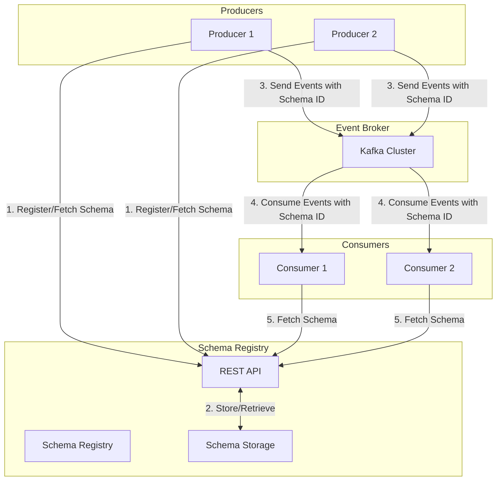

# Schema Registry Management

## Overview

Schema Registry Management provides governance for event schemas within the Event Broker ecosystem, ensuring data quality, compatibility, and evolution. This document outlines the policies, procedures, and best practices for managing schemas in healthcare environments, focusing on maintaining data integrity while enabling controlled schema evolution.

## Schema Registry Architecture

The Schema Registry serves as the central repository for all event schemas, providing validation and compatibility checking for producers and consumers:



## Schema Governance Principles

### Core Principles

1. **Schema as Contract**: Schemas define the contract between producers and consumers
2. **Compatibility Enforcement**: All schema changes must maintain compatibility with existing consumers
3. **Centralized Management**: All schemas must be registered and managed in the central Schema Registry
4. **Controlled Evolution**: Schema changes follow a defined approval and versioning process
5. **Documentation**: All schemas must include comprehensive documentation
6. **Healthcare Standards Alignment**: Schemas should align with healthcare data standards where applicable

### Schema Ownership Model

Each schema has a designated owner responsible for:

- Maintaining schema documentation
- Reviewing and approving schema changes
- Ensuring schema compatibility
- Coordinating with producers and consumers

## Schema Design Standards

### Schema Format Standards

The Event Broker supports multiple schema formats, each with specific governance requirements:

| Format | Use Case | Governance Requirements |
|--------|----------|-------------------------|
| Apache Avro | Default format for all events | Must include documentation, namespace, and version |
| JSON Schema | REST API integration | Must include $schema, title, and description |
| Protocol Buffers | High-performance use cases | Must include comments and package name |

### Avro Schema Design Guidelines

Avro schemas must follow these design guidelines:

1. **Namespace Convention**: Use reverse domain notation with component path
   ```
   com.healthcare.events.<domain>.<entity>
   ```

2. **Required Metadata Fields**:
   ```json
   {
     "type": "record",
     "namespace": "com.healthcare.events.clinical.patient",
     "name": "AdmittedEvent",
     "doc": "Event emitted when a patient is admitted to a facility",
     "version": "1.0.0",
     "fields": [
       {
         "name": "eventId",
         "type": "string",
         "doc": "Unique identifier for this event instance"
       },
       {
         "name": "eventTimestamp",
         "type": "long",
         "doc": "Timestamp when the event occurred, in milliseconds since epoch"
       },
       {
         "name": "patientId",
         "type": "string",
         "doc": "Unique identifier for the patient"
       }
     ]
   }
   ```

3. **Field Documentation**: All fields must include documentation
4. **Nullable Fields**: Use union types with null as the first type
   ```json
   {
     "name": "dischargeDate",
     "type": ["null", "long"],
     "doc": "Discharge date if known, in milliseconds since epoch",
     "default": null
   }
   ```

5. **Enumerations**: Use Avro enums with documentation
   ```json
   {
     "name": "admissionType",
     "type": {
       "type": "enum",
       "name": "AdmissionType",
       "doc": "Type of patient admission",
       "symbols": ["EMERGENCY", "ELECTIVE", "URGENT", "NEWBORN", "TRANSFER"]
     },
     "doc": "The type of admission"
   }
   ```

6. **Complex Types**: Use nested records with clear documentation
   ```json
   {
     "name": "facility",
     "type": {
       "type": "record",
       "name": "Facility",
       "doc": "Information about the healthcare facility",
       "fields": [
         {
           "name": "facilityId",
           "type": "string",
           "doc": "Unique identifier for the facility"
         },
         {
           "name": "name",
           "type": "string",
           "doc": "Name of the facility"
         }
       ]
     },
     "doc": "The facility where the patient was admitted"
   }
   ```

### Healthcare-Specific Schema Guidelines

For healthcare events, additional guidelines apply:

1. **Patient Context**: Include standardized patient context in all patient-related events
   ```json
   {
     "name": "patientContext",
     "type": {
       "type": "record",
       "name": "PatientContext",
       "doc": "Standard patient context information",
       "fields": [
         {
           "name": "patientId",
           "type": "string",
           "doc": "Enterprise patient identifier"
         },
         {
           "name": "mrn",
           "type": ["null", "string"],
           "doc": "Medical Record Number if available",
           "default": null
         },
         {
           "name": "encounterId",
           "type": ["null", "string"],
           "doc": "Current encounter identifier if applicable",
           "default": null
         }
       ]
     },
     "doc": "Standard patient context for this event"
   }
   ```

2. **Terminology References**: Use standardized coding systems
   ```json
   {
     "name": "diagnosis",
     "type": {
       "type": "record",
       "name": "CodeableConcept",
       "doc": "A coded diagnosis",
       "fields": [
         {
           "name": "code",
           "type": "string",
           "doc": "The diagnosis code"
         },
         {
           "name": "system",
           "type": "string",
           "doc": "The coding system (e.g., ICD-10, SNOMED CT)"
         },
         {
           "name": "display",
           "type": "string",
           "doc": "Human-readable description"
         }
       ]
     },
     "doc": "The patient's diagnosis"
   }
   ```

3. **Date/Time Representation**: Use milliseconds since epoch with timezone information
   ```json
   {
     "name": "admissionDateTime",
     "type": "long",
     "doc": "Admission date and time in milliseconds since epoch"
   },
   {
     "name": "timeZone",
     "type": "string",
     "doc": "Time zone identifier (e.g., 'America/New_York')"
   }
   ```

## Schema Registration Process

### Schema Approval Workflow

All new schemas and schema changes require approval through the following workflow:

1. **Schema Proposal**: Developer submits schema with:
   - Schema definition
   - Documentation
   - Business justification
   - Compatibility requirements

2. **Schema Review**: Schema review board evaluates:
   - Compliance with design standards
   - Documentation completeness
   - Compatibility with existing schemas
   - Alignment with healthcare standards

3. **Schema Testing**: Automated validation of:
   - Syntax correctness
   - Compatibility with previous versions
   - Sample data validation

4. **Schema Approval**: Upon approval:
   - Schema is registered in Schema Registry
   - Documentation is published
   - Producers and consumers are notified

### Schema Registration API

```bash
# Register a new schema
curl -X POST -H "Content-Type: application/vnd.schemaregistry.v1+json" \
  --data '{"schema": "{\"type\":\"record\",\"name\":\"PatientAdmittedEvent\",\"namespace\":\"com.healthcare.events.clinical.patient\",\"doc\":\"Event emitted when a patient is admitted\",\"fields\":[{\"name\":\"eventId\",\"type\":\"string\"}]}"}' \
  http://schema-registry:8081/subjects/clinical.patient.admitted-value/versions

# Get a specific version of a schema
curl -X GET http://schema-registry:8081/subjects/clinical.patient.admitted-value/versions/1

# List all versions of a schema
curl -X GET http://schema-registry:8081/subjects/clinical.patient.admitted-value/versions

# Check compatibility of a new schema version
curl -X POST -H "Content-Type: application/vnd.schemaregistry.v1+json" \
  --data '{"schema": "{\"type\":\"record\",\"name\":\"PatientAdmittedEvent\",\"namespace\":\"com.healthcare.events.clinical.patient\",\"doc\":\"Event emitted when a patient is admitted\",\"fields\":[{\"name\":\"eventId\",\"type\":\"string\"},{\"name\":\"timestamp\",\"type\":\"long\"}]}"}' \
  http://schema-registry:8081/compatibility/subjects/clinical.patient.admitted-value/versions/latest
```

## Schema Versioning and Evolution

### Compatibility Types

The Schema Registry supports different compatibility types:

| Compatibility Type | Description | Use Case |
|--------------------|-------------|----------|
| BACKWARD | New schema can read data written with old schema | Default for most schemas |
| FORWARD | Old schema can read data written with new schema | When consumers update slowly |
| FULL | Both backward and forward compatible | Ideal scenario |
| NONE | No compatibility checking | Emergency changes only |

### Setting Compatibility Level

```bash
# Set global default compatibility
curl -X PUT -H "Content-Type: application/vnd.schemaregistry.v1+json" \
  --data '{"compatibility": "BACKWARD"}' \
  http://schema-registry:8081/config

# Set subject-specific compatibility
curl -X PUT -H "Content-Type: application/vnd.schemaregistry.v1+json" \
  --data '{"compatibility": "FULL"}' \
  http://schema-registry:8081/config/clinical.patient.admitted-value
```

### Schema Evolution Guidelines

When evolving schemas, follow these guidelines:

1. **Backward Compatible Changes**:
   - Adding optional fields with defaults
   - Adding fields with null default
   - Removing fields that had a default value

2. **Breaking Changes** (require version coordination):
   - Adding required fields
   - Removing fields without defaults
   - Changing field types
   - Renaming fields

### Semantic Versioning

All schemas follow semantic versioning:

- **Major Version**: Breaking changes (not backward compatible)
- **Minor Version**: New features (backward compatible)
- **Patch Version**: Bug fixes (backward compatible)

```json
{
  "type": "record",
  "namespace": "com.healthcare.events.clinical.patient",
  "name": "AdmittedEvent",
  "doc": "Event emitted when a patient is admitted to a facility",
  "version": "2.1.0",
  "fields": [
    // Schema fields
  ]
}
```

## Schema Documentation

### Documentation Requirements

All schemas must include:

1. **Schema-Level Documentation**: Purpose and usage of the schema
2. **Field-Level Documentation**: Description of each field's purpose and format
3. **Version History**: Changes between versions
4. **Sample Data**: Example events using the schema
5. **Producer/Consumer Information**: Applications that produce or consume events

### Documentation Format

```markdown
# PatientAdmittedEvent Schema

## Overview
This schema defines the event emitted when a patient is admitted to a healthcare facility.

## Version: 2.1.0
- **Namespace**: com.healthcare.events.clinical.patient
- **Compatibility**: BACKWARD
- **Created**: 2024-03-15
- **Last Updated**: 2024-05-01

## Version History
- **2.1.0** (2024-05-01): Added admissionReason field
- **2.0.0** (2024-04-15): Added required facility information
- **1.0.0** (2024-03-15): Initial version

## Fields

| Field | Type | Required | Description |
|-------|------|----------|-------------|
| eventId | string | Yes | Unique identifier for this event instance |
| eventTimestamp | long | Yes | Timestamp when the event occurred, in milliseconds since epoch |
| patientId | string | Yes | Unique identifier for the patient |
| encounterId | string | Yes | Unique identifier for the encounter |
| admissionDateTime | long | Yes | Admission date and time in milliseconds since epoch |
| admissionType | enum | Yes | Type of admission: EMERGENCY, ELECTIVE, URGENT, NEWBORN, TRANSFER |
| admissionReason | string | No | Reason for admission, added in v2.1.0 |
| facility | record | Yes | Information about the admitting facility |
| dischargeDateTime | long | No | Discharge date and time if known |

## Sample Data
```json
{
  "eventId": "1234-5678-9012",
  "eventTimestamp": 1683721584000,
  "patientId": "P123456",
  "encounterId": "E789012",
  "admissionDateTime": 1683721200000,
  "admissionType": "EMERGENCY",
  "admissionReason": "Chest pain",
  "facility": {
    "facilityId": "F001",
    "name": "Memorial Hospital"
  },
  "dischargeDateTime": null
}
```

## Producers
- Admission Service (admission-service@example.com)

## Consumers
- Bed Management System (bed-management@example.com)
- Clinical Dashboard (clinical-dashboard@example.com)
- Billing System (billing@example.com)
```

## Schema Registry Security

### Authentication and Authorization

The Schema Registry must implement:

1. **Authentication**: All clients must authenticate
   ```properties
   # Schema Registry security configuration
   authentication.method=BASIC
   authentication.realm=SchemaRegistry
   authentication.roles=SCHEMA_REGISTRY_ADMIN,SCHEMA_REGISTRY_USER,SCHEMA_REGISTRY_READ_ONLY
   ```

2. **Authorization**: Role-based access control
   ```properties
   # Schema Registry authorization configuration
   authorizer.class.name=io.confluent.kafka.schemaregistry.security.authorizer.SchemaRegistryAuthorizer
   ```

3. **Access Control Rules**:
   ```
   # Grant admin access
   schema-registry-security-plugin principal.roles=admin:SCHEMA_REGISTRY_ADMIN
   
   # Grant write access to specific teams
   schema-registry-security-plugin principal.roles=clinical-team:SCHEMA_REGISTRY_USER
   
   # Grant read-only access
   schema-registry-security-plugin principal.roles=analytics-team:SCHEMA_REGISTRY_READ_ONLY
   ```

### Schema Registry API Security

```bash
# Secure Schema Registry API calls
curl -X GET --user clinical-team:password \
  -H "Content-Type: application/vnd.schemaregistry.v1+json" \
  https://schema-registry:8081/subjects/clinical.patient.admitted-value/versions/latest
```

## Compliance and Audit

### Schema Audit Requirements

All schema registry actions must be logged for audit purposes:

- Schema registration and updates
- Compatibility checks
- Access control changes
- Schema deletions

### Audit Log Format

```json
{
  "timestamp": "2024-03-15T14:22:33Z",
  "action": "SCHEMA_REGISTER",
  "user": "john.smith@example.com",
  "subject": "clinical.patient.admitted-value",
  "version": 2,
  "details": {
    "compatibility": "BACKWARD",
    "schemaType": "AVRO"
  },
  "approvals": [
    {
      "approver": "schema-reviewer@example.com",
      "timestamp": "2024-03-14T16:45:10Z"
    }
  ]
}
```

## Schema Quality Metrics

Schemas are monitored for the following quality metrics:

| Metric | Description | Target | Alert Threshold |
|--------|-------------|--------|-----------------|
| Documentation Coverage | Percentage of fields with documentation | 100% | <95% |
| Compatibility Violations | Number of compatibility violations | 0 | >0 |
| Schema Validation Errors | Percentage of messages failing validation | 0% | >0.1% |
| Schema Evolution Frequency | Number of schema changes per month | <5 | >10 |

## Related Documentation

- [Topic Governance](topic-governance.md): Governance of Kafka topics
- [Access Control Policies](access-control-policies.md): Detailed access control implementation
- [Event Schemas](../02-core-functionality/event-schemas.md): Technical aspects of schema design
