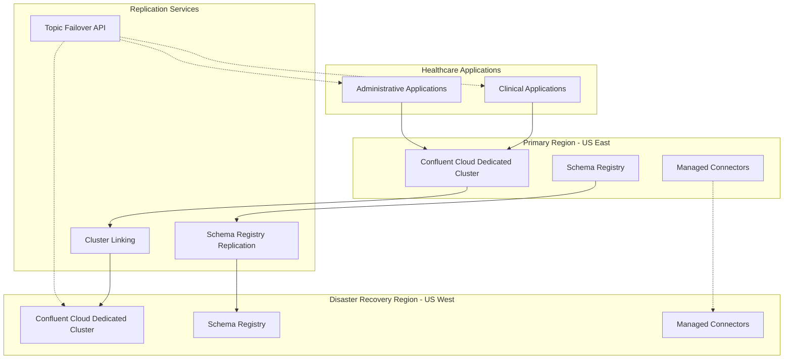
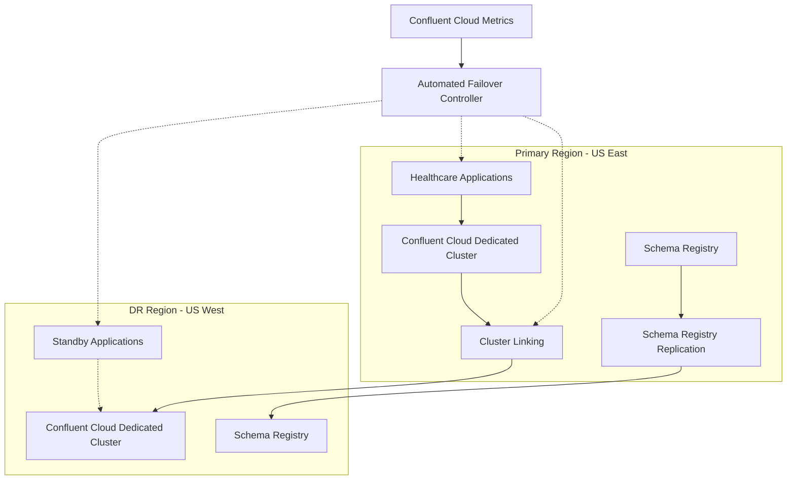
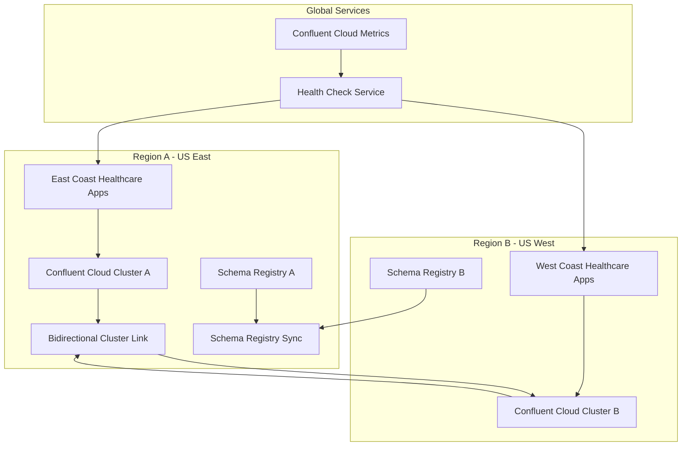

# Disaster Recovery

## Overview

Disaster recovery is essential for ensuring business continuity in the event of system failures or catastrophic events. This document covers disaster recovery strategies for the Event Broker using Confluent Cloud, focusing on multi-region deployments, cluster linking, and automated failover processes to minimize data loss and downtime in healthcare environments. The approaches outlined here leverage Confluent Cloud's managed services to simplify disaster recovery implementation while meeting strict healthcare compliance requirements.

## Confluent Cloud Disaster Recovery Architecture

The Confluent Cloud disaster recovery architecture leverages cloud-native capabilities for healthcare environments:



### Key Components

1. **Dedicated Clusters**: Confluent Cloud Dedicated clusters in separate regions with guaranteed performance and isolation

2. **Cluster Linking**: Native Confluent Cloud service that replicates topics between clusters with exactly-once semantics

3. **Multi-Region Schema Registry**: Ensures schemas are synchronized across regions

4. **Managed Connectors**: Pre-configured connectors that can be quickly redeployed in the DR region

5. **Topic Failover API**: Programmatic control for redirecting applications during failover

6. **Metrics and Monitoring**: Unified monitoring across all regions with alerting for replication lag

## Replication Strategies in Confluent Cloud

### Cluster Linking

Confluent Cloud Cluster Linking provides native, managed cross-region replication with zero operational overhead:

```typescript
// Example: TypeScript code to configure Cluster Linking in Confluent Cloud
import axios from 'axios';

// Configure authentication
const apiKey = process.env.CONFLUENT_CLOUD_API_KEY;
const apiSecret = process.env.CONFLUENT_CLOUD_API_SECRET;
const auth = Buffer.from(`${apiKey}:${apiSecret}`).toString('base64');

/**
 * Create a cluster link between primary and DR clusters
 */
async function createClusterLink(
  environmentId: string,
  sourceClusterId: string,
  destinationClusterId: string,
  linkName: string = 'primary-to-dr'
): Promise<void> {
  try {
    console.log(`Creating cluster link from ${sourceClusterId} to ${destinationClusterId}...`);
    
    // Step 1: Create service accounts for source and destination clusters
    const serviceAccountResponse = await axios({
      method: 'POST',
      url: 'https://api.confluent.cloud/iam/v2/service-accounts',
      headers: {
        'Content-Type': 'application/json',
        'Authorization': `Basic ${auth}`
      },
      data: {
        display_name: `cluster-link-${linkName}`,
        description: 'Service account for cluster linking'
      }
    });
    
    const serviceAccountId = serviceAccountResponse.data.id;
    console.log(`Created service account: ${serviceAccountId}`);
    
    // Step 2: Create API keys for source and destination clusters
    const sourceApiKeyResponse = await axios({
      method: 'POST',
      url: 'https://api.confluent.cloud/iam/v2/api-keys',
      headers: {
        'Content-Type': 'application/json',
        'Authorization': `Basic ${auth}`
      },
      data: {
        spec: {
          display_name: `${linkName}-source-key`,
          description: 'API key for source cluster',
          owner: {
            id: serviceAccountId,
            kind: 'ServiceAccount'
          },
          resource: {
            id: sourceClusterId,
            kind: 'Cluster',
            environment: {
              id: environmentId
            }
          }
        }
      }
    });
    
    const sourceApiKey = sourceApiKeyResponse.data.spec.key;
    const sourceApiSecret = sourceApiKeyResponse.data.spec.secret;
    
    const destApiKeyResponse = await axios({
      method: 'POST',
      url: 'https://api.confluent.cloud/iam/v2/api-keys',
      headers: {
        'Content-Type': 'application/json',
        'Authorization': `Basic ${auth}`
      },
      data: {
        spec: {
          display_name: `${linkName}-destination-key`,
          description: 'API key for destination cluster',
          owner: {
            id: serviceAccountId,
            kind: 'ServiceAccount'
          },
          resource: {
            id: destinationClusterId,
            kind: 'Cluster',
            environment: {
              id: environmentId
            }
          }
        }
      }
    });
    
    const destApiKey = destApiKeyResponse.data.spec.key;
    const destApiSecret = destApiKeyResponse.data.spec.secret;
    
    // Step 3: Create the cluster link
    const clusterLinkResponse = await axios({
      method: 'POST',
      url: `https://api.confluent.cloud/kafka/v3/clusters/${sourceClusterId}/links`,
      headers: {
        'Content-Type': 'application/json',
        'Authorization': `Basic ${auth}`
      },
      data: {
        spec: {
          name: linkName,
          source_cluster_id: sourceClusterId,
          destination_cluster_id: destinationClusterId,
          link_mode: 'BIDIRECTIONAL', // For active-active setup
          connection_mode: 'INBOUND',
          configs: [
            {
              name: 'acl.sync.enable',
              value: 'true'
            },
            {
              name: 'consumer.offset.sync.enable',
              value: 'true'
            },
            {
              name: 'topic.config.sync.enable',
              value: 'true'
            }
          ]
        }
      }
    });
    
    console.log(`Cluster link created: ${clusterLinkResponse.data.id}`);
    
    // Step 4: Create mirror topics for healthcare data
    await createMirrorTopics(sourceClusterId, destinationClusterId, linkName, [
      'clinical.patient.events',
      'clinical.observation.recorded',
      'administrative.appointment.events'
    ]);
    
  } catch (error) {
    console.error('Error creating cluster link:', error.response?.data || error.message);
    throw error;
  }
}

/**
 * Create mirror topics for healthcare data
 */
async function createMirrorTopics(
  sourceClusterId: string,
  destinationClusterId: string,
  linkName: string,
  topics: string[]
): Promise<void> {
  try {
    for (const topic of topics) {
      console.log(`Creating mirror topic for ${topic}...`);
      
      await axios({
        method: 'POST',
        url: `https://api.confluent.cloud/kafka/v3/clusters/${destinationClusterId}/mirror-topics`,
        headers: {
          'Content-Type': 'application/json',
          'Authorization': `Basic ${auth}`
        },
        data: {
          spec: {
            source_topic_name: topic,
            link_name: linkName,
            replication_factor: 3,
            configs: [
              {
                name: 'cleanup.policy',
                value: 'delete'
              },
              {
                name: 'retention.ms',
                value: '604800000' // 7 days
              }
            ]
          }
        }
      });
      
      console.log(`Mirror topic created for ${topic}`);
    }
  } catch (error) {
    console.error('Error creating mirror topics:', error.response?.data || error.message);
    throw error;
  }
}
```

### Multi-Region Schema Registry

Confluent Cloud Schema Registry supports multi-region deployment for disaster recovery:

```typescript
// Example: TypeScript code to configure multi-region Schema Registry
import { SchemaRegistry } from '@kafkajs/confluent-schema-registry';

// Configure primary region Schema Registry
const primarySchemaRegistry = new SchemaRegistry({
  host: process.env.PRIMARY_SCHEMA_REGISTRY_URL!,
  auth: {
    username: process.env.PRIMARY_SR_API_KEY!,
    password: process.env.PRIMARY_SR_API_SECRET!
  }
});

// Configure DR region Schema Registry
const drSchemaRegistry = new SchemaRegistry({
  host: process.env.DR_SCHEMA_REGISTRY_URL!,
  auth: {
    username: process.env.DR_SR_API_KEY!,
    password: process.env.DR_SR_API_SECRET!
  }
});

/**
 * Function to register a schema in both regions
 */
async function registerSchemaInBothRegions(schema: any, subject: string): Promise<void> {
  try {
    // Register in primary region first
    const primaryResult = await primarySchemaRegistry.register(
      { type: 'AVRO', schema: JSON.stringify(schema) },
      { subject }
    );
    console.log(`Schema registered in primary region with ID: ${primaryResult.id}`);
    
    // Register in DR region with same schema ID
    const drResult = await drSchemaRegistry.register(
      { type: 'AVRO', schema: JSON.stringify(schema) },
      { subject }
    );
    console.log(`Schema registered in DR region with ID: ${drResult.id}`);
    
    // Verify schema IDs match
    if (primaryResult.id !== drResult.id) {
      console.warn(`Schema IDs don't match between regions: Primary=${primaryResult.id}, DR=${drResult.id}`);
    }
  } catch (error) {
    console.error(`Error registering schema in both regions: ${error.message}`);
    throw error;
  }
}
```

### Managed Connectors Replication

Confluent Cloud Managed Connectors can be configured for disaster recovery:

```typescript
// Example: TypeScript code to export and import connector configurations
import axios from 'axios';
import * as fs from 'fs';

/**
 * Export connector configurations from primary region
 */
async function exportConnectors(
  primaryConnectClusterId: string,
  environmentId: string
): Promise<Record<string, any>> {
  try {
    console.log('Exporting connector configurations from primary region...');
    
    // Get list of connectors
    const connectorsResponse = await axios({
      method: 'GET',
      url: `https://api.confluent.cloud/connect/v1/environments/${environmentId}/clusters/${primaryConnectClusterId}/connectors`,
      headers: {
        'Content-Type': 'application/json',
        'Authorization': `Basic ${auth}`
      }
    });
    
    const connectors = connectorsResponse.data;
    console.log(`Found ${connectors.length} connectors`);
    
    // Export each connector configuration
    const connectorConfigs: Record<string, any> = {};
    
    for (const connector of connectors) {
      const configResponse = await axios({
        method: 'GET',
        url: `https://api.confluent.cloud/connect/v1/environments/${environmentId}/clusters/${primaryConnectClusterId}/connectors/${connector}/config`,
        headers: {
          'Content-Type': 'application/json',
          'Authorization': `Basic ${auth}`
        }
      });
      
      connectorConfigs[connector] = configResponse.data;
      console.log(`Exported configuration for connector: ${connector}`);
    }
    
    // Save configurations to file for disaster recovery
    fs.writeFileSync(
      'connector-configs.json',
      JSON.stringify(connectorConfigs, null, 2)
    );
    
    return connectorConfigs;
  } catch (error) {
    console.error('Error exporting connectors:', error.response?.data || error.message);
    throw error;
  }
}

/**
 * Import connector configurations to DR region
 */
async function importConnectors(
  drConnectClusterId: string,
  environmentId: string,
  connectorConfigs: Record<string, any>
): Promise<void> {
  try {
    console.log('Importing connector configurations to DR region...');
    
    for (const [connector, config] of Object.entries(connectorConfigs)) {
      console.log(`Importing connector: ${connector}`);
      
      // Create connector with the same configuration
      await axios({
        method: 'POST',
        url: `https://api.confluent.cloud/connect/v1/environments/${environmentId}/clusters/${drConnectClusterId}/connectors`,
        headers: {
          'Content-Type': 'application/json',
          'Authorization': `Basic ${auth}`
        },
        data: {
          name: connector,
          config: config
        }
      });
      
      console.log(`Imported connector: ${connector}`);
    }
  } catch (error) {
    console.error('Error importing connectors:', error.response?.data || error.message);
    
    // Configure authentication
    const auth = Buffer.from(`${apiKey}:${apiSecret}`).toString('base64');
    
    // Create backup object
    const backup: Record<string, any> = {
      backupDate,
      environmentId,
      clusters: {},
      schemaRegistries: {},
      connectors: {},
      serviceAccounts: {},
      apiKeys: {}
    };
    
    // Get Kafka clusters
    const clustersResponse = await axios({
      method: 'GET',
      url: `https://api.confluent.cloud/cmk/v2/environments/${environmentId}/clusters`,
      headers: {
        'Content-Type': 'application/json',
        'Authorization': `Basic ${auth}`
      }
    });
    
    const clusters = clustersResponse.data.data;
    console.log(`Found ${clusters.length} Kafka clusters`);
    
    // Backup each cluster
    for (const cluster of clusters) {
      console.log(`Backing up cluster: ${cluster.id} (${cluster.spec.display_name})`);
      
      backup.clusters[cluster.id] = cluster;
      
      // Get topics for this cluster
      const topicsResponse = await axios({
        method: 'GET',
        url: `https://api.confluent.cloud/kafka/v3/clusters/${cluster.id}/topics`,
        headers: {
          'Content-Type': 'application/json',
          'Authorization': `Basic ${auth}`
        }
      });
      
      backup.clusters[cluster.id].topics = topicsResponse.data.data;
      
      // Get ACLs for this cluster
      try {
        const aclsResponse = await axios({
          method: 'GET',
          url: `https://api.confluent.cloud/kafka/v3/clusters/${cluster.id}/acls`,
          headers: {
            'Content-Type': 'application/json',
            'Authorization': `Basic ${auth}`
          }
        });
        
        backup.clusters[cluster.id].acls = aclsResponse.data.data;
      } catch (error) {
        console.warn(`Could not get ACLs for cluster ${cluster.id}: ${error.message}`);
      }
    }
    
    // Get Schema Registries
    const schemaRegistriesResponse = await axios({
      method: 'GET',
      url: `https://api.confluent.cloud/cmk/v2/environments/${environmentId}/schema-registries`,
      headers: {
        'Content-Type': 'application/json',
        'Authorization': `Basic ${auth}`
      }
    });
    
    const schemaRegistries = schemaRegistriesResponse.data.data || [];
    console.log(`Found ${schemaRegistries.length} Schema Registries`);
    
    for (const sr of schemaRegistries) {
      backup.schemaRegistries[sr.id] = sr;
    }
    
    // Get Kafka Connect clusters
    const connectClustersResponse = await axios({
      method: 'GET',
      url: `https://api.confluent.cloud/connect/v1/environments/${environmentId}/clusters`,
      headers: {
        'Content-Type': 'application/json',
        'Authorization': `Basic ${auth}`
      }
    });
    
    const connectClusters = connectClustersResponse.data || [];
    console.log(`Found ${connectClusters.length} Connect clusters`);
    
    // Backup each Connect cluster and its connectors
    for (const connectCluster of connectClusters) {
      backup.connectors[connectCluster.id] = {
        cluster: connectCluster,
        connectors: {}
      };
      
      // Get connectors for this cluster
      const connectorsResponse = await axios({
        method: 'GET',
        url: `https://api.confluent.cloud/connect/v1/environments/${environmentId}/clusters/${connectCluster.id}/connectors`,
        headers: {
          'Content-Type': 'application/json',
          'Authorization': `Basic ${auth}`
        }
      });
      
      const connectors = connectorsResponse.data || [];
      
      for (const connector of connectors) {
        // Get connector config
        const connectorConfigResponse = await axios({
          method: 'GET',
          url: `https://api.confluent.cloud/connect/v1/environments/${environmentId}/clusters/${connectCluster.id}/connectors/${connector}/config`,
          headers: {
            'Content-Type': 'application/json',
            'Authorization': `Basic ${auth}`
          }
        });
        
        backup.connectors[connectCluster.id].connectors[connector] = connectorConfigResponse.data;
      }
    }
    
    // Save backup to file
    const backupFilePath = path.join(backupDir, 'confluent-cloud-backup.json');
    fs.writeFileSync(
      backupFilePath,
      JSON.stringify(backup, null, 2)
    );
    
    console.log(`Confluent Cloud configuration backup saved to ${backupFilePath}`);
    
  } catch (error) {
    console.error('Error during Confluent Cloud configuration backup:', error);
    throw error;
  }
}
```

## Backup Strategies in Confluent Cloud

### Cloud-Native Backup Approaches

Confluent Cloud provides several mechanisms for data protection and backup:

```typescript
// Example: TypeScript code for backing up critical topics in Confluent Cloud
import { Kafka } from 'kafkajs';
import * as fs from 'fs';
import * as path from 'path';
import { S3Client, PutObjectCommand } from '@aws-sdk/client-s3';

/**
 * Backup critical healthcare topics from Confluent Cloud
 */
async function backupCriticalTopics(
  bootstrapServers: string,
  apiKey: string,
  apiSecret: string,
  s3Bucket: string = 'healthcare-kafka-backups'
): Promise<void> {
  try {
    console.log('Starting backup of critical healthcare topics...');
    
    // Configure Kafka client for Confluent Cloud
    const kafka = new Kafka({
      clientId: 'topic-backup-client',
      brokers: [bootstrapServers],
      ssl: true,
      sasl: {
        mechanism: 'plain',
        username: apiKey,
        password: apiSecret
      }
    });
    
    // Create admin client to list topics
    const admin = kafka.admin();
    await admin.connect();
    
    // Get list of topics
    const topics = await admin.listTopics();
    
    // Filter for healthcare-related topics
    const healthcareTopics = topics.filter(topic => 
      topic.startsWith('clinical.') || 
      topic.startsWith('patient.') || 
      topic.startsWith('healthcare.') ||
      topic.startsWith('administrative.')
    );
    
    console.log(`Found ${healthcareTopics.length} healthcare topics to backup`);
    
    // Create backup directory
    const backupDate = new Date().toISOString().split('T')[0]; // YYYY-MM-DD
    const backupDir = path.join(process.cwd(), 'backups', backupDate);
    fs.mkdirSync(backupDir, { recursive: true });
    
    // Configure S3 client
    const s3Client = new S3Client({
      region: process.env.AWS_REGION || 'us-east-1'
    });
    
    // Create consumer
    const consumer = kafka.consumer({
      groupId: `backup-consumer-${Date.now()}`,
      maxWaitTimeInMs: 5000,
      maxBytes: 5242880 // 5MB
    });
    
    await consumer.connect();
    
    // Process each topic
    for (const topic of healthcareTopics) {
      console.log(`Backing up topic: ${topic}`);
      
      // Get topic metadata
      const topicMetadata = await admin.fetchTopicMetadata({ topics: [topic] });
      const partitionCount = topicMetadata.topics[0].partitions.length;
      
      // Subscribe to topic
      await consumer.subscribe({ topic, fromBeginning: true });
      
      // Create backup file
      const backupFilePath = path.join(backupDir, `${topic}.jsonl`);
      const writeStream = fs.createWriteStream(backupFilePath);
      
      // Track offsets for each partition
      const partitionOffsets = new Map<number, string>();
      
      // Consume messages with timeout
      let messageCount = 0;
      const startTime = Date.now();
      const timeoutMs = 300000; // 5 minutes timeout per topic
      
      await new Promise<void>((resolve, reject) => {
        // Set timeout to prevent hanging
        const timeout = setTimeout(() => {
          console.log(`Timeout reached for topic ${topic}`);
          resolve();
        }, timeoutMs);
        
        consumer.run({
          eachMessage: async ({ topic, partition, message }) => {
            // Store message in JSON format
            const record = {
              topic,
              partition,
              offset: message.offset,
              key: message.key ? message.key.toString() : null,
              value: message.value ? message.value.toString() : null,
              timestamp: message.timestamp,
              headers: message.headers
            };
            
            writeStream.write(JSON.stringify(record) + '
');
            
            // Track latest offset
            partitionOffsets.set(partition, message.offset);
            
            messageCount++;
            
            // Log progress every 10000 messages
            if (messageCount % 10000 === 0) {
              console.log(`Backed up ${messageCount} messages from ${topic}`);
            }
            
            // Check if we've reached the end of all partitions
            if (partitionOffsets.size === partitionCount) {
              // Check if we've consumed for long enough
              if (Date.now() - startTime > 30000) { // At least 30 seconds
                clearTimeout(timeout);
                resolve();
                return;
              }
            }
          }
        });
      });
      
      // Close the file
      writeStream.end();
      
      console.log(`Completed backup of ${messageCount} messages from ${topic}`);
      
      // Upload to S3
      const fileContent = fs.readFileSync(backupFilePath);
      
      await s3Client.send(new PutObjectCommand({
        Bucket: s3Bucket,
        Key: `${backupDate}/${topic}.jsonl`,
        Body: fileContent,
        ContentType: 'application/json',
        Metadata: {
          'topic': topic,
          'message-count': messageCount.toString(),
          'backup-date': backupDate,
          'partition-count': partitionCount.toString()
        }
      }));
      
      console.log(`Uploaded ${topic} backup to S3: ${s3Bucket}/${backupDate}/${topic}.jsonl`);
    }
    
    // Disconnect clients
    await consumer.disconnect();
    await admin.disconnect();
    
    console.log('Backup process completed successfully');
    
  } catch (error) {
    console.error('Error during backup process:', error);
    throw error;
  }
}
```

### Schema Registry Backup

Backup Schema Registry schemas for disaster recovery:

```typescript
// Example: TypeScript code to backup Schema Registry schemas
import axios from 'axios';
import * as fs from 'fs';
import * as path from 'path';

/**
 * Backup all schemas from Schema Registry
 */
async function backupSchemaRegistry(
  schemaRegistryUrl: string,
  apiKey: string,
  apiSecret: string,
  outputDir: string = './schema-backups'
): Promise<void> {
  try {
    console.log('Starting Schema Registry backup...');
    
    // Create backup directory
    const backupDate = new Date().toISOString().split('T')[0]; // YYYY-MM-DD
    const backupDir = path.join(outputDir, backupDate);
    fs.mkdirSync(backupDir, { recursive: true });
    
    // Configure authentication
    const auth = Buffer.from(`${apiKey}:${apiSecret}`).toString('base64');
    
    // Get all subjects
    const subjectsResponse = await axios({
      method: 'GET',
      url: `${schemaRegistryUrl}/subjects`,
      headers: {
        'Content-Type': 'application/json',
        'Authorization': `Basic ${auth}`
      }
    });
    
    const subjects = subjectsResponse.data;
    console.log(`Found ${subjects.length} subjects in Schema Registry`);
    
    // Create a map to store all schemas
    const schemaBackup: Record<string, any> = {
      backupDate,
      schemaRegistryUrl,
      subjects: {}
    };
    
    // Get all versions of each subject
    for (const subject of subjects) {
      console.log(`Backing up subject: ${subject}`);
      
      // Get all versions
      const versionsResponse = await axios({
        method: 'GET',
        url: `${schemaRegistryUrl}/subjects/${subject}/versions`,
        headers: {
          'Content-Type': 'application/json',
          'Authorization': `Basic ${auth}`
        }
      });
      
      const versions = versionsResponse.data;
      schemaBackup.subjects[subject] = {
        versions: {}
      };
      
      // Get each version
      for (const version of versions) {
        const schemaResponse = await axios({
          method: 'GET',
          url: `${schemaRegistryUrl}/subjects/${subject}/versions/${version}`,
          headers: {
            'Content-Type': 'application/json',
            'Authorization': `Basic ${auth}`
          }
        });
        
        schemaBackup.subjects[subject].versions[version] = schemaResponse.data;
      }
      
      // Get subject config
      try {
        const configResponse = await axios({
          method: 'GET',
          url: `${schemaRegistryUrl}/config/${subject}`,
          headers: {
            'Content-Type': 'application/json',
            'Authorization': `Basic ${auth}`
          }
        });
        
        schemaBackup.subjects[subject].config = configResponse.data;
      } catch (error) {
        console.warn(`Could not get config for subject ${subject}: ${error.message}`);
      }
    }
    
    // Get global config
    try {
      const globalConfigResponse = await axios({
        method: 'GET',
        url: `${schemaRegistryUrl}/config`,
        headers: {
          'Content-Type': 'application/json',
          'Authorization': `Basic ${auth}`
        }
      });
      
      schemaBackup.globalConfig = globalConfigResponse.data;
    } catch (error) {
      console.warn(`Could not get global config: ${error.message}`);
    }
    
    // Save backup to file
    const backupFilePath = path.join(backupDir, 'schema-registry-backup.json');
    fs.writeFileSync(
      backupFilePath,
      JSON.stringify(schemaBackup, null, 2)
    );
    
    console.log(`Schema Registry backup saved to ${backupFilePath}`);
    
  } catch (error) {
    console.error('Error during Schema Registry backup:', error);
    throw error;
  }
}
```

### Confluent Cloud Configuration Backup

Backup Confluent Cloud configurations for disaster recovery:

```typescript
// Example: TypeScript code to backup Confluent Cloud configurations
import axios from 'axios';
import * as fs from 'fs';
import * as path from 'path';

/**
 * Backup Confluent Cloud configurations
 */
async function backupConfluentCloudConfig(
  apiKey: string,
  apiSecret: string,
  environmentId: string,
  outputDir: string = './confluent-backups'
): Promise<void> {
  try {
    console.log('Starting Confluent Cloud configuration backup...');
    
    // Create backup directory
    const backupDate = new Date().toISOString().split('T')[0]; // YYYY-MM-DD
    const backupDir = path.join(outputDir, backupDate);
    fs.mkdirSync(backupDir, { recursive: true });
    
    // Configure authentication
    const auth = Buffer.from(`${apiKey}:${apiSecret}`).toString('base64');
    
    // Create backup object
    const backup: Record<string, any> = {
      backupDate,
      environmentId,
      clusters: {},
      schemaRegistries: {},
      connectors: {},
      serviceAccounts: {},
      apiKeys: {}
    };
    
    // Get Kafka clusters
    const clustersResponse = await axios({
      method: 'GET',
      url: `https://api.confluent.cloud/cmk/v2/environments/${environmentId}/clusters`,
      headers: {
        'Content-Type': 'application/json',
        'Authorization': `Basic ${auth}`
      }
    });
    
    const clusters = clustersResponse.data.data;
    console.log(`Found ${clusters.length} Kafka clusters`);
    
    // Backup each cluster
    for (const cluster of clusters) {
      console.log(`Backing up cluster: ${cluster.id} (${cluster.spec.display_name})`);
      
      backup.clusters[cluster.id] = cluster;
      
      // Get topics for this cluster
      const topicsResponse = await axios({
        method: 'GET',
        url: `https://api.confluent.cloud/kafka/v3/clusters/${cluster.id}/topics`,
        headers: {
          'Content-Type': 'application/json',
          'Authorization': `Basic ${auth}`
        }
      });
      
      backup.clusters[cluster.id].topics = topicsResponse.data.data;
      
      // Get ACLs for this cluster
      try {
        const aclsResponse = await axios({
          method: 'GET',
          url: `https://api.confluent.cloud/kafka/v3/clusters/${cluster.id}/acls`,
          headers: {
            'Content-Type': 'application/json',
            'Authorization': `Basic ${auth}`
          }
        });
        
        backup.clusters[cluster.id].acls = aclsResponse.data.data;
      } catch (error) {
        console.warn(`Could not get ACLs for cluster ${cluster.id}: ${error.message}`);
      }
    }
    
    // Get Schema Registries
    const schemaRegistriesResponse = await axios({
      method: 'GET',
      url: `https://api.confluent.cloud/cmk/v2/environments/${environmentId}/schema-registries`,
      headers: {
        'Content-Type': 'application/json',
        'Authorization': `Basic ${auth}`
      }
    });
    
    const schemaRegistries = schemaRegistriesResponse.data.data || [];
    console.log(`Found ${schemaRegistries.length} Schema Registries`);
    
    for (const sr of schemaRegistries) {
      backup.schemaRegistries[sr.id] = sr;
    }
    
    // Get Kafka Connect clusters
    const connectClustersResponse = await axios({
      method: 'GET',
      url: `https://api.confluent.cloud/connect/v1/environments/${environmentId}/clusters`,
      headers: {
        'Content-Type': 'application/json',
        'Authorization': `Basic ${auth}`
      }
    });
    
    const connectClusters = connectClustersResponse.data || [];
    console.log(`Found ${connectClusters.length} Connect clusters`);
    
    // Backup each Connect cluster and its connectors
    for (const connectCluster of connectClusters) {
      backup.connectors[connectCluster.id] = {
        cluster: connectCluster,
        connectors: {}
      };
      
      // Get connectors for this cluster
      const connectorsResponse = await axios({
        method: 'GET',
        url: `https://api.confluent.cloud/connect/v1/environments/${environmentId}/clusters/${connectCluster.id}/connectors`,
        headers: {
          'Content-Type': 'application/json',
          'Authorization': `Basic ${auth}`
        }
      });
      
      const connectors = connectorsResponse.data || [];
      
      for (const connector of connectors) {
        // Get connector config
        const connectorConfigResponse = await axios({
          method: 'GET',
          url: `https://api.confluent.cloud/connect/v1/environments/${environmentId}/clusters/${connectCluster.id}/connectors/${connector}/config`,
          headers: {
            'Content-Type': 'application/json',
            'Authorization': `Basic ${auth}`
          }
        });
        
        backup.connectors[connectCluster.id].connectors[connector] = connectorConfigResponse.data;
      }
    }
    
    // Save backup to file
    const backupFilePath = path.join(backupDir, 'confluent-cloud-backup.json');
    fs.writeFileSync(
      backupFilePath,
      JSON.stringify(backup, null, 2)
    );
    
    console.log(`Confluent Cloud configuration backup saved to ${backupFilePath}`);
    
  } catch (error) {
    console.error('Error during Confluent Cloud configuration backup:', error);
    throw error;
  }
}
```

## Recovery Procedures in Confluent Cloud

### Automated Failover in Confluent Cloud

Confluent Cloud provides automated failover capabilities that eliminate the need for manual broker recovery. Here's how to implement and monitor failover in a healthcare environment:

```typescript
// Example: TypeScript code to implement and monitor failover in Confluent Cloud
import axios from 'axios';
import { Kafka } from 'kafkajs';
import * as nodemailer from 'nodemailer';

/**
 * Monitor Confluent Cloud cluster health and trigger failover if needed
 */
async function monitorClusterHealth(
  environmentId: string,
  primaryClusterId: string,
  drClusterId: string,
  apiKey: string,
  apiSecret: string,
  notificationEmail: string = 'oncall@healthcare-org.com'
): Promise<void> {
  try {
    console.log('Starting Confluent Cloud health monitoring...');
    
    // Configure authentication
    const auth = Buffer.from(`${apiKey}:${apiSecret}`).toString('base64');
    
    // Get primary cluster details
    const primaryClusterResponse = await axios({
      method: 'GET',
      url: `https://api.confluent.cloud/cmk/v2/environments/${environmentId}/clusters/${primaryClusterId}`,
      headers: {
        'Content-Type': 'application/json',
        'Authorization': `Basic ${auth}`
      }
    });
    
    const primaryCluster = primaryClusterResponse.data;
    const primaryClusterStatus = primaryCluster.status.phase;
    
    console.log(`Primary cluster status: ${primaryClusterStatus}`);
    
    // Check if primary cluster is healthy
    if (primaryClusterStatus !== 'RUNNING') {
      console.error(`Primary cluster is not healthy: ${primaryClusterStatus}`);
      
      // Send alert notification
      await sendFailoverAlert(
        notificationEmail,
        `Confluent Cloud Primary Cluster Alert: ${primaryClusterStatus}`,
        `The primary cluster ${primaryCluster.spec.display_name} (${primaryClusterId}) 
        is in ${primaryClusterStatus} state. Initiating failover to DR cluster.`
      );
      
      // Initiate failover to DR cluster
      await initiateFailover(environmentId, primaryClusterId, drClusterId, auth);
    } else {
      // Check for replication lag between primary and DR clusters
      const replicationLag = await getReplicationLag(primaryClusterId, drClusterId, auth);
      console.log(`Current replication lag: ${replicationLag} ms`);
      
      // Alert if replication lag exceeds threshold
      if (replicationLag > 60000) { // 60 seconds
        await sendFailoverAlert(
          notificationEmail,
          `Confluent Cloud Replication Lag Alert: ${replicationLag}ms`,
          `The replication lag between primary and DR clusters has exceeded the threshold.
          Current lag: ${replicationLag}ms`
        );
      }
    }
  } catch (error) {
    console.error('Error monitoring cluster health:', error.response?.data || error.message);
    
    // Send alert for monitoring failure
    await sendFailoverAlert(
      notificationEmail,
      'Confluent Cloud Monitoring Failure',
      `Failed to monitor Confluent Cloud cluster health: ${error.message}`
    );
  }
}

/**
 * Get replication lag between primary and DR clusters
 */
async function getReplicationLag(
  primaryClusterId: string,
  drClusterId: string,
  auth: string
): Promise<number> {
  try {
    // Query Confluent Cloud Metrics API for replication lag
    const response = await axios({
      method: 'GET',
      url: 'https://api.confluent.cloud/v2/metrics/cloud/query',
      headers: {
        'Content-Type': 'application/json',
        'Authorization': `Basic ${auth}`
      },
      params: {
        query: `kafka_cluster_link_fetch_lag_ms{source_cluster_id="${primaryClusterId}",destination_cluster_id="${drClusterId}"}`,
        granularity: 'PT1M' // 1-minute intervals
      }
    });
    
    // Extract the latest lag value
    const dataPoints = response.data.data || [];
    if (dataPoints.length > 0) {
      const latestPoint = dataPoints[dataPoints.length - 1];
      return latestPoint.value;
    }
    
    return 0; // Default to 0 if no data points
  } catch (error) {
    console.error('Error getting replication lag:', error.response?.data || error.message);
    throw error;
  }
}

/**
 * Initiate failover from primary to DR cluster
 */
async function initiateFailover(
  environmentId: string,
  primaryClusterId: string,
  drClusterId: string,
  auth: string
): Promise<void> {
  try {
    console.log('Initiating failover to DR cluster...');
    
    // Get all mirror topics
    const mirrorTopicsResponse = await axios({
      method: 'GET',
      url: `https://api.confluent.cloud/kafka/v3/clusters/${drClusterId}/mirror-topics`,
      headers: {
        'Content-Type': 'application/json',
        'Authorization': `Basic ${auth}`
      }
    });
    
    const mirrorTopics = mirrorTopicsResponse.data.data || [];
    console.log(`Found ${mirrorTopics.length} mirror topics to promote`);
    
    // Promote each mirror topic
    for (const topic of mirrorTopics) {
      console.log(`Promoting mirror topic: ${topic.source_topic_name}`);
      
      await axios({
        method: 'POST',
        url: `https://api.confluent.cloud/kafka/v3/clusters/${drClusterId}/mirror-topics/${topic.mirror_topic_name}:promote`,
        headers: {
          'Content-Type': 'application/json',
          'Authorization': `Basic ${auth}`
        }
      });
    }
    
    console.log('Failover completed successfully');
    
    // Send success notification
    await sendFailoverAlert(
      'oncall@healthcare-org.com',
      'Confluent Cloud Failover Completed',
      `Failover from primary cluster ${primaryClusterId} to DR cluster ${drClusterId} 
      has been completed successfully. All mirror topics have been promoted.`
    );
  } catch (error) {
    console.error('Error during failover:', error.response?.data || error.message);
    throw error;
  }
}

/**
 * Send alert notification
 */
async function sendFailoverAlert(
  recipient: string,
  subject: string,
  message: string
): Promise<void> {
  try {
    // Configure email transport
    const transporter = nodemailer.createTransport({
      host: process.env.SMTP_HOST || 'smtp.healthcare-org.com',
      port: parseInt(process.env.SMTP_PORT || '587'),
      secure: false,
      auth: {
        user: process.env.SMTP_USER || 'alerts@healthcare-org.com',
        pass: process.env.SMTP_PASSWORD || ''
      }
    });
    
    // Send email
    await transporter.sendMail({
      from: '"Confluent Cloud Monitoring" <alerts@healthcare-org.com>',
      to: recipient,
      subject: subject,
      text: message,
      html: `<p>${message.replace(/
/g, '<br>')}</p>`
    });
    
    console.log(`Alert notification sent to ${recipient}`);
  } catch (error) {
    console.error('Error sending alert notification:', error);
  }
}
```

### Failover Testing in Confluent Cloud

Regularly test your failover process to ensure it works properly when needed:

```typescript
// Example: TypeScript code to test failover in Confluent Cloud
import axios from 'axios';

/**
 * Perform a controlled failover test
 */
async function testFailover(
  environmentId: string,
  primaryClusterId: string,
  drClusterId: string,
  apiKey: string,
  apiSecret: string
): Promise<void> {
  try {
    console.log('Starting controlled failover test...');
    
    // Configure authentication
    const auth = Buffer.from(`${apiKey}:${apiSecret}`).toString('base64');
    
    // Step 1: Verify both clusters are healthy
    const primaryClusterResponse = await axios({
      method: 'GET',
      url: `https://api.confluent.cloud/cmk/v2/environments/${environmentId}/clusters/${primaryClusterId}`,
      headers: {
        'Content-Type': 'application/json',
        'Authorization': `Basic ${auth}`
      }
    });
    
    const drClusterResponse = await axios({
      method: 'GET',
      url: `https://api.confluent.cloud/cmk/v2/environments/${environmentId}/clusters/${drClusterId}`,
      headers: {
        'Content-Type': 'application/json',
        'Authorization': `Basic ${auth}`
      }
    });
    
    if (primaryClusterResponse.data.status.phase !== 'RUNNING' || 
        drClusterResponse.data.status.phase !== 'RUNNING') {
      throw new Error('Both clusters must be in RUNNING state for failover test');
    }
    
    // Step 2: Create test topics in primary cluster
    const testTopicName = `failover-test-${Date.now()}`;
    await axios({
      method: 'POST',
      url: `https://api.confluent.cloud/kafka/v3/clusters/${primaryClusterId}/topics`,
      headers: {
        'Content-Type': 'application/json',
        'Authorization': `Basic ${auth}`
      },
      data: {
        topic_name: testTopicName,
        partitions_count: 6,
        replication_factor: 3,
        configs: [
          {
            name: 'cleanup.policy',
            value: 'delete'
          },
          {
            name: 'retention.ms',
            value: '86400000' // 24 hours
          }
        ]
      }
    });
    
    console.log(`Created test topic: ${testTopicName}`);
    
    // Step 3: Create mirror topic in DR cluster
    // First, ensure cluster link exists
    const clusterLinksResponse = await axios({
      method: 'GET',
      url: `https://api.confluent.cloud/kafka/v3/clusters/${primaryClusterId}/links`,
      headers: {
        'Content-Type': 'application/json',
        'Authorization': `Basic ${auth}`
      }
    });
    
    const clusterLinks = clusterLinksResponse.data.data || [];
    const linkName = clusterLinks.length > 0 ? clusterLinks[0].link_name : 'primary-to-dr';
    
    // Create mirror topic
    await axios({
      method: 'POST',
      url: `https://api.confluent.cloud/kafka/v3/clusters/${drClusterId}/mirror-topics`,
      headers: {
        'Content-Type': 'application/json',
        'Authorization': `Basic ${auth}`
      },
      data: {
        source_topic_name: testTopicName,
        link_name: linkName
      }
    });
    
    console.log(`Created mirror topic in DR cluster`);
    
    // Step 4: Produce test messages to primary cluster
    console.log('Producing test messages to primary cluster...');
    // This would typically be done using KafkaJS client
    
    // Step 5: Verify messages are replicated to DR cluster
    console.log('Waiting for replication to complete...');
    await new Promise(resolve => setTimeout(resolve, 30000)); // Wait 30 seconds
    
    // Step 6: Promote mirror topic in DR cluster
    await axios({
      method: 'POST',
      url: `https://api.confluent.cloud/kafka/v3/clusters/${drClusterId}/mirror-topics/${testTopicName}:promote`,
      headers: {
        'Content-Type': 'application/json',
        'Authorization': `Basic ${auth}`
      }
    });
    
    console.log(`Promoted mirror topic in DR cluster`);
    
    // Step 7: Verify consumers can read from promoted topic
    console.log('Verifying consumers can read from promoted topic...');
    // This would typically be done using KafkaJS client
    
    // Step 8: Clean up test topics
    await axios({
      method: 'DELETE',
      url: `https://api.confluent.cloud/kafka/v3/clusters/${primaryClusterId}/topics/${testTopicName}`,
      headers: {
        'Content-Type': 'application/json',
        'Authorization': `Basic ${auth}`
      }
    });
    
    await axios({
      method: 'DELETE',
      url: `https://api.confluent.cloud/kafka/v3/clusters/${drClusterId}/topics/${testTopicName}`,
      headers: {
        'Content-Type': 'application/json',
        'Authorization': `Basic ${auth}`
      }
    });
    
    console.log('Failover test completed successfully');
  } catch (error) {
    console.error('Error during failover test:', error.response?.data || error.message);
    throw error;
  }
}

### Application Failover Configuration in Confluent Cloud

Implement automated application failover to DR cluster in Confluent Cloud:

```typescript
// Example: TypeScript code for application failover configuration
import axios from 'axios';
import { Kafka } from 'kafkajs';
import * as fs from 'fs';

/**
 * Application configuration for Confluent Cloud failover
 */
interface FailoverConfig {
  environmentId: string;
  primaryClusterId: string;
  drClusterId: string;
  primaryBootstrapServers: string;
  drBootstrapServers: string;
  apiKey: string;
  apiSecret: string;
  applicationServers: string[];
  configFilePath: string;
}

/**
 * Execute application failover to DR cluster
 */
async function executeApplicationFailover(config: FailoverConfig): Promise<void> {
  try {
    console.log('Initiating application failover to DR cluster...');
    
    // Step 1: Verify DR cluster is available
    const drClusterAvailable = await isClusterAvailable(
      config.drBootstrapServers,
      config.apiKey,
      config.apiSecret
    );
    
    if (!drClusterAvailable) {
      throw new Error('DR cluster is not available');
    }
    
    // Step 2: Check replication status
    const replicationLag = await getReplicationLag(
      config.environmentId,
      config.primaryClusterId,
      config.drClusterId,
      config.apiKey,
      config.apiSecret
    );
    
    console.log(`Current replication lag: ${replicationLag}ms`);
    
    if (replicationLag > 5000) { // 5 seconds
      console.warn(`Replication lag is high: ${replicationLag}ms. Waiting for catch-up...`);
      
      // Wait for replication to catch up (max 2 minutes)
      let waitTime = 0;
      const maxWaitTime = 120000; // 2 minutes
      const checkInterval = 10000; // 10 seconds
      
      while (waitTime < maxWaitTime) {
        await new Promise(resolve => setTimeout(resolve, checkInterval));
        waitTime += checkInterval;
        
        const currentLag = await getReplicationLag(
          config.environmentId,
          config.primaryClusterId,
          config.drClusterId,
          config.apiKey,
          config.apiSecret
        );
        
        console.log(`Updated replication lag: ${currentLag}ms`);
        
        if (currentLag < 1000) { // Less than 1 second
          break;
        }
      }
    }
    
    // Step 3: Update application configurations
    console.log('Updating application configurations...');
    
    for (const server of config.applicationServers) {
      await updateApplicationConfig(server, config.configFilePath, {
        'bootstrap.servers': config.drBootstrapServers
      });
      
      // Restart application service
      await restartApplicationService(server);
      
      console.log(`Updated configuration for ${server}`);
    }
    
    // Step 4: Verify applications are connected to DR cluster
    console.log('Verifying application connections...');
    
    for (const server of config.applicationServers) {
      const connected = await verifyApplicationConnection(server, config.drBootstrapServers);
      console.log(`${server} connection status: ${connected ? 'Connected' : 'Not connected'}`);
      
      if (!connected) {
        console.error(`Application on ${server} failed to connect to DR cluster`);
      }
    }
    
    // Step 5: Update monitoring systems
    await notifyMonitoringSystems('Kafka failover to DR cluster completed');
    
    console.log('Application failover to DR cluster completed successfully');
    
  } catch (error) {
    console.error('Error during application failover:', error.message);
    
    // Notify operations team
    await sendFailoverAlert(
      'operations@healthcare-org.com',
      'Confluent Cloud Failover Error',
      `Application failover to DR cluster failed: ${error.message}`
    );
    
    throw error;
  }
}

/**
 * Check if a Confluent Cloud cluster is available
 */
async function isClusterAvailable(
  bootstrapServers: string,
  apiKey: string,
  apiSecret: string
): Promise<boolean> {
  try {
    // Create Kafka client
    const kafka = new Kafka({
      clientId: 'failover-checker',
      brokers: [bootstrapServers],
      ssl: true,
      sasl: {
        mechanism: 'plain',
        username: apiKey,
        password: apiSecret
      }
    });
    
    // Create admin client
    const admin = kafka.admin();
    
    // Try to connect
    await admin.connect();
    
    // Get cluster info
    await admin.describeCluster();
    
    // Disconnect
    await admin.disconnect();
    
    return true;
  } catch (error) {
    console.error('Error checking cluster availability:', error.message);
    return false;
  }
}

/**
 * Update application configuration file
 */
async function updateApplicationConfig(
  server: string,
  configFilePath: string,
  updates: Record<string, string>
): Promise<void> {
  try {
    // In a real implementation, this would use SSH or a configuration management system
    // This is a simplified example
    console.log(`Updating configuration on ${server}: ${configFilePath}`);
    
    // Read current configuration
    const configContent = fs.readFileSync(configFilePath, 'utf8');
    
    // Update configuration
    let updatedContent = configContent;
    for (const [key, value] of Object.entries(updates)) {
      const regex = new RegExp(`^${key}=.*$`, 'm');
      if (regex.test(updatedContent)) {
        updatedContent = updatedContent.replace(regex, `${key}=${value}`);
      } else {
        updatedContent += `
${key}=${value}`;
      }
    }
    
    // Write updated configuration
    fs.writeFileSync(configFilePath, updatedContent, 'utf8');
    
  } catch (error) {
    console.error(`Error updating configuration on ${server}:`, error.message);
    throw error;
  }
}

/**
 * Restart application service
 */
async function restartApplicationService(server: string): Promise<void> {
  // In a real implementation, this would use SSH or a service management API
  console.log(`Restarting application service on ${server}`);
  
  // Simulate restart delay
  await new Promise(resolve => setTimeout(resolve, 2000));
}

/**
 * Verify application connection to Confluent Cloud
 */
async function verifyApplicationConnection(
  server: string,
  bootstrapServers: string
): Promise<boolean> {
  // In a real implementation, this would check application logs or health endpoints
  console.log(`Verifying application connection on ${server} to ${bootstrapServers}`);
  
  // Simulate verification delay
  await new Promise(resolve => setTimeout(resolve, 1000));
  
  return true; // Assume success for this example
}

/**
 * Notify monitoring systems
 */
async function notifyMonitoringSystems(message: string): Promise<void> {
  // In a real implementation, this would call monitoring APIs (e.g., PagerDuty, OpsGenie)
  console.log(`Notifying monitoring systems: ${message}`);
}

### Data Recovery in Confluent Cloud

Recover data from backups in Confluent Cloud when needed:

```typescript
// Example: TypeScript code for data recovery in Confluent Cloud
import { Kafka } from 'kafkajs';
import * as fs from 'fs';
import * as readline from 'readline';
import { S3Client, GetObjectCommand } from '@aws-sdk/client-s3';
import { Readable } from 'stream';

/**
 * Restore topic data from backup in Confluent Cloud
 */
async function restoreTopicFromBackup(
  backupDate: string,
  topicName: string,
  bootstrapServers: string,
  apiKey: string,
  apiSecret: string,
  s3Bucket: string = 'healthcare-kafka-backups'
): Promise<void> {
  try {
    console.log(`Restoring topic ${topicName} from backup date ${backupDate}`);
    
    // Step 1: Download backup from S3
    console.log('Downloading backup from S3...');
    const backupContent = await downloadBackupFromS3(s3Bucket, `${backupDate}/${topicName}.jsonl`);
    
    // Step 2: Configure Kafka client for Confluent Cloud
    const kafka = new Kafka({
      clientId: 'topic-restore-client',
      brokers: [bootstrapServers],
      ssl: true,
      sasl: {
        mechanism: 'plain',
        username: apiKey,
        password: apiSecret
      }
    });
    
    // Step 3: Create admin client
    const admin = kafka.admin();
    await admin.connect();
    
    // Step 4: Create topic if it doesn't exist
    try {
      console.log(`Creating topic ${topicName} if it doesn't exist...`);
      
      await admin.createTopics({
        topics: [{
          topic: topicName,
          numPartitions: 6, // Healthcare data typically needs more partitions
          replicationFactor: 3,
          configEntries: [
            { name: 'cleanup.policy', value: 'delete' },
            { name: 'retention.ms', value: '604800000' } // 7 days
          ]
        }],
        validateOnly: false,
        waitForLeaders: true,
        timeout: 10000
      });
    } catch (error) {
      // Topic might already exist, which is fine
      console.log(`Note: ${error.message}`);
    }
    
    // Step 5: Create producer
    const producer = kafka.producer({
      allowAutoTopicCreation: false,
      idempotent: true, // Enable exactly-once semantics
      transactionalId: `restore-${topicName}-${Date.now()}`
    });
    
    await producer.connect();
    
    // Step 6: Process backup file and produce messages
    console.log('Producing messages from backup...');
    
    // Create readable stream from backup content
    const readable = Readable.from([backupContent]);
    
    // Create line reader
    const lineReader = readline.createInterface({
      input: readable,
      crlfDelay: Infinity
    });
    
    // Start transaction
    await producer.transaction();
    
    // Process each line (message) in the backup
    let messageCount = 0;
    const batchSize = 100;
    let messages = [];
    
    for await (const line of lineReader) {
      if (!line.trim()) continue;
      
      try {
        // Parse the JSON record
        const record = JSON.parse(line);
        
        // Add message to batch
        messages.push({
          key: record.key ? Buffer.from(record.key) : null,
          value: record.value ? Buffer.from(record.value) : null,
          headers: record.headers || {},
          timestamp: record.timestamp || Date.now().toString()
        });
        
        messageCount++;
        
        // Send in batches
        if (messages.length >= batchSize) {
          await producer.send({
            topic: topicName,
            messages
          });
          
          messages = [];
          console.log(`Processed ${messageCount} messages...`);
        }
      } catch (error) {
        console.error(`Error processing record: ${error.message}`);
        console.error(`Problematic line: ${line}`);
      }
    }
    
    // Send any remaining messages
    if (messages.length > 0) {
      await producer.send({
        topic: topicName,
        messages
      });
    }
    
    // Commit transaction
    await producer.commitTransaction();
    
    // Disconnect clients
    await producer.disconnect();
    await admin.disconnect();
    
    console.log(`Restore completed for topic ${topicName}. Restored ${messageCount} messages.`);
    
  } catch (error) {
    console.error('Error during topic restoration:', error.message);
    throw error;
  }
}

/**
 * Download backup file from S3
 */
async function downloadBackupFromS3(bucket: string, key: string): Promise<string> {
  try {
    console.log(`Downloading ${key} from S3 bucket ${bucket}...`);
    
    // Configure S3 client
    const s3Client = new S3Client({
      region: process.env.AWS_REGION || 'us-east-1'
    });
    
    // Get object from S3
    const response = await s3Client.send(new GetObjectCommand({
      Bucket: bucket,
      Key: key
    }));
    
    // Read the object body
    const chunks = [];
    for await (const chunk of response.Body as Readable) {
      chunks.push(chunk);
    }
    
    return Buffer.concat(chunks).toString('utf8');
  } catch (error) {
    console.error(`Error downloading backup from S3: ${error.message}`);
    throw error;
  }
}

/**
 * Example usage
 */
async function main() {
  // Restore a critical healthcare topic
  await restoreTopicFromBackup(
    '2025-05-01', // Backup date
    'clinical.patient.events', // Topic name
    process.env.CONFLUENT_BOOTSTRAP_SERVERS!,
    process.env.CONFLUENT_CLOUD_KEY!,
    process.env.CONFLUENT_CLOUD_SECRET!
  );
}
```

## Disaster Recovery Testing in Confluent Cloud

### Regular DR Drills in Confluent Cloud

Implement regular disaster recovery testing in Confluent Cloud to ensure your healthcare data remains available:

```typescript
// Example: TypeScript code for conducting regular DR drills in Confluent Cloud
import { Kafka, logLevel } from 'kafkajs';
import axios from 'axios';
import * as fs from 'fs';
import * as path from 'path';

/**
 * Conduct a disaster recovery drill for healthcare data in Confluent Cloud
 */
async function conductDRDrill(
  environmentId: string,
  primaryClusterId: string,
  drClusterId: string,
  primaryBootstrapServers: string,
  drBootstrapServers: string,
  apiKey: string,
  apiSecret: string,
  reportPath: string = './dr-drill-reports'
): Promise<void> {
  try {
    console.log('Starting Disaster Recovery Drill');
    
    // Create report directory if it doesn't exist
    const reportDate = new Date().toISOString().split('T')[0]; // YYYY-MM-DD
    const reportDir = path.join(reportPath, reportDate);
    fs.mkdirSync(reportDir, { recursive: true });
    
    // Initialize report
    const report = {
      date: reportDate,
      startTime: new Date().toISOString(),
      primaryClusterId,
      drClusterId,
      tests: [] as any[],
      overallResult: 'PENDING'
    };
    
    // Configure authentication
    const auth = Buffer.from(`${apiKey}:${apiSecret}`).toString('base64');
    
    // Step 1: Verify both clusters are healthy
    console.log('Verifying cluster health...');
    
    try {
      const primaryClusterResponse = await axios({
        method: 'GET',
        url: `https://api.confluent.cloud/cmk/v2/environments/${environmentId}/clusters/${primaryClusterId}`,
        headers: {
          'Content-Type': 'application/json',
          'Authorization': `Basic ${auth}`
        }
      });
      
      const drClusterResponse = await axios({
        method: 'GET',
        url: `https://api.confluent.cloud/cmk/v2/environments/${environmentId}/clusters/${drClusterId}`,
        headers: {
          'Content-Type': 'application/json',
          'Authorization': `Basic ${auth}`
        }
      });
      
      const primaryStatus = primaryClusterResponse.data.status.phase;
      const drStatus = drClusterResponse.data.status.phase;
      
      report.tests.push({
        name: 'Cluster Health Check',
        primaryStatus,
        drStatus,
        result: (primaryStatus === 'RUNNING' && drStatus === 'RUNNING') ? 'PASSED' : 'FAILED',
        timestamp: new Date().toISOString()
      });
      
      if (primaryStatus !== 'RUNNING' || drStatus !== 'RUNNING') {
        throw new Error(`Clusters not healthy: Primary=${primaryStatus}, DR=${drStatus}`);
      }
    } catch (error) {
      console.error('Cluster health check failed:', error.message);
      report.tests.push({
        name: 'Cluster Health Check',
        result: 'FAILED',
        error: error.message,
        timestamp: new Date().toISOString()
      });
      throw error;
    }
    
    // Step 2: Create test topic and produce messages
    console.log('Creating test topic and producing messages...');
    
    const testTopicName = `dr-drill-${reportDate.replace(/-/g, '')}-${Date.now().toString().slice(-6)}`;
    const messageCount = 1000; // Number of test messages
    
    try {
      // Configure Kafka client for primary cluster
      const kafka = new Kafka({
        clientId: 'dr-drill-client',
        brokers: [primaryBootstrapServers],
        ssl: true,
        sasl: {
          mechanism: 'plain',
          username: apiKey,
          password: apiSecret
        },
        logLevel: logLevel.ERROR
      });
      
      // Create admin client
      const admin = kafka.admin();
      await admin.connect();
      
      // Create test topic
      await admin.createTopics({
        topics: [{
          topic: testTopicName,
          numPartitions: 6,
          replicationFactor: 3,
          configEntries: [
            { name: 'cleanup.policy', value: 'delete' },
            { name: 'retention.ms', value: '86400000' } // 24 hours
          ]
        }]
      });
      
      // Create producer
      const producer = kafka.producer({
        allowAutoTopicCreation: false,
        idempotent: true
      });
      
      await producer.connect();
      
      // Produce test messages
      const messages = [];
      for (let i = 1; i <= messageCount; i++) {
        messages.push({
          key: `test-key-${i}`,
          value: JSON.stringify({
            id: i,
            message: `Test message ${i}`,
            timestamp: Date.now(),
            metadata: {
              drillId: testTopicName,
              type: 'healthcare-test-data'
            }
          })
        });
      }
      
      // Send messages in batches
      const batchSize = 100;
      for (let i = 0; i < messages.length; i += batchSize) {
        const batch = messages.slice(i, i + batchSize);
        await producer.send({
          topic: testTopicName,
          messages: batch
        });
        console.log(`Produced ${Math.min(i + batchSize, messages.length)}/${messages.length} messages`);
      }
      
      // Disconnect producer
      await producer.disconnect();
      
      report.tests.push({
        name: 'Message Production',
        topic: testTopicName,
        messageCount,
        result: 'PASSED',
        timestamp: new Date().toISOString()
      });
      
      // Step 3: Create mirror topic in DR cluster
      console.log('Creating mirror topic in DR cluster...');
      
      // Get cluster links
      const clusterLinksResponse = await axios({
        method: 'GET',
        url: `https://api.confluent.cloud/kafka/v3/clusters/${primaryClusterId}/links`,
        headers: {
          'Content-Type': 'application/json',
          'Authorization': `Basic ${auth}`
        }
      });
      
      const clusterLinks = clusterLinksResponse.data.data || [];
      if (clusterLinks.length === 0) {
        throw new Error('No cluster links found between primary and DR clusters');
      }
      
      const linkName = clusterLinks[0].link_name;
      
      // Create mirror topic
      await axios({
        method: 'POST',
        url: `https://api.confluent.cloud/kafka/v3/clusters/${drClusterId}/mirror-topics`,
        headers: {
          'Content-Type': 'application/json',
          'Authorization': `Basic ${auth}`
        },
        data: {
          source_topic_name: testTopicName,
          link_name: linkName
        }
      });
      
      report.tests.push({
        name: 'Mirror Topic Creation',
        sourceTopic: testTopicName,
        linkName,
        result: 'PASSED',
        timestamp: new Date().toISOString()
      });
      
      // Step 4: Verify replication
      console.log('Waiting for replication to complete...');
      
      // Wait for replication (30 seconds)
      await new Promise(resolve => setTimeout(resolve, 30000));
      
      // Check message counts in both clusters
      const primaryAdmin = kafka.admin();
      await primaryAdmin.connect();
      
      // Configure Kafka client for DR cluster
      const drKafka = new Kafka({
        clientId: 'dr-drill-client-dr',
        brokers: [drBootstrapServers],
        ssl: true,
        sasl: {
          mechanism: 'plain',
          username: apiKey,
          password: apiSecret
        },
        logLevel: logLevel.ERROR
      });
      
      const drAdmin = drKafka.admin();
      await drAdmin.connect();
      
      // Get offsets for primary topic
      const primaryOffsets = await primaryAdmin.fetchTopicOffsets(testTopicName);
      const primaryCount = primaryOffsets.reduce((sum, partition) => sum + parseInt(partition.offset), 0);
      
      // Get offsets for DR topic (mirror topic)
      const drOffsets = await drAdmin.fetchTopicOffsets(testTopicName);
      const drCount = drOffsets.reduce((sum, partition) => sum + parseInt(partition.offset), 0);
      
      console.log(`Messages in primary cluster: ${primaryCount}`);
      console.log(`Messages in DR cluster: ${drCount}`);
      
      const replicationResult = primaryCount === drCount ? 'PASSED' : 'FAILED';
      console.log(`Replication test ${replicationResult}`);
      
      report.tests.push({
        name: 'Replication Verification',
        primaryCount,
        drCount,
        result: replicationResult,
        timestamp: new Date().toISOString()
      });
      
      // Step 5: Test failover by promoting mirror topic
      console.log('Testing failover by promoting mirror topic...');
      
      try {
        await axios({
          method: 'POST',
          url: `https://api.confluent.cloud/kafka/v3/clusters/${drClusterId}/mirror-topics/${testTopicName}:promote`,
          headers: {
            'Content-Type': 'application/json',
            'Authorization': `Basic ${auth}`
          }
        });
        
        report.tests.push({
          name: 'Topic Promotion',
          topic: testTopicName,
          result: 'PASSED',
          timestamp: new Date().toISOString()
        });
      } catch (error) {
        console.error('Topic promotion failed:', error.message);
        report.tests.push({
          name: 'Topic Promotion',
          topic: testTopicName,
          result: 'FAILED',
          error: error.message,
          timestamp: new Date().toISOString()
        });
      }
      
      // Step 6: Clean up test topics
      console.log('Cleaning up test topics...');
      
      try {
        // Delete topic in primary cluster
        await admin.deleteTopics({
          topics: [testTopicName]
        });
        
        // Delete topic in DR cluster
        await drAdmin.deleteTopics({
          topics: [testTopicName]
        });
        
        report.tests.push({
          name: 'Cleanup',
          result: 'PASSED',
          timestamp: new Date().toISOString()
        });
      } catch (error) {
        console.warn('Cleanup warning:', error.message);
        report.tests.push({
          name: 'Cleanup',
          result: 'WARNING',
          warning: error.message,
          timestamp: new Date().toISOString()
        });
      }
      
      // Disconnect admin clients
      await primaryAdmin.disconnect();
      await drAdmin.disconnect();
      
    } catch (error) {
      console.error('DR drill failed:', error.message);
      report.tests.push({
        name: 'DR Drill',
        result: 'FAILED',
        error: error.message,
        timestamp: new Date().toISOString()
      });
    }
    
    // Calculate overall result
    const failedTests = report.tests.filter(test => test.result === 'FAILED');
    report.overallResult = failedTests.length === 0 ? 'PASSED' : 'FAILED';
    report.endTime = new Date().toISOString();
    report.duration = (new Date(report.endTime).getTime() - new Date(report.startTime).getTime()) / 1000;
    
    // Save report
    const reportFilePath = path.join(reportDir, 'dr-drill-report.json');
    fs.writeFileSync(reportFilePath, JSON.stringify(report, null, 2));
    
    console.log(`DR Drill completed with result: ${report.overallResult}`);
    console.log(`Report saved to: ${reportFilePath}`);
    
    return report;
  } catch (error) {
    console.error('DR drill failed with critical error:', error.message);
    throw error;
  }
}

// Example usage
async function scheduleDRDrills() {
  // Schedule monthly DR drills for healthcare data
  const environmentId = process.env.CONFLUENT_ENVIRONMENT_ID!;
  const primaryClusterId = process.env.CONFLUENT_PRIMARY_CLUSTER_ID!;
  const drClusterId = process.env.CONFLUENT_DR_CLUSTER_ID!;
  
  await conductDRDrill(
    environmentId,
    primaryClusterId,
    drClusterId,
    process.env.CONFLUENT_PRIMARY_BOOTSTRAP_SERVERS!,
    process.env.CONFLUENT_DR_BOOTSTRAP_SERVERS!,
    process.env.CONFLUENT_CLOUD_KEY!,
    process.env.CONFLUENT_CLOUD_SECRET!
  );
}
```

## Recovery Time Objectives in Confluent Cloud

### RTO and RPO Targets for Healthcare Data

Establish and monitor recovery time and point objectives for healthcare data in Confluent Cloud:

| Scenario | Recovery Time Objective (RTO) | Recovery Point Objective (RPO) | Confluent Cloud Feature |
|----------|-------------------------------|--------------------------------|--------------------------|
| Broker Failure | < 1 minute | Zero data loss | Automated broker replacement |
| Partition Reassignment | < 2 minutes | Zero data loss | Automated partition balancing |
| Availability Zone Failure | < 5 minutes | Zero data loss | Multi-AZ deployment |
| Region Failure | < 15 minutes | < 30 seconds data loss | Cluster Linking with auto-failover |
| Complete Service Disruption | < 30 minutes | < 2 minutes data loss | Multi-region deployment |

### Monitoring Recovery Metrics in Confluent Cloud

```typescript
// Example: TypeScript code to monitor recovery metrics in Confluent Cloud
import axios from 'axios';
import * as fs from 'fs';
import { PagerDutyClient } from '@pagerduty/pdjs';

/**
 * Interface for recovery metric thresholds
 */
interface RecoveryThresholds {
  warningThresholdMs: number;
  criticalThresholdMs: number;
  metricName: string;
  description: string;
}

/**
 * Monitor Confluent Cloud recovery metrics
 */
async function monitorRecoveryMetrics(
  environmentId: string,
  primaryClusterId: string,
  drClusterId: string,
  apiKey: string,
  apiSecret: string,
  pagerDutyRoutingKey?: string
): Promise<void> {
  try {
    console.log('Monitoring recovery metrics for Confluent Cloud...');
    
    // Configure authentication
    const auth = Buffer.from(`${apiKey}:${apiSecret}`).toString('base64');
    
    // Define recovery metrics to monitor
    const recoveryMetrics: Record<string, RecoveryThresholds> = {
      replicationLag: {
        warningThresholdMs: 15000, // 15 seconds
        criticalThresholdMs: 30000, // 30 seconds
        metricName: 'kafka_cluster_link_fetch_lag_ms',
        description: 'Replication lag between primary and DR clusters'
      },
      consumerLag: {
        warningThresholdMs: 30000, // 30 seconds
        criticalThresholdMs: 60000, // 60 seconds
        metricName: 'kafka_consumer_group_lag',
        description: 'Consumer lag for critical healthcare applications'
      },
      requestLatency: {
        warningThresholdMs: 100, // 100 ms
        criticalThresholdMs: 500, // 500 ms
        metricName: 'kafka_request_latency_avg',
        description: 'Kafka request latency'
      }
    };
    
    // Configure PagerDuty client if routing key is provided
    const pagerDuty = pagerDutyRoutingKey ? new PagerDutyClient({ token: pagerDutyRoutingKey }) : null;
    
    // Monitor replication lag
    const replicationLagResponse = await axios({
      method: 'GET',
      url: 'https://api.confluent.cloud/v2/metrics/cloud/query',
      headers: {
        'Content-Type': 'application/json',
        'Authorization': `Basic ${auth}`
      },
      params: {
        query: `${recoveryMetrics.replicationLag.metricName}{source_cluster_id="${primaryClusterId}",destination_cluster_id="${drClusterId}"}`,
        granularity: 'PT1M' // 1-minute intervals
      }
    });
    
    // Process replication lag data
    const replicationLagData = replicationLagResponse.data.data || [];
    if (replicationLagData.length > 0) {
      const latestPoint = replicationLagData[replicationLagData.length - 1];
      const currentLag = latestPoint.value;
      
      console.log(`Current replication lag: ${currentLag}ms`);
      
      // Check against thresholds
      if (currentLag > recoveryMetrics.replicationLag.criticalThresholdMs) {
        console.error(`CRITICAL: Replication lag (${currentLag}ms) exceeds critical threshold (${recoveryMetrics.replicationLag.criticalThresholdMs}ms)`);
        
        // Send alert to PagerDuty
        if (pagerDuty) {
          await pagerDuty.incidents.createIncident('healthcare-dr', {
            incident: {
              type: 'incident',
              title: `CRITICAL: Confluent Cloud Replication Lag Exceeds RPO`,
              service: {
                id: 'PXXXX',
                type: 'service_reference'
              },
              urgency: 'high',
              body: {
                type: 'incident_body',
                details: `Replication lag (${currentLag}ms) exceeds critical threshold (${recoveryMetrics.replicationLag.criticalThresholdMs}ms). This violates the RPO for healthcare data.`
              }
            }
          });
        }
        
        // Log alert to file
        logAlert('CRITICAL', 'ReplicationLagExceedsRPO', {
          currentLag,
          threshold: recoveryMetrics.replicationLag.criticalThresholdMs,
          timestamp: new Date().toISOString()
        });
      } else if (currentLag > recoveryMetrics.replicationLag.warningThresholdMs) {
        console.warn(`WARNING: Replication lag (${currentLag}ms) exceeds warning threshold (${recoveryMetrics.replicationLag.warningThresholdMs}ms)`);
        
        // Log alert to file
        logAlert('WARNING', 'ReplicationLagNearRPO', {
          currentLag,
          threshold: recoveryMetrics.replicationLag.warningThresholdMs,
          timestamp: new Date().toISOString()
        });
      }
    }
    
    // Similar monitoring for other metrics would be implemented here
    
    console.log('Recovery metrics monitoring completed');
    
  } catch (error) {
    console.error('Error monitoring recovery metrics:', error.message);
    throw error;
  }
}

/**
 * Log alert to file
 */
function logAlert(severity: string, alertName: string, data: any): void {
  const alertsDir = './alerts';
  fs.mkdirSync(alertsDir, { recursive: true });
  
  const alertLog = {
    severity,
    alertName,
    timestamp: new Date().toISOString(),
    data
  };
  
  fs.appendFileSync(
    `${alertsDir}/recovery-alerts.jsonl`,
    JSON.stringify(alertLog) + '
'
  );
}

// Example usage
async function monitorHealthcareRecoveryMetrics() {
  await monitorRecoveryMetrics(
    process.env.CONFLUENT_ENVIRONMENT_ID!,
    process.env.CONFLUENT_PRIMARY_CLUSTER_ID!,
    process.env.CONFLUENT_DR_CLUSTER_ID!,
    process.env.CONFLUENT_CLOUD_KEY!,
    process.env.CONFLUENT_CLOUD_SECRET!,
    process.env.PAGERDUTY_ROUTING_KEY
  );
}

// Schedule monitoring to run every 5 minutes
// setInterval(monitorHealthcareRecoveryMetrics, 5 * 60 * 1000);
```

## Multi-Region Deployment in Confluent Cloud

### Active-Passive Configuration with Confluent Cloud

Implement active-passive multi-region deployment using Confluent Cloud's native capabilities:



### Active-Active Configuration with Confluent Cloud

Implement active-active multi-region deployment for critical healthcare workloads using Confluent Cloud:



### Multi-Region Implementation with TypeScript

```typescript
// Example: TypeScript code for multi-region deployment in Confluent Cloud
import * as terraform from 'cdktf';
import * as confluent from '@cdktf/provider-confluent';

/**
 * Deploy a multi-region Confluent Cloud infrastructure for healthcare data
 */
class HealthcareMultiRegionInfrastructure extends terraform.TerraformStack {
  constructor(scope: terraform.Construct, id: string) {
    super(scope, id);
    
    // Configure Confluent provider
    new confluent.provider.ConfluentProvider(this, 'confluent', {
      cloudApiKey: '${CONFLUENT_CLOUD_API_KEY}',
      cloudApiSecret: '${CONFLUENT_CLOUD_API_SECRET}'
    });
    
    // Create environment
    const environment = new confluent.environment.Environment(this, 'healthcare-environment', {
      displayName: 'Healthcare Production'
    });
    
    // Create primary cluster in US East
    const primaryCluster = new confluent.kafkaCluster.KafkaCluster(this, 'primary-cluster', {
      displayName: 'Healthcare Primary Cluster',
      availability: 'MULTI_ZONE',
      cloud: 'AWS',
      region: 'us-east-1',
      environmentId: environment.id,
      dedicated: {
        cku: 4 // 4 CKUs for production healthcare workload
      }
    });
    
    // Create DR cluster in US West
    const drCluster = new confluent.kafkaCluster.KafkaCluster(this, 'dr-cluster', {
      displayName: 'Healthcare DR Cluster',
      availability: 'MULTI_ZONE',
      cloud: 'AWS',
      region: 'us-west-2',
      environmentId: environment.id,
      dedicated: {
        cku: 4 // Match primary cluster capacity
      }
    });
    
    // Create Schema Registry in primary region
    const schemaRegistry = new confluent.schemaRegistry.SchemaRegistry(this, 'schema-registry', {
      packageType: 'ESSENTIALS',
      environmentId: environment.id,
      region: 'us-east-1'
    });
    
    // Create service accounts for replication
    const replicatorAccount = new confluent.serviceAccount.ServiceAccount(this, 'replicator-account', {
      displayName: 'healthcare-replicator-sa',
      description: 'Service account for Confluent Replicator'
    });
    
    // Create API keys for replication
    const primaryApiKey = new confluent.apiKey.ApiKey(this, 'primary-api-key', {
      displayName: 'primary-replicator-key',
      description: 'Replicator API Key for Primary Cluster',
      owner: {
        id: replicatorAccount.id,
        kind: 'ServiceAccount',
        apiVersion: 'iam/v2'
      },
      managedResource: {
        id: primaryCluster.id,
        apiVersion: primaryCluster.apiVersion,
        kind: primaryCluster.kind,
        environment: {
          id: environment.id
        }
      }
    });
    
    const drApiKey = new confluent.apiKey.ApiKey(this, 'dr-api-key', {
      displayName: 'dr-replicator-key',
      description: 'Replicator API Key for DR Cluster',
      owner: {
        id: replicatorAccount.id,
        kind: 'ServiceAccount',
        apiVersion: 'iam/v2'
      },
      managedResource: {
        id: drCluster.id,
        apiVersion: drCluster.apiVersion,
        kind: drCluster.kind,
        environment: {
          id: environment.id
        }
      }
    });
    
    // Configure Cluster Link between primary and DR clusters
    const primaryToDrLink = new confluent.clusterLink.ClusterLink(this, 'primary-to-dr-link', {
      linkName: 'primary-to-dr',
      sourceKafkaCluster: {
        id: primaryCluster.id,
        environmentId: environment.id,
        credentials: {
          key: primaryApiKey.id,
          secret: primaryApiKey.secret
        }
      },
      destinationKafkaCluster: {
        id: drCluster.id,
        environmentId: environment.id,
        credentials: {
          key: drApiKey.id,
          secret: drApiKey.secret
        }
      }
    });
    
    // Create critical healthcare topics in primary cluster
    const patientTopic = new confluent.kafkaTopic.KafkaTopic(this, 'patient-events', {
      topicName: 'healthcare.patient.events',
      partitionsCount: 12,
      kafkaCluster: {
        id: primaryCluster.id,
        environmentId: environment.id,
        credentials: {
          key: primaryApiKey.id,
          secret: primaryApiKey.secret
        }
      },
      config: {
        'cleanup.policy': 'delete',
        'retention.ms': '2592000000', // 30 days for healthcare data
        'min.insync.replicas': '2'
      }
    });
    
    // Configure mirror topics for healthcare data
    const patientMirrorTopic = new confluent.mirrorTopic.MirrorTopic(this, 'patient-mirror', {
      sourceKafkaCluster: {
        id: primaryCluster.id,
        environmentId: environment.id
      },
      destinationKafkaCluster: {
        id: drCluster.id,
        environmentId: environment.id
      },
      topicName: patientTopic.topicName,
      linkName: primaryToDrLink.linkName
    });
    
    // Output connection details
    new terraform.TerraformOutput(this, 'primary_bootstrap_servers', {
      value: primaryCluster.bootstrapEndpoint
    });
    
    new terraform.TerraformOutput(this, 'dr_bootstrap_servers', {
      value: drCluster.bootstrapEndpoint
    });
    
    new terraform.TerraformOutput(this, 'schema_registry_url', {
      value: schemaRegistry.restEndpoint
    });
  }
}

// Create and deploy the infrastructure
const app = new terraform.App();
new HealthcareMultiRegionInfrastructure(app, 'healthcare-multi-region');
app.synth();
```

### Healthcare-Specific Multi-Region Considerations

1. **Data Sovereignty**: Ensure patient data remains in appropriate geographic regions to comply with healthcare regulations

2. **Latency Requirements**: Clinical applications often have strict latency requirements; use regional clusters to serve local users

3. **Disaster Recovery**: Healthcare systems require robust DR capabilities to maintain continuity of care

4. **Compliance Documentation**: Maintain documentation of multi-region architecture for regulatory compliance audits

5. **Data Classification**: Different types of healthcare data may have different replication requirements; classify accordingly

## Related Documentation

- [Security](security.md): Securing the Event Broker in Confluent Cloud
- [Monitoring](monitoring.md): Comprehensive monitoring of the Event Broker with Confluent Cloud Metrics
- [Performance Tuning](performance-tuning.md): Optimizing Event Broker performance in Confluent Cloud
- [Scaling](scaling.md): Scaling the Event Broker for high throughput using Confluent Cloud capabilities
- [Confluent Cloud Documentation](https://docs.confluent.io/cloud/current/overview.html): Official Confluent Cloud documentation
- [Confluent Cloud API Reference](https://docs.confluent.io/cloud/current/api.html): API reference for automating Confluent Cloud operations
