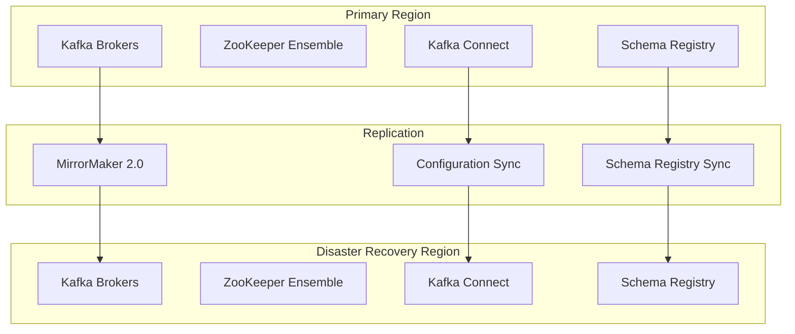
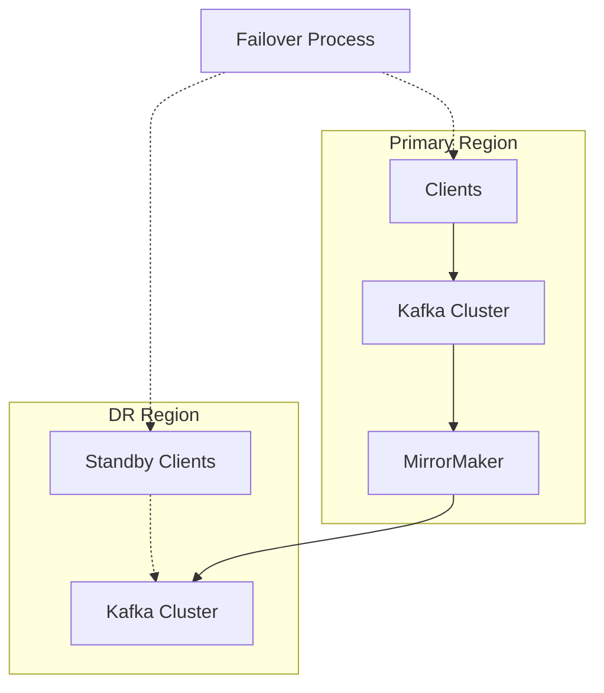
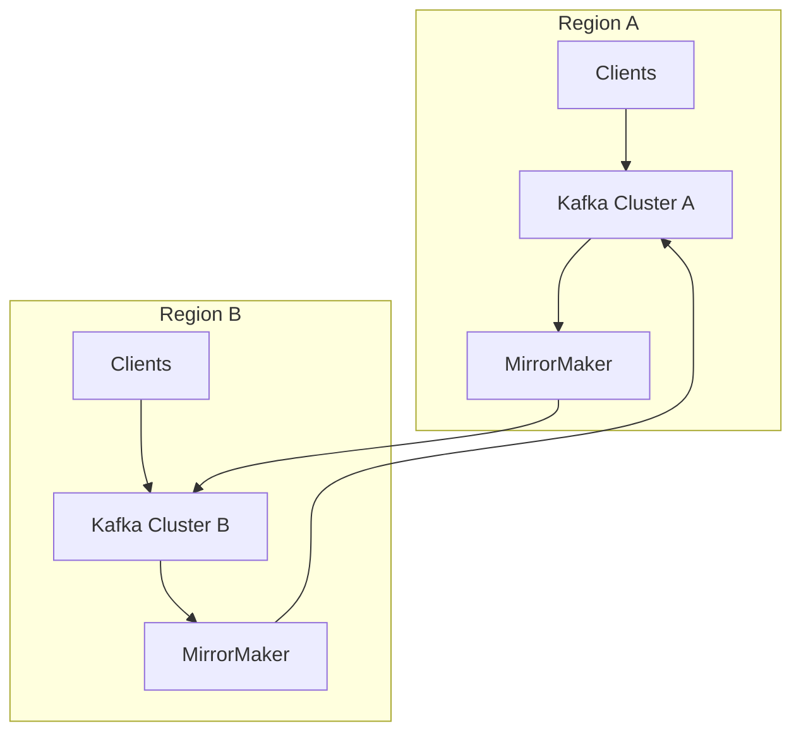

# Disaster Recovery

## Overview

Disaster recovery is essential for ensuring business continuity in the event of system failures or catastrophic events. This document covers disaster recovery strategies for the Event Broker, focusing on data replication, backup procedures, and recovery processes to minimize data loss and downtime in healthcare environments.

## Disaster Recovery Architecture

The Event Broker disaster recovery architecture employs multiple layers of protection:



## Replication Strategies

### Kafka MirrorMaker 2.0

MirrorMaker 2.0 provides robust cross-cluster replication:

```properties
# MirrorMaker 2.0 configuration
# mm2.properties

# Clusters configuration
clusters=primary,dr
primary.bootstrap.servers=primary-kafka-1:9092,primary-kafka-2:9092,primary-kafka-3:9092
dr.bootstrap.servers=dr-kafka-1:9092,dr-kafka-2:9092,dr-kafka-3:9092

# Enable heartbeats for connectivity monitoring
primary.heartbeats.topic.replication.factor=3
dr.heartbeats.topic.replication.factor=3

# Source->Target replication flow (primary to dr)
primary->dr.enabled=true
primary->dr.topics=.*
primary->dr.topics.exclude=__consumer_offsets|__transaction_state|_schemas|connect-configs|connect-offsets|connect-status

# Target->Source replication flow (dr to primary) - disabled in normal operation
dr->primary.enabled=false

# Replication policy configuration
primary->dr.replication.policy.class=org.apache.kafka.connect.mirror.IdentityReplicationPolicy
primary->dr.replication.factor=3

# Sync topic configurations
primary->dr.sync.topic.configs=true
primary->dr.sync.topic.acls=true

# Consumer group offset sync
primary->dr.emit.heartbeats=true
primary->dr.emit.checkpoints=true

# Security configuration
primary.security.protocol=SASL_SSL
primary.sasl.mechanism=PLAIN
primary.sasl.jaas.config=org.apache.kafka.common.security.plain.PlainLoginModule required username="mirrormaker" password="password";
primary.ssl.truststore.location=/etc/kafka/security/kafka.client.truststore.jks
primary.ssl.truststore.password=truststore-password

dr.security.protocol=SASL_SSL
dr.sasl.mechanism=PLAIN
dr.sasl.jaas.config=org.apache.kafka.common.security.plain.PlainLoginModule required username="mirrormaker" password="password";
dr.ssl.truststore.location=/etc/kafka/security/kafka.client.truststore.jks
dr.ssl.truststore.password=truststore-password
```

### Schema Registry Replication

Replicating Schema Registry ensures schema compatibility across clusters:

```properties
# Primary Schema Registry configuration
schema.registry.url=https://schema-registry-primary:8081
kafka.clusters.0.bootstrap.servers=primary-kafka-1:9092,primary-kafka-2:9092,primary-kafka-3:9092

# DR Schema Registry configuration
schema.registry.url=https://schema-registry-dr:8081
kafka.clusters.0.bootstrap.servers=dr-kafka-1:9092,dr-kafka-2:9092,dr-kafka-3:9092
schema.registry.replication.mode=REPLICA
schema.registry.master.url=https://schema-registry-primary:8081
```

### Connect Cluster Configuration Replication

Ensure Kafka Connect configurations are replicated:

```bash
#!/bin/bash
# Script to export and import connector configurations

# Export connectors from primary cluster
connectors=$(curl -s http://connect-primary:8083/connectors)

for connector in $(echo $connectors | jq -r '.[]'); do
  echo "Exporting connector: $connector"
  config=$(curl -s http://connect-primary:8083/connectors/$connector)
  echo $config > /tmp/connectors/$connector.json
done

# Import connectors to DR cluster
for config in /tmp/connectors/*.json; do
  connector=$(basename $config .json)
  echo "Importing connector: $connector"
  curl -X POST -H "Content-Type: application/json" \
    --data @$config http://connect-dr:8083/connectors
done
```

## Backup Strategies

### Topic Data Backup

Implement regular backups of critical topic data:

```bash
#!/bin/bash
# Script to backup critical topics to object storage

DATE=$(date +%Y-%m-%d)
BACKUP_DIR=/tmp/kafka-backups/$DATE
mkdir -p $BACKUP_DIR

# List of critical topics to backup
CRITICAL_TOPICS="clinical.patient.events financial.claim.events administrative.consent.events"

for topic in $CRITICAL_TOPICS; do
  echo "Backing up topic: $topic"
  
  # Create a consumer to read all messages
  kafka-console-consumer --bootstrap-server kafka:9092 \
    --topic $topic \
    --from-beginning \
    --consumer-property group.id=backup-consumer-$DATE \
    --consumer-property auto.offset.reset=earliest \
    --timeout-ms 60000 \
    --formatter kafka.tools.DefaultMessageFormatter \
    --property print.key=true \
    --property print.value=true \
    --property key.separator=, \
    > $BACKUP_DIR/$topic.json
    
  # Upload to object storage
  aws s3 cp $BACKUP_DIR/$topic.json s3://kafka-backups/$DATE/$topic.json
done

# Backup topic configurations
kafka-topics --bootstrap-server kafka:9092 --describe > $BACKUP_DIR/topics-config.txt
aws s3 cp $BACKUP_DIR/topics-config.txt s3://kafka-backups/$DATE/topics-config.txt
```

### Configuration Backup

Regularly backup all configuration files:

```bash
#!/bin/bash
# Script to backup Kafka configurations

DATE=$(date +%Y-%m-%d)
BACKUP_DIR=/tmp/kafka-config-backups/$DATE
mkdir -p $BACKUP_DIR

# Backup broker configurations
for broker in kafka-1 kafka-2 kafka-3; do
  ssh $broker "tar -czf - /etc/kafka/" > $BACKUP_DIR/$broker-config.tar.gz
done

# Backup ZooKeeper configurations
for zk in zookeeper-1 zookeeper-2 zookeeper-3; do
  ssh $zk "tar -czf - /etc/zookeeper/" > $BACKUP_DIR/$zk-config.tar.gz
done

# Backup Schema Registry configurations
ssh schema-registry "tar -czf - /etc/schema-registry/" > $BACKUP_DIR/schema-registry-config.tar.gz

# Backup Connect configurations
ssh connect "tar -czf - /etc/kafka-connect/" > $BACKUP_DIR/connect-config.tar.gz

# Upload to object storage
aws s3 cp $BACKUP_DIR s3://kafka-config-backups/$DATE/ --recursive
```

## Recovery Procedures

### Broker Failure Recovery

Recover from broker failures with minimal downtime:

```bash
#!/bin/bash
# Script to recover a failed broker

FAILED_BROKER=$1
BROKER_ID=$2

echo "Recovering broker $FAILED_BROKER with ID $BROKER_ID"

# Stop the failed broker if it's still running
ssh $FAILED_BROKER "systemctl stop kafka"

# Check if data directory is intact
DATA_INTACT=$(ssh $FAILED_BROKER "[ -d /var/lib/kafka/data ] && echo 'true' || echo 'false'")

if [ "$DATA_INTACT" == "false" ]; then
  echo "Data directory is missing, creating new one"
  ssh $FAILED_BROKER "mkdir -p /var/lib/kafka/data"
  ssh $FAILED_BROKER "chown kafka:kafka /var/lib/kafka/data"
fi

# Update server.properties with correct broker.id
ssh $FAILED_BROKER "sed -i 's/^broker\.id=.*/broker.id=$BROKER_ID/' /etc/kafka/server.properties"

# Start the broker
ssh $FAILED_BROKER "systemctl start kafka"

# Verify broker is up and joined the cluster
kafka-broker-api-versions --bootstrap-server $FAILED_BROKER:9092

echo "Broker recovery completed. Verifying under-replicated partitions..."
sleep 30

# Check for under-replicated partitions
UR_PARTITIONS=$(kafka-topics --bootstrap-server kafka:9092 --describe --under-replicated | wc -l)
echo "Under-replicated partitions: $UR_PARTITIONS"
```

### Cluster Failover

Implement automated failover to DR cluster:

```bash
#!/bin/bash
# Script to failover to DR cluster

echo "Starting failover to DR cluster"

# 1. Verify DR cluster is healthy
DR_HEALTHY=$(kafka-broker-api-versions --bootstrap-server dr-kafka-1:9092 > /dev/null 2>&1 && echo "true" || echo "false")

if [ "$DR_HEALTHY" == "false" ]; then
  echo "ERROR: DR cluster is not healthy, aborting failover"
  exit 1
fi

# 2. Stop MirrorMaker replication
systemctl stop kafka-mirrormaker

# 3. Reconfigure MirrorMaker for reverse replication
cp /etc/kafka-mirrormaker/mm2-reverse.properties /etc/kafka-mirrormaker/mm2.properties

# 4. Update DNS or load balancer to point to DR cluster
./update-dns.sh kafka.example.com dr-kafka-lb.example.com

# 5. Start reverse replication
systemctl start kafka-mirrormaker

# 6. Notify applications of the failover
./notify-applications.sh "Kafka failover to DR cluster completed"

echo "Failover to DR cluster completed"
```

### Data Recovery

Recover data from backups when needed:

```bash
#!/bin/bash
# Script to restore data from backups

DATE=$1
TOPIC=$2

echo "Restoring topic $TOPIC from backup date $DATE"

# Download backup from object storage
aws s3 cp s3://kafka-backups/$DATE/$TOPIC.json /tmp/$TOPIC.json

# Create topic if it doesn't exist
kafka-topics --bootstrap-server kafka:9092 --create --if-not-exists \
  --topic $TOPIC --partitions 12 --replication-factor 3

# Restore data to topic
cat /tmp/$TOPIC.json | while IFS=, read key value; do
  echo "Restoring: $key -> $value"
  echo "$value" | kafka-console-producer --bootstrap-server kafka:9092 \
    --topic $TOPIC --property "parse.key=true" --property "key.separator=," \
    --producer-property acks=all \
    << EOF
$key,$value
EOF
done

echo "Restore completed for topic $TOPIC"
```

## Disaster Recovery Testing

### Regular DR Drills

Implement regular disaster recovery testing:

```bash
#!/bin/bash
# Script to conduct a DR drill

echo "Starting Disaster Recovery Drill"

# 1. Create test topics on primary cluster
kafka-topics --bootstrap-server primary-kafka:9092 --create \
  --topic dr-test-$(date +%Y%m%d) --partitions 3 --replication-factor 3

# 2. Produce test messages
for i in {1..100}; do
  echo "test-key-$i,test-value-$i" | kafka-console-producer \
    --bootstrap-server primary-kafka:9092 \
    --topic dr-test-$(date +%Y%m%d) \
    --property "parse.key=true" \
    --property "key.separator=,"
done

# 3. Verify replication to DR cluster
sleep 60  # Allow time for replication

PRIMARY_COUNT=$(kafka-run-class kafka.tools.GetOffsetShell \
  --bootstrap-server primary-kafka:9092 \
  --topic dr-test-$(date +%Y%m%d) \
  --time -1 | awk -F":" '{sum += $3} END {print sum}')

DR_COUNT=$(kafka-run-class kafka.tools.GetOffsetShell \
  --bootstrap-server dr-kafka:9092 \
  --topic primary.dr-test-$(date +%Y%m%d) \
  --time -1 | awk -F":" '{sum += $3} END {print sum}')

echo "Messages in primary cluster: $PRIMARY_COUNT"
echo "Messages in DR cluster: $DR_COUNT"

if [ "$PRIMARY_COUNT" == "$DR_COUNT" ]; then
  echo "✅ Replication test PASSED"
else
  echo "❌ Replication test FAILED"
fi

# 4. Test failover procedure
./failover.sh --dry-run

echo "DR Drill completed"
```

## Recovery Time Objectives

### RTO and RPO Targets

Establish and monitor recovery time and point objectives:

| Scenario | Recovery Time Objective (RTO) | Recovery Point Objective (RPO) |
|----------|-------------------------------|--------------------------------|
| Single Broker Failure | < 5 minutes | Zero data loss |
| Multiple Broker Failure | < 15 minutes | Zero data loss |
| Availability Zone Failure | < 30 minutes | < 1 minute data loss |
| Region Failure | < 60 minutes | < 5 minutes data loss |

### Monitoring Recovery Metrics

```yaml
# Prometheus Alert Rules for recovery objectives
groups:
- name: kafka_recovery_objectives
  rules:
  - alert: KafkaReplicationLagExceedsRPO
    expr: kafka_server_replica_lag > 300
    for: 1m
    labels:
      severity: critical
    annotations:
      summary: "Kafka replication lag exceeds RPO"
      description: "Replication lag of {{ $value }} seconds exceeds RPO target of 5 minutes"

  - alert: MirrorMakerReplicationLagExceedsRPO
    expr: kafka_connect_mirror_source_task_replication_lag_ms > 300000
    for: 1m
    labels:
      severity: critical
    annotations:
      summary: "MirrorMaker replication lag exceeds RPO"
      description: "MirrorMaker replication lag of {{ $value }}ms exceeds RPO target of 5 minutes"
```

## Multi-Region Deployment

### Active-Passive Configuration

Implement active-passive multi-region deployment:



### Active-Active Configuration

Implement active-active multi-region deployment for critical workloads:



## Related Documentation

- [Security](security.md): Securing the Event Broker
- [Monitoring](monitoring.md): Comprehensive monitoring of the Event Broker
- [Performance Tuning](performance-tuning.md): Optimizing Event Broker performance
- [Scaling](scaling.md): Scaling the Event Broker for high throughput
