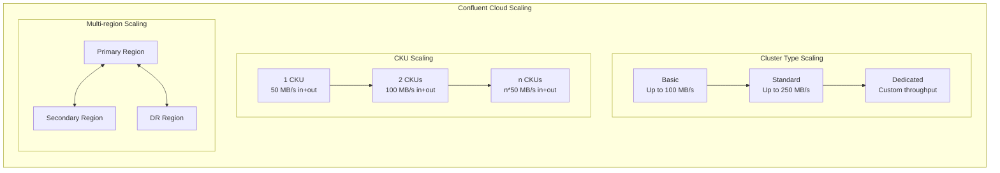
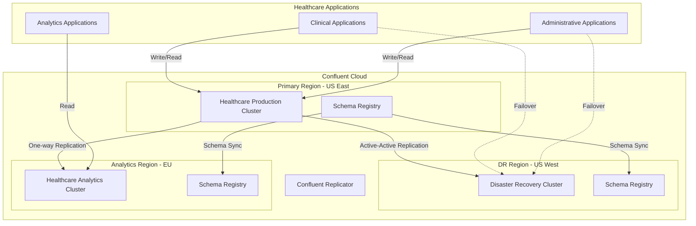

# Scaling

## Overview

Scaling the Event Broker is essential for handling growing data volumes and ensuring performance as healthcare workloads increase. This document covers scaling strategies for Confluent Cloud environments, focusing on capacity planning, cluster expansion, and load balancing to maintain performance and reliability under increasing healthcare data demands.

## Scaling Fundamentals

Confluent Cloud provides several scaling options tailored to healthcare workloads:

- **Cluster Sizing**: Selecting the appropriate Confluent Cloud cluster type (Basic, Standard, Dedicated)
- **CKU Scaling**: Adding Confluent Kafka Units (CKUs) to increase capacity
- **Auto-scaling**: Enabling automatic scaling based on workload demands
- **Multi-region Clusters**: Distributing workloads across geographic regions



Confluent Cloud abstracts away many of the infrastructure scaling challenges, allowing healthcare organizations to focus on data processing rather than cluster management.

## Capacity Planning

### Workload Assessment

Before scaling your Confluent Cloud environment, assess your current and projected healthcare workloads:

| Metric | Calculation | Healthcare Example |
|--------|-------------|-------------------|
| Message Rate | Messages per second | 50,000 msgs/sec (HL7, FHIR, clinical events) |
| Message Size | Average size per message | 5KB per message (typical for FHIR resources) |
| Throughput | Message Rate × Message Size | 250MB/sec |
| Retention Period | Time to retain data | 30 days (for clinical data compliance) |
| Storage Requirement | Throughput × Retention | 250MB/sec × 2,592,000 sec = ~648TB |

### Confluent Cloud Sizing

Select the appropriate Confluent Cloud offering based on your healthcare workload:

| Confluent Cloud Tier | Use Case | Healthcare Example |
|---------------------|----------|-------------------|
| Basic | Development, small production | Small clinic with <100MB/s throughput |
| Standard | Production workloads | Regional hospital with <250MB/s throughput |
| Dedicated | Mission-critical, high throughput | Health system with >250MB/s throughput, strict SLAs |

### CKU Planning for Dedicated Clusters

For Dedicated clusters, determine the number of CKUs (Confluent Kafka Units) needed:

| Metric | CKU Capacity | Healthcare Example |
|--------|-------------|-------------------|
| Throughput | 50 MB/s per CKU (in + out combined) | 250MB/s ÷ 50MB/s = 5 CKUs |
| Connections | 4,000 connections per CKU | 15,000 connections ÷ 4,000 = 4 CKUs |
| Partitions | 4,500 partitions per CKU | 20,000 partitions ÷ 4,500 = 5 CKUs |

Select the highest CKU count from the above calculations (5 CKUs in this example).

### Confluent Cloud Scaling Triggers

Monitor these Confluent Cloud metrics to determine when scaling is needed:

| Metric | Warning Threshold | Critical Threshold | Confluent Cloud Metric Name |
|--------|-------------------|--------------------|-----------------------------|
| Throughput Utilization | >70% of provisioned | >85% of provisioned | `io.confluent.kafka.server/received_bytes` + `sent_bytes` |
| Partition Utilization | >80% of limit | >90% of limit | `io.confluent.kafka.server/partition_count` |
| Connection Utilization | >70% of limit | >85% of limit | `io.confluent.kafka.server/active_connection_count` |
| Request Rate | >70% of quota | >85% of quota | `io.confluent.kafka.server/request_count` |
| Request Latency | >50ms p99 | >100ms p99 | `io.confluent.kafka.server/request_latency_avg` |
| Consumer Lag | Growing steadily | Continuously increasing |
| Request Queue Time | >10ms average | >50ms average |

## Scaling in Confluent Cloud

### Scaling Dedicated Clusters with CKUs

In Confluent Cloud, scaling is managed through the Confluent Cloud Console or API by adjusting the number of Confluent Kafka Units (CKUs):

```typescript
// Example: TypeScript code to scale a Confluent Cloud cluster using the Confluent Cloud API
import axios from 'axios';

// Configure authentication
const apiKey = process.env.CONFLUENT_CLOUD_API_KEY;
const apiSecret = process.env.CONFLUENT_CLOUD_API_SECRET;
const auth = Buffer.from(`${apiKey}:${apiSecret}`).toString('base64');

// Function to scale a Confluent Cloud cluster
async function scaleCluster(
  environmentId: string,
  clusterId: string,
  newCkuCount: number
): Promise<void> {
  try {
    // Get current cluster configuration
    const response = await axios({
      method: 'GET',
      url: `https://api.confluent.cloud/cmk/v2/environments/${environmentId}/clusters/${clusterId}`,
      headers: {
        'Content-Type': 'application/json',
        'Authorization': `Basic ${auth}`
      }
    });
    
    const cluster = response.data;
    
    // Update CKU count
    const updateResponse = await axios({
      method: 'PATCH',
      url: `https://api.confluent.cloud/cmk/v2/environments/${environmentId}/clusters/${clusterId}`,
      headers: {
        'Content-Type': 'application/json',
        'Authorization': `Basic ${auth}`
      },
      data: {
        spec: {
          ...cluster.spec,
          config: {
            ...cluster.spec.config,
            cku: newCkuCount
          }
        }
      }
    });
    
    console.log(`Cluster ${clusterId} scaled to ${newCkuCount} CKUs`);
    return updateResponse.data;
  } catch (error) {
    console.error('Error scaling Confluent Cloud cluster:', error.response?.data || error.message);
    throw error;
  }
}

// Example usage for healthcare workload scaling
async function scaleHealthcareCluster() {
  const environmentId = 'env-abc123';
  const clusterId = 'lkc-xyz789';
  
  // Calculate required CKUs based on metrics
  const currentThroughputMBps = 175; // Current throughput in MB/s
  const targetThroughputMBps = 250; // Target throughput in MB/s
  const mbpsPerCku = 50; // Each CKU provides 50 MB/s
  
  const requiredCkus = Math.ceil(targetThroughputMBps / mbpsPerCku);
  
  // Scale the cluster
  await scaleCluster(environmentId, clusterId, requiredCkus);
  
  console.log(`Healthcare cluster scaled to support ${targetThroughputMBps} MB/s throughput`);
}
```

### Scaling via Confluent Cloud Console

Alternatively, you can scale your Confluent Cloud cluster through the web console:

1. Log in to Confluent Cloud Console
2. Navigate to your Kafka cluster
3. Select 'Cluster settings'
4. Under 'Capacity', adjust the number of CKUs
5. Confirm the scaling operation

### Topic Management

In Confluent Cloud, partition management is largely automated, but you can still optimize topic configurations for healthcare workloads:

```typescript
// Example: TypeScript code to manage topics in Confluent Cloud
import { Kafka } from 'kafkajs';
import { confluent } from '@confluent/confluent-cloud-api';

// Configure Confluent Cloud client
const kafka = new Kafka({
  clientId: 'healthcare-admin-client',
  brokers: [process.env.CONFLUENT_BOOTSTRAP_SERVERS!],
  ssl: true,
  sasl: {
    mechanism: 'plain',
    username: process.env.CONFLUENT_CLOUD_KEY!,
    password: process.env.CONFLUENT_CLOUD_SECRET!
  }
});

// Function to optimize topics for healthcare workloads
async function optimizeHealthcareTopics() {
  const admin = kafka.admin();
  await admin.connect();
  
  try {
    // Get current topic configurations
    const topics = await admin.listTopics();
    console.log(`Found ${topics.length} topics in the cluster`);
    
    // Identify high-throughput clinical topics
    const clinicalTopics = topics.filter(topic => 
      topic.startsWith('clinical.') || 
      topic.startsWith('patient.') || 
      topic.startsWith('healthcare.')
    );
    
    // Optimize each clinical topic
    for (const topic of clinicalTopics) {
      console.log(`Optimizing topic: ${topic}`);
      
      // Get current topic configuration
      const topicConfig = await admin.describeConfigs({
        resources: [{ type: 2, name: topic }] // 2 = TOPIC
      });
      
      // Get current partitions
      const topicMetadata = await admin.fetchTopicMetadata({ topics: [topic] });
      const currentPartitions = topicMetadata.topics[0].partitions.length;
      
      // Determine if topic needs more partitions based on throughput
      // This requires monitoring data from Confluent Cloud metrics API
      const topicThroughput = await getTopicThroughput(topic); // MB/s
      const targetPartitions = calculateOptimalPartitions(topicThroughput);
      
      if (targetPartitions > currentPartitions) {
        // Increase partitions for high-throughput topics
        console.log(`Increasing partitions for ${topic} from ${currentPartitions} to ${targetPartitions}`);
        
        await admin.createPartitions({
          topicPartitions: [{ topic, count: targetPartitions }]
        });
      }
      
      // Optimize topic configuration for healthcare data
      await admin.alterConfigs({
        resources: [{
          type: 2, // TOPIC
          name: topic,
          configEntries: [
            // For healthcare data, ensure proper retention and durability
            { name: 'retention.ms', value: '2592000000' }, // 30 days for healthcare data
            { name: 'min.insync.replicas', value: '2' }, // Ensure durability
            { name: 'cleanup.policy', value: 'delete' }, // For PHI data, use delete not compact
            // Add any other healthcare-specific configurations
          ]
        }]
      });
    }
    
    console.log('Topic optimization completed');
  } catch (error) {
    console.error('Error optimizing topics:', error);
  } finally {
    await admin.disconnect();
  }
}

// Helper function to calculate optimal partition count based on throughput
function calculateOptimalPartitions(throughputMBps: number): number {
  // Healthcare data guidelines:
  // - Each partition should handle max 10 MB/s for optimal performance
  // - Ensure enough partitions for parallelism but not too many to cause overhead
  const mbPerPartition = 10; // MB/s per partition
  const minPartitions = 6; // Minimum partitions for healthcare topics
  
  // Calculate based on throughput with a 30% growth factor
  const calculatedPartitions = Math.ceil((throughputMBps * 1.3) / mbPerPartition);
  
  // Return at least the minimum, rounded to nearest multiple of 3 for even distribution
  return Math.max(minPartitions, Math.ceil(calculatedPartitions / 3) * 3);
}

// Helper function to get topic throughput from Confluent Cloud Metrics API
async function getTopicThroughput(topic: string): Promise<number> {
  // Implementation would use Confluent Cloud Metrics API
  // This is a placeholder for the actual implementation
  const response = await confluent.metrics.query({
    query: `sum(rate(kafka_server_brokertopicmetrics_bytesin_total{topic="${topic}"}[5m])) + 
            sum(rate(kafka_server_brokertopicmetrics_bytesout_total{topic="${topic}"}[5m]))`,
    start: new Date(Date.now() - 3600000).toISOString(), // Last hour
    end: new Date().toISOString(),
    step: '60s'
  });
  
  // Parse response and calculate average throughput in MB/s
  // This is simplified - actual implementation would process the metrics response
  const values = response.data.result[0].values;
  const sum = values.reduce((acc, [_, value]) => acc + Number(value), 0);
  const avgBytesPerSec = sum / values.length;
  const mbPerSec = avgBytesPerSec / (1024 * 1024);
  
  return mbPerSec;
}
```

### Best Practices

1. **Partition Strategy**: For healthcare data, use patient ID or encounter ID as partition key for related events
2. **Partition Count**: Start with 6-12 partitions for most healthcare topics, scale as needed
3. **Retention**: Set appropriate retention based on data type (30+ days for clinical data)
4. **Replication**: Use Confluent Cloud's multi-region clusters for critical healthcare data
5. **Monitoring**: Set up alerts for topic throughput and lag in Confluent Cloud

### Automated Scaling in Confluent Cloud

Confluent Cloud provides automated scaling and partition balancing capabilities that eliminate the need for manual intervention:

#### Auto-scaling with Terraform

You can configure auto-scaling for Confluent Cloud using Terraform:

```typescript
// Example: Terraform configuration for Confluent Cloud auto-scaling
import * as terraform from 'cdktf';
import * as confluent from '@cdktf/provider-confluent';

const app = new terraform.App();
const stack = new terraform.TerraformStack(app, 'healthcare-kafka-autoscaling');

// Configure Confluent provider
new confluent.provider.ConfluentProvider(stack, 'confluent', {
  cloudApiKey: '${CONFLUENT_CLOUD_API_KEY}',
  cloudApiSecret: '${CONFLUENT_CLOUD_API_SECRET}'
});

// Create environment
const environment = new confluent.environment.Environment(stack, 'healthcare-environment', {
  displayName: 'Healthcare Production'
});

// Create Kafka cluster with auto-scaling configuration
const cluster = new confluent.kafkaCluster.KafkaCluster(stack, 'healthcare-kafka-cluster', {
  displayName: 'Healthcare Events Cluster',
  availability: 'MULTI_ZONE',
  cloud: 'AWS',
  region: 'us-east-1',
  environmentId: environment.id,
  dedicated: {
    cku: 2, // Start with 2 CKUs
    // Auto-scaling configuration
    cku_auto_scaling: {
      enabled: true,
      min_cku: 2,  // Minimum CKUs
      max_cku: 8,  // Maximum CKUs for peak loads
      scale_up_utilization_threshold: 80,  // Scale up when utilization exceeds 80%
      scale_down_utilization_threshold: 30, // Scale down when utilization falls below 30%
      scale_up_cooldown_sec: 300,  // Wait 5 minutes before scaling up again
      scale_down_cooldown_sec: 600 // Wait 10 minutes before scaling down
    }
  }
});

// Output cluster ID and bootstrap servers
new terraform.TerraformOutput(stack, 'cluster_id', {
  value: cluster.id
});

new terraform.TerraformOutput(stack, 'bootstrap_servers', {
  value: cluster.bootstrapEndpoint
});

app.synth();
```

#### Monitoring Auto-scaling Events

Monitor auto-scaling events in Confluent Cloud using the Metrics API:

```typescript
// Example: Monitoring auto-scaling events in Confluent Cloud
import axios from 'axios';
import { parse, format } from 'date-fns';

// Configure authentication
const apiKey = process.env.CONFLUENT_CLOUD_API_KEY;
const apiSecret = process.env.CONFLUENT_CLOUD_API_SECRET;
const auth = Buffer.from(`${apiKey}:${apiSecret}`).toString('base64');

// Function to get auto-scaling events
async function getAutoScalingEvents(clusterId: string, days: number = 7): Promise<void> {
  try {
    const endTime = new Date();
    const startTime = new Date(endTime.getTime() - days * 24 * 60 * 60 * 1000);
    
    const response = await axios({
      method: 'GET',
      url: `https://api.confluent.cloud/v2/metrics/cloud/query`,
      headers: {
        'Content-Type': 'application/json',
        'Authorization': `Basic ${auth}`
      },
      params: {
        query: `kafka_server_cku_count{resource_id="${clusterId}"}`,
        start_timestamp: startTime.toISOString(),
        end_timestamp: endTime.toISOString(),
        granularity: 'PT5M' // 5-minute intervals
      }
    });
    
    // Process and display auto-scaling events
    const dataPoints = response.data.data;
    let previousCkuCount = null;
    
    console.log('Auto-scaling events for the past ' + days + ' days:');
    console.log('--------------------------------------------');
    
    dataPoints.forEach(point => {
      const timestamp = new Date(point.timestamp);
      const ckuCount = point.value;
      
      if (previousCkuCount !== null && ckuCount !== previousCkuCount) {
        const direction = ckuCount > previousCkuCount ? 'UP' : 'DOWN';
        console.log(`${format(timestamp, 'yyyy-MM-dd HH:mm:ss')} - Scaled ${direction}: ${previousCkuCount} CKUs → ${ckuCount} CKUs`);
      }
      
      previousCkuCount = ckuCount;
    });
    
    // Calculate scaling statistics
    const uniqueCkuCounts = [...new Set(dataPoints.map(p => p.value))];
    const maxCkus = Math.max(...dataPoints.map(p => p.value));
    const minCkus = Math.min(...dataPoints.map(p => p.value));
    const avgCkus = dataPoints.reduce((sum, p) => sum + p.value, 0) / dataPoints.length;
    
    console.log('Scaling Statistics:');
    console.log(`Min CKUs: ${minCkus}`);
    console.log(`Max CKUs: ${maxCkus}`);
    console.log(`Avg CKUs: ${avgCkus.toFixed(2)}`);
    console.log(`Scaling Events: ${uniqueCkuCounts.length - 1}`);
    
  } catch (error) {
    console.error('Error fetching auto-scaling events:', error.response?.data || error.message);
  }
}

// Example usage
getAutoScalingEvents('lkc-abc123');
```

#### Healthcare-Specific Auto-scaling Considerations

1. **Peak Hours Planning**: Configure higher scaling thresholds during known peak hours (e.g., clinic hours)
2. **Compliance Requirements**: Ensure auto-scaling doesn't impact data retention or processing guarantees
3. **Cost Management**: Set appropriate maximum CKU limits to prevent unexpected costs
4. **Monitoring**: Implement alerts for scaling events to track resource usage patterns
5. **Seasonal Adjustments**: Adjust auto-scaling parameters during flu season or other high-volume periods

## Cluster Tier Upgrades in Confluent Cloud

### Upgrading Cluster Capacity

In Confluent Cloud, vertical scaling is handled by upgrading the cluster tier or adding CKUs. This process is managed through the Confluent Cloud Console or API with zero downtime:

```typescript
// Example: TypeScript code to upgrade a Confluent Cloud cluster tier
import axios from 'axios';

// Configure authentication
const apiKey = process.env.CONFLUENT_CLOUD_API_KEY;
const apiSecret = process.env.CONFLUENT_CLOUD_API_SECRET;
const auth = Buffer.from(`${apiKey}:${apiSecret}`).toString('base64');

/**
 * Upgrade a Confluent Cloud cluster from Basic to Standard tier
 * for increased capacity and features needed for healthcare workloads
 */
async function upgradeClusterTier(
  environmentId: string,
  clusterId: string
): Promise<void> {
  try {
    console.log(`Upgrading cluster ${clusterId} from Basic to Standard tier...`);
    
    // Get current cluster configuration
    const response = await axios({
      method: 'GET',
      url: `https://api.confluent.cloud/cmk/v2/environments/${environmentId}/clusters/${clusterId}`,
      headers: {
        'Content-Type': 'application/json',
        'Authorization': `Basic ${auth}`
      }
    });
    
    const cluster = response.data;
    
    // Check if cluster is already Standard or higher
    if (!cluster.spec.basic) {
      console.log('Cluster is already Standard or higher tier');
      return;
    }
    
    // Prepare upgrade request - change from basic to standard tier
    const updateResponse = await axios({
      method: 'PATCH',
      url: `https://api.confluent.cloud/cmk/v2/environments/${environmentId}/clusters/${clusterId}`,
      headers: {
        'Content-Type': 'application/json',
        'Authorization': `Basic ${auth}`
      },
      data: {
        spec: {
          display_name: cluster.spec.display_name,
          availability: cluster.spec.availability,
          cloud: cluster.spec.cloud,
          region: cluster.spec.region,
          standard: {} // Upgrade to Standard tier
        }
      }
    });
    
    console.log(`Cluster upgrade initiated. New status: ${updateResponse.data.status.phase}`);
    console.log('The upgrade process will complete automatically with zero downtime');
    
    // Monitor the upgrade progress
    await monitorClusterUpgrade(environmentId, clusterId);
    
  } catch (error) {
    console.error('Error upgrading Confluent Cloud cluster:', error.response?.data || error.message);
    throw error;
  }
}

/**
 * Monitor the progress of a cluster upgrade
 */
async function monitorClusterUpgrade(
  environmentId: string,
  clusterId: string,
  intervalMs: number = 30000 // Check every 30 seconds
): Promise<void> {
  let upgradeComplete = false;
  console.log('Monitoring upgrade progress...');
  
  while (!upgradeComplete) {
    try {
      // Wait for the specified interval
      await new Promise(resolve => setTimeout(resolve, intervalMs));
      
      // Check cluster status
      const response = await axios({
        method: 'GET',
        url: `https://api.confluent.cloud/cmk/v2/environments/${environmentId}/clusters/${clusterId}`,
        headers: {
          'Content-Type': 'application/json',
          'Authorization': `Basic ${auth}`
        }
      });
      
      const status = response.data.status.phase;
      console.log(`Current status: ${status}`);
      
      // Check if upgrade is complete
      if (status === 'RUNNING' && response.data.spec.standard) {
        console.log('Cluster upgrade to Standard tier completed successfully!');
        upgradeComplete = true;
        
        // Output new cluster details
        console.log('New cluster details:');
        console.log(`- Max throughput: Up to 250 MB/s`);
        console.log(`- Storage: Unlimited`);
        console.log(`- Partitions: Up to 4,000`);
        console.log(`- Advanced features: Schema Registry, ksqlDB available`);
      } else if (status === 'FAILED') {
        console.error('Cluster upgrade failed!');
        upgradeComplete = true;
      }
    } catch (error) {
      console.error('Error checking upgrade status:', error.message);
      // Continue monitoring despite errors
    }
  }
}

// Example usage for healthcare workload upgrade
async function upgradeHealthcareCluster() {
  const environmentId = 'env-abc123';
  const clusterId = 'lkc-xyz789';
  
  // Upgrade from Basic to Standard tier to support increased healthcare workloads
  await upgradeClusterTier(environmentId, clusterId);
}
```

### Confluent Cloud Tier Comparison for Healthcare Workloads

| Feature | Basic | Standard | Dedicated |
|---------|-------|----------|-----------|
| Max Throughput | 100 MB/s | 250 MB/s | Custom |
| Partitions | 2,500 | 4,000 | Custom (4,500 per CKU) |
| Storage | 5 TB | Unlimited | Unlimited |
| Retention | 7 days | Unlimited | Unlimited |
| Uptime SLA | 99.5% | 99.9% | 99.99% |
| Healthcare Suitability | Development, Testing | Small/Medium Production | Large Health Systems |
| Multi-region | No | No | Yes |
| Private Networking | No | Yes | Yes |
| HIPAA Compliance | Limited | Yes | Yes |

### Healthcare Considerations for Tier Selection

1. **Data Volume**: Consider patient volume and message frequency when selecting a tier
2. **Compliance**: Dedicated clusters provide the strongest isolation for PHI data
3. **Availability**: Higher tiers provide better SLAs for critical healthcare applications
4. **Scalability**: Standard and Dedicated tiers allow for more flexible scaling
5. **Cost Management**: Balance performance needs with budget constraints

### Storage Management in Confluent Cloud

In Confluent Cloud, storage management is fully automated and handled by the platform:

```typescript
// Example: TypeScript code to monitor storage usage in Confluent Cloud
import axios from 'axios';
import { format } from 'date-fns';

// Configure authentication
const apiKey = process.env.CONFLUENT_CLOUD_API_KEY;
const apiSecret = process.env.CONFLUENT_CLOUD_API_SECRET;
const auth = Buffer.from(`${apiKey}:${apiSecret}`).toString('base64');

/**
 * Monitor storage usage for healthcare topics in Confluent Cloud
 */
async function monitorStorageUsage(
  clusterId: string,
  days: number = 30
): Promise<void> {
  try {
    const endTime = new Date();
    const startTime = new Date(endTime.getTime() - days * 24 * 60 * 60 * 1000);
    
    // Query Confluent Cloud Metrics API for storage metrics
    const response = await axios({
      method: 'GET',
      url: `https://api.confluent.cloud/v2/metrics/cloud/query`,
      headers: {
        'Content-Type': 'application/json',
        'Authorization': `Basic ${auth}`
      },
      params: {
        query: `kafka_server_disk_usage_bytes{resource_id="${clusterId}"}`,
        start_timestamp: startTime.toISOString(),
        end_timestamp: endTime.toISOString(),
        granularity: 'P1D' // Daily granularity
      }
    });
    
    // Process storage usage data
    const dataPoints = response.data.data;
    
    console.log('Storage Usage for Healthcare Cluster:');
    console.log('----------------------------------------');
    
    // Convert bytes to GB for readability
    const usageData = dataPoints.map(point => ({
      date: format(new Date(point.timestamp), 'yyyy-MM-dd'),
      usageGB: (point.value / (1024 * 1024 * 1024)).toFixed(2)
    }));
    
    // Display storage usage trend
    usageData.forEach(point => {
      console.log(`${point.date}: ${point.usageGB} GB`);
    });
    
    // Calculate growth rate
    if (usageData.length >= 2) {
      const oldestUsage = parseFloat(usageData[0].usageGB);
      const newestUsage = parseFloat(usageData[usageData.length - 1].usageGB);
      const growthGB = newestUsage - oldestUsage;
      const growthPercentage = ((newestUsage / oldestUsage) - 1) * 100;
      const dailyGrowthGB = growthGB / days;
      
      console.log('
Storage Growth Analysis:');
      console.log(`Total Growth: ${growthGB.toFixed(2)} GB (${growthPercentage.toFixed(2)}%)`);
      console.log(`Average Daily Growth: ${dailyGrowthGB.toFixed(2)} GB`);
      
      // Project future storage needs
      const projectedUsage30Days = newestUsage + (dailyGrowthGB * 30);
      const projectedUsage90Days = newestUsage + (dailyGrowthGB * 90);
      
      console.log('
Projected Storage Needs:');
      console.log(`30 Days: ${projectedUsage30Days.toFixed(2)} GB`);
      console.log(`90 Days: ${projectedUsage90Days.toFixed(2)} GB`);
      
      // Provide recommendations based on tier
      if (projectedUsage90Days > 5000) { // 5TB limit for Basic tier
        console.log('
Recommendation: Consider upgrading to Standard tier for unlimited storage.');
      }
    }
    
  } catch (error) {
    console.error('Error monitoring storage usage:', error.response?.data || error.message);
  }
}

// Example usage for healthcare cluster
monitorStorageUsage('lkc-abc123');
```

### Confluent Cloud Storage Benefits for Healthcare

1. **Unlimited Storage**: Standard and Dedicated tiers provide unlimited storage for healthcare data
2. **Automatic Scaling**: Storage automatically scales with your data needs without manual intervention
3. **Tiered Storage**: Older data automatically moves to cost-effective storage tiers
4. **Data Retention**: Configure retention policies based on healthcare compliance requirements
5. **No Downtime**: Storage expansion happens without service interruption

## Multi-Region and Multi-Cluster Scaling in Confluent Cloud

### Multi-Region Clusters for Healthcare

Implement multi-region architecture for healthcare data with high availability and disaster recovery:



### Multi-Region Cluster Configuration with TypeScript

```typescript
// Example: TypeScript code to configure multi-region clusters in Confluent Cloud
import * as terraform from 'cdktf';
import * as confluent from '@cdktf/provider-confluent';

const app = new terraform.App();
const stack = new terraform.TerraformStack(app, 'healthcare-multi-region');

// Configure Confluent provider
new confluent.provider.ConfluentProvider(stack, 'confluent', {
  cloudApiKey: '${CONFLUENT_CLOUD_API_KEY}',
  cloudApiSecret: '${CONFLUENT_CLOUD_API_SECRET}'
});

// Create environment
const environment = new confluent.environment.Environment(stack, 'healthcare-environment', {
  displayName: 'Healthcare Production'
});

// Create primary cluster in US East
const primaryCluster = new confluent.kafkaCluster.KafkaCluster(stack, 'primary-cluster', {
  displayName: 'Healthcare Primary Cluster',
  availability: 'MULTI_ZONE',
  cloud: 'AWS',
  region: 'us-east-1',
  environmentId: environment.id,
  dedicated: {
    cku: 4 // 4 CKUs for production healthcare workload
  }
});

// Create DR cluster in US West
const drCluster = new confluent.kafkaCluster.KafkaCluster(stack, 'dr-cluster', {
  displayName: 'Healthcare DR Cluster',
  availability: 'MULTI_ZONE',
  cloud: 'AWS',
  region: 'us-west-2',
  environmentId: environment.id,
  dedicated: {
    cku: 4 // Match primary cluster capacity
  }
});

// Create analytics cluster in EU
const analyticsCluster = new confluent.kafkaCluster.KafkaCluster(stack, 'analytics-cluster', {
  displayName: 'Healthcare Analytics Cluster',
  availability: 'MULTI_ZONE',
  cloud: 'AWS',
  region: 'eu-west-1',
  environmentId: environment.id,
  dedicated: {
    cku: 2 // Lower capacity for analytics workload
  }
});

// Create Schema Registry in primary region
const schemaRegistry = new confluent.schemaRegistry.SchemaRegistry(stack, 'schema-registry', {
  packageType: 'ESSENTIALS',
  environmentId: environment.id,
  region: 'us-east-1'
});

// Create service accounts for replication
const replicatorAccount = new confluent.serviceAccount.ServiceAccount(stack, 'replicator-account', {
  displayName: 'healthcare-replicator-sa',
  description: 'Service account for Confluent Replicator'
});

// Create API keys for replication
const primaryApiKey = new confluent.apiKey.ApiKey(stack, 'primary-api-key', {
  displayName: 'primary-replicator-key',
  description: 'Replicator API Key for Primary Cluster',
  owner: {
    id: replicatorAccount.id,
    kind: 'ServiceAccount',
    apiVersion: 'iam/v2'
  },
  managedResource: {
    id: primaryCluster.id,
    apiVersion: primaryCluster.apiVersion,
    kind: primaryCluster.kind,
    environment: {
      id: environment.id
    }
  }
});

const drApiKey = new confluent.apiKey.ApiKey(stack, 'dr-api-key', {
  displayName: 'dr-replicator-key',
  description: 'Replicator API Key for DR Cluster',
  owner: {
    id: replicatorAccount.id,
    kind: 'ServiceAccount',
    apiVersion: 'iam/v2'
  },
  managedResource: {
    id: drCluster.id,
    apiVersion: drCluster.apiVersion,
    kind: drCluster.kind,
    environment: {
      id: environment.id
    }
  }
});

// Configure Cluster Link between primary and DR clusters
const primaryToDrLink = new confluent.clusterLink.ClusterLink(stack, 'primary-to-dr-link', {
  linkName: 'primary-to-dr',
  sourceKafkaCluster: {
    id: primaryCluster.id,
    environmentId: environment.id,
    credentials: {
      key: primaryApiKey.id,
      secret: primaryApiKey.secret
    }
  },
  destinationKafkaCluster: {
    id: drCluster.id,
    environmentId: environment.id,
    credentials: {
      key: drApiKey.id,
      secret: drApiKey.secret
    }
  }
});

// Configure mirror topics for healthcare data
const clinicalMirrorTopic = new confluent.mirrorTopic.MirrorTopic(stack, 'clinical-mirror', {
  sourceKafkaCluster: {
    id: primaryCluster.id,
    environmentId: environment.id
  },
  destinationKafkaCluster: {
    id: drCluster.id,
    environmentId: environment.id
  },
  topicName: 'clinical.events',
  linkName: primaryToDrLink.linkName,
  // Active-Active configuration
  activeActive: true
});

// Output connection details
new terraform.TerraformOutput(stack, 'primary_bootstrap_servers', {
  value: primaryCluster.bootstrapEndpoint
});

new terraform.TerraformOutput(stack, 'dr_bootstrap_servers', {
  value: drCluster.bootstrapEndpoint
});

new terraform.TerraformOutput(stack, 'analytics_bootstrap_servers', {
  value: analyticsCluster.bootstrapEndpoint
});

new terraform.TerraformOutput(stack, 'schema_registry_url', {
  value: schemaRegistry.restEndpoint
});

app.synth();
```

### Healthcare Multi-Region Benefits

1. **High Availability**: 99.99% uptime SLA with multi-region deployments for critical healthcare services
2. **Disaster Recovery**: Automatic failover capabilities for healthcare data continuity
3. **Data Sovereignty**: Keep patient data in appropriate geographic regions for compliance
4. **Global Access**: Provide low-latency access to healthcare data across geographic regions
5. **Workload Isolation**: Separate clinical, administrative, and analytics workloads

## Cloud Scaling

### Kubernetes Deployment

Implement Kafka on Kubernetes for dynamic scaling:

```yaml
# Kafka StatefulSet on Kubernetes
apiVersion: apps/v1
kind: StatefulSet
metadata:
  name: kafka
  namespace: event-broker
spec:
  serviceName: "kafka"
  replicas: 3
  selector:
    matchLabels:
      app: kafka
  template:
    metadata:
      labels:
        app: kafka
    spec:
      containers:
      - name: kafka
        image: confluentinc/cp-kafka:7.3.0
        ports:
        - containerPort: 9092
          name: client
        - containerPort: 9093
          name: internal
        env:
        - name: KAFKA_BROKER_ID
          valueFrom:
            fieldRef:
              fieldPath: metadata.name
              apiVersion: v1
              fieldPath: metadata.name
        - name: KAFKA_ZOOKEEPER_CONNECT
          value: "zookeeper:2181"
        - name: KAFKA_LISTENER_SECURITY_PROTOCOL_MAP
          value: "INTERNAL:PLAINTEXT,EXTERNAL:PLAINTEXT"
        - name: KAFKA_ADVERTISED_LISTENERS
          value: "INTERNAL://$(HOSTNAME).kafka.$(NAMESPACE).svc.cluster.local:9093,EXTERNAL://$(HOSTNAME).kafka.$(NAMESPACE).svc.cluster.local:9092"
        - name: KAFKA_INTER_BROKER_LISTENER_NAME
          value: "INTERNAL"
        - name: KAFKA_AUTO_CREATE_TOPICS_ENABLE
          value: "false"
        - name: KAFKA_DEFAULT_REPLICATION_FACTOR
          value: "3"
        - name: KAFKA_MIN_INSYNC_REPLICAS
          value: "2"
        - name: KAFKA_NUM_PARTITIONS
          value: "12"
        volumeMounts:
        - name: kafka-data
          mountPath: /var/lib/kafka/data
  volumeClaimTemplates:
  - metadata:
      name: kafka-data
    spec:
      accessModes: [ "ReadWriteOnce" ]
      storageClassName: "fast-storage"
      resources:
        requests:
          storage: 1Ti
```

### Strimzi Operator

Use Strimzi Operator for automated Kafka management on Kubernetes:

```yaml
# Kafka cluster managed by Strimzi
apiVersion: kafka.strimzi.io/v1beta2
kind: Kafka
metadata:
  name: healthcare-kafka
  namespace: event-broker
spec:
  kafka:
    version: 3.3.1
    replicas: 3
    listeners:
      - name: plain
        port: 9092
        type: internal
        tls: false
      - name: tls
        port: 9093
        type: internal
        tls: true
        authentication:
          type: tls
      - name: external
        port: 9094
        type: loadbalancer
        tls: true
        authentication:
          type: tls
    config:
      auto.create.topics.enable: "false"
      default.replication.factor: 3
      min.insync.replicas: 2
      num.partitions: 12
      offsets.topic.replication.factor: 3
      transaction.state.log.replication.factor: 3
      transaction.state.log.min.isr: 2
      log.retention.hours: 168
      log.segment.bytes: 1073741824
    storage:
      type: jbod
      volumes:
      - id: 0
        type: persistent-claim
        size: 1Ti
        deleteClaim: false
        class: fast-storage
    resources:
      requests:
        memory: 8Gi
        cpu: 2
      limits:
        memory: 16Gi
        cpu: 4
    jvmOptions:
      -Xms: 4g
      -Xmx: 4g
      -XX:
        +UseG1GC: {}
        MaxGCPauseMillis: 20
        InitiatingHeapOccupancyPercent: 35
  zookeeper:
    replicas: 3
    storage:
      type: persistent-claim
      size: 100Gi
      deleteClaim: false
      class: fast-storage
    resources:
      requests:
        memory: 2Gi
        cpu: 0.5
      limits:
        memory: 4Gi
        cpu: 2
  entityOperator:
    topicOperator: {}
    userOperator: {}
```

### Auto-Scaling

Implement auto-scaling for Kafka clusters on Kubernetes:

```yaml
# Kafka Cruise Control with auto-scaling
apiVersion: kafka.strimzi.io/v1beta2
kind: KafkaRebalance
metadata:
  name: healthcare-kafka-rebalance
  namespace: event-broker
  labels:
    strimzi.io/cluster: healthcare-kafka
spec:
  goals:
    - DiskCapacityGoal
    - RackAwareGoal
    - ReplicaCapacityGoal
    - CpuCapacityGoal
    - ReplicaDistributionGoal
    - DiskUsageDistributionGoal
    - NetworkInboundUsageDistributionGoal
    - NetworkOutboundUsageDistributionGoal
    - CpuUsageDistributionGoal
  skipHardGoalCheck: false
```

## Scaling Best Practices

### Partition Scaling Guidelines

Follow these guidelines for partition scaling:

| Topic Type | Initial Partitions | Scaling Strategy | Max Partitions |
|------------|-------------------|------------------|----------------|
| High-volume clinical | 24-32 | Scale early, before reaching capacity | 96-128 |
| Standard operational | 12-16 | Scale when throughput reaches 70% | 48-64 |
| Low-volume reference | 6-8 | Scale only when necessary | 24-32 |

### Broker Scaling Guidelines

Follow these guidelines for broker scaling:

| Cluster Size | Broker Count | Scaling Trigger | Scaling Increment |
|--------------|-------------|-----------------|-------------------|
| Small | 3-5 | >70% resource utilization | +2 brokers |
| Medium | 6-12 | >70% resource utilization | +3 brokers |
| Large | 13+ | >70% resource utilization | +5 brokers |

### Scaling Checklist

- [ ] Monitor resource utilization and performance metrics
- [ ] Identify scaling triggers and bottlenecks
- [ ] Plan capacity based on projected growth
- [ ] Test scaling operations in non-production environment
- [ ] Schedule maintenance windows for scaling operations
- [ ] Perform scaling operations during low-traffic periods
- [ ] Monitor cluster health during and after scaling
- [ ] Update documentation with new cluster configuration
- [ ] Review and adjust monitoring thresholds for the new scale

## Related Documentation

- [Performance Tuning](performance-tuning.md): Optimizing Event Broker performance
- [Monitoring](monitoring.md): Comprehensive monitoring of the Event Broker
- [Security](security.md): Securing the Event Broker
- [Disaster Recovery](disaster-recovery.md): Ensuring data availability and recovery
