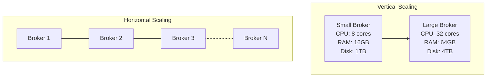

# Scaling

## Overview

Scaling the Event Broker is essential for handling growing data volumes and ensuring performance as healthcare workloads increase. This document covers horizontal and vertical scaling strategies for Kafka clusters, focusing on capacity planning, cluster expansion, and load balancing to maintain performance and reliability under increasing demands.

## Scaling Fundamentals

Kafka supports two primary scaling approaches:

- **Vertical Scaling**: Increasing resources (CPU, memory, disk, network) on existing brokers
- **Horizontal Scaling**: Adding more broker nodes to the Kafka cluster



## Capacity Planning

### Workload Assessment

Before scaling, assess your current and projected workloads:

| Metric | Calculation | Example |
|--------|-------------|----------|
| Message Rate | Messages per second | 10,000 msgs/sec |
| Message Size | Average size per message | 2KB per message |
| Throughput | Message Rate × Message Size | 20MB/sec |
| Retention Period | Time to retain data | 7 days |
| Storage Requirement | Throughput × Retention × Replication Factor | 20MB/sec × 604,800 sec × 3 = ~36TB |

### Resource Requirements

Estimate resource requirements based on workload:

| Resource | Sizing Guideline | Example |
|----------|------------------|----------|
| CPU | 1 core per 2-3K msgs/sec | 4-5 cores for 10K msgs/sec |
| Memory | 5GB base + 1GB per partition replica | 32GB for 27 partition replicas |
| Disk | Throughput × Retention × Replication × 1.5 (buffer) | 36TB × 1.5 = 54TB |
| Network | 2 × Throughput (in + out) | 40MB/sec minimum |

### Scaling Triggers

Monitor these indicators to determine when scaling is needed:

| Trigger | Warning Threshold | Critical Threshold |
|---------|-------------------|--------------------|
| CPU Utilization | >60% sustained | >80% sustained |
| Disk Utilization | >70% capacity | >85% capacity |
| Network Utilization | >60% capacity | >80% capacity |
| Producer Latency | >10ms p99 | >50ms p99 |
| Consumer Lag | Growing steadily | Continuously increasing |
| Request Queue Time | >10ms average | >50ms average |

## Horizontal Scaling

### Adding Brokers

Process for adding new brokers to a Kafka cluster:

```bash
# 1. Prepare the new broker
# Install Kafka and configure server.properties with a unique broker.id

# Example server.properties for a new broker
cat > /etc/kafka/server.properties << EOF
broker.id=4  # Use a unique ID
listeners=PLAINTEXT://broker4:9092
advertised.listeners=PLAINTEXT://broker4:9092
log.dirs=/var/lib/kafka/data
zookeeper.connect=zk1:2181,zk2:2181,zk3:2181
auto.create.topics.enable=false
default.replication.factor=3
min.insync.replicas=2
num.partitions=12
log.retention.hours=168
num.network.threads=8
num.io.threads=16
socket.send.buffer.bytes=1048576
socket.receive.buffer.bytes=1048576
socket.request.max.bytes=104857600
group.initial.rebalance.delay.ms=3000
EOF

# 2. Start the new broker
systemctl start kafka

# 3. Verify the broker joined the cluster
kafka-broker-api-versions --bootstrap-server broker4:9092
```

### Partition Reassignment

Rebalance partitions across brokers after adding new nodes:

```bash
# 1. Generate a reassignment plan
kafka-reassign-partitions --bootstrap-server kafka:9092 \
  --topics-to-move-json-file topics-to-move.json \
  --broker-list "1,2,3,4" \
  --generate > reassignment-plan.json

# Example topics-to-move.json
cat > topics-to-move.json << EOF
{
  "topics": [
    {"topic": "clinical.patient.events"},
    {"topic": "clinical.observation.recorded"},
    {"topic": "administrative.appointment.events"}
  ],
  "version": 1
}
EOF

# 2. Execute the reassignment plan
kafka-reassign-partitions --bootstrap-server kafka:9092 \
  --reassignment-json-file reassignment-plan.json \
  --execute

# 3. Verify the reassignment status
kafka-reassign-partitions --bootstrap-server kafka:9092 \
  --reassignment-json-file reassignment-plan.json \
  --verify
```

### Automated Partition Distribution

Use Cruise Control for automated partition balancing:

```yaml
# Cruise Control configuration (cruisecontrol.properties)
bootstrap.servers=kafka1:9092,kafka2:9092,kafka3:9092
zookeeper.connect=zk1:2181,zk2:2181,zk3:2181

# Metrics configuration
metric.sampler.class=com.linkedin.kafka.cruisecontrol.monitor.sampling.CruiseControlMetricsReporterSampler
metric.reporter.topic.pattern=__CruiseControlMetrics

# Goals configuration
default.goals=com.linkedin.kafka.cruisecontrol.analyzer.goals.RackAwareGoal,\
com.linkedin.kafka.cruisecontrol.analyzer.goals.ReplicaCapacityGoal,\
com.linkedin.kafka.cruisecontrol.analyzer.goals.DiskCapacityGoal,\
com.linkedin.kafka.cruisecontrol.analyzer.goals.NetworkInboundCapacityGoal,\
com.linkedin.kafka.cruisecontrol.analyzer.goals.NetworkOutboundCapacityGoal,\
com.linkedin.kafka.cruisecontrol.analyzer.goals.CpuCapacityGoal,\
com.linkedin.kafka.cruisecontrol.analyzer.goals.ReplicaDistributionGoal,\
com.linkedin.kafka.cruisecontrol.analyzer.goals.PotentialNwOutGoal,\
com.linkedin.kafka.cruisecontrol.analyzer.goals.DiskUsageDistributionGoal,\
com.linkedin.kafka.cruisecontrol.analyzer.goals.NetworkInboundUsageDistributionGoal,\
com.linkedin.kafka.cruisecontrol.analyzer.goals.NetworkOutboundUsageDistributionGoal,\
com.linkedin.kafka.cruisecontrol.analyzer.goals.CpuUsageDistributionGoal,\
com.linkedin.kafka.cruisecontrol.analyzer.goals.TopicReplicaDistributionGoal,\
com.linkedin.kafka.cruisecontrol.analyzer.goals.LeaderBytesInDistributionGoal

# Anomaly detection configuration
anomaly.detection.goals=com.linkedin.kafka.cruisecontrol.analyzer.goals.RackAwareGoal,\
com.linkedin.kafka.cruisecontrol.analyzer.goals.ReplicaCapacityGoal,\
com.linkedin.kafka.cruisecontrol.analyzer.goals.DiskCapacityGoal
```

```bash
# Rebalance cluster with Cruise Control
curl -X POST "http://cruisecontrol:9090/kafkacruisecontrol/rebalance" \
  -d "dryRun=false&goals=DiskCapacityGoal,RackAwareGoal,ReplicaCapacityGoal,CpuCapacityGoal,ReplicaDistributionGoal,DiskUsageDistributionGoal,NetworkInboundUsageDistributionGoal,NetworkOutboundUsageDistributionGoal,CpuUsageDistributionGoal"
```

## Vertical Scaling

### Broker Resource Upgrade

Process for upgrading existing broker resources:

```bash
# 1. Plan the maintenance window
# 2. Take one broker offline at a time
systemctl stop kafka

# 3. Upgrade hardware or cloud resources
# For cloud environments, resize the instance
# For on-premises, add CPU, memory, or disk

# 4. Update configuration if needed
sed -i 's/num.network.threads=8/num.network.threads=16/' /etc/kafka/server.properties
sed -i 's/num.io.threads=16/num.io.threads=32/' /etc/kafka/server.properties

# 5. Restart the broker
systemctl start kafka

# 6. Verify the broker rejoined the cluster
kafka-broker-api-versions --bootstrap-server broker1:9092

# 7. Wait for partition rebalance to complete
kafka-topics --bootstrap-server kafka:9092 --describe --under-replicated

# 8. Move to the next broker
```

### Storage Expansion

Expand storage for existing brokers:

```bash
# For cloud environments (AWS example)
aws ec2 modify-volume --volume-id vol-1234567890abcdef0 --size 2000

# For on-premises with LVM
# 1. Add new physical disk
# 2. Create PV
pvcreate /dev/sdc

# 3. Extend volume group
vgextend kafka-vg /dev/sdc

# 4. Extend logical volume
lvextend -l +100%FREE /dev/kafka-vg/kafka-lv

# 5. Resize filesystem
resize2fs /dev/kafka-vg/kafka-lv

# 6. Verify new size
df -h /var/lib/kafka/data
```

## Multi-Cluster Scaling

### Cluster Federation

Implement multi-cluster architecture for large-scale deployments:

```mermaid
flowchart LR
    subgraph "Cluster A - Clinical Data"
        BrokerA1["Broker A1"]
        BrokerA2["Broker A2"]
        BrokerA3["Broker A3"]
    end
    
    subgraph "Cluster B - Administrative Data"
        BrokerB1["Broker B1"]
        BrokerB2["Broker B2"]
        BrokerB3["Broker B3"]
    end
    
    subgraph "Cluster C - Analytics Data"
        BrokerC1["Broker C1"]
        BrokerC2["Broker C2"]
        BrokerC3["Broker C3"]
    end
    
    MirrorMakerAB["MirrorMaker A→B"]
    MirrorMakerAC["MirrorMaker A→C"]
    MirrorMakerBC["MirrorMaker B→C"]
    
    Cluster A --> MirrorMakerAB --> Cluster B
    Cluster A --> MirrorMakerAC --> Cluster C
    Cluster B --> MirrorMakerBC --> Cluster C
```

### MirrorMaker 2.0 Configuration

Configure MirrorMaker 2.0 for cross-cluster replication:

```properties
# MirrorMaker 2.0 configuration (mm2.properties)

# Clusters configuration
clusters=clinical,administrative,analytics
clinical.bootstrap.servers=clinical-kafka-1:9092,clinical-kafka-2:9092,clinical-kafka-3:9092
administrative.bootstrap.servers=admin-kafka-1:9092,admin-kafka-2:9092,admin-kafka-3:9092
analytics.bootstrap.servers=analytics-kafka-1:9092,analytics-kafka-2:9092,analytics-kafka-3:9092

# Clinical to Analytics replication
clinical->analytics.enabled=true
clinical->analytics.topics=clinical.\w+.events
clinical->analytics.topics.exclude=__consumer_offsets|__transaction_state|_schemas
clinical->analytics.emit.heartbeats=true
clinical->analytics.emit.checkpoints=true

# Administrative to Analytics replication
administrative->analytics.enabled=true
administrative->analytics.topics=administrative.\w+.events
administrative->analytics.topics.exclude=__consumer_offsets|__transaction_state|_schemas
administrative->analytics.emit.heartbeats=true
administrative->analytics.emit.checkpoints=true

# Replication policy
clinical->analytics.replication.policy.class=org.apache.kafka.connect.mirror.IdentityReplicationPolicy
administrative->analytics.replication.policy.class=org.apache.kafka.connect.mirror.IdentityReplicationPolicy

# Security configuration
clinical.security.protocol=SASL_SSL
clinical.sasl.mechanism=PLAIN
clinical.sasl.jaas.config=org.apache.kafka.common.security.plain.PlainLoginModule required username="mirrormaker" password="password";

administrative.security.protocol=SASL_SSL
administrative.sasl.mechanism=PLAIN
administrative.sasl.jaas.config=org.apache.kafka.common.security.plain.PlainLoginModule required username="mirrormaker" password="password";

analytics.security.protocol=SASL_SSL
analytics.sasl.mechanism=PLAIN
analytics.sasl.jaas.config=org.apache.kafka.common.security.plain.PlainLoginModule required username="mirrormaker" password="password";
```

## Cloud Scaling

### Kubernetes Deployment

Implement Kafka on Kubernetes for dynamic scaling:

```yaml
# Kafka StatefulSet on Kubernetes
apiVersion: apps/v1
kind: StatefulSet
metadata:
  name: kafka
  namespace: event-broker
spec:
  serviceName: "kafka"
  replicas: 3
  selector:
    matchLabels:
      app: kafka
  template:
    metadata:
      labels:
        app: kafka
    spec:
      containers:
      - name: kafka
        image: confluentinc/cp-kafka:7.3.0
        ports:
        - containerPort: 9092
          name: client
        - containerPort: 9093
          name: internal
        env:
        - name: KAFKA_BROKER_ID
          valueFrom:
            fieldRef:
              fieldPath: metadata.name
              apiVersion: v1
              fieldPath: metadata.name
        - name: KAFKA_ZOOKEEPER_CONNECT
          value: "zookeeper:2181"
        - name: KAFKA_LISTENER_SECURITY_PROTOCOL_MAP
          value: "INTERNAL:PLAINTEXT,EXTERNAL:PLAINTEXT"
        - name: KAFKA_ADVERTISED_LISTENERS
          value: "INTERNAL://$(HOSTNAME).kafka.$(NAMESPACE).svc.cluster.local:9093,EXTERNAL://$(HOSTNAME).kafka.$(NAMESPACE).svc.cluster.local:9092"
        - name: KAFKA_INTER_BROKER_LISTENER_NAME
          value: "INTERNAL"
        - name: KAFKA_AUTO_CREATE_TOPICS_ENABLE
          value: "false"
        - name: KAFKA_DEFAULT_REPLICATION_FACTOR
          value: "3"
        - name: KAFKA_MIN_INSYNC_REPLICAS
          value: "2"
        - name: KAFKA_NUM_PARTITIONS
          value: "12"
        volumeMounts:
        - name: kafka-data
          mountPath: /var/lib/kafka/data
  volumeClaimTemplates:
  - metadata:
      name: kafka-data
    spec:
      accessModes: [ "ReadWriteOnce" ]
      storageClassName: "fast-storage"
      resources:
        requests:
          storage: 1Ti
```

### Strimzi Operator

Use Strimzi Operator for automated Kafka management on Kubernetes:

```yaml
# Kafka cluster managed by Strimzi
apiVersion: kafka.strimzi.io/v1beta2
kind: Kafka
metadata:
  name: healthcare-kafka
  namespace: event-broker
spec:
  kafka:
    version: 3.3.1
    replicas: 3
    listeners:
      - name: plain
        port: 9092
        type: internal
        tls: false
      - name: tls
        port: 9093
        type: internal
        tls: true
        authentication:
          type: tls
      - name: external
        port: 9094
        type: loadbalancer
        tls: true
        authentication:
          type: tls
    config:
      auto.create.topics.enable: "false"
      default.replication.factor: 3
      min.insync.replicas: 2
      num.partitions: 12
      offsets.topic.replication.factor: 3
      transaction.state.log.replication.factor: 3
      transaction.state.log.min.isr: 2
      log.retention.hours: 168
      log.segment.bytes: 1073741824
    storage:
      type: jbod
      volumes:
      - id: 0
        type: persistent-claim
        size: 1Ti
        deleteClaim: false
        class: fast-storage
    resources:
      requests:
        memory: 8Gi
        cpu: 2
      limits:
        memory: 16Gi
        cpu: 4
    jvmOptions:
      -Xms: 4g
      -Xmx: 4g
      -XX:
        +UseG1GC: {}
        MaxGCPauseMillis: 20
        InitiatingHeapOccupancyPercent: 35
  zookeeper:
    replicas: 3
    storage:
      type: persistent-claim
      size: 100Gi
      deleteClaim: false
      class: fast-storage
    resources:
      requests:
        memory: 2Gi
        cpu: 0.5
      limits:
        memory: 4Gi
        cpu: 2
  entityOperator:
    topicOperator: {}
    userOperator: {}
```

### Auto-Scaling

Implement auto-scaling for Kafka clusters on Kubernetes:

```yaml
# Kafka Cruise Control with auto-scaling
apiVersion: kafka.strimzi.io/v1beta2
kind: KafkaRebalance
metadata:
  name: healthcare-kafka-rebalance
  namespace: event-broker
  labels:
    strimzi.io/cluster: healthcare-kafka
spec:
  goals:
    - DiskCapacityGoal
    - RackAwareGoal
    - ReplicaCapacityGoal
    - CpuCapacityGoal
    - ReplicaDistributionGoal
    - DiskUsageDistributionGoal
    - NetworkInboundUsageDistributionGoal
    - NetworkOutboundUsageDistributionGoal
    - CpuUsageDistributionGoal
  skipHardGoalCheck: false
```

## Scaling Best Practices

### Partition Scaling Guidelines

Follow these guidelines for partition scaling:

| Topic Type | Initial Partitions | Scaling Strategy | Max Partitions |
|------------|-------------------|------------------|----------------|
| High-volume clinical | 24-32 | Scale early, before reaching capacity | 96-128 |
| Standard operational | 12-16 | Scale when throughput reaches 70% | 48-64 |
| Low-volume reference | 6-8 | Scale only when necessary | 24-32 |

### Broker Scaling Guidelines

Follow these guidelines for broker scaling:

| Cluster Size | Broker Count | Scaling Trigger | Scaling Increment |
|--------------|-------------|-----------------|-------------------|
| Small | 3-5 | >70% resource utilization | +2 brokers |
| Medium | 6-12 | >70% resource utilization | +3 brokers |
| Large | 13+ | >70% resource utilization | +5 brokers |

### Scaling Checklist

- [ ] Monitor resource utilization and performance metrics
- [ ] Identify scaling triggers and bottlenecks
- [ ] Plan capacity based on projected growth
- [ ] Test scaling operations in non-production environment
- [ ] Schedule maintenance windows for scaling operations
- [ ] Perform scaling operations during low-traffic periods
- [ ] Monitor cluster health during and after scaling
- [ ] Update documentation with new cluster configuration
- [ ] Review and adjust monitoring thresholds for the new scale

## Related Documentation

- [Performance Tuning](performance-tuning.md): Optimizing Event Broker performance
- [Monitoring](monitoring.md): Comprehensive monitoring of the Event Broker
- [Security](security.md): Securing the Event Broker
- [Disaster Recovery](disaster-recovery.md): Ensuring data availability and recovery
