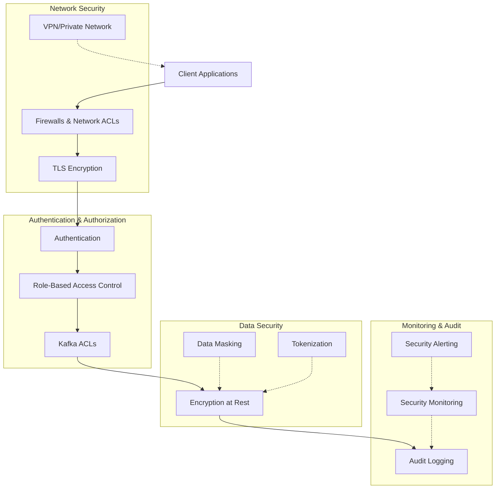

# Security

## Overview

Security is a critical aspect of Event Broker operations, particularly when handling sensitive healthcare data. This document covers the implementation of comprehensive security measures for the Event Broker, focusing on authentication, authorization, encryption, and audit logging to ensure data protection and regulatory compliance.

## Security Architecture

The Event Broker security architecture implements defense in depth with multiple security layers:



## Authentication

### SASL Configuration

Kafka supports several SASL (Simple Authentication and Security Layer) mechanisms:

| Mechanism | Description | Use Case |
|-----------|-------------|----------|
| PLAIN | Simple username/password | Development environments |
| SCRAM | Salted Challenge Response | Production without external auth |
| OAUTHBEARER | OAuth 2.0 tokens | Enterprise integration |
| GSSAPI | Kerberos | Enterprise with existing Kerberos |

For production environments, SASL/SCRAM is recommended:

```properties
# Broker configuration (server.properties)
sasl.enabled.mechanisms=SCRAM-SHA-512
listener.name.sasl_ssl.scram-sha-512.sasl.jaas.config=org.apache.kafka.common.security.scram.ScramLoginModule required;
security.inter.broker.protocol=SASL_SSL
sasl.mechanism.inter.broker.protocol=SCRAM-SHA-512

# Client configuration
security.protocol=SASL_SSL
sasl.mechanism=SCRAM-SHA-512
sasl.jaas.config=org.apache.kafka.common.security.scram.ScramLoginModule required username="user1" password="password1";
```

### OAuth Integration

For enterprise environments, OAuth integration provides centralized authentication:

```properties
# Broker configuration (server.properties)
sasl.enabled.mechanisms=OAUTHBEARER
listener.name.sasl_ssl.oauthbearer.sasl.jaas.config=org.apache.kafka.common.security.oauthbearer.OAuthBearerLoginModule required \
  oauth.client.id="kafka" \
  oauth.client.secret="kafka-secret" \
  oauth.token.endpoint.uri="https://auth.example.com/oauth2/token" \
  oauth.jwks.endpoint.uri="https://auth.example.com/oauth2/jwks";
security.inter.broker.protocol=SASL_SSL
sasl.mechanism.inter.broker.protocol=OAUTHBEARER

# Client configuration
security.protocol=SASL_SSL
sasl.mechanism=OAUTHBEARER
sasl.jaas.config=org.apache.kafka.common.security.oauthbearer.OAuthBearerLoginModule required \
  oauth.client.id="client-app" \
  oauth.client.secret="client-secret" \
  oauth.token.endpoint.uri="https://auth.example.com/oauth2/token";
sasl.login.callback.handler.class=org.apache.kafka.common.security.oauthbearer.secured.OAuthBearerLoginCallbackHandler
```

### TLS Client Authentication

TLS client authentication provides certificate-based authentication:

```properties
# Broker configuration (server.properties)
ssl.client.auth=required
ssl.truststore.location=/var/private/ssl/kafka.server.truststore.jks
ssl.truststore.password=truststore-password
ssl.keystore.location=/var/private/ssl/kafka.server.keystore.jks
ssl.keystore.password=keystore-password
ssl.key.password=key-password

# Client configuration
security.protocol=SSL
ssl.truststore.location=/var/private/ssl/kafka.client.truststore.jks
ssl.truststore.password=truststore-password
ssl.keystore.location=/var/private/ssl/kafka.client.keystore.jks
ssl.keystore.password=keystore-password
ssl.key.password=key-password
```

## Authorization

### Kafka ACLs

Kafka Access Control Lists (ACLs) provide fine-grained authorization:

```bash
# Create ACLs for a producer application
kafka-acls --bootstrap-server kafka:9092 \
  --command-config admin.properties \
  --add \
  --allow-principal User:app1 \
  --producer \
  --topic patient-data

# Create ACLs for a consumer application
kafka-acls --bootstrap-server kafka:9092 \
  --command-config admin.properties \
  --add \
  --allow-principal User:app2 \
  --consumer \
  --topic patient-data \
  --group patient-processors

# Create ACLs for topic management
kafka-acls --bootstrap-server kafka:9092 \
  --command-config admin.properties \
  --add \
  --allow-principal User:admin \
  --operation Create --operation Delete --operation Describe --operation AlterConfigs \
  --topic '*'
```

### Role-Based Access Control

Implement role-based access control (RBAC) for Kafka operations:

| Role | Permissions | Example Principal |
|------|-------------|-------------------|
| Admin | Full cluster management | `User:kafka-admin` |
| Producer | Write to specific topics | `User:data-producer` |
| Consumer | Read from specific topics | `User:data-consumer` |
| Monitor | Read metrics and status | `User:monitoring-service` |

```bash
# Create roles using ACLs

# Admin role
kafka-acls --bootstrap-server kafka:9092 \
  --command-config admin.properties \
  --add \
  --allow-principal User:kafka-admin \
  --operation All \
  --cluster

# Producer role for clinical data
kafka-acls --bootstrap-server kafka:9092 \
  --command-config admin.properties \
  --add \
  --allow-principal User:clinical-producer \
  --producer \
  --topic "clinical.*"

# Consumer role for billing system
kafka-acls --bootstrap-server kafka:9092 \
  --command-config admin.properties \
  --add \
  --allow-principal User:billing-consumer \
  --consumer \
  --topic "financial.*" \
  --group "billing-processors"
```

## Encryption

### TLS Configuration

Secure communications with TLS encryption:

```properties
# Broker configuration (server.properties)
listeners=PLAINTEXT://localhost:9092,SSL://localhost:9093
ssl.keystore.location=/var/private/ssl/kafka.server.keystore.jks
ssl.keystore.password=keystore-password
ssl.key.password=key-password
ssl.truststore.location=/var/private/ssl/kafka.server.truststore.jks
ssl.truststore.password=truststore-password
ssl.client.auth=required
ssl.enabled.protocols=TLSv1.2,TLSv1.3
ssl.cipher.suites=TLS_AES_256_GCM_SHA384,TLS_CHACHA20_POLY1305_SHA256,TLS_AES_128_GCM_SHA256
ssl.endpoint.identification.algorithm=HTTPS

# Client configuration
security.protocol=SSL
ssl.truststore.location=/var/private/ssl/kafka.client.truststore.jks
ssl.truststore.password=truststore-password
ssl.keystore.location=/var/private/ssl/kafka.client.keystore.jks
ssl.keystore.password=keystore-password
ssl.key.password=key-password
ssl.endpoint.identification.algorithm=HTTPS
```

### Creating Certificates

```bash
#!/bin/bash
# Generate CA
openssl req -new -x509 -keyout ca-key -out ca-cert -days 365 -subj "/CN=kafka-ca" -nodes

# Create server keystore
keytool -keystore kafka.server.keystore.jks -alias localhost -validity 365 -genkey -keyalg RSA -storepass keystore-password -keypass key-password -dname "CN=kafka.example.com, OU=IT, O=Example Healthcare, L=New York, S=NY, C=US"

# Create CSR
keytool -keystore kafka.server.keystore.jks -alias localhost -certreq -file server-cert-sign-request -storepass keystore-password -keypass key-password

# Sign CSR with CA
openssl x509 -req -CA ca-cert -CAkey ca-key -in server-cert-sign-request -out server-cert-signed -days 365 -CAcreateserial

# Import CA cert to server keystore
keytool -keystore kafka.server.keystore.jks -alias CARoot -import -file ca-cert -storepass keystore-password -keypass key-password -noprompt

# Import signed cert to server keystore
keytool -keystore kafka.server.keystore.jks -alias localhost -import -file server-cert-signed -storepass keystore-password -keypass key-password -noprompt

# Create server truststore and import CA cert
keytool -keystore kafka.server.truststore.jks -alias CARoot -import -file ca-cert -storepass truststore-password -keypass truststore-password -noprompt

# Create client keystore and truststore (similar steps)
```

### Encryption at Rest

Protect data stored on disk with encryption:

```properties
# Enable encryption for Kafka data directories
# This typically uses filesystem or volume-level encryption

# For Linux systems, use LUKS
# Example: Create encrypted volume
cryptsetup luksFormat /dev/xvdf
cryptsetup luksOpen /dev/xvdf kafka-data
mkfs.xfs /dev/mapper/kafka-data
mount /dev/mapper/kafka-data /var/lib/kafka

# For cloud environments, use provider-specific encryption
# AWS example in CloudFormation
KafkaDataVolume:
  Type: AWS::EC2::Volume
  Properties:
    Size: 100
    AvailabilityZone: !GetAtt KafkaInstance.AvailabilityZone
    Encrypted: true
    KmsKeyId: !Ref KafkaDataKey
```

## Data Protection

### Sensitive Data Handling

Protect sensitive healthcare data in transit and at rest:

```java
// Example: Kafka producer with data masking for PHI
public class PHIMaskingProducer<K, V> {
    private final KafkaProducer<K, V> producer;
    private final ObjectMapper objectMapper;
    private final Set<String> sensitiveFields;
    
    public PHIMaskingProducer(Properties config, Set<String> sensitiveFields) {
        this.producer = new KafkaProducer<>(config);
        this.objectMapper = new ObjectMapper();
        this.sensitiveFields = sensitiveFields;
    }
    
    public Future<RecordMetadata> send(String topic, K key, V value) {
        // Mask sensitive fields if value is a JSON object
        if (value instanceof String) {
            try {
                String valueStr = (String) value;
                JsonNode jsonNode = objectMapper.readTree(valueStr);
                if (jsonNode.isObject()) {
                    ObjectNode objectNode = (ObjectNode) jsonNode;
                    maskSensitiveFields(objectNode, sensitiveFields);
                    String maskedValue = objectMapper.writeValueAsString(objectNode);
                    return producer.send(new ProducerRecord<>(topic, key, (V) maskedValue));
                }
            } catch (Exception e) {
                // Not JSON or error processing, continue with original value
            }
        }
        
        return producer.send(new ProducerRecord<>(topic, key, value));
    }
    
    private void maskSensitiveFields(ObjectNode node, Set<String> sensitiveFields) {
        sensitiveFields.forEach(field -> {
            if (node.has(field)) {
                JsonNode fieldValue = node.get(field);
                if (fieldValue.isTextual()) {
                    // Apply masking based on field type
                    String masked = maskValue(field, fieldValue.asText());
                    node.put(field, masked);
                }
            }
        });
        
        // Recursively process nested objects
        node.fields().forEachRemaining(entry -> {
            if (entry.getValue().isObject()) {
                maskSensitiveFields((ObjectNode) entry.getValue(), sensitiveFields);
            } else if (entry.getValue().isArray()) {
                ArrayNode arrayNode = (ArrayNode) entry.getValue();
                for (int i = 0; i < arrayNode.size(); i++) {
                    if (arrayNode.get(i).isObject()) {
                        maskSensitiveFields((ObjectNode) arrayNode.get(i), sensitiveFields);
                    }
                }
            }
        });
    }
    
    private String maskValue(String fieldName, String value) {
        switch (fieldName) {
            case "ssn":
                return "XXX-XX-" + value.substring(value.length() - 4);
            case "creditCard":
                return "XXXX-XXXX-XXXX-" + value.substring(value.length() - 4);
            case "phoneNumber":
                return "(XXX) XXX-" + value.substring(value.length() - 4);
            case "email":
                int atIndex = value.indexOf('@');
                if (atIndex > 1) {
                    return value.charAt(0) + "..." + value.substring(atIndex);
                }
                return "x...@example.com";
            default:
                // Default masking for other sensitive fields
                if (value.length() > 4) {
                    return "XXXXX" + value.substring(value.length() - 4);
                } else {
                    return "XXXXX";
                }
        }
    }
    
    public void close() {
        producer.close();
    }
}
```

### Topic-Level Security

Implement security at the topic level for different data classifications:

```bash
# Create topic with restricted access for PHI data
kafka-topics --bootstrap-server kafka:9092 \
  --command-config admin.properties \
  --create \
  --topic phi.patient.data \
  --partitions 12 \
  --replication-factor 3 \
  --config cleanup.policy=delete \
  --config retention.ms=86400000 \
  --config min.insync.replicas=2

# Set restrictive ACLs for PHI topics
kafka-acls --bootstrap-server kafka:9092 \
  --command-config admin.properties \
  --add \
  --allow-principal User:phi-authorized-app \
  --producer \
  --topic "phi.*"

kafka-acls --bootstrap-server kafka:9092 \
  --command-config admin.properties \
  --add \
  --allow-principal User:phi-consumer-app \
  --consumer \
  --topic "phi.*" \
  --group "phi-processors"
```

## Audit Logging

### Broker Audit Configuration

Configure comprehensive audit logging for Kafka brokers:

```properties
# Enable authorizer logging
authorizer.class.name=kafka.security.authorizer.AclAuthorizer
super.users=User:admin;User:kafka
allow.everyone.if.no.acl.found=false

# Configure audit logging
log4j.logger.kafka.authorizer.logger=INFO, authorizerAppender
log4j.appender.authorizerAppender=org.apache.log4j.DailyRollingFileAppender
log4j.appender.authorizerAppender.DatePattern='.'yyyy-MM-dd
log4j.appender.authorizerAppender.File=${kafka.logs.dir}/kafka-authorizer.log
log4j.appender.authorizerAppender.layout=org.apache.log4j.PatternLayout
log4j.appender.authorizerAppender.layout.ConversionPattern=[%d] %p %m (%c)%n
```

### Client-Side Audit Interceptors

Implement client-side interceptors for detailed audit logging:

```java
public class AuditProducerInterceptor implements ProducerInterceptor<String, String> {
    private static final Logger logger = LoggerFactory.getLogger(AuditProducerInterceptor.class);
    
    @Override
    public ProducerRecord<String, String> onSend(ProducerRecord<String, String> record) {
        // Log the record being sent
        logger.info("Sending record to topic={}, partition={}, key={}, timestamp={}",
                   record.topic(), record.partition(), record.key(), record.timestamp());
        
        // Add audit metadata headers
        record.headers().add("audit.user", 
                           getCurrentUser().getBytes(StandardCharsets.UTF_8));
        record.headers().add("audit.timestamp", 
                           String.valueOf(System.currentTimeMillis()).getBytes(StandardCharsets.UTF_8));
        record.headers().add("audit.source", 
                           getApplicationName().getBytes(StandardCharsets.UTF_8));
        
        return record;
    }
    
    @Override
    public void onAcknowledgement(RecordMetadata metadata, Exception exception) {
        if (exception != null) {
            logger.error("Error sending record to topic={}, partition={}", 
                       metadata.topic(), metadata.partition(), exception);
        } else {
            logger.debug("Record acknowledged: topic={}, partition={}, offset={}", 
                       metadata.topic(), metadata.partition(), metadata.offset());
        }
    }
    
    @Override
    public void close() {
        // No resources to close
    }
    
    @Override
    public void configure(Map<String, ?> configs) {
        // No configuration needed
    }
    
    private String getCurrentUser() {
        // Get current user from security context
        return SecurityContextHolder.getContext().getAuthentication().getName();
    }
    
    private String getApplicationName() {
        // Get application name from configuration
        return System.getProperty("application.name", "unknown");
    }
}

// Configure interceptor in producer properties
Properties props = new Properties();
props.put(ProducerConfig.BOOTSTRAP_SERVERS_CONFIG, "kafka:9092");
props.put(ProducerConfig.INTERCEPTOR_CLASSES_CONFIG, 
         "com.example.kafka.AuditProducerInterceptor");
```

### Centralized Audit Collection

Implement centralized audit log collection and analysis:

```yaml
# Filebeat configuration for Kafka audit logs
filebeat.inputs:
- type: log
  enabled: true
  paths:
    - /var/log/kafka/kafka-authorizer.log
  fields:
    log_type: kafka_authorizer
    component: kafka
  multiline:
    pattern: '^\['
    negate: true
    match: after

output.elasticsearch:
  hosts: ["elasticsearch:9200"]
  index: "kafka-audit-%{+yyyy.MM.dd}"
  username: "${ELASTICSEARCH_USERNAME}"
  password: "${ELASTICSEARCH_PASSWORD}"
```

## Security Monitoring

### Security Metrics

Monitor security-related metrics for anomaly detection:

```yaml
# Prometheus configuration for security metrics
scrape_configs:
  - job_name: 'kafka'
    static_configs:
      - targets: ['kafka-broker-1:9090', 'kafka-broker-2:9090', 'kafka-broker-3:9090']

# Grafana dashboard for security monitoring
{
  "title": "Kafka Security Dashboard",
  "panels": [
    {
      "title": "Authentication Failures",
      "type": "graph",
      "datasource": "Prometheus",
      "targets": [
        {
          "expr": "sum(rate(kafka_server_failed_authentication_total[5m])) by (listener)"
        }
      ]
    },
    {
      "title": "Authorization Failures",
      "type": "graph",
      "datasource": "Prometheus",
      "targets": [
        {
          "expr": "sum(rate(kafka_server_failed_authorization_total[5m])) by (user)"
        }
      ]
    }
  ]
}
```

### Security Alerts

Configure alerts for security-related events:

```yaml
# Prometheus Alert Rules for Kafka security
groups:
- name: kafka_security_alerts
  rules:
  - alert: KafkaAuthenticationFailures
    expr: sum(rate(kafka_server_failed_authentication_total[5m])) > 10
    for: 5m
    labels:
      severity: warning
    annotations:
      summary: "High rate of authentication failures"
      description: "Kafka cluster has {{ $value }} authentication failures per second"

  - alert: KafkaAuthorizationFailures
    expr: sum(rate(kafka_server_failed_authorization_total[5m])) > 10
    for: 5m
    labels:
      severity: warning
    annotations:
      summary: "High rate of authorization failures"
      description: "Kafka cluster has {{ $value }} authorization failures per second"

  - alert: KafkaSensitiveTopicAccess
    expr: sum(rate(kafka_server_successful_authentication_total{listener=~".*EXTERNAL.*"}[5m])) > 0
    for: 5m
    labels:
      severity: warning
    annotations:
      summary: "External access to Kafka detected"
      description: "External access to Kafka detected on listener {{ $labels.listener }}"
```

## Compliance Considerations

### HIPAA Compliance

Ensure HIPAA compliance for healthcare data:

| HIPAA Requirement | Kafka Implementation |
|-------------------|----------------------|
| Access Controls | SASL authentication + ACLs |
| Audit Controls | Authorizer logging + interceptors |
| Integrity Controls | TLS + data validation |
| Transmission Security | TLS encryption |
| Unique User Identification | SASL authentication with unique credentials |

### Compliance Checklist

- [ ] Implement strong authentication (SASL/SCRAM or OAuth)
- [ ] Configure fine-grained ACLs for all topics
- [ ] Enable TLS encryption for all communication
- [ ] Implement encryption at rest for all data
- [ ] Configure comprehensive audit logging
- [ ] Implement data masking for PHI
- [ ] Establish security monitoring and alerting
- [ ] Document security controls for compliance audits
- [ ] Conduct regular security assessments
- [ ] Implement secure key management

## Related Documentation

- [Monitoring](monitoring.md): Comprehensive monitoring of the Event Broker
- [Disaster Recovery](disaster-recovery.md): Ensuring data availability and recovery
- [Performance Tuning](performance-tuning.md): Optimizing Event Broker performance
- [Scaling](scaling.md): Scaling the Event Broker for high throughput
