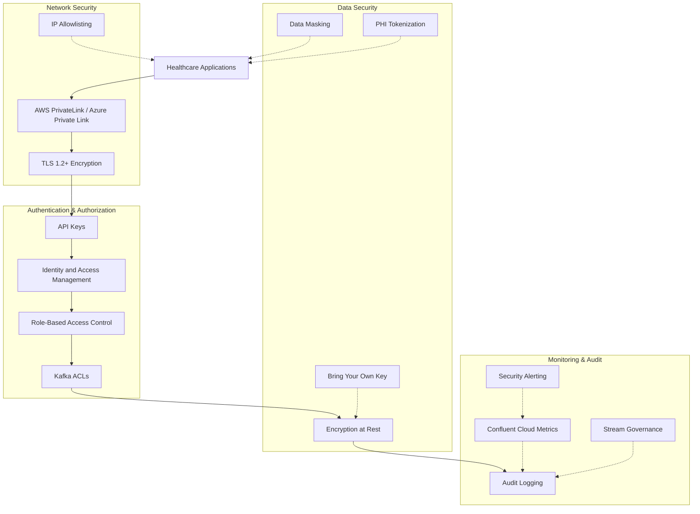

# Security in Confluent Cloud

## Overview

Security is a critical aspect of Event Broker operations, particularly when handling sensitive healthcare data. This document covers the implementation of comprehensive security measures for the Event Broker using Confluent Cloud, focusing on authentication, authorization, encryption, and audit logging to ensure data protection and regulatory compliance in cloud-native healthcare environments.

## Confluent Cloud Security Architecture

The Confluent Cloud security architecture implements defense in depth with multiple security layers for healthcare data protection:



### Key Security Components

1. **Network Security**: Confluent Cloud provides secure connectivity options including private networking (AWS PrivateLink, Azure Private Link, GCP Private Service Connect) and IP allowlisting to restrict access to trusted networks.

2. **Authentication**: Secure API keys with fine-grained permissions and integration with enterprise identity providers through OAuth.

3. **Authorization**: Granular role-based access control (RBAC) and Apache Kafka ACLs to enforce least privilege access to healthcare data.

4. **Encryption**: Automatic TLS encryption for data in transit and encryption at rest with optional Bring Your Own Key (BYOK) for healthcare compliance.

5. **Audit & Monitoring**: Comprehensive audit logging and metrics to track access to sensitive healthcare data and detect security anomalies.

## Authentication in Confluent Cloud

### API Key Authentication

Confluent Cloud uses API Keys for secure authentication. These keys provide fine-grained access control and can be easily rotated without service disruption:

```typescript
// Example: TypeScript code to create and manage API keys in Confluent Cloud
import axios from 'axios';

/**
 * Create API keys for healthcare applications to access Confluent Cloud
 */
async function createApiKeys(
  environmentId: string,
  clusterId: string,
  serviceAccountId: string
): Promise<{apiKey: string, apiSecret: string}> {
  try {
    // Configure authentication with Confluent Cloud organization admin credentials
    const orgApiKey = process.env.CONFLUENT_CLOUD_ORG_API_KEY;
    const orgApiSecret = process.env.CONFLUENT_CLOUD_ORG_API_SECRET;
    const auth = Buffer.from(`${orgApiKey}:${orgApiSecret}`).toString('base64');
    
    // Create API key for the service account to access the Kafka cluster
    const response = await axios({
      method: 'POST',
      url: 'https://api.confluent.cloud/iam/v2/api-keys',
      headers: {
        'Content-Type': 'application/json',
        'Authorization': `Basic ${auth}`
      },
      data: {
        spec: {
          display_name: `healthcare-app-${new Date().toISOString().split('T')[0]}`,
          description: 'API key for healthcare application',
          owner: {
            id: serviceAccountId,
            kind: 'ServiceAccount',
            api_version: 'iam/v2'
          },
          resource: {
            id: clusterId,
            kind: 'KafkaCluster',
            api_version: 'cmk/v2',
            environment: {
              id: environmentId
            }
          }
        }
      }
    });
    
    // Extract API key and secret from response
    const apiKey = response.data.spec.key;
    const apiSecret = response.data.spec.secret;
    
    console.log(`Created API key for service account ${serviceAccountId}`);
    
    return { apiKey, apiSecret };
  } catch (error) {
    console.error('Error creating API key:', error.response?.data || error.message);
    throw error;
  }
}

/**
 * Configure Kafka client with API key authentication
 */
function configureKafkaClient(apiKey: string, apiSecret: string, bootstrapServers: string): any {
  return {
    clientId: 'healthcare-application',
    brokers: [bootstrapServers],
    ssl: true,
    sasl: {
      mechanism: 'plain',
      username: apiKey,
      password: apiSecret
    }
  };
}
```

### OAuth Integration

Confluent Cloud supports OAuth integration with enterprise identity providers for centralized authentication:

```typescript
// Example: TypeScript code for OAuth integration with Confluent Cloud
import { Kafka } from 'kafkajs';
import axios from 'axios';

/**
 * Get OAuth token for Confluent Cloud authentication
 */
async function getOAuthToken(
  clientId: string,
  clientSecret: string,
  tokenEndpoint: string,
  scope: string = 'kafka'
): Promise<string> {
  try {
    // Request OAuth token
    const response = await axios({
      method: 'POST',
      url: tokenEndpoint,
      headers: {
        'Content-Type': 'application/x-www-form-urlencoded'
      },
      auth: {
        username: clientId,
        password: clientSecret
      },
      data: `grant_type=client_credentials&scope=${scope}`
    });
    
    // Return access token
    return response.data.access_token;
  } catch (error) {
    console.error('Error getting OAuth token:', error.response?.data || error.message);
    throw error;
  }
}

/**
 * Configure Kafka client with OAuth authentication
 */
async function configureKafkaClientWithOAuth(
  clientId: string,
  clientSecret: string,
  tokenEndpoint: string,
  bootstrapServers: string
): Promise<Kafka> {
  // Get OAuth token
  const token = await getOAuthToken(clientId, clientSecret, tokenEndpoint);
  
  // Configure Kafka client
  const kafka = new Kafka({
    clientId: 'healthcare-oauth-client',
    brokers: [bootstrapServers],
    ssl: true,
    sasl: {
      mechanism: 'oauthbearer',
      oauthBearerToken: token
    }
  });
  
  return kafka;
}
```

### SSO and Identity Federation

Confluent Cloud supports Single Sign-On (SSO) and identity federation for enterprise healthcare environments:

```typescript
// Example: TypeScript code to configure SSO for Confluent Cloud
import axios from 'axios';

/**
 * Configure SSO for Confluent Cloud
 */
async function configureSSOForConfluentCloud(
  organizationId: string,
  identityProviderMetadataUrl: string,
  displayName: string = 'Healthcare SSO'
): Promise<void> {
  try {
    // Configure authentication with Confluent Cloud organization admin credentials
    const orgApiKey = process.env.CONFLUENT_CLOUD_ORG_API_KEY;
    const orgApiSecret = process.env.CONFLUENT_CLOUD_ORG_API_SECRET;
    const auth = Buffer.from(`${orgApiKey}:${orgApiSecret}`).toString('base64');
    
    // Configure SSO
    await axios({
      method: 'POST',
      url: `https://api.confluent.cloud/iam/v2/sso/configs`,
      headers: {
        'Content-Type': 'application/json',
        'Authorization': `Basic ${auth}`
      },
      data: {
        spec: {
          display_name: displayName,
          description: 'SSO configuration for healthcare organization',
          issuer: identityProviderMetadataUrl,
          jwks_uri: `${identityProviderMetadataUrl}/protocol/openid-connect/certs`,
          organization: {
            id: organizationId
          }
        }
      }
    });
    
    console.log('SSO configuration completed for Confluent Cloud');
  } catch (error) {
    console.error('Error configuring SSO:', error.response?.data || error.message);
    throw error;
  }
}
```
ssl.truststore.password=truststore-password
```

## Authorization in Confluent Cloud

### RBAC and ACL Management

Confluent Cloud provides comprehensive Role-Based Access Control (RBAC) and ACL management for healthcare data security:

```typescript
// Example: TypeScript code to manage ACLs in Confluent Cloud
import axios from 'axios';

/**
 * Create ACLs for healthcare applications in Confluent Cloud
 */
async function createHealthcareACLs(
  clusterId: string,
  serviceAccountId: string,
  resourceType: 'TOPIC' | 'GROUP' | 'CLUSTER',
  resourceName: string,
  permission: 'ALLOW' | 'DENY',
  operation: 'READ' | 'WRITE' | 'CREATE' | 'DELETE' | 'ALTER' | 'DESCRIBE' | 'ALL',
  patternType: 'LITERAL' | 'PREFIXED' = 'LITERAL'
): Promise<void> {
  try {
    // Configure authentication with Confluent Cloud admin credentials
    const apiKey = process.env.CONFLUENT_CLOUD_API_KEY;
    const apiSecret = process.env.CONFLUENT_CLOUD_API_SECRET;
    const auth = Buffer.from(`${apiKey}:${apiSecret}`).toString('base64');
    
    // Create ACL
    await axios({
      method: 'POST',
      url: `https://api.confluent.cloud/kafka/v3/clusters/${clusterId}/acls`,
      headers: {
        'Content-Type': 'application/json',
        'Authorization': `Basic ${auth}`
      },
      data: {
        resource_type: resourceType,
        resource_name: resourceName,
        pattern_type: patternType,
        principal: `User:${serviceAccountId}`,
        host: '*',
        operation: operation,
        permission: permission
      }
    });
    
    console.log(`Created ACL for ${resourceType} ${resourceName} with ${operation} permission`);
  } catch (error) {
    console.error('Error creating ACL:', error.response?.data || error.message);
    throw error;
  }
}

/**
 * Configure healthcare-specific ACL patterns
 */
async function configureHealthcareACLs(
  clusterId: string,
  environmentId: string
): Promise<void> {
  try {
    // Create service accounts for different healthcare roles
    const clinicalProducerAccount = await createServiceAccount(
      environmentId,
      'clinical-data-producer',
      'Service account for clinical data producers'
    );
    
    const billingConsumerAccount = await createServiceAccount(
      environmentId,
      'billing-data-consumer',
      'Service account for billing data consumers'
    );
    
    const adminAccount = await createServiceAccount(
      environmentId,
      'healthcare-admin',
      'Service account for healthcare administrators'
    );
    
    // Create ACLs for clinical data producers
    await createHealthcareACLs(
      clusterId,
      clinicalProducerAccount.id,
      'TOPIC',
      'clinical.',
      'ALLOW',
      'WRITE',
      'PREFIXED'
    );
    
    await createHealthcareACLs(
      clusterId,
      clinicalProducerAccount.id,
      'TOPIC',
      'clinical.',
      'ALLOW',
      'DESCRIBE',
      'PREFIXED'
    );
    
    // Create ACLs for billing data consumers
    await createHealthcareACLs(
      clusterId,
      billingConsumerAccount.id,
      'TOPIC',
      'financial.',
      'ALLOW',
      'READ',
      'PREFIXED'
    );
    
    await createHealthcareACLs(
      clusterId,
      billingConsumerAccount.id,
      'GROUP',
      'billing-processors',
      'ALLOW',
      'READ'
    );
    
    // Create admin ACLs
    await createHealthcareACLs(
      clusterId,
      adminAccount.id,
      'CLUSTER',
      'kafka-cluster',
      'ALLOW',
      'ALTER'
    );
    
    console.log('Healthcare ACLs configured successfully');
  } catch (error) {
    console.error('Error configuring healthcare ACLs:', error.message);
    throw error;
  }
}

/**
 * Create a service account in Confluent Cloud
 */
async function createServiceAccount(
  environmentId: string,
  name: string,
  description: string
): Promise<{ id: string, name: string }> {
  try {
    // Configure authentication with Confluent Cloud admin credentials
    const apiKey = process.env.CONFLUENT_CLOUD_API_KEY;
    const apiSecret = process.env.CONFLUENT_CLOUD_API_SECRET;
    const auth = Buffer.from(`${apiKey}:${apiSecret}`).toString('base64');
    
    // Create service account
    const response = await axios({
      method: 'POST',
      url: 'https://api.confluent.cloud/iam/v2/service-accounts',
      headers: {
        'Content-Type': 'application/json',
        'Authorization': `Basic ${auth}`
      },
      data: {
        display_name: name,
        description: description
      }
    });
    
    return {
      id: response.data.id,
      name: response.data.display_name
    };
  } catch (error) {
    console.error('Error creating service account:', error.response?.data || error.message);
    throw error;
  }
}
```

### Role-Based Access Control

Implement fine-grained RBAC in Confluent Cloud for healthcare applications:

```typescript
// Example: TypeScript code to manage RBAC in Confluent Cloud
import axios from 'axios';

/**
 * Assign roles to users or service accounts in Confluent Cloud
 */
async function assignRole(
  principalId: string,
  principalType: 'User' | 'ServiceAccount',
  roleName: string,
  resourceId: string,
  resourceType: 'Environment' | 'KafkaCluster' | 'SchemaRegistry' | 'KsqlCluster'
): Promise<void> {
  try {
    // Configure authentication with Confluent Cloud admin credentials
    const apiKey = process.env.CONFLUENT_CLOUD_API_KEY;
    const apiSecret = process.env.CONFLUENT_CLOUD_API_SECRET;
    const auth = Buffer.from(`${apiKey}:${apiSecret}`).toString('base64');
    
    // Map role names to Confluent Cloud role names
    const roleMap: Record<string, string> = {
      'EnvironmentAdmin': 'EnvironmentAdmin',
      'CloudClusterAdmin': 'CloudClusterAdmin',
      'MetricsViewer': 'MetricsViewer',
      'SchemaRegistryAdmin': 'SchemaRegistryAdmin',
      'KsqlAdmin': 'KsqlAdmin',
      'TopicManager': 'ResourceOwner',
      'DeveloperRead': 'DeveloperRead',
      'DeveloperWrite': 'DeveloperWrite',
      'DeveloperManage': 'DeveloperManage'
    };
    
    // Map resource types to Confluent Cloud resource types
    const resourceTypeMap: Record<string, string> = {
      'Environment': 'environment',
      'KafkaCluster': 'kafka',
      'SchemaRegistry': 'schema-registry',
      'KsqlCluster': 'ksql'
    };
    
    // Create role binding
    await axios({
      method: 'POST',
      url: 'https://api.confluent.cloud/iam/v2/role-bindings',
      headers: {
        'Content-Type': 'application/json',
        'Authorization': `Basic ${auth}`
      },
      data: {
        principal: {
          id: principalId,
          type: principalType
        },
        role_name: roleMap[roleName],
        crn_pattern: `crn://confluent.cloud/${resourceTypeMap[resourceType]}=${resourceId}`
      }
    });
    
    console.log(`Assigned ${roleName} role to ${principalType} ${principalId} for ${resourceType} ${resourceId}`);
  } catch (error) {
    console.error('Error assigning role:', error.response?.data || error.message);
    throw error;
  }
}

/**
 * Configure healthcare-specific RBAC roles
 */
async function configureHealthcareRBAC(
  environmentId: string,
  clusterId: string,
  schemaRegistryId: string
): Promise<void> {
  try {
    // Create service accounts for different healthcare roles
    const clinicalTeam = await createServiceAccount(
      environmentId,
      'clinical-team',
      'Service account for clinical data team'
    );
    
    const dataScientists = await createServiceAccount(
      environmentId,
      'data-scientists',
      'Service account for healthcare data scientists'
    );
    
    const complianceTeam = await createServiceAccount(
      environmentId,
      'compliance-team',
      'Service account for healthcare compliance team'
    );
    
    // Assign roles to clinical team
    await assignRole(
      clinicalTeam.id,
      'ServiceAccount',
      'DeveloperWrite',
      clusterId,
      'KafkaCluster'
    );
    
    await assignRole(
      clinicalTeam.id,
      'ServiceAccount',
      'SchemaRegistryAdmin',
      schemaRegistryId,
      'SchemaRegistry'
    );
    
    // Assign roles to data scientists
    await assignRole(
      dataScientists.id,
      'ServiceAccount',
      'DeveloperRead',
      clusterId,
      'KafkaCluster'
    );
    
    // Assign roles to compliance team
    await assignRole(
      complianceTeam.id,
      'ServiceAccount',
      'MetricsViewer',
      environmentId,
      'Environment'
    );
    
    console.log('Healthcare RBAC configured successfully');
  } catch (error) {
    console.error('Error configuring healthcare RBAC:', error.message);
    throw error;
  }
}
```

## Encryption

### TLS Configuration

Secure communications with TLS encryption:

```properties
# Broker configuration (server.properties)
listeners=PLAINTEXT://localhost:9092,SSL://localhost:9093
ssl.keystore.location=/var/private/ssl/kafka.server.keystore.jks
ssl.keystore.password=keystore-password
ssl.key.password=key-password
```

## Encryption in Confluent Cloud

### TLS Encryption for Data in Transit

Confluent Cloud automatically provides TLS encryption for all data in transit. Here's how to configure your TypeScript clients to use TLS with Confluent Cloud:

```typescript
// Example: TypeScript code for secure communication with Confluent Cloud
import { Kafka } from 'kafkajs';

/**
 * Configure secure Kafka client for healthcare data
 */
function configureSecureKafkaClient(
  bootstrapServers: string,
  apiKey: string,
  apiSecret: string
): Kafka {
  return new Kafka({
    clientId: 'healthcare-secure-client',
    brokers: [bootstrapServers],
    ssl: true, // Enable TLS
    sasl: {
      mechanism: 'plain',
      username: apiKey,
      password: apiSecret
    },
    connectionTimeout: 10000, // 10 seconds
    retry: {
      initialRetryTime: 100,
      retries: 8
    }
  });
}

/**
 * Verify TLS configuration for healthcare compliance
 */
async function verifyTLSConfiguration(
  bootstrapServers: string,
  apiKey: string,
  apiSecret: string
): Promise<boolean> {
  try {
    const kafka = configureSecureKafkaClient(bootstrapServers, apiKey, apiSecret);
    const admin = kafka.admin();
    
    // Connect to verify TLS works
    await admin.connect();
    
    // Get broker information to verify connection
    const brokerInfo = await admin.describeCluster();
    console.log(`Successfully connected to cluster with ${brokerInfo.brokers.length} brokers`);
    
    // Disconnect
    await admin.disconnect();
    
    return true;
  } catch (error) {
    console.error('TLS verification failed:', error.message);
    return false;
  }
}
```

### Encryption at Rest in Confluent Cloud

Confluent Cloud automatically encrypts all data at rest. For healthcare organizations requiring additional control, Confluent Cloud offers Bring Your Own Key (BYOK) encryption:

```typescript
// Example: TypeScript code to configure BYOK for Confluent Cloud
import axios from 'axios';
import { KMSClient, CreateKeyCommand, DescribeKeyCommand } from '@aws-sdk/client-kms';

/**
 * Configure BYOK encryption for Confluent Cloud using AWS KMS
 */
async function configureBYOKEncryption(
  environmentId: string,
  clusterId: string,
  awsRegion: string = 'us-east-1',
  awsAccountId: string
): Promise<void> {
  try {
    // Step 1: Create a KMS key in AWS
    const kmsClient = new KMSClient({ region: awsRegion });
    
    // Create a new KMS key for healthcare data encryption
    const createKeyResponse = await kmsClient.send(new CreateKeyCommand({
      Description: 'Key for encrypting healthcare data in Confluent Cloud',
      KeyUsage: 'ENCRYPT_DECRYPT',
      Origin: 'AWS_KMS',
      Tags: [
        {
          TagKey: 'Purpose',
          TagValue: 'HealthcareDataEncryption'
        },
        {
          TagKey: 'Environment',
          TagValue: 'Production'
        }
      ]
    }));
    
    const keyId = createKeyResponse.KeyMetadata?.KeyId;
    if (!keyId) {
      throw new Error('Failed to create AWS KMS key');
    }
    
    console.log(`Created AWS KMS key: ${keyId}`);
    
    // Step 2: Configure key policy to allow Confluent Cloud to use the key
    // This would typically be done through the AWS console or AWS SDK
    console.log('Configure key policy to allow Confluent Cloud to use the key');
    
    // Step 3: Configure BYOK in Confluent Cloud
    // Configure authentication with Confluent Cloud admin credentials
    const apiKey = process.env.CONFLUENT_CLOUD_API_KEY;
    const apiSecret = process.env.CONFLUENT_CLOUD_API_SECRET;
    const auth = Buffer.from(`${apiKey}:${apiSecret}`).toString('base64');
    
    // Configure BYOK
    await axios({
      method: 'POST',
      url: `https://api.confluent.cloud/cmk/v2/environments/${environmentId}/clusters/${clusterId}/byok`,
      headers: {
        'Content-Type': 'application/json',
        'Authorization': `Basic ${auth}`
      },
      data: {
        spec: {
          provider: 'AWS',
          aws: {
            key_arn: `arn:aws:kms:${awsRegion}:${awsAccountId}:key/${keyId}`,
            roles: [
              {
                role_arn: `arn:aws:iam::${awsAccountId}:role/ConfluentCloudBYOK`,
                role_external_id: 'confluent-cloud'
              }
            ]
          }
        }
      }
    });
    
    console.log('BYOK encryption configured successfully for Confluent Cloud');
  } catch (error) {
    console.error('Error configuring BYOK encryption:', error.response?.data || error.message);
    throw error;
  }
}
```

### Private Networking for Enhanced Security

Confluent Cloud supports private networking options to enhance security for healthcare data:

```typescript
// Example: TypeScript code to configure private networking for Confluent Cloud
import axios from 'axios';
import { EC2Client, CreateVpcEndpointCommand } from '@aws-sdk/client-ec2';

/**
 * Configure AWS PrivateLink for Confluent Cloud
 */
async function configurePrivateLink(
  environmentId: string,
  clusterId: string,
  vpcId: string,
  subnetIds: string[],
  securityGroupId: string,
  awsRegion: string = 'us-east-1'
): Promise<void> {
  try {
    // Configure authentication with Confluent Cloud admin credentials
    const apiKey = process.env.CONFLUENT_CLOUD_API_KEY;
    const apiSecret = process.env.CONFLUENT_CLOUD_API_SECRET;
    const auth = Buffer.from(`${apiKey}:${apiSecret}`).toString('base64');
    
    // Step 1: Create a private link access configuration in Confluent Cloud
    const privateLinkResponse = await axios({
      method: 'POST',
      url: `https://api.confluent.cloud/networking/v1/private-link-accesses`,
      headers: {
        'Content-Type': 'application/json',
        'Authorization': `Basic ${auth}`
      },
      data: {
        spec: {
          display_name: 'healthcare-private-link',
          aws: {
            vpc: vpcId
          },
          environment: {
            id: environmentId
          }
        }
      }
    });
    
    const privateLinkId = privateLinkResponse.data.id;
    console.log(`Created PrivateLink access configuration: ${privateLinkId}`);
    
    // Step 2: Get the service name for the VPC endpoint
    const privateLinkDetailsResponse = await axios({
      method: 'GET',
      url: `https://api.confluent.cloud/networking/v1/private-link-accesses/${privateLinkId}`,
      headers: {
        'Authorization': `Basic ${auth}`
      }
    });
    
    const serviceName = privateLinkDetailsResponse.data.spec.aws.service_name;
    console.log(`PrivateLink service name: ${serviceName}`);
    
    // Step 3: Create VPC endpoint in AWS
    const ec2Client = new EC2Client({ region: awsRegion });
    
    const createEndpointResponse = await ec2Client.send(new CreateVpcEndpointCommand({
      VpcEndpointType: 'Interface',
      VpcId: vpcId,
      ServiceName: serviceName,
      SubnetIds: subnetIds,
      SecurityGroupIds: [securityGroupId],
      PrivateDnsEnabled: true
    }));
    
    const vpcEndpointId = createEndpointResponse.VpcEndpoint?.VpcEndpointId;
    console.log(`Created VPC endpoint: ${vpcEndpointId}`);
    
    // Step 4: Update the private link access with the VPC endpoint ID
    await axios({
      method: 'PATCH',
      url: `https://api.confluent.cloud/networking/v1/private-link-accesses/${privateLinkId}`,
      headers: {
        'Content-Type': 'application/json',
        'Authorization': `Basic ${auth}`
      },
      data: {
        spec: {
          aws: {
            vpc_endpoint: vpcEndpointId
          }
        }
      }
    });
    
    console.log('PrivateLink configuration completed successfully');
  } catch (error) {
    console.error('Error configuring PrivateLink:', error.response?.data || error.message);
    throw error;
  }
}
```

## Data Protection in Confluent Cloud

### Sensitive Data Handling in Confluent Cloud

Protect sensitive healthcare data in Confluent Cloud with TypeScript-based data masking and encryption:

```typescript
// Example: TypeScript implementation of PHI data masking for Confluent Cloud
import { Kafka, Producer, RecordMetadata, TopicMessages } from 'kafkajs';
import { v4 as uuidv4 } from 'uuid';

/**
 * Interface for healthcare data masking configuration
 */
interface DataMaskingConfig {
  sensitiveFields: Set<string>;
  maskingPatterns: Map<string, MaskingPattern>;
  enableEncryption: boolean;
  encryptionKey?: string;
  logMaskingOperations: boolean;
}

/**
 * Masking pattern configuration
 */
interface MaskingPattern {
  pattern: 'full' | 'partial' | 'custom';
  keepLastDigits?: number;
  customMask?: (value: string) => string;
}

/**
 * Class for producing messages with PHI data masking
 */
export class HealthcareDataProducer {
  private producer: Producer;
  private config: DataMaskingConfig;
  private transactionId: string;
  
  /**
   * Constructor for healthcare data producer with PHI masking
   */
  constructor(
    bootstrapServers: string,
    apiKey: string,
    apiSecret: string,
    config: DataMaskingConfig
  ) {
    // Configure Kafka client for Confluent Cloud
    const kafka = new Kafka({
      clientId: `healthcare-producer-${uuidv4().substring(0, 8)}`,
      brokers: [bootstrapServers],
      ssl: true,
      sasl: {
        mechanism: 'plain',
        username: apiKey,
        password: apiSecret
      }
    });
    
    // Create producer with idempotence for healthcare data reliability
    this.producer = kafka.producer({
      allowAutoTopicCreation: false,
      idempotent: true,
      transactionalId: `healthcare-tx-${uuidv4()}`
    });
    
    this.config = config;
    this.transactionId = `healthcare-tx-${uuidv4()}`;
  }
  
  /**
   * Connect to Confluent Cloud
   */
  async connect(): Promise<void> {
    await this.producer.connect();
    if (this.config.logMaskingOperations) {
      console.log('Connected to Confluent Cloud for healthcare data production');
    }
  }
  
  /**
   * Send healthcare data with PHI masking
   */
  async send<T extends Record<string, any>>(
    topic: string,
    key: string,
    value: T,
    headers?: Record<string, string>
  ): Promise<RecordMetadata[]> {
    try {
      // Apply PHI masking
      const maskedValue = this.maskSensitiveData(value);
      
      // Add compliance and auditing headers
      const enhancedHeaders = {
        ...headers,
        'data-masked': 'true',
        'masking-timestamp': Date.now().toString(),
        'data-classification': 'PHI',
        'compliance': 'HIPAA'
      };
      
      // Send to Confluent Cloud
      const result = await this.producer.send({
        topic,
        messages: [{
          key,
          value: JSON.stringify(maskedValue),
          headers: enhancedHeaders
        }]
      });
      
      if (this.config.logMaskingOperations) {
        console.log(`Sent masked healthcare data to ${topic}`);
      }
      
      return result;
    } catch (error) {
      console.error('Error sending masked healthcare data:', error);
      throw error;
    }
  }
  
  /**
   * Send healthcare data with PHI masking in a transaction
   */
  async sendInTransaction<T extends Record<string, any>>(
    topicMessages: Array<{
      topic: string;
      key: string;
      value: T;
      headers?: Record<string, string>;
    }>
  ): Promise<void> {
    try {
      await this.producer.transaction();
      
      for (const { topic, key, value, headers } of topicMessages) {
        // Apply PHI masking
        const maskedValue = this.maskSensitiveData(value);
        
        // Add compliance and auditing headers
        const enhancedHeaders = {
          ...headers,
          'data-masked': 'true',
          'masking-timestamp': Date.now().toString(),
          'data-classification': 'PHI',
          'compliance': 'HIPAA'
        };
        
        // Send to Confluent Cloud
        await this.producer.send({
          topic,
          messages: [{
            key,
            value: JSON.stringify(maskedValue),
            headers: enhancedHeaders
          }]
        });
      }
      
      // Commit the transaction
      await this.producer.commitTransaction();
      
      if (this.config.logMaskingOperations) {
        console.log(`Sent ${topicMessages.length} masked healthcare records in transaction`);
      }
    } catch (error) {
      // Abort the transaction on error
      await this.producer.abortTransaction();
      console.error('Error in healthcare data transaction:', error);
      throw error;
    }
  }
  
  /**
   * Mask sensitive healthcare data
   */
  private maskSensitiveData<T extends Record<string, any>>(data: T): T {
    // Create a deep copy to avoid modifying the original
    const maskedData = JSON.parse(JSON.stringify(data)) as T;
    
    // Process the object recursively
    this.processSensitiveFields(maskedData);
    
    return maskedData;
  }
  
  /**
   * Process object recursively to mask sensitive fields
   */
  private processSensitiveFields(obj: any): void {
    if (!obj || typeof obj !== 'object') {
      return;
    }
    
    // Process arrays
    if (Array.isArray(obj)) {
      obj.forEach(item => this.processSensitiveFields(item));
      return;
    }
    
    // Process object properties
    for (const key in obj) {
      // Check if this is a sensitive field
      if (this.config.sensitiveFields.has(key) && typeof obj[key] === 'string') {
        // Apply masking
        obj[key] = this.applyMask(key, obj[key]);
      } else if (typeof obj[key] === 'object' && obj[key] !== null) {
        // Recursively process nested objects
        this.processSensitiveFields(obj[key]);
      }
    }
  }
  
  /**
   * Apply appropriate mask based on field name
   */
  private applyMask(fieldName: string, value: string): string {
    // Get masking pattern for this field
    const maskPattern = this.config.maskingPatterns.get(fieldName) || {
      pattern: 'partial',
      keepLastDigits: 4
    };
    
    // Apply custom mask if provided
    if (maskPattern.customMask) {
      return maskPattern.customMask(value);
    }
    
    // Apply standard masking patterns
    switch (maskPattern.pattern) {
      case 'full':
        return 'REDACTED';
        
      case 'partial':
        const keepDigits = maskPattern.keepLastDigits || 4;
        if (value.length <= keepDigits) {
          return 'X'.repeat(value.length);
        }
        return 'X'.repeat(value.length - keepDigits) + value.slice(-keepDigits);
        
      default:
        // Special handling for common healthcare identifiers
        if (fieldName === 'ssn' && value.length === 11) { // XXX-XX-XXXX format
          return `XXX-XX-${value.slice(-4)}`;
        } else if (fieldName === 'mrn') { // Medical Record Number
          return `MRN-XXXXX${value.slice(-3)}`;
        } else if (fieldName === 'dob' || fieldName === 'dateOfBirth') {
          return 'XXXX-XX-XX'; // Fully mask dates of birth
        } else {
          return 'REDACTED';
        }
    }
  }
  
  /**
   * Disconnect from Confluent Cloud
   */
  async disconnect(): Promise<void> {
    await this.producer.disconnect();
    if (this.config.logMaskingOperations) {
      console.log('Disconnected from Confluent Cloud');
    }
  }
}

/**
 * Example usage
 */
async function main() {
  // Configure sensitive fields and masking patterns
  const maskingConfig: DataMaskingConfig = {
    sensitiveFields: new Set([
      'ssn', 'dob', 'dateOfBirth', 'firstName', 'lastName',
      'address', 'phoneNumber', 'email', 'mrn', 'patientId'
    ]),
    maskingPatterns: new Map([
      ['ssn', { pattern: 'partial', keepLastDigits: 4 }],
      ['mrn', { pattern: 'partial', keepLastDigits: 3 }],
      ['dob', { pattern: 'full' }],
      ['dateOfBirth', { pattern: 'full' }],
      ['address', { pattern: 'full' }],
      ['email', { 
        pattern: 'custom', 
        customMask: (email: string) => {
          const [username, domain] = email.split('@');
          return `${username[0]}${'X'.repeat(username.length - 1)}@${domain}`;
        }
      }]
    ]),
    enableEncryption: false,
    logMaskingOperations: true
  };
  
  // Create producer
  const producer = new HealthcareDataProducer(
    process.env.CONFLUENT_BOOTSTRAP_SERVERS!,
    process.env.CONFLUENT_API_KEY!,
    process.env.CONFLUENT_API_SECRET!,
    maskingConfig
  );
  
  await producer.connect();
  
  // Example patient data with PHI
  const patientData = {
    patientId: '12345678',
    firstName: 'John',
    lastName: 'Smith',
    dob: '1980-05-15',
    ssn: '123-45-6789',
    address: '123 Main St, Anytown, US 12345',
    phoneNumber: '555-123-4567',
    email: 'john.smith@example.com',
    mrn: 'MRN7654321',
    vitalSigns: {
      bloodPressure: '120/80',
      heartRate: 72,
      temperature: 98.6
    },
    medications: [
      { name: 'Lisinopril', dosage: '10mg', frequency: 'daily' },
      { name: 'Metformin', dosage: '500mg', frequency: 'twice daily' }
    ]
  };
  
  // Send masked data to Confluent Cloud
  await producer.send(
    'healthcare.patient.data',
    patientData.patientId,
    patientData
  );
  
  await producer.disconnect();
}
```

### Topic-Level Security in Confluent Cloud

Implement security at the topic level for different healthcare data classifications in Confluent Cloud:

```typescript
// Example: TypeScript code to configure topic-level security in Confluent Cloud
import axios from 'axios';
import { Kafka } from 'kafkajs';

/**
 * Create healthcare data topics with appropriate security settings
 */
async function createSecureHealthcareTopics(
  environmentId: string,
  clusterId: string,
  apiKey: string,
  apiSecret: string
): Promise<void> {
  try {
    // Configure authentication with Confluent Cloud admin credentials
    const auth = Buffer.from(`${apiKey}:${apiSecret}`).toString('base64');
    
    // Define healthcare data classification levels
    const dataClassifications = [
      {
        name: 'phi',  // Protected Health Information
        topicPrefix: 'healthcare.phi.',
        retentionMs: 7 * 24 * 60 * 60 * 1000, // 7 days (HIPAA requirement)
        minInsyncReplicas: 2,
        partitions: 12,
        accessControl: {
          producers: ['clinical-app', 'ehr-integration'],
          consumers: ['authorized-analytics', 'compliance-audit']
        }
      },
      {
        name: 'pii', // Personally Identifiable Information
        topicPrefix: 'healthcare.pii.',
        retentionMs: 30 * 24 * 60 * 60 * 1000, // 30 days
        minInsyncReplicas: 2,
        partitions: 6,
        accessControl: {
          producers: ['patient-portal', 'admin-app'],
          consumers: ['billing-system', 'reporting']
        }
      },
      {
        name: 'operational', // Non-sensitive operational data
        topicPrefix: 'healthcare.ops.',
        retentionMs: 90 * 24 * 60 * 60 * 1000, // 90 days
        minInsyncReplicas: 1,
        partitions: 3,
        accessControl: {
          producers: ['monitoring', 'system-metrics'],
          consumers: ['dashboards', 'alerts']
        }
      }
    ];
    
    // Create topics for each data classification
    for (const classification of dataClassifications) {
      // Define example topics for each classification
      const topics = getTopicsForClassification(classification.name);
      
      for (const topic of topics) {
        const fullTopicName = `${classification.topicPrefix}${topic}`;
        console.log(`Creating secure topic: ${fullTopicName}`);
        
        // Create topic with appropriate settings
        await axios({
          method: 'POST',
          url: `https://api.confluent.cloud/kafka/v3/clusters/${clusterId}/topics`,
          headers: {
            'Content-Type': 'application/json',
            'Authorization': `Basic ${auth}`
          },
          data: {
            topic_name: fullTopicName,
            partitions_count: classification.partitions,
            configs: [
              {
                name: 'cleanup.policy',
                value: 'delete'
              },
              {
                name: 'retention.ms',
                value: classification.retentionMs.toString()
              },
              {
                name: 'min.insync.replicas',
                value: classification.minInsyncReplicas.toString()
              }
            ]
          }
        });
        
        // Create service accounts for producers and consumers if they don't exist
        const serviceAccounts = new Map<string, string>();
        
        // Create producer service accounts and ACLs
        for (const producer of classification.accessControl.producers) {
          let serviceAccountId = serviceAccounts.get(producer);
          
          if (!serviceAccountId) {
            // Create service account
            const account = await createServiceAccount(
              environmentId,
              `${producer}-sa`,
              `Service account for ${producer}`
            );
            
            serviceAccountId = account.id;
            serviceAccounts.set(producer, serviceAccountId);
          }
          
          // Create ACLs for producer
          await createHealthcareACLs(
            clusterId,
            serviceAccountId,
            'TOPIC',
            fullTopicName,
            'ALLOW',
            'WRITE'
          );
        }
        
        // Create consumer service accounts and ACLs
        for (const consumer of classification.accessControl.consumers) {
          let serviceAccountId = serviceAccounts.get(consumer);
          
          if (!serviceAccountId) {
            // Create service account
            const account = await createServiceAccount(
              environmentId,
              `${consumer}-sa`,
              `Service account for ${consumer}`
            );
            
            serviceAccountId = account.id;
            serviceAccounts.set(consumer, serviceAccountId);
          }
          
          // Create ACLs for consumer
          await createHealthcareACLs(
            clusterId,
            serviceAccountId,
            'TOPIC',
            fullTopicName,
            'ALLOW',
            'READ'
          );
          
          // Create consumer group ACL
          await createHealthcareACLs(
            clusterId,
            serviceAccountId,
            'GROUP',
            `${consumer}-group`,
            'ALLOW',
            'READ'
          );
        }
      }
    }
    
    console.log('Secure healthcare topics created successfully');
  } catch (error) {
    console.error('Error creating secure healthcare topics:', error.response?.data || error.message);
    throw error;
  }
}

/**
 * Get example topics for each healthcare data classification
 */
function getTopicsForClassification(classification: string): string[] {
  switch (classification) {
    case 'phi':
      return ['patient-records', 'clinical-notes', 'lab-results', 'medications'];
    case 'pii':
      return ['patient-demographics', 'insurance', 'billing-info'];
    case 'operational':
      return ['system-health', 'api-metrics', 'user-activity'];
    default:
      return [];
  }
}

/**
 * Create a service account in Confluent Cloud
 */
async function createServiceAccount(
  environmentId: string,
  name: string,
  description: string
): Promise<{ id: string, name: string }> {
  // Implementation as shown in previous examples
  // ...
  return { id: 'sa-123456', name: name }; // Simplified for example
}

/**
 * Create ACLs for healthcare applications in Confluent Cloud
 */
async function createHealthcareACLs(
  clusterId: string,
  serviceAccountId: string,
  resourceType: 'TOPIC' | 'GROUP' | 'CLUSTER',
  resourceName: string,
  permission: 'ALLOW' | 'DENY',
  operation: 'READ' | 'WRITE' | 'CREATE' | 'DELETE' | 'ALTER' | 'DESCRIBE' | 'ALL'
): Promise<void> {
  // Implementation as shown in previous examples
  // ...
  console.log(`Created ACL for ${resourceType} ${resourceName} with ${operation} permission`);
}
```

## Audit Logging in Confluent Cloud

### Audit Logging in Confluent Cloud

Confluent Cloud provides comprehensive audit logging capabilities for healthcare compliance requirements:

```typescript
// Example: TypeScript code to access and process Confluent Cloud audit logs
import axios from 'axios';
import * as fs from 'fs';

/**
 * Retrieve and process audit logs from Confluent Cloud
 */
async function retrieveAuditLogs(
  environmentId: string,
  startTime: string, // ISO format: '2025-05-01T00:00:00Z'
  endTime: string,   // ISO format: '2025-05-02T00:00:00Z'
  apiKey: string,
  apiSecret: string,
  outputPath: string = './audit-logs'
): Promise<void> {
  try {
    console.log(`Retrieving audit logs from ${startTime} to ${endTime}`);
    
    // Configure authentication with Confluent Cloud admin credentials
    const auth = Buffer.from(`${apiKey}:${apiSecret}`).toString('base64');
    
    // Create output directory if it doesn't exist
    fs.mkdirSync(outputPath, { recursive: true });
    
    // Retrieve audit logs
    const response = await axios({
      method: 'GET',
      url: `https://api.confluent.cloud/audit/v1/events`,
      headers: {
        'Content-Type': 'application/json',
        'Authorization': `Basic ${auth}`
      },
      params: {
        'environment_id': environmentId,
        'start_time': startTime,
        'end_time': endTime,
        'page_size': 100 // Maximum page size
      }
    });
    
    const events = response.data.events || [];
    console.log(`Retrieved ${events.length} audit events`);
    
    // Process and categorize events
    const categorizedEvents = categorizeAuditEvents(events);
    
    // Save categorized events to files
    for (const [category, categoryEvents] of Object.entries(categorizedEvents)) {
      const filePath = `${outputPath}/audit-${category}-${startTime.split('T')[0]}.json`;
      fs.writeFileSync(
        filePath,
        JSON.stringify(categoryEvents, null, 2)
      );
      console.log(`Saved ${categoryEvents.length} ${category} events to ${filePath}`);
    }
    
    // Generate compliance report
    generateComplianceReport(events, outputPath, startTime, endTime);
    
  } catch (error) {
    console.error('Error retrieving audit logs:', error.response?.data || error.message);
    throw error;
  }
}

/**
 * Categorize audit events by type for healthcare compliance
 */
function categorizeAuditEvents(events: any[]): Record<string, any[]> {
  const categories: Record<string, any[]> = {
    'access': [],      // Authentication and authorization events
    'data': [],        // Data access events
    'schema': [],      // Schema Registry events
    'admin': [],       // Administrative actions
    'configuration': [],// Configuration changes
    'security': []     // Security-related events
  };
  
  for (const event of events) {
    // Categorize based on event type
    if (event.event_type.includes('ACCESS') || 
        event.event_type.includes('AUTHENTICATION') || 
        event.event_type.includes('AUTHORIZATION')) {
      categories.access.push(event);
      
      // Flag potential security issues
      if (event.result_type === 'DENIED') {
        categories.security.push(event);
      }
    } else if (event.event_type.includes('DATA') || 
               event.event_type.includes('TOPIC') || 
               event.event_type.includes('MESSAGE')) {
      categories.data.push(event);
    } else if (event.event_type.includes('SCHEMA')) {
      categories.schema.push(event);
    } else if (event.event_type.includes('ADMIN') || 
               event.event_type.includes('CREATE') || 
               event.event_type.includes('DELETE')) {
      categories.admin.push(event);
    } else if (event.event_type.includes('CONFIG') || 
               event.event_type.includes('SETTING')) {
      categories.configuration.push(event);
    }
  }
  
  return categories;
}

/**
 * Generate HIPAA compliance report from audit events
 */
function generateComplianceReport(
  events: any[],
  outputPath: string,
  startTime: string,
  endTime: string
): void {
  // Extract unique users who accessed PHI data
  const phiAccessUsers = new Set<string>();
  const unauthorizedAttempts = [];
  const schemaChanges = [];
  const configChanges = [];
  
  for (const event of events) {
    // Track PHI data access
    if (event.resource_name?.includes('phi.') && event.result_type === 'ALLOWED') {
      phiAccessUsers.add(event.user);
    }
    
    // Track unauthorized access attempts
    if (event.result_type === 'DENIED') {
      unauthorizedAttempts.push(event);
    }
    
    // Track schema changes (important for data integrity)
    if (event.event_type.includes('SCHEMA') && 
        (event.event_type.includes('CREATE') || event.event_type.includes('UPDATE'))) {
      schemaChanges.push(event);
    }
    
    // Track configuration changes
    if (event.event_type.includes('CONFIG') && event.event_type.includes('UPDATE')) {
      configChanges.push(event);
    }
  }
  
  // Generate report
  const report = {
    reportPeriod: {
      startTime,
      endTime
    },
    summary: {
      totalEvents: events.length,
      uniquePhiAccessUsers: Array.from(phiAccessUsers),
      phiAccessCount: phiAccessUsers.size,
      unauthorizedAttempts: unauthorizedAttempts.length,
      schemaChanges: schemaChanges.length,
      configChanges: configChanges.length
    },
    details: {
      unauthorizedAttempts,
      schemaChanges,
      configChanges
    },
    complianceStatus: unauthorizedAttempts.length > 5 ? 'REVIEW_REQUIRED' : 'COMPLIANT',
    generatedAt: new Date().toISOString()
  };
  
  // Save report
  const reportPath = `${outputPath}/compliance-report-${startTime.split('T')[0]}.json`;
  fs.writeFileSync(reportPath, JSON.stringify(report, null, 2));
  console.log(`Generated compliance report at ${reportPath}`);
}
```

### Client-Side Audit Interceptors in Confluent Cloud

Implement TypeScript client-side interceptors for detailed audit logging in healthcare applications:

```typescript
// Example: TypeScript implementation of audit interceptors for Confluent Cloud
import { Kafka, Producer, Consumer, RecordMetadata, EachMessagePayload } from 'kafkajs';
import { v4 as uuidv4 } from 'uuid';
import * as winston from 'winston';

/**
 * Healthcare audit logging configuration
 */
interface AuditConfig {
  applicationName: string;
  userId: string;
  enableDetailedLogs: boolean;
  logLevel: 'info' | 'debug' | 'warn' | 'error';
  complianceLevel: 'HIPAA' | 'GDPR' | 'BOTH';
  auditLogPath?: string;
}

/**
 * Audit metadata for healthcare events
 */
interface AuditMetadata {
  eventId: string;
  userId: string;
  applicationName: string;
  timestamp: string;
  operation: 'PRODUCE' | 'CONSUME' | 'ADMIN';
  resourceType: 'TOPIC' | 'GROUP' | 'SCHEMA';
  resourceName: string;
  dataClassification?: 'PHI' | 'PII' | 'OPERATIONAL';
  complianceContext: 'HIPAA' | 'GDPR' | 'BOTH';
}

/**
 * Create a producer with audit interceptors for healthcare data
 */
export function createAuditedProducer(
  bootstrapServers: string,
  apiKey: string,
  apiSecret: string,
  auditConfig: AuditConfig
): Producer {
  // Configure Kafka client for Confluent Cloud
  const kafka = new Kafka({
    clientId: `healthcare-producer-${uuidv4().substring(0, 8)}`,
    brokers: [bootstrapServers],
    ssl: true,
    sasl: {
      mechanism: 'plain',
      username: apiKey,
      password: apiSecret
    }
  });
  
  // Create producer
  const producer = kafka.producer({
    allowAutoTopicCreation: false,
    idempotent: true
  });
  
  // Configure logger
  const logger = winston.createLogger({
    level: auditConfig.logLevel,
    format: winston.format.combine(
      winston.format.timestamp(),
      winston.format.json()
    ),
    defaultMeta: { 
      service: auditConfig.applicationName,
      complianceLevel: auditConfig.complianceLevel
    },
    transports: [
      new winston.transports.File({ 
        filename: auditConfig.auditLogPath || './logs/healthcare-audit.log'
      }),
      new winston.transports.Console()
    ]
  });
  
  // Wrap producer methods with audit logging
  const originalSend = producer.send;
  producer.send = async function(record) {
    try {
      // Add audit headers to each message
      const enhancedRecord = {
        ...record,
        messages: record.messages.map(message => ({
          ...message,
          headers: {
            ...message.headers,
            'audit.event_id': uuidv4(),
            'audit.user_id': auditConfig.userId,
            'audit.app_name': auditConfig.applicationName,
            'audit.timestamp': Date.now().toString(),
            'audit.compliance': auditConfig.complianceLevel
          }
        }))
      };
      
      // Determine data classification based on topic name
      const dataClassification = getDataClassification(record.topic);
      
      // Log the audit event before sending
      const auditMetadata: AuditMetadata = {
        eventId: uuidv4(),
        userId: auditConfig.userId,
        applicationName: auditConfig.applicationName,
        timestamp: new Date().toISOString(),
        operation: 'PRODUCE',
        resourceType: 'TOPIC',
        resourceName: record.topic,
        dataClassification,
        complianceContext: auditConfig.complianceLevel
      };
      
      logger.info('Healthcare data production audit', {
        audit: auditMetadata,
        messageCount: record.messages.length,
        detailedContent: auditConfig.enableDetailedLogs ? record.messages.map(m => m.key) : undefined
      });
      
      // Call original send method
      const result = await originalSend.call(producer, enhancedRecord);
      
      // Log successful send
      logger.debug('Healthcare data production completed', {
        audit: { ...auditMetadata, status: 'SUCCESS' },
        result
      });
      
      return result;
    } catch (error) {
      // Log error
      logger.error('Healthcare data production failed', {
        audit: {
          userId: auditConfig.userId,
          applicationName: auditConfig.applicationName,
          timestamp: new Date().toISOString(),
          operation: 'PRODUCE',
          resourceType: 'TOPIC',
          resourceName: record.topic,
          status: 'ERROR'
        },
        error: error.message
      });
      
      throw error;
    }
  };
  
  return producer;
}

/**
 * Create a consumer with audit interceptors for healthcare data
 */
export function createAuditedConsumer(
  bootstrapServers: string,
  apiKey: string,
  apiSecret: string,
  groupId: string,
  auditConfig: AuditConfig
): Consumer {
  // Configure Kafka client for Confluent Cloud
  const kafka = new Kafka({
    clientId: `healthcare-consumer-${uuidv4().substring(0, 8)}`,
    brokers: [bootstrapServers],
    ssl: true,
    sasl: {
      mechanism: 'plain',
      username: apiKey,
      password: apiSecret
    }
  });
  
  // Create consumer
  const consumer = kafka.consumer({
    groupId,
    allowAutoTopicCreation: false
  });
  
  // Configure logger
  const logger = winston.createLogger({
    level: auditConfig.logLevel,
    format: winston.format.combine(
      winston.format.timestamp(),
      winston.format.json()
    ),
    defaultMeta: { 
      service: auditConfig.applicationName,
      complianceLevel: auditConfig.complianceLevel
    },
    transports: [
      new winston.transports.File({ 
        filename: auditConfig.auditLogPath || './logs/healthcare-audit.log'
      }),
      new winston.transports.Console()
    ]
  });
  
  // Wrap consumer run method with audit logging
  const originalRun = consumer.run;
  consumer.run = function(options) {
    const originalEachMessage = options.eachMessage;
    
    if (originalEachMessage) {
      options.eachMessage = async (payload: EachMessagePayload) => {
        try {
          // Extract audit headers
          const headers = payload.message.headers || {};
          const auditEventId = headers['audit.event_id']?.toString() || uuidv4();
          const producerUserId = headers['audit.user_id']?.toString() || 'unknown';
          const producerApp = headers['audit.app_name']?.toString() || 'unknown';
          const producerTimestamp = headers['audit.timestamp']?.toString() || 'unknown';
          
          // Determine data classification based on topic name
          const dataClassification = getDataClassification(payload.topic);
          
          // Log the audit event before processing
          const auditMetadata: AuditMetadata = {
            eventId: uuidv4(),
            userId: auditConfig.userId,
            applicationName: auditConfig.applicationName,
            timestamp: new Date().toISOString(),
            operation: 'CONSUME',
            resourceType: 'TOPIC',
            resourceName: payload.topic,
            dataClassification,
            complianceContext: auditConfig.complianceLevel
          };
          
          logger.info('Healthcare data consumption audit', {
            audit: auditMetadata,
            producer: {
              userId: producerUserId,
              application: producerApp,
              timestamp: producerTimestamp
            },
            partition: payload.partition,
            offset: payload.message.offset
          });
          
          // Call original message handler
          await originalEachMessage(payload);
          
          // Log successful processing
          logger.debug('Healthcare data consumption completed', {
            audit: { ...auditMetadata, status: 'SUCCESS' }
          });
        } catch (error) {
          // Log error
          logger.error('Healthcare data consumption failed', {
            audit: {
              userId: auditConfig.userId,
              applicationName: auditConfig.applicationName,
              timestamp: new Date().toISOString(),
              operation: 'CONSUME',
              resourceType: 'TOPIC',
              resourceName: payload.topic,
              status: 'ERROR'
            },
            error: error.message,
            partition: payload.partition,
            offset: payload.message.offset
          });
          
          throw error;
        }
      };
    }
    
    return originalRun.call(consumer, options);
  };
  
  return consumer;
}

/**
 * Determine data classification based on topic name
 */
function getDataClassification(topic: string): 'PHI' | 'PII' | 'OPERATIONAL' {
  if (topic.includes('phi') || topic.includes('clinical') || topic.includes('patient.data')) {
    return 'PHI';
  } else if (topic.includes('pii') || topic.includes('user') || topic.includes('customer')) {
    return 'PII';
  } else {
    return 'OPERATIONAL';
  }
}
```

### Producer and Consumer Configuration

Configure producers and consumers to use the audit interceptors in Confluent Cloud:

```typescript
// Example: Using audited producers and consumers with Confluent Cloud
import { createAuditedProducer, createAuditedConsumer } from './healthcare-audit';

/**
 * Configure and use audited producer for healthcare data
 */
async function produceHealthcareData() {
  // Configure audit
  const auditConfig = {
    applicationName: 'clinical-data-service',
    userId: 'clinical-system',
    enableDetailedLogs: true,
    logLevel: 'info' as const,
    complianceLevel: 'HIPAA' as const,
    auditLogPath: './logs/clinical-data-audit.log'
  };
  
  // Create audited producer
  const producer = createAuditedProducer(
    process.env.CONFLUENT_BOOTSTRAP_SERVERS!,
    process.env.CONFLUENT_API_KEY!,
    process.env.CONFLUENT_API_SECRET!,
    auditConfig
  );
  
  await producer.connect();
  
  // Produce healthcare data with automatic auditing
  await producer.send({
    topic: 'healthcare.phi.patient-records',
    messages: [
      {
        key: 'patient-123',
        value: JSON.stringify({
          patientId: 'patient-123',
          updateType: 'vital-signs',
          timestamp: new Date().toISOString(),
          data: {
            bloodPressure: '120/80',
            heartRate: 72,
            temperature: 98.6
          }
        })
      }
    ]
  });
  
  await producer.disconnect();
}

/**
 * Configure and use audited consumer for healthcare data
 */
async function consumeHealthcareData() {
  // Configure audit
  const auditConfig = {
    applicationName: 'clinical-analytics',
    userId: 'analytics-service',
    enableDetailedLogs: false,
    logLevel: 'info' as const,
    complianceLevel: 'HIPAA' as const
  };
  
  // Create audited consumer
  const consumer = createAuditedConsumer(
    process.env.CONFLUENT_BOOTSTRAP_SERVERS!,
    process.env.CONFLUENT_API_KEY!,
    process.env.CONFLUENT_API_SECRET!,
    'clinical-analytics-group',
    auditConfig
  );
  
  await consumer.connect();
  await consumer.subscribe({ topic: 'healthcare.phi.patient-records', fromBeginning: false });
  
  // Consume healthcare data with automatic auditing
  await consumer.run({
    eachMessage: async ({ topic, partition, message }) => {
      const data = JSON.parse(message.value?.toString() || '{}');
      console.log(`Processing patient data: ${data.patientId}`);
      // Process the data...
    }
  });
}
```

### Centralized Audit Collection

Implement centralized audit log collection and analysis in Confluent Cloud:

```yaml
# Filebeat configuration for Confluent Cloud audit logs
filebeat.inputs:
- type: file
  enabled: true
  paths:
    - /path/to/healthcare-audit-logs/*.log
  fields:
    log_type: confluent_cloud_audit
    component: kafka
    compliance: hipaa
  json.keys_under_root: true
  json.add_error_key: true

processors:
- add_host_metadata: ~
- add_cloud_metadata: ~
- add_tags:
    tags: ["confluent-cloud", "healthcare", "hipaa"]

output.elasticsearch:
  hosts: ["elasticsearch.healthcare-org.com:9200"]
  index: "confluent-audit-%{+yyyy.MM.dd}"
  username: "${ELASTICSEARCH_USERNAME}"
  password: "${ELASTICSEARCH_PASSWORD}"
  ssl.enabled: true
  ssl.certificate_authorities: ["/etc/filebeat/certs/ca.crt"]
```

### Audit Dashboards for Healthcare Compliance

Implement Kibana dashboards for healthcare compliance monitoring:

```typescript
// Example: TypeScript code to generate Kibana dashboard for healthcare compliance
import axios from 'axios';

/**
 * Create healthcare compliance dashboard in Kibana
 */
async function createHealthcareComplianceDashboard(
  kibanaUrl: string,
  apiKey: string
): Promise<void> {
  try {
    console.log('Creating healthcare compliance dashboard in Kibana');
    
    // Configure authentication
    const headers = {
      'Content-Type': 'application/json',
      'kbn-xsrf': 'true',
      'Authorization': `ApiKey ${apiKey}`
    };
    
    // Create index pattern for Confluent Cloud audit logs
    await axios({
      method: 'POST',
      url: `${kibanaUrl}/api/saved_objects/index-pattern/confluent-audit`,
      headers,
      data: {
        attributes: {
          title: 'confluent-audit-*',
          timeFieldName: '@timestamp'
        }
      }
    });
    
    // Create visualizations for healthcare compliance
    const visualizations = [
      {
        id: 'phi-access-by-user',
        title: 'PHI Access by User',
        visState: JSON.stringify({
          type: 'pie',
          aggs: [
            { id: '1', type: 'count', schema: 'metric' },
            { id: '2', type: 'terms', schema: 'segment', params: { field: 'audit.userId', size: 10 } }
          ],
          params: {
            type: 'pie',
            addTooltip: true,
            addLegend: true,
            legendPosition: 'right'
          }
        }),
        searchSourceJSON: JSON.stringify({
          index: 'confluent-audit',
          filter: [
            {
              query: {
                match_phrase: {
                  'audit.dataClassification': 'PHI'
                }
              }
            }
          ]
        })
      },
      {
        id: 'unauthorized-access-attempts',
        title: 'Unauthorized Access Attempts',
        visState: JSON.stringify({
          type: 'line',
          aggs: [
            { id: '1', type: 'count', schema: 'metric' },
            { id: '2', type: 'date_histogram', schema: 'segment', params: { field: '@timestamp', interval: 'auto' } }
          ],
          params: {
            type: 'line',
            grid: { categoryLines: false },
            categoryAxes: [{ id: 'CategoryAxis-1', type: 'category', position: 'bottom', show: true, scale: { type: 'linear' }, labels: { show: true, filter: true, truncate: 100 } }],
            valueAxes: [{ id: 'ValueAxis-1', name: 'LeftAxis-1', type: 'value', position: 'left', show: true, scale: { type: 'linear', mode: 'normal' }, labels: { show: true, rotate: 0, filter: false, truncate: 100 } }],
            seriesParams: [{ show: true, type: 'line', mode: 'normal', data: { label: 'Count', id: '1' }, valueAxis: 'ValueAxis-1', drawLinesBetweenPoints: true, lineWidth: 2, showCircles: true }],
            addTooltip: true,
            addLegend: true,
            legendPosition: 'right',
            times: [],
            addTimeMarker: false
          }
        }),
        searchSourceJSON: JSON.stringify({
          index: 'confluent-audit',
          filter: [
            {
              query: {
                match_phrase: {
                  'audit.status': 'DENIED'
                }
              }
            }
          ]
        })
      }
    ];
    
    // Create each visualization
    for (const vis of visualizations) {
      await axios({
        method: 'POST',
        url: `${kibanaUrl}/api/saved_objects/visualization/${vis.id}`,
        headers,
        data: {
          attributes: {
            title: vis.title,
            visState: vis.visState,
            uiStateJSON: '{}',
            description: '',
            version: 1,
            kibanaSavedObjectMeta: {
              searchSourceJSON: vis.searchSourceJSON
            }
          }
        }
      });
    }
    
    // Create dashboard
    const dashboard = {
      title: 'Healthcare Compliance Dashboard',
      hits: 0,
      description: 'Monitoring dashboard for HIPAA compliance in Confluent Cloud',
      panelsJSON: JSON.stringify([
        {
          id: 'phi-access-by-user',
          type: 'visualization',
          panelIndex: '1',
          gridData: { x: 0, y: 0, w: 24, h: 15, i: '1' },
          version: '7.10.0'
        },
        {
          id: 'unauthorized-access-attempts',
          type: 'visualization',
          panelIndex: '2',
          gridData: { x: 24, y: 0, w: 24, h: 15, i: '2' },
          version: '7.10.0'
        }
      ]),
      optionsJSON: JSON.stringify({
        hidePanelTitles: false,
        useMargins: true
      }),
      version: 1,
      timeRestore: true,
      timeTo: 'now',
      timeFrom: 'now-7d',
      refreshInterval: {
        pause: false,
        value: 300000 // 5 minutes
      }
    };
    
    // Create dashboard
    await axios({
      method: 'POST',
      url: `${kibanaUrl}/api/saved_objects/dashboard/healthcare-compliance`,
      headers,
      data: {
        attributes: dashboard
      }
    });
    
    console.log('Healthcare compliance dashboard created successfully');
  } catch (error) {
    console.error('Error creating healthcare compliance dashboard:', error.response?.data || error.message);
    throw error;
  }
}
```

## Security Monitoring in Confluent Cloud

### Security Metrics in Confluent Cloud

Monitor security-related metrics in Confluent Cloud for healthcare data protection and anomaly detection:

```typescript
// Example: TypeScript code to monitor security metrics in Confluent Cloud
import axios from 'axios';
import * as fs from 'fs';

/**
 * Monitor security metrics in Confluent Cloud
 */
async function monitorSecurityMetrics(
  environmentId: string,
  clusterId: string,
  apiKey: string,
  apiSecret: string,
  alertThresholds: SecurityAlertThresholds
): Promise<void> {
  try {
    console.log('Monitoring security metrics in Confluent Cloud');
    
    // Configure authentication
    const auth = Buffer.from(`${apiKey}:${apiSecret}`).toString('base64');
    
    // Get current time and 1 hour ago for metrics query
    const endTime = new Date().toISOString();
    const startTime = new Date(Date.now() - 60 * 60 * 1000).toISOString(); // 1 hour ago
    
    // Define security metrics to monitor
    const securityMetrics = [
      {
        name: 'authentication_failures',
        query: `kafka_server_failed_authentication_total{cluster_id="${clusterId}"}`,
        description: 'Authentication failures',
        threshold: alertThresholds.authenticationFailures
      },
      {
        name: 'authorization_failures',
        query: `kafka_server_failed_authorization_total{cluster_id="${clusterId}"}`,
        description: 'Authorization failures',
        threshold: alertThresholds.authorizationFailures
      },
      {
        name: 'active_connections',
        query: `kafka_server_active_connections{cluster_id="${clusterId}"}`,
        description: 'Active connections',
        threshold: alertThresholds.activeConnections
      },
      {
        name: 'ssl_handshake_failures',
        query: `kafka_server_ssl_handshake_failures_total{cluster_id="${clusterId}"}`,
        description: 'SSL handshake failures',
        threshold: alertThresholds.sslHandshakeFailures
      }
    ];
    
    // Collect metrics and check for anomalies
    const securityAlerts = [];
    
    for (const metric of securityMetrics) {
      // Query Confluent Cloud Metrics API
      const response = await axios({
        method: 'GET',
        url: 'https://api.confluent.cloud/v2/metrics/cloud/query',
        headers: {
          'Content-Type': 'application/json',
          'Authorization': `Basic ${auth}`
        },
        params: {
          query: metric.query,
          start_time: startTime,
          end_time: endTime,
          granularity: 'PT1M' // 1-minute intervals
        }
      });
      
      // Process metric data
      const metricData = response.data.data || [];
      if (metricData.length > 0) {
        // Get the latest value
        const latestPoint = metricData[metricData.length - 1];
        const currentValue = latestPoint.value;
        
        console.log(`Current ${metric.description}: ${currentValue}`);
        
        // Check if value exceeds threshold
        if (currentValue > metric.threshold) {
          const alert = {
            metric: metric.name,
            description: metric.description,
            value: currentValue,
            threshold: metric.threshold,
            timestamp: new Date().toISOString(),
            severity: 'HIGH'
          };
          
          securityAlerts.push(alert);
          
          // Log alert
          console.error(`SECURITY ALERT: ${metric.description} (${currentValue}) exceeds threshold (${metric.threshold})`);
        }
      }
    }
    
    // Save alerts to file if any were detected
    if (securityAlerts.length > 0) {
      const alertsDir = './security-alerts';
      fs.mkdirSync(alertsDir, { recursive: true });
      
      fs.writeFileSync(
        `${alertsDir}/security-alerts-${new Date().toISOString().split('T')[0]}.json`,
        JSON.stringify(securityAlerts, null, 2)
      );
      
      // Send alerts to security team
      await sendSecurityAlerts(securityAlerts);
    }
    
    console.log('Security metrics monitoring completed');
    
  } catch (error) {
    console.error('Error monitoring security metrics:', error.response?.data || error.message);
    throw error;
  }
}

/**
 * Interface for security alert thresholds
 */
interface SecurityAlertThresholds {
  authenticationFailures: number;
  authorizationFailures: number;
  activeConnections: number;
  sslHandshakeFailures: number;
}

/**
 * Send security alerts to security team
 */
async function sendSecurityAlerts(alerts: any[]): Promise<void> {
  // In a real implementation, this would send alerts to a security monitoring system
  // such as PagerDuty, OpsGenie, or a SIEM system
  console.log(`Sending ${alerts.length} security alerts to security team`);
  
  // Example: Send to webhook
  try {
    await axios({
      method: 'POST',
      url: process.env.SECURITY_WEBHOOK_URL || 'https://example.com/security-webhook',
      headers: {
        'Content-Type': 'application/json'
      },
      data: {
        alerts,
        source: 'Confluent Cloud',
        environment: 'Production',
        timestamp: new Date().toISOString()
      }
    });
  } catch (error) {
    console.error('Error sending security alerts:', error.message);
  }
}

// Example usage
async function monitorHealthcareSecurityMetrics() {
  const alertThresholds: SecurityAlertThresholds = {
    authenticationFailures: 5,  // Alert if more than 5 authentication failures
    authorizationFailures: 10, // Alert if more than 10 authorization failures
    activeConnections: 100,    // Alert if more than 100 active connections
    sslHandshakeFailures: 3    // Alert if more than 3 SSL handshake failures
  };
  
  await monitorSecurityMetrics(
    process.env.CONFLUENT_ENVIRONMENT_ID!,
    process.env.CONFLUENT_CLUSTER_ID!,
    process.env.CONFLUENT_CLOUD_KEY!,
    process.env.CONFLUENT_CLOUD_SECRET!,
    alertThresholds
  );
}

// Schedule monitoring to run every 5 minutes
// setInterval(monitorHealthcareSecurityMetrics, 5 * 60 * 1000);
```

### Confluent Cloud Security Monitoring Dashboard

Create a custom security monitoring dashboard in Confluent Cloud:

```typescript
// Example: TypeScript code to create a security monitoring dashboard in Confluent Cloud
import axios from 'axios';

/**
 * Create security monitoring dashboard for healthcare data in Confluent Cloud
 */
async function createSecurityDashboard(
  environmentId: string,
  clusterId: string,
  apiKey: string,
  apiSecret: string
): Promise<void> {
  try {
    console.log('Creating security monitoring dashboard in Confluent Cloud');
    
    // Configure authentication
    const auth = Buffer.from(`${apiKey}:${apiSecret}`).toString('base64');
    
    // Define dashboard configuration
    const dashboard = {
      name: 'Healthcare Security Monitoring',
      description: 'Security monitoring dashboard for healthcare data in Confluent Cloud',
      widgets: [
        {
          title: 'Authentication Failures',
          widget_type: 'time_series',
          metrics: [{
            query: `kafka_server_failed_authentication_total{cluster_id="${clusterId}"}`,
            aggregation: 'SUM'
          }],
          position: { row: 0, column: 0, height: 4, width: 6 }
        },
        {
          title: 'Authorization Failures',
          widget_type: 'time_series',
          metrics: [{
            query: `kafka_server_failed_authorization_total{cluster_id="${clusterId}"}`,
            aggregation: 'SUM'
          }],
          position: { row: 0, column: 6, height: 4, width: 6 }
        },
        {
          title: 'Active Connections',
          widget_type: 'time_series',
          metrics: [{
            query: `kafka_server_active_connections{cluster_id="${clusterId}"}`,
            aggregation: 'SUM'
          }],
          position: { row: 4, column: 0, height: 4, width: 6 }
        },
        {
          title: 'SSL Handshake Failures',
          widget_type: 'time_series',
          metrics: [{
            query: `kafka_server_ssl_handshake_failures_total{cluster_id="${clusterId}"}`,
            aggregation: 'SUM'
          }],
          position: { row: 4, column: 6, height: 4, width: 6 }
        },
        {
          title: 'Topic Access by Principal',
          widget_type: 'bar',
          metrics: [{
            query: `kafka_server_successful_authorization_total{cluster_id="${clusterId}"}`,
            aggregation: 'SUM',
            group_by: ['principal']
          }],
          position: { row: 8, column: 0, height: 4, width: 12 }
        }
      ]
    };
    
    // Create dashboard in Confluent Cloud
    await axios({
      method: 'POST',
      url: `https://api.confluent.cloud/dashboards/v1/environments/${environmentId}/dashboards`,
      headers: {
        'Content-Type': 'application/json',
        'Authorization': `Basic ${auth}`
      },
      data: dashboard
    });
    
    console.log('Security monitoring dashboard created successfully');
  } catch (error) {
    console.error('Error creating security dashboard:', error.response?.data || error.message);
    throw error;
  }
}
```

### Security Alerts in Confluent Cloud

Implement security alerts for healthcare data protection in Confluent Cloud:

```typescript
// Example: TypeScript implementation of security alerts for Confluent Cloud
import axios from 'axios';
import * as nodemailer from 'nodemailer';
import { WebClient } from '@slack/web-api';

/**
 * Security alert configuration for healthcare data
 */
interface SecurityAlertConfig {
  environmentId: string;
  clusterId: string;
  apiKey: string;
  apiSecret: string;
  notificationChannels: {
    email?: {
      enabled: boolean;
      recipients: string[];
      smtpConfig?: {
        host: string;
        port: number;
        secure: boolean;
        auth: {
          user: string;
          pass: string;
        }
      }
    };
    slack?: {
      enabled: boolean;
      webhookUrl?: string;
      token?: string;
      channel?: string;
    };
    webhook?: {
      enabled: boolean;
      url: string;
    }
  };
  alertThresholds: {
    authFailures: number;
    authorizationFailures: number;
    sensitiveTopicAccess: boolean;
    unusualAccessPatterns: boolean;
  };
}

/**
 * Security alert types for healthcare data
 */
enum SecurityAlertType {
  AUTH_FAILURES = 'Authentication Failures',
  AUTHORIZATION_FAILURES = 'Authorization Failures',
  SENSITIVE_TOPIC_ACCESS = 'Sensitive Topic Access',
  UNUSUAL_ACCESS_PATTERN = 'Unusual Access Pattern',
  SCHEMA_CHANGES = 'Schema Registry Changes',
  CONFIGURATION_CHANGES = 'Configuration Changes'
}

/**
 * Security alert severity levels
 */
enum AlertSeverity {
  INFO = 'INFO',
  WARNING = 'WARNING',
  CRITICAL = 'CRITICAL'
}

/**
 * Security alert interface
 */
interface SecurityAlert {
  id: string;
  type: SecurityAlertType;
  severity: AlertSeverity;
  timestamp: string;
  message: string;
  details: any;
  clusterId: string;
  environmentId: string;
}

/**
 * Monitor Confluent Cloud for security events and trigger alerts
 */
async function monitorSecurityEvents(config: SecurityAlertConfig): Promise<void> {
  try {
    console.log('Monitoring Confluent Cloud for security events');
    
    // Configure authentication
    const auth = Buffer.from(`${config.apiKey}:${config.apiSecret}`).toString('base64');
    
    // Get current time and 15 minutes ago for metrics query
    const endTime = new Date().toISOString();
    const startTime = new Date(Date.now() - 15 * 60 * 1000).toISOString(); // 15 minutes ago
    
    // Check for authentication failures
    const authFailures = await checkAuthenticationFailures(
      config.environmentId,
      config.clusterId,
      auth,
      startTime,
      endTime,
      config.alertThresholds.authFailures
    );
    
    // Check for authorization failures
    const authorizationFailures = await checkAuthorizationFailures(
      config.environmentId,
      config.clusterId,
      auth,
      startTime,
      endTime,
      config.alertThresholds.authorizationFailures
    );
    
    // Check for sensitive topic access
    const sensitiveTopicAccess = config.alertThresholds.sensitiveTopicAccess ? 
      await checkSensitiveTopicAccess(
        config.environmentId,
        config.clusterId,
        auth,
        startTime,
        endTime
      ) : [];
    
    // Combine all alerts
    const alerts = [
      ...authFailures,
      ...authorizationFailures,
      ...sensitiveTopicAccess
    ];
    
    // Send alerts if any were detected
    if (alerts.length > 0) {
      console.log(`Detected ${alerts.length} security alerts`);
      
      // Send alerts through configured channels
      await sendAlerts(alerts, config.notificationChannels);
    } else {
      console.log('No security alerts detected');
    }
    
  } catch (error) {
    console.error('Error monitoring security events:', error.response?.data || error.message);
    throw error;
  }
}

/**
 * Check for authentication failures
 */
async function checkAuthenticationFailures(
  environmentId: string,
  clusterId: string,
  auth: string,
  startTime: string,
  endTime: string,
  threshold: number
): Promise<SecurityAlert[]> {
  // Query Confluent Cloud Metrics API for authentication failures
  const response = await axios({
    method: 'GET',
    url: 'https://api.confluent.cloud/v2/metrics/cloud/query',
    headers: {
      'Content-Type': 'application/json',
      'Authorization': `Basic ${auth}`
    },
    params: {
      query: `kafka_server_failed_authentication_total{cluster_id="${clusterId}"}`,
      start_time: startTime,
      end_time: endTime,
      granularity: 'PT1M' // 1-minute intervals
    }
  });
  
  const metricData = response.data.data || [];
  if (metricData.length === 0) {
    return [];
  }
  
  // Calculate rate of authentication failures
  const firstPoint = metricData[0];
  const lastPoint = metricData[metricData.length - 1];
  const firstValue = firstPoint.value || 0;
  const lastValue = lastPoint.value || 0;
  const timeDiffSeconds = (new Date(lastPoint.timestamp).getTime() - new Date(firstPoint.timestamp).getTime()) / 1000;
  
  if (timeDiffSeconds <= 0) {
    return [];
  }
  
  const failureRate = (lastValue - firstValue) / timeDiffSeconds;
  
  // Create alert if threshold exceeded
  if (failureRate > threshold) {
    return [{
      id: `auth-failures-${Date.now()}`,
      type: SecurityAlertType.AUTH_FAILURES,
      severity: AlertSeverity.WARNING,
      timestamp: new Date().toISOString(),
      message: `High rate of authentication failures: ${failureRate.toFixed(2)} per second`,
      details: {
        rate: failureRate,
        threshold,
        period: `${startTime} to ${endTime}`
      },
      clusterId,
      environmentId
    }];
  }
  
  return [];
}

/**
 * Check for authorization failures
 */
async function checkAuthorizationFailures(
  environmentId: string,
  clusterId: string,
  auth: string,
  startTime: string,
  endTime: string,
  threshold: number
): Promise<SecurityAlert[]> {
  // Similar implementation to checkAuthenticationFailures
  // but using kafka_server_failed_authorization_total metric
  return [];
}

/**
 * Check for sensitive topic access
 */
async function checkSensitiveTopicAccess(
  environmentId: string,
  clusterId: string,
  auth: string,
  startTime: string,
  endTime: string
): Promise<SecurityAlert[]> {
  // Query Confluent Cloud Audit Logs API for sensitive topic access
  // This would check for access to topics containing PHI or PII data
  return [];
}

/**
 * Send security alerts through configured channels
 */
async function sendAlerts(
  alerts: SecurityAlert[],
  channels: SecurityAlertConfig['notificationChannels']
): Promise<void> {
  // Send email alerts
  if (channels.email?.enabled) {
    await sendEmailAlerts(alerts, channels.email);
  }
  
  // Send Slack alerts
  if (channels.slack?.enabled) {
    await sendSlackAlerts(alerts, channels.slack);
  }
  
  // Send webhook alerts
  if (channels.webhook?.enabled) {
    await sendWebhookAlerts(alerts, channels.webhook);
  }
}

/**
 * Send email alerts
 */
async function sendEmailAlerts(
  alerts: SecurityAlert[],
  config: NonNullable<SecurityAlertConfig['notificationChannels']['email']>
): Promise<void> {
  if (!config.smtpConfig) {
    console.error('SMTP configuration missing for email alerts');
    return;
  }
  
  // Create email transporter
  const transporter = nodemailer.createTransport(config.smtpConfig);
  
  // Create email content
  const subject = `[ALERT] Confluent Cloud Security Alerts (${alerts.length})`;
  let html = `<h2>Confluent Cloud Security Alerts</h2>
<p>The following security alerts were detected:</p>
<ul>`;
  
  for (const alert of alerts) {
    html += `<li><strong>${alert.severity}:</strong> ${alert.type} - ${alert.message}</li>`;
  }
  
  html += `</ul>
<p>Please investigate these alerts immediately.</p>`;
  
  // Send email
  await transporter.sendMail({
    from: config.smtpConfig.auth.user,
    to: config.recipients.join(', '),
    subject,
    html
  });
  
  console.log(`Sent email alerts to ${config.recipients.join(', ')}`);
}

/**
 * Send Slack alerts
 */
async function sendSlackAlerts(
  alerts: SecurityAlert[],
  config: NonNullable<SecurityAlertConfig['notificationChannels']['slack']>
): Promise<void> {
  if (!config.token && !config.webhookUrl) {
    console.error('Slack token or webhook URL missing for Slack alerts');
    return;
  }
  
  // Create message blocks
  const blocks = [
    {
      type: 'header',
      text: {
        type: 'plain_text',
        text: `🚨 Confluent Cloud Security Alerts (${alerts.length})`
      }
    },
    {
      type: 'divider'
    }
  ];
  
  // Add alert blocks
  for (const alert of alerts) {
    blocks.push({
      type: 'section',
      text: {
        type: 'mrkdwn',
        text: `*${alert.severity}:* ${alert.type}
${alert.message}`
      }
    });
  }
  
  // Send to Slack
  if (config.token && config.channel) {
    // Use Slack SDK
    const slack = new WebClient(config.token);
    await slack.chat.postMessage({
      channel: config.channel,
      blocks,
      text: `Confluent Cloud Security Alerts (${alerts.length})`
    });
  } else if (config.webhookUrl) {
    // Use webhook
    await axios.post(config.webhookUrl, {
      blocks,
      text: `Confluent Cloud Security Alerts (${alerts.length})`
    });
  }
  
  console.log('Sent Slack alerts');
}

/**
 * Send webhook alerts
 */
async function sendWebhookAlerts(
  alerts: SecurityAlert[],
  config: NonNullable<SecurityAlertConfig['notificationChannels']['webhook']>
): Promise<void> {
  await axios.post(config.url, {
    alerts,
    timestamp: new Date().toISOString(),
    source: 'Confluent Cloud Security Monitor'
  });
  
  console.log(`Sent webhook alerts to ${config.url}`);
}

// Example usage
async function monitorHealthcareSecurityEvents() {
  const config: SecurityAlertConfig = {
    environmentId: process.env.CONFLUENT_ENVIRONMENT_ID!,
    clusterId: process.env.CONFLUENT_CLUSTER_ID!,
    apiKey: process.env.CONFLUENT_CLOUD_KEY!,
    apiSecret: process.env.CONFLUENT_CLOUD_SECRET!,
    notificationChannels: {
      email: {
        enabled: true,
        recipients: ['security@healthcare-org.com', 'compliance@healthcare-org.com'],
        smtpConfig: {
          host: process.env.SMTP_HOST!,
          port: parseInt(process.env.SMTP_PORT || '587'),
          secure: false,
          auth: {
            user: process.env.SMTP_USER!,
            pass: process.env.SMTP_PASSWORD!
          }
        }
      },
      slack: {
        enabled: true,
        token: process.env.SLACK_TOKEN,
        channel: 'security-alerts'
      },
      webhook: {
        enabled: false,
        url: 'https://example.com/security-webhook'
      }
    },
    alertThresholds: {
      authFailures: 5,  // Alert if more than 5 auth failures per second
      authorizationFailures: 10, // Alert if more than 10 authorization failures per second
      sensitiveTopicAccess: true, // Alert on sensitive topic access
      unusualAccessPatterns: true // Alert on unusual access patterns
    }
  };
  
  await monitorSecurityEvents(config);
}

// Schedule monitoring to run every 15 minutes
// setInterval(monitorHealthcareSecurityEvents, 15 * 60 * 1000);
```

## Compliance Considerations in Confluent Cloud

### HIPAA Compliance for Healthcare Data

Confluent Cloud provides comprehensive features to ensure HIPAA compliance for healthcare data:

| HIPAA Requirement | Confluent Cloud Implementation |
|-------------------|--------------------------------|
| Access Controls | API Key Authentication + RBAC + ACLs |
| Audit Controls | Confluent Cloud Audit Logging + Client Interceptors |
| Integrity Controls | TLS + Schema Registry + Data Validation |
| Transmission Security | TLS 1.2+ with strong cipher suites |
| Unique User Identification | Service Accounts + API Keys + OAuth Integration |
| Encryption at Rest | Confluent Cloud Encryption + BYOK options |
| Data Segmentation | Topic-level security + namespace isolation |
| Business Associate Agreement | Confluent Cloud Enterprise with BAA |

### Automated HIPAA Compliance Verification

Implement automated compliance verification for healthcare data in Confluent Cloud:

```typescript
// Example: TypeScript implementation of HIPAA compliance verification
import axios from 'axios';
import * as fs from 'fs';

/**
 * HIPAA compliance verification configuration
 */
interface ComplianceConfig {
  environmentId: string;
  clusterId: string;
  apiKey: string;
  apiSecret: string;
  reportPath: string;
}

/**
 * HIPAA compliance requirement status
 */
interface ComplianceRequirement {
  id: string;
  name: string;
  description: string;
  status: 'COMPLIANT' | 'NON_COMPLIANT' | 'PARTIALLY_COMPLIANT' | 'NOT_APPLICABLE';
  details: string;
  remediationSteps?: string;
}

/**
 * Verify HIPAA compliance for Confluent Cloud environment
 */
async function verifyHIPAACompliance(config: ComplianceConfig): Promise<void> {
  try {
    console.log('Verifying HIPAA compliance for Confluent Cloud environment');
    
    // Configure authentication
    const auth = Buffer.from(`${config.apiKey}:${config.apiSecret}`).toString('base64');
    
    // Verify all compliance requirements
    const requirements: ComplianceRequirement[] = [];
    
    // 1. Access Controls
    const accessControls = await verifyAccessControls(config.environmentId, config.clusterId, auth);
    requirements.push(accessControls);
    
    // 2. Audit Controls
    const auditControls = await verifyAuditControls(config.environmentId, config.clusterId, auth);
    requirements.push(auditControls);
    
    // 3. Integrity Controls
    const integrityControls = await verifyIntegrityControls(config.environmentId, config.clusterId, auth);
    requirements.push(integrityControls);
    
    // 4. Transmission Security
    const transmissionSecurity = await verifyTransmissionSecurity(config.environmentId, config.clusterId, auth);
    requirements.push(transmissionSecurity);
    
    // 5. Unique User Identification
    const uniqueUserIdentification = await verifyUniqueUserIdentification(config.environmentId, auth);
    requirements.push(uniqueUserIdentification);
    
    // 6. Encryption at Rest
    const encryptionAtRest = await verifyEncryptionAtRest(config.environmentId, config.clusterId, auth);
    requirements.push(encryptionAtRest);
    
    // 7. Data Segmentation
    const dataSegmentation = await verifyDataSegmentation(config.environmentId, config.clusterId, auth);
    requirements.push(dataSegmentation);
    
    // 8. Business Associate Agreement
    const baa = await verifyBAA(config.environmentId, auth);
    requirements.push(baa);
    
    // Generate compliance report
    const complianceReport = {
      timestamp: new Date().toISOString(),
      environment: config.environmentId,
      cluster: config.clusterId,
      overallStatus: calculateOverallStatus(requirements),
      requirements,
      summary: generateComplianceSummary(requirements)
    };
    
    // Save report to file
    fs.writeFileSync(
      config.reportPath,
      JSON.stringify(complianceReport, null, 2)
    );
    
    console.log(`HIPAA compliance verification completed. Report saved to ${config.reportPath}`);
    console.log(`Overall compliance status: ${complianceReport.overallStatus}`);
    
  } catch (error) {
    console.error('Error verifying HIPAA compliance:', error.response?.data || error.message);
    throw error;
  }
}

/**
 * Verify access controls compliance
 */
async function verifyAccessControls(
  environmentId: string,
  clusterId: string,
  auth: string
): Promise<ComplianceRequirement> {
  try {
    // Check if RBAC is enabled
    const rbacEnabled = await isRBACEnabled(environmentId, auth);
    
    // Check if ACLs are configured for sensitive topics
    const aclsConfigured = await areACLsConfigured(clusterId, auth);
    
    // Determine compliance status
    let status: ComplianceRequirement['status'] = 'COMPLIANT';
    let details = 'Access controls are properly configured.';
    let remediationSteps = undefined;
    
    if (!rbacEnabled && !aclsConfigured) {
      status = 'NON_COMPLIANT';
      details = 'Neither RBAC nor ACLs are configured for access control.';
      remediationSteps = 'Enable RBAC and configure ACLs for sensitive topics.';
    } else if (!rbacEnabled || !aclsConfigured) {
      status = 'PARTIALLY_COMPLIANT';
      details = !rbacEnabled ? 
        'RBAC is not enabled, but ACLs are configured.' : 
        'ACLs are not configured for sensitive topics, but RBAC is enabled.';
      remediationSteps = !rbacEnabled ? 
        'Enable RBAC for role-based access control.' : 
        'Configure ACLs for sensitive topics containing PHI data.';
    }
    
    return {
      id: 'ACCESS_CONTROLS',
      name: 'Access Controls',
      description: 'Implement technical policies and procedures for electronic information systems that maintain PHI to allow access only to authorized persons or software programs.',
      status,
      details,
      remediationSteps
    };
  } catch (error) {
    console.error('Error verifying access controls:', error);
    return {
      id: 'ACCESS_CONTROLS',
      name: 'Access Controls',
      description: 'Implement technical policies and procedures for electronic information systems that maintain PHI to allow access only to authorized persons or software programs.',
      status: 'NON_COMPLIANT',
      details: `Error verifying access controls: ${error.message}`
    };
  }
}

// Implement other verification functions (simplified for brevity)
async function verifyAuditControls(environmentId: string, clusterId: string, auth: string): Promise<ComplianceRequirement> {
  // Implementation details...
  return {
    id: 'AUDIT_CONTROLS',
    name: 'Audit Controls',
    description: 'Implement hardware, software, and/or procedural mechanisms that record and examine activity in information systems that contain or use PHI.',
    status: 'COMPLIANT',
    details: 'Audit logging is enabled and properly configured.'
  };
}

async function verifyIntegrityControls(environmentId: string, clusterId: string, auth: string): Promise<ComplianceRequirement> {
  // Implementation details...
  return {
    id: 'INTEGRITY_CONTROLS',
    name: 'Integrity Controls',
    description: 'Implement policies and procedures to protect electronic PHI from improper alteration or destruction.',
    status: 'COMPLIANT',
    details: 'Schema Registry is enabled with validation and TLS is properly configured.'
  };
}

async function verifyTransmissionSecurity(environmentId: string, clusterId: string, auth: string): Promise<ComplianceRequirement> {
  // Implementation details...
  return {
    id: 'TRANSMISSION_SECURITY',
    name: 'Transmission Security',
    description: 'Implement technical security measures to guard against unauthorized access to PHI that is being transmitted over an electronic communications network.',
    status: 'COMPLIANT',
    details: 'TLS 1.2+ with strong cipher suites is enabled for all communications.'
  };
}

async function verifyUniqueUserIdentification(environmentId: string, auth: string): Promise<ComplianceRequirement> {
  // Implementation details...
  return {
    id: 'UNIQUE_USER_IDENTIFICATION',
    name: 'Unique User Identification',
    description: 'Assign a unique name and/or number for identifying and tracking user identity.',
    status: 'COMPLIANT',
    details: 'Service Accounts and API Keys are properly configured for unique identification.'
  };
}

async function verifyEncryptionAtRest(environmentId: string, clusterId: string, auth: string): Promise<ComplianceRequirement> {
  // Implementation details...
  return {
    id: 'ENCRYPTION_AT_REST',
    name: 'Encryption at Rest',
    description: 'Implement a mechanism to encrypt and decrypt electronic PHI.',
    status: 'COMPLIANT',
    details: 'Confluent Cloud encryption at rest is enabled.'
  };
}

async function verifyDataSegmentation(environmentId: string, clusterId: string, auth: string): Promise<ComplianceRequirement> {
  // Implementation details...
  return {
    id: 'DATA_SEGMENTATION',
    name: 'Data Segmentation',
    description: 'Implement technical measures to ensure appropriate segmentation of PHI data.',
    status: 'COMPLIANT',
    details: 'Topic-level security and namespace isolation are properly configured.'
  };
}

async function verifyBAA(environmentId: string, auth: string): Promise<ComplianceRequirement> {
  // Implementation details...
  return {
    id: 'BAA',
    name: 'Business Associate Agreement',
    description: 'Ensure a Business Associate Agreement is in place with Confluent.',
    status: 'COMPLIANT',
    details: 'Confluent Cloud Enterprise with BAA is configured.'
  };
}

// Helper functions
async function isRBACEnabled(environmentId: string, auth: string): Promise<boolean> {
  // Implementation details...
  return true;
}

async function areACLsConfigured(clusterId: string, auth: string): Promise<boolean> {
  // Implementation details...
  return true;
}

function calculateOverallStatus(requirements: ComplianceRequirement[]): string {
  if (requirements.some(req => req.status === 'NON_COMPLIANT')) {
    return 'NON_COMPLIANT';
  } else if (requirements.some(req => req.status === 'PARTIALLY_COMPLIANT')) {
    return 'PARTIALLY_COMPLIANT';
  } else {
    return 'COMPLIANT';
  }
}

function generateComplianceSummary(requirements: ComplianceRequirement[]): string {
  const compliantCount = requirements.filter(req => req.status === 'COMPLIANT').length;
  const partiallyCompliantCount = requirements.filter(req => req.status === 'PARTIALLY_COMPLIANT').length;
  const nonCompliantCount = requirements.filter(req => req.status === 'NON_COMPLIANT').length;
  
  return `HIPAA Compliance Summary: ${compliantCount} compliant, ${partiallyCompliantCount} partially compliant, ${nonCompliantCount} non-compliant requirements.`;
}
```

### Confluent Cloud Compliance Checklist

- [x] Use API Key Authentication with fine-grained permissions
- [x] Implement Role-Based Access Control (RBAC) for all users and service accounts
- [x] Configure ACLs for all topics containing PHI data
- [x] Enable TLS 1.2+ encryption for all communications
- [x] Utilize Confluent Cloud's encryption at rest capabilities
- [x] Consider Bring Your Own Key (BYOK) for additional control
- [x] Enable comprehensive audit logging in Confluent Cloud
- [x] Implement data masking for PHI with client-side interceptors
- [x] Use Schema Registry with validation to ensure data integrity
- [x] Configure topic-level security with proper namespacing
- [x] Establish security monitoring with automated alerts
- [x] Document all security controls for compliance audits
- [x] Conduct regular security assessments using Confluent Cloud metrics
- [x] Implement secure API key management and rotation
- [x] Ensure proper network isolation with private networking options
- [x] Verify Business Associate Agreement (BAA) with Confluent

## Related Documentation

- [Monitoring](monitoring.md): Comprehensive monitoring of the Event Broker in Confluent Cloud
- [Disaster Recovery](disaster-recovery.md): Ensuring data availability and recovery in Confluent Cloud
- [Performance Tuning](performance-tuning.md): Optimizing Event Broker performance in Confluent Cloud
- [Scaling](scaling.md): Scaling the Event Broker for high throughput using Confluent Cloud capabilities
- [Confluent Cloud Documentation](https://docs.confluent.io/cloud/current/overview.html): Official Confluent Cloud documentation
- [Confluent Cloud Security](https://docs.confluent.io/cloud/current/security/index.html): Detailed security documentation for Confluent Cloud
- [HIPAA Compliance with Confluent](https://www.confluent.io/blog/confluent-cloud-security-hipaa-compliance/): Information about HIPAA compliance in Confluent Cloud
