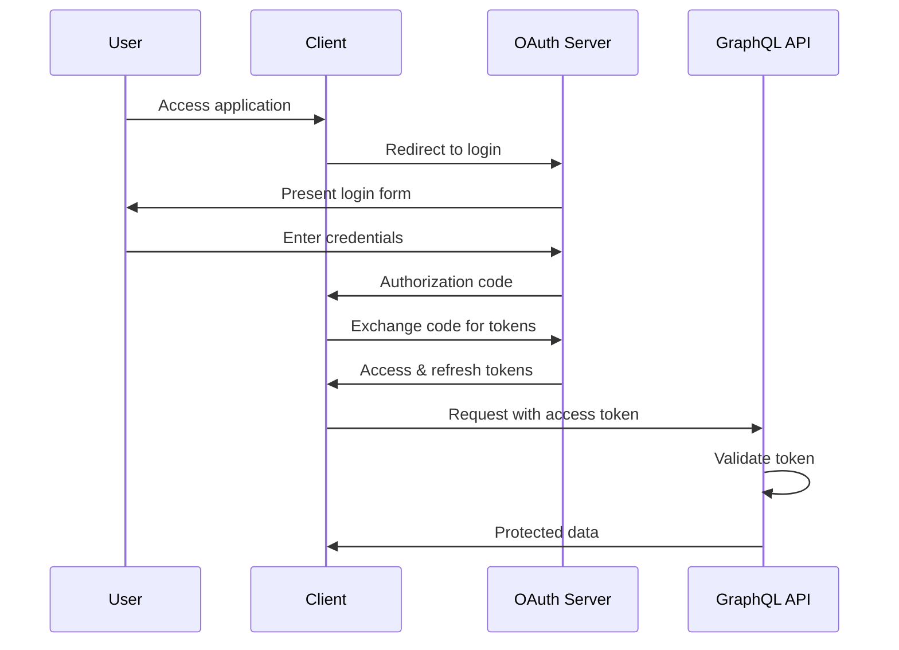

# API Authentication

## Introduction

Securing your Federated Graph API is essential for protecting sensitive healthcare data. This guide explains how to implement authentication and authorization for your GraphQL API, covering OAuth 2.0 authentication flows, JWT validation, Role-Based Access Control (RBAC), and field-level authorization. By implementing these security patterns, you can ensure that only authorized users can access the appropriate data.

### Quick Start

1. Set up an OAuth 2.0 provider (like Auth0, Okta, or Keycloak)
2. Configure your GraphQL gateway to validate JWTs
3. Implement a directive-based authorization system
4. Define roles and permissions for your API
5. Apply field-level security to protect sensitive data

### Related Components

- [Federated Graph API Overview](../01-getting-started/overview.md): Understand the overall architecture
- [Creating Subgraphs](creating-subgraphs.md): Learn how subgraphs work in a federated architecture
- [Legacy System Integration](legacy-integration.md): Secure access to legacy systems
- [Data Access Control](../04-data-management/access-control.md): Advanced access control patterns

## OAuth 2.0 Authentication Flows

OAuth 2.0 is the industry standard for API authentication. This section explains how to implement different OAuth flows for your GraphQL API.

### Authorization Code Flow

The Authorization Code flow is recommended for server-side applications and provides the highest security.



### Client Credentials Flow

The Client Credentials flow is used for service-to-service authentication when no user is involved.

```typescript
// Example: Client credentials flow implementation
async function getServiceToken() {
  const tokenEndpoint = 'https://auth.example.com/oauth/token';
  
  const params = new URLSearchParams();
  params.append('grant_type', 'client_credentials');
  params.append('client_id', process.env.CLIENT_ID);
  params.append('client_secret', process.env.CLIENT_SECRET);
  params.append('audience', process.env.API_AUDIENCE);
  
  try {
    const response = await fetch(tokenEndpoint, {
      method: 'POST',
      headers: {
        'Content-Type': 'application/x-www-form-urlencoded'
      },
      body: params
    });
    
    if (!response.ok) {
      throw new Error(`Failed to get token: ${response.statusText}`);
    }
    
    const data = await response.json();
    return data.access_token;
  } catch (error) {
    console.error('Error getting service token:', error);
    throw error;
  }
}
```

### SMART on FHIR Authentication

For healthcare applications, SMART on FHIR extends OAuth 2.0 with healthcare-specific scopes and contexts.

```typescript
// Example: SMART on FHIR authentication configuration
const smartAuthConfig = {
  // SMART on FHIR authorization server
  authorizationEndpoint: 'https://auth.example.com/authorize',
  tokenEndpoint: 'https://auth.example.com/token',
  // Required scopes for the application
  scope: 'launch patient/*.read openid profile',
  // Client registration details
  clientId: 'your-client-id',
  redirectUri: 'https://app.example.com/callback',
  // SMART launch context
  iss: 'https://ehr.example.com',
  launch: 'launch-token-from-ehr'
};

// Construct the authorization URL
function getSmartAuthUrl(state) {
  const params = new URLSearchParams({
    response_type: 'code',
    client_id: smartAuthConfig.clientId,
    redirect_uri: smartAuthConfig.redirectUri,
    scope: smartAuthConfig.scope,
    state: state,
    aud: smartAuthConfig.iss
  });
  
  if (smartAuthConfig.launch) {
    params.append('launch', smartAuthConfig.launch);
  }
  
  return `${smartAuthConfig.authorizationEndpoint}?${params.toString()}`;
}
```

## JWT Validation

JSON Web Tokens (JWTs) are commonly used for API authentication. This section explains how to validate JWTs in your GraphQL API.

### Token Structure

A JWT consists of three parts: header, payload, and signature.

```
Header: { "alg": "RS256", "typ": "JWT", "kid": "key-id" }
Payload: {
  "sub": "user-id",
  "iss": "https://auth.example.com/",
  "aud": "api-audience",
  "iat": 1619712000,
  "exp": 1619715600,
  "scope": "read:patients write:observations",
  "https://healthcare.example.com/roles": ["practitioner", "researcher"]
}
Signature: HMACSHA256(base64UrlEncode(header) + "." + base64UrlEncode(payload), secret)
```

### Implementing JWT Validation

```typescript
// Example: JWT validation middleware for Apollo Server
const { AuthenticationError } = require('apollo-server');
const jwt = require('jsonwebtoken');
const jwksClient = require('jwks-rsa');

// Initialize JWKS client to fetch public keys
const jwks = jwksClient({
  jwksUri: 'https://auth.example.com/.well-known/jwks.json',
  cache: true,
  rateLimit: true,
  jwksRequestsPerMinute: 5
});

// Get signing key for token verification
async function getSigningKey(kid) {
  return new Promise((resolve, reject) => {
    jwks.getSigningKey(kid, (err, key) => {
      if (err) return reject(err);
      const signingKey = key.publicKey || key.rsaPublicKey;
      resolve(signingKey);
    });
  });
}

// Verify JWT token
async function verifyToken(token) {
  try {
    // Decode the token header to get the key ID (kid)
    const decoded = jwt.decode(token, { complete: true });
    if (!decoded || !decoded.header || !decoded.header.kid) {
      throw new Error('Invalid token');
    }
    
    // Get the signing key
    const signingKey = await getSigningKey(decoded.header.kid);
    
    // Verify the token
    const verified = jwt.verify(token, signingKey, {
      audience: process.env.AUTH_AUDIENCE,
      issuer: process.env.AUTH_ISSUER
    });
    
    return verified;
  } catch (error) {
    console.error('Token verification failed:', error);
    throw new AuthenticationError('Invalid token');
  }
}

// Apollo Server context function
function createContext({ req }) {
  // Extract the token from the Authorization header
  const authHeader = req.headers.authorization || '';
  if (!authHeader.startsWith('Bearer ')) {
    return { user: null };
  }
  
  const token = authHeader.split(' ')[1];
  
  // For WebSocket connections, handle token differently
  if (req.connectionParams && req.connectionParams.authToken) {
    token = req.connectionParams.authToken;
  }
  
  // Return a function that verifies the token when needed
  return {
    getUser: async () => {
      if (!token) return null;
      const payload = await verifyToken(token);
      return payload;
    }
  };
}

module.exports = { createContext };
```

### Handling Token Errors

Implement proper error handling for token validation failures.

```typescript
// Example: Error handling for token validation
const formatError = (error) => {
  console.error('GraphQL Error:', error);
  
  // Handle authentication errors
  if (error.originalError instanceof AuthenticationError) {
    return {
      message: error.message,
      extensions: {
        code: 'UNAUTHENTICATED',
        http: { status: 401 }
      }
    };
  }
  
  // Handle authorization errors
  if (error.originalError instanceof ForbiddenError) {
    return {
      message: 'You do not have permission to perform this action',
      extensions: {
        code: 'FORBIDDEN',
        http: { status: 403 }
      }
    };
  }
  
  // Handle other errors
  return {
    message: error.message,
    extensions: {
      code: error.extensions?.code || 'INTERNAL_SERVER_ERROR',
      http: { status: 500 }
    }
  };
};
```

## Role-Based Access Control (RBAC)

Role-Based Access Control allows you to define permissions based on user roles. This section explains how to implement RBAC in your GraphQL API.

### Defining Roles and Permissions

Create a clear mapping between roles and permissions.

```typescript
// Example: Role-based permissions configuration
const permissions = {
  // Define roles and their permissions
  roles: {
    admin: {
      description: 'Administrator with full access',
      permissions: ['*'] // Wildcard for all permissions
    },
    practitioner: {
      description: 'Healthcare provider',
      permissions: [
        'read:patients',
        'write:patients',
        'read:observations',
        'write:observations',
        'read:medications',
        'write:medications',
        'read:conditions',
        'write:conditions'
      ]
    },
    nurse: {
      description: 'Nursing staff',
      permissions: [
        'read:patients',
        'read:observations',
        'write:observations',
        'read:medications',
        'read:conditions'
      ]
    },
    patient: {
      description: 'Patient accessing their own data',
      permissions: [
        'read:self'
      ]
    },
    researcher: {
      description: 'Clinical researcher',
      permissions: [
        'read:anonymized'
      ]
    }
  },
  
  // Check if a user has a specific permission
  hasPermission: (user, permission) => {
    if (!user || !user.roles) return false;
    
    // Get all permissions for the user's roles
    const userPermissions = user.roles.flatMap(role => {
      return permissions.roles[role]?.permissions || [];
    });
    
    // Check if the user has the specific permission or wildcard
    return userPermissions.includes('*') || userPermissions.includes(permission);
  }
};
```

### Implementing Role-Based Resolvers

Use resolver-level checks to enforce role-based permissions.

```typescript
// Example: Role-based resolver protection
const { ForbiddenError } = require('apollo-server');

// Higher-order function to protect resolvers
function requirePermission(permission, resolver) {
  return async (parent, args, context, info) => {
    // Get the authenticated user
    const user = await context.getUser();
    
    // Check if the user has the required permission
    if (!user || !permissions.hasPermission(user, permission)) {
      throw new ForbiddenError(`You need ${permission} permission for this operation`);
    }
    
    // If authorized, execute the resolver
    return resolver(parent, args, context, info);
  };
}

// Example usage in resolvers
const resolvers = {
  Query: {
    // Protect queries with required permissions
    patients: requirePermission('read:patients', async (_, args, { dataSources }) => {
      return dataSources.fhirAPI.searchPatients(args);
    }),
    
    patient: requirePermission('read:patients', async (_, { id }, { dataSources }) => {
      return dataSources.fhirAPI.getPatient(id);
    }),
    
    // Additional protected queries...
  },
  
  Mutation: {
    // Protect mutations with required permissions
    createPatient: requirePermission('write:patients', async (_, { input }, { dataSources }) => {
      return dataSources.fhirAPI.createPatient(input);
    }),
    
    updatePatient: requirePermission('write:patients', async (_, { id, input }, { dataSources }) => {
      return dataSources.fhirAPI.updatePatient(id, input);
    }),
    
    // Additional protected mutations...
  }
};
```

## Field-Level Authorization

Field-level authorization allows you to control access to specific fields based on user permissions. This section explains how to implement field-level security in your GraphQL API.

### Using GraphQL Directives for Authorization

Create custom directives to protect fields based on permissions.

```graphql
# Example: Authorization directives in schema
directive @requireAuth on FIELD_DEFINITION
directive @requirePermission(permission: String!) on FIELD_DEFINITION
directive @requireRole(role: String!) on FIELD_DEFINITION

type Patient @key(fields: "id") {
  id: ID!
  name: [HumanName!] @requireAuth
  birthDate: Date @requireAuth
  ssn: String @requirePermission(permission: "read:sensitive")
  address: [Address!] @requireAuth
  telecom: [ContactPoint!] @requireAuth
  generalPractitioner: [Reference!] @requireAuth
  managingOrganization: Reference @requireAuth
  medicalRecords: [DocumentReference!] @requirePermission(permission: "read:medical_records")
  insuranceDetails: [Coverage!] @requirePermission(permission: "read:insurance")
}

type Query {
  patients: [Patient!]! @requirePermission(permission: "read:patients")
  patient(id: ID!): Patient @requirePermission(permission: "read:patients")
  adminDashboard: AdminStats! @requireRole(role: "admin")
}
```

### Implementing Authorization Directives

```typescript
// Example: Implementing authorization directives
const { SchemaDirectiveVisitor, ForbiddenError, AuthenticationError } = require('apollo-server');
const { defaultFieldResolver } = require('graphql');

// Require authentication directive
class RequireAuthDirective extends SchemaDirectiveVisitor {
  visitFieldDefinition(field) {
    const { resolve = defaultFieldResolver } = field;
    
    field.resolve = async function(source, args, context, info) {
      // Get the authenticated user
      const user = await context.getUser();
      
      // Check if user is authenticated
      if (!user) {
        throw new AuthenticationError('You must be logged in to access this field');
      }
      
      // If authenticated, execute the resolver
      return resolve.call(this, source, args, context, info);
    };
  }
}

// Require specific permission directive
class RequirePermissionDirective extends SchemaDirectiveVisitor {
  visitFieldDefinition(field) {
    const { resolve = defaultFieldResolver } = field;
    const { permission } = this.args;
    
    field.resolve = async function(source, args, context, info) {
      // Get the authenticated user
      const user = await context.getUser();
      
      // Check if user is authenticated and has the required permission
      if (!user) {
        throw new AuthenticationError('You must be logged in to access this field');
      }
      
      if (!permissions.hasPermission(user, permission)) {
        throw new ForbiddenError(`You need ${permission} permission to access this field`);
      }
      
      // If authorized, execute the resolver
      return resolve.call(this, source, args, context, info);
    };
  }
}

// Require specific role directive
class RequireRoleDirective extends SchemaDirectiveVisitor {
  visitFieldDefinition(field) {
    const { resolve = defaultFieldResolver } = field;
    const { role } = this.args;
    
    field.resolve = async function(source, args, context, info) {
      // Get the authenticated user
      const user = await context.getUser();
      
      // Check if user is authenticated and has the required role
      if (!user) {
        throw new AuthenticationError('You must be logged in to access this field');
      }
      
      if (!user.roles || !user.roles.includes(role)) {
        throw new ForbiddenError(`You need the ${role} role to access this field`);
      }
      
      // If authorized, execute the resolver
      return resolve.call(this, source, args, context, info);
    };
  }
}

// Register the directives
const schemaDirectives = {
  requireAuth: RequireAuthDirective,
  requirePermission: RequirePermissionDirective,
  requireRole: RequireRoleDirective
};
```

### Patient-Specific Access Control

Implement special handling for patients accessing their own data.

```typescript
// Example: Patient-specific access control
function canAccessPatientData(user, patientId) {
  // Admins and practitioners can access any patient data
  if (user.roles.includes('admin') || user.roles.includes('practitioner')) {
    return true;
  }
  
  // Patients can only access their own data
  if (user.roles.includes('patient')) {
    return user.patientId === patientId;
  }
  
  // Default: no access
  return false;
}

// Example usage in resolver
const resolvers = {
  Query: {
    patient: async (_, { id }, context) => {
      const user = await context.getUser();
      
      if (!user) {
        throw new AuthenticationError('You must be logged in');
      }
      
      if (!canAccessPatientData(user, id)) {
        throw new ForbiddenError('You do not have permission to access this patient data');
      }
      
      return context.dataSources.fhirAPI.getPatient(id);
    }
  }
};
```

## Integrating with Apollo Gateway

When using a federated architecture, authentication and authorization need to be handled at both the gateway and subgraph levels.

### Gateway-Level Authentication

```typescript
// Example: Setting up authentication in Apollo Gateway
const { ApolloGateway } = require('@apollo/gateway');
const { ApolloServer } = require('apollo-server');
const { createContext } = require('./auth');

const gateway = new ApolloGateway({
  serviceList: [
    { name: 'patients', url: 'http://localhost:4001/graphql' },
    { name: 'clinical', url: 'http://localhost:4002/graphql' },
    { name: 'medications', url: 'http://localhost:4003/graphql' },
    // Additional subgraphs...
  ],
});

const server = new ApolloServer({
  gateway,
  subscriptions: false,
  context: createContext,
  formatError
});

server.listen().then(({ url }) => {
  console.log(`🚀 Gateway ready at ${url}`);
});
```

### Passing Authentication to Subgraphs

```typescript
// Example: Passing authentication to subgraphs
const { RemoteGraphQLDataSource } = require('@apollo/gateway');

class AuthenticatedDataSource extends RemoteGraphQLDataSource {
  willSendRequest({ request, context }) {
    // If user is authenticated, pass the token to the subgraph
    if (context.token) {
      request.http.headers.set('Authorization', `Bearer ${context.token}`);
    }
    
    // Pass user information to subgraphs if needed
    if (context.user) {
      request.http.headers.set('X-User-ID', context.user.sub);
      request.http.headers.set('X-User-Roles', context.user.roles.join(','));
    }
  }
}

const gateway = new ApolloGateway({
  serviceList: [...],
  buildService({ name, url }) {
    return new AuthenticatedDataSource({ url });
  }
});
```

## Conclusion

Implementing robust authentication and authorization is essential for securing your Federated Graph API. By using OAuth 2.0 for authentication, validating JWTs properly, implementing role-based access control, and applying field-level authorization, you can ensure that your healthcare data is accessible only to authorized users.

As you implement security for your GraphQL API, remember to:

1. Choose the appropriate OAuth 2.0 flow for your use case
2. Validate JWTs properly, including signature verification
3. Define clear roles and permissions for your API
4. Implement field-level authorization for fine-grained access control
5. Handle authentication and authorization errors gracefully

With these principles in mind, your Federated Graph API will provide secure access to healthcare data while protecting patient privacy.
