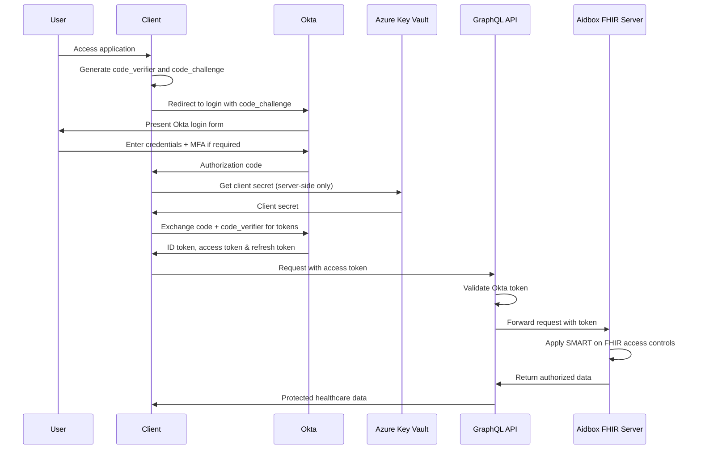

# API Authentication

## Introduction

Securing your Federated Graph API is essential for protecting sensitive healthcare data. This guide explains how to implement authentication and authorization for your GraphQL API, covering OAuth 2.0 authentication flows with Okta, JWT validation, Role-Based Access Control (RBAC), and field-level authorization. By implementing these security patterns, you can ensure that only authorized users can access the appropriate data.

For our implementation, we use Okta as the primary identity provider, with Azure Key Vault for secure storage of client secrets and credentials. This approach provides enterprise-grade security with features like conditional access policies, multi-factor authentication, and comprehensive audit logging.

### Quick Start

1. Set up Okta as your identity provider
   - Register your application in the Okta Developer Console
   - Configure groups and app roles for different user types (admin, practitioner, patient)
   - Set up API scopes and authorization servers
2. Store client secrets and credentials in Azure Key Vault
   - Use Managed Identities for secure access to Key Vault
3. Configure your GraphQL gateway to validate Okta JWTs
   - Use Okta JWT Verifier for Node.js for token validation
   - Implement proper JWKS endpoint caching
4. Implement a directive-based authorization system
   - Create directives for role and permission checks
   - Use Application Insights to track authorization decisions
5. Define roles and permissions aligned with Okta groups and claims
6. Integrate with Aidbox FHIR server for healthcare data access control
   - Map Okta identities to Aidbox users and roles
   - Implement SMART on FHIR scopes for fine-grained access control

### Related Components

- [Federated Graph API Overview](../01-getting-started/overview.md): Understand the overall architecture
- [Creating Subgraphs](creating-subgraphs.md): Learn how subgraphs work in a federated architecture
- [Legacy System Integration](legacy-integration.md): Secure access to legacy systems
- [Data Access Control](../04-data-management/access-control.md): Advanced access control patterns

## OAuth 2.0 Authentication with Okta

Okta implements the OAuth 2.0 and OpenID Connect standards, providing enterprise-grade identity management for your GraphQL API. This section explains how to implement different authentication flows using Okta and the Okta Auth JavaScript SDK.

### Authorization Code Flow with PKCE

The Authorization Code flow with PKCE (Proof Key for Code Exchange) is recommended for web applications and provides the highest security. Okta fully supports this flow for both single-page applications and server-side web apps.



#### Implementation with Okta SDK for Node.js

```typescript
import { OktaAuth } from '@okta/okta-auth-js';
import { DefaultAzureCredential } from '@azure/identity';
import { SecretClient } from '@azure/keyvault-secrets';
import * as express from 'express';
import * as crypto from 'crypto';
import * as appInsights from 'applicationinsights';

// Initialize Application Insights for monitoring
appInsights.setup(process.env.APPINSIGHTS_INSTRUMENTATIONKEY)
  .setAutoCollectExceptions(true)
  .start();

// Define interfaces for type safety
interface AuthConfig {
  clientId: string;
  clientSecret: string;
  issuer: string;
  redirectUri: string;
  scopes: string[];
}

// Define SMART on FHIR scopes for Aidbox integration
const SMART_SCOPES = {
  PATIENT_READ: 'patient/*.read',
  PATIENT_WRITE: 'patient/*.write',
  LAUNCH: 'launch',
  OPENID: 'openid',
  PROFILE: 'profile',
  OFFLINE_ACCESS: 'offline_access'
};

// Get client secret from Azure Key Vault using Managed Identity
async function getClientSecretFromKeyVault(): Promise<string> {
  try {
    const credential = new DefaultAzureCredential();
    const keyVaultUrl = process.env.KEY_VAULT_URL || '';
    const secretClient = new SecretClient(keyVaultUrl, credential);
    const secret = await secretClient.getSecret('okta-client-secret');
    return secret.value || '';
  } catch (error) {
    appInsights.defaultClient.trackException({exception: error});
    console.error('Error fetching client secret from Key Vault:', error);
    throw error;
  }
}

// Initialize Okta Auth client
async function initializeOktaAuth(): Promise<OktaAuth> {
  // Get client secret securely from Key Vault
  const clientSecret = await getClientSecretFromKeyVault();
  
  const config = {
    clientId: process.env.OKTA_CLIENT_ID || '',
    clientSecret,
    issuer: `https://${process.env.OKTA_DOMAIN}/oauth2/default`,
    redirectUri: process.env.REDIRECT_URI,
    scopes: ['openid', 'profile', 'email', SMART_SCOPES.PATIENT_READ],
    pkce: true
  };
  
  return new OktaAuth(config);
}

// Set up authentication routes
export function setupAuthRoutes(app: express.Application) {
  // Initialize Okta Auth
  let oktaAuth: OktaAuth;
  initializeOktaAuth().then(client => {
    oktaAuth = client;
  });
  
  // Login route
  app.get('/login', (req, res) => {
    // Generate PKCE code verifier and challenge
    const codeVerifier = crypto.randomBytes(32).toString('base64url');
    const codeChallenge = crypto.createHash('sha256')
      .update(codeVerifier).digest('base64url');
    
    // Save code verifier in session for later use
    req.session.codeVerifier = codeVerifier;
    
    // Determine required scopes based on user role/context
    const scopes = ['openid', 'profile', 'email'];
    
    // Add SMART on FHIR scopes for Aidbox integration if needed
    if (req.query.fhirAccess === 'true') {
      scopes.push(SMART_SCOPES.PATIENT_READ);
      if (req.query.writeAccess === 'true') {
        scopes.push(SMART_SCOPES.PATIENT_WRITE);
      }
    }
    
    // Create authorization URL with PKCE
    const authUrl = oktaAuth.getAuthorizationUrl({
      responseType: ['code'],
      state: crypto.randomBytes(16).toString('hex'),
      scopes,
      codeChallenge,
      codeChallengeMethod: 'S256'
    });
    
    // Track login attempt
    appInsights.defaultClient.trackEvent({
      name: 'LoginAttempt',
      properties: {
        scopes: scopes.join(' '),
        hasFhirAccess: scopes.includes(SMART_SCOPES.PATIENT_READ).toString()
      }
    });
    
    res.redirect(authUrl);
  });
  
  // Handle redirect with auth code
  app.get('/callback', async (req, res) => {
    try {
      // Exchange auth code for tokens using the code verifier
      const tokenResponse = await oktaAuth.token.getWithRedirect({
        code: req.query.code as string,
        codeVerifier: req.session.codeVerifier
      });
      
      // Save tokens in session or secure cookie
      req.session.accessToken = tokenResponse.tokens.accessToken?.accessToken;
      req.session.idToken = tokenResponse.tokens.idToken?.idToken;
      req.session.refreshToken = tokenResponse.tokens.refreshToken?.refreshToken;
      
      // Extract user info from ID token
      const userInfo = await oktaAuth.token.getUserInfo(tokenResponse.tokens.accessToken?.accessToken);
      req.session.user = userInfo;
      
      // Track successful authentication
      appInsights.defaultClient.trackEvent({
        name: 'LoginSuccess',
        properties: {
          userId: userInfo.sub,
          hasFhirAccess: tokenResponse.tokens.accessToken?.claims.scp?.includes(SMART_SCOPES.PATIENT_READ).toString() || 'false'
        }
      });
      
      // If FHIR scopes were requested, set up Aidbox session
      if (tokenResponse.tokens.accessToken?.claims.scp?.includes(SMART_SCOPES.PATIENT_READ)) {
        await setupAidboxSession(req.session.accessToken, userInfo);
      }
      
      // Redirect to application
      res.redirect('/app');
    } catch (error) {
      appInsights.defaultClient.trackException({exception: error});
      console.error('Error acquiring token:', error);
      res.status(500).send('Error completing authentication');
    }
  });
}

// Set up Aidbox session with Okta token
async function setupAidboxSession(accessToken: string, userInfo: any): Promise<void> {
  try {
    // Create or update Aidbox user based on Okta identity
    const aidboxUser = {
      resourceType: 'User',
      id: `okta-${userInfo.sub}`,
      name: {
        given: [userInfo.given_name],
        family: userInfo.family_name
      },
      telecom: [{
        system: 'email',
        value: userInfo.email
      }],
      // Map Okta groups to Aidbox roles
      extension: [{
        url: 'http://example.org/fhir/StructureDefinition/okta-groups',
        valueString: JSON.stringify(userInfo.groups || [])
      }]
    };
    
    // Call Aidbox API to create/update user
    const response = await fetch(`${process.env.AIDBOX_URL}/User/${aidboxUser.id}`, {
      method: 'PUT',
      headers: {
        'Content-Type': 'application/json',
        'Authorization': `Bearer ${accessToken}`
      },
      body: JSON.stringify(aidboxUser)
    });
    
    if (!response.ok) {
      throw new Error(`Failed to set up Aidbox session: ${response.statusText}`);
    }
    
    // Track successful Aidbox integration
    appInsights.defaultClient.trackEvent({
      name: 'AidboxSessionCreated',
      properties: {
        userId: userInfo.sub,
        aidboxUserId: aidboxUser.id
      }
    });
  } catch (error) {
    appInsights.defaultClient.trackException({exception: error});
    console.error('Error setting up Aidbox session:', error);
    throw error;
  }
}
```

### Client Credentials Flow

The Client Credentials flow is used for service-to-service authentication when no user is involved. This is commonly used for background services, APIs, and daemon applications that need to access resources without user interaction.

#### Okta Implementation for Service-to-Service Authentication

```typescript
import { OktaClient } from '@okta/okta-sdk-nodejs';
import { DefaultAzureCredential } from '@azure/identity';
import { SecretClient } from '@azure/keyvault-secrets';
import * as appInsights from 'applicationinsights';

// Initialize Application Insights for monitoring
appInsights.setup(process.env.APPINSIGHTS_INSTRUMENTATIONKEY)
  .setAutoCollectExceptions(true)
  .start();

// Get client credentials from Azure Key Vault using Managed Identity
async function getClientCredentialsFromKeyVault(): Promise<{clientId: string, clientSecret: string}> {
  try {
    const credential = new DefaultAzureCredential();
    const keyVaultUrl = process.env.KEY_VAULT_URL || '';
    const secretClient = new SecretClient(keyVaultUrl, credential);
    
    // Get client ID and secret in parallel
    const [clientIdSecret, clientSecretSecret] = await Promise.all([
      secretClient.getSecret('okta-service-client-id'),
      secretClient.getSecret('okta-service-client-secret')
    ]);
    
    return {
      clientId: clientIdSecret.value || '',
      clientSecret: clientSecretSecret.value || ''
    };
  } catch (error) {
    appInsights.defaultClient.trackException({exception: error});
    console.error('Error fetching credentials from Key Vault:', error);
    throw error;
  }
}

// Get service-to-service access token from Okta
async function getServiceToken(): Promise<string> {
  try {
    // Get credentials securely from Key Vault
    const { clientId, clientSecret } = await getClientCredentialsFromKeyVault();
    
    // Prepare token request parameters
    const params = new URLSearchParams();
    params.append('grant_type', 'client_credentials');
    params.append('client_id', clientId);
    params.append('client_secret', clientSecret);
    params.append('scope', 'fhir.read fhir.write');
    
    // Request token from Okta token endpoint
    const response = await fetch(`https://${process.env.OKTA_DOMAIN}/oauth2/default/v1/token`, {
      method: 'POST',
      headers: {
        'Content-Type': 'application/x-www-form-urlencoded',
        'Accept': 'application/json'
      },
      body: params
    });
    
    if (!response.ok) {
      throw new Error(`Failed to get token: ${response.statusText}`);
    }
    
    const data = await response.json();
    
    // Track successful token acquisition
    appInsights.defaultClient.trackEvent({
      name: 'ServiceTokenAcquired',
      properties: {
        clientId,
        tokenType: 'client_credentials',
        scopes: 'fhir.read fhir.write'
      }
    });
    
    return data.access_token;
  } catch (error) {
    appInsights.defaultClient.trackException({exception: error});
    console.error('Error getting service token:', error);
    throw error;
  }
}

// Example: Integrating with Aidbox FHIR server using service token
async function syncDataWithAidbox() {
  try {
    // Get service token from Okta
    const token = await getServiceToken();
    
    // Use token to access Aidbox FHIR API
    const response = await fetch(`${process.env.AIDBOX_URL}/Patient?_count=100`, {
      method: 'GET',
      headers: {
        'Accept': 'application/fhir+json',
        'Authorization': `Bearer ${token}`
      }
    });
    
    if (!response.ok) {
      throw new Error(`Aidbox API error: ${response.statusText}`);
    }
    
    const patients = await response.json();
    
    // Process patient data
    console.log(`Retrieved ${patients.entry?.length || 0} patients from Aidbox`);
    
    // Track successful Aidbox integration
    appInsights.defaultClient.trackEvent({
      name: 'AidboxDataSync',
      properties: {
        patientCount: (patients.entry?.length || 0).toString(),
        syncType: 'background'
      }
    });
    
    return patients;
  } catch (error) {
    appInsights.defaultClient.trackException({exception: error});
    console.error('Error syncing data with Aidbox:', error);
    throw error;
  }
}

// Example: Using service token with GraphQL API
async function queryGraphQLAPI() {
  try {
    const token = await getServiceToken();
    
    const response = await fetch(`${process.env.GRAPHQL_API_URL}`, {
      method: 'POST',
      headers: {
        'Content-Type': 'application/json',
        'Authorization': `Bearer ${token}`
      },
      body: JSON.stringify({
        query: `
          query GetPatientSummary {
            patients(first: 10) {
              edges {
                node {
                  id
                  name {
                    given
                    family
                  }
                  birthDate
                }
              }
            }
          }
        `
      })
    });
    
    return await response.json();
  } catch (error) {
    appInsights.defaultClient.trackException({exception: error});
    console.error('Error querying GraphQL API:', error);
    throw error;
  }
}
```

#### Containerized Deployment with Aidbox Integration

When deploying services that use client credentials flow in AKS with Aidbox FHIR server integration:

```yaml
# kubernetes-deployment.yaml
apiVersion: apps/v1
kind: Deployment
metadata:
  name: data-sync-service
spec:
  replicas: 2
  selector:
    matchLabels:
      app: data-sync-service
  template:
    metadata:
      labels:
        app: data-sync-service
    spec:
      containers:
      - name: data-sync-service
        image: acr.azurecr.io/data-sync-service:v1.0.0
        env:
        - name: NODE_ENV
          value: "production"
        - name: OKTA_DOMAIN
          valueFrom:
            secretKeyRef:
              name: okta-credentials
              key: domain
        - name: AIDBOX_URL
          valueFrom:
            configMapRef:
              name: service-endpoints
              key: aidbox-url
        - name: GRAPHQL_API_URL
          valueFrom:
            configMapRef:
              name: service-endpoints
              key: graphql-api-url
        - name: KEY_VAULT_URL
          valueFrom:
            secretKeyRef:
              name: azure-credentials
              key: key-vault-url
        - name: APPINSIGHTS_INSTRUMENTATIONKEY
          valueFrom:
            secretKeyRef:
              name: azure-credentials
              key: appinsights-key
        resources:
          requests:
            cpu: "250m"
            memory: "256Mi"
          limits:
            cpu: "500m"
            memory: "512Mi"
        livenessProbe:
          httpGet:
            path: /health
            port: 8080
          initialDelaySeconds: 30
          periodSeconds: 60
      # Use Azure Workload Identity for secure Key Vault access
      serviceAccountName: data-sync-service-sa
```
```

### SMART on FHIR Authentication with Aidbox

For healthcare applications, SMART on FHIR extends OAuth 2.0 with healthcare-specific scopes and contexts. Our implementation uses Okta as the identity provider and Aidbox as the FHIR server, providing a robust, standards-compliant solution for healthcare data access.

#### Aidbox FHIR Server Integration with Okta

```typescript
import { OktaAuth } from '@okta/okta-auth-js';
import * as appInsights from 'applicationinsights';
import * as crypto from 'crypto';

// Initialize Application Insights for monitoring
appInsights.setup(process.env.APPINSIGHTS_INSTRUMENTATIONKEY)
  .setAutoCollectExceptions(true)
  .start();

// Define SMART on FHIR scopes for Aidbox integration
const SMART_SCOPES = {
  PATIENT_READ: 'patient/*.read',
  PATIENT_WRITE: 'patient/*.write',
  LAUNCH: 'launch',
  OPENID: 'openid',
  PROFILE: 'profile',
  OFFLINE_ACCESS: 'offline_access'
};

// SMART on FHIR configuration for Aidbox integration
interface SmartOnFhirConfig {
  clientId: string;
  redirectUri: string;
  oktaDomain: string;
  aidboxUrl: string;
  scopes: string[];
  launchContext?: {
    patient?: string;
    encounter?: string;
    practitioner?: string;
  };
}

// Get SMART on FHIR configuration
async function getSmartOnFhirConfig(): Promise<SmartOnFhirConfig> {
  // In a real application, you might load this from configuration or environment variables
  return {
    clientId: process.env.OKTA_CLIENT_ID || '',
    redirectUri: process.env.REDIRECT_URI || '',
    oktaDomain: process.env.OKTA_DOMAIN || '',
    aidboxUrl: process.env.AIDBOX_URL || '',
    scopes: [
      SMART_SCOPES.OPENID,
      SMART_SCOPES.PROFILE,
      SMART_SCOPES.PATIENT_READ,
      SMART_SCOPES.LAUNCH
    ]
  };
}

// Initialize Okta Auth with SMART on FHIR scopes
async function initializeOktaAuthForSmart(): Promise<OktaAuth> {
  const config = await getSmartOnFhirConfig();
  
  return new OktaAuth({
    clientId: config.clientId,
    issuer: `https://${config.oktaDomain}/oauth2/default`,
    redirectUri: config.redirectUri,
    scopes: config.scopes,
    pkce: true
  });
}

// Get SMART on FHIR authorization URL with launch context
async function getSmartAuthUrl(launchContext?: any): Promise<string> {
  const config = await getSmartOnFhirConfig();
  const oktaAuth = await initializeOktaAuthForSmart();
  
  // Generate PKCE code verifier and challenge
  const codeVerifier = crypto.randomBytes(32).toString('base64url');
  const codeChallenge = crypto.createHash('sha256')
    .update(codeVerifier).digest('base64url');
  
  // Store code verifier for later use (in session or other secure storage)
  // This is just an example - in a real app, you'd store this securely
  global.codeVerifier = codeVerifier;
  
  // Create authorization parameters
  const authParams = {
    responseType: ['code'],
    state: crypto.randomBytes(16).toString('hex'),
    scopes: config.scopes,
    codeChallenge,
    codeChallengeMethod: 'S256'
  };
  
  // Add launch context if provided
  if (launchContext) {
    if (launchContext.patient) {
      authParams.state += `;patient=${launchContext.patient}`;
    }
    if (launchContext.encounter) {
      authParams.state += `;encounter=${launchContext.encounter}`;
    }
  }
  
  // Track SMART auth attempt
  appInsights.defaultClient.trackEvent({
    name: 'SmartAuthAttempt',
    properties: {
      scopes: config.scopes.join(' '),
      hasLaunchContext: !!launchContext
    }
  });
  
  return oktaAuth.getAuthorizationUrl(authParams);
}

// Process SMART on FHIR callback and set up Aidbox session
async function handleSmartCallback(code: string, state: string): Promise<any> {
  try {
    const oktaAuth = await initializeOktaAuthForSmart();
    const config = await getSmartOnFhirConfig();
    
    // Exchange code for tokens
    const tokenResponse = await oktaAuth.token.getWithoutRedirect({
      code,
      codeVerifier: global.codeVerifier // Retrieve from secure storage
    });
    
    // Extract launch context from state if present
    const launchContext: any = {};
    if (state.includes(';')) {
      const stateParts = state.split(';');
      stateParts.slice(1).forEach(part => {
        const [key, value] = part.split('=');
        if (key && value) {
          launchContext[key] = value;
        }
      });
    }
    
    // Get user info from ID token
    const userInfo = await oktaAuth.token.getUserInfo(tokenResponse.tokens.accessToken?.accessToken);
    
    // Set up Aidbox session with SMART context
    await setupAidboxSmartSession(
      tokenResponse.tokens.accessToken?.accessToken || '',
      userInfo,
      launchContext
    );
    
    // Track successful SMART authentication
    appInsights.defaultClient.trackEvent({
      name: 'SmartAuthSuccess',
      properties: {
        userId: userInfo.sub,
        hasPatientContext: !!launchContext.patient,
        scopes: tokenResponse.tokens.accessToken?.claims.scp?.join(' ') || ''
      }
    });
    
    return {
      tokens: tokenResponse.tokens,
      userInfo,
      launchContext
    };
  } catch (error) {
    appInsights.defaultClient.trackException({exception: error});
    console.error('Error handling SMART callback:', error);
    throw error;
  }
}

// Set up Aidbox session with SMART context
async function setupAidboxSmartSession(accessToken: string, userInfo: any, launchContext: any): Promise<void> {
  try {
    const config = await getSmartOnFhirConfig();
    
    // Create SMART session in Aidbox
    const smartSession = {
      resourceType: 'SmartSession',
      id: `okta-${userInfo.sub}`,
      user: {
        resourceType: 'User',
        id: `okta-${userInfo.sub}`,
        name: {
          given: [userInfo.given_name],
          family: userInfo.family_name
        }
      },
      context: {
        patient: launchContext.patient,
        encounter: launchContext.encounter,
        practitioner: userInfo.groups?.includes('practitioners') ? `okta-${userInfo.sub}` : undefined
      },
      scopes: userInfo.scp || []
    };
    
    // Call Aidbox API to create/update SMART session
    const response = await fetch(`${config.aidboxUrl}/SmartSession/${smartSession.id}`, {
      method: 'PUT',
      headers: {
        'Content-Type': 'application/json',
        'Authorization': `Bearer ${accessToken}`
      },
      body: JSON.stringify(smartSession)
    });
    
    if (!response.ok) {
      throw new Error(`Failed to set up Aidbox SMART session: ${response.statusText}`);
    }
    
    // Track successful Aidbox SMART session setup
    appInsights.defaultClient.trackEvent({
      name: 'AidboxSmartSessionCreated',
      properties: {
        userId: userInfo.sub,
        patientContext: launchContext.patient || 'none'
      }
    });
  } catch (error) {
    appInsights.defaultClient.trackException({exception: error});
    console.error('Error setting up Aidbox SMART session:', error);
    throw error;
  }
}
```

## JWT Validation

JSON Web Tokens (JWTs) are commonly used for API authentication. This section explains how to validate JWTs in your GraphQL API.

### Token Structure

A JWT consists of three parts: header, payload, and signature.

```
Header: { "alg": "RS256", "typ": "JWT", "kid": "key-id" }
Payload: {
  "sub": "user-id",
  "iss": "https://auth.example.com/",
  "aud": "api-audience",
  "iat": 1619712000,
  "exp": 1619715600,
  "scope": "read:patients write:observations",
  "https://healthcare.example.com/roles": ["practitioner", "researcher"]
}
Signature: HMACSHA256(base64UrlEncode(header) + "." + base64UrlEncode(payload), secret)
```

### Implementing JWT Validation

```typescript
// Example: JWT validation middleware for Apollo Server
const { AuthenticationError } = require('apollo-server');
const jwt = require('jsonwebtoken');
const jwksClient = require('jwks-rsa');

// Initialize JWKS client to fetch public keys
const jwks = jwksClient({
  jwksUri: 'https://auth.example.com/.well-known/jwks.json',
  cache: true,
  rateLimit: true,
  jwksRequestsPerMinute: 5
});

// Get signing key for token verification
async function getSigningKey(kid) {
  return new Promise((resolve, reject) => {
    jwks.getSigningKey(kid, (err, key) => {
      if (err) return reject(err);
      const signingKey = key.publicKey || key.rsaPublicKey;
      resolve(signingKey);
    });
  });
}

// Verify JWT token
async function verifyToken(token) {
  try {
    // Decode the token header to get the key ID (kid)
    const decoded = jwt.decode(token, { complete: true });
    if (!decoded || !decoded.header || !decoded.header.kid) {
      throw new Error('Invalid token');
    }
    
    // Get the signing key
    const signingKey = await getSigningKey(decoded.header.kid);
    
    // Verify the token
    const verified = jwt.verify(token, signingKey, {
      audience: process.env.AUTH_AUDIENCE,
      issuer: process.env.AUTH_ISSUER
    });
    
    return verified;
  } catch (error) {
    console.error('Token verification failed:', error);
    throw new AuthenticationError('Invalid token');
  }
}

// Apollo Server context function
function createContext({ req }) {
  // Extract the token from the Authorization header
  const authHeader = req.headers.authorization || '';
  if (!authHeader.startsWith('Bearer ')) {
    return { user: null };
  }
  
  const token = authHeader.split(' ')[1];
  
  // For WebSocket connections, handle token differently
  if (req.connectionParams && req.connectionParams.authToken) {
    token = req.connectionParams.authToken;
  }
  
  // Return a function that verifies the token when needed
  return {
    getUser: async () => {
      if (!token) return null;
      const payload = await verifyToken(token);
      return payload;
    }
  };
}

module.exports = { createContext };
```

### Handling Token Errors

Implement proper error handling for token validation failures.

```typescript
// Example: Error handling for token validation
const formatError = (error) => {
  console.error('GraphQL Error:', error);
  
  // Handle authentication errors
  if (error.originalError instanceof AuthenticationError) {
    return {
      message: error.message,
      extensions: {
        code: 'UNAUTHENTICATED',
        http: { status: 401 }
      }
    };
  }
  
  // Handle authorization errors
  if (error.originalError instanceof ForbiddenError) {
    return {
      message: 'You do not have permission to perform this action',
      extensions: {
        code: 'FORBIDDEN',
        http: { status: 403 }
      }
    };
  }
  
  // Handle other errors
  return {
    message: error.message,
    extensions: {
      code: error.extensions?.code || 'INTERNAL_SERVER_ERROR',
      http: { status: 500 }
    }
  };
};
```

## Role-Based Access Control (RBAC)

Role-Based Access Control allows you to define permissions based on user roles. This section explains how to implement RBAC in your GraphQL API.

### Defining Roles and Permissions

Create a clear mapping between roles and permissions.

```typescript
// Example: Role-based permissions configuration
const permissions = {
  // Define roles and their permissions
  roles: {
    admin: {
      description: 'Administrator with full access',
      permissions: ['*'] // Wildcard for all permissions
    },
    practitioner: {
      description: 'Healthcare provider',
      permissions: [
        'read:patients',
        'write:patients',
        'read:observations',
        'write:observations',
        'read:medications',
        'write:medications',
        'read:conditions',
        'write:conditions'
      ]
    },
    nurse: {
      description: 'Nursing staff',
      permissions: [
        'read:patients',
        'read:observations',
        'write:observations',
        'read:medications',
        'read:conditions'
      ]
    },
    patient: {
      description: 'Patient accessing their own data',
      permissions: [
        'read:self'
      ]
    },
    researcher: {
      description: 'Clinical researcher',
      permissions: [
        'read:anonymized'
      ]
    }
  },
  
  // Check if a user has a specific permission
  hasPermission: (user, permission) => {
    if (!user || !user.roles) return false;
    
    // Get all permissions for the user's roles
    const userPermissions = user.roles.flatMap(role => {
      return permissions.roles[role]?.permissions || [];
    });
    
    // Check if the user has the specific permission or wildcard
    return userPermissions.includes('*') || userPermissions.includes(permission);
  }
};
```

### Implementing Role-Based Resolvers

Use resolver-level checks to enforce role-based permissions.

```typescript
// Example: Role-based resolver protection
const { ForbiddenError } = require('apollo-server');

// Higher-order function to protect resolvers
function requirePermission(permission, resolver) {
  return async (parent, args, context, info) => {
    // Get the authenticated user
    const user = await context.getUser();
    
    // Check if the user has the required permission
    if (!user || !permissions.hasPermission(user, permission)) {
      throw new ForbiddenError(`You need ${permission} permission for this operation`);
    }
    
    // If authorized, execute the resolver
    return resolver(parent, args, context, info);
  };
}

// Example usage in resolvers
const resolvers = {
  Query: {
    // Protect queries with required permissions
    patients: requirePermission('read:patients', async (_, args, { dataSources }) => {
      return dataSources.fhirAPI.searchPatients(args);
    }),
    
    patient: requirePermission('read:patients', async (_, { id }, { dataSources }) => {
      return dataSources.fhirAPI.getPatient(id);
    }),
    
    // Additional protected queries...
  },
  
  Mutation: {
    // Protect mutations with required permissions
    createPatient: requirePermission('write:patients', async (_, { input }, { dataSources }) => {
      return dataSources.fhirAPI.createPatient(input);
    }),
    
    updatePatient: requirePermission('write:patients', async (_, { id, input }, { dataSources }) => {
      return dataSources.fhirAPI.updatePatient(id, input);
    }),
    
    // Additional protected mutations...
  }
};
```

## Field-Level Authorization

Field-level authorization allows you to control access to specific fields based on user permissions. This section explains how to implement field-level security in your GraphQL API.

### Using GraphQL Directives for Authorization

Create custom directives to protect fields based on permissions.

```graphql
# Example: Authorization directives in schema
directive @requireAuth on FIELD_DEFINITION
directive @requirePermission(permission: String!) on FIELD_DEFINITION
directive @requireRole(role: String!) on FIELD_DEFINITION

type Patient @key(fields: "id") {
  id: ID!
  name: [HumanName!] @requireAuth
  birthDate: Date @requireAuth
  ssn: String @requirePermission(permission: "read:sensitive")
  address: [Address!] @requireAuth
  telecom: [ContactPoint!] @requireAuth
  generalPractitioner: [Reference!] @requireAuth
  managingOrganization: Reference @requireAuth
  medicalRecords: [DocumentReference!] @requirePermission(permission: "read:medical_records")
  insuranceDetails: [Coverage!] @requirePermission(permission: "read:insurance")
}

type Query {
  patients: [Patient!]! @requirePermission(permission: "read:patients")
  patient(id: ID!): Patient @requirePermission(permission: "read:patients")
  adminDashboard: AdminStats! @requireRole(role: "admin")
}
```

### Implementing Authorization Directives

```typescript
// Example: Implementing authorization directives
const { SchemaDirectiveVisitor, ForbiddenError, AuthenticationError } = require('apollo-server');
const { defaultFieldResolver } = require('graphql');

// Require authentication directive
class RequireAuthDirective extends SchemaDirectiveVisitor {
  visitFieldDefinition(field) {
    const { resolve = defaultFieldResolver } = field;
    
    field.resolve = async function(source, args, context, info) {
      // Get the authenticated user
      const user = await context.getUser();
      
      // Check if user is authenticated
      if (!user) {
        throw new AuthenticationError('You must be logged in to access this field');
      }
      
      // If authenticated, execute the resolver
      return resolve.call(this, source, args, context, info);
    };
  }
}

// Require specific permission directive
class RequirePermissionDirective extends SchemaDirectiveVisitor {
  visitFieldDefinition(field) {
    const { resolve = defaultFieldResolver } = field;
    const { permission } = this.args;
    
    field.resolve = async function(source, args, context, info) {
      // Get the authenticated user
      const user = await context.getUser();
      
      // Check if user is authenticated and has the required permission
      if (!user) {
        throw new AuthenticationError('You must be logged in to access this field');
      }
      
      if (!permissions.hasPermission(user, permission)) {
        throw new ForbiddenError(`You need ${permission} permission to access this field`);
      }
      
      // If authorized, execute the resolver
      return resolve.call(this, source, args, context, info);
    };
  }
}

// Require specific role directive
class RequireRoleDirective extends SchemaDirectiveVisitor {
  visitFieldDefinition(field) {
    const { resolve = defaultFieldResolver } = field;
    const { role } = this.args;
    
    field.resolve = async function(source, args, context, info) {
      // Get the authenticated user
      const user = await context.getUser();
      
      // Check if user is authenticated and has the required role
      if (!user) {
        throw new AuthenticationError('You must be logged in to access this field');
      }
      
      if (!user.roles || !user.roles.includes(role)) {
        throw new ForbiddenError(`You need the ${role} role to access this field`);
      }
      
      // If authorized, execute the resolver
      return resolve.call(this, source, args, context, info);
    };
  }
}

// Register the directives
const schemaDirectives = {
  requireAuth: RequireAuthDirective,
  requirePermission: RequirePermissionDirective,
  requireRole: RequireRoleDirective
};
```

### Patient-Specific Access Control

Implement special handling for patients accessing their own data.

```typescript
// Example: Patient-specific access control
function canAccessPatientData(user, patientId) {
  // Admins and practitioners can access any patient data
  if (user.roles.includes('admin') || user.roles.includes('practitioner')) {
    return true;
  }
  
  // Patients can only access their own data
  if (user.roles.includes('patient')) {
    return user.patientId === patientId;
  }
  
  // Default: no access
  return false;
}

// Example usage in resolver
const resolvers = {
  Query: {
    patient: async (_, { id }, context) => {
      const user = await context.getUser();
      
      if (!user) {
        throw new AuthenticationError('You must be logged in');
      }
      
      if (!canAccessPatientData(user, id)) {
        throw new ForbiddenError('You do not have permission to access this patient data');
      }
      
      return context.dataSources.fhirAPI.getPatient(id);
    }
  }
};
```

## Integrating with Apollo Gateway

When using a federated architecture, authentication and authorization need to be handled at both the gateway and subgraph levels.

### Gateway-Level Authentication

```typescript
// Example: Setting up authentication in Apollo Gateway
const { ApolloGateway } = require('@apollo/gateway');
const { ApolloServer } = require('apollo-server');
const { createContext } = require('./auth');

const gateway = new ApolloGateway({
  serviceList: [
    { name: 'patients', url: 'http://localhost:4001/graphql' },
    { name: 'clinical', url: 'http://localhost:4002/graphql' },
    { name: 'medications', url: 'http://localhost:4003/graphql' },
    // Additional subgraphs...
  ],
});

const server = new ApolloServer({
  gateway,
  subscriptions: false,
  context: createContext,
  formatError
});

server.listen().then(({ url }) => {
  console.log(`🚀 Gateway ready at ${url}`);
});
```

### Passing Authentication to Subgraphs

```typescript
// Example: Passing authentication to subgraphs
const { RemoteGraphQLDataSource } = require('@apollo/gateway');

class AuthenticatedDataSource extends RemoteGraphQLDataSource {
  willSendRequest({ request, context }) {
    // If user is authenticated, pass the token to the subgraph
    if (context.token) {
      request.http.headers.set('Authorization', `Bearer ${context.token}`);
    }
    
    // Pass user information to subgraphs if needed
    if (context.user) {
      request.http.headers.set('X-User-ID', context.user.sub);
      request.http.headers.set('X-User-Roles', context.user.roles.join(','));
    }
  }
}

const gateway = new ApolloGateway({
  serviceList: [...],
  buildService({ name, url }) {
    return new AuthenticatedDataSource({ url });
  }
});
```

## Conclusion

Implementing robust authentication and authorization is essential for securing your Federated Graph API. By using OAuth 2.0 for authentication, validating JWTs properly, implementing role-based access control, and applying field-level authorization, you can ensure that your healthcare data is accessible only to authorized users.

As you implement security for your GraphQL API, remember to:

1. Choose the appropriate OAuth 2.0 flow for your use case
2. Validate JWTs properly, including signature verification
3. Define clear roles and permissions for your API
4. Implement field-level authorization for fine-grained access control
5. Handle authentication and authorization errors gracefully

With these principles in mind, your Federated Graph API will provide secure access to healthcare data while protecting patient privacy.
