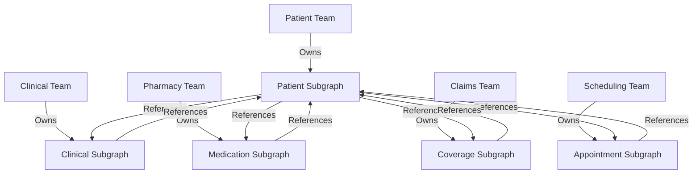

# Creating Subgraphs

## Introduction

Subgraphs are the building blocks of a federated GraphQL architecture, representing domain-specific portions of your overall graph. This guide explains how to design and implement effective subgraphs, covering architecture principles, schema design best practices, entity references, and type extensions. Understanding these concepts is essential for creating a well-structured federated graph that can scale with your organization.

### Quick Start

1. Define the domain boundaries for your subgraph
2. Create a new Apollo Server instance for your subgraph
3. Define your GraphQL schema with proper entity references
4. Implement resolvers for your schema types
5. Register your subgraph with the Apollo Gateway

### Related Components

- [Federated Graph API Overview](../01-getting-started/overview.md): Understand the overall architecture
- [Legacy System Integration](legacy-integration.md): Learn how to integrate legacy systems into your graph
- [Schema Federation Patterns](../03-advanced-patterns/schema-federation.md): Advanced federation techniques
- [Schema Governance](../04-data-management/schema-governance.md): Managing schema evolution

## Subgraph Architecture Principles

Effective subgraph design follows key architectural principles that ensure maintainability, performance, and scalability.

### Domain-Driven Boundaries

Subgraphs should align with bounded contexts in your domain model, with each subgraph representing a cohesive domain area.

| Domain Area | Subgraph | Responsibility |
|-------------|----------|----------------|
| Patient Demographics | Patient Subgraph | Patient information, contacts, preferences |
| Clinical Data | Clinical Subgraph | Observations, conditions, procedures |
| Pharmacy | Medication Subgraph | Medications, prescriptions, fulfillment |
| Insurance | Coverage Subgraph | Coverage, claims, authorizations |
| Scheduling | Appointment Subgraph | Appointments, slots, schedules |

### Ownership Model

Each subgraph should have clear ownership by a single team, with well-defined interfaces for cross-domain interactions.



### Independent Deployment

Subgraphs should be deployable independently, allowing teams to release on their own schedules.

```yaml
# Example: Docker Compose configuration for independent subgraphs
version: '3'

services:
  gateway:
    image: apollo/gateway:latest
    ports:
      - "4000:4000"
    environment:
      - PORT=4000
      - APOLLO_KEY=${APOLLO_KEY}
    depends_on:
      - patient-subgraph
      - clinical-subgraph
      - medication-subgraph

  patient-subgraph:
    image: healthcare/patient-subgraph:latest
    ports:
      - "4001:4001"
    environment:
      - PORT=4001
      - DATABASE_URL=${PATIENT_DB_URL}

  clinical-subgraph:
    image: healthcare/clinical-subgraph:latest
    ports:
      - "4002:4002"
    environment:
      - PORT=4002
      - DATABASE_URL=${CLINICAL_DB_URL}

  medication-subgraph:
    image: healthcare/medication-subgraph:latest
    ports:
      - "4003:4003"
    environment:
      - PORT=4003
      - DATABASE_URL=${MEDICATION_DB_URL}
```

## Schema Design Best Practices

Effective schema design is critical for creating maintainable and performant subgraphs.

### Type Naming Conventions

Consistent naming conventions help maintain clarity across subgraphs.

```graphql
# Good: Consistent naming conventions
type Patient {
  id: ID!
  firstName: String
  lastName: String
  dateOfBirth: Date
  gender: Gender
  # Additional fields...
}

type Practitioner {
  id: ID!
  firstName: String
  lastName: String
  specialties: [Specialty!]
  # Additional fields...
}

# Bad: Inconsistent naming conventions
type Patient {
  id: ID!
  first_name: String  # Inconsistent with camelCase
  last_name: String   # Inconsistent with camelCase
  DOB: Date           # Unclear abbreviation
  sex: String         # Ambiguous, not using enum
  # Additional fields...
}
```

### Field Granularity

Strike a balance between granularity and usability in your field design.

```graphql
# Good: Appropriate field granularity
type Address {
  line1: String
  line2: String
  city: String
  state: String
  postalCode: String
  country: String
}

type Patient {
  id: ID!
  name: HumanName
  address: Address
  # Additional fields...
}

type HumanName {
  given: [String!]
  family: String
  prefix: [String!]
  suffix: [String!]
  use: NameUse
}

# Bad: Too flat, lacks structure
type Patient {
  id: ID!
  givenName: String
  familyName: String
  namePrefix: String
  nameSuffix: String
  addressLine1: String
  addressLine2: String
  city: String
  state: String
  postalCode: String
  country: String
  # Additional fields...
}
```

### Documentation

Comprehensive documentation is essential for schema maintainability.

```graphql
"""
Represents a patient in the healthcare system.
A patient is an individual receiving care services.
"""
type Patient @key(fields: "id") {
  "Unique identifier for the patient"
  id: ID!
  
  """  
  The patient's name.
  Multiple names may be recorded for a patient (e.g., birth name, married name).
  """
  name: [HumanName!]
  
  """  
  The patient's date of birth.
  Format: ISO 8601 date format (YYYY-MM-DD).
  """
  birthDate: Date
  
  """  
  Administrative gender - the gender that the patient is considered to have for administration and record keeping purposes.
  """
  gender: Gender
  
  # Additional fields...
}
```

## Entity References and Keys

Entity references allow subgraphs to reference types defined in other subgraphs, enabling a cohesive federated graph.

### Defining Entities

Entities are types that can be referenced across subgraph boundaries.

```graphql
# In the Patient subgraph
type Patient @key(fields: "id") {
  id: ID!
  name: [HumanName!]
  birthDate: Date
  gender: Gender
  # Additional fields...
}

# In the Clinical subgraph
extend type Patient @key(fields: "id") {
  id: ID! @external
  conditions: [Condition!]
  observations: [Observation!]
  # Additional fields...
}

# In the Medication subgraph
extend type Patient @key(fields: "id") {
  id: ID! @external
  medications: [MedicationRequest!]
  # Additional fields...
}
```

### Implementing Entity Resolvers

Entity resolvers enable the gateway to resolve references between subgraphs.

```typescript
// In the Patient subgraph
const resolvers = {
  Patient: {
    // This resolver helps the gateway find a Patient by ID
    __resolveReference: async (reference, { dataSources }) => {
      const { id } = reference;
      return dataSources.patientAPI.getPatientById(id);
    }
  }
};

// In the Clinical subgraph
const resolvers = {
  Patient: {
    // This resolver helps the gateway find a Patient's conditions
    __resolveReference: async (reference, { dataSources }) => {
      const { id } = reference;
      // Only need to return the fields defined in this subgraph
      return {
        id,
        conditions: await dataSources.clinicalAPI.getConditionsForPatient(id),
        observations: await dataSources.clinicalAPI.getObservationsForPatient(id)
      };
    },
    conditions: async (patient, args, { dataSources }) => {
      return dataSources.clinicalAPI.getConditionsForPatient(patient.id);
    },
    observations: async (patient, args, { dataSources }) => {
      return dataSources.clinicalAPI.getObservationsForPatient(patient.id);
    }
  }
};
```

### Compound Keys

Some entities require compound keys for unique identification.

```graphql
# Using a compound key for an Observation
type Observation @key(fields: "id system") {
  id: ID!
  system: String!
  code: CodeableConcept!
  value: ObservationValue
  effectiveDateTime: DateTime
  # Additional fields...
}

# In another subgraph
extend type Observation @key(fields: "id system") {
  id: ID! @external
  system: String! @external
  # Additional fields specific to this subgraph
}
```

## Type Extensions

Type extensions allow multiple subgraphs to contribute fields to the same type.

### Extending Types Across Subgraphs

```graphql
# In the Patient subgraph - core definition
type Patient @key(fields: "id") {
  id: ID!
  name: [HumanName!]
  birthDate: Date
  gender: Gender
  address: [Address!]
  telecom: [ContactPoint!]
}

# In the Clinical subgraph - extending with clinical data
extend type Patient @key(fields: "id") {
  id: ID! @external
  conditions: [Condition!]
  observations: [Observation!]
  allergies: [AllergyIntolerance!]
  procedures: [Procedure!]
}

# In the Medication subgraph - extending with medication data
extend type Patient @key(fields: "id") {
  id: ID! @external
  medications: [MedicationRequest!]
  medicationStatements: [MedicationStatement!]
  immunizations: [Immunization!]
}

# In the Coverage subgraph - extending with insurance data
extend type Patient @key(fields: "id") {
  id: ID! @external
  coverage: [Coverage!]
  claims: [Claim!]
  authorizations: [Authorization!]
}
```

### Implementing Extended Type Resolvers

```typescript
// In the Clinical subgraph
const resolvers = {
  Patient: {
    __resolveReference: async (reference, { dataSources }) => {
      const { id } = reference;
      return {
        id,
        // Only include fields defined in this subgraph
      };
    },
    conditions: async (patient, args, { dataSources }) => {
      return dataSources.clinicalAPI.getConditionsForPatient(patient.id);
    },
    observations: async (patient, args, { dataSources }) => {
      return dataSources.clinicalAPI.getObservationsForPatient(patient.id);
    },
    allergies: async (patient, args, { dataSources }) => {
      return dataSources.clinicalAPI.getAllergiesForPatient(patient.id);
    },
    procedures: async (patient, args, { dataSources }) => {
      return dataSources.clinicalAPI.getProceduresForPatient(patient.id);
    }
  }
};
```

## Implementing a Subgraph

This section provides a complete example of implementing a subgraph using Apollo Server.

### Setting Up the Project

```bash
# Create a new directory for your subgraph
mkdir patient-subgraph
cd patient-subgraph

# Initialize a new Node.js project
npm init -y

# Install dependencies
npm install apollo-server graphql @apollo/federation mongoose dotenv
```

### Creating the Schema

```typescript
// schema.js
const { gql } = require('apollo-server');

const typeDefs = gql`
  extend schema @link(url: "https://specs.apollo.dev/federation/v2.0", import: ["@key", "@external"])

  """  
  Represents a patient in the healthcare system.
  """
  type Patient @key(fields: "id") {
    "Unique identifier for the patient"
    id: ID!
    
    """  
    The patient's name.
    Multiple names may be recorded for a patient.
    """
    name: [HumanName!]
    
    "The patient's date of birth"
    birthDate: Date
    
    "Administrative gender"
    gender: Gender
    
    "Patient's address information"
    address: [Address!]
    
    "Contact points for the patient"
    telecom: [ContactPoint!]
  }

  """  
  A human name.
  """
  type HumanName {
    "How this name should be used"
    use: NameUse
    
    "Text representation of the full name"
    text: String
    
    "Family name (surname)"
    family: String
    
    "Given names (first, middle names)"
    given: [String!]
    
    "Parts that come before the name"
    prefix: [String!]
    
    "Parts that come after the name"
    suffix: [String!]
  }

  """  
  Address information.
  """
  type Address {
    "Street addresses"
    line: [String!]
    
    "City"
    city: String
    
    "State/Province/Region"
    state: String
    
    "Postal code"
    postalCode: String
    
    "Country"
    country: String
    
    "Type of address"
    type: AddressType
  }

  """  
  Contact point information.
  """
  type ContactPoint {
    "Type of contact point"
    system: ContactSystem
    
    "Contact point value"
    value: String
    
    "Purpose of the contact point"
    use: ContactUse
    
    "Rank of the contact point"
    rank: Int
  }

  """  
  Use of a human name.
  """
  enum NameUse {
    USUAL
    OFFICIAL
    TEMP
    NICKNAME
    ANONYMOUS
    OLD
    MAIDEN
  }

  """  
  Administrative gender.
  """
  enum Gender {
    MALE
    FEMALE
    OTHER
    UNKNOWN
  }

  """  
  Type of address.
  """
  enum AddressType {
    POSTAL
    PHYSICAL
    BOTH
  }

  """  
  Type of contact system.
  """
  enum ContactSystem {
    PHONE
    FAX
    EMAIL
    PAGER
    URL
    SMS
    OTHER
  }

  """  
  Purpose of the contact point.
  """
  enum ContactUse {
    HOME
    WORK
    TEMP
    OLD
    MOBILE
  }

  """  
  Custom scalar for date values.
  """
  scalar Date

  type Query {
    "Get a patient by ID"
    patient(id: ID!): Patient
    
    "Search for patients"
    searchPatients(name: String, birthDate: Date): [Patient!]!
  }

  type Mutation {
    "Create a new patient"
    createPatient(input: PatientInput!): Patient!
    
    "Update an existing patient"
    updatePatient(id: ID!, input: PatientInput!): Patient!
  }

  """  
  Input type for patient creation/updates.
  """
  input PatientInput {
    name: [HumanNameInput!]
    birthDate: Date
    gender: Gender
    address: [AddressInput!]
    telecom: [ContactPointInput!]
  }

  input HumanNameInput {
    use: NameUse
    text: String
    family: String
    given: [String!]
    prefix: [String!]
    suffix: [String!]
  }

  input AddressInput {
    line: [String!]
    city: String
    state: String
    postalCode: String
    country: String
    type: AddressType
  }

  input ContactPointInput {
    system: ContactSystem
    value: String
    use: ContactUse
    rank: Int
  }
`;

module.exports = typeDefs;
```

### Implementing Resolvers

```typescript
// resolvers.js
const resolvers = {
  Patient: {
    __resolveReference: async (reference, { dataSources }) => {
      const { id } = reference;
      return dataSources.patientAPI.getPatientById(id);
    }
  },
  
  Query: {
    patient: async (_, { id }, { dataSources }) => {
      return dataSources.patientAPI.getPatientById(id);
    },
    
    searchPatients: async (_, args, { dataSources }) => {
      return dataSources.patientAPI.searchPatients(args);
    }
  },
  
  Mutation: {
    createPatient: async (_, { input }, { dataSources }) => {
      return dataSources.patientAPI.createPatient(input);
    },
    
    updatePatient: async (_, { id, input }, { dataSources }) => {
      return dataSources.patientAPI.updatePatient(id, input);
    }
  },
  
  Date: {
    // Custom scalar implementation
    serialize(value) {
      return value.toISOString().split('T')[0];
    },
    parseValue(value) {
      return new Date(value);
    },
    parseLiteral(ast) {
      if (ast.kind === Kind.STRING) {
        return new Date(ast.value);
      }
      return null;
    }
  }
};

module.exports = resolvers;
```

### Creating a Data Source

```typescript
// patientAPI.js
const { DataSource } = require('apollo-datasource');
const Patient = require('./models/patient');

class PatientAPI extends DataSource {
  constructor() {
    super();
  }

  initialize(config) {
    this.context = config.context;
  }

  async getPatientById(id) {
    return Patient.findById(id);
  }

  async searchPatients(args) {
    const query = {};
    
    if (args.name) {
      query['name.text'] = { $regex: args.name, $options: 'i' };
    }
    
    if (args.birthDate) {
      query.birthDate = args.birthDate;
    }
    
    return Patient.find(query).limit(100);
  }

  async createPatient(input) {
    const patient = new Patient(input);
    await patient.save();
    return patient;
  }

  async updatePatient(id, input) {
    const patient = await Patient.findByIdAndUpdate(
      id,
      { $set: input },
      { new: true, runValidators: true }
    );
    
    if (!patient) {
      throw new Error(`Patient with ID ${id} not found`);
    }
    
    return patient;
  }
}

module.exports = PatientAPI;
```

### Setting Up the Server

```typescript
// index.js
require('dotenv').config();
const { ApolloServer } = require('apollo-server');
const { buildFederatedSchema } = require('@apollo/federation');

const typeDefs = require('./schema');
const resolvers = require('./resolvers');
const PatientAPI = require('./patientAPI');
const mongoose = require('mongoose');

// Connect to MongoDB
mongoose.connect(process.env.MONGODB_URI, {
  useNewUrlParser: true,
  useUnifiedTopology: true,
});

const server = new ApolloServer({
  schema: buildFederatedSchema([{ typeDefs, resolvers }]),
  dataSources: () => ({
    patientAPI: new PatientAPI(),
  }),
});

server.listen({ port: process.env.PORT || 4001 }).then(({ url }) => {
  console.log(`🚀 Patient subgraph ready at ${url}`);
});
```

### Registering with the Gateway

```typescript
// In your gateway project
const { ApolloGateway } = require('@apollo/gateway');
const { ApolloServer } = require('apollo-server');

const gateway = new ApolloGateway({
  serviceList: [
    { name: 'patients', url: 'http://localhost:4001/graphql' },
    { name: 'clinical', url: 'http://localhost:4002/graphql' },
    { name: 'medications', url: 'http://localhost:4003/graphql' },
    // Additional subgraphs...
  ],
});

const server = new ApolloServer({
  gateway,
  subscriptions: false,
});

server.listen().then(({ url }) => {
  console.log(`🚀 Gateway ready at ${url}`);
});
```

## Conclusion

Creating well-designed subgraphs is essential for building a successful federated GraphQL API. By following domain-driven design principles, implementing clear entity boundaries, and using consistent schema design patterns, you can create a scalable and maintainable API architecture that supports your organization's growth.

As you implement your subgraphs, remember to:

1. Align subgraph boundaries with domain contexts
2. Define clear ownership for each subgraph
3. Use consistent naming and documentation conventions
4. Implement proper entity references for cross-subgraph relationships
5. Design for independent deployment and evolution

With these principles in mind, your federated GraphQL implementation will provide a flexible, powerful API platform for your healthcare applications.
