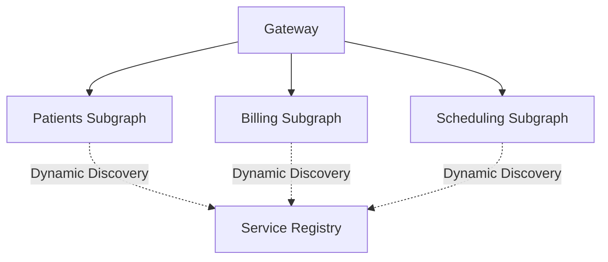
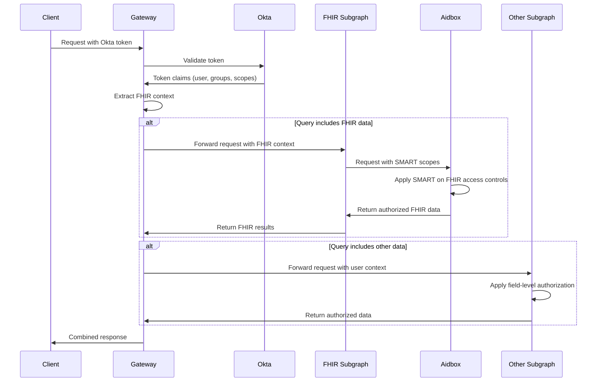

# Gateway Configuration

## Introduction

The gateway is the central entry point in a federated GraphQL architecture. It routes incoming queries to the appropriate subgraphs, merges the results, and enforces cross-cutting concerns such as authentication, error handling, and caching. In healthcare, a well-configured gateway ensures secure, unified access to data from multiple domains—such as patients, billing, and scheduling—while maintaining scalability and reliability.

Our implementation uses Apollo Federation for the gateway, with Okta for authentication and Aidbox as our FHIR server. This combination provides a robust, standards-compliant solution for healthcare data access with enterprise-grade security and performance.

This guide provides practical guidance for:
- Configuring static and dynamic service discovery
- Propagating authentication and context to subgraphs
- Implementing robust error handling and response formatting
- Optimizing performance with caching and advanced options

By following these patterns, you can ensure your federated graph is secure, performant, and easy to maintain.

### Quick Start

1. Set up a basic Apollo Gateway with static service discovery
2. Configure authentication and context propagation
3. Implement error handling and response formatting
4. Set up caching and performance optimizations
5. Configure advanced options for production use

### Related Components

- [Setup Guide](../01-getting-started/setup-guide.md): Basic gateway setup instructions
- [Creating Subgraphs](creating-subgraphs.md): Learn how to create subgraphs for your gateway
- [Authentication](authentication.md): Secure your federated graph
- [Monitoring](../05-operations/monitoring.md): Monitor your gateway's performance

## Service Discovery

### Overview

Service discovery is how the gateway knows which subgraphs are part of your federated graph. It determines how the gateway routes queries and composes the overall schema. There are two main approaches: static service lists and dynamic/managed service discovery.

### Rationale

- **Static discovery** is simple and works well for small or stable environments.
- **Dynamic discovery** (e.g., via Apollo Studio or custom endpoints) is better for large, frequently changing deployments.

### Implementation

#### Static Service List

Define subgraphs directly in gateway configuration.

```typescript
import { ApolloGateway } from '@apollo/gateway';
import { DefaultAzureCredential } from '@azure/identity';
import { SecretClient } from '@azure/keyvault-secrets';
import * as appInsights from 'applicationinsights';

// Initialize Application Insights for monitoring
appInsights.setup(process.env.APPINSIGHTS_INSTRUMENTATIONKEY)
  .setAutoCollectRequests(true)
  .setAutoCollectDependencies(true)
  .start();

// Interface for service configuration
interface ServiceConfig {
  name: string;
  url: string;
}

// Function to get service URLs from Azure Key Vault in production
async function getServiceList(): Promise<ServiceConfig[]> {
  if (process.env.NODE_ENV === 'production') {
    try {
      // Use Azure Managed Identity to access Key Vault
      const credential = new DefaultAzureCredential();
      const keyVaultUrl = process.env.KEY_VAULT_URL;
      const secretClient = new SecretClient(keyVaultUrl, credential);
      
      // Get service configuration from Key Vault
      const secret = await secretClient.getSecret('subgraph-config');
      const serviceList: ServiceConfig[] = JSON.parse(secret.value || '[]');
      
      appInsights.defaultClient.trackEvent({
        name: 'ServiceListLoaded',
        properties: { count: serviceList.length.toString() }
      });
      
      return serviceList;
    } catch (error) {
      appInsights.defaultClient.trackException({exception: error});
      console.error('Failed to get service list from Key Vault:', error);
      throw error;
    }
  } else {
    // Development configuration
    return [
      { name: 'patients', url: 'http://localhost:4001/graphql' },
      { name: 'billing', url: 'http://localhost:4002/graphql' },
      { name: 'scheduling', url: 'http://localhost:4003/graphql' },
    ];
  }
}

// Initialize the gateway
async function initializeGateway() {
  const serviceList = await getServiceList();
  
  const gateway = new ApolloGateway({
    serviceList,
    // Add Azure-specific logging
    debug: process.env.NODE_ENV !== 'production',
    logger: {
      debug: (...args) => console.debug(...args),
      info: (...args) => {
        console.info(...args);
        appInsights.defaultClient.trackTrace({message: args.join(' ')});
      },
      warn: (...args) => {
        console.warn(...args);
        appInsights.defaultClient.trackTrace({
          message: args.join(' '),
          severity: appInsights.Contracts.SeverityLevel.Warning
        });
      },
      error: (...args) => {
        console.error(...args);
        appInsights.defaultClient.trackException({exception: new Error(args.join(' '))});
      }
    }
  });
  
  return gateway;
}
```

#### Dynamic/Managed Service Discovery

Use Apollo Studio or a custom endpoint for service list updates.

```javascript
const gateway = new ApolloGateway({
  // No serviceList; uses Apollo Studio for managed federation
  // managedFederation: true,
});
```

#### Custom Service Discovery

You can implement a custom mechanism by periodically fetching the service list from a registry or configuration service.

### Diagram



### Best Practices

- Use static lists for development and small teams.
- Use managed/dynamic discovery for production and large-scale environments.
- Monitor subgraph health and automate updates when possible.

### Azure Deployment Considerations

When deploying your Apollo Gateway to Azure, consider these implementation patterns:

#### AKS Deployment with Service Discovery

For production environments, deploy your gateway to Azure Kubernetes Service (AKS) with proper service discovery:

```yaml
# gateway-deployment.yaml
apiVersion: apps/v1
kind: Deployment
metadata:
  name: apollo-gateway
  labels:
    app: apollo-gateway
spec:
  replicas: 3  # For high availability
  selector:
    matchLabels:
      app: apollo-gateway
  template:
    metadata:
      labels:
        app: apollo-gateway
    spec:
      containers:
      - name: apollo-gateway
        image: acr.azurecr.io/apollo-gateway:v1.0.0
        ports:
        - containerPort: 4000
        env:
        - name: NODE_ENV
          value: "production"
        - name: KEY_VAULT_URL
          valueFrom:
            secretKeyRef:
              name: gateway-secrets
              key: key-vault-url
        - name: APPINSIGHTS_INSTRUMENTATIONKEY
          valueFrom:
            secretKeyRef:
              name: gateway-secrets
              key: appinsights-key
        resources:
          requests:
            cpu: "500m"
            memory: "512Mi"
          limits:
            cpu: "1000m"
            memory: "1Gi"
        readinessProbe:
          httpGet:
            path: /.well-known/apollo/server-health
            port: 4000
          initialDelaySeconds: 5
          periodSeconds: 10
---
apiVersion: v1
kind: Service
metadata:
  name: apollo-gateway
spec:
  selector:
    app: apollo-gateway
  ports:
  - port: 80
    targetPort: 4000
  type: ClusterIP
```

#### Managed Identity Configuration

For secure access to Key Vault and other Azure services:

```typescript
// azure-identity.ts
import { DefaultAzureCredential } from '@azure/identity';
import { SecretClient } from '@azure/keyvault-secrets';

// This will use the managed identity in production environments
export async function getSecretFromKeyVault(secretName: string): Promise<string> {
  const credential = new DefaultAzureCredential();
  const vaultUrl = process.env.KEY_VAULT_URL || '';
  const client = new SecretClient(vaultUrl, credential);
  
  try {
    const secret = await client.getSecret(secretName);
    return secret.value || '';
  } catch (error) {
    console.error(`Error fetching ${secretName} from Key Vault:`, error);
    throw error;
  }
}
```

#### Application Insights Integration

For comprehensive monitoring and observability:

```typescript
// monitoring.ts
import * as appInsights from 'applicationinsights';
import { ApolloServer } from 'apollo-server';
import { ApolloServerPluginUsageReporting } from 'apollo-server-core';

export function setupMonitoring() {
  // Initialize Application Insights
  appInsights.setup(process.env.APPINSIGHTS_INSTRUMENTATIONKEY)
    .setAutoDependencyCorrelation(true)
    .setAutoCollectRequests(true)
    .setAutoCollectPerformance(true)
    .setAutoCollectExceptions(true)
    .setAutoCollectDependencies(true)
    .setAutoCollectConsole(true)
    .setUseDiskRetryCaching(true)
    .start();

  // Return Apollo Server plugin for operation tracking
  return {
    async serverWillStart() {
      appInsights.defaultClient.trackEvent({
        name: 'GatewayStarted'
      });
    },
    async requestDidStart(ctx) {
      const startTime = Date.now();
      return {
        async willSendResponse(requestContext) {
          const duration = Date.now() - startTime;
          appInsights.defaultClient.trackMetric({
            name: 'GraphQLOperationDuration',
            value: duration,
            properties: {
              operationName: requestContext.operationName || 'unknown',
              success: !requestContext.errors
            }
          });
        }
      };
    }
  };
}
```

#### Health Checks and Scaling

Implement robust health checks for AKS to properly manage pod lifecycle and horizontal scaling:

```typescript
// health.ts
import express from 'express';

export async function healthCheck(req: express.Request, res: express.Response) {
  try {
    // Check connection to subgraphs
    const subgraphStatuses = await checkSubgraphHealth();
    const allHealthy = Object.values(subgraphStatuses).every(status => status === 'healthy');
    
    if (allHealthy) {
      res.status(200).json({ status: 'healthy', subgraphs: subgraphStatuses });
    } else {
      res.status(503).json({ status: 'degraded', subgraphs: subgraphStatuses });
    }
  } catch (error) {
    res.status(503).json({ status: 'unhealthy', error: error.message });
  }
}
```

## Authentication and Context Propagation

### Overview

Authentication and context propagation ensure that user identity, roles, and other important request context are securely and consistently passed from the gateway to each subgraph. This is essential for enforcing access control, auditing, and providing a seamless user experience across your federated graph.

Our implementation uses Okta for authentication and identity management, with special handling for Aidbox FHIR server integration. This approach provides robust security with features like multi-factor authentication, fine-grained access control, and comprehensive audit logging.

### Rationale

- **Centralized authentication**: Authenticate requests at the gateway and propagate validated context to all subgraphs.
- **Consistent authorization**: Ensure subgraphs receive the same user and role information for consistent access control.
- **Auditability**: Maintain traceability of user actions across the graph.

### Implementation

#### Extracting and Validating Tokens at the Gateway

```typescript
import { ApolloServer } from 'apollo-server-express';
import express from 'express';
import { ApolloGateway } from '@apollo/gateway';
import { OktaJwtVerifier } from '@okta/jwt-verifier';
import { JwtHeader, JwtPayload } from 'jsonwebtoken';
import * as appInsights from 'applicationinsights';
import fetch from 'node-fetch';

// Initialize Application Insights for monitoring
appInsights.setup(process.env.APPINSIGHTS_INSTRUMENTATIONKEY)
  .setAutoCollectExceptions(true)
  .start();

// Define interfaces for type safety
interface User {
  id: string;
  name: string;
  email: string;
  groups: string[];
  fhirUserId?: string; // Reference to Aidbox user ID
}

interface TokenPayload extends JwtPayload {
  sub?: string;         // Subject (user ID)
  name?: string;        // User's name
  email?: string;       // Email address
  groups?: string[];    // User groups
  scp?: string[];       // OAuth scopes
}

interface GatewayContext {
  user: User | null;
  token: string | null;
  isAuthenticated: boolean;
  requestId: string;
  fhirContext?: {
    patientId?: string;
    encounterId?: string;
    smartScopes?: string[];
  };
}

// Initialize Okta JWT Verifier
const oktaJwtVerifier = new OktaJwtVerifier({
  issuer: `https://${process.env.OKTA_DOMAIN}/oauth2/default`,
  clientId: process.env.OKTA_CLIENT_ID,
  assertClaims: {
    // Optional: Add any specific claims you want to validate
    // 'groups.includes': 'Everyone'
  }
});

// Okta token validation
async function validateOktaToken(token: string): Promise<User | null> {
  if (!token || !token.startsWith('Bearer ')) {
    return null;
  }
  
  const tokenValue = token.split(' ')[1];
  
  try {
    // Validate token using Okta JWT Verifier
    const jwt = await oktaJwtVerifier.verifyAccessToken(tokenValue, 'api://default');
    const decodedToken = jwt.claims as TokenPayload;
    
    // Track successful authentication
    appInsights.defaultClient.trackEvent({
      name: 'UserAuthenticated',
      properties: {
        userId: decodedToken.sub || 'unknown',
        scopes: decodedToken.scp?.join(' ') || ''
      }
    });
    
    // Get or create Aidbox user ID if needed
    let fhirUserId: string | undefined;
    if (decodedToken.scp?.includes('fhir')) {
      fhirUserId = await getOrCreateAidboxUser(decodedToken, tokenValue);
    }
    
    // Return user object from token claims
    return {
      id: decodedToken.sub || '',
      name: decodedToken.name || '',
      email: decodedToken.email || '',
      groups: decodedToken.groups || [],
      fhirUserId
    };
  } catch (error) {
    // Log authentication failures
    appInsights.defaultClient.trackException({exception: error});
    console.error('Token validation failed:', error);
    return null;
  }
}

// Get or create Aidbox user based on Okta identity
async function getOrCreateAidboxUser(decodedToken: TokenPayload, accessToken: string): Promise<string | undefined> {
  try {
    const aidboxUserId = `okta-${decodedToken.sub}`;
    
    // Check if user exists in Aidbox
    const checkResponse = await fetch(`${process.env.AIDBOX_URL}/User/${aidboxUserId}`, {
      method: 'GET',
      headers: {
        'Accept': 'application/json',
        'Authorization': `Bearer ${accessToken}`
      }
    });
    
    // If user doesn't exist, create it
    if (checkResponse.status === 404) {
      const aidboxUser = {
        resourceType: 'User',
        id: aidboxUserId,
        name: {
          text: decodedToken.name,
          // Split name into given and family if available
          given: decodedToken.name?.split(' ').slice(0, -1) || [''],
          family: decodedToken.name?.split(' ').slice(-1)[0] || ''
        },
        telecom: [{
          system: 'email',
          value: decodedToken.email
        }],
        // Map Okta groups to Aidbox roles
        extension: [{
          url: 'http://example.org/fhir/StructureDefinition/okta-groups',
          valueString: JSON.stringify(decodedToken.groups || [])
        }]
      };
      
      // Create user in Aidbox
      const createResponse = await fetch(`${process.env.AIDBOX_URL}/User/${aidboxUserId}`, {
        method: 'PUT',
        headers: {
          'Content-Type': 'application/json',
          'Authorization': `Bearer ${accessToken}`
        },
        body: JSON.stringify(aidboxUser)
      });
      
      if (!createResponse.ok) {
        throw new Error(`Failed to create Aidbox user: ${createResponse.statusText}`);
      }
      
      // Track user creation
      appInsights.defaultClient.trackEvent({
        name: 'AidboxUserCreated',
        properties: {
          userId: decodedToken.sub || '',
          aidboxUserId
        }
      });
    }
    
    return aidboxUserId;
  } catch (error) {
    appInsights.defaultClient.trackException({exception: error});
    console.error('Error getting/creating Aidbox user:', error);
    return undefined;
  }
}

// Extract FHIR context from token or headers
async function extractFhirContext(req: express.Request, token: string, user: User | null): Promise<any> {
  // Default empty context
  const fhirContext: any = {};
  
  // Try to extract from token claims
  if (token && token.startsWith('Bearer ')) {
    const tokenValue = token.split(' ')[1];
    try {
      const jwt = await oktaJwtVerifier.verifyAccessToken(tokenValue, 'api://default');
      const claims = jwt.claims as TokenPayload;
      
      // Extract SMART on FHIR scopes
      if (claims.scp) {
        fhirContext.smartScopes = claims.scp.filter(scope => 
          scope.startsWith('patient/') || 
          scope.startsWith('user/') || 
          scope === 'launch'
        );
      }
      
      // Extract patient context from launch context if available
      if (claims.context && claims.context.patient) {
        fhirContext.patientId = claims.context.patient;
      }
      
      // Extract encounter context if available
      if (claims.context && claims.context.encounter) {
        fhirContext.encounterId = claims.context.encounter;
      }
    } catch (error) {
      // Ignore token parsing errors here, we've already validated auth
    }
  }
  
  // Check for FHIR context in headers (for testing/development)
  if (req.headers['x-fhir-patient-id']) {
    fhirContext.patientId = req.headers['x-fhir-patient-id'] as string;
  }
  
  return fhirContext;
}

// Initialize Apollo Server with context
const server = new ApolloServer({
  gateway,
  subscriptions: false,
  context: async ({ req }): Promise<GatewayContext> => {
    // Generate unique request ID for tracing
    const requestId = require('uuid').v4();
    
    // Extract token from Authorization header
    const token = req.headers.authorization || '';
    
    // Validate token and extract user info
    const user = await validateOktaToken(token);
    
    // Extract FHIR context if applicable
    const fhirContext = await extractFhirContext(req, token, user);
    
    // Track request with context
    appInsights.defaultClient.trackRequest({
      name: req.body?.operationName || 'GraphQL Operation',
      url: req.url,
      duration: 0, // Will be updated in plugin
      success: true, // Will be updated in plugin
      properties: {
        requestId,
        userId: user?.id || 'anonymous',
        operationName: req.body?.operationName,
        hasFhirContext: Object.keys(fhirContext).length > 0 ? 'true' : 'false'
      }
    });
    
    // Return context object to be passed to all resolvers
    return { 
      user, 
      token: token.split(' ')[1] || null,
      isAuthenticated: !!user,
      requestId,
      fhirContext: Object.keys(fhirContext).length > 0 ? fhirContext : undefined
    };
  },
});
```

#### Propagating Authentication to Subgraphs

Use a custom `RemoteGraphQLDataSource` to forward headers and context.

```typescript
import { RemoteGraphQLDataSource } from '@apollo/gateway';
import { GraphQLRequest } from 'apollo-server-core';
import * as appInsights from 'applicationinsights';

// Define interfaces for type safety
interface User {
  id: string;
  name: string;
  email: string;
  groups: string[];
  fhirUserId?: string;
}

interface GatewayContext {
  user: User | null;
  token: string | null;
  isAuthenticated: boolean;
  requestId: string;
  // FHIR-specific context
  fhirContext?: {
    patientId?: string;
    encounterId?: string;
    smartScopes?: string[];
  };
}

// Extended data source with authentication and Aidbox FHIR integration
class AuthenticatedDataSource extends RemoteGraphQLDataSource {
  async willSendRequest({ request, context }: { request: GraphQLRequest, context: GatewayContext }) {
    // For tracing and correlation
    request.http.headers.set('x-request-id', context.requestId);
    
    // Propagate the token to subgraphs
    if (context.token) {
      request.http.headers.set('Authorization', `Bearer ${context.token}`);
    }
    
    // Add user context for authorization in subgraphs
    if (context.user) {
      // Basic user context
      request.http.headers.set('x-user-id', context.user.id);
      request.http.headers.set('x-user-groups', context.user.groups.join(','));
      
      // Add Aidbox FHIR user ID if available
      if (context.user.fhirUserId) {
        request.http.headers.set('x-fhir-user-id', context.user.fhirUserId);
      }
      
      // Track subgraph requests by user for audit purposes
      appInsights.defaultClient.trackEvent({
        name: 'SubgraphRequest',
        properties: {
          userId: context.user.id,
          groups: context.user.groups.join(','),
          subgraphUrl: this.url,
          hasFhirContext: context.fhirContext ? 'true' : 'false'
        }
      });
    }
    
    // Add FHIR-specific context if available
    if (context.fhirContext) {
      // Add patient context for patient-specific queries
      if (context.fhirContext.patientId) {
        request.http.headers.set('x-fhir-patient-id', context.fhirContext.patientId);
      }
      
      // Add encounter context if available
      if (context.fhirContext.encounterId) {
        request.http.headers.set('x-fhir-encounter-id', context.fhirContext.encounterId);
      }
      
      // Add SMART scopes for fine-grained access control
      if (context.fhirContext.smartScopes && context.fhirContext.smartScopes.length > 0) {
        request.http.headers.set('x-fhir-smart-scopes', context.fhirContext.smartScopes.join(' '));
      }
    }
  }
  
  // Override to add error tracking
  async didReceiveError({ error, context }: { error: Error, context: GatewayContext }) {
    appInsights.defaultClient.trackException({
      exception: error,
      properties: {
        requestId: context.requestId,
        userId: context.user?.id || 'anonymous',
        subgraphUrl: this.url,
        subgraphName: this.name
      }
    });
    
    return error;
  }
}

// Initialize the gateway with the authenticated data source
const gateway = new ApolloGateway({
  serviceList: [/* ... */],
  buildService({ name, url }) {
    return new AuthenticatedDataSource({ 
      url,
      name, // Store name for error tracking
      willSendRequest: async ({ request, context }) => {
        // Add subgraph-specific headers
        if (name === 'fhir') {
          // Add Aidbox-specific headers
          request.http.headers.set('x-aidbox-client', 'graphql-gateway');
          request.http.headers.set('x-aidbox-api-version', '1.0');
          
          // Add Content-Type for FHIR API
          request.http.headers.set('Accept', 'application/fhir+json');
        }
      }
    });
  },
});
```
#### Diagram




### Rationale

- **Consistency**: Provide a uniform error structure regardless of which subgraph or backend fails.
- **Security**: Prevent internal error details from leaking to clients.
- **User experience**: Deliver actionable, user-friendly error messages and codes.

### Implementation

#### Custom Error Formatting

Use Apollo Server’s `formatError` function to standardize error responses across your gateway, with special handling for Okta authentication errors and Aidbox FHIR server responses.

```typescript
import { ApolloServer, AuthenticationError, ForbiddenError, UserInputError } from 'apollo-server';
import { GraphQLError, GraphQLFormattedError } from 'graphql';
import * as appInsights from 'applicationinsights';

// Define healthcare-specific error codes for Aidbox integration
enum HealthcareErrorCode {
  // FHIR resource errors
  PATIENT_NOT_FOUND = 'PATIENT_NOT_FOUND',
  ENCOUNTER_NOT_FOUND = 'ENCOUNTER_NOT_FOUND',
  OBSERVATION_NOT_FOUND = 'OBSERVATION_NOT_FOUND',
  
  // Access control errors
  UNAUTHORIZED_ACCESS = 'UNAUTHORIZED_ACCESS',
  HIPAA_VIOLATION = 'HIPAA_VIOLATION',
  MISSING_PATIENT_CONTEXT = 'MISSING_PATIENT_CONTEXT',
  INSUFFICIENT_SCOPE = 'INSUFFICIENT_SCOPE',
  
  // Aidbox-specific errors
  AIDBOX_VALIDATION_ERROR = 'AIDBOX_VALIDATION_ERROR',
  AIDBOX_OPERATION_ERROR = 'AIDBOX_OPERATION_ERROR',
  
  // Okta-specific errors
  OKTA_TOKEN_EXPIRED = 'OKTA_TOKEN_EXPIRED',
  OKTA_INVALID_TOKEN = 'OKTA_INVALID_TOKEN',
  OKTA_MISSING_SCOPE = 'OKTA_MISSING_SCOPE'
}

// Initialize Application Insights
appInsights.setup(process.env.APPINSIGHTS_INSTRUMENTATIONKEY)
  .setAutoCollectExceptions(true)
  .start();

// Custom error formatter with healthcare-specific handling
function formatError(error: GraphQLError): GraphQLFormattedError {
  // Extract original error and code
  const originalError = error.originalError;
  const code = error.extensions?.code || 'UNKNOWN_ERROR';
  
  // Track error in Application Insights with context
  appInsights.defaultClient.trackException({
    exception: originalError || error,
    properties: {
      path: error.path?.join('.'),
      code,
      operationName: error.extensions?.operationName,
      userId: error.extensions?.context?.user?.id || 'anonymous'
    }
  });
  
  // Log detailed error for internal monitoring
  console.error('GraphQL Error:', {
    message: error.message,
    code,
    path: error.path,
    stack: originalError?.stack
  });

  // Aidbox FHIR resource errors
  if (code === HealthcareErrorCode.PATIENT_NOT_FOUND || 
      code === HealthcareErrorCode.ENCOUNTER_NOT_FOUND || 
      code === HealthcareErrorCode.OBSERVATION_NOT_FOUND) {
    const resourceType = code.split('_')[0].toLowerCase();
    return {
      message: `The requested ${resourceType} record could not be found`,
      extensions: {
        code,
        http: { status: 404 }
      }
    };
  }
  
  // HIPAA compliance violations
  if (code === HealthcareErrorCode.HIPAA_VIOLATION) {
    // Log compliance violations with high severity
    appInsights.defaultClient.trackEvent({
      name: 'ComplianceViolation',
      properties: {
        type: 'HIPAA',
        userId: error.extensions?.context?.user?.id || 'anonymous',
        severity: 'HIGH'
      }
    });
    
    return {
      message: 'Access denied due to data privacy restrictions',
      extensions: {
        code,
        http: { status: 403 }
      }
    };
  }
  
  // SMART on FHIR scope errors
  if (code === HealthcareErrorCode.INSUFFICIENT_SCOPE) {
    const requiredScope = error.extensions?.requiredScope || 'appropriate';
    return {
      message: `Access denied. Your token does not have the ${requiredScope} scope`,
      extensions: {
        code,
        requiredScope,
        http: { status: 403 }
      }
    };
  }
  
  // Aidbox-specific errors
  if (code === HealthcareErrorCode.AIDBOX_VALIDATION_ERROR) {
    return {
      message: 'The request contains invalid FHIR resource data',
      extensions: {
        code,
        validationErrors: error.extensions?.validationErrors || [],
        http: { status: 400 }
      }
    };
  }
  
  if (code === HealthcareErrorCode.AIDBOX_OPERATION_ERROR) {
    // Don't expose internal Aidbox details
    return {
      message: 'An error occurred while processing the FHIR operation',
      extensions: {
        code,
        http: { status: 500 }
      }
    };
  }
  
  // Okta authentication errors
  if (code === HealthcareErrorCode.OKTA_TOKEN_EXPIRED) {
    return {
      message: 'Your session has expired. Please log in again',
      extensions: {
        code,
        http: { status: 401 }
      }
    };
  }
  
  if (code === HealthcareErrorCode.OKTA_INVALID_TOKEN) {
    return {
      message: 'Invalid authentication token',
      extensions: {
        code,
        http: { status: 401 }
      }
    };
  }

  // Handle authentication and authorization errors
  if (originalError instanceof AuthenticationError) {
    return {
      message: 'Authentication required',
      extensions: {
        code: 'UNAUTHENTICATED',
        http: { status: 401 }
      }
    };
  }
  
  if (originalError instanceof ForbiddenError) {
    return {
      message: 'You do not have permission to perform this action',
      extensions: {
        code: 'FORBIDDEN',
        http: { status: 403 }
      }
    };
  }

  // Don't expose internal details to clients
  if (code === 'INTERNAL_SERVER_ERROR') {
    return {
      message: 'An unexpected error occurred',
      extensions: {
        code: 'INTERNAL_SERVER_ERROR',
        http: { status: 500 }
      }
    };
  }

  // Return formatted error
  return error;
}

const server = new ApolloServer({
  gateway,
  formatError,
  plugins: [
    {
      // Plugin to track errors by type for monitoring
      async requestDidStart() {
        return {
          async didEncounterErrors({ errors, context, request }) {
            // Group errors by type for analytics
            const errorCounts = errors.reduce((counts, error) => {
              const code = error.extensions?.code || 'UNKNOWN';
              counts[code] = (counts[code] || 0) + 1;
              return counts;
            }, {} as Record<string, number>);
            
            // Track error metrics
            appInsights.defaultClient.trackMetric({
              name: 'GraphQLErrors',
              value: errors.length,
              properties: {
                operationName: request.operationName || 'unknown',
                errorCounts: JSON.stringify(errorCounts)
              }
            });
          }
        };
      }
    }
  ]
});  // ...other options
});

#### Example Error Responses

Here are examples of different error responses you might encounter when using Okta authentication and Aidbox FHIR server integration.

##### Authentication Error (Okta)

```json
{
  "errors": [
    {
      "message": "Your session has expired. Please log in again",
      "extensions": {
        "code": "OKTA_TOKEN_EXPIRED",
        "http": { "status": 401 }
      }
    }
  ],
  "data": null
}
```

##### FHIR Resource Not Found (Aidbox)

```json
{
  "errors": [
    {
      "message": "The requested patient record could not be found",
      "extensions": {
        "code": "PATIENT_NOT_FOUND",
        "http": { "status": 404 }
      }
    }
  ],
  "data": {
    "patient": null
  }
}
```

##### SMART on FHIR Scope Error

```json
{
  "errors": [
    {
      "message": "Access denied. Your token does not have the patient/*.write scope",
      "extensions": {
        "code": "INSUFFICIENT_SCOPE",
        "requiredScope": "patient/*.write",
        "http": { "status": 403 }
      }
    }
  ],
  "data": null
}
```

### Best Practices

#### General Error Handling
- Use descriptive error codes that align with your domain model (e.g., `PATIENT_NOT_FOUND`, `INSUFFICIENT_SCOPE`).
- Never expose stack traces, database errors, or internal system details to clients.
- Log all errors with sufficient context for troubleshooting, using Application Insights for centralized monitoring.
- Return partial data with errors where possible, following GraphQL's error propagation model.

#### Okta-Specific Recommendations
- Map Okta authentication errors to user-friendly messages that guide users to take appropriate action.
- Include specific error codes for token expiration, invalid tokens, and insufficient scopes.
- Implement proper JWKS caching to avoid excessive calls to Okta's authorization servers.
- Use Okta's rate limit headers to implement backoff strategies when needed.

#### Aidbox FHIR Integration
- Standardize FHIR resource error codes across all subgraphs that interact with Aidbox.
- Implement SMART on FHIR scope validation for healthcare data access.
- Preserve FHIR operation outcome details for debugging while presenting simplified messages to end users.
- Track HIPAA-related access violations separately for compliance reporting.


## Caching and Performance Optimization

### Overview

Effective caching and performance tuning at the gateway are essential for delivering a fast, scalable federated GraphQL API. By leveraging caching strategies and optimizing gateway configuration, you can reduce backend load, improve response times, and ensure a responsive experience for all consumers.

In healthcare applications, caching requires special consideration due to data sensitivity and the need for real-time accuracy. Our implementation uses Apollo Server's caching capabilities with specific configurations for Aidbox FHIR server integration, ensuring both performance and data integrity.

### Rationale
- **Reduce latency**: Serve frequently requested data quickly from cache, critical for healthcare applications where timely data access impacts clinical decisions.
- **Decrease backend load**: Minimize repeated requests to subgraphs and Aidbox FHIR server, preserving resources for critical operations.
- **Improve scalability**: Support more concurrent users without increasing infrastructure costs.
- **Balance freshness and performance**: Implement cache invalidation strategies that ensure healthcare data is current while maintaining performance.
- **Respect data sensitivity**: Apply patient-specific cache segmentation to prevent data leakage between contexts.

### Implementation

#### Response Caching with Apollo Server
Enable response caching at the gateway using `apollo-server-plugin-response-cache` and configure cache control in your schema.

```typescript
import { ApolloServer } from 'apollo-server';
import responseCachePlugin from 'apollo-server-plugin-response-cache';
import * as appInsights from 'applicationinsights';

// Initialize Application Insights for monitoring cache performance
appInsights.setup(process.env.APPINSIGHTS_INSTRUMENTATIONKEY).start();

// Helper function to determine if a request should be cached based on FHIR context
function shouldCacheFhirData(ctx: any): boolean {
  // Don't cache if there are errors
  if (ctx.errors) return false;
  
  // Don't cache mutations
  if (ctx.operation.operation === 'mutation') return false;
  
  // Extract operation details
  const operationName = ctx.operation.name?.value;
  const context = ctx.context;
  
  // Don't cache patient-specific data for security
  if (context.fhirContext?.patientId) {
    // Exception: Cache reference data even in patient context
    if (operationName === 'GetMedicationReferences' || 
        operationName === 'GetConditionCodes' || 
        operationName === 'GetProcedureCodes') {
      return true;
    }
    return false;
  }
  
  // Cache non-patient-specific reference data longer
  return true;
}

// Helper to determine appropriate cache TTL based on data type
function getCacheTtl(ctx: any): number {
  const operationName = ctx.operation.name?.value;
  
  // Reference data can be cached longer
  if (operationName?.includes('Reference') || operationName?.includes('Code')) {
    return 3600; // 1 hour for reference data
  }
  
  // Patient demographics change infrequently
  if (operationName === 'GetPatientDemographics') {
    return 300; // 5 minutes
  }
  
  // Default cache time for other data
  return 60; // 1 minute
}

const server = new ApolloServer({
  gateway,
  plugins: [
    responseCachePlugin({
      // Use dynamic TTL based on operation type
      sessionId: (ctx) => {
        // Include patient ID in cache key to prevent data leakage between patients
        const patientId = ctx.context.fhirContext?.patientId || '';
        // Include user ID for user-specific queries
        const userId = ctx.context.user?.id || '';
        
        // Create a cache key that includes user and patient context
        return `${userId}:${patientId}:${ctx.operation.name?.value || ''}`;
      },
      // Dynamic TTL based on operation
      ttl: getCacheTtl,
      // Cache decision logic
      shouldReadFromCache: shouldCacheFhirData,
      shouldWriteToCache: shouldCacheFhirData,
    }),
  ],
  cacheControl: {
    defaultMaxAge: 60, // Default 1 minute cache
    calculateHttpHeaders: true,
  },
});

// Track cache performance
server.plugins.forEach(plugin => {
  if (plugin.serverWillStart) {
    plugin.serverWillStart().then(() => {
      // Set up periodic cache stats reporting
      setInterval(() => {
        const cacheStats = (server as any).responseCacheStats;
        if (cacheStats) {
          appInsights.defaultClient.trackMetric({
            name: 'CacheHitRate',
            value: cacheStats.hitRate * 100
          });
        }
      }, 60000); // Report every minute
    });
  }
});
```

#### Distributed Caching with Redis
For production, use a distributed cache like Redis to share cache across gateway instances. This is particularly important for healthcare applications where multiple gateway instances need consistent caching behavior.

```typescript
import { ApolloServer } from 'apollo-server';
import { RedisCache } from 'apollo-server-cache-redis';
import * as appInsights from 'applicationinsights';
import { DefaultAzureCredential } from '@azure/identity';
import { SecretClient } from '@azure/keyvault-secrets';

// Get Redis credentials from Azure Key Vault
async function getRedisCredentials(): Promise<{host: string, password: string}> {
  if (process.env.NODE_ENV === 'production') {
    try {
      const credential = new DefaultAzureCredential();
      const keyVaultUrl = process.env.KEY_VAULT_URL || '';
      const secretClient = new SecretClient(keyVaultUrl, credential);
      
      // Get Redis credentials in parallel
      const [hostSecret, passwordSecret] = await Promise.all([
        secretClient.getSecret('redis-host'),
        secretClient.getSecret('redis-password')
      ]);
      
      return {
        host: hostSecret.value || '',
        password: passwordSecret.value || ''
      };
    } catch (error) {
      appInsights.defaultClient.trackException({exception: error});
      console.error('Error fetching Redis credentials from Key Vault:', error);
      throw error;
    }
  } else {
    // Development configuration
    return {
      host: process.env.REDIS_HOST || 'localhost',
      password: process.env.REDIS_PASSWORD || ''
    };
  }
}

// Initialize Apollo Server with Redis cache
async function initializeServer() {
  // Get Redis credentials
  const redisCredentials = await getRedisCredentials();
  
  // Configure Redis with patient-specific cache segmentation
  const redisCache = new RedisCache({
    host: redisCredentials.host,
    port: parseInt(process.env.REDIS_PORT || '6379', 10),
    password: redisCredentials.password,
    keyPrefix: 'fhir:', // Prefix for all cache keys
    // Redis client options for better reliability
    connectTimeout: 10000,
    reconnectStrategy: (retries) => Math.min(retries * 50, 2000), // Exponential backoff
    enableOfflineQueue: true,
    // TLS options for Azure Redis Cache
    tls: process.env.NODE_ENV === 'production' ? { servername: redisCredentials.host } : undefined
  });
  
  // Track Redis connection events
  redisCache.client.on('connect', () => {
    appInsights.defaultClient.trackEvent({ name: 'RedisConnected' });
  });
  
  redisCache.client.on('error', (error) => {
    appInsights.defaultClient.trackException({ exception: error });
  });
  
  // Create Apollo Server with Redis cache
  const server = new ApolloServer({
    gateway,
    cache: redisCache,
    plugins: [
      // Response caching plugin configuration (as shown in previous example)
      // ...
    ],
    // Additional options
    // ...
  });
  
  return server;
}

// Usage
initializeServer().then(server => {
  server.listen().then(({ url }) => {
    console.log(`🚀 Gateway with Redis cache ready at ${url}`);
  });
});
```

#### Setting Cache Hints in Schema
Use the `@cacheControl` directive in your schema to control cache behavior for different FHIR resources. This allows fine-grained control over caching policies based on data volatility and sensitivity.

```graphql
# Patient demographics - moderate caching
type Patient @cacheControl(maxAge: 300) {
  id: ID!
  identifier: [Identifier!]
  name: [HumanName!]
  birthDate: String
  gender: String
  # More volatile clinical data with shorter cache time
  activeProblems: [Condition!] @cacheControl(maxAge: 60)
  recentMedications: [MedicationStatement!] @cacheControl(maxAge: 60)
  # Private data that shouldn't be cached
  insuranceDetails: [Coverage!] @cacheControl(maxAge: 0)
}

# Reference data can be cached longer
type Medication @cacheControl(maxAge: 3600) {
  id: ID!
  code: CodeableConcept!
  description: String
}

# Encounter data changes frequently
type Encounter @cacheControl(maxAge: 60) {
  id: ID!
  status: String!
  class: CodeableConcept!
  type: [CodeableConcept!]
  period: Period
  # Never cache sensitive notes
  notes: [Annotation!] @cacheControl(maxAge: 0, scope: PRIVATE)
}

# Observation results should be fresh
type Observation @cacheControl(maxAge: 120) {
  id: ID!
  status: String!
  code: CodeableConcept!
  subject: Reference!
  effectiveDateTime: String
  valueQuantity: Quantity
}
```

### Best Practices

#### General Caching Guidelines
- Set appropriate cache TTLs based on data volatility, with shorter times for clinical data.
- Invalidate or update cache entries immediately after mutations to ensure data accuracy.
- Monitor cache hit/miss rates and tune configuration for optimal performance.
- Use distributed caching for multi-instance or cloud deployments.
- Implement proper cache key segmentation to prevent data leakage between users.

#### Healthcare-Specific Considerations
- **Never cache PHI without proper segmentation**: Ensure patient-specific data is never shared across users.
- **Reference data caching**: Medical terminology, codes, and drug references can be cached longer.
- **Clinical data freshness**: Set short TTLs for active clinical data like current medications or vital signs.
- **Audit requirements**: Ensure caching doesn't interfere with complete audit logging of data access.
- **Emergency access**: Implement cache bypass mechanisms for emergency clinical scenarios.

#### Aidbox FHIR Integration
- Use FHIR resource-specific caching policies aligned with Aidbox's data model.
- Implement cache invalidation hooks that trigger on Aidbox FHIR resource updates.
- Consider using Aidbox Subscription resources to receive real-time updates for cache invalidation.
- Maintain separate caching policies for different FHIR resource types based on their update frequency.

---

## Advanced Configuration Options

### Overview

Configuring advanced options in Apollo Gateway is crucial for production readiness, reliability, and scalability. These options help you handle high traffic, prevent resource exhaustion, and ensure robust operations in healthcare environments where uptime and security are paramount.

Our implementation uses Apollo Federation with Okta for authentication and Aidbox as our FHIR server, requiring specific configuration for optimal performance and security in healthcare scenarios. This section covers advanced settings that ensure reliable operation in production environments.

### Key Advanced Settings

#### Timeout Settings
Set timeouts for subgraph requests to prevent slow or unresponsive services from blocking the gateway. This is particularly important for healthcare applications where Aidbox FHIR operations may have varying response times.

```typescript
import { ApolloGateway, RemoteGraphQLDataSource } from '@apollo/gateway';
import { GraphQLRequest } from 'apollo-server-core';
import * as appInsights from 'applicationinsights';

// Custom data source with timeout handling
class TimeoutAwareDataSource extends RemoteGraphQLDataSource {
  private timeoutMs: number;
  private serviceName: string;
  
  constructor(options: { url: string, timeout?: number, name: string }) {
    super({ url: options.url });
    this.timeoutMs = options.timeout || 10000; // Default 10 seconds
    this.serviceName = options.name;
  }
  
  async process(request: GraphQLRequest) {
    // Create a promise that rejects after timeout
    const timeoutPromise = new Promise((_, reject) => {
      setTimeout(() => {
        reject(new Error(`Request to ${this.serviceName} timed out after ${this.timeoutMs}ms`));
      }, this.timeoutMs);
    });
    
    // Create the actual request promise
    const requestPromise = super.process(request);
    
    // Race between timeout and actual request
    try {
      return await Promise.race([requestPromise, timeoutPromise]);
    } catch (error) {
      // Track timeout in Application Insights
      appInsights.defaultClient.trackException({
        exception: error,
        properties: {
          subgraphName: this.serviceName,
          operationName: request.operationName,
          timeoutMs: this.timeoutMs.toString()
        }
      });
      
      // Rethrow with more context
      throw error;
    }
  }
}

// Gateway configuration with service-specific timeouts
const gateway = new ApolloGateway({
  serviceList: [
    { name: 'patients', url: 'http://patients-service:4001/graphql' },
    { name: 'fhir', url: 'http://fhir-service:4002/graphql' },
    { name: 'scheduling', url: 'http://scheduling-service:4003/graphql' },
  ],
  buildService({ name, url }) {
    // Set different timeouts based on service type
    let timeout = 5000; // Default 5 seconds
    
    // Aidbox FHIR operations may take longer
    if (name === 'fhir') {
      timeout = 15000; // 15 seconds for FHIR operations
    } 
    // Authentication operations need to be fast
    else if (name === 'auth') {
      timeout = 3000; // 3 seconds for auth operations
    }
    
    return new TimeoutAwareDataSource({ 
      url, 
      timeout,
      name
    });
  },
  // Poll for schema changes every 60 seconds
  experimental_pollInterval: 60000,
});
```

This approach provides granular control over timeouts for different services, with special consideration for Aidbox FHIR operations that may involve complex data retrieval.

#### Concurrency Limits
Limit the number of concurrent requests to subgraphs to prevent overload. This is particularly important for healthcare applications where Aidbox FHIR operations may be resource-intensive, especially for complex clinical queries.

```typescript
import { ApolloGateway, RemoteGraphQLDataSource } from '@apollo/gateway';
import { GraphQLRequest } from 'apollo-server-core';
import * as appInsights from 'applicationinsights';
import pLimit from 'p-limit';

// Custom data source with concurrency control
class ConcurrencyAwareDataSource extends RemoteGraphQLDataSource {
  private limit: pLimit.Limit;
  private serviceName: string;
  
  constructor(options: { url: string, maxConcurrent: number, name: string }) {
    super({ url: options.url });
    this.limit = pLimit(options.maxConcurrent);
    this.serviceName = options.name;
  }
  
  async process(request: GraphQLRequest) {
    try {
      // Track pending requests count
      const pendingCount = this.limit.pendingCount;
      if (pendingCount > 0) {
        appInsights.defaultClient.trackMetric({
          name: `${this.serviceName}PendingRequests`,
          value: pendingCount
        });
      }
      
      // Process request with concurrency limit
      return await this.limit(() => super.process(request));
    } catch (error) {
      // Track if we hit concurrency limits
      if (error.message?.includes('concurrency')) {
        appInsights.defaultClient.trackEvent({
          name: 'ConcurrencyLimitExceeded',
          properties: {
            subgraphName: this.serviceName,
            operationName: request.operationName
          }
        });
      }
      
      throw error;
    }
  }
}

// Gateway configuration with service-specific concurrency limits
const gateway = new ApolloGateway({
  serviceList: [
    { name: 'patients', url: 'http://patients-service:4001/graphql' },
    { name: 'fhir', url: 'http://fhir-service:4002/graphql' },
    { name: 'scheduling', url: 'http://scheduling-service:4003/graphql' },
  ],
  buildService({ name, url }) {
    // Set different concurrency limits based on service type
    let maxConcurrent = 50; // Default limit
    
    // Aidbox FHIR operations are resource-intensive
    if (name === 'fhir') {
      // Lower concurrency for FHIR operations to prevent Aidbox overload
      maxConcurrent = 20;
    } 
    // Authentication operations should have higher throughput
    else if (name === 'auth') {
      maxConcurrent = 100;
    }
    
    return new ConcurrencyAwareDataSource({ 
      url, 
      maxConcurrent,
      name
    });
  }
});
```

This implementation uses the `p-limit` library to control concurrency for each subgraph service, with special consideration for Aidbox FHIR operations that may be more resource-intensive.

#### Health Checks and Service Monitoring
Enable health checks to automatically detect and remove unhealthy subgraphs. This is critical for healthcare applications where service reliability directly impacts clinical workflows.

```typescript
import { ApolloGateway, RemoteGraphQLDataSource } from '@apollo/gateway';
import { GraphQLRequest } from 'apollo-server-core';
import * as appInsights from 'applicationinsights';
import fetch from 'node-fetch';

// Custom data source with health checks
class HealthAwareDataSource extends RemoteGraphQLDataSource {
  private serviceName: string;
  private healthCheckEndpoint: string;
  private healthCheckInterval: NodeJS.Timeout | null = null;
  private healthy: boolean = true;
  
  constructor(options: { 
    url: string, 
    name: string, 
    healthCheckEndpoint?: string,
    healthCheckIntervalMs?: number
  }) {
    super({ url: options.url });
    this.serviceName = options.name;
    
    // Default health check endpoint based on service type
    if (options.healthCheckEndpoint) {
      this.healthCheckEndpoint = options.healthCheckEndpoint;
    } else if (options.name === 'fhir') {
      // Aidbox FHIR server health check endpoint
      this.healthCheckEndpoint = `${new URL(options.url).origin}/health`;
    } else {
      // Default Apollo health check endpoint
      this.healthCheckEndpoint = `${new URL(options.url).origin}/.well-known/apollo/server-health`;
    }
    
    // Start health check polling if interval provided
    if (options.healthCheckIntervalMs) {
      this.startHealthChecks(options.healthCheckIntervalMs);
    }
  }
  
  // Start periodic health checks
  private startHealthChecks(intervalMs: number): void {
    this.healthCheckInterval = setInterval(async () => {
      try {
        const wasHealthy = this.healthy;
        this.healthy = await this.checkHealth();
        
        // Track health state changes
        if (wasHealthy !== this.healthy) {
          appInsights.defaultClient.trackEvent({
            name: this.healthy ? 'ServiceRecovered' : 'ServiceUnhealthy',
            properties: {
              serviceName: this.serviceName,
              endpoint: this.healthCheckEndpoint
            }
          });
        }
      } catch (error) {
        appInsights.defaultClient.trackException({
          exception: error,
          properties: {
            serviceName: this.serviceName,
            operation: 'healthCheck'
          }
        });
      }
    }, intervalMs);
  }
  
  // Stop health checks (e.g., during shutdown)
  public stopHealthChecks(): void {
    if (this.healthCheckInterval) {
      clearInterval(this.healthCheckInterval);
      this.healthCheckInterval = null;
    }
  }
  
  // Check service health
  private async checkHealth(): Promise<boolean> {
    try {
      // Special handling for Aidbox FHIR server
      if (this.serviceName === 'fhir') {
        const response = await fetch(this.healthCheckEndpoint, {
          method: 'GET',
          headers: { 'Accept': 'application/json' }
        });
        
        if (!response.ok) return false;
        
        const data = await response.json();
        return data.status === 'pass' || data.status === 'ok';
      } 
      // Default Apollo health check
      else {
        const response = await fetch(this.healthCheckEndpoint);
        if (!response.ok) return false;
        
        const data = await response.json();
        return data.status === 'pass';
      }
    } catch (error) {
      console.error(`Health check failed for ${this.serviceName}:`, error);
      return false;
    }
  }
  
  // Override process method to check health before processing
  async process(request: GraphQLRequest) {
    // If service is unhealthy, fail fast
    if (!this.healthy) {
      throw new Error(`Service ${this.serviceName} is currently unhealthy`);
    }
    
    // Process request normally if healthy
    return super.process(request);
  }
}

// Gateway configuration with health checks
const gateway = new ApolloGateway({
  serviceList: [
    { name: 'patients', url: 'http://patients-service:4001/graphql' },
    { name: 'fhir', url: 'http://fhir-service:4002/graphql' },
    { name: 'scheduling', url: 'http://scheduling-service:4003/graphql' },
  ],
  buildService({ name, url }) {
    return new HealthAwareDataSource({ 
      url, 
      name,
      healthCheckIntervalMs: 30000 // Check health every 30 seconds
    });
  },
  // Enable built-in health checks as well
  experimental_automaticServiceHealthCheck: true,
});
```

This implementation provides robust health checking for all services, with special handling for Aidbox FHIR server health endpoints and appropriate error handling.

#### Secure Headers and Network Config
- Always use HTTPS for communication between gateway and subgraphs in production.
- Set secure HTTP headers (e.g., `Strict-Transport-Security`, `X-Content-Type-Options`).

#### Schema Polling and Hot Reload
Configure schema polling to automatically update the composed schema when subgraphs change.

```javascript
const gateway = new ApolloGateway({
  serviceList: [/* ... */],
  experimental_pollInterval: 10000, // Poll every 10 seconds
});
```

#### Logging and Auditing
Integrate with centralized logging and monitoring systems (e.g., ELK, Datadog) for audit trails and operational visibility.

### Best Practices
- Set conservative timeouts to avoid cascading failures.
- Monitor subgraph health and automate failover/removal.
- Use environment variables for sensitive configuration (e.g., secrets, URLs).
- Regularly review logs and metrics to proactively address issues.
- Document all advanced settings in your infrastructure-as-code or deployment scripts.

---

## Conclusion

A well-configured gateway is foundational to a secure, performant, and reliable federated GraphQL API—especially in healthcare environments where data integrity and uptime are critical. By applying the patterns and best practices in this guide, you can:

1. Ensure secure, unified access to multiple domains and legacy systems
2. Provide a consistent, developer-friendly API surface
3. Optimize performance and scalability with caching and advanced configuration
4. Maintain robust error handling and operational visibility

Continue to monitor, tune, and evolve your gateway configuration as your federated graph grows and your organizational needs change.
