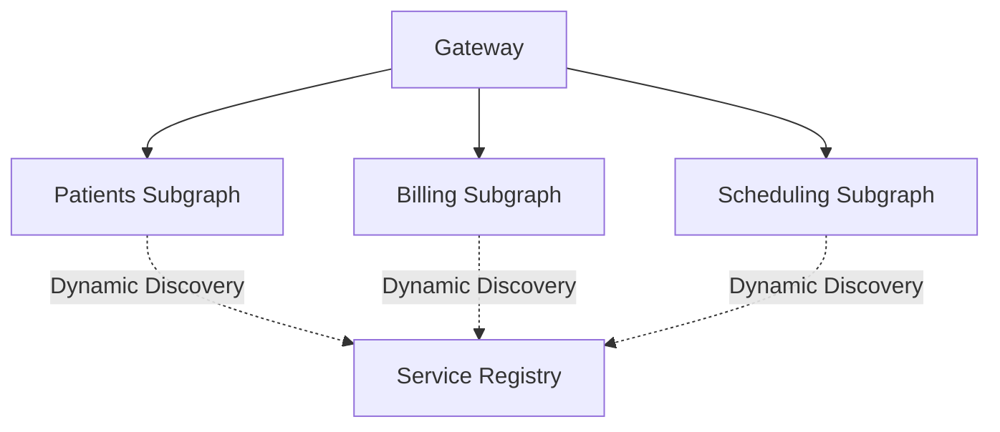
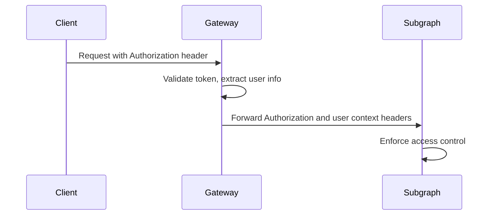

# Gateway Configuration

## Introduction

The gateway is the central entry point in a federated GraphQL architecture. It routes incoming queries to the appropriate subgraphs, merges the results, and enforces cross-cutting concerns such as authentication, error handling, and caching. In healthcare, a well-configured gateway ensures secure, unified access to data from multiple domains—such as patients, billing, and scheduling—while maintaining scalability and reliability.

This guide provides practical guidance for:
- Configuring static and dynamic service discovery
- Propagating authentication and context to subgraphs
- Implementing robust error handling and response formatting
- Optimizing performance with caching and advanced options

By following these patterns, you can ensure your federated graph is secure, performant, and easy to maintain.

### Quick Start

1. Set up a basic Apollo Gateway with static service discovery
2. Configure authentication and context propagation
3. Implement error handling and response formatting
4. Set up caching and performance optimizations
5. Configure advanced options for production use

### Related Components

- [Setup Guide](../01-getting-started/setup-guide.md): Basic gateway setup instructions
- [Creating Subgraphs](creating-subgraphs.md): Learn how to create subgraphs for your gateway
- [Authentication](authentication.md): Secure your federated graph
- [Monitoring](../05-operations/monitoring.md): Monitor your gateway's performance

## Service Discovery

### Overview

Service discovery is how the gateway knows which subgraphs are part of your federated graph. It determines how the gateway routes queries and composes the overall schema. There are two main approaches: static service lists and dynamic/managed service discovery.

### Rationale

- **Static discovery** is simple and works well for small or stable environments.
- **Dynamic discovery** (e.g., via Apollo Studio or custom endpoints) is better for large, frequently changing deployments.

### Implementation

#### Static Service List

Define subgraphs directly in gateway configuration.

```javascript
const { ApolloGateway } = require('@apollo/gateway');

const gateway = new ApolloGateway({
  serviceList: [
    { name: 'patients', url: 'http://localhost:4001/graphql' },
    { name: 'billing', url: 'http://localhost:4002/graphql' },
    { name: 'scheduling', url: 'http://localhost:4003/graphql' },
  ],
});
```

#### Dynamic/Managed Service Discovery

Use Apollo Studio or a custom endpoint for service list updates.

```javascript
const gateway = new ApolloGateway({
  // No serviceList; uses Apollo Studio for managed federation
  // managedFederation: true,
});
```

#### Custom Service Discovery

You can implement a custom mechanism by periodically fetching the service list from a registry or configuration service.

### Diagram



### Best Practices

- Use static lists for development and small teams.
- Use managed/dynamic discovery for production and large-scale environments.
- Monitor subgraph health and automate updates when possible.


## Authentication and Context Propagation

### Overview

Authentication and context propagation ensure that user identity, roles, and other important request context are securely and consistently passed from the gateway to each subgraph. This is essential for enforcing access control, auditing, and providing a seamless user experience across your federated graph.

### Rationale

- **Centralized authentication**: Authenticate requests at the gateway and propagate validated context to all subgraphs.
- **Consistent authorization**: Ensure subgraphs receive the same user and role information for consistent access control.
- **Auditability**: Maintain traceability of user actions across the graph.

### Implementation

#### Extracting and Validating Tokens at the Gateway

```javascript
const server = new ApolloServer({
  gateway,
  subscriptions: false,
  context: ({ req }) => {
    // Extract and validate JWT or other auth tokens
    const token = req.headers.authorization || '';
    // Optionally decode or verify the token here
    return { token };
  },
});
```

#### Propagating Authentication to Subgraphs

Use a custom `RemoteGraphQLDataSource` to forward headers and context.

```javascript
const { ApolloGateway, RemoteGraphQLDataSource } = require('@apollo/gateway');

class AuthenticatedDataSource extends RemoteGraphQLDataSource {
  willSendRequest({ request, context }) {
    // Forward the token to the subgraph
    if (context.token) {
      request.http.headers.set('Authorization', context.token);
    }
    // Optionally forward user roles, IDs, or other context
    if (context.user) {
      request.http.headers.set('X-User-ID', context.user.id);
      request.http.headers.set('X-User-Roles', context.user.roles.join(','));
    }
  }
}

const gateway = new ApolloGateway({
  serviceList: [/* ... */],
  buildService({ url }) {
    return new AuthenticatedDataSource({ url });
  },
});
```

#### Diagram



### Best Practices

- Always validate tokens at the gateway before forwarding.
- Never trust user input in subgraphs—rely on context from the gateway.
- Use secure headers (not query params) for passing authentication and context.
- Consider using field-level authorization directives in subgraphs for fine-grained control.


## Error Handling and Response Formatting

### Overview

The gateway is the ideal place to standardize error handling and response formatting across your federated graph. By intercepting and formatting errors at the gateway, you ensure that API consumers receive clear, actionable messages, and that sensitive backend details are never exposed.

### Rationale

- **Consistency**: Provide a uniform error structure regardless of which subgraph or backend fails.
- **Security**: Prevent internal error details from leaking to clients.
- **User experience**: Deliver actionable, user-friendly error messages and codes.

### Implementation

#### Custom Error Formatting

Use Apollo Server’s `formatError` function to standardize error responses.

```javascript
const { ApolloServer, AuthenticationError, ForbiddenError } = require('apollo-server');

function formatError(error) {
  // Log errors for internal monitoring
  console.error('GraphQL Error:', error);

  // Customize error messages and codes
  if (error.originalError instanceof AuthenticationError) {
    return {
      message: 'Authentication required.',
      extensions: { code: 'UNAUTHENTICATED', http: { status: 401 } }
    };
  }
  if (error.originalError instanceof ForbiddenError) {
    return {
      message: 'You do not have permission to perform this action.',
      extensions: { code: 'FORBIDDEN', http: { status: 403 } }
    };
  }
  // Default: hide internal details from clients
  return {
    message: error.message,
    extensions: { code: error.extensions?.code || 'INTERNAL_SERVER_ERROR' }
  };
}

const server = new ApolloServer({
  gateway,
  formatError,
  // ...other options
});
```

#### Example Error Response

```json
{
  "errors": [
    {
      "message": "You do not have permission to perform this action.",
      "extensions": {
        "code": "FORBIDDEN",
        "http": { "status": 403 }
      }
    }
  ],
  "data": null
}
```

### Best Practices

- Use descriptive error codes (e.g., `UNAUTHENTICATED`, `FORBIDDEN`, `NOT_FOUND`).
- Never expose stack traces, database errors, or internal details to clients.
- Log all errors with sufficient context for troubleshooting.
- Return partial data with errors where possible, following GraphQL’s error propagation model.


## Caching and Performance Optimization

### Overview

Effective caching and performance tuning at the gateway are essential for delivering a fast, scalable federated GraphQL API. By leveraging caching strategies and optimizing gateway configuration, you can reduce backend load, improve response times, and ensure a responsive experience for all consumers.

### Rationale
- **Reduce latency**: Serve frequently requested data quickly from cache.
- **Decrease backend load**: Minimize repeated requests to subgraphs and legacy systems.
- **Improve scalability**: Support more concurrent users without increasing infrastructure costs.

### Implementation

#### Response Caching with Apollo Server
Enable response caching at the gateway using `apollo-server-plugin-response-cache` and configure cache control in your schema.

```javascript
const { ApolloServer } = require('apollo-server');
const responseCachePlugin = require('apollo-server-plugin-response-cache');

const server = new ApolloServer({
  gateway,
  plugins: [
    responseCachePlugin({
      defaultMaxAge: 30, // Cache responses for 30 seconds
      shouldReadFromCache: (ctx) => !ctx.errors,
      shouldWriteToCache: (ctx) => !ctx.errors,
    }),
  ],
  cacheControl: {
    defaultMaxAge: 5,
    calculateHttpHeaders: true,
  },
});
```

#### Distributed Caching with Redis
For production, use a distributed cache like Redis to share cache across gateway instances.

```javascript
const { RedisCache } = require('apollo-server-cache-redis');

const server = new ApolloServer({
  gateway,
  cache: new RedisCache({
    host: process.env.REDIS_HOST || 'localhost',
    port: 6379,
    password: process.env.REDIS_PASSWORD,
  }),
  // ...other options
});
```

#### Setting Cache Hints in Schema
Use the `@cacheControl` directive in your schema to control cache behavior.

```graphql
type Patient @cacheControl(maxAge: 60) {
  id: ID!
  name: String!
  # ...
}
```

### Best Practices
- Set appropriate cache TTLs based on data volatility.
- Invalidate or update cache entries after mutations.
- Monitor cache hit/miss rates and tune configuration for optimal performance.
- Use distributed caching for multi-instance or cloud deployments.
- Avoid caching sensitive or user-specific data unless properly segmented.

---

## Advanced Configuration Options

### Overview

Configuring advanced options in Apollo Gateway is crucial for production readiness, reliability, and scalability. These options help you handle high traffic, prevent resource exhaustion, and ensure robust operations in healthcare environments where uptime and security are paramount.

### Key Advanced Settings

#### Timeout Settings
Set timeouts for subgraph requests to prevent slow or unresponsive services from blocking the gateway.

```javascript
const gateway = new ApolloGateway({
  serviceList: [/* ... */],
  // Example: Set a 5-second timeout for all subgraph requests
  experimental_pollInterval: 5000,
});
```

For more granular control, wrap subgraph requests with timeout logic using custom data sources or middleware.

#### Concurrency Limits
Limit the number of concurrent requests to subgraphs to prevent overload.

```javascript
// Use a queue or semaphore pattern in your custom data source
```

#### Health Checks and Service Monitoring
Enable health checks to automatically detect and remove unhealthy subgraphs.

```javascript
const gateway = new ApolloGateway({
  serviceList: [/* ... */],
  // Enable health checks
  experimental_automaticServiceHealthCheck: true,
});
```

#### Secure Headers and Network Config
- Always use HTTPS for communication between gateway and subgraphs in production.
- Set secure HTTP headers (e.g., `Strict-Transport-Security`, `X-Content-Type-Options`).

#### Schema Polling and Hot Reload
Configure schema polling to automatically update the composed schema when subgraphs change.

```javascript
const gateway = new ApolloGateway({
  serviceList: [/* ... */],
  experimental_pollInterval: 10000, // Poll every 10 seconds
});
```

#### Logging and Auditing
Integrate with centralized logging and monitoring systems (e.g., ELK, Datadog) for audit trails and operational visibility.

### Best Practices
- Set conservative timeouts to avoid cascading failures.
- Monitor subgraph health and automate failover/removal.
- Use environment variables for sensitive configuration (e.g., secrets, URLs).
- Regularly review logs and metrics to proactively address issues.
- Document all advanced settings in your infrastructure-as-code or deployment scripts.

---

## Conclusion

A well-configured gateway is foundational to a secure, performant, and reliable federated GraphQL API—especially in healthcare environments where data integrity and uptime are critical. By applying the patterns and best practices in this guide, you can:

1. Ensure secure, unified access to multiple domains and legacy systems
2. Provide a consistent, developer-friendly API surface
3. Optimize performance and scalability with caching and advanced configuration
4. Maintain robust error handling and operational visibility

Continue to monitor, tune, and evolve your gateway configuration as your federated graph grows and your organizational needs change.
