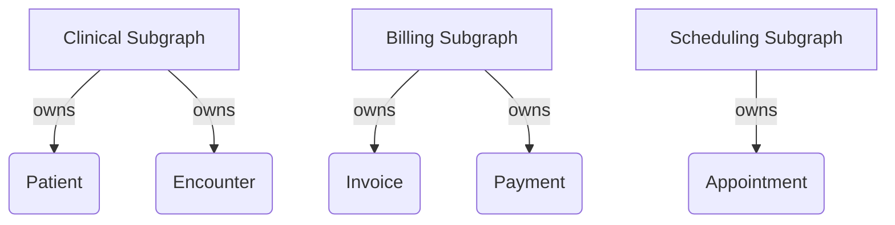
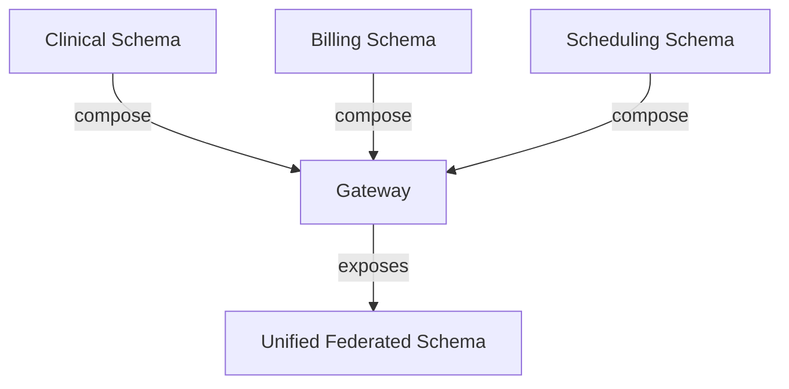
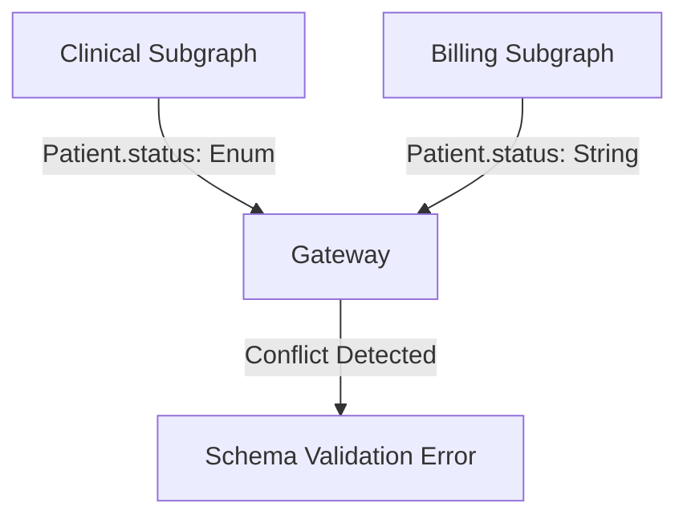

# Schema Federation Patterns

## Introduction

Schema federation is the foundation of a scalable, maintainable federated GraphQL architecture. It enables you to compose multiple independently developed subgraphs into a single, unified API while preserving clear domain boundaries and ownership. In healthcare, schema federation allows different teams—such as clinical, billing, and scheduling—to evolve their APIs independently without sacrificing interoperability or data consistency.

This guide provides practical patterns and implementation guidance for:
- Defining clear entity boundaries and ownership
- Resolving references across subgraphs
- Composing schemas and handling conflicts
- Evolving your federated graph safely

By applying these patterns, you can build a robust federated API that supports organizational growth and change while maintaining a seamless developer and consumer experience.

### Quick Start

1. Define clear entity boundaries based on domain contexts
2. Implement proper reference resolution between subgraphs
3. Establish schema composition strategies for your organization
4. Create processes for handling schema conflicts
5. Set up schema validation workflows

### Related Components

- [Creating Subgraphs](../02-core-functionality/creating-subgraphs.md): Learn the basics of subgraph implementation
- [Gateway Configuration](../02-core-functionality/gateway-configuration.md): Configure the gateway for schema federation
- [Schema Governance](../04-data-management/schema-governance.md): Manage schema evolution
- [Legacy Integration](../02-core-functionality/legacy-integration.md): Integrate legacy systems into your federated schema

## Entity Boundaries and Ownership

### Overview

Entity boundaries define which subgraph owns and manages specific types or entities in your federated graph. Clear boundaries are essential for domain-driven design, enabling teams to work independently while maintaining a cohesive API. In healthcare, this might mean the clinical team owns the `Patient` entity, while the billing team owns `Invoice` and `Payment`.

### Rationale

- **Decoupling**: Enables teams to iterate independently without cross-team bottlenecks.
- **Clear responsibility**: Each entity has a single source of truth, reducing ambiguity.
- **Scalability**: Supports organizational growth by aligning APIs with team structure.

### Implementation

#### Domain-Driven Subgraph Design

Organize subgraphs around business domains, with each subgraph owning its core entities.



#### Example: Defining Entity Ownership

In the clinical subgraph:

```graphql
type Patient @key(fields: "id") {
  id: ID!
  name: String!
  birthDate: String
  gender: String
}
```

In the billing subgraph, reference the `Patient` entity without redefining its fields:

```graphql
extend type Patient @key(fields: "id") {
  id: ID! @external
}
```

#### Ownership Best Practices

- Each entity is defined in one subgraph only (the owner).
- Other subgraphs use `extend type` and `@external` to reference entities they do not own.
- Entity keys (e.g., `id`) must be consistent across all subgraphs.

### Best Practices

- Align subgraph ownership with business domains and team responsibilities.
- Document ownership decisions in your schema or documentation.
- Use federation directives (`@key`, `@external`, `@requires`, `@provides`) to clearly express entity relationships.
- Review and update ownership as business domains evolve.


## Resolving References Across Subgraphs

### Overview

Reference resolution is how your federated graph fetches and joins data about an entity that spans multiple subgraphs. For example, a `Patient`'s core data may live in the clinical subgraph, while billing or scheduling subgraphs may extend the `Patient` type with additional fields. Reference resolution enables seamless queries across these boundaries.

### Rationale
- **Unified API**: Allows clients to query related data from multiple domains in a single request.
- **Separation of concerns**: Each subgraph implements only the logic relevant to its domain.
- **Performance**: Reference resolvers can optimize data fetching and batching.

### Implementation

#### Using the `@key` Directive
Define a unique key for each entity in the owning subgraph (e.g., `@key(fields: "id")`).

#### Extending and Resolving References
In subgraphs that extend an entity, implement a `__resolveReference` resolver to fetch the entity from your backend.

**Clinical subgraph (owner):**
```graphql
type Patient @key(fields: "id") {
  id: ID!
  name: String!
}
```

**Billing subgraph (extension):**
```graphql
extend type Patient @key(fields: "id") {
  id: ID! @external
  billingStatus: String
}
```

**Billing subgraph resolver:**
```javascript
const resolvers = {
  Patient: {
    // Called by the gateway to resolve a Patient reference
    __resolveReference(reference, { dataSources }) {
      // Fetch patient data from the billing system using the id
      return dataSources.billingAPI.getPatientBillingInfo(reference.id);
    },
  },
};
```

#### Diagram

```mermaid
graph TD
  A[Gateway] -->|Query| B[Clinical Subgraph]
  A -->|Reference| C[Billing Subgraph]
  B -->|Returns Patient (id)| A
  A -->|Resolves Reference| C
```

### Best Practices
- Use stable, unique keys for reference resolution (e.g., `id`, MRN).
- Keep reference resolvers efficient—batch and cache requests where possible.
- Document which subgraph owns each entity and which extend it.
- Test cross-subgraph queries to ensure references resolve as expected.


## Schema Composition Strategies

### Overview

Schema composition is the process of combining all subgraph schemas into a single federated graph schema. This enables clients to query data across domains as if it were a single API. Apollo Gateway (or similar tools) handles the composition process automatically, but your schema design choices directly affect how well this works.

### Rationale
- **Unified API surface**: Expose a single, coherent schema to clients.
- **Flexibility**: Allow subgraphs to evolve independently while supporting cross-domain queries.
- **Conflict avoidance**: Prevent naming and type conflicts during schema merging.

### Implementation

#### Entity Extension
Use `extend type` to add fields to entities owned by other subgraphs. Only the owning subgraph defines the core fields and key.

```graphql
# Clinical subgraph (owner)
type Patient @key(fields: "id") {
  id: ID!
  name: String!
}

# Billing subgraph (extension)
extend type Patient @key(fields: "id") {
  id: ID! @external
  billingStatus: String
}
```

#### Interfaces and Unions
Use interfaces or union types to support polymorphic relationships across subgraphs.

```graphql
# Shared interface
type Practitioner @key(fields: "id") {
  id: ID!
  name: String!
}

interface Resource {
  id: ID!
}

# Subgraphs can implement or extend the interface
type Patient implements Resource @key(fields: "id") {
  id: ID!
  name: String!
}
```

#### Handling Naming Conflicts
- Use clear, domain-specific naming for types and fields.
- Avoid redefining types or fields with different meanings in multiple subgraphs.
- Reserve shared types (e.g., enums, scalars) for a designated subgraph or shared library.

#### Diagram



### Best Practices
- Regularly validate schema composition using Apollo Gateway or similar tools.
- Automate schema checks in your CI/CD pipeline to catch conflicts early.
- Document shared types and ownership to prevent accidental duplication.
- Use federation directives consistently to clarify relationships.


## Handling Schema Conflicts

### Overview

Schema conflicts can occur when multiple subgraphs define overlapping types, fields, or enums, or when federation directives are misapplied. Proactively identifying and resolving these conflicts is essential for maintaining a stable, predictable federated graph.

### Rationale
- **Reliability**: Prevent runtime errors and schema composition failures.
- **Clarity**: Ensure the unified schema is unambiguous and easy for consumers to understand.
- **Team productivity**: Reduce bottlenecks and rework caused by conflicting changes.

### Implementation Guidance

#### Types of Schema Conflicts
- **Type redefinition**: Two subgraphs define the same type differently.
- **Field conflicts**: Fields with the same name but different types or semantics.
- **Enum/Scalar conflicts**: Overlapping enum or scalar definitions.
- **Directive misuse**: Incorrect or inconsistent use of federation directives.

#### Conflict Detection
- Use Apollo Gateway's schema validation to detect conflicts at composition time.
- Integrate schema checks into your CI/CD pipeline to catch issues before deployment.

#### Conflict Resolution Strategies
- **Single source of truth**: Designate one subgraph as the owner of each type or shared enum/scalar.
- **Refactor or rename**: Rename conflicting types/fields to clarify intent and avoid overlap.
- **Shared libraries**: Use a shared schema library for common types, enums, and scalars.
- **Federation directives**: Use `@external`, `@requires`, and `@provides` to clarify field ownership and dependencies.

#### Example: Resolving a Field Conflict

Suppose two subgraphs define a `status` field on `Patient`, but with different types:

- Clinical subgraph: `status: PatientStatusEnum`
- Billing subgraph: `status: String`

**Resolution:**
- Agree on a single definition and update both subgraphs, or
- Rename one field (e.g., `clinicalStatus`, `billingStatus`) to clarify domain context.

#### Diagram



### Best Practices
- Document ownership and shared types to avoid accidental overlap.
- Use schema validation tools in your development workflow.
- Communicate and coordinate changes to shared types across teams.
- Review schema changes collaboratively before merging to main.


## Conclusion

Schema federation empowers organizations to scale their GraphQL architecture, align APIs with business domains, and enable independent team development while delivering a unified API to consumers. By applying the patterns in this guide—defining clear entity boundaries, resolving references, composing schemas thoughtfully, and proactively handling conflicts—you can build a robust, maintainable federated graph.

**Key takeaways:**
- Assign clear ownership for every entity and shared type.
- Use federation directives (`@key`, `@external`, etc.) consistently and document relationships.
- Validate and test schema composition as part of your CI/CD workflow.
- Collaborate across teams to coordinate changes and resolve conflicts early.

Continue to evolve your schema federation strategy as your organization grows, and revisit ownership, composition, and governance practices regularly to ensure long-term success.

