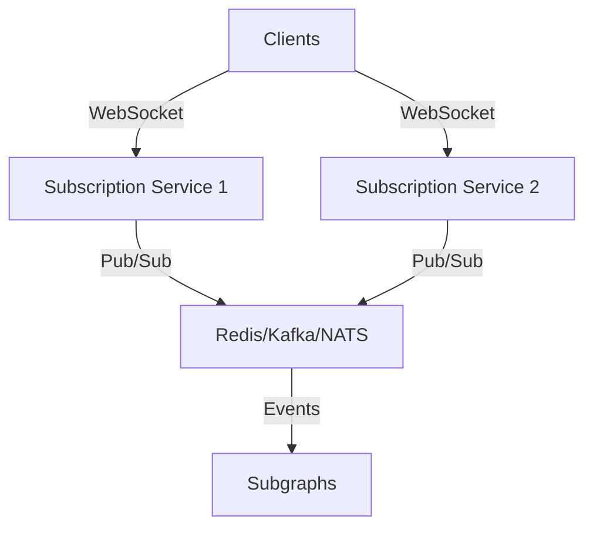

# Subscriptions

## Introduction

Subscriptions enable real-time data updates in GraphQL applications, a critical feature for healthcare systems that need to respond to events like patient monitoring or status changes. This guide explains how to implement and optimize GraphQL subscriptions in a federated architecture, covering WebSocket implementation, subscription event filtering, and scaling considerations. By properly implementing subscriptions, you can create responsive, real-time healthcare applications.

### Quick Start

1. Understand the limitations of subscriptions in federation
2. Implement a subscription service alongside your federated graph
3. Set up WebSocket connections for subscription delivery
4. Implement filtering to limit subscription events
5. Plan for scaling your subscription infrastructure

### Related Components

- [Querying the Federated Graph](../02-core-functionality/querying.md): Learn about basic query patterns
- [Gateway Configuration](../02-core-functionality/gateway-configuration.md): Configure the gateway for subscriptions
- [Event Processing](../02-core-functionality/event-processing.md): Process events that trigger subscriptions
- [Scaling](../05-operations/scaling.md): Scale your subscription infrastructure

## Real-Time Data Updates

### Overview

Real-time data is critical in healthcare applications for scenarios such as patient monitoring, appointment status updates, and clinical alerts. GraphQL subscriptions enable clients to receive live updates from the server whenever relevant data changes, improving responsiveness and user experience.

### Rationale
- **Immediate notification**: Alert clinicians to critical events (e.g., abnormal vital signs) as they happen.
- **Workflow efficiency**: Update dashboards, queues, or patient lists in real time without polling.
- **Patient engagement**: Support live chat, telemedicine, and patient-facing notifications.

### Implementation Guidance
- Use GraphQL subscriptions to push updates to clients over WebSocket connections.
- Design your schema to expose subscription fields for key events (e.g., `vitalSignChanged`, `appointmentStatusUpdated`).
- Ensure backend systems publish events to the subscription layer when data changes.

### Healthcare Example
```graphql
subscription OnVitalSignChanged($patientId: ID!) {
  vitalSignChanged(patientId: $patientId) {
    type
    value
    unit
    timestamp
  }
}
```

With this subscription, a monitoring dashboard receives new vital sign measurements for a patient in real time, enabling proactive care and rapid intervention.


## WebSocket Implementation

### Overview

GraphQL subscriptions are typically delivered over WebSocket connections, enabling persistent, bidirectional communication between clients and the server. In a federated architecture, subscriptions are usually handled by a dedicated service that sits alongside the gateway and subgraphs.

### Rationale
- **Low latency**: WebSockets provide immediate delivery of events without polling.
- **Scalability**: Decouple subscription delivery from core query/mutation traffic.
- **Interoperability**: Support standard GraphQL subscription protocols (e.g., `graphql-ws`).

### Implementation Steps
1. Deploy a subscription server (e.g., Apollo Server, graphql-ws, or a custom Node.js service) that listens for WebSocket connections.
2. Connect the subscription server to your event bus or backend (e.g., Redis Pub/Sub, Kafka, or direct hooks from subgraphs).
3. Configure the gateway to route subscription traffic to the subscription server.
4. Ensure subgraphs publish relevant events to the subscription layer.

### Example: Apollo Server Subscription Setup
```javascript
const { ApolloServer, gql, PubSub } = require('apollo-server');
const pubsub = new PubSub();

const typeDefs = gql`
  type VitalSign {
    type: String!
    value: Float!
    unit: String!
    timestamp: String!
  }
  type Subscription {
    vitalSignChanged(patientId: ID!): VitalSign!
  }
`;

const resolvers = {
  Subscription: {
    vitalSignChanged: {
      subscribe: (_, { patientId }) => pubsub.asyncIterator(`VITAL_SIGN_${patientId}`)
    }
  }
};

const server = new ApolloServer({ typeDefs, resolvers });
server.listen().then(({ url, subscriptionsUrl }) => {
  console.log(`🚀 Server ready at ${url}`);
  console.log(`🚀 Subscriptions ready at ${subscriptionsUrl}`);
});
```

### Best Practices
- Use a dedicated subscription service for scalability and maintainability.
- Secure WebSocket connections with authentication (e.g., JWT in connection params).
- Monitor connection health and implement reconnection logic on the client side.
- Use a message broker (e.g., Redis, Kafka) for horizontal scaling and event fan-out.


## Filtering Subscription Events

### Overview

Filtering subscription events ensures that clients only receive updates relevant to their context, reducing unnecessary network traffic and improving user experience. In healthcare, this might mean delivering only patient-specific updates to the right clinicians or devices.

### Rationale
- **Efficiency**: Reduce bandwidth and processing by sending only necessary events to each client.
- **Security**: Prevent information leakage by restricting access to sensitive updates.
- **Scalability**: Support large numbers of clients with targeted event delivery.

### Implementation Guidance
- Filter events at the resolver level using arguments (e.g., `patientId`, `userId`).
- Use topic naming conventions or message broker features to route events to the correct subscribers.
- Implement authorization checks before delivering events to clients.

### Example: Resolver-Level Filtering
```javascript
const resolvers = {
  Subscription: {
    vitalSignChanged: {
      subscribe: (_, { patientId }, { pubsub, user }) => {
        // Authorization: ensure user can access this patient's data
        if (!user.canAccessPatient(patientId)) {
          throw new Error('Unauthorized');
        }
        // Subscribe to events for the specific patient
        return pubsub.asyncIterator(`VITAL_SIGN_${patientId}`);
      }
    }
  }
};
```

### Example: Topic-Based Filtering with Redis Pub/Sub
```javascript
// Publisher: publish to patient-specific channel
redis.publish(`VITAL_SIGN_${patientId}`, eventData);

// Subscriber: listen to only relevant channels
pubsub.asyncIterator([`VITAL_SIGN_${patientId}`]);
```

### Best Practices
- Always validate authorization for each subscription event.
- Use fine-grained topics or channels for event routing.
- Document filtering logic in your schema and API docs.
- Test for edge cases, such as subscribing to multiple patients or roles.


## Scaling Considerations

### Overview

Scaling GraphQL subscriptions in a federated architecture presents unique challenges due to the need for persistent connections, event fan-out, and coordination across multiple services. Healthcare use cases—such as monitoring thousands of patients in real time—require robust, scalable solutions.

### Rationale
- **High concurrency**: Support many simultaneous client connections.
- **Reliability**: Ensure events are delivered even as infrastructure scales horizontally.
- **Performance**: Minimize latency and resource usage.

### Implementation Guidance
- Use a dedicated subscription service that can scale independently from the gateway and subgraphs.
- Employ a message broker (e.g., Redis Pub/Sub, Kafka, NATS) to distribute events across multiple subscription server instances.
- Implement sticky sessions or connection affinity if required by your subscription protocol.
- Monitor resource usage (CPU, memory, open sockets) and autoscale as needed.

### Example: Scalable Subscription Architecture


### Example: Horizontal Scaling with Redis
```javascript
const { RedisPubSub } = require('graphql-redis-subscriptions');
const pubsub = new RedisPubSub({
  connection: {
    host: process.env.REDIS_HOST,
    port: 6379,
    retryStrategy: times => Math.min(times * 50, 2000)
  }
});

// Use pubsub in your resolvers as before
```

### Best Practices
- Use a scalable message broker for event delivery across multiple nodes.
- Monitor and autoscale subscription servers based on connection and event volume.
- Implement connection limits and graceful degradation for overload scenarios.
- Document scaling strategies and test under load to ensure reliability.


## Conclusion

GraphQL subscriptions unlock real-time capabilities for healthcare applications, enabling immediate notifications, live dashboards, and improved patient engagement. Implementing subscriptions in a federated architecture requires careful planning for event delivery, filtering, security, and scaling.

**Key takeaways:**
- Use WebSocket-based subscription services for efficient event delivery.
- Filter events and enforce authorization to ensure privacy and relevance.
- Employ scalable message brokers and autoscaling techniques for reliability.
- Test and monitor your subscription infrastructure to ensure a robust, responsive experience.

Continue to evolve your subscription architecture as your needs grow, and revisit your filtering, scaling, and security strategies regularly to maintain high-quality real-time data delivery.

