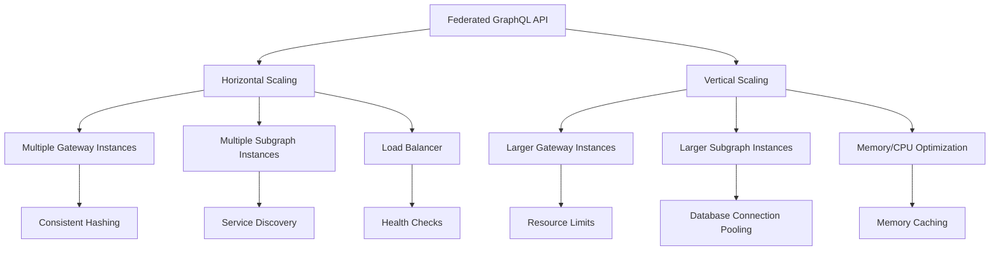

# Scaling Strategies

## Introduction

Scaling your Federated Graph API is essential for handling increasing load while maintaining performance. This guide explains strategies for scaling your GraphQL infrastructure, covering horizontal and vertical scaling approaches, subgraph independent scaling, gateway scaling, and load balancing techniques. By implementing these scaling strategies, you can ensure your API remains responsive and reliable even during periods of high demand.

## Scaling Insights with Apollo GraphOS

Apollo GraphOS provides critical insights and analytics to inform your scaling strategies for federated GraphQL APIs. By leveraging GraphOS, you can:
- Monitor query and mutation volume across gateway and subgraphs
- Analyze peak usage times and traffic patterns
- Track subgraph health, error rates, and performance bottlenecks
- Use operational dashboards to inform horizontal/vertical scaling decisions
- Set up alerts for resource saturation or degraded service

### Example: Using GraphOS Analytics for Scaling
- Review the GraphOS Operations dashboard to identify high-traffic subgraphs and peak usage windows.
- Use field-level analytics to pinpoint resource-intensive operations or endpoints.
- Set up alerts for high error rates or slow response times that may indicate the need for scaling.
- Analyze historical usage trends to plan for capacity increases or load balancing.

### Best Practices
- Use GraphOS dashboards as the source of truth for scaling and capacity planning.
- Scale subgraphs independently based on observed traffic and bottlenecks.
- Regularly review health metrics and operational alerts to proactively address scaling needs.
- Document scaling decisions and monitor post-scaling impact using GraphOS analytics.

Reference: [Apollo GraphOS Operations and Scaling](https://www.apollographql.com/docs/graphos/metrics/)

---

### Quick Start

1. Understand the scaling characteristics of your API
2. Implement horizontal scaling for stateless components
3. Configure independent scaling for subgraphs based on their load patterns
4. Set up gateway scaling with proper load balancing
5. Monitor performance to identify scaling needs

### Related Components

- [Gateway Configuration](../02-core-functionality/gateway-configuration.md): Configure the gateway for scaling
- [Performance Tuning](performance-tuning.md): Optimize performance before scaling
- [Monitoring](monitoring.md): Monitor metrics to inform scaling decisions
- [Deployment](deployment.md): Automate scaling as part of deployment

## Horizontal vs. Vertical Scaling

*This section will compare horizontal and vertical scaling approaches for GraphQL infrastructure, including when to use each approach.*



## Subgraph Independent Scaling

*This section will explain how to scale individual subgraphs independently based on their specific load patterns and resource requirements.*

```yaml
# Example: Kubernetes HPA configuration for a subgraph
apiVersion: autoscaling/v2beta2
kind: HorizontalPodAutoscaler
metadata:
  name: patient-subgraph-hpa
  namespace: graphql
spec:
  scaleTargetRef:
    apiVersion: apps/v1
    kind: Deployment
    name: patient-subgraph
  minReplicas: 2
  maxReplicas: 10
  metrics:
  - type: Resource
    resource:
      name: cpu
      target:
        type: Utilization
        averageUtilization: 70
  - type: Resource
    resource:
      name: memory
      target:
        type: Utilization
        averageUtilization: 80
  - type: Pods
    pods:
      metric:
        name: requests_per_second
      target:
        type: AverageValue
        averageValue: 1000
  behavior:
    scaleUp:
      stabilizationWindowSeconds: 60
      policies:
      - type: Percent
        value: 100
        periodSeconds: 15
    scaleDown:
      stabilizationWindowSeconds: 300
      policies:
      - type: Percent
        value: 50
        periodSeconds: 60
```

## Gateway Scaling

*This section will cover strategies for scaling the Apollo Gateway, including stateless configuration, caching considerations, and handling persistent connections.*

## Load Balancing Approaches

*This section will explain different load balancing techniques for GraphQL APIs, including round-robin, least connections, and consistent hashing.*

```typescript
// Example: Setting up a load-balanced Apollo Gateway with PM2
// ecosystem.config.js
module.exports = {
  apps: [{
    name: 'apollo-gateway',
    script: './gateway.js',
    instances: 'max',  // Use maximum number of CPU cores
    exec_mode: 'cluster',  // Run in cluster mode for load balancing
    env: {
      NODE_ENV: 'production',
      PORT: 4000
    },
    // Configure PM2 to restart instances if they use too much memory
    max_memory_restart: '1G',
    // Configure health checks
    exp_backoff_restart_delay: 100,
    // Configure instance metrics
    instance_var: 'INSTANCE_ID',
    // Configure log rotation
    log_date_format: 'YYYY-MM-DD HH:mm:ss',
    // Configure graceful shutdown
    kill_timeout: 5000,
    // Configure startup delay between instances
    wait_ready: true,
    listen_timeout: 50000
  }]
};

// gateway.js
const { ApolloServer } = require('apollo-server');
const { ApolloGateway } = require('@apollo/gateway');

// Initialize the gateway
const gateway = new ApolloGateway({
  serviceList: [
    // Your services here
  ],
});

// Initialize the Apollo Server
const server = new ApolloServer({
  gateway,
  subscriptions: false,
});

// Start the server
server.listen({ port: process.env.PORT || 4000 }).then(({ url }) => {
  console.log(`ud83dude80 Gateway instance ${process.env.INSTANCE_ID} ready at ${url}`);
  // Signal to PM2 that the instance is ready
  if (process.send) {
    process.send('ready');
  }
});

// Handle graceful shutdown
process.on('SIGINT', () => {
  console.log('Shutting down gateway instance', process.env.INSTANCE_ID);
  server.stop().then(() => {
    console.log('Gateway instance stopped');
    process.exit(0);
  });
});
```

## Conclusion

*This document will be completed in a future update with comprehensive guidance on scaling strategies for a federated GraphQL architecture.*
