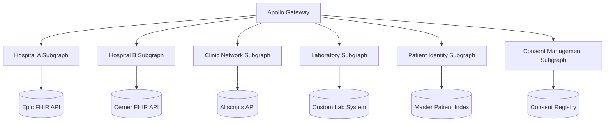

# Modernization Case Studies

## Introduction

Real-world case studies provide valuable insights into how organizations have successfully implemented Federated Graph APIs to modernize their healthcare systems. This guide presents several case studies that highlight different aspects of GraphQL implementation, including healthcare data integration, API consolidation, performance improvements, and developer productivity gains. By examining these real-world examples, you can gain practical insights to inform your own GraphQL implementation strategy.

### Quick Start

1. Review the healthcare data integration case study for interoperability insights
2. Examine the API consolidation case study for architectural guidance
3. Study the performance improvement case study for optimization techniques
4. Explore the developer productivity case study for team organization strategies
5. Consider how these lessons apply to your specific context

### Related Components

- [Federated Graph API Overview](../01-getting-started/overview.md): Understand the overall architecture
- [Benefits Overview](../01-getting-started/benefits-overview.md): Learn about the benefits of federation
- [GraphQL vs REST](../01-getting-started/graphql-vs-rest.md): Compare different API approaches
- [Legacy Integration](../02-core-functionality/legacy-integration.md): Integrate legacy systems into your graph

## Healthcare Data Integration Example

### Case Study: Regional Health Information Exchange

A regional health information exchange (HIE) implemented a Federated Graph API to integrate data from multiple healthcare providers, including hospitals, clinics, and laboratories.

#### Background

- The HIE needed to integrate data from 12 different healthcare organizations
- Each organization had different systems, including Epic, Cerner, Allscripts, and custom solutions
- Data needed to be accessible in real-time for care coordination
- Privacy and security requirements were stringent

#### Solution

The HIE implemented a Federated Graph API with the following components:

- A central Apollo Gateway for routing queries
- Separate subgraphs for each healthcare organization
- A patient identity resolution subgraph for cross-organization patient matching
- A consent management subgraph for enforcing privacy rules

#### Implementation Details



#### Results

- **Unified Access**: Clinicians could access patient data from all 12 organizations through a single API
- **Real-Time Data**: Data was available in real-time, eliminating delays in care coordination
- **Reduced Integration Costs**: New organizations could be added to the network with minimal effort
- **Improved Security**: Fine-grained access control ensured data was only accessible to authorized users
- **Enhanced Patient Matching**: The patient identity resolution subgraph improved match rates by 35%

## API Consolidation Success Story

### Case Study: National Pharmacy Benefits Manager

A national pharmacy benefits manager (PBM) used a Federated Graph API to consolidate multiple legacy APIs into a unified interface for healthcare partners.

#### Background

- The PBM had accumulated over 30 different APIs through acquisitions and organic growth
- Partners had to integrate with multiple APIs to access complete functionality
- Documentation was inconsistent and often outdated
- Development teams were siloed by domain

#### Solution

The PBM implemented a Federated Graph API with the following approach:

- Domain-aligned subgraphs for claims, formulary, prior authorization, and member services
- Gradual migration from legacy APIs to GraphQL subgraphs
- Unified documentation and developer portal
- Cross-functional teams organized around domains

#### Implementation Details

```typescript
// Example: Schema stitching across domains
// Prior Authorization Subgraph
const paTypeDefs = gql`
  type PriorAuthorization @key(fields: "id") {
    id: ID!
    status: PAStatus!
    createdAt: DateTime!
    updatedAt: DateTime
    expiresAt: DateTime
    drugId: ID!
    memberId: ID!
    providerId: ID!
    clinicalCriteria: [ClinicalCriterion!]!
    documents: [Document!]!
  }
  
  enum PAStatus {
    PENDING
    APPROVED
    DENIED
    CANCELLED
    EXPIRED
  }
  
  # Additional types...
`;

// Claims Subgraph
const claimsTypeDefs = gql`
  type Claim @key(fields: "id") {
    id: ID!
    status: ClaimStatus!
    submittedAt: DateTime!
    processedAt: DateTime
    memberId: ID!
    providerId: ID!
    pharmacy: Pharmacy!
    drug: Drug!
    priorAuthorization: PriorAuthorization
  }
  
  # We need to extend PriorAuthorization to reference it from Claims
  extend type PriorAuthorization @key(fields: "id") {
    id: ID!
    # We only need the ID field for the reference
  }
  
  # Additional types...
`;

// Member Subgraph
const memberTypeDefs = gql`
  type Member @key(fields: "id") {
    id: ID!
    firstName: String!
    lastName: String!
    dateOfBirth: Date!
    gender: Gender
    contact: ContactInfo!
    coverage: Coverage!
    claims: [Claim!]!
    priorAuthorizations: [PriorAuthorization!]!
  }
  
  # We need to extend both Claim and PriorAuthorization
  extend type Claim @key(fields: "id") {
    id: ID!
  }
  
  extend type PriorAuthorization @key(fields: "id") {
    id: ID!
  }
  
  # Additional types...
`;
```

#### Results

- **Simplified Integration**: Partners could integrate with a single API instead of 30+ separate APIs
- **Improved Developer Experience**: Consistent documentation and tooling increased developer productivity
- **Reduced Maintenance Costs**: Consolidated APIs reduced the maintenance burden by 60%
- **Faster Time-to-Market**: New features could be added without breaking existing integrations
- **Better Collaboration**: Cross-functional teams improved collaboration and reduced silos

## Performance Improvements

### Case Study: Telemedicine Platform

A telemedicine platform implemented a Federated Graph API to improve performance and reduce latency for their patient-facing applications.

#### Background

- The platform was experiencing performance issues during peak usage
- Mobile applications were slow due to multiple API calls
- Network latency was a significant issue for rural users
- Backend services were becoming overloaded

#### Solution

The platform implemented a Federated Graph API with the following optimizations:

- Query batching and deduplication at the gateway level
- Intelligent caching with varying TTLs based on data type
- Partial results to prioritize critical data
- Query complexity analysis to prevent resource-intensive queries

#### Implementation Details

```typescript
// Example: Implementing caching with Apollo Server
const { ApolloServer } = require('apollo-server');
const { ApolloGateway } = require('@apollo/gateway');
const { RedisCache } = require('apollo-server-cache-redis');

// Initialize the gateway
const gateway = new ApolloGateway({
  serviceList: [
    // Service list...
  ],
});

// Initialize the Apollo Server with caching
const server = new ApolloServer({
  gateway,
  subscriptions: false,
  cache: new RedisCache({
    host: 'redis-cache.example.com',
    port: 6379,
    password: process.env.REDIS_PASSWORD,
  }),
  cacheControl: {
    defaultMaxAge: 60, // 1 minute default cache
    calculateHttpHeaders: true,
  },
  formatResponse: (response, requestContext) => {
    // Add cache headers based on data type
    if (response.data?.patient) {
      // Patient demographic data can be cached longer
      requestContext.overwriteResponseHeaders['cache-control'] = 'max-age=300';
    } else if (response.data?.appointment) {
      // Appointment data should have shorter cache
      requestContext.overwriteResponseHeaders['cache-control'] = 'max-age=60';
    } else if (response.data?.vitalSigns) {
      // Vital signs should not be cached
      requestContext.overwriteResponseHeaders['cache-control'] = 'no-store';
    }
    return response;
  },
});
```

#### Results

- **Reduced Latency**: Average API response time decreased by 65%
- **Bandwidth Savings**: Mobile data usage reduced by 70% through precise data fetching
- **Improved Reliability**: Backend service load reduced by 50% during peak hours
- **Better User Experience**: Application performance improved significantly, especially for rural users
- **Increased Capacity**: The platform could handle 3x more concurrent users with the same infrastructure

## Developer Productivity Gains

### Case Study: Healthcare Analytics Company

A healthcare analytics company implemented a Federated Graph API to improve developer productivity and accelerate feature delivery.

#### Background

- The company had 15 development teams working on different parts of the platform
- Teams were blocked waiting for API changes from other teams
- Frontend and backend development was tightly coupled
- Documentation was often out of date

#### Solution

The company implemented a Federated Graph API with the following approach:

- Domain-aligned subgraphs owned by individual teams
- Schema-first development with automated validation
- GraphQL Code Generator for type-safe client code
- Collaborative schema design process

#### Implementation Details

```bash
# Example: CI/CD pipeline for schema validation

# 1. Extract schema from subgraph
npx rover subgraph introspect http://localhost:4001/graphql > schema.graphql

# 2. Check if schema is valid against the federated graph
npx rover subgraph check healthcare-federation@prod \
  --name analytics-subgraph \
  --schema ./schema.graphql

# 3. If valid, publish the schema
if [ $? -eq 0 ]; then
  npx rover subgraph publish healthcare-federation@prod \
    --name analytics-subgraph \
    --schema ./schema.graphql
  
  # 4. Generate TypeScript types for the client
  npx graphql-codegen --config codegen.yml
  
  # 5. Deploy the subgraph
  kubectl apply -f k8s/deployment.yaml
else
  echo "Schema validation failed. Please fix the errors and try again."
  exit 1
fi
```

#### Results

- **Faster Feature Delivery**: Teams could develop and deploy independently, reducing time-to-market by 40%
- **Reduced Coordination Overhead**: Teams no longer needed to coordinate API changes, saving 15+ hours per week
- **Improved Code Quality**: Type-safe client code reduced bugs by 30%
- **Better Documentation**: Self-documenting schema with enforced descriptions improved documentation quality
- **Enhanced Collaboration**: Schema design process improved collaboration between frontend and backend teams

## Conclusion

These case studies demonstrate the real-world benefits of implementing a Federated Graph API in healthcare environments. By learning from these examples, you can identify strategies and approaches that may be applicable to your own organization's modernization efforts.

Key takeaways from these case studies include:

1. **Domain-Aligned Architecture**: Organizing subgraphs around business domains improves maintainability and team autonomy
2. **Incremental Migration**: Gradually migrating from legacy APIs to GraphQL reduces risk and disruption
3. **Performance Optimization**: Implementing proper caching, batching, and query optimization is essential for performance
4. **Developer Experience**: Investing in tooling, documentation, and processes significantly improves developer productivity
5. **Cross-Functional Collaboration**: Breaking down silos between teams leads to better outcomes

As you plan your own GraphQL implementation, consider how these lessons can be applied to your specific context and requirements.
