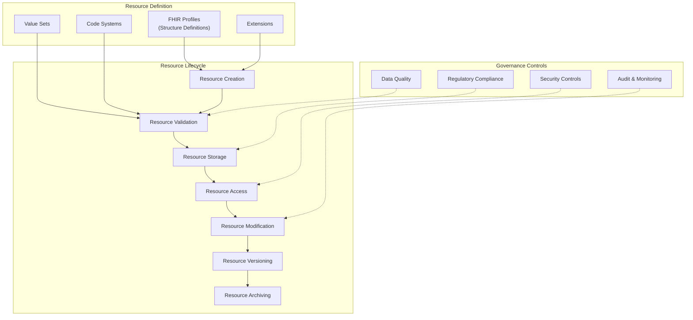

# FHIR Resource Governance

## Overview

FHIR Resource Governance establishes policies, procedures, and controls for managing FHIR resources throughout their lifecycle. This document outlines the framework for ensuring data quality, consistency, and compliance across the FHIR Interoperability Platform, enabling healthcare organizations to maintain trusted clinical data while meeting regulatory requirements.

## Resource Governance Framework

The FHIR Resource Governance framework provides a structured approach to managing healthcare data represented as FHIR resources:



## Resource Definition Governance

### Profile Management

FHIR profiles (StructureDefinitions) define constraints on resources and must be governed carefully:

1. **Profile Registry**: All profiles must be registered in a central repository
2. **Profile Approval Process**: New profiles require formal review and approval
3. **Profile Versioning**: Profiles follow semantic versioning (MAJOR.MINOR.PATCH)
4. **Profile Documentation**: All profiles must include purpose, constraints, and usage examples

```json
// Example Profile Registry Entry
{
  "profileId": "us-core-patient",
  "canonicalUrl": "http://hl7.org/fhir/us/core/StructureDefinition/us-core-patient",
  "version": "3.1.1",
  "status": "active",
  "baseResource": "Patient",
  "description": "US Core Patient Profile",
  "implementationGuide": "US Core",
  "owningTeam": "Clinical Data Standards",
  "approvedBy": "FHIR Governance Committee",
  "approvalDate": "2023-06-15",
  "reviewDate": "2024-06-15",
  "usageContext": ["Clinical", "Administrative"],
  "dependencies": [
    "http://hl7.org/fhir/us/core/StructureDefinition/us-core-race",
    "http://hl7.org/fhir/us/core/StructureDefinition/us-core-ethnicity"
  ]
}
```

### Extension Governance

Extensions allow for additional data elements and must follow these governance rules:

1. **Extension Justification**: All extensions require business justification
2. **Extension Reuse**: Prefer existing extensions over creating new ones
3. **Extension Documentation**: All extensions must be fully documented
4. **Extension Approval**: Extensions require approval before implementation

```json
// Example Extension Registry Entry
{
  "extensionId": "patient-birthplace",
  "canonicalUrl": "http://hl7.org/fhir/StructureDefinition/patient-birthPlace",
  "version": "1.0.0",
  "status": "active",
  "context": "Patient.extension",
  "type": "Address",
  "description": "The registered place of birth of the patient",
  "justification": "Required for identity verification and demographic reporting",
  "owningTeam": "Patient Demographics",
  "approvedBy": "FHIR Governance Committee",
  "approvalDate": "2023-04-10",
  "reviewDate": "2024-04-10"
}
```

### Terminology Governance

Value sets and code systems require strict governance:

1. **Terminology Authority**: Designated team responsible for terminology management
2. **Preferred Code Systems**: Prioritize standard code systems (SNOMED CT, LOINC, RxNorm)
3. **Custom Code Systems**: Custom code systems require formal approval
4. **Value Set Binding Strength**: Define appropriate binding strength (required, extensible, preferred)

```json
// Example Value Set Registry Entry
{
  "valueSetId": "condition-clinical",
  "canonicalUrl": "http://terminology.hl7.org/ValueSet/condition-clinical",
  "version": "4.0.1",
  "status": "active",
  "description": "Condition Clinical Status Codes",
  "purpose": "Used to track the clinical status of a condition",
  "codeSystem": "http://terminology.hl7.org/CodeSystem/condition-clinical",
  "bindingStrength": "required",
  "owningTeam": "Clinical Terminology",
  "approvedBy": "Terminology Governance Committee",
  "approvalDate": "2023-02-20",
  "reviewDate": "2024-02-20"
}
```

## Resource Lifecycle Governance

### Resource Creation Policies

Resource creation must follow these governance rules:

1. **Profile Conformance**: Resources must conform to approved profiles
2. **Required Elements**: All required elements must be populated
3. **Identifier Management**: Identifiers must follow established patterns
4. **Reference Integrity**: References must point to existing resources

```java
// Example Resource Creation with Governance Checks
public MethodOutcome createPatient(Patient patient, RequestDetails requestDetails) {
    // Check authorization
    if (!authorizationService.canCreate(requestDetails, "Patient")) {
        throw new ForbiddenOperationException("Not authorized to create Patient resources");
    }
    
    // Apply default profile if none specified
    if (!hasProfile(patient)) {
        patient.getMeta().addProfile("http://hl7.org/fhir/us/core/StructureDefinition/us-core-patient");
    }
    
    // Validate against profile
    ValidationResult validationResult = fhirValidator.validateWithResult(patient);
    if (!validationResult.isSuccessful()) {
        throw new UnprocessableEntityException("Resource does not conform to profile", validationResult);
    }
    
    // Check identifier system and value
    boolean hasValidIdentifier = false;
    for (Identifier identifier : patient.getIdentifier()) {
        if (identifierService.isValidIdentifier(identifier)) {
            hasValidIdentifier = true;
            break;
        }
    }
    
    if (!hasValidIdentifier) {
        throw new UnprocessableEntityException("Patient must have at least one valid identifier");
    }
    
    // Set metadata
    patient.getMeta().setLastUpdated(new Date());
    patient.getMeta().addSecurity().setSystem("http://terminology.hl7.org/CodeSystem/v3-Confidentiality")
        .setCode("N").setDisplay("normal");
    
    // Create resource
    MethodOutcome outcome = resourceDao.create(patient);
    
    // Audit creation
    auditService.logResourceCreation(requestDetails, outcome.getId());
    
    return outcome;
}
```

### Resource Validation Rules

All resources must be validated against these criteria:

1. **Structural Validation**: Conform to FHIR specification and profiles
2. **Business Rule Validation**: Comply with business-specific rules
3. **Terminology Validation**: Use valid codes from bound value sets
4. **Reference Validation**: Ensure all references are valid

```xml
<!-- Example Validation Profile with Business Rules -->
<StructureDefinition xmlns="http://hl7.org/fhir">
  <id value="organization-profile"/>
  <url value="http://example.org/fhir/StructureDefinition/organization-profile"/>
  <name value="OrganizationProfile"/>
  <status value="active"/>
  <description value="Profile for Organization resources"/>
  <fhirVersion value="4.0.1"/>
  <kind value="resource"/>
  <abstract value="false"/>
  <type value="Organization"/>
  <baseDefinition value="http://hl7.org/fhir/StructureDefinition/Organization"/>
  <derivation value="constraint"/>
  <differential>
    <element id="Organization">
      <path value="Organization"/>
      <constraint>
        <key value="org-1"/>
        <severity value="error"/>
        <human value="Organization must have at least one identifier"/>
        <expression value="identifier.exists()"/>
      </constraint>
      <constraint>
        <key value="org-2"/>
        <severity value="error"/>
        <human value="Organization must have a name"/>
        <expression value="name.exists()"/>
      </constraint>
      <constraint>
        <key value="org-3"/>
        <severity value="warning"/>
        <human value="Organization should have a contact phone or email"/>
        <expression value="telecom.where(system='phone' or system='email').exists()"/>
      </constraint>
    </element>
    <element id="Organization.identifier">
      <path value="Organization.identifier"/>
      <slicing>
        <discriminator>
          <type value="value"/>
          <path value="system"/>
        </discriminator>
        <rules value="open"/>
      </slicing>
      <min value="1"/>
    </element>
    <element id="Organization.identifier:NPI">
      <path value="Organization.identifier"/>
      <sliceName value="NPI"/>
      <min value="0"/>
      <max value="1"/>
      <type>
        <code value="Identifier"/>
      </type>
    </element>
    <element id="Organization.identifier:NPI.system">
      <path value="Organization.identifier.system"/>
      <min value="1"/>
      <fixedUri value="http://hl7.org/fhir/sid/us-npi"/>
    </element>
    <element id="Organization.identifier:NPI.value">
      <path value="Organization.identifier.value"/>
      <min value="1"/>
    </element>
  </differential>
</StructureDefinition>
```

### Resource Versioning Policies

Resource versioning must follow these rules:

1. **Version Tracking**: All changes create a new version
2. **Version History**: Maintain complete version history
3. **Version Metadata**: Each version includes who, when, and why
4. **Version Retrieval**: Support retrieval of specific versions

```http
# Example Version History Retrieval
GET /fhir/Patient/123/_history

# Response
{
  "resourceType": "Bundle",
  "type": "history",
  "total": 3,
  "entry": [
    {
      "resource": {
        "resourceType": "Patient",
        "id": "123",
        "meta": {
          "versionId": "3",
          "lastUpdated": "2024-03-15T14:30:22.123+00:00"
        },
        "name": [
          {
            "family": "Smith",
            "given": ["John", "Jacob"]
          }
        ]
      },
      "request": {
        "method": "PUT",
        "url": "Patient/123"
      }
    },
    {
      "resource": {
        "resourceType": "Patient",
        "id": "123",
        "meta": {
          "versionId": "2",
          "lastUpdated": "2024-02-10T09:15:47.456+00:00"
        },
        "name": [
          {
            "family": "Smith",
            "given": ["John"]
          }
        ]
      },
      "request": {
        "method": "PUT",
        "url": "Patient/123"
      }
    },
    {
      "resource": {
        "resourceType": "Patient",
        "id": "123",
        "meta": {
          "versionId": "1",
          "lastUpdated": "2024-01-05T11:42:33.789+00:00"
        },
        "name": [
          {
            "family": "Smith",
            "given": ["John"]
          }
        ]
      },
      "request": {
        "method": "POST",
        "url": "Patient"
      }
    }
  ]
}
```

## Data Quality Management

### Data Quality Dimensions

FHIR resources are measured against these quality dimensions:

| Dimension | Description | Example Metric |
|-----------|-------------|----------------|
| Completeness | Required data is present | % of resources with all required elements |
| Accuracy | Data correctly represents real-world | % of resources with valid identifiers |
| Consistency | Data is consistent across resources | % of references that resolve correctly |
| Timeliness | Data is current and available when needed | Average time to create/update resources |
| Conformance | Data adheres to profiles and constraints | % of resources that validate against profiles |

### Data Quality Monitoring

Implement automated quality monitoring:

```sql
-- Example Data Quality Query: Find Patients missing required elements
SELECT
  Patient.id,
  'Missing telecom' AS issue
FROM
  Patient
WHERE
  Patient.meta.profile LIKE '%us-core-patient%'
  AND NOT EXISTS (SELECT * FROM Patient.telecom);

-- Example Data Quality Query: Find invalid references
SELECT
  Observation.id,
  Observation.subject.reference AS invalid_reference
FROM
  Observation
WHERE
  Observation.subject.reference IS NOT NULL
  AND NOT EXISTS (
    SELECT * FROM Patient 
    WHERE 'Patient/' || Patient.id = Observation.subject.reference
  );
```

### Data Quality Remediation

Process for addressing data quality issues:

1. **Issue Detection**: Automated detection through validation and monitoring
2. **Issue Classification**: Categorize by severity and impact
3. **Remediation Planning**: Develop plan to address issues
4. **Remediation Execution**: Implement fixes through data correction
5. **Verification**: Confirm issues are resolved

```java
// Example Data Quality Remediation Process
public class DataQualityRemediationService {
    
    @Autowired
    private IFhirResourceDao<Patient> patientDao;
    
    @Autowired
    private FhirContext fhirContext;
    
    @Autowired
    private AuditService auditService;
    
    public void remediateMissingTelecom() {
        // Find patients missing telecom
        SearchParameterMap searchParams = new SearchParameterMap();
        searchParams.add("_profile", new UriParam("http://hl7.org/fhir/us/core/StructureDefinition/us-core-patient"));
        searchParams.add("_has:telecom:count", new NumberParam("0"));
        
        IBundleProvider results = patientDao.search(searchParams);
        List<IBaseResource> patients = results.getResources(0, results.size());
        
        for (IBaseResource resource : patients) {
            Patient patient = (Patient) resource;
            
            // Add default telecom if missing
            if (patient.getTelecom().isEmpty()) {
                ContactPoint telecom = new ContactPoint();
                telecom.setSystem(ContactPointSystem.PHONE);
                telecom.setValue("UNKNOWN");
                telecom.setUse(ContactPointUse.HOME);
                telecom.setRank(1);
                
                patient.addTelecom(telecom);
                
                // Update the patient
                patientDao.update(patient);
                
                // Audit the remediation
                auditService.logDataQualityRemediation(
                    patient.getIdElement(), 
                    "Added missing telecom element", 
                    "DATA_QUALITY_REMEDIATION");
            }
        }
        
        System.out.println("Remediated " + patients.size() + " patients with missing telecom");
    }
}
```

## Regulatory Compliance

### HIPAA Compliance

Ensure FHIR resources comply with HIPAA requirements:

1. **Minimum Necessary**: Include only required data elements
2. **De-identification**: Support de-identification of resources
3. **Audit Controls**: Track all access to PHI
4. **Access Controls**: Limit access based on roles and needs

```java
// Example De-identification Service
public class FhirDeIdentificationService {
    
    public <T extends Resource> T deIdentify(T resource, DeIdentificationOptions options) {
        // Create a deep copy of the resource
        IParser parser = FhirContext.forR4().newJsonParser();
        String serialized = parser.encodeResourceToString(resource);
        T copy = (T) parser.parseResource(resource.getClass(), serialized);
        
        // Apply de-identification based on resource type
        if (copy instanceof Patient) {
            deIdentifyPatient((Patient) copy, options);
        } else if (copy instanceof Observation) {
            deIdentifyObservation((Observation) copy, options);
        }
        // Add more resource types as needed
        
        // Mark as de-identified
        copy.getMeta().addSecurity()
            .setSystem("http://terminology.hl7.org/CodeSystem/v3-ActCode")
            .setCode("DEIDENT")
            .setDisplay("De-identified");
        
        return copy;
    }
    
    private void deIdentifyPatient(Patient patient, DeIdentificationOptions options) {
        // Remove direct identifiers
        patient.setIdentifier(new ArrayList<>());
        
        // Handle name based on options
        if (options.isRemoveNames()) {
            patient.setName(new ArrayList<>());
        } else {
            // Pseudonymize names
            for (HumanName name : patient.getName()) {
                List<StringType> given = name.getGiven();
                name.setGiven(new ArrayList<>());
                name.addGiven("REDACTED");
                name.setFamily("REDACTED");
            }
        }
        
        // Handle contact information
        patient.setTelecom(new ArrayList<>());
        patient.setAddress(new ArrayList<>());
        
        // Handle dates based on options
        if (options.isDateShifting()) {
            // Shift dates by random amount within range
            if (patient.hasBirthDate()) {
                Date originalDate = patient.getBirthDateElement().getValue();
                Date shiftedDate = shiftDate(originalDate, options.getDateShiftRange());
                patient.setBirthDate(shiftedDate);
            }
        } else if (options.isDateGeneralization()) {
            // Generalize to year only
            if (patient.hasBirthDate()) {
                Date originalDate = patient.getBirthDateElement().getValue();
                Calendar cal = Calendar.getInstance();
                cal.setTime(originalDate);
                cal.set(Calendar.MONTH, 0);
                cal.set(Calendar.DAY_OF_MONTH, 1);
                patient.setBirthDate(cal.getTime());
            }
        } else {
            // Remove dates entirely
            patient.setBirthDate(null);
        }
    }
    
    private void deIdentifyObservation(Observation observation, DeIdentificationOptions options) {
        // Remove subject reference or replace with pseudonym
        if (options.isPseudonymizeReferences()) {
            Reference subject = observation.getSubject();
            if (subject != null && subject.hasReference()) {
                String reference = subject.getReference();
                String pseudonym = generatePseudonym(reference);
                subject.setReference(pseudonym);
            }
        } else {
            observation.setSubject(null);
        }
        
        // Handle dates based on options
        if (options.isDateShifting()) {
            if (observation.hasEffectiveDateTimeType()) {
                Date originalDate = observation.getEffectiveDateTimeType().getValue();
                Date shiftedDate = shiftDate(originalDate, options.getDateShiftRange());
                observation.setEffective(new DateTimeType(shiftedDate));
            }
        } else if (options.isDateGeneralization()) {
            if (observation.hasEffectiveDateTimeType()) {
                Date originalDate = observation.getEffectiveDateTimeType().getValue();
                Calendar cal = Calendar.getInstance();
                cal.setTime(originalDate);
                cal.set(Calendar.HOUR_OF_DAY, 0);
                cal.set(Calendar.MINUTE, 0);
                cal.set(Calendar.SECOND, 0);
                cal.set(Calendar.MILLISECOND, 0);
                observation.setEffective(new DateTimeType(cal.getTime()));
            }
        } else {
            observation.setEffective(null);
        }
    }
    
    private Date shiftDate(Date original, int rangeInDays) {
        if (original == null) return null;
        
        Random random = new Random();
        int daysToShift = random.nextInt(rangeInDays * 2) - rangeInDays; // Shift between -range and +range
        
        Calendar cal = Calendar.getInstance();
        cal.setTime(original);
        cal.add(Calendar.DAY_OF_YEAR, daysToShift);
        
        return cal.getTime();
    }
    
    private String generatePseudonym(String reference) {
        // Generate consistent pseudonym for the same reference
        try {
            MessageDigest md = MessageDigest.getInstance("SHA-256");
            byte[] digest = md.digest(reference.getBytes(StandardCharsets.UTF_8));
            return "Patient/" + Base64.getEncoder().encodeToString(digest).substring(0, 16);
        } catch (NoSuchAlgorithmException e) {
            return "Patient/PSEUDONYM";
        }
    }
    
    public static class DeIdentificationOptions {
        private boolean removeNames = true;
        private boolean dateShifting = false;
        private boolean dateGeneralization = true;
        private boolean pseudonymizeReferences = true;
        private int dateShiftRange = 30; // days
        
        // Getters and setters
    }
}
```

### Audit and Monitoring

Implement comprehensive audit logging:

```java
// Example Audit Service
public class FhirAuditService {
    
    @Autowired
    private IFhirResourceDao<AuditEvent> auditEventDao;
    
    public void logResourceAccess(IIdType resourceId, String user, String action) {
        AuditEvent auditEvent = new AuditEvent();
        
        // Set timestamp
        auditEvent.setRecorded(new Date());
        
        // Set type
        auditEvent.setType(new Coding()
            .setSystem("http://terminology.hl7.org/CodeSystem/audit-event-type")
            .setCode("rest")
            .setDisplay("RESTful Operation"));
        
        // Set action
        switch (action) {
            case "read":
                auditEvent.setAction(AuditEvent.AuditEventAction.R);
                break;
            case "create":
                auditEvent.setAction(AuditEvent.AuditEventAction.C);
                break;
            case "update":
                auditEvent.setAction(AuditEvent.AuditEventAction.U);
                break;
            case "delete":
                auditEvent.setAction(AuditEvent.AuditEventAction.D);
                break;
            default:
                auditEvent.setAction(AuditEvent.AuditEventAction.E); // Execute
        }
        
        // Set outcome
        auditEvent.setOutcome(AuditEvent.AuditEventOutcome._0);
        
        // Set agent (user)
        AuditEvent.AuditEventAgentComponent agent = new AuditEvent.AuditEventAgentComponent();
        agent.setWho(new Reference().setIdentifier(
            new Identifier()
                .setSystem("http://example.org/fhir/identifier/user")
                .setValue(user)));
        agent.setRequestor(true);
        auditEvent.addAgent(agent);
        
        // Set source
        AuditEvent.AuditEventSourceComponent source = new AuditEvent.AuditEventSourceComponent();
        source.setSite("FHIR Server");
        source.setObserver(new Reference().setIdentifier(
            new Identifier()
                .setSystem("http://example.org/fhir/identifier/system")
                .setValue("fhir-server")));
        auditEvent.setSource(source);
        
        // Set entity (resource accessed)
        AuditEvent.AuditEventEntityComponent entity = new AuditEvent.AuditEventEntityComponent();
        entity.setWhat(new Reference(resourceId));
        auditEvent.addEntity(entity);
        
        // Save audit event
        auditEventDao.create(auditEvent);
    }
}
```

## Related Documentation

- [Consent Management](consent-management.md): Managing patient consent for data access
- [Data Validation](data-validation.md): Validating FHIR resources against profiles
- [FHIR Resources](../02-core-functionality/fhir-resources.md): Core FHIR resource implementation
- [SMART on FHIR](../02-core-functionality/smart-on-fhir.md): Authentication and authorization
