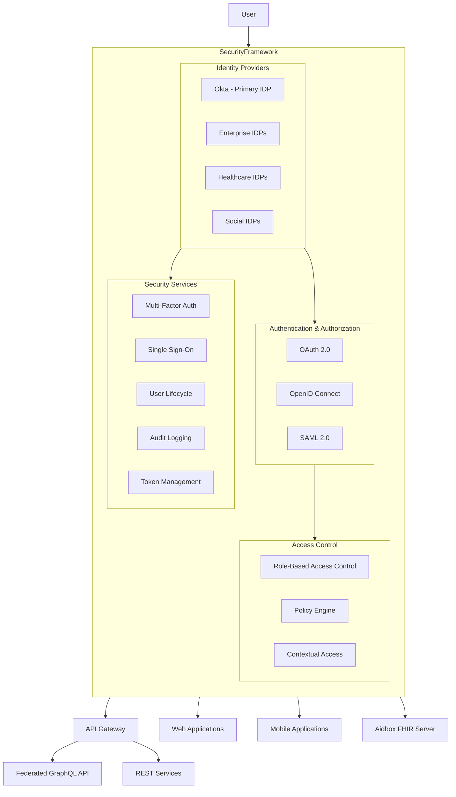

# Security and Access Framework

## Introduction

The Security and Access Framework is a critical component of the CMM Reference Architecture, serving as the comprehensive system for authentication, authorization, and access control. Our implementation combines multiple technologies including Role-Based Access Control (RBAC), OAuth 2.0, OpenID Connect, Okta as the primary identity provider, and support for federated identity providers. This document provides an overview of the framework, its key components, and implementation considerations for healthcare environments.

## Key Concepts

### Components of the Security and Access Framework

Our Security and Access Framework integrates multiple technologies to provide comprehensive identity and access management:

#### Role-Based Access Control (RBAC)

RBAC is a policy-neutral access control mechanism defined around roles and privileges that provides a structured approach to access management:

- **Roles**: Collections of permissions aligned with job functions (e.g., Physician, Nurse, Administrator)
- **Permissions**: Fine-grained access controls for specific resources and actions
- **Role Hierarchies**: Inheritance relationships between roles for simplified management
- **Separation of Duties**: Constraints to prevent conflicts of interest
- **Least Privilege**: Ensuring users have only the access they need to perform their jobs

#### OAuth 2.0 and OpenID Connect

These protocols provide standardized approaches to authorization and authentication:

- **OAuth 2.0**: Industry-standard protocol for authorization
- **OpenID Connect**: Identity layer built on top of OAuth 2.0 for authentication
- **Authorization Flows**: Support for various flows (Authorization Code, PKCE, Client Credentials)
- **Token-Based Security**: Use of access tokens, ID tokens, and refresh tokens
- **Scopes**: Fine-grained permissions for API access

#### Identity Providers

##### Primary IDP (Okta)

Okta serves as our primary identity provider for several key reasons:

- **Enterprise-Grade Security**: SOC 2 Type II, HIPAA, and FedRAMP certified
- **Healthcare Industry Focus**: Specific features and compliance measures for healthcare organizations
- **Extensive Integration Capabilities**: Pre-built integrations with thousands of applications
- **Scalable Architecture**: Designed to handle millions of users and authentication events
- **Advanced Policy Framework**: Granular control over authentication and authorization rules
- **Developer-Friendly**: Comprehensive APIs, SDKs, and documentation

##### Federated Identity Providers

Our framework supports federation with external identity providers:

- **Enterprise Identity Systems**: Integration with Active Directory, Azure AD, and other enterprise IDPs
- **Healthcare-Specific IDPs**: Support for healthcare networks and regional health information exchanges
- **Social Identity Providers**: Optional support for consumer-facing applications (Google, Apple, etc.)
- **SAML 2.0 Support**: Industry standard for enterprise federation
- **Just-in-Time Provisioning**: Automatic user creation from federated identities

## Architecture Overview

## Key Features

### Authentication and Identity Management

#### Single Sign-On (SSO)

Our framework provides a seamless SSO experience across all applications in the CMM ecosystem:

- **Cross-Application Access**: Users authenticate once to access multiple applications
- **Reduced Password Fatigue**: Elimination of multiple credentials
- **Consistent Experience**: Standardized login flow across applications
- **Session Management**: Centralized control of session lifetimes and policies

#### Multi-Factor Authentication (MFA)

The framework supports various MFA methods to enhance security:

- **Multiple Factor Types**: SMS, voice, email, mobile authenticators, biometrics
- **Risk-Based Authentication**: Adaptive MFA based on context and risk signals
- **FIDO2/WebAuthn Support**: Passwordless authentication with security keys
- **Healthcare-Specific Factors**: Support for proximity cards used in clinical settings

#### Federated Authentication

Seamless integration with external identity providers:

- **Enterprise Federation**: Integration with Active Directory, Azure AD, etc.
- **Healthcare Network Integration**: Support for regional health information exchanges
- **SAML 2.0 and OIDC**: Support for major federation protocols
- **Identity Mapping**: Correlation of identities across systems

### Authorization and Access Control

#### Role-Based Access Control

Comprehensive RBAC implementation for healthcare scenarios:

- **Clinical Roles**: Pre-defined roles for physicians, nurses, specialists, etc.
- **Administrative Roles**: Roles for non-clinical staff and system administrators
- **Dynamic Role Assignment**: Context-aware role activation
- **Role Hierarchies**: Inheritance relationships between roles
- **Separation of Duties**: Enforcement of regulatory compliance requirements

#### Policy-Based Access Control

Fine-grained access policies beyond basic role assignments:

- **Attribute-Based Rules**: Decisions based on user, resource, and environmental attributes
- **Time-Based Access**: Restrictions based on time of day or duration
- **Location-Based Policies**: Access control based on network or physical location
- **Device Context**: Policies based on device type, security posture, etc.
- **Clinical Context**: Access based on patient relationships and care context

#### API Access Management

Secure API access through standardized protocols:

- **OAuth 2.0 Framework**: Industry-standard authorization protocol
- **Scoped Access Tokens**: Fine-grained API permissions
- **Token Validation**: Centralized validation and introspection
- **JWT Customization**: Custom claims for healthcare-specific needs
- **API Gateway Integration**: Seamless integration with API management

### User Lifecycle Management

Comprehensive management of user identities throughout their lifecycle:

- **Automated Provisioning**: Integration with HR and credentialing systems
- **Self-Service Capabilities**: User-managed profile and credentials
- **Delegated Administration**: Role-based administrative access
- **Access Certification**: Periodic review of user access rights
- **Automated Deprovisioning**: Immediate access revocation when needed

## Integration Points

The Security and Access Framework integrates with multiple components in our architecture:

### API and Service Integration

- **Federated GraphQL API**: Secures API requests through OAuth 2.0 tokens and RBAC
- **Aidbox FHIR Server**: Implements SMART on FHIR authentication and authorization
- **REST Services**: Protects RESTful endpoints with standardized security patterns
- **Integration Engine**: Secures data flows between systems with appropriate credentials

### Application Integration

- **Web Applications**: Authentication, authorization, and session management
- **Mobile Applications**: Secure mobile authentication with appropriate flows (PKCE)
- **Administrative Portals**: Role-based access with elevated security requirements
- **Patient-Facing Applications**: Consumer-friendly authentication with appropriate security

### External System Integration

- **Enterprise Systems**: Federation with organizational identity providers
- **Healthcare Networks**: Integration with regional health information exchanges
- **Partner Systems**: B2B identity federation for secure partner access
- **Legacy Systems**: Support for older authentication protocols where needed

### Security Infrastructure Integration

- **API Gateway**: Token validation and policy enforcement
- **Monitoring Systems**: Security event forwarding and correlation
- **Audit Systems**: Comprehensive logging for compliance and security analysis
- **Threat Detection**: Integration with security monitoring and analytics

## Getting Started

To begin working with our Security and Access Framework:

1. Review the [Setup Guide](setup-guide.md) for environment configuration
2. Understand [Authentication Flows](../02-core-functionality/authentication-flows.md) for different application types
3. Learn about [Role-Based Access Control](../02-core-functionality/rbac-implementation.md) for healthcare scenarios
4. Explore [OAuth 2.0 and OIDC](../02-core-functionality/oauth-oidc-implementation.md) for API security
5. Implement [Federated Authentication](../02-core-functionality/federation-implementation.md) for external identity providers
6. Review [Security Compliance](../03-advanced-patterns/security-compliance.md) for healthcare regulations

## Related Components

- [Federated GraphQL API](../../federated-graph-api/01-getting-started/overview.md): Uses the Security Framework for API authentication and authorization
- [Aidbox FHIR Server](../../fhir-server/01-getting-started/overview.md): Integrates with the framework for SMART on FHIR authentication
- [Integration Engine](../../integration-engine/01-getting-started/overview.md): Secures data flows with credentials from the Security Framework
- [Design Component Library](../../design-component-library/01-getting-started/overview.md): Includes authentication and authorization UI components

## Next Steps

- [Setup Guide](setup-guide.md): Configure the Security and Access Framework for your environment
- [Authentication Flows](../02-core-functionality/authentication-flows.md): Implement different authentication patterns
- [RBAC Implementation](../02-core-functionality/rbac-implementation.md): Configure role-based access control
- [OAuth and OIDC](../02-core-functionality/oauth-oidc-implementation.md): Implement API security
- [Federation Configuration](../02-core-functionality/federation-implementation.md): Set up federated identity providers
