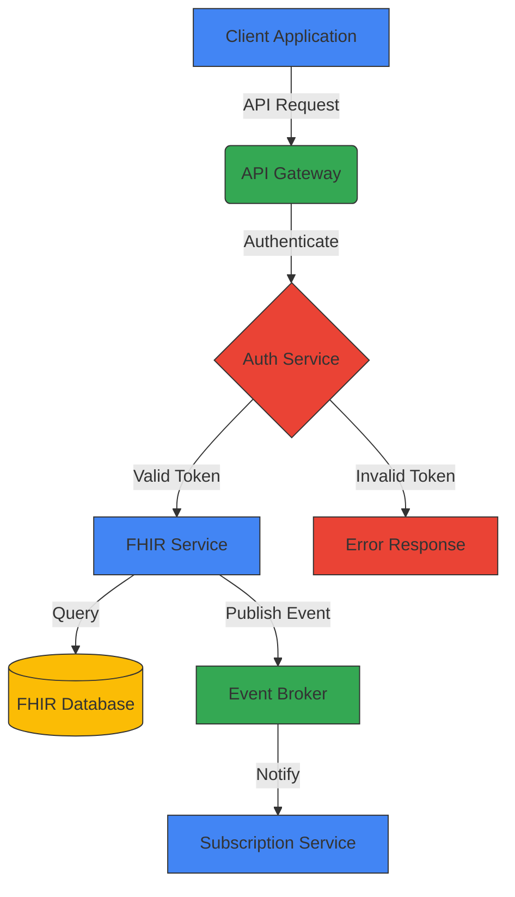
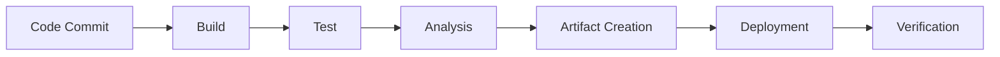

# Key Capability Documentation Standards

## Introduction

This document defines the mandatory standards for all CMM Technology Platform key capability documentation. These standards ensure consistency, completeness, and quality across all capabilities, making the documentation more accessible and useful for developers, architects, and other stakeholders. All contributors **must** follow these standards when creating or updating documentation.

## Documentation Structure

### Tier-Based Organization

All key capabilities **must** follow a consistent 5-tier documentation structure. No exceptions or deviations are permitted without explicit approval from the architecture team.

1. **01-getting-started**: Introduction, quick start guides, and basic concepts
   - Purpose: Help new users understand the component and get started quickly
   - Target audience: New developers, architects, and stakeholders
   - Required files: overview.md, quick-start.md, key-concepts.md, architecture.md

2. **02-core-functionality**: Core features, main APIs, and primary use cases
   - Purpose: Document the core capabilities and interfaces of the component
   - Target audience: Developers implementing or integrating with the component
   - Required files: core-apis.md, data-model.md

3. **03-advanced-patterns**: Advanced usage patterns, integrations, and complex scenarios
   - Purpose: Document advanced usage scenarios and extension mechanisms
   - Target audience: Experienced developers customizing or extending the component
   - Required files: advanced-use-cases.md, customization.md

4. **04-governance-compliance**: Governance frameworks, compliance considerations, and security controls
   - Purpose: Document governance, security, and compliance aspects
   - Target audience: Security specialists, compliance officers, and architects
   - Required files: access-controls.md, data-governance.md, audit-compliance.md, regulatory-compliance.md

5. **05-operations**: Deployment, monitoring, scaling, and maintenance
   - Purpose: Document operational aspects of the component
   - Target audience: DevOps engineers, SREs, and system administrators
   - Required files: deployment.md, monitoring.md, scaling.md, troubleshooting.md, maintenance.md

### Folder Structure

Each capability must maintain the following folder structure:

```
/docs/architecture/key_capabilities/[capability-name]/
├── 01-getting-started/
│   ├── overview.md
│   ├── quick-start.md
│   ├── key-concepts.md
│   └── architecture.md
├── 02-core-functionality/
│   ├── core-apis.md
│   ├── data-model.md
│   └── [feature-specific-docs].md
├── 03-advanced-patterns/
│   ├── advanced-use-cases.md
│   ├── customization.md
│   └── [pattern-specific-docs].md
├── 04-governance-compliance/
│   ├── access-controls.md
│   ├── data-governance.md
│   ├── audit-compliance.md
│   └── regulatory-compliance.md
└── 05-operations/
    ├── deployment.md
    ├── monitoring.md
    ├── scaling.md
    ├── troubleshooting.md
    └── maintenance.md
```

## Template Usage Requirement

All new documentation (including but not limited to overview, quick start, architecture, and advanced topics) **must** be created using the official templates provided in the `/docs/architecture/templates/` folder. Each documentation type (e.g., overview, quick start, etc.) has a corresponding template that must be followed to ensure consistency, completeness, and compliance with CMM documentation standards.

- Deviations from the templates are not permitted unless explicitly reviewed and approved by the documentation governance team or project lead.
- Templates must be updated centrally, and any changes to template structure should be communicated to all documentation contributors.

## Document Templates and Content Guidelines

### Document Templates

All documentation **must** follow the appropriate template from the templates directory. These templates provide detailed guidance on structure, content, and formatting for each document type:

| Document Type | Template | Purpose |
|--------------|----------|---------|
| Overview | [overview-template.md](../templates/overview-template.md) | Component introduction and high-level information |
| Quick Start | [quick-start-template.md](../templates/quick-start-template.md) | Fast setup and first-use guidance |
| Key Concepts | [key-concepts-template.md](../templates/key-concepts-template.md) | Terminology, glossary, and foundational ideas |
| Architecture | [architecture-template.md](../templates/architecture-template.md) | Component design and structure |
| Core APIs | [core-apis-template.md](../templates/core-apis-template.md) | Main API endpoints and usage |
| Data Model | [data-model-template.md](../templates/data-model-template.md) | Data structures and relationships |
| Feature-Specific | [feature-specific-template.md](../templates/feature-specific-template.md) | Documentation for unique or optional features |
| Advanced Use Cases | [advanced-use-cases-template.md](../templates/advanced-use-cases-template.md) | Complex usage scenarios and workflows |
| Customization | [customization-template.md](../templates/customization-template.md) | Configuration and extension options |
| Advanced Feature | [advanced-feature-template.md](../templates/advanced-feature-template.md) | Deep dives into advanced component features |
| Access Controls | [access-controls-template.md](../templates/access-controls-template.md) | RBAC, policy enforcement, and authentication |
| Data Governance | [data-governance-template.md](../templates/data-governance-template.md) | Data quality, lifecycle, and stewardship |
| Audit Compliance | [audit-compliance-template.md](../templates/audit-compliance-template.md) | Audit controls and IT general controls |
| Regulatory Compliance | [regulatory-compliance-template.md](../templates/regulatory-compliance-template.md) | Compliance with regulations |
| Monitoring | [monitoring-template.md](../templates/monitoring-template.md) | Metrics, logging, and alerting |
| Scaling | [scaling-template.md](../templates/scaling-template.md) | Scaling strategies and operational procedures |
| Troubleshooting | [troubleshooting-template.md](../templates/troubleshooting-template.md) | Actionable troubleshooting steps for component-specific issues |
| Maintenance | [maintenance-template.md](../templates/maintenance-template.md) | Routine operations, upgrades, and support |

### Standard Document Structure

All documentation **must** adhere to the following structure, which is reflected in the templates:

1. **Title (H1)**: Clear, descriptive title using the format `# [Component Name] [Document Topic]`
2. **Introduction (H2)**: Brief overview of the document's purpose and scope
3. **Main Content (H2/H3/H4)**: Organized in logical sections with clear hierarchical headings
4. **Code Examples**: TypeScript code examples where applicable
5. **Diagrams**: Mermaid diagrams only when they directly clarify a complex operational process or are essential for understanding escalation, flow, or architecture. Avoid diagrams unless they provide clear, actionable value to the reader.
6. **Conclusion or Summary (H2)**: Recap of key points
7. **Related Resources (H2)**: Links to related documentation

Refer to the specific template for each document type for detailed guidance on structure and content.

---

### Content Focus and Avoiding Redundancy

To ensure documentation is focused, effective, and minimizes redundancy, follow these principles:

1. **Single Responsibility Principle**
   - Each document must have a clear, singular focus
   - If a document covers multiple topics, consider splitting it into separate documents
   - The document's title and introduction should clearly define its scope

2. **Cross-Reference Instead of Duplicate**
   - Never duplicate content across multiple documents
   - Use links to reference information in other documents
   - Format links as `[descriptive text](relative/path/to/document.md)`
   - Ensure all links are valid and point to the correct location

3. **Component-Specific Content**
   - Focus on component-specific implementations rather than general concepts
   - When discussing general concepts, relate them directly to the component
   - Avoid lengthy explanations of industry-standard concepts
   - Link to authoritative external resources for general concepts

4. **Appropriate Detail Level**
   - Match the detail level to the document's purpose and audience
   - Getting-started documents should be high-level and accessible
   - Technical documents should include detailed explanations and code examples
   - Operations documents should include step-by-step procedures

5. **Consistent Terminology**
   - Use consistent terminology across all documents
   - Define terms on first use with a clear, concise definition
   - Follow industry-standard terminology when applicable
   - Maintain a glossary of terms in the key-concepts.md document

### Communication and Documentation

### Communication Platform Standards

All documentation must reference Microsoft Teams as the standard communication platform:

- Use "Microsoft Teams channel" instead of "Slack channel" in all documentation
- Use "teams_configs" instead of "slack_configs" in all monitoring configurations
- Use "teams" instead of "slack" in notification channel references
- Use the "teams" field instead of "slack" in team contact information

### What Should and Should Not Be Included

The following guidelines help determine what content belongs in each document:

| Document Type | Should Include | Should Not Include |
|--------------|----------------|-------------------|
| Overview | Component purpose, key features, high-level architecture, primary use cases | Detailed implementation, code examples, configuration details |
| Architecture | Component design, internal structure, data flow, integration points | Detailed code examples, step-by-step tutorials, operational procedures |
| API Documentation | API endpoints, parameters, return values, error codes, usage examples | Internal implementation details, deployment procedures, general concepts |
| Tutorials | Step-by-step instructions, specific use cases, expected outcomes | Comprehensive API references, architectural details, theoretical concepts |
| Reference Architecture | System-wide architecture, component relationships, design patterns, architectural decisions | Component-specific implementation details, code examples, operational procedures |

Reference architecture documentation should be reserved for system-wide architectural documentation and should not be duplicated in component-specific documentation. Component documentation should reference the system architecture rather than reproducing it.

### Document Templates Reference

All document templates are located in the `/docs/architecture/templates/` directory. These templates provide comprehensive guidance for creating consistent, high-quality documentation across all components.

#### Available Templates

**Getting Started Templates**
- [overview-template.md](../templates/overview-template.md) — Introduction, key features, and high-level overview of the component
- [quick-start-template.md](../templates/quick-start-template.md) — Fast setup, installation, and first-use guidance
- [key-concepts-template.md](../templates/key-concepts-template.md) — Terminology, glossary, and foundational concepts
- [architecture-template.md](../templates/architecture-template.md) — Component architecture, design, structure, and integration points

**Core Functionality Templates**
- [core-apis-template.md](../templates/core-apis-template.md) — Main API endpoints, authentication, and usage examples
- [data-model-template.md](../templates/data-model-template.md) — Data structures, relationships, and example schemas
- [feature-specific-template.md](../templates/feature-specific-template.md) — Documentation for unique or optional features

**Advanced Patterns Templates**
- [advanced-use-cases-template.md](../templates/advanced-use-cases-template.md) — Complex usage scenarios, workflows, and advanced patterns
- [customization-template.md](../templates/customization-template.md) — Configuration, extension, and theming options
- [advanced-feature-template.md](../templates/advanced-feature-template.md) — Deep dives into advanced component features

**Governance & Compliance Templates**
- [access-controls-template.md](../templates/access-controls-template.md) — RBAC, policy enforcement, and authentication
- [data-governance-template.md](../templates/data-governance-template.md) — Data quality, lifecycle, stewardship, and schema governance
- [audit-compliance-template.md](../templates/audit-compliance-template.md) — Audit controls, logging, and compliance framework
- [regulatory-compliance-template.md](../templates/regulatory-compliance-template.md) — Regulatory requirements, data privacy, and compliance measures

**Operations Templates**
- [deployment-template.md](../templates/deployment-template.md) — Deployment procedures, configuration, and infrastructure
- [monitoring-template.md](../templates/monitoring-template.md) — Metrics, logging, alerting, and dashboards
- [scaling-template.md](../templates/scaling-template.md) — Scaling strategies, auto-scaling, and operational procedures
- [troubleshooting-template.md](../templates/troubleshooting-template.md) — Actionable troubleshooting steps and diagnostic procedures
- [maintenance-template.md](../templates/maintenance-template.md) — Routine operations, upgrades, and support

- [access-controls-template.md](../templates/access-controls-template.md) - Access control models and security policies
- [audit-compliance-template.md](../templates/audit-compliance-template.md) - Audit requirements and implementation
- [regulatory-compliance-template.md](../templates/regulatory-compliance-template.md) - Regulatory requirements and implementation

**Operations Templates**
- [deployment-template.md](../templates/deployment-template.md) - Deployment procedures of key capability technologies and configuration with a focus on cloud-native deployment and infrastructure as code
- [monitoring-template.md](../templates/monitoring-template.md) - Metrics, logging, and alerting
- [scaling-template.md](../templates/scaling-template.md) - Scaling strategies and capacity planning
- [troubleshooting-template.md](../templates/troubleshooting-template.md) - Common issues and resolution
- [maintenance-template.md](../templates/maintenance-template.md) - Backup, upgrades, and routine tasks

#### Using Templates

To use a template for a new document:

1. Copy the appropriate template to the target location
2. Replace placeholder content with component-specific information
3. Follow the guidance provided in the template comments
4. Ensure all sections are completed with relevant information
5. Remove any sections that are not applicable (with justification)
6. Add component-specific sections as needed

## Content Standards

### Vendor Documentation Links

- When available and appropriate to share, always include a link to the official vendor documentation for any commercial or open-source product used by the component (e.g., Confluent Kafka, Aidbox, Apollo GraphOS, Okta, MuleSoft, etc.).
- Vendor documentation links must point to the most relevant page for the specific product, feature, or API being referenced—not just the vendor's home page or general documentation index.
- Vendor documentation links should be provided in context, typically in the 'Related Resources' section or alongside the first mention of the vendor product.
- Do not include vendor documentation links for internal, proprietary, or confidential vendor resources unless explicitly permitted.

### Writing Style

All documentation **must** follow these writing style guidelines:

- **Clear and Concise Language**
  - Use simple, direct language
  - Avoid jargon and unnecessary technical terms
  - Explain complex concepts in simple terms
  - Keep sentences short (25 words or less)
  - Use bullet points for lists and steps

- **Consistent Tense and Voice**
  - Write in present tense ("The system sends a message" not "The system will send a message")
  - Use active voice ("The component processes the request" not "The request is processed by the component")
  - Use second person ("you") when addressing the reader in instructional content
  - Use imperative mood for instructions ("Click the button" not "You should click the button")

- **Formatting and Structure**
  - Use headings to organize content hierarchically
  - Keep paragraphs short (3-5 sentences)
  - Use bold for emphasis sparingly
  - Use code formatting for code elements, file names, and technical terms
  - Define acronyms on first use: "Health Level Seven (HL7) FHIR"

- **Inclusive Language**
  - Use gender-neutral language
  - Avoid culturally specific metaphors or idioms
  - Consider international audiences (avoid region-specific terms)
  - Follow the [Microsoft Writing Style Guide](https://learn.microsoft.com/en-us/style-guide/welcome/) for inclusive language

### Code Examples

All technical documentation **must** include code examples that follow these guidelines:

- **Language and Format**
  - **Use TypeScript for all web and Node.js related code examples**
  - Use strongly-typed interfaces and classes
  - Use the vendor's preferred language only when TypeScript is not available
  - Always specify the language in code blocks: ```typescript
  - Format code according to the [Google TypeScript Style Guide](https://google.github.io/styleguide/tsguide.html)

- **Quality and Completeness**
  - Ensure code examples are complete and runnable when possible
  - Include imports and dependencies
  - Use realistic variable and function names
  - Include proper error handling
  - Include comments to explain complex logic
  - Show both the happy path and error handling

- **Best Practices**
  - Follow modern TypeScript best practices
  - Include monitoring and observability
  - Demonstrate proper security practices
  - Show proper resource cleanup
  - When showing examples for paid services (e.g., Confluent Kafka, Azure, Aidbox, MuleSoft, Apollo GraphOS, Okta), leverage vendor-specific features that reduce operational overhead

- **Example Structure**
  - Start with a brief explanation of what the code does
  - Show the complete code example
  - Explain key parts of the code after the example
  - Include expected output or behavior where appropriate

### Diagrams

All documentation that describes architecture, workflows, or complex concepts **must** include diagrams that follow these guidelines:

- **Diagram Format**
  - Use mermaid diagrams for all technical diagrams
  - Use the latest stable version of mermaid syntax
  - Include both the rendered diagram and the source code
  - Format mermaid code blocks as ```mermaid

- **Design Principles**
  - Keep diagrams simple and focused on one concept
  - Limit the number of elements to improve readability
  - Use a logical flow (typically left-to-right or top-to-bottom)
  - Group related elements together
  - Use consistent colors and shapes across all diagrams

- **Visual Standards**
  - Use the following color scheme:
    - Core components: #00426A (navy)
    - External systems: #E70665 (magenta)
    - Data stores: #FF8F1D (yellow)
    - Security elements: #1E91D6 (blue)
  - Use consistent shapes:
    - Rectangles for services and components
    - Cylinders for databases
    - Hexagons for external systems
    - Diamonds for decision points

- **Annotations and Labels**
  - Include clear, concise labels for all elements
  - Add brief descriptions for complex interactions
  - Include a legend when using multiple types of elements
  - Add a title that describes the diagram's purpose

- **Example Mermaid Diagram**



## Implementation and Compliance

### Documentation Review Process

All documentation changes must go through a formal review process to ensure compliance with these standards:

1. **Self-Review Checklist**
   - Before submitting documentation, authors must complete a self-review using the [Documentation Standards Checklist](../templates/documentation-checklist.md)
   - The checklist must be included in the pull request description

2. **Peer Review**
   - All documentation changes require at least one review from a peer
   - Reviewers must verify compliance with these standards
   - Reviewers should use the Documentation Standards Checklist as a guide

3. **Technical Accuracy Review**
   - Documentation for technical components requires a review from a subject matter expert
   - The technical reviewer must verify the accuracy of all technical content
   - Code examples must be validated for correctness and adherence to best practices

4. **Final Approval**
   - Documentation changes require final approval from a documentation maintainer
   - Maintainers are responsible for ensuring consistency across all documentation

### Tools and Automation

The following tools and automation are in place to help maintain documentation standards:

1. **Markdown Linting**
   - All markdown files are automatically linted using markdownlint
   - Configuration is in the `.markdownlint.json` file in the repository root
   - Pull requests will fail CI checks if linting errors are present

2. **Documentation Structure Validation**
   - Automated checks verify the required folder structure and files
   - Pull requests will fail CI checks if required files are missing

3. **Link Validation**
   - Automated checks verify that all internal links are valid
   - Broken links must be fixed before merging

4. **Template Generator**
   - Use the template generator script to create new documentation files:
   - `node scripts/create-doc-template.js <component-name> <doc-type> <file-name>`
   - Example: `node scripts/create-doc-template.js fhir-interoperability-platform 01-getting-started overview.md`

### Handling Exceptions

In rare cases, exceptions to these standards may be necessary. The process for handling exceptions is:

1. **Exception Request**
   - Submit an exception request to the architecture team
   - Include a detailed justification for the exception
   - Specify which standards cannot be met and why

2. **Review and Approval**
   - The architecture team will review the exception request
   - Exceptions require approval from at least two architecture team members
   - Approved exceptions will be documented in the implementation tracking document

3. **Documentation**
   - All approved exceptions must be documented in the affected files
   - Include a comment at the top of the file explaining the exception
   - Reference the exception approval in the pull request

### Measuring Compliance

Compliance with documentation standards is measured and tracked:

1. **Documentation Coverage Report**
   - A weekly report shows documentation coverage for each component
   - Coverage is measured as a percentage of required documents that exist
   - The report is available in the documentation dashboard

2. **Quality Metrics**
   - Documentation quality is measured using automated tools
   - Metrics include readability scores, broken links, and linting errors
   - Quality scores are included in the documentation dashboard

3. **Implementation Tracking**
   - The [Implementation Tracking](implementation-tracking.md) document tracks progress toward full compliance
   - Each component is assessed for compliance with these standards
   - The tracking document is updated monthly

## US Regulatory Compliance Documentation

### Overview

All key capabilities must include comprehensive documentation of compliance with key United States regulations. This section outlines the specific documentation requirements for HIPAA, Sarbanes-Oxley (SOX), and US privacy regulations.

### HIPAA Compliance Documentation Requirements

All components that process, store, or transmit Protected Health Information (PHI) must document the following in their regulatory-compliance.md file:

1. **Technical Safeguards Implementation**
   - Access Controls: Authentication mechanisms, authorization frameworks, and automatic logoff
   - Audit Controls: Logging mechanisms, audit trail implementation, and log review procedures
   - Integrity Controls: Mechanisms to prevent unauthorized alteration or destruction of PHI
   - Transmission Security: Encryption methods, integrity verification, and secure transmission protocols

2. **Administrative Safeguards Support**
   - Risk Analysis: How the component supports risk assessment and management
   - Security Personnel: Integration with security management structure
   - Information Access Management: Access authorization and establishment workflows
   - Contingency Plan: Data backup, disaster recovery, and emergency mode operation

3. **Breach Notification Support**
   - Breach Detection: Mechanisms for identifying unauthorized access or disclosure
   - Breach Investigation: Tools for determining scope and impact of breaches
   - Notification Workflows: Processes for managing breach notifications

### Sarbanes-Oxley (SOX) Compliance Documentation Requirements

All components that support financial reporting processes must document the following in their regulatory-compliance.md file:

1. **Internal Controls Documentation**
   - Control Objectives: Clear statements of what each control is designed to achieve
   - Control Activities: Detailed descriptions of how controls are implemented
   - Control Testing: Methods for testing control effectiveness
   - Evidence Collection: Mechanisms for collecting and preserving control evidence

2. **IT General Controls (ITGCs)**
   - Change Management: Processes for managing changes to the component
   - Access Security: Controls over who can access the component and what they can do
   - Computer Operations: Controls over system processing and data management
   - Program Development: Controls over development and implementation of new functionality

3. **Segregation of Duties**
   - Role Definitions: Clear definitions of roles and responsibilities
   - Conflicting Duties: Identification of duties that should be separated
   - Enforcement Mechanisms: How segregation of duties is enforced

### US Privacy Regulations Documentation Requirements

All components that process personal information must document the following in their regulatory-compliance.md file:

1. **Data Subject Rights Management**
   - Right to Know/Access: How data subject access requests are processed
   - Right to Delete: How deletion requests are handled, including exceptions
   - Right to Opt-Out: How sale/sharing opt-out preferences are managed
   - Right to Correct: How correction requests are processed
   - Right to Data Portability: How data is provided in a portable format

2. **Privacy Notice and Consent Management**
   - Notice Delivery: How privacy notices are delivered to users
   - Consent Collection: How consent is collected and recorded
   - Preference Management: How privacy preferences are managed

3. **Data Inventory and Classification**
   - Data Mapping: How personal data flows are documented
   - Data Classification: How data is classified according to privacy regulations
   - Retention Management: How data retention policies are implemented

### Cross-Regulation Documentation Requirements

All components must document the following common elements across regulations:

1. **Regulatory Requirements Mapping**
   - Clear mapping between regulatory requirements and component features
   - Traceability from requirements to implementation
   - Compliance gap analysis and remediation plans

2. **Compliance Monitoring and Reporting**
   - Monitoring mechanisms for compliance status
   - Reporting capabilities for regulatory requirements
   - Metrics for measuring compliance effectiveness

3. **Implementation Examples**
   - Code examples demonstrating compliance features
   - Configuration examples for compliance settings
   - Integration examples with compliance frameworks

## Required Documentation by Component

### Required Documents for All Components

All key capabilities must include a standard set of documentation following the appropriate templates. This section outlines the required documents for each capability and provides guidance on content boundaries to minimize redundancy.

#### Required Documents

Each key capability must include the documentation as outlined in the [Available Templates](#available-templates).

#### Content Boundaries

To minimize redundancy and maintain clear content boundaries, follow these guidelines:

#### Content Boundaries by Document Type

Each document type has specific content boundaries to minimize redundancy and ensure clear focus. Refer to the templates for detailed guidance on content structure and requirements.

| Document | Content Focus | Content to Avoid | Template Reference |
|----------|--------------|-----------------|-------------------|
| **core-apis.md** | API endpoints, parameters, return values, error codes, usage examples | Internal implementation details, deployment procedures | [api-documentation-template.md](../templates/api-documentation-template.md) |
| **data-model.md** | Data structures, schemas, relationships, constraints, examples | API details, implementation code | [data-model-template.md](../templates/data-model-template.md) |
| **integration-points.md** | Integration interfaces, protocols, patterns, examples | Internal implementation details | [integration-points-template.md](../templates/integration-points-template.md) |
| **advanced-use-cases.md** | Complex scenarios, advanced configurations | Basic usage covered in quick-start | [advanced-use-cases-template.md](../templates/advanced-use-cases-template.md) |
| **extension-points.md** | Extension mechanisms, plugin architecture | Basic usage, non-extension details | [extension-points-template.md](../templates/extension-points-template.md) |
| **customization.md** | Configuration options, theming, behavior modifications | Extension mechanisms | [customization-template.md](../templates/customization-template.md) |
| **access-controls.md** | Access control model, authentication, authorization | Audit logging details | [access-controls-template.md](../templates/access-controls-template.md) |
| **data-governance.md** | Data classification, lifecycle, quality controls | Access control details | [data-governance-template.md](../templates/data-governance-template.md) |
| **audit-compliance.md** | IT general controls (ITGCs) key to SOC2, audit framework, control activities | Access control implementation | [audit-compliance-template.md](../templates/audit-compliance-template.md) |
| **regulatory-compliance.md** | HIPAA, SOX, and US privacy regulations compliance | Non-US regulations, general security | [regulatory-compliance-template.md](../templates/regulatory-compliance-template.md) |
| **deployment.md** | Cloud-native deployment, infrastructure as code | Development setup details | [deployment-template.md](../templates/deployment-template.md) |
| **monitoring.md** | Metrics, logging, alerting, dashboards using Open Telemetry | Deployment procedures | [monitoring-template.md](../templates/monitoring-template.md) |
| **scaling.md** | Scaling strategies, performance, capacity planning | Basic deployment details | [scaling-template.md](../templates/scaling-template.md) |
| **troubleshooting.md** | Common issues, diagnostics, resolution steps | Monitoring setup details | [troubleshooting-template.md](../templates/troubleshooting-template.md) |
| **maintenance.md** | Backup/restore, upgrades, patches | Deployment procedures | [maintenance-template.md](../templates/maintenance-template.md) |

#### Special Emphasis Areas

**For audit-compliance.md:**
- Must emphasize documentation of IT general controls that support financial reporting and regulatory compliance
- Must include segregation of duties, change management controls, system access controls, and IT operations controls

**For regulatory-compliance.md:**
- Must emphasize technical and administrative safeguards for HIPAA compliance
- Must include internal controls documentation for SOX 404
- Must cover data subject rights management for US privacy regulations

### Component-Specific Documentation

In addition to the standard documentation required for all components, each component has additional documentation specific to its functionality. These component-specific documents should follow the same template structure as the standard documents, with adaptations for the specific content requirements.

#### Component-Specific Document Reference

The following table outlines the additional required documentation for each component. All documents should follow the appropriate templates with adaptations for component-specific content.

| Component | Additional Document | Phase | Content Focus | Template to Adapt |
|-----------|---------------------|-------|--------------|------------------|
| **API Marketplace** | api-registration.md | 02-core-functionality | Registration process, metadata, validation | [api-documentation-template.md](../templates/api-documentation-template.md) |
| **API Marketplace** | api-discovery.md | 02-core-functionality | Search mechanisms, filtering, categorization | [api-documentation-template.md](../templates/api-documentation-template.md) |
| **API Marketplace** | lifecycle-management.md | 04-governance-compliance | API lifecycle stages, transitions, approvals | [versioning-policy-template.md](../templates/versioning-policy-template.md) |
| **API Marketplace** | data-quality.md | 04-governance-compliance | Quality metrics, validation rules, monitoring | [data-governance-template.md](../templates/data-governance-template.md) |
| **Federated Graph API** | schema-federation.md | 02-core-functionality | Federation model, schema stitching, composition | [data-model-template.md](../templates/data-model-template.md) |
| **Federated Graph API** | query-resolution.md | 02-core-functionality | Query planning, execution, optimization | [api-documentation-template.md](../templates/api-documentation-template.md) |
| **Federated Graph API** | schema-governance.md | 04-governance-compliance | Schema approval, validation, versioning | [data-governance-template.md](../templates/data-governance-template.md) |
| **Federated Graph API** | query-governance.md | 04-governance-compliance | Query validation, rate limiting, security | [access-controls-template.md](../templates/access-controls-template.md) |
| **FHIR Platform** | fhir-resources.md | 02-core-functionality | Resource types, structure, validation | [data-model-template.md](../templates/data-model-template.md) |
| **FHIR Platform** | fhir-operations.md | 02-core-functionality | CRUD operations, search, transactions | [api-documentation-template.md](../templates/api-documentation-template.md) |

#### Content Boundaries for Component-Specific Documentation

When creating component-specific documentation:

1. **Follow Template Structure**: Use the appropriate template as a starting point
2. **Maintain Clear Boundaries**: Avoid duplicating content from standard documents
3. **Cross-Reference**: Link to related documents rather than duplicating content
4. **Focus on Component-Specific Details**: Emphasize what is unique to the component
  
- **resource-governance.md** (04-governance-compliance)
  - *Should include*: Resource validation, conformance, profiles, extensions governance
  - *Should not include*: General data governance (covered in data-governance.md)
  
- **interoperability-standards.md** (04-governance-compliance)
  - *Should include*: Supported standards, implementation guides, conformance testing
  - *Should not include*: Resource details (covered in fhir-resources.md)

#### Event Broker
- **topic-management.md** (02-core-functionality)
  - *Should include*: Topic creation, configuration, partitioning, retention
  - *Should not include*: Message patterns (covered in message-patterns.md)
  
- **message-patterns.md** (02-core-functionality)
  - *Should include*: Pub/sub, request/reply, event sourcing, stream processing
  - *Should not include*: Topic management (covered in topic-management.md)
  
- **schema-registry-management.md** (04-governance-compliance)
  - *Should include*: Schema registration, validation, evolution, compatibility
  - *Should not include*: Topic governance (covered in topic-governance.md)
  
- **topic-governance.md** (04-governance-compliance)
  - *Should include*: Topic naming conventions, access policies, lifecycle management
  - *Should not include*: Schema details (covered in schema-registry-management.md)
  
- **data-retention-archiving.md** (04-governance-compliance)
  - *Should include*: Retention policies, archiving strategies, data lifecycle
  - *Should not include*: Topic management (covered in topic-management.md)

### Reference Architecture Documentation

The reference architecture documentation should be maintained separately from component-specific documentation and should focus on system-wide architecture, patterns, and decisions.


## Reference Architecture Concepts

### Overview

Certain architectural concepts and patterns span multiple key capabilities and should be documented in the reference architecture rather than duplicated across individual capability documentation. This section identifies these cross-cutting concerns and provides guidance on how to reference them in capability documentation.

### Cross-Component Architectural Patterns

The following architectural patterns involve multiple components and should be documented in the reference architecture:

1. **Command Query Responsibility Segregation (CQRS)**
   - *Reference Architecture Documentation*: Detailed pattern description, implementation guidance, and system-wide considerations
   - *Component Documentation*: Brief mention of CQRS usage with reference to the system-wide pattern documentation
   - *Affected Components*: API Marketplace, Event Broker, FHIR Interoperability Platform, Workflow Orchestration Engine

2. **Event-Driven Architecture (EDA)**
   - *Reference Architecture Documentation*: Overall event flow, event schema standards, reliability patterns, and cross-component choreography
   - *Component Documentation*: Component-specific event production/consumption with reference to system-wide event standards
   - *Affected Components*: Event Broker, API Marketplace, FHIR Interoperability Platform, Workflow Orchestration Engine

3. **Microservices Architecture**
   - *Reference Architecture Documentation*: Service boundaries, communication patterns, deployment models, and orchestration
   - *Component Documentation*: Component-specific service implementation with reference to system-wide microservice standards
   - *Affected Components*: All key capabilities

4. **API Gateway Pattern**
   - *Reference Architecture Documentation*: Gateway architecture, routing rules, cross-cutting concerns (auth, rate limiting, etc.)
   - *Component Documentation*: Component-specific API exposure with reference to system-wide gateway configuration
   - *Affected Components*: API Marketplace, FHIR Interoperability Platform, Federated Graph API

5. **Circuit Breaker Pattern**
   - *Reference Architecture Documentation*: Pattern implementation, configuration standards, monitoring, and recovery strategies
   - *Component Documentation*: Component-specific usage with reference to system-wide resilience patterns
   - *Affected Components*: All key capabilities

### Legacy and On-Premises Integration Patterns

Integration with legacy and on-premises systems involves multiple components and should be documented in the reference architecture:

1. **Legacy System Integration**
   - *Reference Architecture Documentation*: Integration patterns, data transformation, synchronization strategies, and security considerations
   - *Component Documentation*: Component-specific adapters with reference to system-wide legacy integration patterns
   - *Affected Components*: API Marketplace, Event Broker, FHIR Interoperability Platform, Workflow Orchestration Engine

2. **On-Premises Deployment Patterns**
   - *Reference Architecture Documentation*: Hybrid cloud/on-premises architectures, network considerations, data residency, and synchronization
   - *Component Documentation*: Component-specific deployment considerations with reference to system-wide hybrid deployment patterns
   - *Affected Components*: All key capabilities

3. **Legacy Authentication Integration**
   - *Reference Architecture Documentation*: Integration with legacy identity providers, token translation, and federation patterns
   - *Component Documentation*: Component-specific authentication requirements with reference to system-wide authentication patterns
   - *Affected Components*: All key capabilities

### Cross-Cutting Technical Concerns

The following technical concerns span multiple components and should be documented in the reference architecture:

1. **Distributed Tracing**
   - *Reference Architecture Documentation*: Tracing architecture, correlation ID propagation, sampling strategies, and observability
   - *Component Documentation*: Component-specific instrumentation with reference to system-wide tracing standards
   - *Affected Components*: All key capabilities

2. **Centralized Logging**
   - *Reference Architecture Documentation*: Logging architecture, log aggregation, structured logging format, and retention policies
   - *Component Documentation*: Component-specific logging with reference to system-wide logging standards
   - *Affected Components*: All key capabilities

3. **Metrics and Monitoring**
   - *Reference Architecture Documentation*: Metrics collection, alerting strategies, dashboarding, and SLO/SLA definitions
   - *Component Documentation*: Component-specific metrics with reference to system-wide monitoring standards
   - *Affected Components*: All key capabilities

4. **Disaster Recovery**
   - *Reference Architecture Documentation*: System-wide DR strategy, RPO/RTO objectives, backup strategies, and recovery procedures
   - *Component Documentation*: Component-specific recovery considerations with reference to system-wide DR strategy
   - *Affected Components*: All key capabilities

### Documentation Guidelines

When documenting components that implement or interact with these cross-cutting concerns:

1. **Reference, Don't Duplicate**
   - Briefly mention the pattern or concern as it relates to the component
   - Include a reference to the detailed documentation in the reference architecture
   - Focus on component-specific implementation details only

2. **Use Consistent Terminology**
   - Use the same terminology as defined in the reference architecture
   - Maintain consistency in diagrams and visual representations
   - Ensure component-specific documentation aligns with system-wide patterns

3. **Clarify Component Boundaries**
   - Clearly delineate where component responsibility ends and system-wide patterns begin
   - Explain how the component participates in the larger pattern
   - Document component-specific configuration related to the pattern

### Example Documentation Approach

**In Component Documentation:**

```markdown
## Event-Driven Integration

The API Marketplace publishes the following events to the Event Broker:

| Event | Topic | Purpose | Payload Schema |
|-------|-------|---------|----------------|
| ApiRegistered | api.lifecycle | Notify when a new API is registered | [ApiRegisteredEvent](#) |
| ApiDeprecated | api.lifecycle | Notify when an API is deprecated | [ApiDeprecatedEvent](#) |

For details on the event-driven architecture patterns, event schema standards, and cross-component choreography, see the [Event-Driven Architecture Reference](../../reference_architecture/event-driven-architecture.md).
```

**In Reference Architecture Documentation:**

```markdown
## Event-Driven Architecture

The CMM Technology Platform uses an event-driven architecture for asynchronous communication between components. This enables loose coupling, real-time updates, scalability, and resilience.

### Event Flow

[System-wide event flow diagram]

### Event Schema Standards

[Standard event envelope structure, versioning, etc.]

### Component Responsibilities

| Component | Producer Role | Consumer Role |
|-----------|---------------|---------------|
| API Marketplace | Publishes API lifecycle events | Consumes usage events |
| Event Broker | Manages topics and subscriptions | N/A |
| FHIR Platform | Publishes resource change events | Consumes integration events |
```

## Release Lifecycle and Operations Documentation Standards

### Release Lifecycle Documentation

All `release-lifecycle.md` files must include:

1. **Lifecycle Stages**: Defined stages in the component's lifecycle (e.g., planning, development, testing, release, maintenance, deprecation)
2. **Versioning Strategy**: Semantic versioning approach and version numbering scheme
3. **Release Planning**: How releases are planned and scheduled
4. **Change Management**: Process for managing and approving changes
5. **Release Approval**: Criteria and process for approving releases
6. **Rollback Procedures**: Process for rolling back problematic releases
7. **Release Communication**: How releases and changes are communicated

```markdown
# Release Lifecycle

## Introduction

[Brief overview of the component's release lifecycle and its importance]

## Lifecycle Stages

### Planning
[Description of planning stage activities and deliverables]

### Development
[Description of development stage activities and deliverables]

### Testing
[Description of testing stage activities and deliverables]

### Release
[Description of release stage activities and deliverables]

### Maintenance
[Description of maintenance stage activities and deliverables]

### Deprecation
[Description of deprecation stage activities and deliverables]

## Versioning Strategy

[Explanation of semantic versioning (MAJOR.MINOR.PATCH) and how it's applied]

### Version Numbering

- **Major Version**: [When and why major versions are incremented]
- **Minor Version**: [When and why minor versions are incremented]
- **Patch Version**: [When and why patch versions are incremented]

## Release Planning

[Description of the release planning process, including roadmap development, prioritization, and scheduling]

## Change Management

[Description of the change management process, including change request, evaluation, approval, and implementation]

## Release Approval

[Description of the release approval process, including criteria, stakeholders, and gates]

## Rollback Procedures

[Description of the rollback procedures, including triggers, process, and verification]

## Release Communication

[Description of how releases and changes are communicated to stakeholders]
```

### Versioning Policy Documentation

All `versioning-policy.md` files must include component-specific versioning strategies focused on the deployable units of each component. The versioning policy must address the following areas:

1. **Deployable Unit Versioning**: Specific versioning strategy for the component's primary deployable units
2. **Semantic Versioning Implementation**: How semantic versioning is applied to the specific deployable units
3. **Compatibility Guarantees**: Clear definition of backward and forward compatibility guarantees
4. **Dependency Management**: How dependencies are versioned and managed
5. **Version Lifecycle**: Lifecycle stages for each version including support and deprecation policies

#### Component-Specific Versioning Requirements

| Component | Deployable Units | Versioning Requirements |
|-----------|-----------------|--------------------------|
| FHIR Interoperability Platform | FHIR Implementation Guides, Profiles | - Implementation Guide versioning aligned with FHIR version<br>- Profile versioning with canonical URLs<br>- Extension versioning strategy<br>- Terminology versioning (ValueSets, CodeSystems) |
| API Marketplace | API Definitions, Portal | - API definition versioning (OpenAPI)<br>- API endpoint versioning strategy (URI, header, parameter)<br>- Breaking vs. non-breaking changes criteria<br>- API deprecation and sunset policy |
| Event Broker | Event Schemas, Topics | - Schema evolution rules (backward/forward compatibility)<br>- Schema Registry versioning<br>- Topic naming and versioning conventions<br>- Consumer/producer compatibility guarantees |
| Design System | Web Components, Style Libraries | - Web component versioning (custom elements)<br>- CSS/design token versioning<br>- Package versioning (npm)<br>- Visual regression testing for versions |
| Federated Graph API | GraphQL Schemas, Subgraphs | - Schema versioning strategy<br>- Subgraph versioning and composition<br>- Query compatibility guarantees<br>- Federation specification version support |
| Workflow Orchestration Engine | Workflow Definitions, Connectors | - Workflow definition versioning<br>- Connector interface versioning<br>- State serialization versioning<br>- Migration paths between workflow versions |

#### Version Numbering Guidelines

For each deployable unit, the versioning policy must clearly define:

1. **Major Version Increments (X.0.0)**
   - Specific criteria for the deployable unit that constitutes a breaking change
   - Migration requirements between major versions
   - Support policy for previous major versions

2. **Minor Version Increments (0.X.0)**
   - Criteria for backward-compatible feature additions
   - Compatibility guarantees for the deployable unit
   - Feature deprecation notices

3. **Patch Version Increments (0.0.X)**
   - Criteria for bug fixes and security updates
   - Deployment and adoption recommendations
   - Hotfix process for critical issues
4. **Dependency Management**: How dependencies are managed and updated
5. **Breaking Changes**: Policy for handling breaking changes
6. **Version Lifecycle**: Support policy for different versions
7. **Implementation Examples**: Code examples showing versioning implementation

```markdown
# Versioning Policy

## Introduction

[Brief overview of the component's versioning policy and its importance]

## Semantic Versioning

[Detailed explanation of semantic versioning (MAJOR.MINOR.PATCH) implementation]

### Version Increment Rules

- **MAJOR version**: [Rules for incrementing major version]
- **MINOR version**: [Rules for incrementing minor version]
- **PATCH version**: [Rules for incrementing patch version]

## API Versioning

[How APIs are versioned and how backward compatibility is maintained]

### API Version Identification

[How API versions are identified (URI path, query parameter, header, etc.)]

### API Deprecation Process

[Process for deprecating APIs, including notification, timeline, and migration support]

## Schema Versioning

[How data schemas are versioned and evolved]

### Schema Compatibility Rules

[Rules for ensuring schema compatibility across versions]

### Schema Migration

[Process for migrating data between schema versions]

## Dependency Management

[How dependencies are managed and updated]

### Dependency Version Constraints

[Guidelines for specifying dependency version constraints]

### Dependency Update Process

[Process for updating dependencies, including evaluation, testing, and implementation]

## Breaking Changes

[Policy for handling breaking changes]

### Breaking Change Identification

[How breaking changes are identified and categorized]

### Breaking Change Approval

[Process for approving breaking changes]

### Breaking Change Communication

[How breaking changes are communicated to stakeholders]

## Version Lifecycle

[Support policy for different versions]

### Version Support Periods

[Duration of support for different version types]

### End-of-Life Process

[Process for ending support for a version]

## Implementation Examples

```typescript
// Example code showing versioning implementation
```
```

### CI/CD Pipeline Documentation

All `ci-cd-pipeline.md` files must include:

1. **Pipeline Overview**: High-level overview of the CI/CD pipeline
2. **Pipeline Stages**: Detailed description of each pipeline stage
3. **Automation Tools**: Tools used for automation
4. **Build Process**: How the component is built
5. **Deployment Process**: How the component is deployed
6. **Environment Management**: How different environments are managed
7. **Pipeline Security**: Security controls in the pipeline

```markdown
# CI/CD Pipeline

## Introduction

[Brief overview of the component's CI/CD pipeline and its importance]

## Pipeline Overview

[High-level overview of the CI/CD pipeline, including a diagram]



## Pipeline Stages

### Code Commit

[Description of the code commit stage, including branch policies and code review process]

### Build

[Description of the build stage, including build tools, configuration, and artifacts]

### Test

[Description of the test stage, including types of tests, test environments, and success criteria]

### Analysis

[Description of the analysis stage, including code quality, security scanning, and compliance checks]

### Artifact Creation

[Description of the artifact creation stage, including packaging, versioning, and storage]

### Deployment

[Description of the deployment stage, including deployment strategies, environments, and approvals]

### Verification

[Description of the verification stage, including smoke tests, monitoring, and rollback triggers]

## Automation Tools

[Description of the tools used for automation, including CI/CD platform, build tools, test frameworks, etc.]

## Build Process

[Detailed description of how the component is built, including dependencies, configuration, and optimization]

## Deployment Process

[Detailed description of how the component is deployed, including deployment strategies, configuration, and validation]

## Environment Management

[Description of how different environments (dev, staging, production) are managed]

### Environment Configuration

[How environment-specific configuration is managed]

### Environment Promotion

[Process for promoting changes between environments]

## Pipeline Security

[Description of security controls in the pipeline, including secrets management, access control, and vulnerability scanning]

### Vendor Tooling
- Leverage vendor-specific solutions such as OpenTelemetry for distributed tracing and metrics collection, Dynatrace for performance monitoring, ELK for general logging, and Splunk for security logging (where applicable). Evaluate and integrate vendor tools as needed to meet operations, governance, and compliance requirements.
```

### Testing Strategy Documentation

All `testing-strategy.md` files must include:

1. **Testing Approach**: Overall approach to testing
2. **Test Types**: Types of tests performed (unit, integration, functional, etc.)
3. **Test Environments**: Environments used for testing
4. **Test Data Management**: How test data is managed
5. **Test Automation**: Approach to test automation
6. **Test Coverage**: Requirements for test coverage
7. **Test Reporting**: How test results are reported

```markdown
# Testing Strategy

## Introduction

[Brief overview of the component's testing strategy and its importance]

## Testing Approach

[Overall approach to testing, including testing principles, priorities, and goals]

## Test Types

### Unit Testing

[Description of unit testing approach, tools, and requirements]

### Integration Testing

[Description of integration testing approach, tools, and requirements]

### Functional Testing

[Description of functional testing approach, tools, and requirements]

### Performance Testing

[Description of performance testing approach, tools, and requirements]

### Security Testing

[Description of security testing approach, tools, and requirements]

### Compliance Testing

[Description of compliance testing approach, tools, and requirements]

## Test Environments

[Description of environments used for testing, including configuration, data, and access]

## Test Data Management

[Description of how test data is created, managed, and refreshed]

### Test Data Requirements

[Requirements for test data, including coverage, quality, and security]

### Test Data Generation

[Approach to generating test data, including tools and techniques]

## Test Automation

[Approach to test automation, including tools, frameworks, and implementation]

### Automation Framework

[Description of the test automation framework, including architecture, components, and best practices]

### Continuous Testing

[How testing is integrated into the CI/CD pipeline]

## Test Coverage

[Requirements for test coverage, including code coverage, feature coverage, and risk coverage]

### Coverage Metrics

[Metrics used to measure test coverage and targets for each]

### Coverage Reporting

[How test coverage is reported and monitored]

## Test Reporting

[How test results are reported, including formats, tools, and distribution]

### Test Result Analysis

[Process for analyzing test results and identifying issues]

### Test Metrics

[Metrics used to measure testing effectiveness and quality]
```

## Governance and Compliance Documentation Standards

### Access Controls Documentation

All `access-controls.md` files must include:

1. **Access Control Model**: Description of the access control model (RBAC, ABAC, etc.)
2. **Authentication Mechanisms**: Supported authentication methods
3. **Authorization Framework**: How authorization decisions are made
4. **Implementation Examples**: Code examples showing implementation
5. **Security Best Practices**: Recommended security practices
6. **Compliance Mapping**: How controls map to compliance requirements

### Data Governance Documentation

All `data-governance.md` files must include:

1. **Data Classification**: How data is classified and categorized
2. **Data Lifecycle**: How data is managed throughout its lifecycle
3. **Data Quality Controls**: Mechanisms to ensure data quality
4. **Data Protection**: How sensitive data is protected
5. **Implementation Examples**: Code examples showing implementation
6. **Compliance Considerations**: How data governance supports compliance

### Audit Compliance Documentation

All `audit-compliance.md` files must include:

1. **Audit Framework**: Overview of the audit capabilities
2. **Audit Event Types**: Types of events that are audited
3. **Audit Data Collection**: What data is collected for audit events
4. **Audit Log Protection**: How audit logs are protected
5. **Implementation Examples**: Code examples showing implementation
6. **Compliance Reporting**: How audit data supports compliance reporting

### Regulatory Compliance Documentation

All `regulatory-compliance.md` files must include:

1. **Regulatory Framework**: Overview of relevant regulations
2. **HIPAA Compliance**: How HIPAA requirements are addressed
3. **SOC2 Compliance**: How SOC2 requirements are addressed
4. **Sarbanes-Oxley (SOX) Compliance**: How SOX requirements are addressed
5. **Implementation Examples**: Code examples showing implementation
6. **Compliance Monitoring**: How compliance is monitored and reported

## Documentation Validation Checklist

### General Validation

- [ ] Document follows the standard template
- [ ] Clear, descriptive title
- [ ] Introduction explains purpose and scope
- [ ] Content is organized with logical headings
- [ ] Code examples use proper syntax highlighting
- [ ] Diagrams are included where helpful
- [ ] Conclusion summarizes key points
- [ ] Related resources are linked
- [ ] Vendor documentation links are included when available and appropriate

### Technical Validation

- [ ] Technical information is accurate
- [ ] Code examples are correct and functional
- [ ] Architectural descriptions match actual implementation
- [ ] API references are complete and accurate
- [ ] Integration points are correctly described
- [ ] Security controls are accurately documented

### Style Validation

- [ ] Writing is clear and concise
- [ ] Present tense and active voice are used
- [ ] Terminology is consistent
- [ ] Acronyms are defined on first use
- [ ] No spelling or grammatical errors
- [ ] Formatting is consistent

### Content Boundary Validation

- [ ] Document adheres to defined content boundaries
- [ ] Content is focused on the document's primary purpose
- [ ] No significant overlap with other documents
- [ ] Appropriate cross-references to related documents
- [ ] No content that belongs in other documents
- [ ] Follows the "should include/should not include" guidelines

## Documentation Creation and Maintenance Process

### File Creation and Update Process

1. **Outline-First Approach**
   - Create an outline for the entire file before adding content
   - Generate one section at a time when creating or updating files
   - Add, remove, or update sections incrementally
   - Ensure each section is complete before moving to the next
   - Maintain consistency between sections throughout the process

### Ongoing Maintenance Process

1. **Documentation Ownership**
   - Assign clear ownership for each document
   - Define responsibilities for documentation maintenance
   - Establish accountability for documentation quality
   - Create a documentation ownership matrix

2. **Change Management**
   - Implement version control for all documentation
   - Establish review and approval process for documentation changes
   - Define criteria for when documentation updates are required
   - Track documentation changes alongside code changes

3. **Regular Review Cycle**
   - Schedule periodic reviews of all documentation
   - Prioritize reviews based on component criticality and change frequency
   - Implement a documentation freshness indicator
   - Automate notifications for documentation due for review

4. **Metrics and Reporting**
   - Track documentation coverage across components
   - Measure documentation quality and compliance with standards
   - Report on documentation gaps and improvement opportunities
   - Monitor documentation usage and feedback

### Documentation Tooling

1. **Authoring Tools**
   - Standardize on Markdown for documentation format
   - Provide templates and snippets for common documentation patterns
   - Implement linting tools for documentation quality
   - Support collaborative editing and review

2. **Integration with Development Workflow**
   - Integrate documentation changes into pull request process
   - Implement documentation checks in CI/CD pipeline
   - Automate validation of documentation against standards
   - Link documentation to related code and artifacts

3. **Publishing and Distribution**
   - Implement automated documentation publishing
   - Ensure consistent formatting and presentation
   - Support search and discovery of documentation
   - Enable feedback collection from documentation users

## Conclusion

This documentation standardization plan provides a comprehensive approach to ensuring consistent, high-quality documentation across all components of the CMM Technology Platform. By following this plan, we will create a unified documentation experience that enhances usability, maintainability, and compliance.

The implementation of this plan should be treated as a project with clear phases, responsibilities, and timelines. Regular reviews and updates to the documentation will ensure it remains accurate and valuable as the architecture evolves.

By removing redundant documentation, restructuring misaligned content, and enforcing clear content boundaries, we will create a more maintainable and useful documentation set that better serves the needs of all stakeholders.
