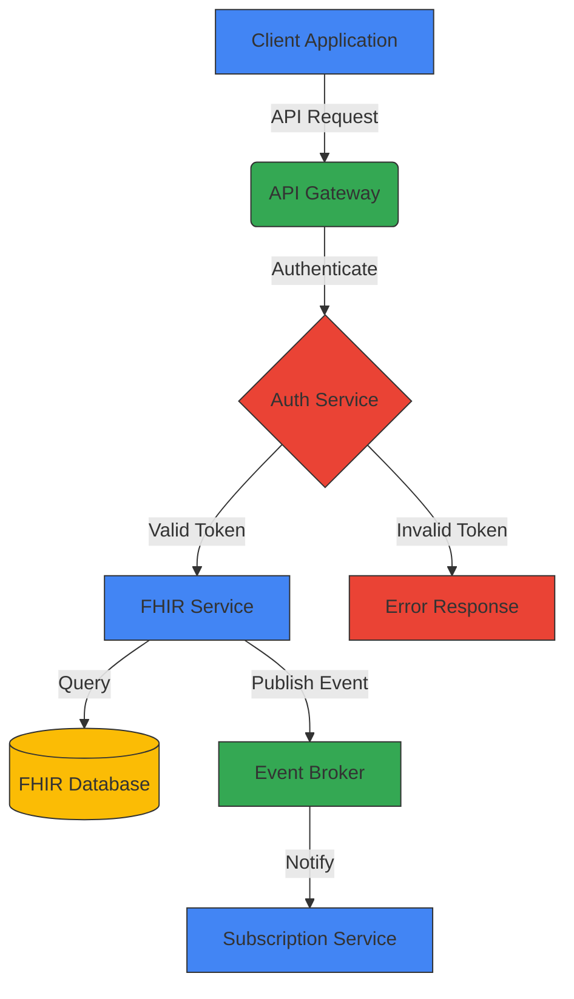
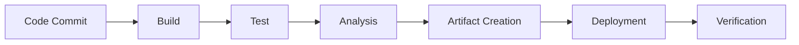

# Core Component Documentation Standards

## Introduction

This document defines the mandatory standards for all CMM Technology Platform core component documentation. These standards ensure consistency, completeness, and quality across all components, making the documentation more accessible and useful for developers, architects, and other stakeholders. All contributors **must** follow these standards when creating or updating documentation.

## Documentation Structure

### Tier-Based Organization

All core components **must** follow a consistent 5-tier documentation structure. No exceptions or deviations are permitted without explicit approval from the architecture team.

1. **01-getting-started**: Introduction, quick start guides, and basic concepts
   - Purpose: Help new users understand the component and get started quickly
   - Target audience: New developers, architects, and stakeholders
   - Required files: overview.md, quick-start.md, key-concepts.md, architecture.md

2. **02-core-functionality**: Core features, main APIs, and primary use cases
   - Purpose: Document the core capabilities and interfaces of the component
   - Target audience: Developers implementing or integrating with the component
   - Required files: core-apis.md, data-model.md, integration-points.md

3. **03-advanced-patterns**: Advanced usage patterns, integrations, and complex scenarios
   - Purpose: Document advanced usage scenarios and extension mechanisms
   - Target audience: Experienced developers customizing or extending the component
   - Required files: advanced-use-cases.md, extension-points.md, customization.md

4. **04-governance-compliance**: Governance frameworks, compliance considerations, and security controls
   - Purpose: Document governance, security, and compliance aspects
   - Target audience: Security specialists, compliance officers, and architects
   - Required files: access-controls.md, data-governance.md, audit-compliance.md, regulatory-compliance.md

5. **05-operations**: Deployment, monitoring, scaling, and maintenance
   - Purpose: Document operational aspects of the component
   - Target audience: DevOps engineers, SREs, and system administrators
   - Required files: deployment.md, monitoring.md, scaling.md, troubleshooting.md, maintenance.md

### Folder Structure

Each component must maintain the following folder structure:

```
/docs/architecture/core_components/[component-name]/
├── 01-getting-started/
│   ├── overview.md
│   ├── quick-start.md
│   ├── key-concepts.md
│   └── architecture.md
├── 02-core-functionality/
│   ├── core-apis.md
│   ├── data-model.md
│   ├── integration-points.md
│   └── [feature-specific-docs].md
├── 03-advanced-patterns/
│   ├── advanced-use-cases.md
│   ├── extension-points.md
│   ├── customization.md
│   └── [pattern-specific-docs].md
├── 04-governance-compliance/
│   ├── access-controls.md
│   ├── data-governance.md
│   ├── audit-compliance.md
│   ├── regulatory-compliance.md
│   └── [additional-governance-docs].md
└── 05-operations/
    ├── deployment.md
    ├── monitoring.md
    ├── scaling.md
    ├── troubleshooting.md
    └── maintenance.md
```

## Document Templates and Content Guidelines

### Standard Document Structure

All documentation **must** adhere to the following structure:

1. **Title (H1)**: Clear, descriptive title using the format `# [Component Name] [Document Topic]`
   - Example: `# FHIR Interoperability Platform Architecture`
   - Must be the first element in the document
   - Must be the only H1 heading in the document

2. **Introduction (H2)**: Brief overview of the document's purpose and scope
   - Must begin with `## Introduction`
   - Should be 2-4 paragraphs explaining what the document covers and why it matters
   - Should identify the target audience
   - Should not exceed 200 words

3. **Main Content (H2/H3/H4)**: Organized in logical sections with clear hierarchical headings
   - Use H2 (`##`) for main sections
   - Use H3 (`###`) for subsections
   - Use H4 (`####`) for detailed topics within subsections
   - Each heading should be concise and descriptive
   - Headings should follow a logical progression
   - Section titles should not reference technology unless it is the primary focus

4. **Code Examples**: All technical documents must include TypeScript code examples
   - Use fenced code blocks with language specification: \```typescript
   - Include comments to explain complex code
   - Ensure code examples are complete and runnable when possible
   - Include error handling, monitoring, and observability in code examples
   - **Use TypeScript for all web and Node.js related code examples**

5. **Diagrams**: Complex concepts should be illustrated with diagrams
   - Use mermaid diagrams for consistency
   - Include both the diagram and the source code
   - Diagrams should have clear labels and a logical flow
   - Include a brief explanation of the diagram

6. **Conclusion or Summary (H2)**: Recap of key points
   - Should begin with `## Summary` or `## Conclusion`
   - Should highlight the most important takeaways
   - Should not introduce new information

7. **Related Resources (H2)**: Links to related documentation
   - Must begin with `## Related Resources`
   - Should include links to related documents within the component
   - Should include links to relevant documents in other components
   - Use relative links when linking to other documents in the repository

### Content Focus and Avoiding Redundancy

To ensure documentation is focused, effective, and minimizes redundancy, follow these principles:

1. **Single Responsibility Principle**
   - Each document must have a clear, singular focus
   - If a document covers multiple topics, consider splitting it into separate documents
   - The document's title and introduction should clearly define its scope

2. **Cross-Reference Instead of Duplicate**
   - Never duplicate content across multiple documents
   - Use links to reference information in other documents
   - Format links as `[descriptive text](relative/path/to/document.md)`
   - Ensure all links are valid and point to the correct location

3. **Component-Specific Content**
   - Focus on component-specific implementations rather than general concepts
   - When discussing general concepts, relate them directly to the component
   - Avoid lengthy explanations of industry-standard concepts
   - Link to authoritative external resources for general concepts

4. **Appropriate Detail Level**
   - Match the detail level to the document's purpose and audience
   - Getting-started documents should be high-level and accessible
   - Technical documents should include detailed explanations and code examples
   - Operations documents should include step-by-step procedures

5. **Consistent Terminology**
   - Use consistent terminology across all documents
   - Define terms on first use with a clear, concise definition
   - Follow industry-standard terminology when applicable
   - Maintain a glossary of terms in the key-concepts.md document

### Communication and Documentation

### Communication Platform Standards

All documentation must reference Microsoft Teams as the standard communication platform:

- Use "Microsoft Teams channel" instead of "Slack channel" in all documentation
- Use "teams_configs" instead of "slack_configs" in all monitoring configurations
- Use "teams" instead of "slack" in notification channel references
- Use the "teams" field instead of "slack" in team contact information

### What Should and Should Not Be Included

The following guidelines help determine what content belongs in each document:

| Document Type | Should Include | Should Not Include |
|--------------|----------------|-------------------|
| Overview | Component purpose, key features, high-level architecture, primary use cases | Detailed implementation, code examples, configuration details |
| Architecture | Component design, internal structure, data flow, integration points | Detailed code examples, step-by-step tutorials, operational procedures |
| API Documentation | API endpoints, parameters, return values, error codes, usage examples | Internal implementation details, deployment procedures, general concepts |
| Tutorials | Step-by-step instructions, specific use cases, expected outcomes | Comprehensive API references, architectural details, theoretical concepts |
| Reference Architecture | System-wide architecture, component relationships, design patterns, architectural decisions | Component-specific implementation details, code examples, operational procedures |

Reference architecture documentation should be reserved for system-wide architectural documentation and should not be duplicated in component-specific documentation. Component documentation should reference the system architecture rather than reproducing it.

### Section-Specific Templates

#### 01-getting-started

**overview.md**
```markdown
# [Component Name] Overview

## Introduction

[Brief description of the component, its purpose, and its role in the CMM Technology Platform]

## Key Features

- [Feature 1]
- [Feature 2]
- [Feature 3]

## Architecture Overview

[High-level architecture diagram and description]

```mermaid
[Diagram code]
```

## Integration Points

[Brief overview of how this component integrates with other components]

## Use Cases

[Primary use cases for this component]

## Getting Started

[Brief instructions on how to get started, with links to more detailed docs]
```

#### 04-governance-compliance

**access-controls.md**

# Access Control and Security Policies

## Introduction

[Overview of access control and security for this component]

## Access Control Model

[Description of the access control model]

### Role-Based Access Control

[Details on RBAC implementation]

### Authentication Mechanisms

[Authentication methods supported]

## Security Policies

[Security policies and their implementation]

## Implementation Examples

```typescript
// Example code for implementing access controls
```

## Best Practices

[Best practices for security and access control]

## Compliance Considerations

[How these controls support compliance requirements]
```

## Content Standards

### Writing Style

All documentation **must** follow these writing style guidelines:

- **Clear and Concise Language**
  - Use simple, direct language
  - Avoid jargon and unnecessary technical terms
  - Explain complex concepts in simple terms
  - Keep sentences short (25 words or less)
  - Use bullet points for lists and steps

- **Consistent Tense and Voice**
  - Write in present tense ("The system sends a message" not "The system will send a message")
  - Use active voice ("The component processes the request" not "The request is processed by the component")
  - Use second person ("you") when addressing the reader in instructional content
  - Use imperative mood for instructions ("Click the button" not "You should click the button")

- **Formatting and Structure**
  - Use headings to organize content hierarchically
  - Keep paragraphs short (3-5 sentences)
  - Use bold for emphasis sparingly
  - Use code formatting for code elements, file names, and technical terms
  - Define acronyms on first use: "Health Level Seven (HL7) FHIR"

- **Inclusive Language**
  - Use gender-neutral language
  - Avoid culturally specific metaphors or idioms
  - Consider international audiences (avoid region-specific terms)
  - Follow the [Microsoft Writing Style Guide](https://learn.microsoft.com/en-us/style-guide/welcome/) for inclusive language

### Code Examples

All technical documentation **must** include code examples that follow these guidelines:

- **Language and Format**
  - **Use TypeScript for all web and Node.js related code examples**
  - Use strongly-typed interfaces and classes
  - Use the vendor's preferred language only when TypeScript is not available
  - Always specify the language in code blocks: ```typescript
  - Format code according to the [Google TypeScript Style Guide](https://google.github.io/styleguide/tsguide.html)

- **Quality and Completeness**
  - Ensure code examples are complete and runnable when possible
  - Include imports and dependencies
  - Use realistic variable and function names
  - Include proper error handling
  - Include comments to explain complex logic
  - Show both the happy path and error handling

- **Best Practices**
  - Follow modern TypeScript best practices
  - Include monitoring and observability
  - Demonstrate proper security practices
  - Show proper resource cleanup
  - When showing examples for paid services (e.g., Confluent Kafka, Azure, Aidbox, MuleSoft, Apollo GraphOS, Okta), leverage vendor-specific features that reduce operational overhead

- **Example Structure**
  - Start with a brief explanation of what the code does
  - Show the complete code example
  - Explain key parts of the code after the example
  - Include expected output or behavior where appropriate

### Diagrams

All documentation that describes architecture, workflows, or complex concepts **must** include diagrams that follow these guidelines:

- **Diagram Format**
  - Use mermaid diagrams for all technical diagrams
  - Use the latest stable version of mermaid syntax
  - Include both the rendered diagram and the source code
  - Format mermaid code blocks as ```mermaid

- **Design Principles**
  - Keep diagrams simple and focused on one concept
  - Limit the number of elements to improve readability
  - Use a logical flow (typically left-to-right or top-to-bottom)
  - Group related elements together
  - Use consistent colors and shapes across all diagrams

- **Visual Standards**
  - Use the following color scheme:
    - Core components: #00426A (navy)
    - External systems: #E70665 (magenta)
    - Data stores: #FF8F1D (yellow)
    - Security elements: #1E91D6 (blue)
  - Use consistent shapes:
    - Rectangles for services and components
    - Cylinders for databases
    - Hexagons for external systems
    - Diamonds for decision points

- **Annotations and Labels**
  - Include clear, concise labels for all elements
  - Add brief descriptions for complex interactions
  - Include a legend when using multiple types of elements
  - Add a title that describes the diagram's purpose

- **Example Mermaid Diagram**



## Implementation and Compliance

### Documentation Review Process

All documentation changes must go through a formal review process to ensure compliance with these standards:

1. **Self-Review Checklist**
   - Before submitting documentation, authors must complete a self-review using the [Documentation Standards Checklist](../templates/documentation-checklist.md)
   - The checklist must be included in the pull request description

2. **Peer Review**
   - All documentation changes require at least one review from a peer
   - Reviewers must verify compliance with these standards
   - Reviewers should use the Documentation Standards Checklist as a guide

3. **Technical Accuracy Review**
   - Documentation for technical components requires a review from a subject matter expert
   - The technical reviewer must verify the accuracy of all technical content
   - Code examples must be validated for correctness and adherence to best practices

4. **Final Approval**
   - Documentation changes require final approval from a documentation maintainer
   - Maintainers are responsible for ensuring consistency across all documentation

### Tools and Automation

The following tools and automation are in place to help maintain documentation standards:

1. **Markdown Linting**
   - All markdown files are automatically linted using markdownlint
   - Configuration is in the `.markdownlint.json` file in the repository root
   - Pull requests will fail CI checks if linting errors are present

2. **Documentation Structure Validation**
   - Automated checks verify the required folder structure and files
   - Pull requests will fail CI checks if required files are missing

3. **Link Validation**
   - Automated checks verify that all internal links are valid
   - Broken links must be fixed before merging

4. **Template Generator**
   - Use the template generator script to create new documentation files:
   - `node scripts/create-doc-template.js <component-name> <doc-type> <file-name>`
   - Example: `node scripts/create-doc-template.js fhir-interoperability-platform 01-getting-started overview.md`

### Handling Exceptions

In rare cases, exceptions to these standards may be necessary. The process for handling exceptions is:

1. **Exception Request**
   - Submit an exception request to the architecture team
   - Include a detailed justification for the exception
   - Specify which standards cannot be met and why

2. **Review and Approval**
   - The architecture team will review the exception request
   - Exceptions require approval from at least two architecture team members
   - Approved exceptions will be documented in the implementation tracking document

3. **Documentation**
   - All approved exceptions must be documented in the affected files
   - Include a comment at the top of the file explaining the exception
   - Reference the exception approval in the pull request

### Measuring Compliance

Compliance with documentation standards is measured and tracked:

1. **Documentation Coverage Report**
   - A weekly report shows documentation coverage for each component
   - Coverage is measured as a percentage of required documents that exist
   - The report is available in the documentation dashboard

2. **Quality Metrics**
   - Documentation quality is measured using automated tools
   - Metrics include readability scores, broken links, and linting errors
   - Quality scores are included in the documentation dashboard

3. **Implementation Tracking**
   - The [Implementation Tracking](implementation-tracking.md) document tracks progress toward full compliance
   - Each component is assessed for compliance with these standards
   - The tracking document is updated monthly

## Deployable Objects Documentation

### Overview

Each core component produces specific deployable objects that must be clearly documented. This section outlines the required documentation for each component's deployable objects.

### Required Deployable Object Documentation

All core components must include documentation about their deployable objects in the following locations:

1. **01-getting-started/release-lifecycle.md**: Must include a section titled "Deployable Objects" that describes the primary artifacts produced by the component
2. **05-operations/deployment.md**: Must include detailed deployment procedures specific to the component's deployable objects

### Component-Specific Deployable Objects

| Component | Primary Deployable Objects | Required Documentation |
|-----------|----------------------------|------------------------|
| FHIR Interoperability Platform | FHIR Implementation Guides, Profiles | Profile authoring, validation, and publishing process |
| API Marketplace | API Definitions, Portal | API definition format, validation, and gateway integration |
| Event Broker | Event Schemas, Topics | Schema definition, compatibility rules, topic configuration |
| Design System | Web Components, Style Libraries | Component packaging, versioning, and consumption |
| Federated Graph API | GraphQL Schemas, Subgraphs | Schema definition, composition rules, gateway configuration |
| Workflow Orchestration Engine | Workflow Definitions, Connectors | Workflow authoring, testing, and deployment process |

### CI/CD Pipeline Documentation

Each component must document its CI/CD pipeline for deployable objects, including:

1. **Build Process**: How deployable objects are built from source
2. **Validation Process**: How deployable objects are validated
3. **Packaging Process**: How deployable objects are packaged
4. **Deployment Process**: How deployable objects are deployed
5. **Rollback Process**: How deployable objects can be rolled back

This documentation must be included in the **05-operations/deployment.md** file.

## Required Documentation by Component

### Common Required Documents and Content Boundaries

All components must include the following documentation, with clear content boundaries to minimize redundancy:

#### 01-getting-started
- **overview.md**
  - *Should include*: Component purpose, business value, key features, high-level architecture diagram, primary use cases
  - *Should not include*: Detailed implementation, code examples, configuration details
  
- **quick-start.md**
  - *Should include*: Prerequisites, installation steps, basic configuration, simple example
  - *Should not include*: Advanced configurations, detailed architecture, comprehensive API reference
  
- **key-concepts.md**
  - *Should include*: Core terminology, fundamental concepts, mental models, design principles
  - *Should not include*: Implementation details, code examples, operational procedures
  
- **architecture.md**
  - *Should include*: Component design, internal structure, data flow, integration points, design decisions
  - *Should not include*: Step-by-step tutorials, detailed code examples, deployment procedures
  - *Cross-reference*: Reference the system-wide architecture documentation rather than duplicating it
  
- **release-lifecycle.md**
  - *Should include*: Lifecycle stages, versioning strategy, release planning, change management
  - *Should not include*: Detailed implementation, code examples, component architecture

#### 02-core-functionality
- **core-apis.md**
  - *Should include*: API endpoints, parameters, return values, error codes, usage examples
  - *Should not include*: Internal implementation details, deployment procedures, general concepts
  
- **data-model.md**
  - *Should include*: Data structures, schemas, relationships, constraints, examples
  - *Should not include*: API details, implementation code, deployment configurations
  
- **integration-points.md**
  - *Should include*: Integration interfaces, protocols, patterns, examples, limitations
  - *Should not include*: Internal implementation details, deployment procedures

#### 03-advanced-patterns
- **advanced-use-cases.md**
  - *Should include*: Complex scenarios, advanced configurations, specialized use cases
  - *Should not include*: Basic usage covered in quick-start, internal implementation details
  
- **extension-points.md**
  - *Should include*: Extension mechanisms, plugin architecture, customization points, examples
  - *Should not include*: Basic usage, internal implementation details not relevant to extension
  
- **customization.md**
  - *Should include*: Configuration options, theming, branding, behavior modifications
  - *Should not include*: Extension mechanisms (covered in extension-points.md), basic usage

#### 04-governance-compliance
- **access-controls.md**
  - *Should include*: Access control model, authentication mechanisms, authorization framework
  - *Should not include*: Audit logging (covered in audit-compliance.md), general security concepts
  
- **data-governance.md**
  - *Should include*: Data classification, lifecycle, quality controls, protection mechanisms
  - *Should not include*: Access controls (covered in access-controls.md), general data concepts
  
- **audit-compliance.md**
  - *Should include*: Audit framework, event types, data collection, log protection
  - *Should not include*: Access controls (covered in access-controls.md), general security concepts
  
- **regulatory-compliance.md**
  - *Should include*: Regulatory framework, HIPAA/GDPR implementation, compliance monitoring
  - *Should not include*: General security concepts, implementation details not related to compliance
  
- **versioning-policy.md**
  - *Should include*: Semantic versioning, API versioning, schema versioning, breaking changes policy
  - *Should not include*: Release process (covered in release-lifecycle.md), implementation details

#### 05-operations
- **deployment.md**
  - *Should include*: Cloud-native deployment using container orchestration on Azure's cloud platforms. Use Infrastructure as Code for automation but avoid on-premise scenarios.
  - *Should not include*: Development setup (covered in quick-start.md), monitoring details
  
- **monitoring.md**
  - *Should include*: Metrics, logging, alerting, dashboards, health checks using Open Telemetry.
  - *Should not include*: Deployment procedures, troubleshooting steps
  
- **scaling.md**
  - *Should include*: Scaling strategies, performance considerations, capacity planning
  - *Should not include*: Basic deployment, monitoring details
  
- **troubleshooting.md**
  - *Should include*: Common issues, diagnostics, resolution steps, support process
  - *Should not include*: Monitoring setup (covered in monitoring.md), deployment procedures
  
- **maintenance.md**
  - *Should include*: Backup/restore, upgrades, patches, routine maintenance tasks
  - *Should not include*: Deployment procedures, monitoring details
  
- **ci-cd-pipeline.md**
  - *Should include*: High-level CI/CD pipeline details, focusing on automated builds, integrated testing, containerized deployments, and continuous monitoring without delving into detailed technology implementations.
  - *Should not include*: Detailed implementation code, general CI/CD concepts
  
- **testing-strategy.md**
  - *Should include*: Test types, environments, data management, automation, coverage requirements
  - *Should not include*: CI/CD pipeline details (covered in ci-cd-pipeline.md), implementation code

### Component-Specific Required Documents

Each component has additional required documentation specific to its functionality. Clear content boundaries are defined to minimize redundancy.

#### API Marketplace
- **api-registration.md** (02-core-functionality)
  - *Should include*: Registration process, metadata requirements, validation rules, versioning
  - *Should not include*: API discovery details, general marketplace concepts
  
- **api-discovery.md** (02-core-functionality)
  - *Should include*: Search mechanisms, filtering, categorization, discovery API
  - *Should not include*: Registration process (covered in api-registration.md)
  
- **lifecycle-management.md** (04-governance-compliance)
  - *Should include*: API lifecycle stages, transitions, approvals, deprecation process
  - *Should not include*: General versioning (covered in versioning-policy.md), registration process
  
- **data-quality.md** (04-governance-compliance)
  - *Should include*: Quality metrics, validation rules, quality enforcement, monitoring
  - *Should not include*: General data governance (covered in data-governance.md)


#### Federated Graph API
- **schema-federation.md** (02-core-functionality)
  - *Should include*: Federation model, schema stitching, composition, conflict resolution
  - *Should not include*: Query details (covered in query-resolution.md)
  
- **query-resolution.md** (02-core-functionality)
  - *Should include*: Query planning, execution, optimization, distributed resolution
  - *Should not include*: Schema details (covered in schema-federation.md)
  
- **schema-governance.md** (04-governance-compliance)
  - *Should include*: Schema approval, validation, versioning, deprecation
  - *Should not include*: Federation mechanics (covered in schema-federation.md)
  
- **query-governance.md** (04-governance-compliance)
  - *Should include*: Query validation, rate limiting, complexity analysis, security
  - *Should not include*: Resolution mechanics (covered in query-resolution.md)

#### FHIR Interoperability Platform
- **fhir-resources.md** (02-core-functionality)
  - *Should include*: Resource types, structure, validation, extensions
  - *Should not include*: Operations details (covered in fhir-operations.md)
  
- **fhir-operations.md** (02-core-functionality)
  - *Should include*: CRUD operations, search, transactions, operations framework
  - *Should not include*: Resource details (covered in fhir-resources.md)
  
- **resource-governance.md** (04-governance-compliance)
  - *Should include*: Resource validation, conformance, profiles, extensions governance
  - *Should not include*: General data governance (covered in data-governance.md)
  
- **interoperability-standards.md** (04-governance-compliance)
  - *Should include*: Supported standards, implementation guides, conformance testing
  - *Should not include*: Resource details (covered in fhir-resources.md)

#### Event Broker
- **topic-management.md** (02-core-functionality)
  - *Should include*: Topic creation, configuration, partitioning, retention
  - *Should not include*: Message patterns (covered in message-patterns.md)
  
- **message-patterns.md** (02-core-functionality)
  - *Should include*: Pub/sub, request/reply, event sourcing, stream processing
  - *Should not include*: Topic management (covered in topic-management.md)
  
- **schema-registry-management.md** (04-governance-compliance)
  - *Should include*: Schema registration, validation, evolution, compatibility
  - *Should not include*: Topic governance (covered in topic-governance.md)
  
- **topic-governance.md** (04-governance-compliance)
  - *Should include*: Topic naming conventions, access policies, lifecycle management
  - *Should not include*: Schema details (covered in schema-registry-management.md)
  
- **data-retention-archiving.md** (04-governance-compliance)
  - *Should include*: Retention policies, archiving strategies, data lifecycle
  - *Should not include*: Topic management (covered in topic-management.md)

### Reference Architecture Documentation

The reference architecture documentation should be maintained separately from component-specific documentation and should focus on system-wide architecture, patterns, and decisions.

- **system-architecture.md**
  - *Should include*: Overall system architecture, component relationships, data flows
  - *Should not include*: Component-specific implementation details
  
- **design-principles.md**
  - *Should include*: Architectural principles, patterns, standards, guidelines
  - *Should not include*: Component-specific implementation details
  
- **integration-patterns.md**
  - *Should include*: System-wide integration patterns, protocols, standards
  - *Should not include*: Component-specific integration details
  
- **security-architecture.md**
  - *Should include*: System-wide security architecture, controls, patterns
  - *Should not include*: Component-specific security implementation
  
- **compliance-framework.md**
  - *Should include*: System-wide compliance approach, standards, requirements
  - *Should not include*: Component-specific compliance implementation

## Implementation Plan

### Phase 1: Assessment and Gap Analysis

1. **Inventory Current Documentation**
   - Create an inventory of existing documentation for each component
   - Identify gaps compared to the required documentation list
   - Assess quality and consistency of existing documentation
   - Flag documentation that doesn't align with the standardization guidelines

2. **Identify Redundant or Misaligned Documentation**
   - Identify documentation with overlapping content
   - Detect documentation that violates the content boundaries
   - Map existing documentation to the standardized structure
   - Create a list of documents that need to be removed, combined, or restructured

3. **Prioritize Documentation Needs**
   - Identify critical documentation gaps to address first
   - Prioritize based on user needs and component importance
   - Prioritize restructuring of misaligned documentation
   - Create a prioritized backlog of documentation tasks

### Phase 2: Template and Standards Development

1. **Finalize Templates**
   - Create detailed templates for each document type
   - Develop style guide and writing standards
   - Create example documents that demonstrate best practices

2. **Establish Review Process**
   - Define documentation review workflow
   - Identify reviewers for technical accuracy and style consistency
   - Create review checklists

### Phase 3: Documentation Restructuring and Updates

1. **Create Missing Documentation**
   - Assign documentation tasks to appropriate team members
   - Follow templates and standards
   - Conduct regular progress reviews

2. **Update Existing Documentation**
   - Revise existing documentation to follow new standards
   - Ensure consistency across all documents
   - Address any gaps in content

3. **Remove or Combine Redundant Documentation**
   - Archive documentation that is being replaced or is obsolete
   - Extract valuable content from redundant documents before removal
   - Combine overlapping documentation according to content boundaries
   - Redirect links from removed documents to their replacements

4. **Restructure Misaligned Documentation**
   - Split documents that cover too many topics
   - Reorganize content to align with defined content boundaries
   - Move content to appropriate documents based on the standardization plan
   - Update cross-references to maintain proper document relationships

### Phase 4: Review and Quality Assurance

1. **Technical Review**
   - Review all documentation for technical accuracy
   - Ensure code examples are correct and functional
   - Verify architectural descriptions

2. **Style and Consistency Review**
   - Review for adherence to style guidelines
   - Ensure consistent terminology
   - Check formatting and structure

3. **Cross-Reference Check**
   - Verify links between documents
   - Ensure consistent information across documents
   - Check for duplication or contradictions

### Phase 5: Publication and Maintenance

1. **Documentation Publication**
   - Publish updated documentation
   - Announce changes to stakeholders
   - Collect initial feedback

2. **Establish Maintenance Process**
   - Define process for ongoing documentation updates
   - Integrate documentation updates into development workflow
   - Assign documentation ownership

## Release Lifecycle and Operations Documentation Standards

### Release Lifecycle Documentation

All `release-lifecycle.md` files must include:

1. **Lifecycle Stages**: Defined stages in the component's lifecycle (e.g., planning, development, testing, release, maintenance, deprecation)
2. **Versioning Strategy**: Semantic versioning approach and version numbering scheme
3. **Release Planning**: How releases are planned and scheduled
4. **Change Management**: Process for managing and approving changes
5. **Release Approval**: Criteria and process for approving releases
6. **Rollback Procedures**: Process for rolling back problematic releases
7. **Release Communication**: How releases and changes are communicated

```markdown
# Release Lifecycle

## Introduction

[Brief overview of the component's release lifecycle and its importance]

## Lifecycle Stages

### Planning
[Description of planning stage activities and deliverables]

### Development
[Description of development stage activities and deliverables]

### Testing
[Description of testing stage activities and deliverables]

### Release
[Description of release stage activities and deliverables]

### Maintenance
[Description of maintenance stage activities and deliverables]

### Deprecation
[Description of deprecation stage activities and deliverables]

## Versioning Strategy

[Explanation of semantic versioning (MAJOR.MINOR.PATCH) and how it's applied]

### Version Numbering

- **Major Version**: [When and why major versions are incremented]
- **Minor Version**: [When and why minor versions are incremented]
- **Patch Version**: [When and why patch versions are incremented]

## Release Planning

[Description of the release planning process, including roadmap development, prioritization, and scheduling]

## Change Management

[Description of the change management process, including change request, evaluation, approval, and implementation]

## Release Approval

[Description of the release approval process, including criteria, stakeholders, and gates]

## Rollback Procedures

[Description of the rollback procedures, including triggers, process, and verification]

## Release Communication

[Description of how releases and changes are communicated to stakeholders]
```

### Versioning Policy Documentation

All `versioning-policy.md` files must include:

1. **Semantic Versioning**: Detailed explanation of semantic versioning implementation
2. **API Versioning**: How APIs are versioned and backward compatibility is maintained
3. **Schema Versioning**: How data schemas are versioned and evolved
4. **Dependency Management**: How dependencies are managed and updated
5. **Breaking Changes**: Policy for handling breaking changes
6. **Version Lifecycle**: Support policy for different versions
7. **Implementation Examples**: Code examples showing versioning implementation

```markdown
# Versioning Policy

## Introduction

[Brief overview of the component's versioning policy and its importance]

## Semantic Versioning

[Detailed explanation of semantic versioning (MAJOR.MINOR.PATCH) implementation]

### Version Increment Rules

- **MAJOR version**: [Rules for incrementing major version]
- **MINOR version**: [Rules for incrementing minor version]
- **PATCH version**: [Rules for incrementing patch version]

## API Versioning

[How APIs are versioned and how backward compatibility is maintained]

### API Version Identification

[How API versions are identified (URI path, query parameter, header, etc.)]

### API Deprecation Process

[Process for deprecating APIs, including notification, timeline, and migration support]

## Schema Versioning

[How data schemas are versioned and evolved]

### Schema Compatibility Rules

[Rules for ensuring schema compatibility across versions]

### Schema Migration

[Process for migrating data between schema versions]

## Dependency Management

[How dependencies are managed and updated]

### Dependency Version Constraints

[Guidelines for specifying dependency version constraints]

### Dependency Update Process

[Process for updating dependencies, including evaluation, testing, and implementation]

## Breaking Changes

[Policy for handling breaking changes]

### Breaking Change Identification

[How breaking changes are identified and categorized]

### Breaking Change Approval

[Process for approving breaking changes]

### Breaking Change Communication

[How breaking changes are communicated to stakeholders]

## Version Lifecycle

[Support policy for different versions]

### Version Support Periods

[Duration of support for different version types]

### End-of-Life Process

[Process for ending support for a version]

## Implementation Examples

```typescript
// Example code showing versioning implementation
```
```

### CI/CD Pipeline Documentation

All `ci-cd-pipeline.md` files must include:

1. **Pipeline Overview**: High-level overview of the CI/CD pipeline
2. **Pipeline Stages**: Detailed description of each pipeline stage
3. **Automation Tools**: Tools used for automation
4. **Build Process**: How the component is built
5. **Deployment Process**: How the component is deployed
6. **Environment Management**: How different environments are managed
7. **Pipeline Security**: Security controls in the pipeline

```markdown
# CI/CD Pipeline

## Introduction

[Brief overview of the component's CI/CD pipeline and its importance]

## Pipeline Overview

[High-level overview of the CI/CD pipeline, including a diagram]



## Pipeline Stages

### Code Commit

[Description of the code commit stage, including branch policies and code review process]

### Build

[Description of the build stage, including build tools, configuration, and artifacts]

### Test

[Description of the test stage, including types of tests, test environments, and success criteria]

### Analysis

[Description of the analysis stage, including code quality, security scanning, and compliance checks]

### Artifact Creation

[Description of the artifact creation stage, including packaging, versioning, and storage]

### Deployment

[Description of the deployment stage, including deployment strategies, environments, and approvals]

### Verification

[Description of the verification stage, including smoke tests, monitoring, and rollback triggers]

## Automation Tools

[Description of the tools used for automation, including CI/CD platform, build tools, test frameworks, etc.]

## Build Process

[Detailed description of how the component is built, including dependencies, configuration, and optimization]

## Deployment Process

[Detailed description of how the component is deployed, including deployment strategies, configuration, and validation]

## Environment Management

[Description of how different environments (dev, test, staging, production) are managed]

### Environment Configuration

[How environment-specific configuration is managed]

### Environment Promotion

[Process for promoting changes between environments]

## Pipeline Security

[Description of security controls in the pipeline, including secrets management, access control, and vulnerability scanning]

### Vendor Tooling
- Leverage vendor-specific solutions such as OpenTelemetry for distributed tracing and metrics collection, Dynatrace for performance monitoring, ELK for general logging, and Splunk for security logging (where applicable). Evaluate and integrate vendor tools as needed to meet operations, governance, and compliance requirements.
```

### Testing Strategy Documentation

All `testing-strategy.md` files must include:

1. **Testing Approach**: Overall approach to testing
2. **Test Types**: Types of tests performed (unit, integration, functional, etc.)
3. **Test Environments**: Environments used for testing
4. **Test Data Management**: How test data is managed
5. **Test Automation**: Approach to test automation
6. **Test Coverage**: Requirements for test coverage
7. **Test Reporting**: How test results are reported

```markdown
# Testing Strategy

## Introduction

[Brief overview of the component's testing strategy and its importance]

## Testing Approach

[Overall approach to testing, including testing principles, priorities, and goals]

## Test Types

### Unit Testing

[Description of unit testing approach, tools, and requirements]

### Integration Testing

[Description of integration testing approach, tools, and requirements]

### Functional Testing

[Description of functional testing approach, tools, and requirements]

### Performance Testing

[Description of performance testing approach, tools, and requirements]

### Security Testing

[Description of security testing approach, tools, and requirements]

### Compliance Testing

[Description of compliance testing approach, tools, and requirements]

## Test Environments

[Description of environments used for testing, including configuration, data, and access]

## Test Data Management

[Description of how test data is created, managed, and refreshed]

### Test Data Requirements

[Requirements for test data, including coverage, quality, and security]

### Test Data Generation

[Approach to generating test data, including tools and techniques]

## Test Automation

[Approach to test automation, including tools, frameworks, and implementation]

### Automation Framework

[Description of the test automation framework, including architecture, components, and best practices]

### Continuous Testing

[How testing is integrated into the CI/CD pipeline]

## Test Coverage

[Requirements for test coverage, including code coverage, feature coverage, and risk coverage]

### Coverage Metrics

[Metrics used to measure test coverage and targets for each]

### Coverage Reporting

[How test coverage is reported and monitored]

## Test Reporting

[How test results are reported, including formats, tools, and distribution]

### Test Result Analysis

[Process for analyzing test results and identifying issues]

### Test Metrics

[Metrics used to measure testing effectiveness and quality]
```

## Governance and Compliance Documentation Standards

### Access Controls Documentation

All `access-controls.md` files must include:

1. **Access Control Model**: Description of the access control model (RBAC, ABAC, etc.)
2. **Authentication Mechanisms**: Supported authentication methods
3. **Authorization Framework**: How authorization decisions are made
4. **Implementation Examples**: Code examples showing implementation
5. **Security Best Practices**: Recommended security practices
6. **Compliance Mapping**: How controls map to compliance requirements

### Data Governance Documentation

All `data-governance.md` files must include:

1. **Data Classification**: How data is classified and categorized
2. **Data Lifecycle**: How data is managed throughout its lifecycle
3. **Data Quality Controls**: Mechanisms to ensure data quality
4. **Data Protection**: How sensitive data is protected
5. **Implementation Examples**: Code examples showing implementation
6. **Compliance Considerations**: How data governance supports compliance

### Audit Compliance Documentation

All `audit-compliance.md` files must include:

1. **Audit Framework**: Overview of the audit capabilities
2. **Audit Event Types**: Types of events that are audited
3. **Audit Data Collection**: What data is collected for audit events
4. **Audit Log Protection**: How audit logs are protected
5. **Implementation Examples**: Code examples showing implementation
6. **Compliance Reporting**: How audit data supports compliance reporting

### Regulatory Compliance Documentation

All `regulatory-compliance.md` files must include:

1. **Regulatory Framework**: Overview of relevant regulations
2. **HIPAA Compliance**: How HIPAA requirements are addressed
3. **SOC2 Compliance**: How SOC2 requirements are addressed
4. **Sarbanes-Oxley (SOX) Compliance**: How SOX requirements are addressed
5. **Implementation Examples**: Code examples showing implementation
6. **Compliance Monitoring**: How compliance is monitored and reported

## Documentation Validation Checklist

### General Validation

- [ ] Document follows the standard template
- [ ] Clear, descriptive title
- [ ] Introduction explains purpose and scope
- [ ] Content is organized with logical headings
- [ ] Code examples use proper syntax highlighting
- [ ] Diagrams are included where helpful
- [ ] Conclusion summarizes key points
- [ ] Related resources are linked

### Technical Validation

- [ ] Technical information is accurate
- [ ] Code examples are correct and functional
- [ ] Architectural descriptions match actual implementation
- [ ] API references are complete and accurate
- [ ] Integration points are correctly described
- [ ] Security controls are accurately documented

### Style Validation

- [ ] Writing is clear and concise
- [ ] Present tense and active voice are used
- [ ] Terminology is consistent
- [ ] Acronyms are defined on first use
- [ ] No spelling or grammatical errors
- [ ] Formatting is consistent

### Content Boundary Validation

- [ ] Document adheres to defined content boundaries
- [ ] Content is focused on the document's primary purpose
- [ ] No significant overlap with other documents
- [ ] Appropriate cross-references to related documents
- [ ] No content that belongs in other documents
- [ ] Follows the "should include/should not include" guidelines

## Documentation Creation and Maintenance Process

### File Creation and Update Process

1. **Outline-First Approach**
   - Create an outline for the entire file before adding content
   - Generate one section at a time when creating or updating files
   - Add, remove, or update sections incrementally
   - Ensure each section is complete before moving to the next
   - Maintain consistency between sections throughout the process

### Ongoing Maintenance Process

1. **Documentation Ownership**
   - Assign clear ownership for each document
   - Define responsibilities for documentation maintenance
   - Establish accountability for documentation quality
   - Create a documentation ownership matrix

2. **Change Management**
   - Implement version control for all documentation
   - Establish review and approval process for documentation changes
   - Define criteria for when documentation updates are required
   - Track documentation changes alongside code changes

3. **Regular Review Cycle**
   - Schedule periodic reviews of all documentation
   - Prioritize reviews based on component criticality and change frequency
   - Implement a documentation freshness indicator
   - Automate notifications for documentation due for review

4. **Metrics and Reporting**
   - Track documentation coverage across components
   - Measure documentation quality and compliance with standards
   - Report on documentation gaps and improvement opportunities
   - Monitor documentation usage and feedback

### Documentation Tooling

1. **Authoring Tools**
   - Standardize on Markdown for documentation format
   - Provide templates and snippets for common documentation patterns
   - Implement linting tools for documentation quality
   - Support collaborative editing and review

2. **Integration with Development Workflow**
   - Integrate documentation changes into pull request process
   - Implement documentation checks in CI/CD pipeline
   - Automate validation of documentation against standards
   - Link documentation to related code and artifacts

3. **Publishing and Distribution**
   - Implement automated documentation publishing
   - Ensure consistent formatting and presentation
   - Support search and discovery of documentation
   - Enable feedback collection from documentation users

## Conclusion

This documentation standardization plan provides a comprehensive approach to ensuring consistent, high-quality documentation across all components of the CMM Technology Platform. By following this plan, we will create a unified documentation experience that enhances usability, maintainability, and compliance.

The implementation of this plan should be treated as a project with clear phases, responsibilities, and timelines. Regular reviews and updates to the documentation will ensure it remains accurate and valuable as the architecture evolves.

By removing redundant documentation, restructuring misaligned content, and enforcing clear content boundaries, we will create a more maintainable and useful documentation set that better serves the needs of all stakeholders.
