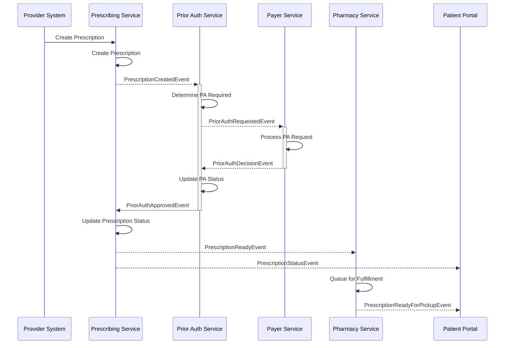

# Event-Driven Architecture Patterns

## Introduction
This document outlines the core event patterns used throughout the CoverMyMeds Technology Platform. These patterns provide standardized approaches for implementing common event-driven scenarios, ensuring consistency, maintainability, and interoperability across all systems using the Event-Driven Architecture capability.

## Event Message Patterns

### Standard Event Envelope

All events in the platform follow a standardized envelope structure to ensure consistency and facilitate processing:

```typescript
interface EventEnvelope<T> {
  metadata: {
    eventId: string;           // Unique identifier for this event instance
    eventType: string;         // Format: "{domain}.{entity}.{action}" e.g., "patient.medication.prescribed"
    eventSource: string;       // System or component that generated the event
    correlationId: string;     // ID linking related events across services
    causationId?: string;      // ID of the event that caused this event (if applicable)
    timestamp: number;         // ISO-8601 timestamp when the event occurred
    version: string;           // Schema version of this event type
    traceId?: string;          // Distributed tracing ID (if applicable)
    partitionKey?: string;     // Optional key for partitioning (defaults to entity ID)
  };
  payload: T;                  // Event-specific payload
}
```

Example of a correctly formatted event:

```json
{
  "metadata": {
    "eventId": "9f7d62e3-383f-4d28-a690-25c3890a13d6",
    "eventType": "medication.prescription.filled",
    "eventSource": "pharmacy-service",
    "correlationId": "5720d7ba-24a2-483a-93b1-3d79927e507e",
    "causationId": "3fa4d17c-8918-42d2-a7a9-3d4c650e8584",
    "timestamp": 1677609600000,
    "version": "1.0.0",
    "traceId": "1234567890abcdef1234567890abcdef"
  },
  "payload": {
    "prescriptionId": "RX12345678",
    "patientId": "P987654321",
    "medicationCode": "12345",
    "medicationName": "Lisinopril 10mg Tablet",
    "quantity": 30,
    "daysSupply": 30,
    "filledAt": "2023-03-01T10:00:00Z",
    "pharmacyId": "PHARM123",
    "prescriberId": "PROV456"
  }
}
```

### Event Naming Standards

Events should be named following a clear, consistent pattern:

1. **Domain**: Business domain or capability (e.g., `patient`, `medication`, `priorauth`)
2. **Entity**: The primary entity involved (e.g., `record`, `prescription`, `request`)
3. **Action**: What happened to the entity (e.g., `created`, `updated`, `approved`)

Examples of well-formed event type names:
- `patient.record.created`
- `medication.prescription.filled`
- `priorauth.request.approved`
- `payment.claim.submitted`
- `provider.profile.updated`

### Event Versioning

All event schemas must be versioned to support evolution:

1. **Semantic Versioning**: Follow semantic versioning (MAJOR.MINOR.PATCH)
2. **Version Field**: Include version in the event metadata
3. **Schema Registry**: Register all schemas in the central Schema Registry
4. **Compatibility Rules**:
   - New optional fields can be added (backward compatible)
   - Fields cannot be removed (would break consumers)
   - Field types cannot be changed (would break consumers)
   - New required fields cannot be added (would break producers)

## Common Healthcare Event Patterns

### Patient Events

Core events related to patient records:

| Event Type | Description | Key Payload Elements |
|------------|-------------|----------------------|
| `patient.record.created` | New patient record created | Patient demographics, identifiers |
| `patient.record.updated` | Patient information updated | Updated fields, reason for update |
| `patient.demographics.changed` | Patient demographics modified | Changed demographic fields |
| `patient.enrolled` | Patient enrolled in a program | Program details, enrollment date |
| `patient.consent.provided` | Patient provided consent | Consent details, scope, expiration |

Sample pattern for patient creation events:

```json
{
  "metadata": {
    "eventId": "05e7fa34-4b77-48f0-99cd-a0eb3f8c6925",
    "eventType": "patient.record.created",
    "eventSource": "patient-service",
    "correlationId": "4a81b7c0-5ea3-4b9f-b146-7a6158ec7cfc",
    "timestamp": 1677609600000,
    "version": "1.0.0"
  },
  "payload": {
    "patientId": "P987654321",
    "firstName": "Jane",
    "lastName": "Doe",
    "dateOfBirth": "1980-05-15",
    "gender": "female",
    "address": {
      "street": "123 Main St",
      "city": "Columbus",
      "state": "OH",
      "postalCode": "43215"
    },
    "phoneNumber": "614-555-1234",
    "email": "jane.doe@example.com",
    "createdBy": "system-import",
    "source": "ehr-integration"
  }
}
```

### Medication Events

Events related to medication prescriptions and fulfillment:

| Event Type | Description | Key Payload Elements |
|------------|-------------|----------------------|
| `medication.prescription.created` | New prescription created | Medication, dosage, patient, prescriber |
| `medication.prescription.filled` | Prescription filled by pharmacy | Fill details, pharmacy, date |
| `medication.prescription.cancelled` | Prescription cancelled | Reason, cancellation date, requester |
| `medication.adherence.reported` | Medication adherence reported | Adherence status, period, source |
| `medication.interaction.detected` | Potential interaction detected | Interacting medications, severity |

Sample pattern for prescription filled events:

```json
{
  "metadata": {
    "eventId": "8d5e1b6f-2a9c-4d7e-b3a5-f89e92e21cf7",
    "eventType": "medication.prescription.filled",
    "eventSource": "pharmacy-service",
    "correlationId": "5720d7ba-24a2-483a-93b1-3d79927e507e",
    "timestamp": 1677609600000,
    "version": "1.0.0"
  },
  "payload": {
    "prescriptionId": "RX12345678",
    "patientId": "P987654321",
    "fillId": "F123456789",
    "fillNumber": 1,
    "medication": {
      "ndc": "12345-6789-10",
      "name": "Lisinopril 10mg Tablet",
      "quantity": 30,
      "daysSupply": 30,
      "directions": "Take 1 tablet by mouth daily"
    },
    "filledAt": "2023-03-01T10:00:00Z",
    "pharmacy": {
      "id": "PHARM123",
      "name": "Community Pharmacy",
      "ncpdpId": "1234567"
    },
    "prescriber": {
      "id": "PROV456",
      "npi": "1234567890",
      "name": "Dr. John Smith"
    },
    "cost": {
      "patientPay": 10.00,
      "insurancePay": 25.50,
      "totalCost": 35.50
    }
  }
}
```

### Prior Authorization Events

Events related to prior authorization workflows:

| Event Type | Description | Key Payload Elements |
|------------|-------------|----------------------|
| `priorauth.request.submitted` | New PA request submitted | Medication, patient, prescriber, payer |
| `priorauth.request.updated` | PA request updated | Updated fields, reason |
| `priorauth.status.approved` | PA request approved | Approval details, effective period |
| `priorauth.status.denied` | PA request denied | Denial reason, appeal options |
| `priorauth.status.pending` | PA requires additional information | Missing information details |

Sample pattern for prior authorization status events:

```json
{
  "metadata": {
    "eventId": "2b1d8f3e-c7a9-4b8a-9e1d-6f3c5a2e7b4d",
    "eventType": "priorauth.status.approved",
    "eventSource": "priorauth-service",
    "correlationId": "7d9e6f3c-5a2e-4b8a-9e1d-2b1d8f3c7a9b",
    "timestamp": 1677609600000,
    "version": "1.0.0"
  },
  "payload": {
    "priorAuthId": "PA98765432",
    "patientId": "P987654321",
    "prescriptionId": "RX12345678",
    "medication": {
      "ndc": "12345-6789-10",
      "name": "Humira 40mg/0.8mL Pen"
    },
    "status": "APPROVED",
    "effectivePeriod": {
      "start": "2023-03-01T00:00:00Z",
      "end": "2024-03-01T00:00:00Z"
    },
    "approvedQuantity": 2,
    "approvedRefills": 11,
    "approvedDaysSupply": 30,
    "payer": {
      "id": "PAYER789",
      "name": "Blue Cross Blue Shield",
      "planId": "BCBS-PPO-123"
    },
    "decisionDate": "2023-02-28T14:30:00Z",
    "decisionBy": "AUTO-RULES",
    "authNumber": "AUTH1234567890"
  }
}
```

### Care Coordination Events

Events related to care coordination and team-based care:

| Event Type | Description | Key Payload Elements |
|------------|-------------|----------------------|
| `care.plan.created` | New care plan created | Plan details, goals, team members |
| `care.team.updated` | Care team membership changed | Added/removed providers, roles |
| `care.task.assigned` | Care task assigned | Task details, assignee, due date |
| `care.task.completed` | Care task completed | Completion details, outcomes |
| `care.communication.sent` | Care-related communication sent | Message details, recipients, channel |

Sample pattern for care plan events:

```json
{
  "metadata": {
    "eventId": "1a2b3c4d-5e6f-7g8h-9i0j-1k2l3m4n5o6p",
    "eventType": "care.plan.created",
    "eventSource": "care-coordination-service",
    "correlationId": "9i8h7g6f-5e4d-3c2b-1a0z-9y8x7w6v5u",
    "timestamp": 1677609600000,
    "version": "1.0.0"
  },
  "payload": {
    "carePlanId": "CP123456789",
    "patientId": "P987654321",
    "title": "Diabetes Management Plan",
    "status": "active",
    "createdDate": "2023-03-01T09:00:00Z",
    "period": {
      "start": "2023-03-01T00:00:00Z",
      "end": "2023-09-01T00:00:00Z"
    },
    "conditions": [
      {
        "code": "E11.9",
        "display": "Type 2 diabetes mellitus without complications"
      }
    ],
    "goals": [
      {
        "id": "GOAL1",
        "description": "Maintain HbA1c below 7.0%",
        "priority": "high"
      },
      {
        "id": "GOAL2",
        "description": "Daily blood glucose monitoring",
        "priority": "medium"
      }
    ],
    "activities": [
      {
        "id": "ACT1",
        "description": "Take Metformin 500mg twice daily",
        "status": "scheduled",
        "type": "medication"
      },
      {
        "id": "ACT2",
        "description": "Weekly nurse check-in call",
        "status": "scheduled",
        "type": "appointment",
        "frequency": "weekly"
      }
    ],
    "careTeam": [
      {
        "providerId": "PROV456",
        "name": "Dr. John Smith",
        "role": "primary care physician"
      },
      {
        "providerId": "PROV789",
        "name": "Jane Johnson, RN",
        "role": "care coordinator"
      }
    ],
    "createdBy": "PROV456"
  }
}
```

## Event Interaction Patterns

### Event Choreography

Event choreography coordinates processes through event exchanges without a central orchestrator:

1. **Service Autonomy**: Each service decides what to do in response to events
2. **Event Sequence**: Process flows proceed through chains of events
3. **Loose Coupling**: Services only know about events, not other services

Example - Medication Prior Authorization Choreography:



### Event Sourcing

Store entity state changes as a sequence of events:

1. **Events as Truth**: Store every state change as an immutable event
2. **Replay**: Reconstruct current state by replaying events
3. **Audit Trail**: Complete history for audit and analysis

Example - Patient Record Event Sourcing:

```typescript
// Event types for patient record
type PatientEvent = 
  | PatientCreatedEvent 
  | PatientDemographicsUpdatedEvent
  | PatientAddressChangedEvent
  | PatientContactInfoChangedEvent
  | PatientPreferencesUpdatedEvent;

// Current state reconstruction
function reconstructPatientState(events: PatientEvent[]): PatientState {
  return events.reduce((state, event) => {
    switch (event.metadata.eventType) {
      case 'patient.record.created':
        return {
          ...event.payload,
          version: 1,
          lastUpdated: event.metadata.timestamp
        };
      case 'patient.demographics.updated':
        return {
          ...state,
          firstName: event.payload.firstName ?? state.firstName,
          lastName: event.payload.lastName ?? state.lastName,
          dateOfBirth: event.payload.dateOfBirth ?? state.dateOfBirth,
          gender: event.payload.gender ?? state.gender,
          version: state.version + 1,
          lastUpdated: event.metadata.timestamp
        };
      case 'patient.address.changed':
        return {
          ...state,
          address: event.payload.address,
          version: state.version + 1,
          lastUpdated: event.metadata.timestamp
        };
      // Handle other event types
      default:
        return state;
    }
  }, null as PatientState);
}
```

### Command-Query Responsibility Segregation (CQRS)

Separate write operations (commands) from read operations (queries):

1. **Command Side**: Handles state changes, emits events
2. **Query Side**: Builds optimized read models from events
3. **Event Bus**: Connects command and query sides

Example - CQRS for Prior Authorization:

```typescript
// Command handler for creating prior authorization request
async function handleCreatePriorAuthCommand(command: CreatePriorAuthCommand): Promise<string> {
  // Validate command
  validateCommand(command);
  
  // Generate ID for new prior auth
  const priorAuthId = generateId();
  
  // Create event
  const event: PriorAuthCreatedEvent = {
    metadata: {
      eventId: uuidv4(),
      eventType: 'priorauth.request.created',
      eventSource: 'priorauth-service',
      correlationId: command.correlationId,
      timestamp: Date.now(),
      version: '1.0.0'
    },
    payload: {
      priorAuthId,
      patientId: command.patientId,
      prescriptionId: command.prescriptionId,
      medication: command.medication,
      providerId: command.providerId,
      payerId: command.payerId,
      status: 'PENDING',
      createdAt: new Date().toISOString()
    }
  };
  
  // Store event
  await eventStore.append('priorauth', priorAuthId, event);
  
  // Return ID
  return priorAuthId;
}

// Query service for prior authorization read model
class PriorAuthQueryService {
  // Get PA summary for patient dashboard
  async getPriorAuthSummaryByPatient(patientId: string): Promise<PriorAuthSummary[]> {
    // Read from optimized read model
    return await readModel.priorAuthSummary.find({ patientId });
  }
  
  // Get detailed PA for admin review
  async getPriorAuthDetail(priorAuthId: string): Promise<PriorAuthDetail> {
    // Read from detailed view model
    return await readModel.priorAuthDetail.findOne({ priorAuthId });
  }
}

// Event handler to update read models
async function handlePriorAuthEvent(event: PriorAuthEvent): Promise<void> {
  const { eventType } = event.metadata;
  const { priorAuthId, patientId } = event.payload;
  
  switch (eventType) {
    case 'priorauth.request.created':
      // Update summary read model
      await readModel.priorAuthSummary.create({
        priorAuthId,
        patientId,
        medicationName: event.payload.medication.name,
        status: event.payload.status,
        createdAt: event.payload.createdAt,
        lastUpdated: event.metadata.timestamp
      });
      
      // Update detailed read model
      await readModel.priorAuthDetail.create({
        ...event.payload,
        events: [omitPayload(event)],
        lastUpdated: event.metadata.timestamp
      });
      break;
      
    case 'priorauth.status.updated':
      // Update summary status
      await readModel.priorAuthSummary.updateOne(
        { priorAuthId },
        { 
          status: event.payload.status,
          lastUpdated: event.metadata.timestamp
        }
      );
      
      // Update detailed model
      await readModel.priorAuthDetail.updateOne(
        { priorAuthId },
        { 
          status: event.payload.status,
          statusReason: event.payload.statusReason,
          lastUpdated: event.metadata.timestamp,
          $push: { events: omitPayload(event) }
        }
      );
      break;
      
    // Handle other event types
  }
}
```

### Saga Pattern

Coordinate distributed transactions using events:

1. **Local Transactions**: Each service performs its own transaction
2. **Compensating Actions**: Rollback transactions that need to be undone
3. **Events as Coordination**: Use events to coordinate the process

Example - Medication Fulfillment Saga:

```typescript
// Saga orchestrator for medication fulfillment
class MedicationFulfillmentSaga {
  async start(prescriptionId: string): Promise<void> {
    try {
      // Step 1: Verify prescription is valid
      const verificationResult = await this.verifyPrescription(prescriptionId);
      if (!verificationResult.success) {
        throw new Error(verificationResult.reason);
      }
      
      // Step 2: Check inventory
      const inventoryResult = await this.checkInventory(prescriptionId);
      if (!inventoryResult.success) {
        // If inventory check fails, no need to compensate previous steps
        throw new Error(inventoryResult.reason);
      }
      
      // Step 3: Process insurance claim
      const claimResult = await this.processInsuranceClaim(prescriptionId);
      if (!claimResult.success) {
        // Compensate for inventory reservation
        await this.releaseInventory(prescriptionId);
        throw new Error(claimResult.reason);
      }
      
      // Step 4: Fill prescription
      const fillResult = await this.fillPrescription(prescriptionId);
      if (!fillResult.success) {
        // Compensate for insurance claim and inventory
        await this.voidInsuranceClaim(prescriptionId);
        await this.releaseInventory(prescriptionId);
        throw new Error(fillResult.reason);
      }
      
      // Step 5: Notify patient
      await this.notifyPatient(prescriptionId);
      
    } catch (error) {
      // Log saga failure
      console.error(`Medication fulfillment saga failed for ${prescriptionId}:`, error);
      
      // Publish saga failure event
      await eventBus.publish({
        metadata: {
          eventId: uuidv4(),
          eventType: 'medication.fulfillment.failed',
          eventSource: 'medication-saga-service',
          correlationId: prescriptionId,
          timestamp: Date.now(),
          version: '1.0.0'
        },
        payload: {
          prescriptionId,
          reason: error.message,
          timestamp: new Date().toISOString()
        }
      });
    }
  }
  
  // Individual saga steps and compensation methods
  private async verifyPrescription(prescriptionId: string): Promise<StepResult> {
    // Implementation details
  }
  
  private async checkInventory(prescriptionId: string): Promise<StepResult> {
    // Implementation details
  }
  
  private async releaseInventory(prescriptionId: string): Promise<void> {
    // Compensation action
  }
  
  // Additional step implementations and compensation actions
}
```

## Best Practices

### Event Design Best Practices

1. **Stateless Events**: Events should be self-contained and not require additional context
2. **Business Focus**: Events should represent business concepts, not technical details
3. **Idempotency**: Event processing should be idempotent (safe to process multiple times)
4. **Ordering**: Use event keys to ensure ordering when needed
5. **Right Size**: Keep events appropriately sized (not too large, not too granular)
6. **Schema Evolution**: Design events for backward compatibility

### Performance Considerations

1. **Batching**: Consider batching for high-volume, low-latency events
2. **Compression**: Use compression for large payloads
3. **Partitioning**: Partition events by a key that allows for parallel processing
4. **Throughput vs. Latency**: Balance throughput and latency requirements
5. **Consumer Scaling**: Scale consumers based on partition count
6. **Back Pressure**: Implement back pressure mechanisms for overload scenarios

### Troubleshooting Guidelines

1. **Event Tracing**: Include correlation and trace IDs for diagnostics
2. **Dead Letter Queues**: Route unprocessable events to dead letter queues
3. **Event Replay**: Support replaying events from any point in time
4. **Monitoring**: Implement comprehensive event flow monitoring
5. **Failure Isolation**: Ensure failures in one consumer don't affect others
6. **Self-Healing**: Design consumers to recover automatically when possible

## Related Documentation
- [Event-Driven Architecture Overview](../01-overview/overview.md)
- [EDA Key Concepts](../01-overview/key-concepts.md)
- [Event Schema Design](./event-schemas.md)
- [Integration Patterns](../01-overview/integration-points.md)